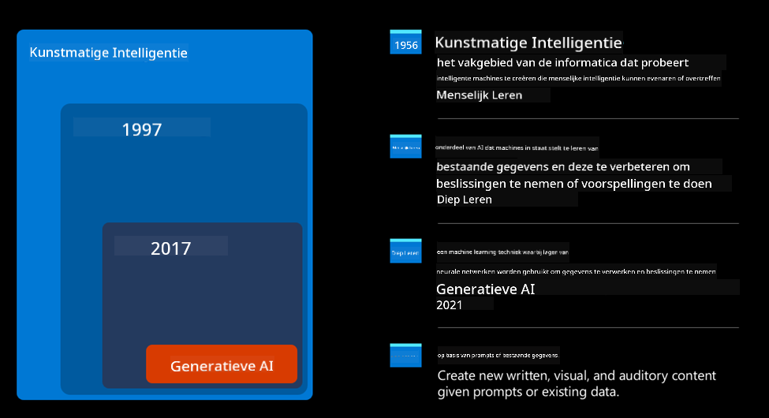
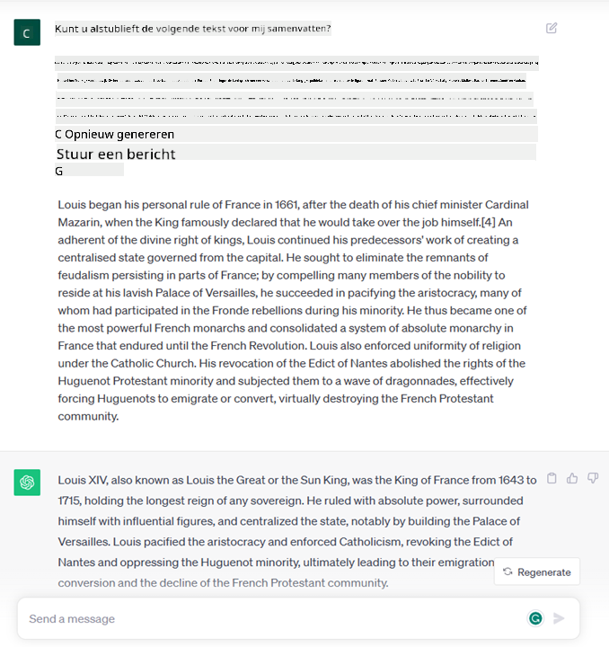
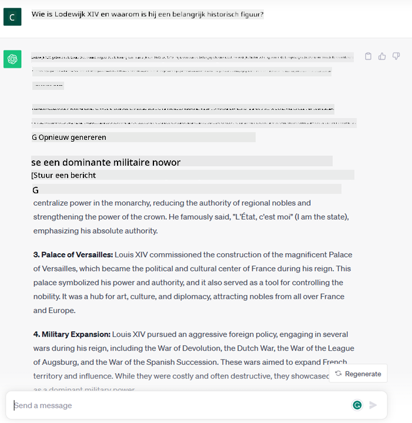
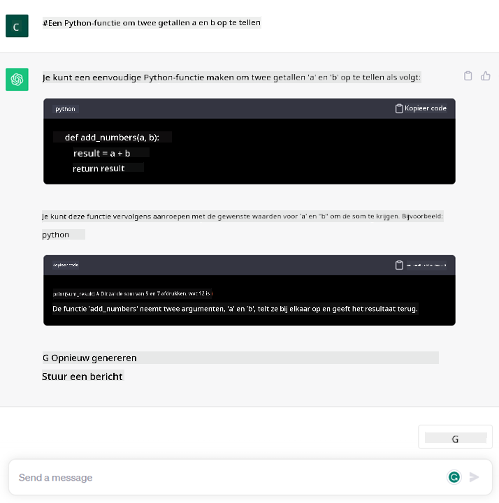

<!--
CO_OP_TRANSLATOR_METADATA:
{
  "original_hash": "f53ba0fa49164f9323043f1c6b11f2b1",
  "translation_date": "2025-07-09T07:56:31+00:00",
  "source_file": "01-introduction-to-genai/README.md",
  "language_code": "nl"
}
-->
# Introductie tot Generatieve AI en Grote Taalmodellen

_(Klik op de afbeelding hierboven om de video van deze les te bekijken)_

Generatieve AI is kunstmatige intelligentie die in staat is om tekst, afbeeldingen en andere soorten content te genereren. Wat deze technologie zo fantastisch maakt, is dat het AI toegankelijk maakt voor iedereen; je hebt alleen een tekstprompt nodig, een zin geschreven in een natuurlijke taal. Je hoeft geen programmeertaal zoals Java of SQL te leren om iets waardevols te bereiken, je gebruikt gewoon je eigen taal, geeft aan wat je wilt en er komt een suggestie uit een AI-model. De toepassingen en impact hiervan zijn enorm: je schrijft of begrijpt rapporten, maakt applicaties en nog veel meer, allemaal binnen enkele seconden.

In dit curriculum onderzoeken we hoe onze startup generatieve AI inzet om nieuwe scenario’s in de onderwijswereld mogelijk te maken en hoe we omgaan met de onvermijdelijke uitdagingen die samenhangen met de maatschappelijke gevolgen van de toepassing en de technologische beperkingen.

## Introductie

Deze les behandelt:

- Introductie van het zakelijke scenario: ons startup-idee en missie.
- Generatieve AI en hoe we zijn gekomen tot het huidige technologische landschap.
- De werking van een groot taalmodel.
- Belangrijkste mogelijkheden en praktische toepassingen van Grote Taalmodellen.

## Leerdoelen

Na het voltooien van deze les begrijp je:

- Wat generatieve AI is en hoe Grote Taalmodellen werken.
- Hoe je grote taalmodellen kunt inzetten voor verschillende toepassingen, met een focus op onderwijsscenario’s.

## Scenario: onze educatieve startup

Generatieve Kunstmatige Intelligentie (AI) vertegenwoordigt het hoogtepunt van AI-technologie en verlegt de grenzen van wat ooit onmogelijk werd geacht. Generatieve AI-modellen hebben diverse mogelijkheden en toepassingen, maar in dit curriculum verkennen we hoe het het onderwijs revolutioneert via een fictieve startup. We noemen deze startup _onze startup_. Onze startup opereert in het onderwijsdomein met de ambitieuze missie:

> _het verbeteren van toegankelijkheid in leren, wereldwijd, met gelijke toegang tot onderwijs en het bieden van gepersonaliseerde leerervaringen aan elke leerling, afgestemd op hun behoeften_.

Ons startupteam is zich ervan bewust dat we dit doel niet kunnen bereiken zonder gebruik te maken van een van de krachtigste tools van deze tijd – Grote Taalmodellen (LLM’s).

Generatieve AI zal naar verwachting de manier waarop we vandaag leren en lesgeven revolutioneren, met studenten die 24 uur per dag virtuele docenten tot hun beschikking hebben die enorme hoeveelheden informatie en voorbeelden bieden, en docenten die innovatieve tools kunnen gebruiken om hun studenten te beoordelen en feedback te geven.

Laten we eerst enkele basisbegrippen en terminologie definiëren die we door het hele curriculum zullen gebruiken.

## Hoe is Generatieve AI ontstaan?

Ondanks de enorme _hype_ die recentelijk is ontstaan door de aankondiging van generatieve AI-modellen, is deze technologie al tientallen jaren in ontwikkeling, met de eerste onderzoeksinspanningen die teruggaan tot de jaren 60. We zijn nu op een punt gekomen waarop AI menselijke cognitieve vaardigheden heeft, zoals conversatie, zoals bijvoorbeeld te zien is bij [OpenAI ChatGPT](https://openai.com/chatgpt) of [Bing Chat](https://www.microsoft.com/edge/features/bing-chat?WT.mc_id=academic-105485-koreyst), dat ook een GPT-model gebruikt voor de webzoekgesprekken van Bing.

Even terug in de tijd: de allereerste AI-prototypes bestonden uit getypte chatbots, die vertrouwden op een kennisdatabase samengesteld door een groep experts en vastgelegd in een computer. De antwoorden in deze database werden geactiveerd door trefwoorden in de invoertekst. Al snel bleek echter dat zo’n aanpak met getypte chatbots niet goed schaalde.

### Een statistische benadering van AI: Machine Learning

Een keerpunt kwam in de jaren 90, met de toepassing van een statistische benadering op tekstanalyse. Dit leidde tot de ontwikkeling van nieuwe algoritmen – bekend als machine learning – die patronen uit data kunnen leren zonder expliciet geprogrammeerd te zijn. Deze aanpak stelt machines in staat om menselijke taal te simuleren: een statistisch model wordt getraind op tekst-label paren, waardoor het model onbekende invoertekst kan classificeren met een vooraf gedefinieerd label dat de intentie van het bericht weergeeft.

### Neurale netwerken en moderne virtuele assistenten

In de afgelopen jaren heeft de technologische vooruitgang in hardware, die grotere hoeveelheden data en complexere berekeningen aankan, het onderzoek naar AI gestimuleerd, wat leidde tot de ontwikkeling van geavanceerde machine learning-algoritmen, bekend als neurale netwerken of deep learning-algoritmen.

Neurale netwerken (en in het bijzonder Recurrent Neural Networks – RNN’s) hebben de natuurlijke taalverwerking aanzienlijk verbeterd, waardoor de betekenis van tekst op een meer betekenisvolle manier kan worden weergegeven, waarbij de context van een woord in een zin wordt meegewogen.

Dit is de technologie die de virtuele assistenten aandreef die in het eerste decennium van deze eeuw zijn ontstaan, zeer bedreven in het interpreteren van menselijke taal, het herkennen van een behoefte en het uitvoeren van een actie om daaraan te voldoen – zoals antwoorden met een vooraf gedefinieerd script of het gebruiken van een externe dienst.

### Heden, Generatieve AI

Zo zijn we gekomen bij Generatieve AI van vandaag, dat kan worden gezien als een subset van deep learning.

Na tientallen jaren onderzoek in het AI-veld, heeft een nieuw modelarchitectuur – genaamd _Transformer_ – de beperkingen van RNN’s overwonnen, doordat het veel langere tekstreeksen als input kan verwerken. Transformers zijn gebaseerd op het aandachtmechanisme, waardoor het model verschillende gewichten kan toekennen aan de input die het ontvangt, ‘meer aandacht gevend’ aan de plekken waar de meest relevante informatie geconcentreerd is, ongeacht hun volgorde in de tekst.

De meeste recente generatieve AI-modellen – ook bekend als Grote Taalmodellen (LLM’s), omdat ze werken met tekstuele input en output – zijn gebaseerd op deze architectuur. Wat interessant is aan deze modellen – getraind op enorme hoeveelheden ongestructureerde data uit diverse bronnen zoals boeken, artikelen en websites – is dat ze kunnen worden aangepast aan een breed scala aan taken en grammaticaal correcte tekst kunnen genereren met een zekere mate van creativiteit. Ze hebben dus niet alleen het vermogen van een machine om een inputtekst ‘te begrijpen’ enorm verbeterd, maar ook hun capaciteit om een originele reactie in menselijke taal te genereren.

## Hoe werken grote taalmodellen?

In het volgende hoofdstuk gaan we verschillende soorten Generatieve AI-modellen verkennen, maar laten we nu eerst kijken hoe grote taalmodellen werken, met een focus op OpenAI GPT (Generative Pre-trained Transformer) modellen.

- **Tokenizer, tekst naar cijfers**: Grote Taalmodellen krijgen een tekst als input en genereren een tekst als output. Omdat het statistische modellen zijn, werken ze veel beter met cijfers dan met tekstreeksen. Daarom wordt elke invoer eerst verwerkt door een tokenizer, voordat het door het kernmodel wordt gebruikt. Een token is een stuk tekst – bestaande uit een variabel aantal tekens, dus de belangrijkste taak van de tokenizer is het splitsen van de invoer in een reeks tokens. Elk token wordt vervolgens gekoppeld aan een tokenindex, wat de numerieke codering is van het oorspronkelijke tekststuk.

- **Voorspellen van output tokens**: Gegeven n tokens als input (met een maximale n die per model verschilt), kan het model één token als output voorspellen. Dit token wordt vervolgens toegevoegd aan de input van de volgende iteratie, in een uitbreidend vensterpatroon, wat zorgt voor een betere gebruikerservaring waarbij je één (of meerdere) zinnen als antwoord krijgt. Dit verklaart waarom, als je ooit met ChatGPT hebt gespeeld, je soms merkt dat het halverwege een zin stopt.

- **Selectieproces, waarschijnlijkheidsverdeling**: Het outputtoken wordt door het model gekozen op basis van de kans dat het volgt op de huidige tekstreeks. Het model voorspelt namelijk een waarschijnlijkheidsverdeling over alle mogelijke ‘volgende tokens’, berekend op basis van de training. Maar niet altijd wordt het token met de hoogste kans gekozen. Er wordt een mate van willekeur toegevoegd aan deze keuze, zodat het model niet-deterministisch werkt – je krijgt niet altijd exact hetzelfde antwoord op dezelfde input. Deze willekeur simuleert het creatieve denkproces en kan worden aangepast met een modelparameter genaamd temperatuur.

## Hoe kan onze startup Grote Taalmodellen inzetten?

Nu we een beter begrip hebben van de werking van een groot taalmodel, bekijken we enkele praktische voorbeelden van de meest voorkomende taken die ze goed kunnen uitvoeren, met het oog op ons zakelijke scenario. We zeiden dat de belangrijkste eigenschap van een Groot Taalmodel is _het genereren van tekst vanaf nul, beginnend met een tekstuele input, geschreven in natuurlijke taal_.

Maar wat voor soort tekstuele input en output?
De input van een groot taalmodel wordt een prompt genoemd, terwijl de output een completion wordt genoemd, een term die verwijst naar het mechanisme van het model om het volgende token te genereren om de huidige input aan te vullen. We gaan dieper in op wat een prompt is en hoe je die zo kunt ontwerpen dat je het maximale uit het model haalt. Maar voor nu zeggen we dat een prompt kan bestaan uit:

- Een **instructie** die het type output specificeert dat we van het model verwachten. Deze instructie kan soms voorbeelden of extra data bevatten.

  1. Samenvatting van een artikel, boek, productrecensies en meer, inclusief het extraheren van inzichten uit ongestructureerde data.
    
    
  
  2. Creatieve ideeën en het ontwerpen van een artikel, essay, opdracht of meer.
      
     

- Een **vraag**, gesteld in de vorm van een gesprek met een agent.
  
  

- Een stuk **tekst om aan te vullen**, wat impliciet een verzoek om schrijfondersteuning is.
  
  

- Een stuk **code** met het verzoek om uitleg en documentatie, of een commentaar waarin gevraagd wordt om een stuk code te genereren dat een specifieke taak uitvoert.
  
  

De bovenstaande voorbeelden zijn vrij eenvoudig en niet bedoeld als een uitputtende demonstratie van de mogelijkheden van Grote Taalmodellen. Ze laten vooral het potentieel zien van het gebruik van generatieve AI, in het bijzonder maar niet uitsluitend in educatieve contexten.

Ook is de output van een generatief AI-model niet perfect en kan de creativiteit van het model soms tegenwerken, wat resulteert in een output die een combinatie is van woorden die de gebruiker kan interpreteren als een mystificatie van de werkelijkheid, of die aanstootgevend kan zijn. Generatieve AI is niet intelligent – althans niet in de bredere definitie van intelligentie, inclusief kritisch en creatief redeneren of emotionele intelligentie; het is niet deterministisch en niet altijd betrouwbaar, omdat verzinsels zoals foutieve verwijzingen, inhoud en uitspraken kunnen worden gecombineerd met correcte informatie en op een overtuigende en zelfverzekerde manier worden gepresenteerd. In de volgende lessen gaan we deze beperkingen behandelen en bekijken we wat we kunnen doen om ze te beperken.

## Opdracht

Je opdracht is om meer te lezen over [generatieve AI](https://en.wikipedia.org/wiki/Generative_artificial_intelligence?WT.mc_id=academic-105485-koreyst) en een gebied te identificeren waar je vandaag generatieve AI zou toevoegen dat het nog niet heeft. Hoe zou de impact verschillen ten opzichte van de “oude manier”? Kun je iets doen wat je eerder niet kon, of ben je sneller? Schrijf een samenvatting van 300 woorden over hoe jouw droom-AI-startup eruit zou zien en voeg kopjes toe zoals "Probleem", "Hoe ik AI zou gebruiken", "Impact" en optioneel een businessplan.

Als je deze taak hebt gedaan, ben je misschien zelfs klaar om je aan te melden bij Microsoft’s incubator, [Microsoft for Startups Founders Hub](https://www.microsoft.com/startups?WT.mc_id=academic-105485-koreyst). We bieden credits voor zowel Azure, OpenAI, mentoring en nog veel meer, neem een kijkje!

## Kennischeck

Wat is waar over grote taalmodellen?

1. Je krijgt elke keer exact hetzelfde antwoord.
1. Het doet alles perfect, is goed in rekenen, produceert werkende code, enzovoort.
1. Het antwoord kan variëren, ook al gebruik je dezelfde prompt. Het is ook erg goed in het geven van een eerste versie van iets, of dat nu tekst of code is. Maar je moet de resultaten verbeteren.

A: 3, een LLM is niet-deterministisch, het antwoord varieert, maar je kunt de variatie sturen met een temperatuurinstelling. Je moet ook niet verwachten dat het alles perfect doet; het is bedoeld om het zware werk voor je te doen, wat vaak betekent dat je een goede eerste poging krijgt die je geleidelijk moet verbeteren.

## Goed gedaan! Ga verder met de reis

Na het voltooien van deze les, bekijk onze [Generative AI Learning collection](https://aka.ms/genai-collection?WT.mc_id=academic-105485-koreyst) om je kennis over Generatieve AI verder te verdiepen!
Ga naar Les 2 waar we zullen bekijken hoe je [verschillende LLM-types kunt verkennen en vergelijken](../02-exploring-and-comparing-different-llms/README.md?WT.mc_id=academic-105485-koreyst)!

**Disclaimer**:  
Dit document is vertaald met behulp van de AI-vertalingsdienst [Co-op Translator](https://github.com/Azure/co-op-translator). Hoewel we streven naar nauwkeurigheid, dient u er rekening mee te houden dat geautomatiseerde vertalingen fouten of onnauwkeurigheden kunnen bevatten. Het originele document in de oorspronkelijke taal moet als de gezaghebbende bron worden beschouwd. Voor cruciale informatie wordt professionele menselijke vertaling aanbevolen. Wij zijn niet aansprakelijk voor eventuele misverstanden of verkeerde interpretaties die voortvloeien uit het gebruik van deze vertaling.