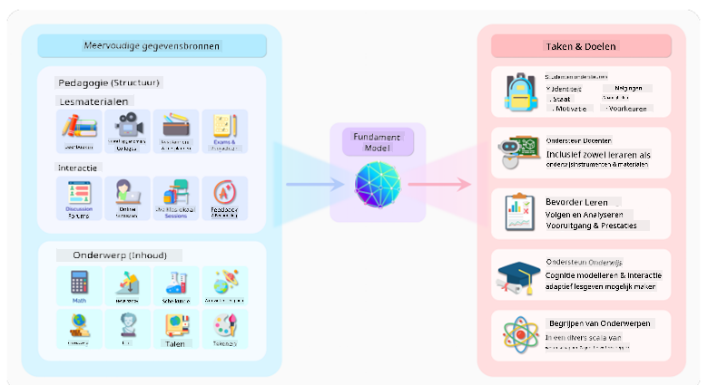
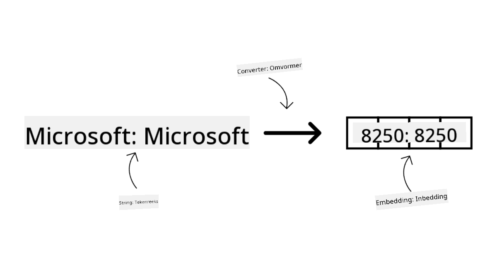
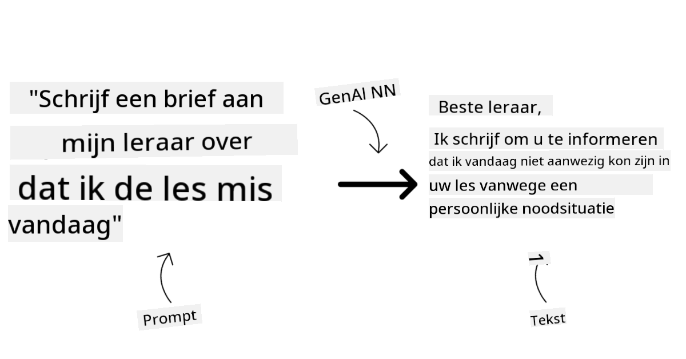
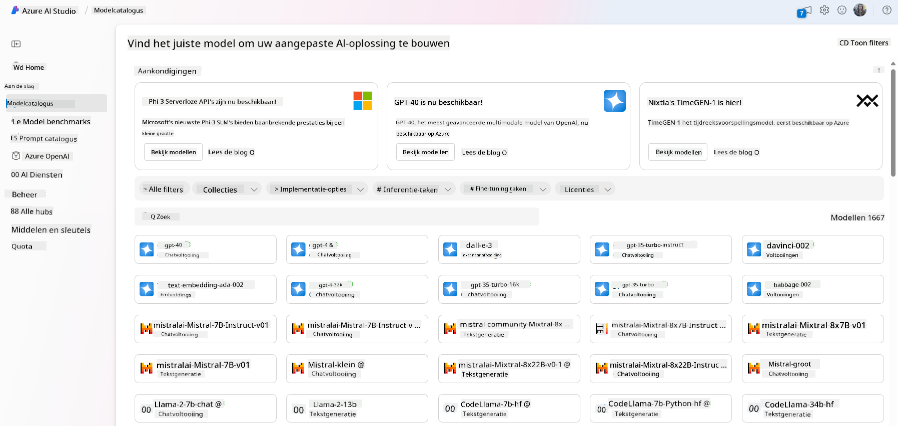
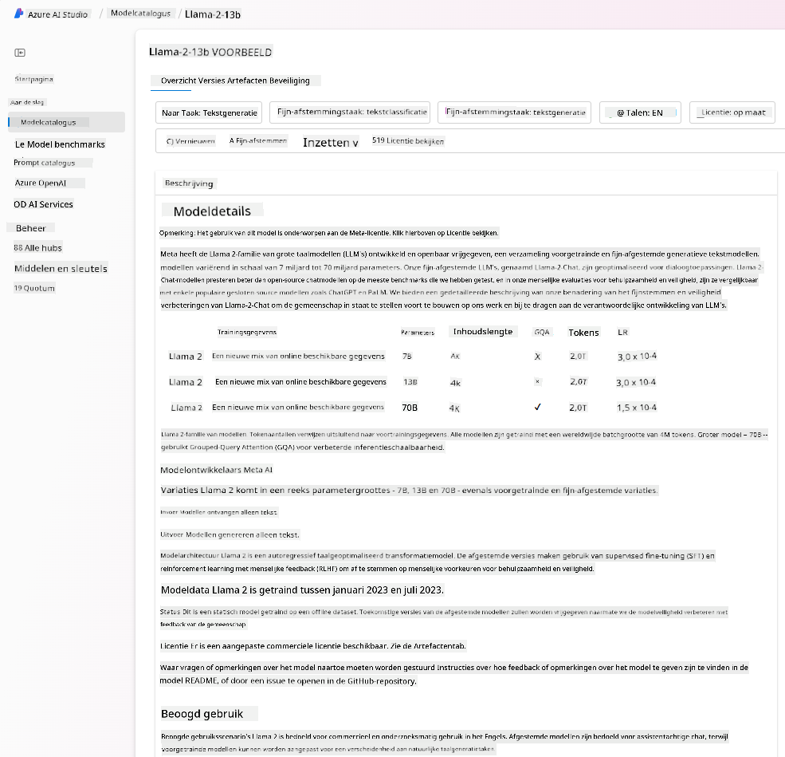
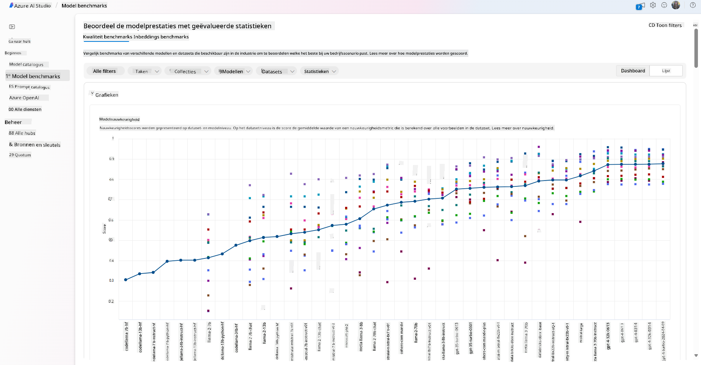
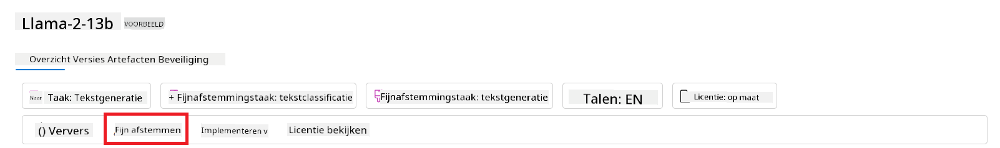
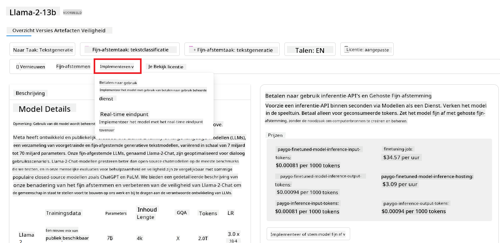

<!--
CO_OP_TRANSLATOR_METADATA:
{
  "original_hash": "e2f686f2eb794941761252ac5e8e090b",
  "translation_date": "2025-05-19T14:09:30+00:00",
  "source_file": "02-exploring-and-comparing-different-llms/README.md",
  "language_code": "nl"
}
-->
# Verkennen en vergelijken van verschillende LLMs

> _Klik op de afbeelding hierboven om de video van deze les te bekijken_

In de vorige les hebben we gezien hoe Generatieve AI het technologielandschap verandert, hoe Large Language Models (LLMs) werken en hoe een bedrijf - zoals onze startup - ze kan toepassen op hun use cases en groeien! In dit hoofdstuk gaan we verschillende soorten grote taalmodellen (LLMs) vergelijken om hun voor- en nadelen te begrijpen.

De volgende stap in de reis van onze startup is het verkennen van het huidige LLM-landschap en begrijpen welke geschikt zijn voor onze use case.

## Inleiding

Deze les behandelt:

- Verschillende soorten LLMs in het huidige landschap.
- Testen, itereren en vergelijken van verschillende modellen voor jouw use case in Azure.
- Hoe een LLM te implementeren.

## Leerdoelen

Na het voltooien van deze les kun je:

- Het juiste model voor jouw use case selecteren.
- Begrijpen hoe je de prestaties van je model kunt testen, itereren en verbeteren.
- Weten hoe bedrijven modellen implementeren.

## Begrijp verschillende soorten LLMs

LLMs kunnen op verschillende manieren worden gecategoriseerd op basis van hun architectuur, trainingsdata en use case. Het begrijpen van deze verschillen helpt onze startup het juiste model voor het scenario te selecteren en te begrijpen hoe de prestaties getest, geïtereerd en verbeterd kunnen worden.

Er zijn veel verschillende soorten LLM-modellen, jouw keuze hangt af van wat je ermee wilt bereiken, jouw data, hoeveel je bereid bent te betalen en meer.

Afhankelijk van of je de modellen wilt gebruiken voor tekst, audio, video, beeldgeneratie, enzovoort, kun je kiezen voor een ander type model.

- **Audio en spraakherkenning**. Voor dit doel zijn Whisper-modellen een uitstekende keuze, omdat ze algemeen bruikbaar zijn en gericht op spraakherkenning. Ze zijn getraind op diverse audio en kunnen meertalige spraakherkenning uitvoeren. Lees meer over [Whisper-modellen hier](https://platform.openai.com/docs/models/whisper?WT.mc_id=academic-105485-koreyst).

- **Beeldgeneratie**. Voor beeldgeneratie zijn DALL-E en Midjourney twee zeer bekende keuzes. DALL-E wordt aangeboden door Azure OpenAI. [Lees meer over DALL-E hier](https://platform.openai.com/docs/models/dall-e?WT.mc_id=academic-105485-koreyst) en ook in Hoofdstuk 9 van dit curriculum.

- **Tekstgeneratie**. De meeste modellen zijn getraind op tekstgeneratie en er zijn veel keuzes van GPT-3.5 tot GPT-4. Ze komen met verschillende kosten, waarbij GPT-4 de duurste is. Het is de moeite waard om de [Azure OpenAI playground](https://oai.azure.com/portal/playground?WT.mc_id=academic-105485-koreyst) te bekijken om te evalueren welke modellen het beste passen bij jouw behoeften qua mogelijkheden en kosten.

- **Multi-modality**. Als je meerdere soorten data in input en output wilt verwerken, kun je kijken naar modellen zoals [gpt-4 turbo met vision of gpt-4o](https://learn.microsoft.com/azure/ai-services/openai/concepts/models#gpt-4-and-gpt-4-turbo-models?WT.mc_id=academic-105485-koreyst) - de nieuwste releases van OpenAI-modellen - die in staat zijn om natuurlijke taalverwerking te combineren met visueel begrip, waardoor interacties via multimodale interfaces mogelijk worden.

Het selecteren van een model betekent dat je enkele basisfunctionaliteiten krijgt, die mogelijk niet voldoende zijn. Vaak heb je bedrijfsspecifieke data die je op een of andere manier aan de LLM moet vertellen. Er zijn een paar verschillende keuzes over hoe je dat kunt aanpakken, meer daarover in de komende secties.

### Foundation Models versus LLMs

De term Foundation Model werd [bedacht door Stanford onderzoekers](https://arxiv.org/abs/2108.07258?WT.mc_id=academic-105485-koreyst) en gedefinieerd als een AI-model dat aan bepaalde criteria voldoet, zoals:

- **Ze zijn getraind met behulp van unsupervised learning of self-supervised learning**, wat betekent dat ze zijn getraind op niet-gelabelde multimodale data en dat ze geen menselijke annotatie of labeling van data vereisen voor hun trainingsproces.
- **Ze zijn zeer grote modellen**, gebaseerd op zeer diepe neurale netwerken getraind op miljarden parameters.
- **Ze zijn normaal gesproken bedoeld als 'fundament' voor andere modellen**, wat betekent dat ze kunnen worden gebruikt als startpunt voor andere modellen die daarop kunnen worden gebouwd, wat kan worden gedaan door middel van fine-tuning.

Beeldbron: [Essential Guide to Foundation Models and Large Language Models | door Babar M Bhatti | Medium](https://thebabar.medium.com/essential-guide-to-foundation-models-and-large-language-models-27dab58f7404)

Om dit onderscheid verder te verduidelijken, laten we ChatGPT als voorbeeld nemen. Om de eerste versie van ChatGPT te bouwen, diende een model genaamd GPT-3.5 als het foundation model. Dit betekent dat OpenAI enkele chat-specifieke data gebruikte om een afgestemde versie van GPT-3.5 te creëren die gespecialiseerd was in het goed presteren in conversatiescenario's, zoals chatbots.

Beeldbron: [2108.07258.pdf (arxiv.org)](https://arxiv.org/pdf/2108.07258.pdf?WT.mc_id=academic-105485-koreyst)

### Open Source versus Proprietary Models

Een andere manier om LLMs te categoriseren is of ze open source of proprietary zijn.

Open-source modellen zijn modellen die beschikbaar worden gesteld aan het publiek en door iedereen kunnen worden gebruikt. Ze worden vaak beschikbaar gesteld door het bedrijf dat ze heeft gecreëerd, of door de onderzoeksgemeenschap. Deze modellen mogen worden geïnspecteerd, aangepast en op maat gemaakt voor de verschillende use cases in LLMs. Ze zijn echter niet altijd geoptimaliseerd voor productiegebruik en zijn mogelijk niet zo performant als proprietary modellen. Bovendien kan de financiering voor open-source modellen beperkt zijn en kunnen ze mogelijk niet lang worden onderhouden of niet worden bijgewerkt met het nieuwste onderzoek. Voorbeelden van populaire open-source modellen zijn [Alpaca](https://crfm.stanford.edu/2023/03/13/alpaca.html?WT.mc_id=academic-105485-koreyst), [Bloom](https://huggingface.co/bigscience/bloom) en [LLaMA](https://llama.meta.com).

Proprietary modellen zijn modellen die eigendom zijn van een bedrijf en niet openbaar worden gemaakt. Deze modellen zijn vaak geoptimaliseerd voor productiegebruik. Ze mogen echter niet worden geïnspecteerd, aangepast of op maat gemaakt voor verschillende use cases. Bovendien zijn ze niet altijd gratis beschikbaar en kan er een abonnement of betaling vereist zijn om ze te gebruiken. Ook hebben gebruikers geen controle over de data die wordt gebruikt om het model te trainen, wat betekent dat ze het model moeten toevertrouwen aan de eigenaar om te zorgen voor data privacy en verantwoord gebruik van AI. Voorbeelden van populaire proprietary modellen zijn [OpenAI modellen](https://platform.openai.com/docs/models/overview?WT.mc_id=academic-105485-koreyst), [Google Bard](https://sapling.ai/llm/bard?WT.mc_id=academic-105485-koreyst) of [Claude 2](https://www.anthropic.com/index/claude-2?WT.mc_id=academic-105485-koreyst).

### Embedding versus Beeldgeneratie versus Tekst- en Codegeneratie

LLMs kunnen ook worden gecategoriseerd op basis van de output die ze genereren.

Embeddings zijn een set van modellen die tekst kunnen omzetten in een numerieke vorm, genaamd embedding, wat een numerieke representatie is van de invoertekst. Embeddings maken het gemakkelijker voor machines om de relaties tussen woorden of zinnen te begrijpen en kunnen worden gebruikt als invoer voor andere modellen, zoals classificatiemodellen of clusteringmodellen die beter presteren op numerieke data. Embedding modellen worden vaak gebruikt voor transfer learning, waarbij een model wordt gebouwd voor een surrogaattaak waarvoor een overvloed aan data is, en vervolgens worden de modelgewichten (embeddings) hergebruikt voor andere downstream taken. Een voorbeeld van deze categorie is [OpenAI embeddings](https://platform.openai.com/docs/models/embeddings?WT.mc_id=academic-105485-koreyst).

Beeldgeneratiemodellen zijn modellen die beelden genereren. Deze modellen worden vaak gebruikt voor beeldbewerking, beeldsynthese en beeldvertaling. Beeldgeneratiemodellen worden vaak getraind op grote datasets van beelden, zoals [LAION-5B](https://laion.ai/blog/laion-5b/?WT.mc_id=academic-105485-koreyst), en kunnen worden gebruikt om nieuwe beelden te genereren of om bestaande beelden te bewerken met inpainting, superresolutie en kleurtechnieken. Voorbeelden zijn [DALL-E-3](https://openai.com/dall-e-3?WT.mc_id=academic-105485-koreyst) en [Stable Diffusion modellen](https://github.com/Stability-AI/StableDiffusion?WT.mc_id=academic-105485-koreyst).

Tekst- en codegeneratiemodellen zijn modellen die tekst of code genereren. Deze modellen worden vaak gebruikt voor tekstsamenvatting, vertaling en vraagbeantwoording. Tekstgeneratiemodellen worden vaak getraind op grote datasets van tekst, zoals [BookCorpus](https://www.cv-foundation.org/openaccess/content_iccv_2015/html/Zhu_Aligning_Books_and_ICCV_2015_paper.html?WT.mc_id=academic-105485-koreyst), en kunnen worden gebruikt om nieuwe tekst te genereren of om vragen te beantwoorden. Codegeneratiemodellen, zoals [CodeParrot](https://huggingface.co/codeparrot?WT.mc_id=academic-105485-koreyst), worden vaak getraind op grote datasets van code, zoals GitHub, en kunnen worden gebruikt om nieuwe code te genereren of om bugs in bestaande code te repareren.

### Encoder-Decoder versus Alleen Decoder

Om te praten over de verschillende soorten architecturen van LLMs, laten we een analogie gebruiken.

Stel je voor dat je manager je de taak geeft om een quiz voor de studenten te schrijven. Je hebt twee collega's; de een houdt zich bezig met het maken van de inhoud en de ander met het beoordelen ervan.

De inhoudmaker is als een Alleen Decoder model, ze kunnen naar het onderwerp kijken en zien wat je al hebt geschreven en dan een cursus schrijven op basis daarvan. Ze zijn erg goed in het schrijven van boeiende en informatieve inhoud, maar ze zijn niet erg goed in het begrijpen van het onderwerp en de leerdoelen. Enkele voorbeelden van Decoder modellen zijn GPT-familie modellen, zoals GPT-3.

De beoordelaar is als een Alleen Encoder model, ze kijken naar de geschreven cursus en de antwoorden, zien de relatie ertussen en begrijpen de context, maar ze zijn niet goed in het genereren van inhoud. Een voorbeeld van een Alleen Encoder model zou BERT zijn.

Stel je voor dat we ook iemand kunnen hebben die zowel de quiz kan maken als beoordelen, dit is een Encoder-Decoder model. Enkele voorbeelden zouden BART en T5 zijn.

### Dienst versus Model

Laten we nu praten over het verschil tussen een dienst en een model. Een dienst is een product dat wordt aangeboden door een Cloud Service Provider en is vaak een combinatie van modellen, data en andere componenten. Een model is de kerncomponent van een dienst en is vaak een foundation model, zoals een LLM.

Diensten zijn vaak geoptimaliseerd voor productiegebruik en zijn vaak gemakkelijker te gebruiken dan modellen, via een grafische gebruikersinterface. Diensten zijn echter niet altijd gratis beschikbaar en kunnen een abonnement of betaling vereisen om te gebruiken, in ruil voor het benutten van de apparatuur en middelen van de dienstverlener, het optimaliseren van uitgaven en het gemakkelijk opschalen. Een voorbeeld van een dienst is [Azure OpenAI Service](https://learn.microsoft.com/azure/ai-services/openai/overview?WT.mc_id=academic-105485-koreyst), die een pay-as-you-go tariefplan biedt, wat betekent dat gebruikers proportioneel worden belast naar gelang hun gebruik van de dienst. Bovendien biedt Azure OpenAI Service beveiliging van bedrijfsniveau en een verantwoord AI-framework bovenop de mogelijkheden van de modellen.

Modellen zijn slechts het Neurale Netwerk, met de parameters, gewichten en andere. Dit stelt bedrijven in staat om lokaal te draaien, maar ze zouden apparatuur moeten kopen, een structuur moeten bouwen om op te schalen en een licentie moeten kopen of een open-source model moeten gebruiken. Een model zoals LLaMA is beschikbaar om te gebruiken, maar vereist rekenkracht om het model te draaien.

## Hoe te testen en itereren met verschillende modellen om prestaties op Azure te begrijpen

Zodra ons team het huidige LLM-landschap heeft verkend en enkele goede kandidaten voor hun scenario's heeft geïdentificeerd, is de volgende stap om ze te testen op hun data en op hun werklast. Dit is een iteratief proces, uitgevoerd door experimenten en metingen.
De meeste modellen die we in eerdere alinea's hebben genoemd (OpenAI-modellen, open source-modellen zoals Llama2 en Hugging Face-transformers) zijn beschikbaar in de [Model Catalogus](https://learn.microsoft.com/azure/ai-studio/how-to/model-catalog-overview?WT.mc_id=academic-105485-koreyst) in [Azure AI Studio](https://ai.azure.com/?WT.mc_id=academic-105485-koreyst).

[Azure AI Studio](https://learn.microsoft.com/azure/ai-studio/what-is-ai-studio?WT.mc_id=academic-105485-koreyst) is een Cloud Platform ontworpen voor ontwikkelaars om generatieve AI-toepassingen te bouwen en de hele ontwikkelingslevenscyclus te beheren - van experimentatie tot evaluatie - door alle Azure AI-diensten in één hub te combineren met een handige GUI. De Model Catalogus in Azure AI Studio stelt de gebruiker in staat om:

- Het Foundation Model van interesse in de catalogus te vinden - of het nu proprietary of open source is, filteren op taak, licentie of naam. Om de doorzoekbaarheid te verbeteren, zijn de modellen georganiseerd in collecties, zoals Azure OpenAI-collectie, Hugging Face-collectie en meer.

- De modelkaart te bekijken, inclusief een gedetailleerde beschrijving van het beoogde gebruik en de trainingsdata, codevoorbeelden en evaluatieresultaten in de interne evaluatiebibliotheek.

- Vergelijk benchmarks tussen modellen en datasets die beschikbaar zijn in de industrie om te beoordelen welke het beste voldoet aan het bedrijfsscenario, via het [Model Benchmarks](https://learn.microsoft.com/azure/ai-studio/how-to/model-benchmarks?WT.mc_id=academic-105485-koreyst) paneel.

- Stem het model af op aangepaste trainingsgegevens om de prestaties van het model in een specifieke werklast te verbeteren, door gebruik te maken van de experimenteer- en volgmogelijkheden van Azure AI Studio.

- Implementeer het originele voorgetrainde model of de fijn afgestemde versie voor een externe real-time inferentie - beheerde compute - of serverloze api-endpoint - [pay-as-you-go](https://learn.microsoft.com/azure/ai-studio/how-to/model-catalog-overview#model-deployment-managed-compute-and-serverless-api-pay-as-you-go?WT.mc_id=academic-105485-koreyst) - om applicaties in staat te stellen het te gebruiken.

> [!NOTE]
> Niet alle modellen in de catalogus zijn momenteel beschikbaar voor fijn afstemmen en/of pay-as-you-go implementatie. Bekijk de modelkaart voor details over de capaciteiten en beperkingen van het model.

## Verbeteren van LLM-resultaten

We hebben met ons startupteam verschillende soorten LLM's en een Cloud Platform (Azure Machine Learning) onderzocht, waarmee we verschillende modellen kunnen vergelijken, evalueren op testgegevens, prestaties kunnen verbeteren en ze kunnen implementeren op inferentie endpoints.

Maar wanneer moeten ze overwegen een model fijn af te stemmen in plaats van een voorgetraind model te gebruiken? Zijn er andere benaderingen om de prestaties van het model in specifieke werklasten te verbeteren?

Er zijn verschillende benaderingen die een bedrijf kan gebruiken om de resultaten te krijgen die ze nodig hebben van een LLM. Je kunt verschillende soorten modellen selecteren met verschillende graden van training bij het implementeren van een LLM in productie, met verschillende niveaus van complexiteit, kosten en kwaliteit. Hier zijn enkele verschillende benaderingen:

- **Prompt engineering met context**. Het idee is om voldoende context te bieden wanneer je een prompt geeft om ervoor te zorgen dat je de antwoorden krijgt die je nodig hebt.

- **Retrieval Augmented Generation, RAG**. Je gegevens kunnen bijvoorbeeld bestaan in een database of webendpoint, om ervoor te zorgen dat deze gegevens, of een subset ervan, worden opgenomen op het moment van prompting, kun je de relevante gegevens ophalen en die deel uitmaken van de prompt van de gebruiker.

- **Fijn afgestemd model**. Hier heb je het model verder getraind op je eigen gegevens, wat ertoe leidt dat het model nauwkeuriger en responsiever is voor jouw behoeften, maar het kan duur zijn.

Img bron: [Four Ways that Enterprises Deploy LLMs | Fiddler AI Blog](https://www.fiddler.ai/blog/four-ways-that-enterprises-deploy-llms?WT.mc_id=academic-105485-koreyst)

### Prompt Engineering met Context

Voorgetrainde LLM's werken erg goed bij algemene natuurlijke taal taken, zelfs door ze aan te roepen met een korte prompt, zoals een zin om te voltooien of een vraag – het zogenaamde "zero-shot" leren.

Hoe meer de gebruiker hun vraag kan kaderen, met een gedetailleerd verzoek en voorbeelden – de Context – hoe nauwkeuriger en dichter bij de verwachtingen van de gebruiker het antwoord zal zijn. In dit geval spreken we van "one-shot" leren als de prompt slechts één voorbeeld bevat en "few-shot learning" als het meerdere voorbeelden bevat.
Prompt engineering met context is de meest kosteneffectieve benadering om mee te beginnen.

### Retrieval Augmented Generation (RAG)

LLM's hebben de beperking dat ze alleen de gegevens kunnen gebruiken die tijdens hun training zijn gebruikt om een antwoord te genereren. Dit betekent dat ze niets weten over de feiten die zich hebben voorgedaan na hun trainingsproces, en ze kunnen geen toegang krijgen tot niet-openbare informatie (zoals bedrijfsgegevens).
Dit kan worden overwonnen door RAG, een techniek die de prompt aanvult met externe gegevens in de vorm van stukken documenten, rekening houdend met de promptlengte limieten. Dit wordt ondersteund door Vector database tools (zoals [Azure Vector Search](https://learn.microsoft.com/azure/search/vector-search-overview?WT.mc_id=academic-105485-koreyst)) die de nuttige stukken ophalen uit verschillende vooraf gedefinieerde gegevensbronnen en toevoegen aan de prompt Context.

Deze techniek is zeer nuttig wanneer een bedrijf niet genoeg gegevens, tijd of middelen heeft om een LLM fijn af te stemmen, maar toch de prestaties op een specifieke werklast wil verbeteren en de risico's van fabricaties wil verminderen, dat wil zeggen, mystificatie van de werkelijkheid of schadelijke inhoud.

### Fijn afgestemd model

Fijn afstemmen is een proces dat transfer learning benut om het model aan te passen aan een downstream taak of om een specifiek probleem op te lossen. Anders dan few-shot learning en RAG, resulteert het in een nieuw model dat wordt gegenereerd, met bijgewerkte gewichten en biases. Het vereist een set van trainingsvoorbeelden bestaande uit een enkele input (de prompt) en de bijbehorende output (de voltooiing).
Dit zou de geprefereerde benadering zijn als:

- **Gebruik van fijn afgestemde modellen**. Een bedrijf zou graag minder capabele fijn afgestemde modellen willen gebruiken (zoals embedding modellen) in plaats van high-performance modellen, wat resulteert in een kosteneffectievere en snellere oplossing.

- **Rekening houden met latentie**. Latentie is belangrijk voor een specifieke use-case, dus het is niet mogelijk om zeer lange prompts te gebruiken of het aantal voorbeelden dat moet worden geleerd van het model past niet binnen de promptlengte limiet.

- **Up-to-date blijven**. Een bedrijf heeft veel hoogwaardige gegevens en grondwaarheidslabels en de middelen die nodig zijn om deze gegevens up-to-date te houden in de loop van de tijd.

### Getraind model

Een LLM vanaf nul trainen is zonder twijfel de moeilijkste en meest complexe benadering om te adopteren, wat enorme hoeveelheden gegevens, vaardige middelen en passende rekenkracht vereist. Deze optie moet alleen worden overwogen in een scenario waarin een bedrijf een domeinspecifiek gebruiksgeval heeft en een grote hoeveelheid domeingerichte gegevens.

## Kennischeck

Wat zou een goede benadering kunnen zijn om LLM-voltooiingsresultaten te verbeteren?

1. Prompt engineering met context
1. RAG
1. Fijn afgestemd model

A:3, als je de tijd en middelen hebt en hoogwaardige gegevens, is fijn afstemmen de betere optie om up-to-date te blijven. Echter, als je dingen wilt verbeteren en je hebt geen tijd, is het de moeite waard om eerst RAG te overwegen.

## 🚀 Uitdaging

Lees meer over hoe je [RAG kunt gebruiken](https://learn.microsoft.com/azure/search/retrieval-augmented-generation-overview?WT.mc_id=academic-105485-koreyst) voor je bedrijf.

## Goed gedaan, Ga Door Met Leren

Na het voltooien van deze les, bekijk onze [Generative AI Learning collectie](https://aka.ms/genai-collection?WT.mc_id=academic-105485-koreyst) om je kennis over Generatieve AI verder te ontwikkelen!

Ga naar Les 3 waar we gaan kijken naar hoe je [verantwoord kunt bouwen met Generatieve AI](../03-using-generative-ai-responsibly/README.md?WT.mc_id=academic-105485-koreyst)!

**Disclaimer**:  
Dit document is vertaald met behulp van de AI-vertalingsdienst [Co-op Translator](https://github.com/Azure/co-op-translator). Hoewel we ons best doen voor nauwkeurigheid, dient u zich ervan bewust te zijn dat geautomatiseerde vertalingen fouten of onnauwkeurigheden kunnen bevatten. Het originele document in zijn oorspronkelijke taal moet worden beschouwd als de gezaghebbende bron. Voor kritieke informatie wordt professionele menselijke vertaling aanbevolen. Wij zijn niet aansprakelijk voor eventuele misverstanden of verkeerde interpretaties die voortvloeien uit het gebruik van deze vertaling.