# Verkennen en vergelijken van verschillende LLM's

[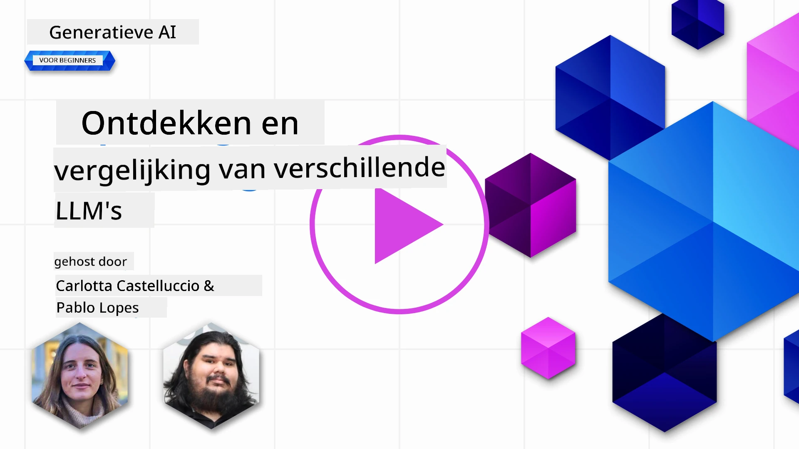](https://youtu.be/KIRUeDKscfI?si=8BHX1zvwzQBn-PlK)

> _Klik op de afbeelding hierboven om de video van deze les te bekijken_

Met de vorige les hebben we gezien hoe Generatieve AI het technologielandschap verandert, hoe Large Language Models (LLM's) werken en hoe een bedrijf - zoals onze startup - ze kan toepassen op hun gebruiksscenario's en kan groeien! In dit hoofdstuk vergelijken we verschillende soorten grote taalmodellen (LLM's) om hun voor- en nadelen te begrijpen.

De volgende stap in onze startup-reis is het verkennen van het huidige landschap van LLM's en begrijpen welke geschikt zijn voor ons gebruiksscenario.

## Introductie

Deze les behandelt:

- Verschillende soorten LLM's in het huidige landschap.
- Testen, itereren en vergelijken van verschillende modellen voor jouw gebruiksscenario in Azure.
- Hoe een LLM te implementeren.

## Leerdoelen

Na het voltooien van deze les kun je:

- Het juiste model selecteren voor jouw gebruiksscenario.
- Begrijpen hoe je het model test, iteratief verbetert en de prestaties optimaliseert.
- Weten hoe bedrijven modellen implementeren.

## Begrijp verschillende soorten LLM's

LLM's kunnen op verschillende manieren worden gecategoriseerd op basis van hun architectuur, trainingsgegevens en gebruiksscenario. Het begrijpen van deze verschillen helpt onze startup het juiste model te selecteren voor de situatie en te begrijpen hoe te testen, itereren en de prestaties te verbeteren.

Er zijn veel verschillende soorten LLM-modellen; jouw keuze hangt af van het doel waarvoor je ze wilt gebruiken, je data, hoeveel je bereid bent te betalen en meer.

Afhankelijk van of je de modellen wilt gebruiken voor tekst, audio, video, beeldgeneratie enzovoort, kies je mogelijk voor een ander type model.

- **Audio- en spraakherkenning**. Whisper-achtige modellen zijn nog steeds bruikbare algemene spraakherkenningsmodellen, maar productiekeuzes omvatten nu ook nieuwere spraak-naar-tekstmodellen zoals `gpt-4o-transcribe`, `gpt-4o-mini-transcribe` en diarization-varianten. Beoordeel taaldekking, diarization, realtime ondersteuning, latentie en kosten voor jouw scenario. Leer meer in de [OpenAI spraak-naar-tekst documentatie](https://platform.openai.com/docs/guides/speech-to-text?WT.mc_id=academic-105485-koreyst).

- **Beeldgeneratie**. DALL-E en Midjourney zijn bekende opties voor beeldgeneratie, maar huidige OpenAI beeld-API's centreren op GPT Image-modellen zoals `gpt-image-2`, terwijl Stable Diffusion, Imagen, Flux en andere modelfamilies ook veel voorkomende keuzes zijn. Vergelijk prompt-naleving, bewerkingsondersteuning, stijlcontrole, veiligheidseisen en licenties. Leer meer in de [OpenAI handleiding voor beeldgeneratie](https://platform.openai.com/docs/guides/images?WT.mc_id=academic-105485-koreyst) en hoofdstuk 9 van deze cursus.

- **Tekstgeneratie**. Tekstmodellen beslaan nu grensverleggende modellen, redeneermodellen, kleinere modellen met lage latentie en open-weight modellen. Voorbeelden zijn OpenAI GPT-5.x modellen, Anthropic Claude 4.x modellen, Google Gemini 3.x modellen, Meta Llama 4 modellen en Mistral modellen. Kies niet alleen op basis van releasedatum of prijs; vergelijk taakkwaliteit, latentie, contextvenster, toolgebruik, veiligheidsgedrag, regionale beschikbaarheid en totale kosten. De [Microsoft Foundry modelcatalogus](https://ai.azure.com/catalog?WT.mc_id=academic-105485-koreyst) is een goede plek om modellen beschikbaar op Azure te vergelijken.

- **Multimodaliteit**. Veel huidige modellen kunnen meer dan alleen tekst verwerken. Sommige accepteren beeld-, audio- of video-invoer; sommige kunnen tools aanroepen; gespecialiseerde modellen kunnen beelden, audio of video genereren. Bijvoorbeeld, huidige OpenAI-modellen ondersteunen tekst- en beeldinvoer, Gemini-modellen kunnen afhankelijk van de variant tekst, code, beeld, audio en video ondersteunen, en Llama 4 Scout en Maverick zijn open-weight native multimodale modellen. Controleer altijd elke modelkaart voor ondersteunde input- en outputmodaliteiten voordat je er een workflow omheen bouwt.

Het selecteren van een model betekent dat je over enkele basisfunctionaliteiten beschikt, maar die zijn mogelijk niet voldoende. Vaak heb je bedrijfs-specifieke data die je op de een of andere manier aan het LLM moet doorgeven. Er zijn een paar verschillende benaderingen om dat aan te pakken, hierover meer in de volgende secties.

### Foundation Models versus LLM's

De term Foundation Model is [bedacht door onderzoekers van Stanford](https://arxiv.org/abs/2108.07258?WT.mc_id=academic-105485-koreyst) en gedefinieerd als een AI-model dat aan bepaalde criteria voldoet, zoals:

- **Ze worden getraind via unsupervised learning of self-supervised learning**, wat betekent dat ze getraind worden op ongeëtiketteerde multimodale data, en geen menselijke annotatie of labeling van data nodig hebben voor het trainingsproces.
- **Het zijn zeer grote modellen**, gebaseerd op zeer diepe neurale netwerken die getraind zijn op miljarden parameters.
- **Ze zijn normaal bedoeld om te dienen als een ‘fundering’ voor andere modellen**, wat betekent dat ze als startpunt kunnen dienen voor het bouwen van andere modellen, bijvoorbeeld door fine-tuning.

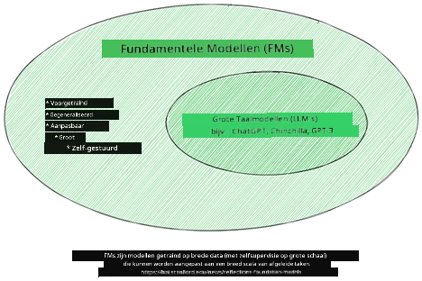

Afbeeldingsbron: [Essential Guide to Foundation Models and Large Language Models | by Babar M Bhatti | Medium
](https://thebabar.medium.com/essential-guide-to-foundation-models-and-large-language-models-27dab58f7404)

Om dit onderscheid verder te verduidelijken, nemen we ChatGPT als historisch voorbeeld. Vroege versies van ChatGPT gebruikten GPT-3.5 als foundation model. OpenAI gebruikte vervolgens chat-specifieke data en alignment-technieken om een getunede versie te maken die beter presteerde in conversatiescenario’s, zoals chatbots. Moderne AI-diensten routeren vaak tussen meerdere modelvarianten, dus de servicenaam en het onderliggende modelnaam zijn niet altijd hetzelfde.

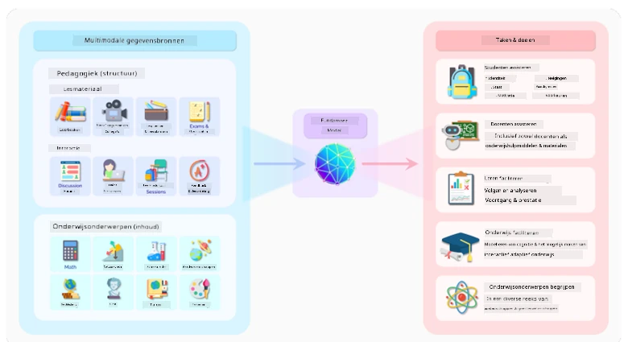

Afbeeldingsbron: [2108.07258.pdf (arxiv.org)](https://arxiv.org/pdf/2108.07258.pdf?WT.mc_id=academic-105485-koreyst)

### Open-weight/Open-source versus Proprietary modellen

Een andere manier om LLM's te categoriseren is op basis van open-weight, open-source of proprietary.

Open-source en open-weight modellen maken modelartefacten beschikbaar voor inspectie, download of aanpassing, maar hun licenties verschillen. Sommige zijn volledig open source, terwijl andere open-weight modellen zijn met gebruiksbeperkingen. Ze kunnen nuttig zijn wanneer een bedrijf meer controle wil over deployment, datalokalisatie, kosten of aanpassing. Teams moeten echter altijd de licentievoorwaarden, servicekosten, onderhoud, beveiligingsupdates en evaluatiekwaliteit beoordelen voordat ze ze in productie gebruiken. Voorbeelden zijn [Meta Llama 4](https://ai.meta.com/blog/llama-4-multimodal-intelligence/?WT.mc_id=academic-105485-koreyst), sommige [Mistral modellen](https://docs.mistral.ai/models/overview?WT.mc_id=academic-105485-koreyst) en veel modellen gehost op [Hugging Face](https://huggingface.co/models?WT.mc_id=academic-105485-koreyst).

Proprietary modellen zijn eigendom van en gehost door een aanbieder. Deze modellen zijn vaak geoptimaliseerd voor beheerd productiegebruik en kunnen sterke ondersteuning, veiligheidssystemen, toolintegratie en schaalbaarheid bieden. Klanten kunnen echter meestal de modelgewichten niet inspecteren of wijzigen en moeten de voorwaarden van de aanbieder beoordelen op privacy, retentie, naleving en acceptabel gebruik. Voorbeelden zijn [OpenAI modellen](https://platform.openai.com/docs/models?WT.mc_id=academic-105485-koreyst), [Google Gemini](https://deepmind.google/models/gemini/pro/?WT.mc_id=academic-105485-koreyst) en [Anthropic Claude](https://platform.claude.com/docs/en/about-claude/models/overview?WT.mc_id=academic-105485-koreyst).

### Embedding versus beeldgeneratie versus tekst- en codegeneratie

LLM's kunnen ook worden gecategoriseerd op basis van de output die ze genereren.

Embeddings zijn een set modellen die tekst kunnen omzetten in een numerieke vorm, een embedding genoemd, wat een numerieke representatie is van de invoertekst. Embeddings maken het gemakkelijker voor machines om de relaties tussen woorden of zinnen te begrijpen en kunnen worden gebruikt als input voor andere modellen, zoals classificatiemodellen of clusteringmodellen die betere prestaties leveren op numerieke data. Embedding-modellen worden vaak gebruikt voor transfer learning, waarbij een model wordt gebouwd voor een surrogate taak waarvoor veel data beschikbaar is, en vervolgens de modelgewichten (embeddings) hergebruikt worden voor andere downstream taken. Een voorbeeld van deze categorie is [OpenAI embeddings](https://platform.openai.com/docs/models/embeddings?WT.mc_id=academic-105485-koreyst).

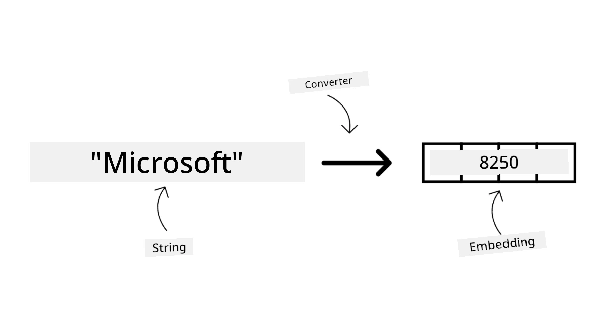

Beeldgeneratiemodellen zijn modellen die beelden genereren. Deze modellen worden vaak gebruikt voor beeldbewerking, beeldsynthese en beeldvertaling. Beeldgeneratiemodellen worden vaak getraind op grote datasets van beelden, zoals [LAION-5B](https://laion.ai/blog/laion-5b/?WT.mc_id=academic-105485-koreyst), en kunnen worden gebruikt om nieuwe beelden te genereren of bestaande beelden te bewerken met technieken zoals inpainting, superresolutie en colorisatie. Voorbeelden zijn [GPT Image modellen](https://platform.openai.com/docs/guides/images?WT.mc_id=academic-105485-koreyst), [Stable Diffusion modellen](https://github.com/Stability-AI/StableDiffusion?WT.mc_id=academic-105485-koreyst) en Imagen modellen.

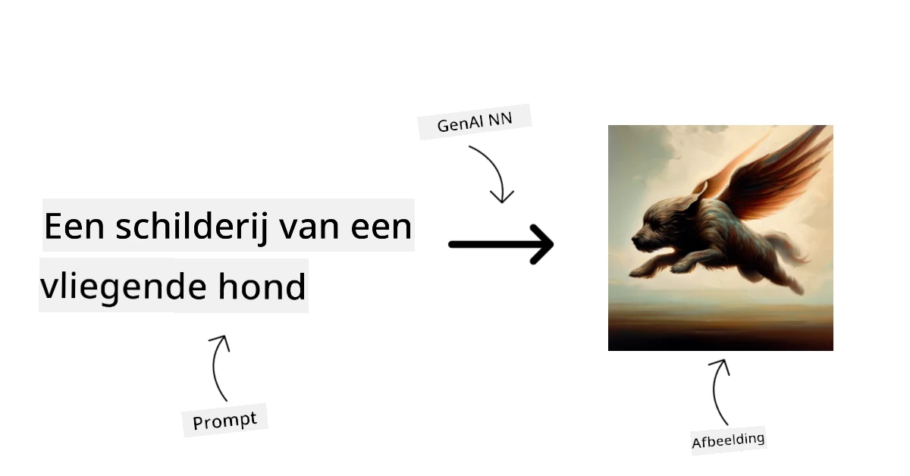

Tekst- en codegeneratiemodellen zijn modellen die tekst of code genereren. Deze modellen worden vaak gebruikt voor tekstsamenvatting, vertaling en vraagbeantwoording. Tekstgeneratiemodellen worden vaak getraind op grote datasets van tekst, zoals [BookCorpus](https://www.cv-foundation.org/openaccess/content_iccv_2015/html/Zhu_Aligning_Books_and_ICCV_2015_paper.html?WT.mc_id=academic-105485-koreyst), en kunnen worden gebruikt om nieuwe tekst te genereren of vragen te beantwoorden. Codegeneratiemodellen, zoals [CodeParrot](https://huggingface.co/codeparrot?WT.mc_id=academic-105485-koreyst), worden vaak getraind op grote datasets van code, zoals GitHub, en kunnen worden gebruikt om nieuwe code te genereren of bugs in bestaande code te herstellen.

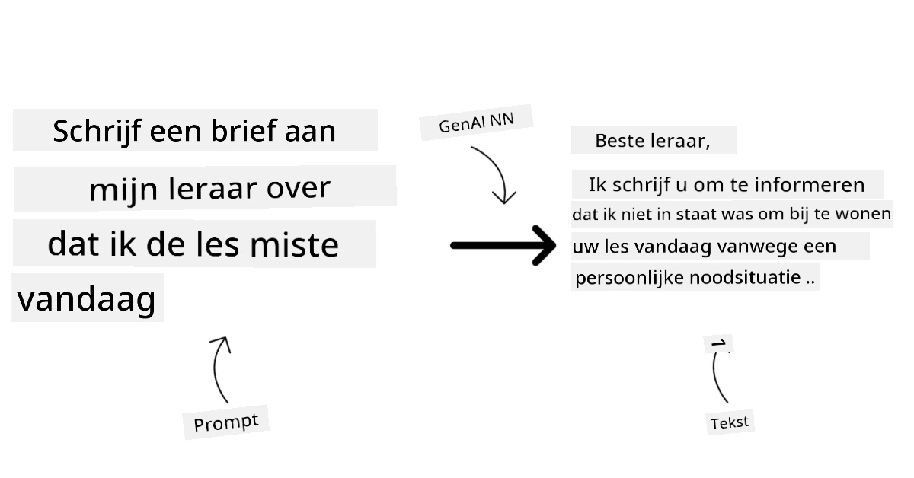

### Encoder-Decoder versus Decoder-only

Om te praten over de verschillende architectuurtypen van LLM's, gebruiken we een analogie.

Stel je voor dat je manager je de taak geeft om een quiz te schrijven voor studenten. Je hebt twee collega's; één houdt toezicht op het maken van de inhoud en de ander op het reviewen ervan.

De inhoudsmaker is als een decoder-only model: ze kunnen naar het onderwerp kijken, zien wat je al hebt geschreven en vervolgens inhoud genereren op basis van die context. Ze zijn erg goed in het schrijven van boeiende en informatieve content, maar ze zijn niet altijd de beste keuze als de taak alleen classificeren, ophalen of coderen van informatie is. Voorbeelden van decoder-only modelfamilies zijn GPT en Llama-modellen.

De reviewer is als een encoder-only model; ze kijken naar de cursusinhoud en de antwoorden, zien de relatie tussen hen en begrijpen de context, maar zijn niet goed in het genereren van inhoud. Een voorbeeld van een encoder-only model is BERT.

Stel je voor dat we ook iemand kunnen hebben die zowel de quiz kan maken als beoordelen, dit is een encoder-decoder model. Enkele voorbeelden zijn BART en T5.

### Service versus Model

Laten we nu praten over het verschil tussen een service en een model. Een service is een product dat wordt aangeboden door een Cloud Service Provider, en is vaak een combinatie van modellen, data en andere componenten. Een model is de kerncomponent van een service, en is vaak een foundation model, zoals een LLM.

Services zijn vaak geoptimaliseerd voor productiegebruik en zijn vaak gemakkelijker te gebruiken dan modellen, via een grafische gebruikersinterface. Services zijn echter niet altijd gratis beschikbaar en kunnen een abonnement of betaling vereisen in ruil voor het gebruik van de apparatuur en middelen van de service-eigenaar, het optimaliseren van kosten en eenvoudige schaalbaarheid. Een voorbeeld van een service is [Azure OpenAI Service](https://learn.microsoft.com/azure/ai-foundry/openai/overview?WT.mc_id=academic-105485-koreyst), die een pay-as-you-go tariefplan aanbiedt, wat betekent dat gebruikers proportioneel betalen naar gelang hun gebruik. Azure OpenAI Service biedt ook beveiliging op ondernemingsniveau en een verantwoord AI-framework bovenop de mogelijkheden van de modellen.

Modellen zijn de neurale netwerkartefacten: parameters, gewichten, architectuur, tokenizer en ondersteunende configuratie. Het draaien van een model lokaal of in een privaat milieu vereist geschikte hardware, serveerinfrastructuur, monitoring en een compatibele open-source/open-weight licentie of een commerciële licentie. Open-weight modellen zoals Llama 4 of Mistral modellen kunnen self-hosted worden, maar vereisen nog steeds rekenkracht en operationele expertise.

## Hoe testen en itereren met verschillende modellen om prestaties op Azure te begrijpen

Zodra ons team het huidige landschap van LLM's heeft verkend en enkele goede kandidaten voor hun scenario's heeft geïdentificeerd, is de volgende stap om ze te testen op hun data en op hun werklast. Dit is een iteratief proces, uitgevoerd door experimenten en metingen.
De meeste modellen die we in voorgaande alinea's noemden (OpenAI-modellen, opengewichtmodellen zoals Llama 4 en Mistral, en Hugging Face-modellen) zijn beschikbaar in [Microsoft Foundry Models](https://learn.microsoft.com/azure/foundry/concepts/foundry-models-overview?WT.mc_id=academic-105485-koreyst).

[Microsoft Foundry](https://learn.microsoft.com/azure/foundry/what-is-foundry?WT.mc_id=academic-105485-koreyst), voorheen Azure AI Studio/Azure AI Foundry, is een uniforme Azure-platform voor het bouwen van AI-apps en agenten. Het helpt ontwikkelaars bij het beheer van de levenscyclus van experimenteren en evalueren tot implementeren, monitoren en governance. De modelcatalogus in Microsoft Foundry stelt de gebruiker in staat om:

- Het basisfoundationmodel van interesse te vinden in de catalogus, inclusief modellen verkocht door Azure en modellen van partners en communityproviders. Gebruikers kunnen filteren op taak, aanbieder, licentie, implementatieoptie of naam.

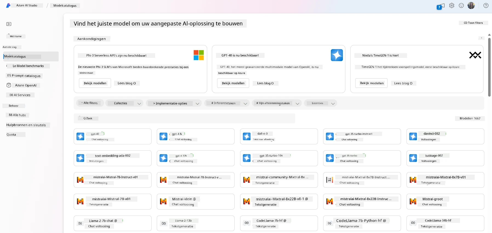

- De modelkaart te bekijken, inclusief een gedetailleerde beschrijving van het beoogde gebruik en trainingsdata, codevoorbeelden en evaluatieresultaten op de interne evaluatiebibliotheek.

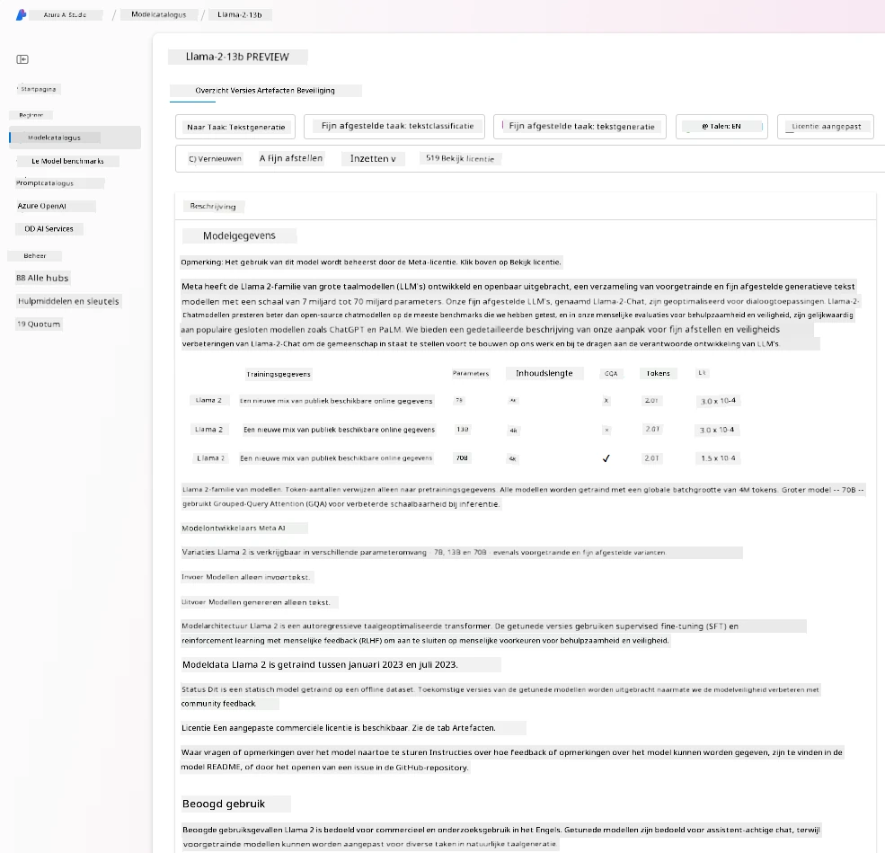

- Benchmarks te vergelijken van modellen en datasets beschikbaar in de industrie om te beoordelen welke het beste aan het business-scenario voldoet, via het [Model Benchmarks](https://learn.microsoft.com/azure/ai-foundry/concepts/model-benchmarks?WT.mc_id=academic-105485-koreyst) paneel.

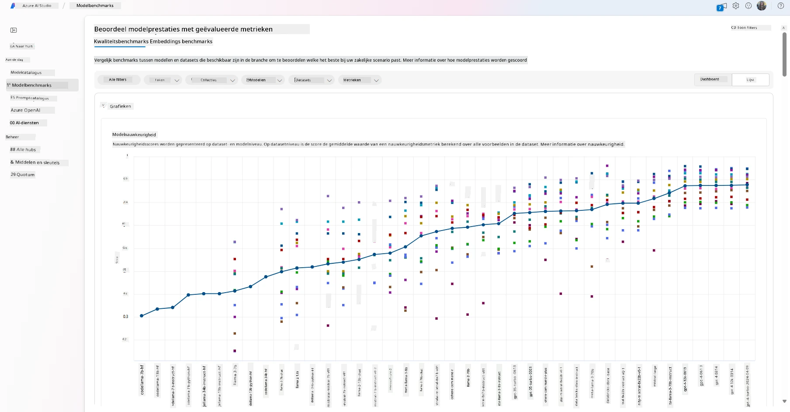

- Ondersteunde modellen te fine-tunen op aangepaste trainingsdata om de modelprestaties in een specifieke werklast te verbeteren, gebruikmakend van de experimentatie- en trackingmogelijkheden van Microsoft Foundry.

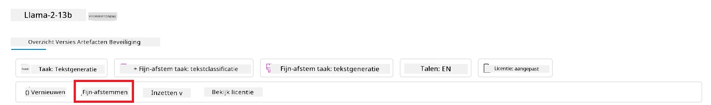

- Het originele voorgetrainde model of de fine-tuned versie te implementeren naar een externe real-time inferentie-endpoint, met beheerde computer- of serverloze implementatieopties, zodat applicaties het kunnen gebruiken.

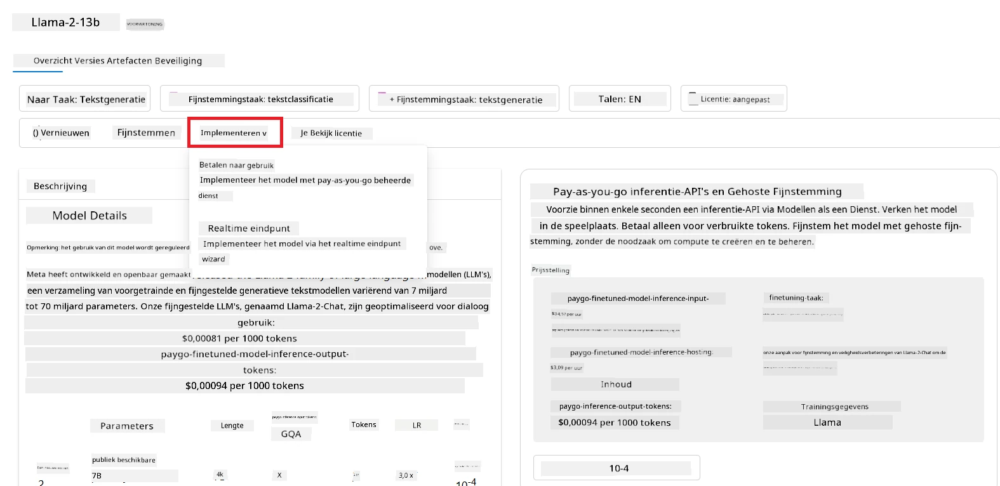

> [!NOTE]
> Niet alle modellen in de catalogus zijn momenteel beschikbaar voor fine-tuning en/of pay-as-you-go-implementatie. Bekijk de modelkaart voor details over de mogelijkheden en beperkingen van het model.

## Verbeteren van LLM-resultaten

We hebben met ons startupteam verschillende soorten LLM's en een cloudplatform (Microsoft Foundry) verkend dat ons in staat stelt verschillende modellen te vergelijken, ze te evalueren op testdata, de prestaties te verbeteren en ze te implementeren op inferentie-endpoints.

Maar wanneer zouden ze overwegen om een model te fine-tunen in plaats van een voorgetraind model te gebruiken? Zijn er andere benaderingen om de modelprestaties op specifieke werklasten te verbeteren?

Er zijn verschillende benaderingen die een bedrijf kan gebruiken om de resultaten te krijgen die ze nodig hebben van een LLM. Je kunt verschillende soorten modellen selecteren met verschillende trainingsniveaus bij het inzetten van een LLM in productie, met verschillende niveaus van complexiteit, kosten en kwaliteit. Hier volgen enkele verschillende benaderingen:

- **Prompt-engineering met context**. Het idee is om voldoende context te bieden bij je prompt om ervoor te zorgen dat je de antwoorden krijgt die je nodig hebt.

- **Retrieval Augmented Generation, RAG**. Je data kan bijvoorbeeld in een database of webendpoint bestaan. Om ervoor te zorgen dat deze data, of een subset daarvan, wordt meegenomen bij het prompten, kun je de relevante data ophalen en dat onderdeel maken van de prompt van de gebruiker.

- **Fine-tuned model**. Hierbij train je het model verder op je eigen data, wat ertoe leidt dat het model nauwkeuriger en responsiever is op je behoeften maar mogelijk kostbaar is.

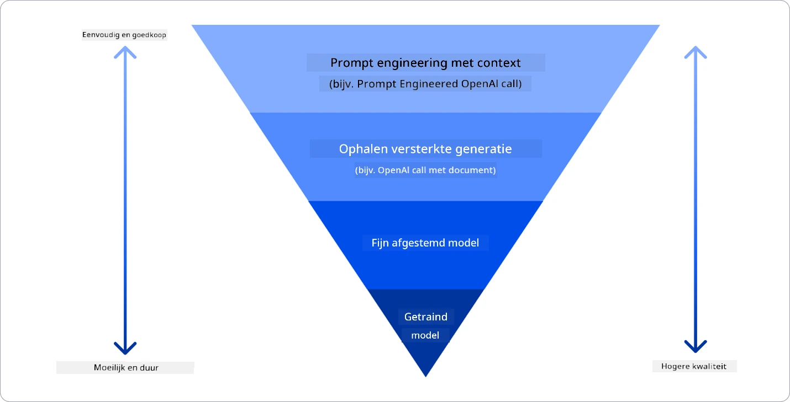

Afbeeldingsbron: [Four Ways that Enterprises Deploy LLMs | Fiddler AI Blog](https://www.fiddler.ai/blog/four-ways-that-enterprises-deploy-llms?WT.mc_id=academic-105485-koreyst)

### Prompt-engineering met context

Voor-getrainde LLM's werken heel goed bij gegeneraliseerde natuurlijke-taaltaakjes, zelfs door ze aan te roepen met een korte prompt, zoals een zin om te voltooien of een vraag – het zogenaamde “zero-shot” leren.

Hoe meer de gebruiker echter zijn vraag kan kaderen, met een gedetailleerd verzoek en voorbeelden – de Context – hoe nauwkeuriger en dichter bij de verwachtingen van de gebruiker het antwoord zal zijn. In dit geval spreken we van “one-shot” leren als de prompt slechts één voorbeeld bevat en “few-shot” leren als er meerdere voorbeelden zijn.
Prompt-engineering met context is de meest kosteneffectieve benadering om mee te beginnen.

### Retrieval Augmented Generation (RAG)

LLM's hebben de beperking dat ze alleen de data kunnen gebruiken die tijdens hun training is gebruikt om een antwoord te genereren. Dit betekent dat ze niets weten over feiten die na hun trainingsproces zijn gebeurd, en ze geen toegang hebben tot niet-publieke informatie (zoals bedrijfsdata).
Dit kan worden overwonnen door RAG, een techniek die een prompt verrijkt met externe data in de vorm van stukken documenten, rekening houdend met lengtebeperkingen van de prompt. Dit wordt ondersteund door vector-database tools (zoals [Azure Vector Search](https://learn.microsoft.com/azure/search/vector-search-overview?WT.mc_id=academic-105485-koreyst)) die de nuttige stukken uit verschillende vooraf bepaalde databronnen ophalen en toevoegen aan de promptcontext.

Deze techniek is erg nuttig als een bedrijf niet genoeg data, tijd of middelen heeft om een LLM te fine-tunen, maar toch de prestaties op een specifieke werklast wil verbeteren en het risico van bedachte, verouderde of niet-ondersteunde antwoorden wil verminderen.

### Fine-tuned model

Fine-tuning is een proces dat transfer learning benut om het model aan te passen aan een downstream taak of om een specifiek probleem op te lossen. In tegenstelling tot few-shot learning en RAG resulteert het in een nieuw model met bijgewerkte gewichten en biases. Het vereist een set trainingsvoorbeelden bestaande uit een enkele input (de prompt) en de bijbehorende output (de voltooiing).
Dit zou de voorkeursbenadering zijn als:

- **Gebruik van kleinere taak-specifieke modellen**. Een bedrijf wil een kleiner model fijn afstemmen voor een smalle taak in plaats van herhaaldelijk een groter model te prompten, wat resulteert in een kosteneffectievere en snellere oplossing.

- **Rekening houdend met latency**. Latency is belangrijk voor een specifiek gebruiksgeval, dus het is niet mogelijk om zeer lange prompts te gebruiken of als het aantal voorbeelden waaruit het model moet leren niet past binnen de promptlengte-limiet.

- **Gedrag stabiel maken**. Een bedrijf heeft veel hoogwaardige voorbeelden en wil dat het model consistent een taakpatroon, outputformaat, toon of domeinspecifieke stijl aanhoudt. Als het belangrijkste probleem verse feiten of privékennis is die vaak verandert, gebruik dan RAG in plaats van alleen te vertrouwen op fine-tuning.

### Getraind model

Het trainen van een LLM vanaf nul is ongetwijfeld de meest moeilijke en complexe benadering, die enorme hoeveelheden data, geschoolde middelen en geschikte rekenkracht vereist. Deze optie moet alleen worden overwogen als een bedrijf een domeinspecifiek gebruiksgeval heeft en een grote hoeveelheid domeingecentreerde data.

## Kenniscontrole

Wat zou een goede aanpak kunnen zijn om de resultaten van een LLM-completie te verbeteren?

1. Prompt-engineering met context
1. RAG
1. Fine-tuned model

A: Alle drie kunnen helpen. Begin met prompt-engineering en context voor snelle verbeteringen, en gebruik RAG wanneer het model actuele feiten of privébedrijfsdata nodig heeft. Kies voor fine-tuning als je genoeg hoogwaardige voorbeelden hebt en het model consequent een taak, formaat, toon of domeinpatroon moet volgen.

## 🚀 Uitdaging

Lees meer over hoe je [RAG kunt gebruiken](https://learn.microsoft.com/azure/search/retrieval-augmented-generation-overview?WT.mc_id=academic-105485-koreyst) voor je bedrijf.

## Goed gedaan, ga door met leren

Na het voltooien van deze les, bekijk onze [Generative AI Learning-collectie](https://aka.ms/genai-collection?WT.mc_id=academic-105485-koreyst) om je Generatieve AI-kennis te blijven ontwikkelen!

Ga naar les 3, waar we zullen bekijken hoe je [verantwoord met Generatieve AI kunt bouwen](../03-using-generative-ai-responsibly/README.md?WT.mc_id=academic-105485-koreyst)!

---

<!-- CO-OP TRANSLATOR DISCLAIMER START -->
**Disclaimer**:
Dit document is vertaald met behulp van de AI vertaaldienst [Co-op Translator](https://github.com/Azure/co-op-translator). Hoewel we streven naar nauwkeurigheid, dient u er rekening mee te houden dat geautomatiseerde vertalingen fouten of onnauwkeurigheden kunnen bevatten. Het originele document in de oorspronkelijke taal moet worden beschouwd als de gezaghebbende bron. Voor kritieke informatie wordt professionele menselijke vertaling aanbevolen. Wij zijn niet aansprakelijk voor eventuele misverstanden of verkeerde interpretaties die voortvloeien uit het gebruik van deze vertaling.
<!-- CO-OP TRANSLATOR DISCLAIMER END -->