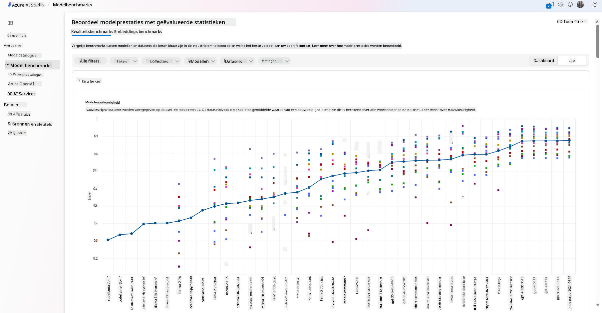
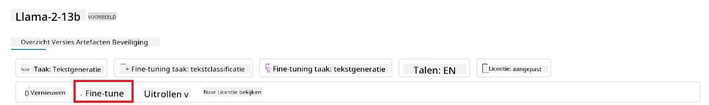
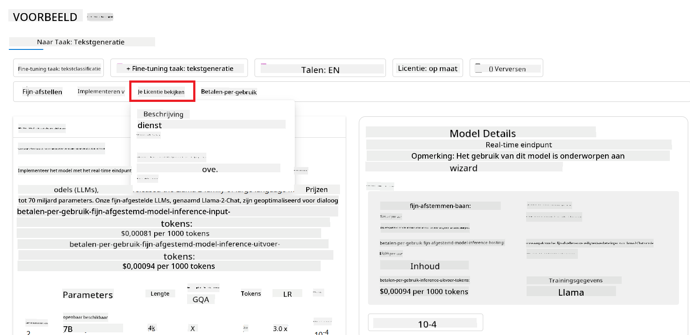
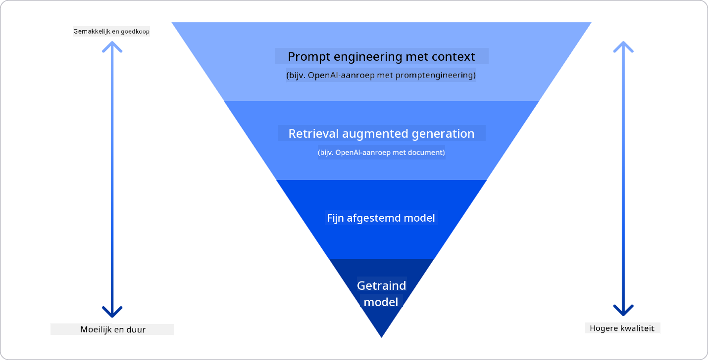

<!--
CO_OP_TRANSLATOR_METADATA:
{
  "original_hash": "e2f686f2eb794941761252ac5e8e090b",
  "translation_date": "2025-06-25T10:48:35+00:00",
  "source_file": "02-exploring-and-comparing-different-llms/README.md",
  "language_code": "nl"
}
-->
# Verkennen en vergelijken van verschillende LLM's

> _Klik op de afbeelding hierboven om de video van deze les te bekijken_

Met de vorige les hebben we gezien hoe Generatieve AI de technologische wereld verandert, hoe Large Language Models (LLM's) werken en hoe een bedrijf - zoals onze startup - ze kan toepassen op hun gebruiksscenario's en groeien! In dit hoofdstuk gaan we verschillende soorten grote taalmodellen (LLM's) vergelijken om hun voor- en nadelen te begrijpen.

De volgende stap in de reis van onze startup is het verkennen van het huidige landschap van LLM's en begrijpen welke geschikt zijn voor ons gebruiksscenario.

## Introductie

Deze les zal behandelen:

- Verschillende soorten LLM's in het huidige landschap.
- Testen, itereren en vergelijken van verschillende modellen voor jouw gebruiksscenario in Azure.
- Hoe een LLM te implementeren.

## Leerdoelen

Na het voltooien van deze les kun je:

- Het juiste model kiezen voor jouw gebruiksscenario.
- Begrijpen hoe je de prestaties van je model kunt testen, itereren en verbeteren.
- Weten hoe bedrijven modellen implementeren.

## Begrijp verschillende soorten LLM's

LLM's kunnen op verschillende manieren worden gecategoriseerd, afhankelijk van hun architectuur, trainingsdata en gebruiksscenario. Deze verschillen begrijpen helpt onze startup het juiste model te kiezen voor het scenario en te begrijpen hoe je prestaties kunt testen, itereren en verbeteren.

Er zijn veel verschillende soorten LLM-modellen, je keuze van model hangt af van wat je ermee wilt doen, je data, hoeveel je bereid bent te betalen en meer.

Afhankelijk van of je de modellen wilt gebruiken voor tekst, audio, video, beeldgeneratie enzovoort, kun je voor een ander type model kiezen.

- **Audio- en spraakherkenning**. Voor dit doel zijn Whisper-type modellen een uitstekende keuze omdat ze algemeen doelgericht zijn en gericht op spraakherkenning. Ze zijn getraind op diverse audio en kunnen meertalige spraakherkenning uitvoeren. Leer meer over [Whisper type modellen hier](https://platform.openai.com/docs/models/whisper?WT.mc_id=academic-105485-koreyst).

- **Beeldgeneratie**. Voor beeldgeneratie zijn DALL-E en Midjourney twee zeer bekende keuzes. DALL-E wordt aangeboden door Azure OpenAI. [Lees meer over DALL-E hier](https://platform.openai.com/docs/models/dall-e?WT.mc_id=academic-105485-koreyst) en ook in hoofdstuk 9 van dit curriculum.

- **Tekstgeneratie**. De meeste modellen zijn getraind op tekstgeneratie en je hebt een grote variëteit aan keuzes van GPT-3.5 tot GPT-4. Ze komen tegen verschillende kosten, waarbij GPT-4 de duurste is. Het is de moeite waard om de [Azure OpenAI playground](https://oai.azure.com/portal/playground?WT.mc_id=academic-105485-koreyst) te bekijken om te evalueren welke modellen het beste passen bij jouw behoeften qua capaciteit en kosten.

- **Multimodaliteit**. Als je meerdere soorten data in input en output wilt verwerken, kun je kijken naar modellen zoals [gpt-4 turbo met visie of gpt-4o](https://learn.microsoft.com/azure/ai-services/openai/concepts/models#gpt-4-and-gpt-4-turbo-models?WT.mc_id=academic-105485-koreyst) - de nieuwste releases van OpenAI-modellen - die in staat zijn natuurlijke taalverwerking te combineren met visueel begrip, waardoor interacties mogelijk zijn via multimodale interfaces.

Een model kiezen betekent dat je enkele basisvaardigheden krijgt, die echter niet voldoende kunnen zijn. Vaak heb je bedrijfsspecifieke data die je op de een of andere manier aan het LLM moet vertellen. Er zijn een paar verschillende keuzes over hoe je dat kunt benaderen, meer daarover in de komende secties.

### Foundation Models versus LLM's

De term Foundation Model werd [bedacht door Stanford onderzoekers](https://arxiv.org/abs/2108.07258?WT.mc_id=academic-105485-koreyst) en gedefinieerd als een AI-model dat aan bepaalde criteria voldoet, zoals:

- **Ze worden getraind met behulp van unsupervised learning of zelf-gestuurd leren**, wat betekent dat ze worden getraind op niet-gelabelde multimodale data en geen menselijke annotatie of labeling van data nodig hebben voor hun trainingsproces.
- **Het zijn zeer grote modellen**, gebaseerd op zeer diepe neurale netwerken getraind op miljarden parameters.
- **Ze zijn normaal bedoeld als 'foundation' voor andere modellen**, wat betekent dat ze kunnen worden gebruikt als uitgangspunt voor andere modellen die daarop kunnen worden gebouwd, wat kan worden gedaan door fine-tuning.

Om deze onderscheid verder te verduidelijken, laten we ChatGPT als voorbeeld nemen. Om de eerste versie van ChatGPT te bouwen, diende een model genaamd GPT-3.5 als foundation model. Dit betekent dat OpenAI wat chat-specifieke data gebruikte om een afgestemde versie van GPT-3.5 te creëren die gespecialiseerd was in het goed presteren in conversatiescenario's, zoals chatbots.

### Open Source versus Proprietary Models

Een andere manier om LLM's te categoriseren is of ze open source of proprietary zijn.

Open-source modellen zijn modellen die beschikbaar worden gesteld aan het publiek en door iedereen kunnen worden gebruikt. Ze worden vaak beschikbaar gesteld door het bedrijf dat ze heeft gemaakt, of door de onderzoeksgemeenschap. Deze modellen mogen worden geïnspecteerd, aangepast en op maat gemaakt voor de verschillende gebruiksscenario's in LLM's. Ze zijn echter niet altijd geoptimaliseerd voor gebruik in productie en kunnen minder presteren dan proprietary modellen. Bovendien kan de financiering voor open-source modellen beperkt zijn en kunnen ze niet lang worden onderhouden of niet worden bijgewerkt met de nieuwste onderzoeken. Voorbeelden van populaire open-source modellen zijn [Alpaca](https://crfm.stanford.edu/2023/03/13/alpaca.html?WT.mc_id=academic-105485-koreyst), [Bloom](https://huggingface.co/bigscience/bloom) en [LLaMA](https://llama.meta.com).

Proprietary modellen zijn modellen die eigendom zijn van een bedrijf en niet openbaar worden gemaakt. Deze modellen zijn vaak geoptimaliseerd voor gebruik in productie. Ze mogen echter niet worden geïnspecteerd, aangepast of op maat gemaakt voor verschillende gebruiksscenario's. Bovendien zijn ze niet altijd gratis beschikbaar en kunnen een abonnement of betaling vereisen om te gebruiken. Ook hebben gebruikers geen controle over de data die wordt gebruikt om het model te trainen, wat betekent dat ze het model eigenaar moeten vertrouwen voor het waarborgen van data privacy en verantwoord gebruik van AI. Voorbeelden van populaire proprietary modellen zijn [OpenAI modellen](https://platform.openai.com/docs/models/overview?WT.mc_id=academic-105485-koreyst), [Google Bard](https://sapling.ai/llm/bard?WT.mc_id=academic-105485-koreyst) of [Claude 2](https://www.anthropic.com/index/claude-2?WT.mc_id=academic-105485-koreyst).

### Embedding versus Beeldgeneratie versus Tekst en Codegeneratie

LLM's kunnen ook worden gecategoriseerd op basis van de output die ze genereren.

Embeddings zijn een set modellen die tekst kunnen omzetten in een numerieke vorm, genaamd embedding, wat een numerieke representatie is van de invoer tekst. Embeddings maken het gemakkelijker voor machines om de relaties tussen woorden of zinnen te begrijpen en kunnen worden gebruikt als inputs door andere modellen, zoals classificatiemodellen of clusteringmodellen die beter presteren op numerieke data. Embedding modellen worden vaak gebruikt voor transfer learning, waarbij een model wordt gebouwd voor een surrogaat taak waarvoor er een overvloed aan data is, en vervolgens worden de modelgewichten (embeddings) hergebruikt voor andere downstream taken. Een voorbeeld van deze categorie is [OpenAI embeddings](https://platform.openai.com/docs/models/embeddings?WT.mc_id=academic-105485-koreyst).

Beeldgeneratie modellen zijn modellen die beelden genereren. Deze modellen worden vaak gebruikt voor beeldbewerking, beeldsynthese en beeldvertaling. Beeldgeneratie modellen worden vaak getraind op grote datasets van beelden, zoals [LAION-5B](https://laion.ai/blog/laion-5b/?WT.mc_id=academic-105485-koreyst), en kunnen worden gebruikt om nieuwe beelden te genereren of bestaande beelden te bewerken met technieken zoals inpainting, super-resolutie en kleurverbetering. Voorbeelden zijn [DALL-E-3](https://openai.com/dall-e-3?WT.mc_id=academic-105485-koreyst) en [Stable Diffusion modellen](https://github.com/Stability-AI/StableDiffusion?WT.mc_id=academic-105485-koreyst).

Tekst- en codegeneratie modellen zijn modellen die tekst of code genereren. Deze modellen worden vaak gebruikt voor tekstsamenvatting, vertaling en vraagbeantwoording. Tekstgeneratie modellen worden vaak getraind op grote datasets van tekst, zoals [BookCorpus](https://www.cv-foundation.org/openaccess/content_iccv_2015/html/Zhu_Aligning_Books_and_ICCV_2015_paper.html?WT.mc_id=academic-105485-koreyst), en kunnen worden gebruikt om nieuwe tekst te genereren of vragen te beantwoorden. Codegeneratie modellen, zoals [CodeParrot](https://huggingface.co/codeparrot?WT.mc_id=academic-105485-koreyst), worden vaak getraind op grote datasets van code, zoals GitHub, en kunnen worden gebruikt om nieuwe code te genereren of bugs in bestaande code te verhelpen.

### Encoder-Decoder versus Alleen Decoder

Om te praten over de verschillende soorten architecturen van LLM's, laten we een analogie gebruiken.

Stel je voor dat je manager je een taak heeft gegeven om een quiz voor de studenten te schrijven. Je hebt twee collega's; één is verantwoordelijk voor het maken van de inhoud en de andere voor het beoordelen ervan.

De inhoudmaker is als een Alleen Decoder model, ze kunnen naar het onderwerp kijken en zien wat je al hebt geschreven en dan kunnen ze op basis daarvan een cursus schrijven. Ze zijn erg goed in het schrijven van boeiende en informatieve inhoud, maar ze zijn niet erg goed in het begrijpen van het onderwerp en de leerdoelen. Enkele voorbeelden van Decoder modellen zijn GPT familie modellen, zoals GPT-3.

De beoordelaar is als een Alleen Encoder model, ze kijken naar de geschreven cursus en de antwoorden, merken de relatie tussen hen op en begrijpen de context, maar ze zijn niet goed in het genereren van inhoud. Een voorbeeld van een Alleen Encoder model zou BERT zijn.

Stel je voor dat we ook iemand kunnen hebben die de quiz kan maken en beoordelen, dit is een Encoder-Decoder model. Enkele voorbeelden zouden BART en T5 zijn.

### Dienst versus Model

Nu, laten we het verschil tussen een dienst en een model bespreken. Een dienst is een product dat wordt aangeboden door een Cloud Service Provider en is vaak een combinatie van modellen, data en andere componenten. Een model is het kernonderdeel van een dienst en is vaak een foundation model, zoals een LLM.

Diensten zijn vaak geoptimaliseerd voor gebruik in productie en zijn vaak gemakkelijker te gebruiken dan modellen, via een grafische gebruikersinterface. Diensten zijn echter niet altijd gratis beschikbaar en kunnen een abonnement of betaling vereisen om te gebruiken, in ruil voor het benutten van de apparatuur en middelen van de dienst eigenaar, het optimaliseren van kosten en gemakkelijk schalen. Een voorbeeld van een dienst is [Azure OpenAI Service](https://learn.microsoft.com/azure/ai-services/openai/overview?WT.mc_id=academic-105485-koreyst), die een pay-as-you-go tariefplan biedt, wat betekent dat gebruikers proportioneel worden belast naar hoeveel ze de dienst gebruiken. Ook biedt Azure OpenAI Service beveiliging op ondernemingsniveau en een verantwoord AI-framework bovenop de capaciteiten van de modellen.

Modellen zijn slechts het Neurale Netwerk, met de parameters, gewichten en anderen. Hiermee kunnen bedrijven lokaal draaien, maar ze zouden apparatuur moeten kopen, een structuur moeten bouwen om te schalen en een licentie moeten kopen of een open-source model moeten gebruiken. Een model zoals LLaMA is beschikbaar om te gebruiken, wat rekencapaciteit vereist om het model uit te voeren.

## Hoe te testen en itereren met verschillende modellen om prestaties op Azure te begrijpen

Zodra ons team het huidige LLM-landschap heeft verkend en enkele goede kandidaten voor hun scenario's heeft geïdentificeerd, is de volgende stap om ze te testen op hun data en hun werklast. Dit is een iteratief proces, gedaan door experimenten en metingen.
De meeste modellen die we in de vorige paragrafen noemden (OpenAI modellen, open-source modellen zoals Llama2 en Hugging Face transformers) zijn beschikbaar in de [Model Catalog](https://learn.microsoft.com/azure/ai-studio/how-to/model-catalog-overview?WT.mc_id=academic-105485-koreyst) in [Azure AI Studio](https://ai.azure.com/?WT.mc_id=academic-105485-koreyst).

[Azure AI Studio](https://learn.microsoft.com/azure/ai-studio/what-is-ai-studio?WT.mc_id=academic-105485-koreyst) is een Cloud Platform ontworpen voor ontwikkelaars om generatieve AI-toepassingen te bouwen en het hele ontwikkelingsproces te beheren - van experimentatie tot evaluatie - door alle Azure AI-diensten te combineren in één hub met een handige GUI. De Model Catalog in Azure AI Studio stelt de gebruiker in staat om:

- Vind het Foundation Model van interesse in de catalogus - of het nu proprietary of open source is, filteren op taak, licentie of naam. Om de zoekbaarheid te verbeteren, zijn de modellen georganiseerd in collecties, zoals Azure OpenAI collectie, Hugging Face collectie en meer.

- Bekijk de modelkaart, inclusief een gedetailleerde beschrijving van het beoogde gebruik en de trainingsdata, codevoorbeelden en evaluatieresultaten in de interne evaluatiebibliotheek.
- Vergelijk benchmarks tussen modellen en datasets die beschikbaar zijn in de industrie om te beoordelen welke het beste past bij het bedrijfsscenario, via het [Model Benchmarks](https://learn.microsoft.com/azure/ai-studio/how-to/model-benchmarks?WT.mc_id=academic-105485-koreyst) paneel.

- Stem het model af op aangepaste trainingsdata om de modelprestaties te verbeteren in een specifieke werklast, gebruikmakend van de experimenteer- en volgmogelijkheden van Azure AI Studio.

- Zet het originele voorgetrainde model of de fijngestemde versie in voor een externe realtime-inferentie - beheerde berekening - of serverloze API-eindpunt - [pay-as-you-go](https://learn.microsoft.com/azure/ai-studio/how-to/model-catalog-overview#model-deployment-managed-compute-and-serverless-api-pay-as-you-go?WT.mc_id=academic-105485-koreyst) - om toepassingen in staat te stellen het te gebruiken.

> [!NOTE]
> Niet alle modellen in de catalogus zijn momenteel beschikbaar voor fine-tuning en/of pay-as-you-go implementatie. Controleer de modelkaart voor details over de mogelijkheden en beperkingen van het model.

## Verbetering van LLM-resultaten

We hebben met ons start-up team verschillende soorten LLM's en een Cloud Platform (Azure Machine Learning) onderzocht, waarmee we verschillende modellen kunnen vergelijken, evalueren op testdata, prestaties verbeteren en ze implementeren op inferentie-eindpunten.

Maar wanneer moeten ze overwegen een model fijn te stemmen in plaats van een voorgetraind model te gebruiken? Zijn er andere benaderingen om de modelprestaties te verbeteren voor specifieke werklasten?

Er zijn verschillende benaderingen die een bedrijf kan gebruiken om de resultaten te krijgen die ze nodig hebben van een LLM. Je kunt verschillende soorten modellen kiezen met verschillende mate van training bij het implementeren van een LLM in productie, met verschillende niveaus van complexiteit, kosten en kwaliteit. Hier zijn enkele verschillende benaderingen:

- **Prompt engineering met context**. Het idee is om voldoende context te bieden wanneer je een prompt geeft om ervoor te zorgen dat je de antwoorden krijgt die je nodig hebt.

- **Retrieval Augmented Generation, RAG**. Je data kan bijvoorbeeld bestaan in een database of web-eindpunt, om ervoor te zorgen dat deze data, of een subset ervan, wordt opgenomen op het moment van prompten, kun je de relevante data ophalen en dat deel van de gebruikersprompt maken.

- **Fijngestemd model**. Hier train je het model verder op je eigen data, wat leidt tot een model dat nauwkeuriger en responsiever is voor jouw behoeften, maar mogelijk kostbaar is.

Img source: [Four Ways that Enterprises Deploy LLMs | Fiddler AI Blog](https://www.fiddler.ai/blog/four-ways-that-enterprises-deploy-llms?WT.mc_id=academic-105485-koreyst)

### Prompt Engineering met Context

Voorgetrainde LLM's werken zeer goed bij gegeneraliseerde natuurlijke taal taken, zelfs door ze aan te roepen met een korte prompt, zoals een zin om te voltooien of een vraag – het zogenaamde “zero-shot” leren.

Echter, hoe meer de gebruiker hun vraag kan kaderen, met een gedetailleerd verzoek en voorbeelden – de Context – des te nauwkeuriger en dichterbij de verwachtingen van de gebruiker zal het antwoord zijn. In dit geval spreken we van “one-shot” leren als de prompt slechts één voorbeeld bevat en “few-shot learning” als het meerdere voorbeelden bevat. Prompt engineering met context is de meest kosteneffectieve benadering om mee te beginnen.

### Retrieval Augmented Generation (RAG)

LLM's hebben de beperking dat ze alleen de data kunnen gebruiken die tijdens hun training is gebruikt om een antwoord te genereren. Dit betekent dat ze niets weten over de feiten die na hun trainingsproces zijn gebeurd, en ze kunnen geen toegang krijgen tot niet-openbare informatie (zoals bedrijfsdata).
Dit kan worden overwonnen door RAG, een techniek die de prompt aanvult met externe data in de vorm van stukken documenten, rekening houdend met promptlengte beperkingen. Dit wordt ondersteund door Vector database tools (zoals [Azure Vector Search](https://learn.microsoft.com/azure/search/vector-search-overview?WT.mc_id=academic-105485-koreyst)) die de nuttige stukken ophalen uit verschillende vooraf gedefinieerde databronnen en ze toevoegen aan de prompt Context.

Deze techniek is zeer nuttig wanneer een bedrijf niet genoeg data, genoeg tijd of middelen heeft om een LLM fijn te stemmen, maar toch de prestaties wil verbeteren voor een specifieke werklast en de risico's van fabricaties wil verminderen, dat wil zeggen, mystificatie van de werkelijkheid of schadelijke inhoud.

### Fijngestemd model

Fine-tuning is een proces dat gebruik maakt van transfer learning om het model aan te passen aan een downstream taak of om een specifiek probleem op te lossen. Anders dan few-shot learning en RAG, resulteert het in een nieuw model dat wordt gegenereerd, met bijgewerkte gewichten en biases. Het vereist een set van training voorbeelden bestaande uit een enkele input (de prompt) en de bijbehorende output (de voltooiing).
Dit zou de geprefereerde benadering zijn als:

- **Gebruik van fijngestemde modellen**. Een bedrijf zou graag fijngestemde minder capabele modellen (zoals embedding modellen) willen gebruiken in plaats van modellen met hoge prestaties, wat resulteert in een kosteneffectieve en snelle oplossing.

- **Overweging van latentie**. Latentie is belangrijk voor een specifieke use-case, dus het is niet mogelijk om zeer lange prompts te gebruiken of het aantal voorbeelden dat van het model moet worden geleerd past niet binnen de promptlengte limiet.

- **Bijblijven**. Een bedrijf heeft veel hoogwaardige data en grondwaarheid labels en de middelen die nodig zijn om deze data in de loop van de tijd up-to-date te houden.

### Getraind model

Het trainen van een LLM vanaf nul is zonder twijfel de moeilijkste en meest complexe benadering om te adopteren, vereist enorme hoeveelheden data, bekwame middelen en geschikte rekenkracht. Deze optie moet alleen worden overwogen in een scenario waarin een bedrijf een domeinspecifieke use-case heeft en een grote hoeveelheid domeingerichte data.

## Kennischeck

Wat zou een goede benadering kunnen zijn om LLM voltooiingsresultaten te verbeteren?

1. Prompt engineering met context
1. RAG
1. Fijngestemd model

A:3, als je de tijd en middelen hebt en hoogwaardige data, is fine-tuning de betere optie om up-to-date te blijven. Echter, als je dingen wilt verbeteren en je hebt geen tijd, is het de moeite waard om eerst RAG te overwegen.

## 🚀 Uitdaging

Lees meer over hoe je [RAG kunt gebruiken](https://learn.microsoft.com/azure/search/retrieval-augmented-generation-overview?WT.mc_id=academic-105485-koreyst) voor je bedrijf.

## Goed werk, ga door met leren

Na het voltooien van deze les, bekijk onze [Generative AI Learning collectie](https://aka.ms/genai-collection?WT.mc_id=academic-105485-koreyst) om je kennis van Generative AI verder te verdiepen!

Ga naar Les 3 waar we zullen kijken naar hoe we [verantwoordelijk kunnen bouwen met Generative AI](../03-using-generative-ai-responsibly/README.md?WT.mc_id=academic-105485-koreyst)!

**Disclaimer**:  
Dit document is vertaald met behulp van de AI-vertalingsdienst [Co-op Translator](https://github.com/Azure/co-op-translator). Hoewel we streven naar nauwkeurigheid, dient u zich ervan bewust te zijn dat geautomatiseerde vertalingen fouten of onnauwkeurigheden kunnen bevatten. Het originele document in zijn oorspronkelijke taal moet als de gezaghebbende bron worden beschouwd. Voor kritieke informatie wordt professionele menselijke vertaling aanbevolen. Wij zijn niet aansprakelijk voor misverstanden of verkeerde interpretaties die voortvloeien uit het gebruik van deze vertaling.