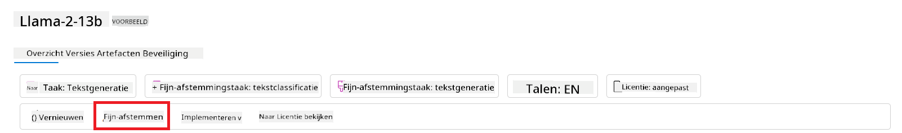
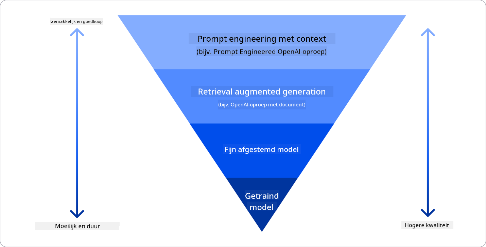

<!--
CO_OP_TRANSLATOR_METADATA:
{
  "original_hash": "e2f686f2eb794941761252ac5e8e090b",
  "translation_date": "2025-07-09T08:31:33+00:00",
  "source_file": "02-exploring-and-comparing-different-llms/README.md",
  "language_code": "nl"
}
-->
# Verkennen en vergelijken van verschillende LLM's

> _Klik op de afbeelding hierboven om de video van deze les te bekijken_

In de vorige les hebben we gezien hoe Generative AI het technologielandschap verandert, hoe Large Language Models (LLM's) werken en hoe een bedrijf – zoals onze startup – deze kan toepassen op hun use cases om te groeien! In dit hoofdstuk vergelijken we verschillende soorten grote taalmodellen (LLM's) om hun voor- en nadelen te begrijpen.

De volgende stap in de reis van onze startup is het verkennen van het huidige landschap van LLM's en begrijpen welke geschikt zijn voor onze use case.

## Introductie

Deze les behandelt:

- Verschillende soorten LLM's in het huidige landschap.
- Testen, itereren en vergelijken van verschillende modellen voor jouw use case in Azure.
- Hoe je een LLM kunt implementeren.

## Leerdoelen

Na het voltooien van deze les kun je:

- Het juiste model kiezen voor jouw use case.
- Begrijpen hoe je een model test, iteratief verbetert en de prestaties optimaliseert.
- Weten hoe bedrijven modellen implementeren.

## Begrijp verschillende soorten LLM's

LLM's kunnen op verschillende manieren worden ingedeeld, afhankelijk van hun architectuur, trainingsdata en use case. Het begrijpen van deze verschillen helpt onze startup om het juiste model te kiezen voor de situatie en te weten hoe je kunt testen, itereren en de prestaties verbeteren.

Er zijn veel verschillende soorten LLM-modellen; jouw keuze hangt af van het doel, de data, het budget en meer.

Afhankelijk van of je de modellen wilt gebruiken voor tekst, audio, video, beeldgeneratie enzovoort, kies je mogelijk een ander type model.

- **Audio- en spraakherkenning**. Voor dit doel zijn Whisper-achtige modellen een goede keuze, omdat ze algemeen inzetbaar zijn en gericht op spraakherkenning. Ze zijn getraind op diverse audio en kunnen meertalige spraakherkenning uitvoeren. Lees meer over [Whisper type modellen hier](https://platform.openai.com/docs/models/whisper?WT.mc_id=academic-105485-koreyst).

- **Beeldgeneratie**. Voor beeldgeneratie zijn DALL-E en Midjourney twee bekende opties. DALL-E wordt aangeboden via Azure OpenAI. [Lees hier meer over DALL-E](https://platform.openai.com/docs/models/dall-e?WT.mc_id=academic-105485-koreyst) en ook in hoofdstuk 9 van dit curriculum.

- **Tekstgeneratie**. De meeste modellen zijn getraind op tekstgeneratie en je hebt een ruime keuze, van GPT-3.5 tot GPT-4. Ze verschillen in kosten, waarbij GPT-4 het duurst is. Het is de moeite waard om de [Azure OpenAI playground](https://oai.azure.com/portal/playground?WT.mc_id=academic-105485-koreyst) te bekijken om te beoordelen welke modellen het beste passen bij jouw behoeften qua mogelijkheden en kosten.

- **Multi-modality**. Als je meerdere soorten data wilt verwerken in input en output, kun je kijken naar modellen zoals [gpt-4 turbo met vision of gpt-4o](https://learn.microsoft.com/azure/ai-services/openai/concepts/models#gpt-4-and-gpt-4-turbo-models?WT.mc_id=academic-105485-koreyst) – de nieuwste OpenAI-modellen – die natuurlijke taalverwerking combineren met visueel begrip, waardoor interacties via multimodale interfaces mogelijk zijn.

Het kiezen van een model betekent dat je basisfunctionaliteiten krijgt, maar dat is vaak niet genoeg. Vaak heb je bedrijfsspecifieke data die je op de een of andere manier aan het LLM moet doorgeven. Er zijn verschillende manieren om dat aan te pakken, daarover meer in de volgende secties.

### Foundation Models versus LLM's

De term Foundation Model is [bedacht door onderzoekers van Stanford](https://arxiv.org/abs/2108.07258?WT.mc_id=academic-105485-koreyst) en gedefinieerd als een AI-model dat aan bepaalde criteria voldoet, zoals:

- **Ze worden getraind met unsupervised learning of self-supervised learning**, wat betekent dat ze getraind zijn op ongetagde multimodale data, zonder dat menselijke annotatie of labeling nodig is voor het trainingsproces.
- **Het zijn zeer grote modellen**, gebaseerd op diepe neurale netwerken met miljarden parameters.
- **Ze zijn bedoeld als ‘fundament’ voor andere modellen**, wat betekent dat ze als uitgangspunt kunnen dienen voor andere modellen die erop worden gebouwd, bijvoorbeeld door fine-tuning.

Afbeeldingsbron: [Essential Guide to Foundation Models and Large Language Models | by Babar M Bhatti | Medium](https://thebabar.medium.com/essential-guide-to-foundation-models-and-large-language-models-27dab58f7404)

Om dit onderscheid verder te verduidelijken, nemen we ChatGPT als voorbeeld. Voor de eerste versie van ChatGPT diende een model genaamd GPT-3.5 als foundation model. Dit betekent dat OpenAI specifieke chatdata gebruikte om een getunede versie van GPT-3.5 te maken die gespecialiseerd is in het goed presteren in conversatiescenario’s, zoals chatbots.

Afbeeldingsbron: [2108.07258.pdf (arxiv.org)](https://arxiv.org/pdf/2108.07258.pdf?WT.mc_id=academic-105485-koreyst)

### Open Source versus Proprietary Models

Een andere manier om LLM's te categoriseren is op basis van open source of proprietary.

Open source modellen zijn modellen die openbaar beschikbaar zijn en door iedereen gebruikt kunnen worden. Ze worden vaak vrijgegeven door het bedrijf dat ze heeft ontwikkeld of door de onderzoeksgemeenschap. Deze modellen mogen worden bekeken, aangepast en aangepast voor verschillende LLM-use cases. Ze zijn echter niet altijd geoptimaliseerd voor productiegebruik en presteren mogelijk minder dan proprietary modellen. Daarnaast is de financiering voor open source modellen vaak beperkt, en worden ze mogelijk niet langdurig onderhouden of bijgewerkt met de nieuwste onderzoeksresultaten. Voorbeelden van populaire open source modellen zijn [Alpaca](https://crfm.stanford.edu/2023/03/13/alpaca.html?WT.mc_id=academic-105485-koreyst), [Bloom](https://huggingface.co/bigscience/bloom) en [LLaMA](https://llama.meta.com).

Proprietary modellen zijn modellen die eigendom zijn van een bedrijf en niet openbaar beschikbaar worden gesteld. Deze modellen zijn vaak geoptimaliseerd voor productiegebruik. Ze mogen niet worden bekeken, aangepast of aangepast voor verschillende use cases. Bovendien zijn ze niet altijd gratis beschikbaar en kunnen ze een abonnement of betaling vereisen. Gebruikers hebben ook geen controle over de data die gebruikt wordt om het model te trainen, wat betekent dat ze het eigenaarschap van het model moeten vertrouwen voor naleving van privacy en verantwoord AI-gebruik. Voorbeelden van populaire proprietary modellen zijn [OpenAI modellen](https://platform.openai.com/docs/models/overview?WT.mc_id=academic-105485-koreyst), [Google Bard](https://sapling.ai/llm/bard?WT.mc_id=academic-105485-koreyst) en [Claude 2](https://www.anthropic.com/index/claude-2?WT.mc_id=academic-105485-koreyst).

### Embedding versus beeldgeneratie versus tekst- en codegeneratie

LLM's kunnen ook worden ingedeeld op basis van de output die ze genereren.

Embeddings zijn een groep modellen die tekst kunnen omzetten in een numerieke vorm, een embedding genoemd, wat een numerieke representatie is van de inputtekst. Embeddings maken het makkelijker voor machines om relaties tussen woorden of zinnen te begrijpen en kunnen worden gebruikt als input voor andere modellen, zoals classificatiemodellen of clusteringmodellen die beter presteren op numerieke data. Embeddingmodellen worden vaak gebruikt voor transfer learning, waarbij een model wordt gebouwd voor een surrogate taak waarvoor veel data beschikbaar is, en vervolgens worden de modelgewichten (embeddings) hergebruikt voor andere downstream taken. Een voorbeeld van deze categorie is [OpenAI embeddings](https://platform.openai.com/docs/models/embeddings?WT.mc_id=academic-105485-koreyst).

Beeldgeneratiemodellen zijn modellen die beelden genereren. Deze worden vaak gebruikt voor beeldbewerking, beeldsynthese en beeldvertaling. Beeldgeneratiemodellen worden vaak getraind op grote datasets van beelden, zoals [LAION-5B](https://laion.ai/blog/laion-5b/?WT.mc_id=academic-105485-koreyst), en kunnen nieuwe beelden genereren of bestaande beelden bewerken met technieken zoals inpainting, superresolutie en kleurcorrectie. Voorbeelden zijn [DALL-E-3](https://openai.com/dall-e-3?WT.mc_id=academic-105485-koreyst) en [Stable Diffusion modellen](https://github.com/Stability-AI/StableDiffusion?WT.mc_id=academic-105485-koreyst).

Tekst- en codegeneratiemodellen zijn modellen die tekst of code genereren. Deze worden vaak gebruikt voor tekstsamenvatting, vertaling en vraagbeantwoording. Tekstgeneratiemodellen worden vaak getraind op grote datasets van tekst, zoals [BookCorpus](https://www.cv-foundation.org/openaccess/content_iccv_2015/html/Zhu_Aligning_Books_and_ICCV_2015_paper.html?WT.mc_id=academic-105485-koreyst), en kunnen nieuwe tekst genereren of vragen beantwoorden. Codegeneratiemodellen, zoals [CodeParrot](https://huggingface.co/codeparrot?WT.mc_id=academic-105485-koreyst), zijn vaak getraind op grote datasets van code, zoals GitHub, en kunnen nieuwe code genereren of bugs in bestaande code oplossen.

### Encoder-Decoder versus Decoder-only

Om de verschillende architecturen van LLM's te bespreken, gebruiken we een analogie.

Stel je voor dat je manager je de taak geeft om een quiz te schrijven voor studenten. Je hebt twee collega’s; de ene maakt de inhoud en de andere controleert deze.

De inhoudsmaker is als een Decoder-only model: hij kijkt naar het onderwerp en wat je al hebt geschreven en kan daar een cursus op baseren. Ze zijn erg goed in het schrijven van boeiende en informatieve content, maar minder goed in het begrijpen van het onderwerp en de leerdoelen. Voorbeelden van Decoder-modellen zijn de GPT-familie, zoals GPT-3.

De controleur is als een Encoder-only model: hij kijkt naar de geschreven cursus en de antwoorden, ziet de relatie daartussen en begrijpt de context, maar is niet goed in het genereren van content. Een voorbeeld van een Encoder-only model is BERT.

Stel je voor dat we iemand hebben die zowel kan maken als controleren, dat is een Encoder-Decoder model. Voorbeelden hiervan zijn BART en T5.

### Service versus Model

Laten we nu het verschil bespreken tussen een service en een model. Een service is een product dat wordt aangeboden door een Cloud Service Provider en is vaak een combinatie van modellen, data en andere componenten. Een model is het kernonderdeel van een service en is vaak een foundation model, zoals een LLM.

Services zijn vaak geoptimaliseerd voor productiegebruik en zijn meestal makkelijker te gebruiken dan modellen, via een grafische gebruikersinterface. Services zijn echter niet altijd gratis en kunnen een abonnement of betaling vereisen, in ruil voor het gebruik van de apparatuur en middelen van de service-eigenaar, wat kosten optimaliseert en schaalbaarheid vergemakkelijkt. Een voorbeeld van een service is [Azure OpenAI Service](https://learn.microsoft.com/azure/ai-services/openai/overview?WT.mc_id=academic-105485-koreyst), die een pay-as-you-go tariefplan biedt, waarbij gebruikers betalen naar gebruik. Daarnaast biedt Azure OpenAI Service enterprise-grade beveiliging en een verantwoord AI-kader bovenop de mogelijkheden van de modellen.

Modellen zijn alleen het neurale netwerk, met parameters, gewichten en dergelijke. Bedrijven kunnen deze lokaal draaien, maar moeten dan wel apparatuur aanschaffen, een schaalbare infrastructuur bouwen en een licentie kopen of een open source model gebruiken. Een model zoals LLaMA is beschikbaar voor gebruik, maar vereist rekenkracht om te draaien.

## Hoe te testen en itereren met verschillende modellen om prestaties te begrijpen in Azure

Zodra ons team het huidige LLM-landschap heeft verkend en een aantal goede kandidaten heeft geïdentificeerd voor hun scenario’s, is de volgende stap om ze te testen met hun data en workload. Dit is een iteratief proces, uitgevoerd door experimenten en metingen.
De meeste modellen die we in de vorige paragrafen noemden (OpenAI-modellen, open source modellen zoals Llama2, en Hugging Face transformers) zijn beschikbaar in de [Model Catalogus](https://learn.microsoft.com/azure/ai-studio/how-to/model-catalog-overview?WT.mc_id=academic-105485-koreyst) in [Azure AI Studio](https://ai.azure.com/?WT.mc_id=academic-105485-koreyst).

[Azure AI Studio](https://learn.microsoft.com/azure/ai-studio/what-is-ai-studio?WT.mc_id=academic-105485-koreyst) is een cloudplatform ontworpen voor ontwikkelaars om generatieve AI-toepassingen te bouwen en de volledige ontwikkelingscyclus te beheren – van experimenteren tot evalueren – door alle Azure AI-diensten te combineren in één centrale plek met een gebruiksvriendelijke GUI. De Model Catalogus in Azure AI Studio stelt gebruikers in staat om:

- Het Foundation Model van interesse te vinden in de catalogus – zowel propriëtaire als open source, filterbaar op taak, licentie of naam. Om de zoekbaarheid te verbeteren, zijn de modellen georganiseerd in collecties, zoals de Azure OpenAI-collectie, Hugging Face-collectie en meer.

- De modelkaart te bekijken, inclusief een gedetailleerde beschrijving van het beoogde gebruik en de trainingsdata, codevoorbeelden en evaluatieresultaten uit de interne evaluatiebibliotheek.

- Benchmarks te vergelijken tussen modellen en datasets die in de industrie beschikbaar zijn om te beoordelen welk model het beste past bij het zakelijke scenario, via het [Model Benchmarks](https://learn.microsoft.com/azure/ai-studio/how-to/model-benchmarks?WT.mc_id=academic-105485-koreyst) paneel.

- Het model fijn af te stemmen op eigen trainingsdata om de prestaties te verbeteren voor een specifieke taak, gebruikmakend van de experimentatie- en trackingmogelijkheden van Azure AI Studio.

- Het originele voorgetrainde model of de fijn afgestemde versie te implementeren naar een remote real-time inference – beheerde compute – of serverloze API-endpoint – [pay-as-you-go](https://learn.microsoft.com/azure/ai-studio/how-to/model-catalog-overview#model-deployment-managed-compute-and-serverless-api-pay-as-you-go?WT.mc_id=academic-105485-koreyst) – zodat applicaties het kunnen gebruiken.

> [!NOTE]
> Niet alle modellen in de catalogus zijn momenteel beschikbaar voor fijn afstemmen en/of pay-as-you-go implementatie. Bekijk de modelkaart voor details over de mogelijkheden en beperkingen van het model.

## Verbeteren van LLM-resultaten

We hebben met ons startupteam verschillende soorten LLM’s onderzocht en een cloudplatform (Azure Machine Learning) gebruikt waarmee we verschillende modellen kunnen vergelijken, evalueren op testdata, prestaties kunnen verbeteren en implementeren op inference endpoints.

Maar wanneer is het verstandig om een model fijn af te stemmen in plaats van een voorgetraind model te gebruiken? Zijn er andere manieren om de prestaties van een model op specifieke taken te verbeteren?

Er zijn verschillende benaderingen die een bedrijf kan gebruiken om de gewenste resultaten uit een LLM te halen. Je kunt verschillende soorten modellen kiezen met verschillende trainingsniveaus bij het inzetten van een LLM in productie, met verschillende niveaus van complexiteit, kosten en kwaliteit. Hier zijn enkele benaderingen:

- **Prompt engineering met context**. Het idee is om voldoende context te geven bij je prompt zodat je de antwoorden krijgt die je nodig hebt.

- **Retrieval Augmented Generation, RAG**. Je data kan bijvoorbeeld in een database of webendpoint staan. Om ervoor te zorgen dat deze data, of een deel ervan, wordt meegenomen bij het prompten, kun je relevante data ophalen en toevoegen aan de prompt van de gebruiker.

- **Fijn afgestemd model**. Hierbij train je het model verder met je eigen data, waardoor het model nauwkeuriger en beter aansluit bij jouw behoeften, maar dit kan kostbaar zijn.

Afbeeldingsbron: [Four Ways that Enterprises Deploy LLMs | Fiddler AI Blog](https://www.fiddler.ai/blog/four-ways-that-enterprises-deploy-llms?WT.mc_id=academic-105485-koreyst)

### Prompt Engineering met Context

Voorgetrainde LLM’s werken erg goed bij algemene natuurlijke taal taken, zelfs met een korte prompt, zoals een zin die afgemaakt moet worden of een vraag – het zogenaamde “zero-shot” leren.

Hoe meer de gebruiker zijn vraag kan kaderen met een gedetailleerd verzoek en voorbeelden – de Context – hoe nauwkeuriger en beter afgestemd op de verwachtingen het antwoord zal zijn. We spreken van “one-shot” leren als de prompt één voorbeeld bevat en “few-shot” leren als er meerdere voorbeelden in staan. Prompt engineering met context is de meest kosteneffectieve manier om te beginnen.

### Retrieval Augmented Generation (RAG)

LLM’s hebben de beperking dat ze alleen de data kunnen gebruiken die tijdens hun training is gebruikt om een antwoord te genereren. Dit betekent dat ze niets weten over feiten die na hun training zijn gebeurd en geen toegang hebben tot niet-publieke informatie (zoals bedrijfsdata).  
Dit kan worden opgelost met RAG, een techniek die de prompt aanvult met externe data in de vorm van stukjes documenten, rekening houdend met de limiet op de promptlengte. Dit wordt ondersteund door vector database tools (zoals [Azure Vector Search](https://learn.microsoft.com/azure/search/vector-search-overview?WT.mc_id=academic-105485-koreyst)) die relevante stukken ophalen uit verschillende vooraf gedefinieerde databronnen en toevoegen aan de promptcontext.

Deze techniek is erg nuttig wanneer een bedrijf niet genoeg data, tijd of middelen heeft om een LLM fijn af te stemmen, maar toch de prestaties op een specifieke taak wil verbeteren en het risico op verzinsels, oftewel het mystificeren van de werkelijkheid of schadelijke inhoud, wil verminderen.

### Fijn afgestemd model

Fijn afstemmen is een proces waarbij transfer learning wordt gebruikt om het model aan te passen aan een specifieke taak of probleem. In tegenstelling tot few-shot leren en RAG, resulteert dit in een nieuw model met bijgewerkte gewichten en biases. Het vereist een set trainingsvoorbeelden bestaande uit een input (de prompt) en de bijbehorende output (de completion).  
Dit is de voorkeursmethode als:

- **Gebruik van fijn afgestemde modellen**. Een bedrijf liever minder krachtige fijn afgestemde modellen (zoals embedding modellen) gebruikt in plaats van high-performance modellen, wat resulteert in een goedkopere en snellere oplossing.

- **Latentie belangrijk is**. Latentie cruciaal is voor een specifieke use-case, waardoor het niet mogelijk is om zeer lange prompts te gebruiken of het aantal voorbeelden dat het model moet leren niet past binnen de promptlengte.

- **Up-to-date blijven**. Een bedrijf beschikt over veel hoogwaardige data en ground truth labels en de middelen om deze data up-to-date te houden.

### Getraind model

Een LLM helemaal vanaf nul trainen is zonder twijfel de moeilijkste en meest complexe aanpak, die enorme hoeveelheden data, deskundige mensen en voldoende rekenkracht vereist. Deze optie is alleen aan te raden als een bedrijf een domeinspecifieke use-case heeft en een grote hoeveelheid domeingerichte data.

## Kennischeck

Wat zou een goede aanpak kunnen zijn om de resultaten van een LLM te verbeteren?

1. Prompt engineering met context  
2. RAG  
3. Fijn afgestemd model

Antwoord: 3, als je de tijd, middelen en hoogwaardige data hebt, is fijn afstemmen de beste optie om up-to-date te blijven. Maar als je snel verbetering wilt en weinig tijd hebt, is het de moeite waard om eerst RAG te overwegen.

## 🚀 Uitdaging

Lees meer over hoe je [RAG kunt gebruiken](https://learn.microsoft.com/azure/search/retrieval-augmented-generation-overview?WT.mc_id=academic-105485-koreyst) voor jouw bedrijf.

## Goed gedaan, ga door met leren

Na het afronden van deze les, bekijk onze [Generative AI Learning collectie](https://aka.ms/genai-collection?WT.mc_id=academic-105485-koreyst) om je kennis over Generative AI verder uit te breiden!

Ga door naar Les 3, waar we kijken naar hoe je [verantwoord kunt bouwen met Generative AI](../03-using-generative-ai-responsibly/README.md?WT.mc_id=academic-105485-koreyst)!

**Disclaimer**:  
Dit document is vertaald met behulp van de AI-vertalingsdienst [Co-op Translator](https://github.com/Azure/co-op-translator). Hoewel we streven naar nauwkeurigheid, dient u er rekening mee te houden dat geautomatiseerde vertalingen fouten of onnauwkeurigheden kunnen bevatten. Het originele document in de oorspronkelijke taal moet als de gezaghebbende bron worden beschouwd. Voor cruciale informatie wordt professionele menselijke vertaling aanbevolen. Wij zijn niet aansprakelijk voor eventuele misverstanden of verkeerde interpretaties die voortvloeien uit het gebruik van deze vertaling.