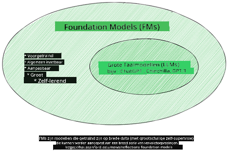
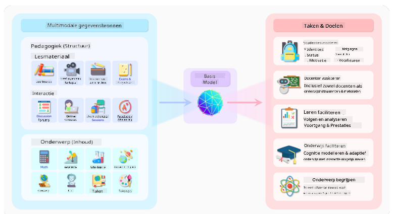
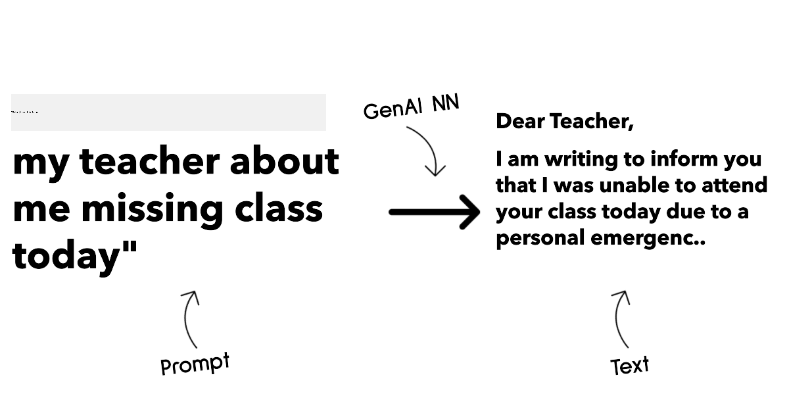
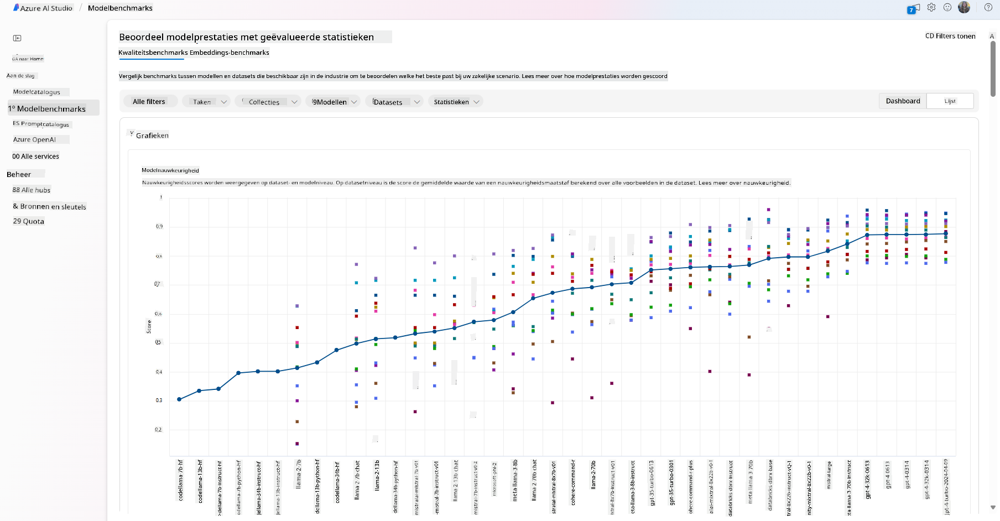
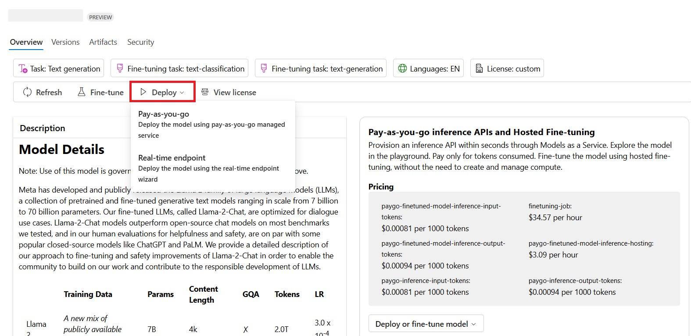

<!--
CO_OP_TRANSLATOR_METADATA:
{
  "original_hash": "6b7629b8ee4d7d874a27213e903d86a7",
  "translation_date": "2025-10-17T19:54:02+00:00",
  "source_file": "02-exploring-and-comparing-different-llms/README.md",
  "language_code": "nl"
}
-->
# Verkennen en vergelijken van verschillende LLM's

> _Klik op de afbeelding hierboven om de video van deze les te bekijken_

In de vorige les hebben we gezien hoe Generatieve AI het technologische landschap verandert, hoe Large Language Models (LLM's) werken en hoe een bedrijf - zoals onze startup - ze kan toepassen op hun use cases en kan groeien! In dit hoofdstuk gaan we verschillende soorten grote taalmodellen (LLM's) vergelijken om hun voor- en nadelen te begrijpen.

De volgende stap in de reis van onze startup is het verkennen van het huidige landschap van LLM's en begrijpen welke geschikt zijn voor onze use case.

## Introductie

Deze les behandelt:

- Verschillende soorten LLM's in het huidige landschap.
- Het testen, itereren en vergelijken van verschillende modellen voor jouw use case in Azure.
- Hoe je een LLM implementeert.

## Leerdoelen

Na het voltooien van deze les kun je:

- Het juiste model kiezen voor jouw use case.
- Begrijpen hoe je de prestaties van je model kunt testen, itereren en verbeteren.
- Weten hoe bedrijven modellen implementeren.

## Begrijp de verschillende soorten LLM's

LLM's kunnen op verschillende manieren worden gecategoriseerd, afhankelijk van hun architectuur, trainingsdata en use case. Het begrijpen van deze verschillen helpt onze startup om het juiste model te kiezen voor de situatie en te begrijpen hoe je prestaties kunt testen, itereren en verbeteren.

Er zijn veel verschillende soorten LLM-modellen. Je keuze hangt af van wat je ermee wilt doen, je data, hoeveel je bereid bent te betalen en meer.

Afhankelijk van of je de modellen wilt gebruiken voor tekst-, audio-, video-, beeldgeneratie, enzovoort, kun je voor een ander type model kiezen.

- **Audio- en spraakherkenning**. Voor dit doel zijn modellen van het type Whisper een uitstekende keuze, omdat ze algemeen toepasbaar zijn en gericht op spraakherkenning. Ze zijn getraind op diverse audio en kunnen meertalige spraakherkenning uitvoeren. Lees meer over [Whisper-modellen hier](https://platform.openai.com/docs/models/whisper?WT.mc_id=academic-105485-koreyst).

- **Beeldgeneratie**. Voor beeldgeneratie zijn DALL-E en Midjourney twee zeer bekende keuzes. DALL-E wordt aangeboden door Azure OpenAI. [Lees meer over DALL-E hier](https://platform.openai.com/docs/models/dall-e?WT.mc_id=academic-105485-koreyst) en ook in hoofdstuk 9 van dit curriculum.

- **Tekstgeneratie**. De meeste modellen zijn getraind op tekstgeneratie en je hebt een grote verscheidenheid aan keuzes, van GPT-3.5 tot GPT-4. Ze hebben verschillende kosten, waarbij GPT-4 het duurst is. Het is de moeite waard om de [Azure OpenAI playground](https://oai.azure.com/portal/playground?WT.mc_id=academic-105485-koreyst) te bekijken om te evalueren welke modellen het beste passen bij jouw behoeften op het gebied van capaciteit en kosten.

- **Multimodaliteit**. Als je meerdere soorten gegevens in input en output wilt verwerken, kun je kijken naar modellen zoals [gpt-4 turbo met vision of gpt-4o](https://learn.microsoft.com/azure/ai-services/openai/concepts/models#gpt-4-and-gpt-4-turbo-models?WT.mc_id=academic-105485-koreyst) - de nieuwste releases van OpenAI-modellen - die in staat zijn om natuurlijke taalverwerking te combineren met visueel begrip, waardoor interacties via multimodale interfaces mogelijk worden.

Het kiezen van een model betekent dat je enkele basisfunctionaliteiten krijgt, die echter mogelijk niet voldoende zijn. Vaak heb je bedrijfsspecifieke gegevens die je op de een of andere manier aan het LLM moet doorgeven. Er zijn een paar verschillende manieren om dat aan te pakken, meer hierover in de volgende secties.

### Foundation Models versus LLM's

De term Foundation Model werd [bedacht door Stanford-onderzoekers](https://arxiv.org/abs/2108.07258?WT.mc_id=academic-105485-koreyst) en wordt gedefinieerd als een AI-model dat aan bepaalde criteria voldoet, zoals:

- **Ze worden getraind met behulp van unsupervised learning of self-supervised learning**, wat betekent dat ze worden getraind op niet-gelabelde multimodale gegevens en dat ze geen menselijke annotatie of labeling van gegevens nodig hebben voor hun trainingsproces.
- **Het zijn zeer grote modellen**, gebaseerd op zeer diepe neurale netwerken die zijn getraind op miljarden parameters.
- **Ze zijn normaal gesproken bedoeld als 'fundament' voor andere modellen**, wat betekent dat ze kunnen worden gebruikt als startpunt voor andere modellen die daarop kunnen worden gebouwd, wat kan worden gedaan door fine-tuning.

Afbeeldingsbron: [Essential Guide to Foundation Models and Large Language Models | door Babar M Bhatti | Medium
](https://thebabar.medium.com/essential-guide-to-foundation-models-and-large-language-models-27dab58f7404)

Om dit onderscheid verder te verduidelijken, nemen we ChatGPT als voorbeeld. Om de eerste versie van ChatGPT te bouwen, diende een model genaamd GPT-3.5 als het foundation model. Dit betekent dat OpenAI enkele chat-specifieke gegevens gebruikte om een afgestemde versie van GPT-3.5 te creëren die gespecialiseerd was in het goed presteren in conversatiescenario's, zoals chatbots.

Afbeeldingsbron: [2108.07258.pdf (arxiv.org)](https://arxiv.org/pdf/2108.07258.pdf?WT.mc_id=academic-105485-koreyst)

### Open Source versus Proprietary Models

Een andere manier om LLM's te categoriseren is of ze open source of eigendom zijn.

Open-source modellen zijn modellen die beschikbaar worden gesteld aan het publiek en door iedereen kunnen worden gebruikt. Ze worden vaak beschikbaar gesteld door het bedrijf dat ze heeft gemaakt of door de onderzoeksgemeenschap. Deze modellen mogen worden geïnspecteerd, aangepast en aangepast aan verschillende use cases in LLM's. Ze zijn echter niet altijd geoptimaliseerd voor productiegebruik en zijn mogelijk niet zo krachtig als eigendomsmodellen. Bovendien kan de financiering voor open-source modellen beperkt zijn, en worden ze mogelijk niet op lange termijn onderhouden of bijgewerkt met het nieuwste onderzoek. Voorbeelden van populaire open-source modellen zijn [Alpaca](https://crfm.stanford.edu/2023/03/13/alpaca.html?WT.mc_id=academic-105485-koreyst), [Bloom](https://huggingface.co/bigscience/bloom) en [LLaMA](https://llama.meta.com).

Eigendomsmodellen zijn modellen die eigendom zijn van een bedrijf en niet beschikbaar worden gesteld aan het publiek. Deze modellen zijn vaak geoptimaliseerd voor productiegebruik. Ze mogen echter niet worden geïnspecteerd, aangepast of aangepast aan verschillende use cases. Bovendien zijn ze niet altijd gratis beschikbaar en kunnen ze een abonnement of betaling vereisen om te gebruiken. Ook hebben gebruikers geen controle over de gegevens die worden gebruikt om het model te trainen, wat betekent dat ze erop moeten vertrouwen dat de eigenaar van het model zich inzet voor gegevensprivacy en verantwoord gebruik van AI. Voorbeelden van populaire eigendomsmodellen zijn [OpenAI-modellen](https://platform.openai.com/docs/models/overview?WT.mc_id=academic-105485-koreyst), [Google Bard](https://sapling.ai/llm/bard?WT.mc_id=academic-105485-koreyst) of [Claude 2](https://www.anthropic.com/index/claude-2?WT.mc_id=academic-105485-koreyst).

### Embedding versus Beeldgeneratie versus Tekst- en Codegeneratie

LLM's kunnen ook worden gecategoriseerd op basis van de output die ze genereren.

Embeddings zijn een set modellen die tekst kunnen omzetten in een numerieke vorm, genaamd embedding, wat een numerieke representatie is van de invoertekst. Embeddings maken het gemakkelijker voor machines om de relaties tussen woorden of zinnen te begrijpen en kunnen worden gebruikt als invoer door andere modellen, zoals classificatiemodellen of clusteringmodellen die beter presteren op numerieke gegevens. Embedding-modellen worden vaak gebruikt voor transfer learning, waarbij een model wordt gebouwd voor een surrogaattaak waarvoor een overvloed aan gegevens beschikbaar is, en vervolgens worden de modelgewichten (embeddings) hergebruikt voor andere downstream-taken. Een voorbeeld van deze categorie is [OpenAI embeddings](https://platform.openai.com/docs/models/embeddings?WT.mc_id=academic-105485-koreyst).

Beeldgeneratiemodellen zijn modellen die beelden genereren. Deze modellen worden vaak gebruikt voor beeldbewerking, beeldsynthese en beeldvertaling. Beeldgeneratiemodellen worden vaak getraind op grote datasets van beelden, zoals [LAION-5B](https://laion.ai/blog/laion-5b/?WT.mc_id=academic-105485-koreyst), en kunnen worden gebruikt om nieuwe beelden te genereren of bestaande beelden te bewerken met technieken zoals inpainting, superresolutie en inkleuring. Voorbeelden zijn [DALL-E-3](https://openai.com/dall-e-3?WT.mc_id=academic-105485-koreyst) en [Stable Diffusion-modellen](https://github.com/Stability-AI/StableDiffusion?WT.mc_id=academic-105485-koreyst).

Tekst- en codegeneratiemodellen zijn modellen die tekst of code genereren. Deze modellen worden vaak gebruikt voor tekstsamenvatting, vertaling en vraagbeantwoording. Tekstgeneratiemodellen worden vaak getraind op grote datasets van tekst, zoals [BookCorpus](https://www.cv-foundation.org/openaccess/content_iccv_2015/html/Zhu_Aligning_Books_and_ICCV_2015_paper.html?WT.mc_id=academic-105485-koreyst), en kunnen worden gebruikt om nieuwe tekst te genereren of om vragen te beantwoorden. Codegeneratiemodellen, zoals [CodeParrot](https://huggingface.co/codeparrot?WT.mc_id=academic-105485-koreyst), worden vaak getraind op grote datasets van code, zoals GitHub, en kunnen worden gebruikt om nieuwe code te genereren of om bugs in bestaande code te repareren.

### Encoder-Decoder versus Alleen Decoder

Om de verschillende soorten architecturen van LLM's te bespreken, gebruiken we een analogie.

Stel je voor dat je manager je een taak geeft om een quiz te schrijven voor de studenten. Je hebt twee collega's; de een is verantwoordelijk voor het maken van de inhoud en de ander voor het beoordelen ervan.

De inhoudmaker is als een Alleen Decoder-model, hij kan naar het onderwerp kijken en zien wat je al hebt geschreven en vervolgens een cursus schrijven op basis daarvan. Ze zijn erg goed in het schrijven van boeiende en informatieve inhoud, maar ze zijn niet erg goed in het begrijpen van het onderwerp en de leerdoelen. Enkele voorbeelden van Decoder-modellen zijn GPT-familie modellen, zoals GPT-3.

De beoordelaar is als een Alleen Encoder-model, hij kijkt naar de geschreven cursus en de antwoorden, merkt de relatie tussen hen op en begrijpt de context, maar hij is niet goed in het genereren van inhoud. Een voorbeeld van een Alleen Encoder-model zou BERT zijn.

Stel je voor dat we ook iemand kunnen hebben die zowel de quiz kan maken als beoordelen, dit is een Encoder-Decoder-model. Enkele voorbeelden zijn BART en T5.

### Service versus Model

Laten we nu het verschil bespreken tussen een service en een model. Een service is een product dat wordt aangeboden door een Cloud Service Provider en is vaak een combinatie van modellen, gegevens en andere componenten. Een model is het kernonderdeel van een service en is vaak een foundation model, zoals een LLM.

Services zijn vaak geoptimaliseerd voor productiegebruik en zijn vaak gemakkelijker te gebruiken dan modellen, via een grafische gebruikersinterface. Services zijn echter niet altijd gratis beschikbaar en kunnen een abonnement of betaling vereisen om te gebruiken, in ruil voor het gebruik van de apparatuur en middelen van de service-eigenaar, het optimaliseren van kosten en eenvoudig schalen. Een voorbeeld van een service is [Azure OpenAI Service](https://learn.microsoft.com/azure/ai-services/openai/overview?WT.mc_id=academic-105485-koreyst), die een pay-as-you-go-tariefplan biedt, wat betekent dat gebruikers proportioneel worden gefactureerd naar hoeveel ze de service gebruiken. Ook biedt Azure OpenAI Service beveiliging op ondernemingsniveau en een verantwoord AI-framework bovenop de mogelijkheden van de modellen.

Modellen zijn slechts het Neurale Netwerk, met de parameters, gewichten en andere componenten. Hiermee kunnen bedrijven lokaal werken, maar ze moeten wel apparatuur aanschaffen, een structuur bouwen om te schalen en een licentie kopen of een open-source model gebruiken. Een model zoals LLaMA is beschikbaar voor gebruik, maar vereist rekenkracht om het model te draaien.

## Hoe te testen en itereren met verschillende modellen om prestaties op Azure te begrijpen

Zodra ons team het huidige LLM-landschap heeft verkend en enkele goede kandidaten voor hun scenario's heeft geïdentificeerd, is de volgende stap om ze te testen op hun gegevens en werkbelasting. Dit is een iteratief proces, uitgevoerd door middel van experimenten en metingen.
De meeste modellen die we in de vorige paragrafen hebben genoemd (OpenAI-modellen, open source-modellen zoals Llama2 en Hugging Face transformers) zijn beschikbaar in de [Model Catalog](https://learn.microsoft.com/azure/ai-studio/how-to/model-catalog-overview?WT.mc_id=academic-105485-koreyst) in [Azure AI Studio](https://ai.azure.com/?WT.mc_id=academic-105485-koreyst).

[Azure AI Studio](https://learn.microsoft.com/azure/ai-studio/what-is-ai-studio?WT.mc_id=academic-105485-koreyst) is een cloudplatform ontworpen voor ontwikkelaars om generatieve AI-toepassingen te bouwen en het hele ontwikkelingsproces te beheren - van experimenteren tot evalueren - door alle Azure AI-diensten te combineren in één centrale hub met een gebruiksvriendelijke GUI. De Model Catalog in Azure AI Studio stelt gebruikers in staat om:

- Het gewenste Foundation Model in de catalogus te vinden - zowel eigendom als open source - door te filteren op taak, licentie of naam. Om de zoekbaarheid te verbeteren, zijn de modellen georganiseerd in collecties, zoals de Azure OpenAI-collectie, Hugging Face-collectie en meer.

- De modelkaart te bekijken, inclusief een gedetailleerde beschrijving van het beoogde gebruik en trainingsdata, codevoorbeelden en evaluatieresultaten uit de interne evaluatiebibliotheek.

- Benchmarks te vergelijken tussen modellen en datasets die beschikbaar zijn in de industrie om te beoordelen welke het beste past bij het bedrijfsscenario, via het [Model Benchmarks](https://learn.microsoft.com/azure/ai-studio/how-to/model-benchmarks?WT.mc_id=academic-105485-koreyst)-paneel.

- Het model te fine-tunen op aangepaste trainingsdata om de prestaties van het model te verbeteren voor een specifieke werklast, gebruikmakend van de experimenteer- en trackingmogelijkheden van Azure AI Studio.

- Het originele voorgetrainde model of de fijn-afgestelde versie te implementeren voor realtime inferentie op een beheerde compute-omgeving of een serverloze API-eindpunt - [pay-as-you-go](https://learn.microsoft.com/azure/ai-studio/how-to/model-catalog-overview#model-deployment-managed-compute-and-serverless-api-pay-as-you-go?WT.mc_id=academic-105485-koreyst) - zodat toepassingen het kunnen gebruiken.

> [!NOTE]
> Niet alle modellen in de catalogus zijn momenteel beschikbaar voor fine-tuning en/of pay-as-you-go implementatie. Controleer de modelkaart voor details over de mogelijkheden en beperkingen van het model.

## Resultaten van LLM's verbeteren

We hebben met ons startupteam verschillende soorten LLM's en een cloudplatform (Azure Machine Learning) onderzocht waarmee we verschillende modellen kunnen vergelijken, ze kunnen evalueren op testdata, prestaties kunnen verbeteren en ze kunnen implementeren op inferentie-eindpunten.

Maar wanneer moeten ze overwegen een model te fine-tunen in plaats van een voorgetraind model te gebruiken? Zijn er andere benaderingen om de prestaties van een model te verbeteren voor specifieke werklasten?

Er zijn verschillende benaderingen die een bedrijf kan gebruiken om de gewenste resultaten van een LLM te behalen. Je kunt verschillende soorten modellen selecteren met verschillende niveaus van training bij het implementeren van een LLM in productie, met verschillende niveaus van complexiteit, kosten en kwaliteit. Hier zijn enkele benaderingen:

- **Prompt engineering met context**. Het idee is om voldoende context te bieden bij het prompten om ervoor te zorgen dat je de gewenste antwoorden krijgt.

- **Retrieval Augmented Generation, RAG**. Je data kan bijvoorbeeld in een database of web-eindpunt staan. Om ervoor te zorgen dat deze data, of een subset ervan, wordt opgenomen tijdens het prompten, kun je de relevante data ophalen en deze onderdeel maken van de prompt van de gebruiker.

- **Fijn-afgesteld model**. Hierbij train je het model verder op je eigen data, wat leidt tot een model dat nauwkeuriger en responsiever is voor jouw behoeften, maar mogelijk kostbaar is.

Afbeeldingsbron: [Four Ways that Enterprises Deploy LLMs | Fiddler AI Blog](https://www.fiddler.ai/blog/four-ways-that-enterprises-deploy-llms?WT.mc_id=academic-105485-koreyst)

### Prompt Engineering met Context

Voorgetrainde LLM's werken erg goed bij algemene natuurlijke taal taken, zelfs wanneer ze worden aangeroepen met een korte prompt, zoals een zin om af te maken of een vraag – het zogenaamde "zero-shot" leren.

Hoe meer de gebruiker zijn vraag kan kaderen, met een gedetailleerd verzoek en voorbeelden – de context – hoe nauwkeuriger en dichter bij de verwachtingen van de gebruiker het antwoord zal zijn. In dit geval spreken we van "one-shot" leren als de prompt slechts één voorbeeld bevat en "few-shot learning" als het meerdere voorbeelden bevat. Prompt engineering met context is de meest kosteneffectieve aanpak om mee te beginnen.

### Retrieval Augmented Generation (RAG)

LLM's hebben de beperking dat ze alleen de data kunnen gebruiken die tijdens hun training is gebruikt om een antwoord te genereren. Dit betekent dat ze niets weten over feiten die hebben plaatsgevonden na hun trainingsproces, en ze kunnen geen toegang krijgen tot niet-publieke informatie (zoals bedrijfsdata). 

Dit kan worden opgelost door RAG, een techniek die de prompt aanvult met externe data in de vorm van stukken documenten, rekening houdend met de lengtebeperkingen van de prompt. Dit wordt ondersteund door Vector database tools (zoals [Azure Vector Search](https://learn.microsoft.com/azure/search/vector-search-overview?WT.mc_id=academic-105485-koreyst)) die de nuttige stukken ophalen uit verschillende vooraf gedefinieerde databronnen en deze toevoegen aan de promptcontext.

Deze techniek is erg nuttig wanneer een bedrijf niet genoeg data, tijd of middelen heeft om een LLM te fine-tunen, maar toch de prestaties wil verbeteren voor een specifieke werklast en de risico's van verzinsels wil verminderen, zoals verdraaiing van de werkelijkheid of schadelijke inhoud.

### Fijn-afgesteld model

Fine-tuning is een proces dat gebruik maakt van transfer learning om het model aan te passen aan een downstream taak of om een specifiek probleem op te lossen. In tegenstelling tot few-shot learning en RAG resulteert dit in een nieuw model met bijgewerkte gewichten en biases. Het vereist een set trainingsvoorbeelden bestaande uit een enkele input (de prompt) en de bijbehorende output (de voltooiing). 

Dit zou de voorkeur hebben als:

- **Gebruik van fijn-afgestelde modellen**. Een bedrijf fijn-afgestelde minder krachtige modellen (zoals embedding modellen) wil gebruiken in plaats van modellen met hoge prestaties, wat resulteert in een kosteneffectieve en snelle oplossing.

- **Rekening houden met latency**. Latency belangrijk is voor een specifieke use-case, waardoor het niet mogelijk is om zeer lange prompts te gebruiken of het aantal voorbeelden dat moet worden geleerd door het model niet past binnen de lengtebeperkingen van de prompt.

- **Up-to-date blijven**. Een bedrijf beschikt over veel hoogwaardige data en grondwaarheidslabels en de middelen om deze data in de loop van de tijd up-to-date te houden.

### Getraind model

Het trainen van een LLM vanaf nul is zonder twijfel de meest moeilijke en complexe aanpak, die enorme hoeveelheden data, deskundige middelen en geschikte rekenkracht vereist. Deze optie moet alleen worden overwogen in een scenario waarin een bedrijf een domeinspecifieke use-case heeft en een grote hoeveelheid domeingerichte data.

## Kennischeck

Wat zou een goede aanpak kunnen zijn om de resultaten van LLM-voltooiingen te verbeteren?

1. Prompt engineering met context  
1. RAG  
1. Fijn-afgesteld model  

A:3, als je de tijd en middelen hebt en hoogwaardige data, is fine-tuning de betere optie om up-to-date te blijven. Als je echter dingen wilt verbeteren en je hebt weinig tijd, is het de moeite waard om eerst RAG te overwegen.

## 🚀 Uitdaging

Lees meer over hoe je [RAG kunt gebruiken](https://learn.microsoft.com/azure/search/retrieval-augmented-generation-overview?WT.mc_id=academic-105485-koreyst) voor jouw bedrijf.

## Goed gedaan, blijf leren

Na het voltooien van deze les, bekijk onze [Generative AI Learning collection](https://aka.ms/genai-collection?WT.mc_id=academic-105485-koreyst) om je kennis over generatieve AI verder te vergroten!

Ga door naar les 3, waar we gaan kijken hoe je [verantwoord kunt bouwen met generatieve AI](../03-using-generative-ai-responsibly/README.md?WT.mc_id=academic-105485-koreyst)!

---

**Disclaimer**:  
Dit document is vertaald met behulp van de AI-vertalingsservice [Co-op Translator](https://github.com/Azure/co-op-translator). Hoewel we streven naar nauwkeurigheid, dient u zich ervan bewust te zijn dat geautomatiseerde vertalingen fouten of onnauwkeurigheden kunnen bevatten. Het originele document in de oorspronkelijke taal moet worden beschouwd als de gezaghebbende bron. Voor kritieke informatie wordt professionele menselijke vertaling aanbevolen. Wij zijn niet aansprakelijk voor eventuele misverstanden of verkeerde interpretaties die voortvloeien uit het gebruik van deze vertaling.