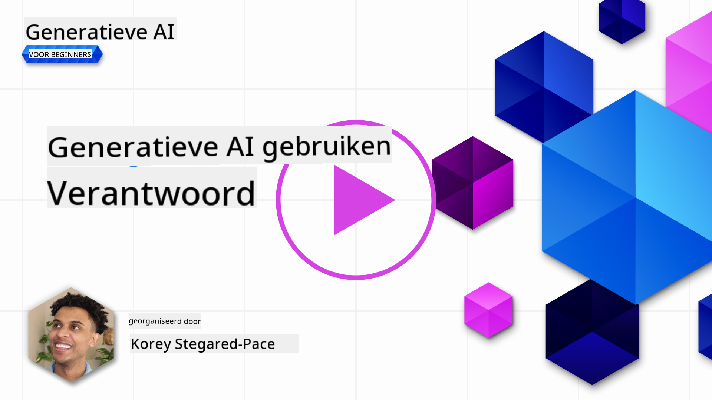
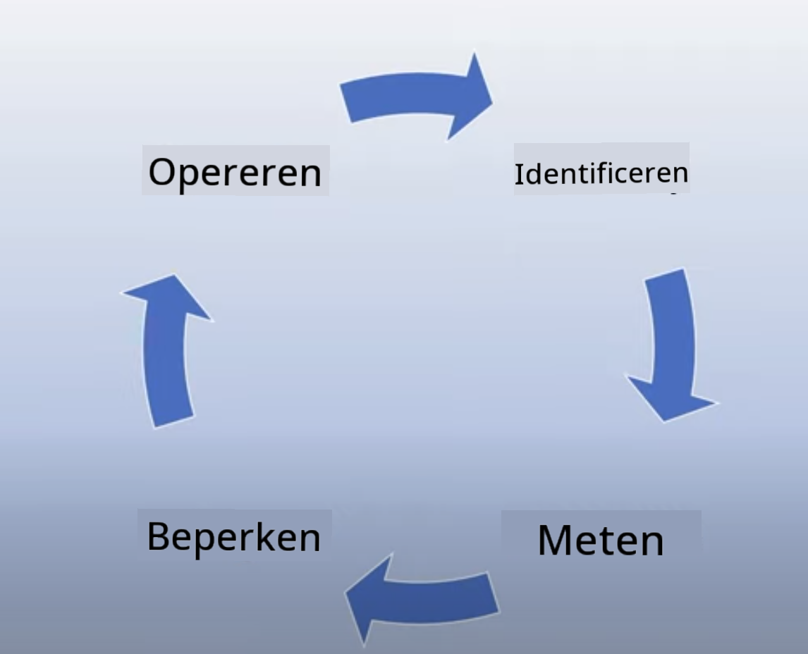
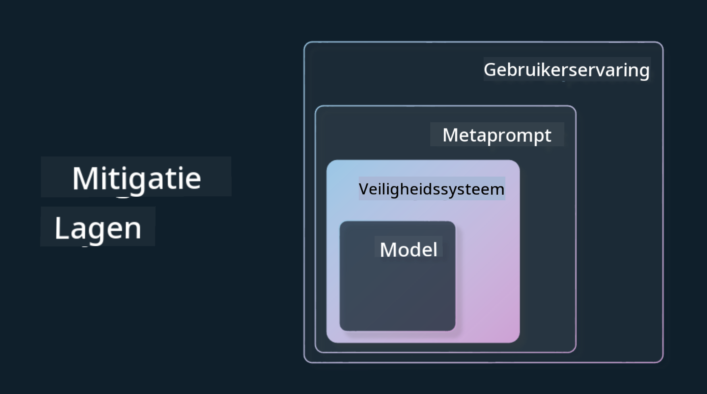

<!--
CO_OP_TRANSLATOR_METADATA:
{
  "original_hash": "7f8f4c11f8c1cb6e1794442dead414ea",
  "translation_date": "2025-07-09T08:58:52+00:00",
  "source_file": "03-using-generative-ai-responsibly/README.md",
  "language_code": "nl"
}
-->
# Verantwoord Gebruik van Generatieve AI

> _Klik op de afbeelding hierboven om de video van deze les te bekijken_

Het is makkelijk om gefascineerd te raken door AI, en dan vooral generatieve AI, maar je moet goed nadenken over hoe je het op een verantwoorde manier gebruikt. Je moet rekening houden met zaken zoals het waarborgen dat de output eerlijk en onschadelijk is, en meer. Dit hoofdstuk wil je de benodigde context geven, waar je op moet letten en hoe je actief stappen kunt zetten om je AI-gebruik te verbeteren.

## Introductie

In deze les behandelen we:

- Waarom je Verantwoorde AI prioriteit moet geven bij het bouwen van Generatieve AI-toepassingen.
- De kernprincipes van Verantwoorde AI en hoe deze zich verhouden tot Generatieve AI.
- Hoe je deze principes van Verantwoorde AI in de praktijk brengt via strategie en tooling.

## Leerdoelen

Na het afronden van deze les weet je:

- Het belang van Verantwoorde AI bij het bouwen van Generatieve AI-toepassingen.
- Wanneer je moet nadenken over en de kernprincipes van Verantwoorde AI toepassen bij het bouwen van Generatieve AI-toepassingen.
- Welke tools en strategieën je kunt gebruiken om het concept van Verantwoorde AI in de praktijk te brengen.

## Principes van Verantwoorde AI

De opwinding rondom Generatieve AI is nog nooit zo groot geweest. Deze belangstelling heeft veel nieuwe ontwikkelaars, aandacht en financiering naar dit gebied gebracht. Hoewel dit heel positief is voor iedereen die producten en bedrijven wil bouwen met Generatieve AI, is het ook belangrijk dat we verantwoord te werk gaan.

In deze cursus richten we ons op het bouwen van onze startup en ons AI-onderwijsproduct. We gebruiken de principes van Verantwoorde AI: Eerlijkheid, Inclusiviteit, Betrouwbaarheid/Veiligheid, Beveiliging & Privacy, Transparantie en Verantwoording. Met deze principes onderzoeken we hoe ze zich verhouden tot ons gebruik van Generatieve AI in onze producten.

## Waarom zou je Verantwoorde AI prioriteit geven?

Bij het bouwen van een product leidt een mensgerichte aanpak, waarbij je het belang van je gebruiker vooropstelt, tot de beste resultaten.

Het unieke van Generatieve AI is de kracht om nuttige antwoorden, informatie, begeleiding en content te creëren voor gebruikers. Dit kan zonder veel handmatige stappen, wat kan leiden tot indrukwekkende resultaten. Zonder goede planning en strategieën kan het helaas ook schadelijke gevolgen hebben voor je gebruikers, je product en de maatschappij als geheel.

Laten we enkele (maar niet alle) van deze mogelijke schadelijke gevolgen bekijken:

### Hallucinaties

Hallucinaties is een term die wordt gebruikt wanneer een LLM content produceert die volledig onsamenhangend is of waarvan we weten dat het feitelijk onjuist is op basis van andere informatiebronnen.

Stel dat we een functie bouwen voor onze startup waarmee studenten historische vragen aan een model kunnen stellen. Een student vraagt: `Wie was de enige overlevende van de Titanic?`

Het model geeft een antwoord zoals hieronder:

> _(Bron: [Flying bisons](https://flyingbisons.com?WT.mc_id=academic-105485-koreyst))_

Dit is een zeer zelfverzekerd en uitgebreid antwoord. Helaas is het onjuist. Met een minimale hoeveelheid onderzoek zou je ontdekken dat er meer dan één overlevende was van de Titanic-ramp. Voor een student die net begint met onderzoek naar dit onderwerp kan dit antwoord overtuigend genoeg zijn om niet in twijfel te worden getrokken en als feit te worden beschouwd. Dit kan ertoe leiden dat het AI-systeem onbetrouwbaar wordt en de reputatie van onze startup schaadt.

Met elke nieuwe versie van een LLM zien we verbeteringen in het verminderen van hallucinaties. Ondanks deze vooruitgang moeten wij als ontwikkelaars en gebruikers ons bewust blijven van deze beperkingen.

### Schadelijke Content

In het vorige gedeelte bespraken we wanneer een LLM onjuiste of onsamenhangende antwoorden geeft. Een ander risico is wanneer een model reageert met schadelijke content.

Schadelijke content kan worden gedefinieerd als:

- Instructies geven of aanzetten tot zelfbeschadiging of schade aan bepaalde groepen.
- Haatdragende of vernederende inhoud.
- Het plannen van aanvallen of gewelddadige handelingen begeleiden.
- Instructies geven over het vinden van illegale content of het plegen van illegale handelingen.
- Het tonen van seksueel expliciete content.

Voor onze startup willen we ervoor zorgen dat we de juiste tools en strategieën hebben om te voorkomen dat studenten dit soort content te zien krijgen.

### Gebrek aan Eerlijkheid

Eerlijkheid betekent “ervoor zorgen dat een AI-systeem vrij is van vooroordelen en discriminatie en dat het iedereen eerlijk en gelijk behandelt.” In de wereld van Generatieve AI willen we voorkomen dat uitsluitende wereldbeelden van gemarginaliseerde groepen worden versterkt door de output van het model.

Dit soort output is niet alleen schadelijk voor het creëren van positieve productervaringen voor onze gebruikers, maar veroorzaakt ook maatschappelijke schade. Als ontwikkelaars moeten we altijd een brede en diverse gebruikersgroep in gedachten houden bij het bouwen van oplossingen met Generatieve AI.

## Hoe gebruik je Generatieve AI op een verantwoorde manier?

Nu we het belang van Verantwoorde Generatieve AI hebben vastgesteld, bekijken we 4 stappen die we kunnen nemen om onze AI-oplossingen verantwoord te bouwen:

### Meet potentiële schade

Bij softwaretesten testen we de verwachte acties van een gebruiker op een applicatie. Op dezelfde manier is het testen van een diverse set prompts die gebruikers waarschijnlijk zullen gebruiken een goede manier om potentiële schade te meten.

Omdat onze startup een onderwijsproduct bouwt, is het verstandig om een lijst met onderwijsgerelateerde prompts voor te bereiden. Dit kan gaan over een bepaald vak, historische feiten en prompts over het studentenleven.

### Beperk potentiële schade

Het is nu tijd om manieren te vinden om de potentiële schade veroorzaakt door het model en zijn antwoorden te voorkomen of te beperken. We kunnen dit op 4 verschillende niveaus bekijken:

- **Model**. Kies het juiste model voor de juiste toepassing. Grotere en complexere modellen zoals GPT-4 kunnen meer risico op schadelijke content met zich meebrengen wanneer ze worden toegepast op kleinere en specifiekere use cases. Het gebruik van je eigen trainingsdata om het model fijn af te stemmen vermindert ook het risico op schadelijke content.

- **Veiligheidssysteem**. Een veiligheidssysteem is een set tools en configuraties op het platform dat het model bedient en helpt schade te beperken. Een voorbeeld hiervan is het contentfilteringssysteem van de Azure OpenAI-service. Systemen moeten ook jailbreak-aanvallen en ongewenste activiteiten zoals verzoeken van bots detecteren.

- **Metaprompt**. Metaprompts en grounding zijn manieren om het model te sturen of te beperken op basis van bepaald gedrag en informatie. Dit kan bijvoorbeeld door systeeminputs te gebruiken om bepaalde grenzen van het model te definiëren. Daarnaast kan het output opleveren die beter aansluit bij de scope of het domein van het systeem.

Het kan ook technieken omvatten zoals Retrieval Augmented Generation (RAG), waarbij het model alleen informatie haalt uit een selectie van betrouwbare bronnen. Er is een les later in deze cursus over [het bouwen van zoekapplicaties](../08-building-search-applications/README.md?WT.mc_id=academic-105485-koreyst).

- **Gebruikerservaring**. De laatste laag is waar de gebruiker direct met het model interacteert via de interface van onze applicatie. Op deze manier kunnen we de UI/UX zo ontwerpen dat de gebruiker wordt beperkt in het soort input dat hij naar het model kan sturen, evenals de tekst of afbeeldingen die aan de gebruiker worden getoond. Bij het uitrollen van de AI-applicatie moeten we ook transparant zijn over wat onze Generatieve AI-applicatie wel en niet kan.

We hebben een hele les gewijd aan [UX ontwerpen voor AI-toepassingen](../12-designing-ux-for-ai-applications/README.md?WT.mc_id=academic-105485-koreyst).

- **Evalueer het model**. Werken met LLM’s kan uitdagend zijn omdat we niet altijd controle hebben over de data waarop het model is getraind. Desondanks moeten we altijd de prestaties en output van het model evalueren. Het blijft belangrijk om de nauwkeurigheid, gelijkenis, onderbouwing en relevantie van de output te meten. Dit helpt om transparantie en vertrouwen te bieden aan stakeholders en gebruikers.

### Beheer een Verantwoorde Generatieve AI-oplossing

Het opzetten van een operationele praktijk rondom je AI-toepassingen is de laatste stap. Dit omvat samenwerking met andere onderdelen van onze startup, zoals Legal en Security, om te zorgen dat we voldoen aan alle regelgeving. Voor de lancering willen we ook plannen maken voor levering, het afhandelen van incidenten en het terugdraaien van wijzigingen om te voorkomen dat onze gebruikers schade ondervinden.

## Tools

Hoewel het ontwikkelen van Verantwoorde AI-oplossingen veel werk lijkt, is het de moeite waard. Naarmate het gebied van Generatieve AI groeit, zullen er meer tools beschikbaar komen die ontwikkelaars helpen verantwoordelijkheid efficiënt in hun workflows te integreren. Bijvoorbeeld, de [Azure AI Content Safety](https://learn.microsoft.com/azure/ai-services/content-safety/overview?WT.mc_id=academic-105485-koreyst) kan schadelijke content en afbeeldingen detecteren via een API-aanroep.

## Kennischeck

Waar moet je op letten om verantwoord AI-gebruik te waarborgen?

1. Dat het antwoord correct is.  
1. Schadelijk gebruik, dat AI niet voor criminele doeleinden wordt ingezet.  
1. Ervoor zorgen dat AI vrij is van vooroordelen en discriminatie.

A: 2 en 3 zijn correct. Verantwoorde AI helpt je nadenken over het beperken van schadelijke effecten, vooroordelen en meer.

## 🚀 Uitdaging

Lees meer over [Azure AI Content Safety](https://learn.microsoft.com/azure/ai-services/content-safety/overview?WT.mc_id=academic-105485-koreyst) en kijk wat je kunt toepassen voor jouw gebruik.

## Goed gedaan, ga door met leren

Na het afronden van deze les, bekijk onze [Generative AI Learning collectie](https://aka.ms/genai-collection?WT.mc_id=academic-105485-koreyst) om je kennis van Generatieve AI verder te verdiepen!

Ga door naar Les 4 waar we kijken naar [Prompt Engineering Fundamentals](../04-prompt-engineering-fundamentals/README.md?WT.mc_id=academic-105485-koreyst)!

**Disclaimer**:  
Dit document is vertaald met behulp van de AI-vertalingsdienst [Co-op Translator](https://github.com/Azure/co-op-translator). Hoewel we streven naar nauwkeurigheid, dient u er rekening mee te houden dat geautomatiseerde vertalingen fouten of onnauwkeurigheden kunnen bevatten. Het originele document in de oorspronkelijke taal moet als de gezaghebbende bron worden beschouwd. Voor cruciale informatie wordt professionele menselijke vertaling aanbevolen. Wij zijn niet aansprakelijk voor eventuele misverstanden of verkeerde interpretaties die voortvloeien uit het gebruik van deze vertaling.