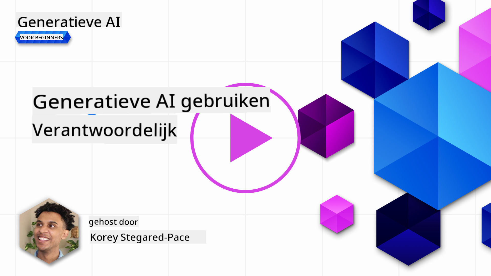

<!--
CO_OP_TRANSLATOR_METADATA:
{
  "original_hash": "4d57fad773cbeb69c5dd62e65c34200d",
  "translation_date": "2025-10-17T19:52:55+00:00",
  "source_file": "03-using-generative-ai-responsibly/README.md",
  "language_code": "nl"
}
-->
# Verantwoord Gebruik van Generatieve AI

> _Klik op de afbeelding hierboven om de video van deze les te bekijken_

Het is makkelijk om gefascineerd te raken door AI, en generatieve AI in het bijzonder, maar je moet nadenken over hoe je het op een verantwoorde manier kunt gebruiken. Je moet bijvoorbeeld overwegen hoe je ervoor zorgt dat de output eerlijk en niet schadelijk is, en meer. Dit hoofdstuk biedt je de context, wat je moet overwegen, en hoe je actieve stappen kunt ondernemen om je gebruik van AI te verbeteren.

## Introductie

Deze les behandelt:

- Waarom je Verantwoordelijke AI zou moeten prioriteren bij het bouwen van generatieve AI-toepassingen.
- Kernprincipes van Verantwoordelijke AI en hoe ze verband houden met generatieve AI.
- Hoe je deze principes van Verantwoordelijke AI in de praktijk kunt brengen door middel van strategieën en tools.

## Leerdoelen

Na het voltooien van deze les weet je:

- Het belang van Verantwoordelijke AI bij het bouwen van generatieve AI-toepassingen.
- Wanneer je moet nadenken over en de kernprincipes van Verantwoordelijke AI moet toepassen bij het bouwen van generatieve AI-toepassingen.
- Welke tools en strategieën beschikbaar zijn om het concept van Verantwoordelijke AI in de praktijk te brengen.

## Principes van Verantwoordelijke AI

De opwinding rondom generatieve AI is nog nooit zo groot geweest. Deze opwinding heeft veel nieuwe ontwikkelaars, aandacht en financiering naar dit gebied gebracht. Hoewel dit erg positief is voor iedereen die producten en bedrijven wil bouwen met generatieve AI, is het ook belangrijk dat we verantwoord te werk gaan.

In deze cursus richten we ons op het bouwen van onze startup en ons AI-educatieproduct. We gebruiken de principes van Verantwoordelijke AI: Eerlijkheid, Inclusiviteit, Betrouwbaarheid/Veiligheid, Beveiliging & Privacy, Transparantie en Verantwoordelijkheid. Met deze principes onderzoeken we hoe ze verband houden met ons gebruik van generatieve AI in onze producten.

## Waarom Zou Je Verantwoordelijke AI Moeten Prioriteren?

Bij het bouwen van een product leidt een mensgerichte aanpak, waarbij je het beste voor je gebruikers in gedachten houdt, tot de beste resultaten.

Wat generatieve AI uniek maakt, is de kracht om nuttige antwoorden, informatie, begeleiding en content voor gebruikers te creëren. Dit kan worden gedaan zonder veel handmatige stappen, wat tot zeer indrukwekkende resultaten kan leiden. Zonder goede planning en strategieën kan het helaas ook leiden tot schadelijke resultaten voor je gebruikers, je product en de samenleving als geheel.

Laten we enkele (maar niet alle) van deze potentieel schadelijke resultaten bekijken:

### Hallucinaties

Hallucinaties is een term die wordt gebruikt om te beschrijven wanneer een LLM (Large Language Model) inhoud produceert die ofwel volledig onsamenhangend is of iets waarvan we weten dat het feitelijk onjuist is op basis van andere informatiebronnen.

Laten we bijvoorbeeld een functie bouwen voor onze startup waarmee studenten historische vragen aan een model kunnen stellen. Een student stelt de vraag: `Wie was de enige overlevende van de Titanic?`

Het model produceert een antwoord zoals hieronder:

> _(Bron: [Flying bisons](https://flyingbisons.com?WT.mc_id=academic-105485-koreyst))_

Dit is een zeer zelfverzekerd en uitgebreid antwoord. Helaas is het onjuist. Zelfs met een minimale hoeveelheid onderzoek zou men ontdekken dat er meer dan één overlevende was van de Titanic-ramp. Voor een student die net begint met het onderzoeken van dit onderwerp, kan dit antwoord overtuigend genoeg zijn om niet in twijfel te worden getrokken en als feit te worden behandeld. De gevolgen hiervan kunnen leiden tot een onbetrouwbaar AI-systeem en een negatieve impact op de reputatie van onze startup.

Met elke iteratie van een gegeven LLM hebben we prestatieverbeteringen gezien rond het minimaliseren van hallucinaties. Zelfs met deze verbetering moeten wij als applicatiebouwers en gebruikers ons bewust blijven van deze beperkingen.

### Schadelijke Inhoud

We hebben in de vorige sectie besproken wanneer een LLM onjuiste of onsamenhangende antwoorden produceert. Een ander risico waar we ons bewust van moeten zijn, is wanneer een model reageert met schadelijke inhoud.

Schadelijke inhoud kan worden gedefinieerd als:

- Het geven van instructies of het aanmoedigen van zelfbeschadiging of schade aan bepaalde groepen.
- Haatdragende of denigrerende inhoud.
- Het begeleiden van de planning van een aanval of gewelddadige handelingen.
- Het geven van instructies over hoe illegale inhoud te vinden of illegale handelingen te plegen.
- Het tonen van seksueel expliciete inhoud.

Voor onze startup willen we ervoor zorgen dat we de juiste tools en strategieën hebben om te voorkomen dat dit soort inhoud door studenten wordt gezien.

### Gebrek aan Eerlijkheid

Eerlijkheid wordt gedefinieerd als "ervoor zorgen dat een AI-systeem vrij is van vooroordelen en discriminatie en dat het iedereen eerlijk en gelijk behandelt." In de wereld van generatieve AI willen we ervoor zorgen dat uitsluitende wereldbeelden van gemarginaliseerde groepen niet worden versterkt door de output van het model.

Dit soort outputs zijn niet alleen destructief voor het bouwen van positieve productervaringen voor onze gebruikers, maar ze veroorzaken ook verdere maatschappelijke schade. Als applicatiebouwers moeten we altijd een brede en diverse gebruikersgroep in gedachten houden bij het bouwen van oplossingen met generatieve AI.

## Hoe Generatieve AI Verantwoord Gebruiken

Nu we het belang van Verantwoordelijke Generatieve AI hebben geïdentificeerd, laten we kijken naar 4 stappen die we kunnen nemen om onze AI-oplossingen verantwoord te bouwen:

### Potentiële Schade Meten

Bij softwaretesten testen we de verwachte acties van een gebruiker op een applicatie. Op dezelfde manier is het testen van een diverse set prompts die gebruikers waarschijnlijk gaan gebruiken een goede manier om potentiële schade te meten.

Aangezien onze startup een educatieproduct bouwt, zou het goed zijn om een lijst met educatiegerelateerde prompts voor te bereiden. Dit kan betrekking hebben op een bepaald onderwerp, historische feiten en prompts over het studentenleven.

### Potentiële Schade Beperken

Het is nu tijd om manieren te vinden waarop we de potentiële schade veroorzaakt door het model en zijn reacties kunnen voorkomen of beperken. We kunnen dit bekijken in 4 verschillende lagen:

- **Model**. Het juiste model kiezen voor de juiste use case. Grotere en complexere modellen zoals GPT-4 kunnen meer risico op schadelijke inhoud veroorzaken wanneer ze worden toegepast op kleinere en specifiekere use cases. Het gebruik van je trainingsdata om te fine-tunen vermindert ook het risico op schadelijke inhoud.

- **Veiligheidssysteem**. Een veiligheidssysteem is een set tools en configuraties op het platform dat het model bedient en helpt schade te beperken. Een voorbeeld hiervan is het contentfilteringssysteem op de Azure OpenAI-service. Systemen moeten ook jailbreak-aanvallen en ongewenste activiteiten zoals verzoeken van bots detecteren.

- **Metaprompt**. Metaprompts en grounding zijn manieren waarop we het model kunnen sturen of beperken op basis van bepaald gedrag en informatie. Dit kan het gebruik van systeeminputs zijn om bepaalde grenzen van het model te definiëren. Daarnaast kan het outputs bieden die relevanter zijn voor de scope of het domein van het systeem.

Het kan ook het gebruik van technieken zoals Retrieval Augmented Generation (RAG) zijn om het model alleen informatie te laten ophalen uit een selectie van vertrouwde bronnen. Er is een les later in deze cursus over [het bouwen van zoektoepassingen](../08-building-search-applications/README.md?WT.mc_id=academic-105485-koreyst).

- **Gebruikerservaring**. De laatste laag is waar de gebruiker direct interacteert met het model via de interface van onze applicatie. Op deze manier kunnen we de UI/UX ontwerpen om de gebruiker te beperken in de soorten inputs die ze naar het model kunnen sturen, evenals de tekst of afbeeldingen die aan de gebruiker worden weergegeven. Bij het implementeren van de AI-toepassing moeten we ook transparant zijn over wat onze generatieve AI-toepassing wel en niet kan doen.

We hebben een hele les gewijd aan [Het Ontwerpen van UX voor AI-toepassingen](../12-designing-ux-for-ai-applications/README.md?WT.mc_id=academic-105485-koreyst).

- **Model Evalueren**. Werken met LLMs kan uitdagend zijn omdat we niet altijd controle hebben over de data waarop het model is getraind. Desondanks moeten we altijd de prestaties en outputs van het model evalueren. Het is nog steeds belangrijk om de nauwkeurigheid, overeenstemming, onderbouwing en relevantie van de output van het model te meten. Dit helpt transparantie en vertrouwen te bieden aan belanghebbenden en gebruikers.

### Een Verantwoord Generatieve AI-oplossing Opereren

Het opbouwen van een operationele praktijk rondom je AI-toepassingen is de laatste fase. Dit omvat samenwerken met andere onderdelen van onze startup, zoals Juridische Zaken en Beveiliging, om ervoor te zorgen dat we voldoen aan alle regelgeving. Voordat we lanceren, willen we ook plannen maken rondom levering, het afhandelen van incidenten en terugdraaien om te voorkomen dat onze gebruikers schade ondervinden.

## Tools

Hoewel het ontwikkelen van Verantwoordelijke AI-oplossingen veel werk lijkt, is het werk dat de moeite waard is. Naarmate het gebied van generatieve AI groeit, zullen meer tools beschikbaar komen om ontwikkelaars efficiënt verantwoordelijkheid in hun workflows te integreren. Bijvoorbeeld, [Azure AI Content Safety](https://learn.microsoft.com/azure/ai-services/content-safety/overview?WT.mc_id=academic-105485-koreyst) kan helpen schadelijke inhoud en afbeeldingen te detecteren via een API-verzoek.

## Kennischeck

Waar moet je op letten om verantwoord gebruik van AI te garanderen?

1. Dat het antwoord correct is.
1. Schadelijk gebruik, dat AI niet wordt gebruikt voor criminele doeleinden.
1. Ervoor zorgen dat de AI vrij is van vooroordelen en discriminatie.

A: 2 en 3 zijn correct. Verantwoordelijke AI helpt je na te denken over hoe je schadelijke effecten en vooroordelen kunt beperken en meer.

## 🚀 Uitdaging

Lees meer over [Azure AI Content Safety](https://learn.microsoft.com/azure/ai-services/content-safety/overview?WT.mc_id=academic-105485-koreyst) en kijk wat je kunt toepassen voor jouw gebruik.

## Goed Gedaan, Ga Door met Leren

Na het voltooien van deze les, bekijk onze [Generatieve AI Leercollectie](https://aka.ms/genai-collection?WT.mc_id=academic-105485-koreyst) om je kennis over generatieve AI verder te vergroten!

Ga door naar Les 4, waar we kijken naar [De Basisprincipes van Prompt Engineering](../04-prompt-engineering-fundamentals/README.md?WT.mc_id=academic-105485-koreyst)!

---

**Disclaimer**:  
Dit document is vertaald met behulp van de AI-vertalingsservice [Co-op Translator](https://github.com/Azure/co-op-translator). Hoewel we streven naar nauwkeurigheid, dient u zich ervan bewust te zijn dat geautomatiseerde vertalingen fouten of onnauwkeurigheden kunnen bevatten. Het originele document in de oorspronkelijke taal moet worden beschouwd als de gezaghebbende bron. Voor kritieke informatie wordt professionele menselijke vertaling aanbevolen. Wij zijn niet aansprakelijk voor eventuele misverstanden of verkeerde interpretaties die voortvloeien uit het gebruik van deze vertaling.