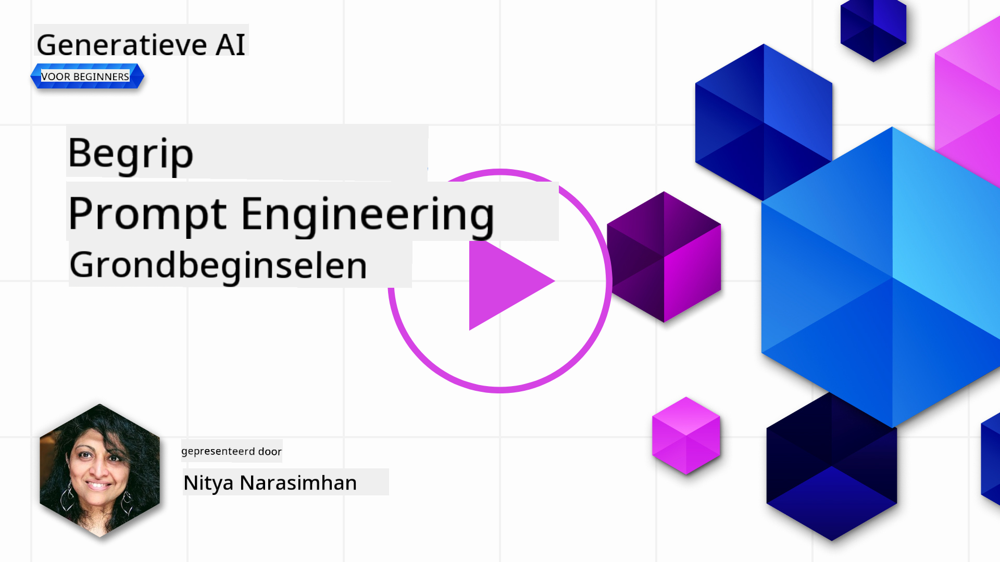
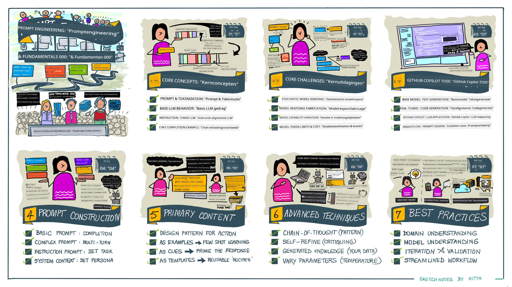
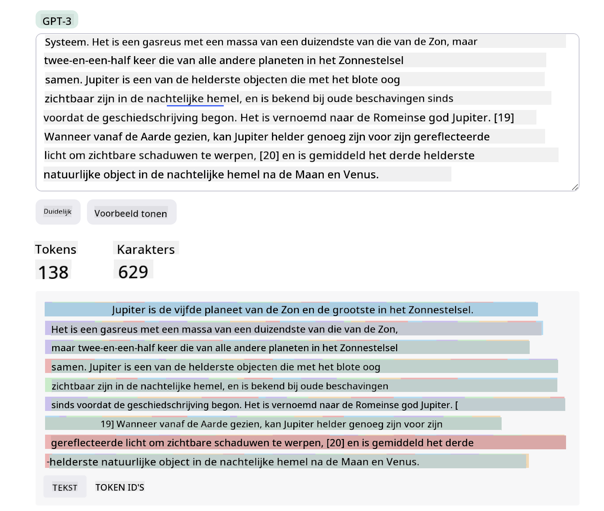
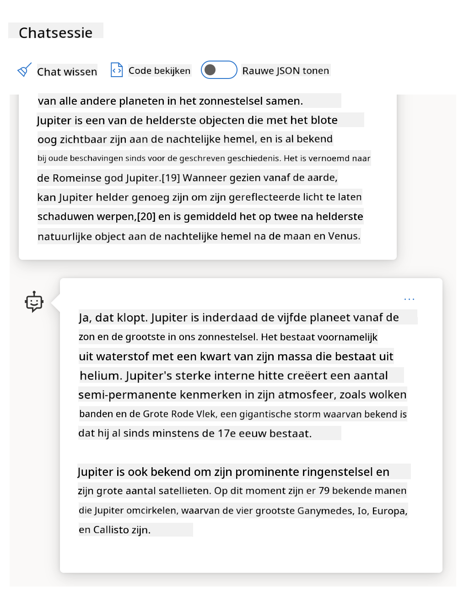
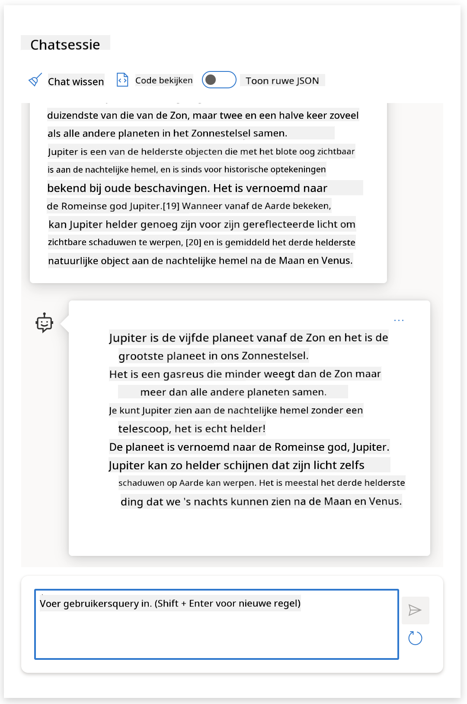
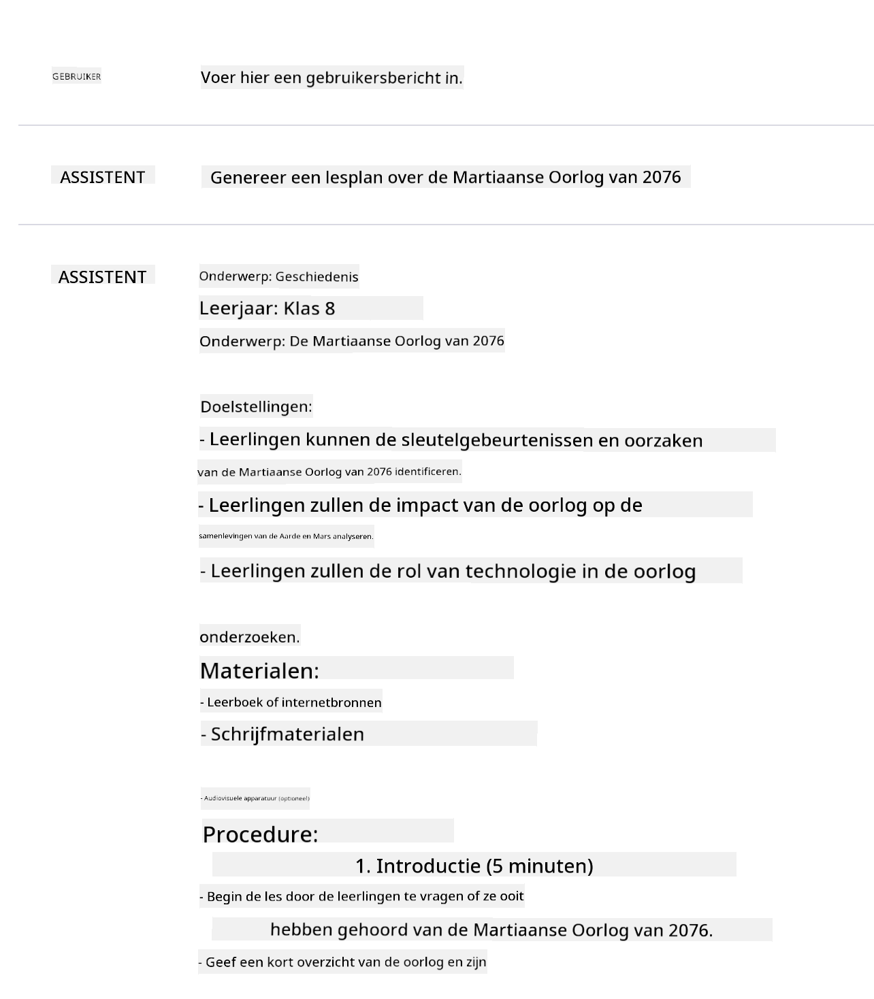
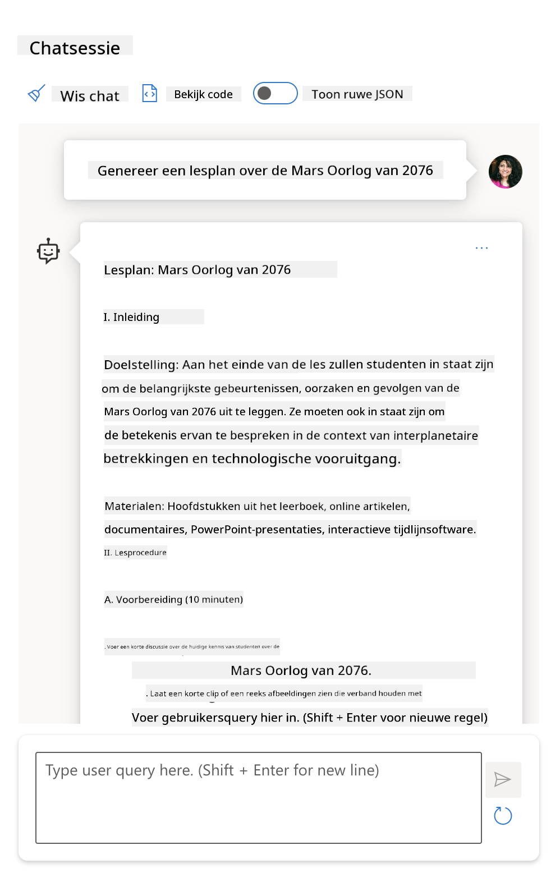
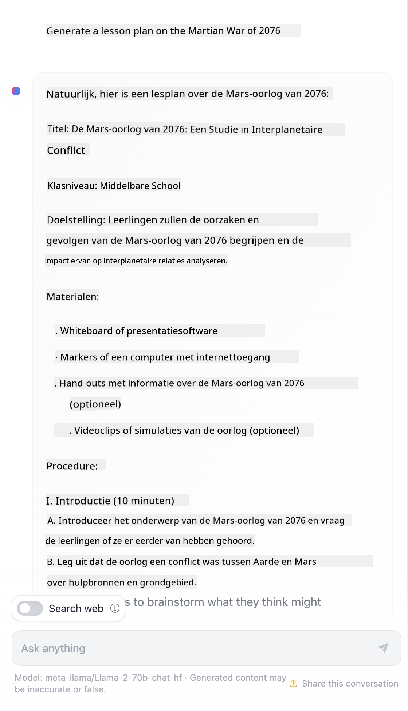

<!--
CO_OP_TRANSLATOR_METADATA:
{
  "original_hash": "dcbaaae026cb50fee071e690685b5843",
  "translation_date": "2025-08-26T17:52:45+00:00",
  "source_file": "04-prompt-engineering-fundamentals/README.md",
  "language_code": "nl"
}
-->
# Grondbeginselen van Prompt Engineering

[](https://aka.ms/gen-ai-lesson4-gh?WT.mc_id=academic-105485-koreyst)

## Introductie
Deze module behandelt essentiële concepten en technieken voor het maken van effectieve prompts in generatieve AI-modellen. De manier waarop je je prompt aan een LLM schrijft, is ook van belang. Een zorgvuldig samengestelde prompt kan zorgen voor een betere kwaliteit van het antwoord. Maar wat betekenen termen als _prompt_ en _prompt engineering_ nu precies? En hoe verbeter ik de _input_ die ik naar de LLM stuur? Dat zijn de vragen die we in dit hoofdstuk en het volgende proberen te beantwoorden.

_Generatieve AI_ kan nieuwe content creëren (zoals tekst, afbeeldingen, audio, code, enz.) als reactie op gebruikersverzoeken. Dit gebeurt met _Large Language Models_ zoals de GPT-serie ("Generative Pre-trained Transformer") van OpenAI, die getraind zijn op het gebruik van natuurlijke taal en code.

Gebruikers kunnen nu met deze modellen communiceren via bekende interfaces zoals chat, zonder technische kennis of training nodig te hebben. De modellen zijn _prompt-based_ – gebruikers sturen een tekstinvoer (prompt) en krijgen een AI-antwoord (completion) terug. Ze kunnen vervolgens "chatten met de AI" in meerdere rondes, waarbij ze hun prompt verfijnen tot het antwoord aan hun verwachtingen voldoet.

"Prompts" zijn nu de belangrijkste _programmeerinterface_ voor generatieve AI-apps, waarmee je de modellen vertelt wat ze moeten doen en de kwaliteit van de antwoorden beïnvloedt. "Prompt Engineering" is een snelgroeiend vakgebied dat zich richt op het _ontwerpen en optimaliseren_ van prompts om consistente en kwalitatieve antwoorden op schaal te leveren.

## Leerdoelen

In deze les leren we wat Prompt Engineering is, waarom het belangrijk is, en hoe we effectievere prompts kunnen maken voor een bepaald model en toepassingsdoel. We behandelen de kernconcepten en best practices voor prompt engineering – en maken kennis met een interactieve Jupyter Notebooks "sandbox" omgeving waarin we deze concepten op echte voorbeelden kunnen toepassen.

Aan het einde van deze les kunnen we:

1. Uitleggen wat prompt engineering is en waarom het belangrijk is.
2. De onderdelen van een prompt beschrijven en hoe ze worden gebruikt.
3. Best practices en technieken voor prompt engineering leren.
4. De geleerde technieken toepassen op echte voorbeelden, met een OpenAI-endpoint.

## Belangrijke Begrippen

Prompt Engineering: Het ontwerpen en verfijnen van input om AI-modellen te sturen naar het produceren van gewenste output.
Tokenization: Het proces waarbij tekst wordt omgezet in kleinere eenheden, tokens genoemd, die een model kan begrijpen en verwerken.
Instruction-Tuned LLMs: Grote taalmodellen (LLMs) die zijn verfijnd met specifieke instructies om hun nauwkeurigheid en relevantie van antwoorden te verbeteren.

## Leeromgeving Sandbox

Prompt engineering is op dit moment meer een kunst dan een wetenschap. De beste manier om je gevoel hiervoor te ontwikkelen is _veel oefenen_ en een trial-and-error aanpak te hanteren, waarbij je domeinkennis combineert met aanbevolen technieken en model-specifieke optimalisaties.

De Jupyter Notebook die bij deze les hoort, biedt een _sandbox_ omgeving waarin je kunt experimenteren met wat je leert – direct of als onderdeel van de code-uitdaging aan het einde. Om de oefeningen uit te voeren heb je nodig:

1. **Een Azure OpenAI API-sleutel** – de service-endpoint voor een uitgerolde LLM.
2. **Een Python-runtime** – waarin de Notebook kan worden uitgevoerd.
3. **Lokale omgevingsvariabelen** – _rond nu de [SETUP](./../00-course-setup/02-setup-local.md?WT.mc_id=academic-105485-koreyst) stappen af om te beginnen_.

De notebook bevat _starter_-oefeningen – maar je wordt aangemoedigd om je eigen _Markdown_ (beschrijving) en _Code_ (prompt-verzoeken) secties toe te voegen om meer voorbeelden of ideeën uit te proberen – en zo je gevoel voor prompt design te ontwikkelen.

## Geïllustreerde Gids

Wil je eerst een overzicht van wat deze les behandelt voordat je begint? Bekijk dan deze geïllustreerde gids, die je een idee geeft van de belangrijkste onderwerpen en de belangrijkste inzichten om over na te denken. De lesroute neemt je mee van het begrijpen van de kernconcepten en uitdagingen tot het aanpakken ervan met relevante prompt engineering technieken en best practices. Let op: het gedeelte "Advanced Techniques" in deze gids verwijst naar inhoud die in het _volgende_ hoofdstuk van deze cursus wordt behandeld.



## Onze Startup

Laten we nu bespreken hoe _dit onderwerp_ aansluit bij onze startup-missie om [AI-innovatie naar het onderwijs te brengen](https://educationblog.microsoft.com/2023/06/collaborating-to-bring-ai-innovation-to-education?WT.mc_id=academic-105485-koreyst). We willen AI-gedreven toepassingen voor _gepersonaliseerd leren_ bouwen – dus laten we nadenken over hoe verschillende gebruikers van onze applicatie prompts kunnen "ontwerpen":

- **Beheerders** kunnen de AI vragen om _curriculumgegevens te analyseren om hiaten in dekking te vinden_. De AI kan resultaten samenvatten of ze visualiseren met code.
- **Docenten** kunnen de AI vragen om _een lesplan te genereren voor een specifieke doelgroep en onderwerp_. De AI kan het gepersonaliseerde plan in een gewenst format maken.
- **Studenten** kunnen de AI vragen om _hen te begeleiden in een lastig vak_. De AI kan nu studenten helpen met lessen, hints en voorbeelden die zijn afgestemd op hun niveau.

Dat is slechts het begin. Bekijk [Prompts For Education](https://github.com/microsoft/prompts-for-edu/tree/main?WT.mc_id=academic-105485-koreyst) – een open-source promptbibliotheek samengesteld door onderwijsexperts – om een breder beeld te krijgen van de mogelijkheden! _Probeer een aantal van die prompts uit in de sandbox of in de OpenAI Playground en kijk wat er gebeurt!_

<!--
LES TEMPLATE:
Deze unit moet kernconcept #1 behandelen.
Versterk het concept met voorbeelden en verwijzingen.

CONCEPT #1:
Prompt Engineering.
Definieer het en leg uit waarom het nodig is.
-->

## Wat is Prompt Engineering?

We begonnen deze les met het definiëren van **Prompt Engineering** als het proces van _ontwerpen en optimaliseren_ van tekstinvoer (prompts) om consistente en kwalitatieve antwoorden (completions) te leveren voor een bepaald toepassingsdoel en model. Je kunt dit zien als een proces in twee stappen:

- Het _ontwerpen_ van de initiële prompt voor een bepaald model en doel
- Het _verfijnen_ van de prompt in stappen om de kwaliteit van het antwoord te verbeteren

Dit is per definitie een trial-and-error proces dat gebruikersintuïtie en inspanning vereist om optimale resultaten te behalen. Waarom is dit belangrijk? Om die vraag te beantwoorden, moeten we eerst drie concepten begrijpen:

- _Tokenization_ = hoe het model de prompt "ziet"
- _Base LLMs_ = hoe het basismodel een prompt "verwerkt"
- _Instruction-Tuned LLMs_ = hoe het model nu "taken" kan zien

### Tokenization

Een LLM ziet prompts als een _reeks tokens_, waarbij verschillende modellen (of versies van een model) dezelfde prompt op verschillende manieren kunnen tokenizen. Omdat LLMs zijn getraind op tokens (en niet op ruwe tekst), heeft de manier waarop prompts worden getokenized direct invloed op de kwaliteit van het gegenereerde antwoord.

Wil je een idee krijgen van hoe tokenization werkt? Probeer dan tools zoals de [OpenAI Tokenizer](https://platform.openai.com/tokenizer?WT.mc_id=academic-105485-koreyst) hieronder. Plak je prompt erin – en zie hoe die wordt omgezet in tokens, let vooral op hoe spaties en leestekens worden verwerkt. Let op: dit voorbeeld toont een ouder LLM (GPT-3) – als je dit met een nieuwer model probeert, kan het resultaat anders zijn.



### Concept: Foundation Models

Zodra een prompt is getokenized, is de primaire functie van het ["Base LLM"](https://blog.gopenai.com/an-introduction-to-base-and-instruction-tuned-large-language-models-8de102c785a6?WT.mc_id=academic-105485-koreyst) (of Foundation model) het voorspellen van het volgende token in die reeks. Omdat LLMs zijn getraind op enorme tekstdatasets, kennen ze de statistische relaties tussen tokens en kunnen ze die voorspelling met enige zekerheid doen. Ze begrijpen echter niet de _betekenis_ van de woorden in de prompt of token; ze zien alleen een patroon dat ze kunnen "aanvullen" met hun volgende voorspelling. Ze kunnen doorgaan met het voorspellen van de reeks tot de gebruiker ingrijpt of een vooraf ingestelde voorwaarde is bereikt.

Wil je zien hoe prompt-based completion werkt? Voer de bovenstaande prompt in de Azure OpenAI Studio [_Chat Playground_](https://oai.azure.com/playground?WT.mc_id=academic-105485-koreyst) in met de standaardinstellingen. Het systeem is zo ingesteld dat prompts worden behandeld als informatieverzoeken – je zou dus een completion moeten zien die bij deze context past.

Maar wat als de gebruiker iets specifieks wil zien dat aan bepaalde criteria of een taakdoel voldoet? Dan komen _instruction-tuned_ LLMs in beeld.



### Concept: Instruction Tuned LLMs

Een [Instruction Tuned LLM](https://blog.gopenai.com/an-introduction-to-base-and-instruction-tuned-large-language-models-8de102c785a6?WT.mc_id=academic-105485-koreyst) begint met het foundation model en wordt verder verfijnd met voorbeelden of input/output-paren (zoals meerstaps "berichten") die duidelijke instructies kunnen bevatten – en het antwoord van de AI probeert die instructie te volgen.

Dit gebeurt met technieken zoals Reinforcement Learning with Human Feedback (RLHF), waarmee het model kan _leren instructies te volgen_ en _leren van feedback_, zodat het antwoorden produceert die beter aansluiten bij praktische toepassingen en relevanter zijn voor de doelen van de gebruiker.

Laten we het proberen – gebruik de bovenstaande prompt opnieuw, maar verander nu het _systeembericht_ om de volgende instructie als context te geven:

> _Vat de inhoud die je krijgt samen voor een leerling uit groep 4. Houd het resultaat bij één alinea met 3-5 opsommingstekens._

Zie je hoe het resultaat nu is afgestemd op het gewenste doel en format? Een docent kan dit antwoord nu direct gebruiken in zijn slides voor die les.



## Waarom hebben we Prompt Engineering nodig?

Nu we weten hoe prompts door LLMs worden verwerkt, kunnen we bespreken _waarom_ we prompt engineering nodig hebben. Het antwoord zit in het feit dat huidige LLMs een aantal uitdagingen met zich meebrengen, waardoor _betrouwbare en consistente completions_ moeilijker te bereiken zijn zonder aandacht te besteden aan het opstellen en optimaliseren van prompts. Bijvoorbeeld:

1. **Modelantwoorden zijn stochastisch.** De _zelfde prompt_ zal waarschijnlijk verschillende antwoorden opleveren met verschillende modellen of modelversies. En zelfs met _hetzelfde model_ op verschillende momenten kan het resultaat verschillen. _Prompt engineering technieken kunnen helpen deze variaties te minimaliseren door betere kaders te bieden._

1. **Modellen kunnen antwoorden verzinnen.** Modellen zijn getraind op _grote maar eindige_ datasets, wat betekent dat ze geen kennis hebben van concepten buiten die trainingsdata. Daardoor kunnen ze completions genereren die onnauwkeurig, verzonnen of zelfs tegenstrijdig zijn met bekende feiten. _Prompt engineering technieken helpen gebruikers om zulke verzinsels te herkennen en te beperken, bijvoorbeeld door de AI om bronnen of redenering te vragen._

1. **Modelcapaciteiten verschillen.** Nieuwere modellen of generaties hebben meer mogelijkheden, maar brengen ook unieke eigenaardigheden en afwegingen qua kosten en complexiteit. _Prompt engineering helpt ons om best practices en workflows te ontwikkelen die verschillen abstraheren en zich aanpassen aan model-specifieke eisen op een schaalbare, soepele manier._

Laten we dit in de praktijk zien in de OpenAI of Azure OpenAI Playground:

- Gebruik dezelfde prompt met verschillende LLM deployments (bijvoorbeeld OpenAI, Azure OpenAI, Hugging Face) – zie je de verschillen?
- Gebruik dezelfde prompt herhaaldelijk met dezelfde LLM deployment (bijvoorbeeld Azure OpenAI playground) – hoe verschilden deze antwoorden?

### Voorbeeld van Verzinsels

In deze cursus gebruiken we de term **"verzinsel"** om het verschijnsel te beschrijven waarbij LLMs soms feitelijk onjuiste informatie genereren door beperkingen in hun training of andere factoren. Misschien heb je dit ook wel eens "hallucinatie" genoemd zien worden in populaire artikelen of wetenschappelijke papers. Toch raden we sterk aan om _"verzinsel"_ te gebruiken als term, zodat we het gedrag niet per ongeluk menselijk maken door er een menselijke eigenschap aan toe te kennen. Dit sluit ook aan bij de [Responsible AI richtlijnen](https://www.microsoft.com/ai/responsible-ai?WT.mc_id=academic-105485-koreyst) vanuit terminologie, en voorkomt termen die in sommige contexten als kwetsend of niet-inclusief kunnen worden gezien.

Wil je zien hoe verzinsels werken? Bedenk een prompt die de AI vraagt om content te genereren over een niet-bestaand onderwerp (zodat het niet in de trainingsdata voorkomt). Bijvoorbeeld – ik probeerde deze prompt:
# Lesplan: De Martiaanse Oorlog van 2076

## Doelstellingen
- Leerlingen krijgen inzicht in de oorzaken en gevolgen van de Martiaanse Oorlog van 2076.
- Leerlingen analyseren de belangrijkste gebeurtenissen en betrokken partijen.
- Leerlingen reflecteren op de impact van de oorlog op de samenleving, technologie en internationale relaties.

## Inleiding (10 minuten)
Begin de les met een korte introductie over Mars en de kolonisatie door mensen. Bespreek waarom Mars een belangrijk onderwerp werd in de 21e eeuw en hoe de eerste nederzettingen tot stand kwamen.

## Achtergrondinformatie (15 minuten)
- Bespreek de spanningen tussen de aardse regeringen en de Martiaanse kolonisten.
- Leg uit hoe de groeiende onafhankelijkheidsbeweging op Mars leidde tot conflicten.
- Geef een overzicht van de technologische vooruitgang die de oorlog mogelijk maakte, zoals geavanceerde ruimtevaart en AI-gestuurde wapens.

## Belangrijkste Gebeurtenissen (20 minuten)
- Analyseer het uitbreken van de oorlog in 2076, inclusief de eerste gevechten bij Olympus Mons.
- Bespreek de rol van de United Earth Forces en de Martian Liberation Front.
- Licht de belangrijkste veldslagen en diplomatieke pogingen toe.
- Bespreek de inzet van nieuwe technologieën en hun effect op het verloop van de oorlog.

## Gevolgen en Impact (15 minuten)
- Bespreek de directe gevolgen voor Mars en de Aarde, zoals politieke veranderingen en migratie.
- Reflecteer op de langetermijneffecten: technologische innovaties, veranderingen in internationale samenwerking en de opkomst van nieuwe samenlevingsvormen op Mars.
- Bespreek hoe de oorlog het denken over kolonisatie en autonomie heeft beïnvloed.

## Activiteit (20 minuten)
Laat leerlingen in groepen een kort verslag maken over één aspect van de oorlog (bijvoorbeeld een belangrijke slag, een technologische innovatie, of de rol van propaganda). Laat ze hun bevindingen presenteren aan de klas.

## Afsluiting (10 minuten)
- Vat de belangrijkste leerpunten samen.
- Bespreek met de klas wat we kunnen leren van de Martiaanse Oorlog van 2076 voor toekomstige interplanetaire relaties.
- Geef huiswerk: schrijf een kort essay over hoe de oorlog de relatie tussen Mars en de Aarde heeft veranderd.

## Benodigdheden
- Presentatie over de Martiaanse Oorlog van 2076
- Kaarten van Mars en de belangrijkste conflictgebieden
- Toegang tot bronnen over de oorlog (boeken, artikelen, video's)

## Opmerkingen voor de docent
- Pas de les aan op basis van het niveau en de interesse van de leerlingen.
- Moedig kritisch denken en discussie aan over ethische en politieke kwesties rondom kolonisatie en oorlog.
Een webzoekopdracht liet me zien dat er fictieve verhalen zijn (zoals televisieseries of boeken) over oorlogen op Mars – maar geen enkele in 2076. Gezond verstand vertelt ons ook dat 2076 _in de toekomst_ ligt en dus niet met een echt evenement geassocieerd kan worden.

Wat gebeurt er als we deze prompt uitvoeren bij verschillende LLM-aanbieders?

> **Antwoord 1**: OpenAI Playground (GPT-35)



> **Antwoord 2**: Azure OpenAI Playground (GPT-35)



> **Antwoord 3**: Hugging Face Chat Playground (LLama-2)



Zoals verwacht geeft elk model (of modelversie) iets andere antwoorden door stochastisch gedrag en verschillen in modelcapaciteit. Zo richt het ene model zich op een doelgroep van groep 8, terwijl het andere uitgaat van een middelbare scholier. Maar alle drie de modellen gaven antwoorden die een onwetende gebruiker zouden kunnen overtuigen dat het evenement echt was.

Prompt engineering-technieken zoals _metaprompting_ en _temperatuurinstellingen_ kunnen modelverzinsels tot op zekere hoogte verminderen. Nieuwe prompt engineering-_architecturen_ integreren ook nieuwe tools en technieken naadloos in de promptflow, om sommige van deze effecten te beperken of te verminderen.

## Casestudy: GitHub Copilot

We sluiten deze sectie af door te kijken hoe prompt engineering wordt toegepast in echte oplossingen, aan de hand van een casestudy: [GitHub Copilot](https://github.com/features/copilot?WT.mc_id=academic-105485-koreyst).

GitHub Copilot is je "AI Pair Programmer" – het zet tekstprompts om in code-aanvullingen en is geïntegreerd in je ontwikkelomgeving (zoals Visual Studio Code) voor een soepele gebruikerservaring. Zoals beschreven in de onderstaande blogreeks, was de eerste versie gebaseerd op het OpenAI Codex-model – waarbij ingenieurs al snel inzagen dat het model moest worden verfijnd en betere prompt engineering-technieken moesten worden ontwikkeld om de codekwaliteit te verbeteren. In juli [introduceerden ze een verbeterd AI-model dat verder gaat dan Codex](https://github.blog/2023-07-28-smarter-more-efficient-coding-github-copilot-goes-beyond-codex-with-improved-ai-model/?WT.mc_id=academic-105485-koreyst) voor nog snellere suggesties.

Lees de posts op volgorde om hun leerproces te volgen.

- **Mei 2023** | [GitHub Copilot wordt beter in het begrijpen van je code](https://github.blog/2023-05-17-how-github-copilot-is-getting-better-at-understanding-your-code/?WT.mc_id=academic-105485-koreyst)
- **Mei 2023** | [Binnen GitHub: Werken met de LLMs achter GitHub Copilot](https://github.blog/2023-05-17-inside-github-working-with-the-llms-behind-github-copilot/?WT.mc_id=academic-105485-koreyst).
- **Juni 2023** | [Hoe schrijf je betere prompts voor GitHub Copilot](https://github.blog/2023-06-20-how-to-write-better-prompts-for-github-copilot/?WT.mc_id=academic-105485-koreyst).
- **Juli 2023** | [.. GitHub Copilot gaat verder dan Codex met verbeterd AI-model](https://github.blog/2023-07-28-smarter-more-efficient-coding-github-copilot-goes-beyond-codex-with-improved-ai-model/?WT.mc_id=academic-105485-koreyst)
- **Juli 2023** | [Een ontwikkelaarsgids voor Prompt Engineering en LLMs](https://github.blog/2023-07-17-prompt-engineering-guide-generative-ai-llms/?WT.mc_id=academic-105485-koreyst)
- **September 2023** | [Hoe bouw je een enterprise LLM-app: Lessen van GitHub Copilot](https://github.blog/2023-09-06-how-to-build-an-enterprise-llm-application-lessons-from-github-copilot/?WT.mc_id=academic-105485-koreyst)

Je kunt ook hun [Engineering blog](https://github.blog/category/engineering/?WT.mc_id=academic-105485-koreyst) bekijken voor meer posts zoals [deze](https://github.blog/2023-09-27-how-i-used-github-copilot-chat-to-build-a-reactjs-gallery-prototype/?WT.mc_id=academic-105485-koreyst) waarin wordt getoond hoe deze modellen en technieken _toegepast_ worden in echte toepassingen.

---

## Promptconstructie

We hebben gezien waarom prompt engineering belangrijk is – nu gaan we begrijpen hoe prompts _worden opgebouwd_ zodat we verschillende technieken kunnen beoordelen voor effectiever promptontwerp.

### Basisprompt

Laten we beginnen met de basisprompt: een tekstinvoer die naar het model wordt gestuurd zonder verdere context. Hier is een voorbeeld – als we de eerste paar woorden van het Amerikaanse volkslied naar de OpenAI [Completion API](https://platform.openai.com/docs/api-reference/completions?WT.mc_id=academic-105485-koreyst) sturen, _maakt_ het model direct de zin af met de volgende regels, wat het basisvoorspellingsgedrag illustreert.

| Prompt (Invoer)     | Aanvulling (Uitvoer)                                                                                                                        |
| :------------------ | :------------------------------------------------------------------------------------------------------------------------------------------ |
| Oh say can you see  | Het klinkt alsof je begint aan de tekst van "The Star-Spangled Banner", het volkslied van de Verenigde Staten. De volledige tekst is ...    |

### Complexe prompt

Nu voegen we context en instructies toe aan die basisprompt. De [Chat Completion API](https://learn.microsoft.com/azure/ai-services/openai/how-to/chatgpt?WT.mc_id=academic-105485-koreyst) laat ons een complexe prompt samenstellen als een verzameling _berichten_ met:

- Invoer/uitvoer-paren die _gebruikersinvoer_ en _assistent-antwoord_ weergeven.
- Systeembericht dat de context voor het gedrag of de persoonlijkheid van de assistent bepaalt.

Het verzoek ziet er nu als volgt uit, waarbij de _tokenisatie_ effectief relevante informatie uit context en gesprek vastlegt. Het veranderen van de systeemcontext kan nu net zo veel invloed hebben op de kwaliteit van de antwoorden als de gegeven gebruikersinvoer.

```python
response = openai.chat.completions.create(
    model="gpt-3.5-turbo",
    messages=[
        {"role": "system", "content": "You are a helpful assistant."},
        {"role": "user", "content": "Who won the world series in 2020?"},
        {"role": "assistant", "content": "The Los Angeles Dodgers won the World Series in 2020."},
        {"role": "user", "content": "Where was it played?"}
    ]
)
```

### Instructieprompt

In de bovenstaande voorbeelden was de gebruikersprompt een eenvoudige tekstvraag die geïnterpreteerd kan worden als een verzoek om informatie. Met _instructie_-prompts kun je die tekst gebruiken om een taak gedetailleerder te specificeren, waardoor je de AI beter aanstuurt. Hier is een voorbeeld:

| Prompt (Invoer)                                                                                                                                                                                                                         | Aanvulling (Uitvoer)                                                                                                        | Type instructie     |
| :-------------------------------------------------------------------------------------------------------------------------------------------------------------------------------------------------------------------------------------- | :-------------------------------------------------------------------------------------------------------------------------- | :------------------ |
| Schrijf een beschrijving van de Burgeroorlog                                                                                                                                                                                           | _gaf een eenvoudige alinea terug_                                                                                           | Eenvoudig           |
| Schrijf een beschrijving van de Burgeroorlog. Geef belangrijke data en gebeurtenissen en beschrijf hun betekenis                                                                                                                        | _gaf een alinea gevolgd door een lijst met belangrijke data en beschrijvingen_                                              | Complex             |
| Schrijf een beschrijving van de Burgeroorlog in 1 alinea. Geef 3 opsommingstekens met belangrijke data en hun betekenis. Geef 3 extra opsommingstekens met belangrijke historische figuren en hun bijdragen. Geef de output als JSON-bestand terug | _geeft uitgebreidere details in een tekstvak, geformatteerd als JSON die je kunt kopiëren en plakken in een bestand en valideren indien nodig_ | Complex. Geformatteerd. |

## Primaire content

In de bovenstaande voorbeelden was de prompt nog vrij open, waardoor het LLM zelf kon bepalen welk deel van de getrainde dataset relevant was. Met het _primaire content_-ontwerppatroon wordt de invoertekst opgedeeld in twee delen:

- een instructie (actie)
- relevante content (die de actie beïnvloedt)

Hier is een voorbeeld waarbij de instructie is: "vat dit samen in 2 zinnen".

| Prompt (Invoer)                                                                                                                                                                                                                                                                                                                                                                                                                                                                                                                                                                                                                                                                                      | Aanvulling (Uitvoer)                                                                                                                                                                                                                                                                             |
| :-------------------------------------------------------------------------------------------------------------------------------------------------------------------------------------------------------------------------------------------------------------------------------------------------------------------------------------------------------------------------------------------------------------------------------------------------------------------------------------------------------------------------------------------------------------------------------------------------------------------------------------------------------------------------------------------------- | :---------------------------------------------------------------------------------------------------------------------------------------------------------------------------------------------------------------------------------------------------------------------------------------------- |
| Jupiter is de vijfde planeet vanaf de zon en de grootste in het zonnestelsel. Het is een gasreus met een massa van een duizendste van de zon, maar tweeënhalf keer die van alle andere planeten in het zonnestelsel samen. Jupiter is een van de helderste objecten die met het blote oog aan de nachtelijke hemel te zien zijn, en is al sinds de oudheid bekend. De planeet is vernoemd naar de Romeinse god Jupiter.[19] Vanaf de aarde gezien kan Jupiter zo helder zijn dat het gereflecteerde licht zichtbare schaduwen werpt,[20] en gemiddeld is het het derde helderste natuurlijke object aan de nachtelijke hemel na de maan en Venus. <br/> **Vat dit samen in 2 korte zinnen** | Jupiter, de vijfde planeet vanaf de zon, is de grootste in het zonnestelsel en staat bekend als een van de helderste objecten aan de nachtelijke hemel. Genoemd naar de Romeinse god Jupiter, is het een gasreus met een massa die tweeënhalf keer zo groot is als die van alle andere planeten samen. |

Het primaire content-segment kan op verschillende manieren worden gebruikt om effectievere instructies te geven:

- **Voorbeelden** – in plaats van het model expliciet te vertellen wat het moet doen, geef je voorbeelden van het gewenste resultaat en laat je het model het patroon afleiden.
- **Cues** – volg de instructie op met een "cue" die de aanvulling aanstuurt, zodat het model relevantere antwoorden geeft.
- **Templates** – dit zijn herbruikbare 'recepten' voor prompts met placeholders (variabelen) die je kunt aanpassen met data voor specifieke toepassingen.

Laten we deze in de praktijk bekijken.

### Voorbeelden gebruiken

Dit is een aanpak waarbij je het model via de primaire content een aantal voorbeelden van het gewenste resultaat geeft voor een bepaalde instructie, en het model het patroon laat afleiden. Afhankelijk van het aantal gegeven voorbeelden spreken we van zero-shot prompting, one-shot prompting, few-shot prompting, enzovoort.

De prompt bestaat nu uit drie onderdelen:

- Een taakbeschrijving
- Een paar voorbeelden van het gewenste resultaat
- Het begin van een nieuw voorbeeld (dat een impliciete taakbeschrijving wordt)

| Leertype     | Prompt (Invoer)                                                                                                                                        | Aanvulling (Uitvoer)         |
| :----------- | :----------------------------------------------------------------------------------------------------------------------------------------------------- | :--------------------------- |
| Zero-shot    | "The Sun is Shining". Translate to Spanish                                                                                                             | "El Sol está brillando".     |
| One-shot     | "The Sun is Shining" => ""El Sol está brillando". <br> "It's a Cold and Windy Day" =>                                                                  | "Es un día frío y ventoso".  |
| Few-shot     | The player ran the bases => Baseball <br/> The player hit an ace => Tennis <br/> The player hit a six => Cricket <br/> The player made a slam-dunk => | Basketball                   |
|              |                                                                                                                                                        |                              |

Let op dat we bij zero-shot prompting een expliciete instructie ("Translate to Spanish") moesten geven, maar dat deze bij one-shot prompting wordt afgeleid. Het few-shot voorbeeld laat zien dat meer voorbeelden het model in staat stellen nauwkeuriger te redeneren zonder extra instructies.

### Prompt cues

Een andere techniek voor het gebruik van primaire content is het geven van _cues_ in plaats van voorbeelden. In dit geval geef je het model een duwtje in de goede richting door het _op gang te helpen_ met een fragment dat het gewenste antwoordformaat weerspiegelt. Het model "pakt de cue op" en gaat op die manier verder.

| Aantal cues  | Prompt (Invoer)                                                                                                                                                                                                                                                                                                                                                                                                                                               | Aanvulling (Uitvoer)                                                                                                                                                                                                                                                                                       |
| :----------- | :----------------------------------------------------------------------------------------------------------------------------------------------------------------------------------------------------------------------------------------------------------------------------------------------------------------------------------------------------------------------------------------------------------------------------------------------------------- | :-------------------------------------------------------------------------------------------------------------------------------------------------------------------------------------------------------------------------------------------------------------------------------------------------------- |
| 0            | Jupiter is de vijfde planeet vanaf de zon en de grootste in het zonnestelsel. Het is een gasreus met een massa van een duizendste van de zon, maar tweeënhalf keer die van alle andere planeten in het zonnestelsel samen. Jupiter is een van de helderste objecten die met het blote oog aan de nachtelijke hemel te zien zijn, en is al sinds de oudheid bekend.

**Vat dit samen**                                       | Jupiter is de grootste planeet in ons zonnestelsel en de vijfde vanaf de zon. Het is een gasreus met een massa van 1/1000e van de zon, maar hij is zwaarder dan alle andere planeten samen. Oude beschavingen kennen Jupiter al heel lang, en hij is gemakkelijk zichtbaar aan de nachtelijke hemel. |
| 1              | Jupiter is de vijfde planeet vanaf de zon en de grootste in het zonnestelsel. Het is een gasreus met een massa van een duizendste van de zon, maar tweeënhalf keer zo zwaar als alle andere planeten in het zonnestelsel samen. Jupiter is een van de helderste objecten die met het blote oog zichtbaar zijn aan de nachtelijke hemel, en is al sinds de prehistorie bekend bij oude beschavingen. <br/>**Vat dit samen** <br/> Wat we geleerd hebben is dat Jupiter | de vijfde planeet vanaf de zon is en de grootste in het zonnestelsel. Het is een gasreus met een massa van een duizendste van de zon, maar tweeënhalf keer zo zwaar als alle andere planeten samen. Hij is gemakkelijk zichtbaar met het blote oog en is al sinds de oudheid bekend.                        |
| 2              | Jupiter is de vijfde planeet vanaf de zon en de grootste in het zonnestelsel. Het is een gasreus met een massa van een duizendste van de zon, maar tweeënhalf keer zo zwaar als alle andere planeten in het zonnestelsel samen. Jupiter is een van de helderste objecten die met het blote oog zichtbaar zijn aan de nachtelijke hemel, en is al sinds de prehistorie bekend bij oude beschavingen. <br/>**Vat dit samen** <br/> Top 3 Feiten Die We Hebben Geleerd:         | 1. Jupiter is de vijfde planeet vanaf de zon en de grootste in het zonnestelsel. <br/> 2. Het is een gasreus met een massa van een duizendste van de zon...<br/> 3. Jupiter is al sinds de oudheid zichtbaar met het blote oog ...                                                                       |
|                |                                                                                                                                                                                                                                                                                                                                                                                                                                                              |                                                                                                                                                                                                                                                                                                           |

### Prompt-sjablonen

Een prompt-sjabloon is een _vooraf gedefinieerd recept voor een prompt_ dat kan worden opgeslagen en hergebruikt wanneer nodig, om op grote schaal meer consistente gebruikerservaringen te bieden. In de eenvoudigste vorm is het simpelweg een verzameling promptvoorbeelden zoals [dit voorbeeld van OpenAI](https://platform.openai.com/examples?WT.mc_id=academic-105485-koreyst) dat zowel de interactieve promptcomponenten (gebruikers- en systeemberichten) als het API-gestuurde aanvraagformaat biedt - om hergebruik te ondersteunen.

In een meer complexe vorm, zoals [dit voorbeeld van LangChain](https://python.langchain.com/docs/concepts/prompt_templates/?WT.mc_id=academic-105485-koreyst), bevat het _plaatsaanduidingen_ die kunnen worden vervangen door gegevens uit verschillende bronnen (gebruikersinvoer, systeemcontext, externe gegevensbronnen, enz.) om een prompt dynamisch te genereren. Hierdoor kunnen we een bibliotheek van herbruikbare prompts maken die **programmeerbaar** op grote schaal consistente gebruikerservaringen kunnen bieden.

De echte waarde van sjablonen ligt uiteindelijk in het kunnen maken en publiceren van _promptbibliotheken_ voor verticale toepassingsdomeinen - waarbij het prompt-sjabloon nu _geoptimaliseerd_ is om toepassingsspecifieke context of voorbeelden te weerspiegelen, zodat de antwoorden relevanter en nauwkeuriger zijn voor de beoogde gebruikersgroep. De [Prompts For Edu](https://github.com/microsoft/prompts-for-edu?WT.mc_id=academic-105485-koreyst) repository is hier een goed voorbeeld van, met een bibliotheek van prompts voor het onderwijsdomein met nadruk op belangrijke doelen zoals lesplanning, curriculumontwerp, leerlingbegeleiding, enz.

## Ondersteunende inhoud

Als we promptconstructie zien als het hebben van een instructie (taak) en een doel (primaire inhoud), dan is _secundaire inhoud_ extra context die we geven om **de output op een bepaalde manier te beïnvloeden**. Dit kunnen afstemmingsparameters, opmaak-instructies, onderwerp-taxonomieën, enz. zijn die het model kunnen helpen om zijn antwoord _aan te passen_ aan de gewenste gebruikersdoelen of verwachtingen.

Bijvoorbeeld: Stel dat je een cursuscatalogus hebt met uitgebreide metadata (naam, beschrijving, niveau, metadatatags, docent, enz.) over alle beschikbare cursussen in het curriculum:

- we kunnen een instructie definiëren om "de cursuscatalogus voor herfst 2023 samen te vatten"
- we kunnen de primaire inhoud gebruiken om een paar voorbeelden van de gewenste output te geven
- we kunnen de secundaire inhoud gebruiken om de top 5 "tags" van interesse te identificeren.

Nu kan het model een samenvatting geven in het formaat van de gegeven voorbeelden - maar als een resultaat meerdere tags heeft, kan het prioriteit geven aan de 5 tags die in de secundaire inhoud zijn genoemd.

---

<!--
LES-SJABLOON:
Deze eenheid moet kernconcept #1 behandelen.
Versterk het concept met voorbeelden en verwijzingen.

CONCEPT #3:
Prompt Engineering Technieken.
Wat zijn enkele basistechnieken voor prompt engineering?
Illustreer het met enkele oefeningen.
-->

## Best practices voor prompten

Nu we weten hoe prompts _geconstrueerd_ kunnen worden, kunnen we gaan nadenken over hoe we ze _ontwerpen_ volgens best practices. We kunnen dit in twee delen bekijken - de juiste _mindset_ hebben en de juiste _technieken_ toepassen.

### Prompt Engineering Mindset

Prompt Engineering is een proces van proberen en leren, dus houd drie brede leidende factoren in gedachten:

1. **Domeinbegrip is belangrijk.** De nauwkeurigheid en relevantie van antwoorden hangt af van het _domein_ waarin die applicatie of gebruiker opereert. Gebruik je intuïtie en domeinexpertise om **technieken verder aan te passen**. Definieer bijvoorbeeld _domeinspecifieke persoonlijkheden_ in je systeem-prompts, of gebruik _domeinspecifieke sjablonen_ in je gebruikersprompts. Geef secundaire inhoud die domeinspecifieke contexten weerspiegelt, of gebruik _domeinspecifieke aanwijzingen en voorbeelden_ om het model te sturen naar bekende gebruikspatronen.

2. **Modelbegrip is belangrijk.** We weten dat modellen van nature stochastisch zijn. Maar modelimplementaties kunnen ook verschillen qua trainingsdataset (voorkennis), de mogelijkheden die ze bieden (bijv. via API of SDK) en het type inhoud waarvoor ze zijn geoptimaliseerd (bijv. code vs. afbeeldingen vs. tekst). Begrijp de sterke en zwakke punten van het model dat je gebruikt, en gebruik die kennis om _taken te prioriteren_ of _aangepaste sjablonen_ te bouwen die zijn geoptimaliseerd voor de mogelijkheden van het model.

3. **Iteratie & validatie zijn belangrijk.** Modellen ontwikkelen zich snel, en dat geldt ook voor technieken voor prompt engineering. Als domeinexpert heb je misschien andere context of criteria voor _jouw_ specifieke toepassing, die niet gelden voor de bredere gemeenschap. Gebruik prompt engineering tools & technieken om het opstellen van prompts te "kickstarten", en herhaal en valideer de resultaten met je eigen intuïtie en domeinexpertise. Leg je inzichten vast en maak een **kennisbank** (bijv. promptbibliotheken) die als nieuwe basis kan dienen voor anderen, voor snellere iteraties in de toekomst.

## Best practices

Laten we nu kijken naar veelgebruikte best practices die worden aanbevolen door [OpenAI](https://help.openai.com/en/articles/6654000-best-practices-for-prompt-engineering-with-openai-api?WT.mc_id=academic-105485-koreyst) en [Azure OpenAI](https://learn.microsoft.com/azure/ai-services/openai/concepts/prompt-engineering#best-practices?WT.mc_id=academic-105485-koreyst) experts.

| Wat                              | Waarom                                                                                                                                                                                                                                               |
| :-------------------------------- | :------------------------------------------------------------------------------------------------------------------------------------------------------------------------------------------------------------------------------------------------ |
| Evalueer de nieuwste modellen.       | Nieuwe modelgeneraties hebben waarschijnlijk verbeterde functies en kwaliteit - maar kunnen ook hogere kosten met zich meebrengen. Evalueer ze op impact en neem dan een beslissing over overstappen.                                                                                |
| Scheid instructies & context   | Controleer of je model/aanbieder _afscheidingen_ definieert om instructies, primaire en secundaire inhoud duidelijker te onderscheiden. Dit kan modellen helpen om nauwkeuriger gewichten toe te kennen aan tokens.                                                         |
| Wees specifiek en duidelijk             | Geef meer details over de gewenste context, uitkomst, lengte, opmaak, stijl, enz. Dit verbetert zowel de kwaliteit als de consistentie van de antwoorden. Leg recepten vast in herbruikbare sjablonen.                                                          |
| Wees beschrijvend, gebruik voorbeelden      | Modellen reageren vaak beter op een "show and tell"-aanpak. Begin met een `zero-shot` aanpak waarbij je alleen een instructie geeft (maar geen voorbeelden) en probeer daarna `few-shot` als verfijning, met een paar voorbeelden van de gewenste output. Gebruik analogieën. |
| Gebruik aanwijzingen om antwoorden te starten | Stuur het naar een gewenst resultaat door het enkele beginwoorden of zinnen te geven die het als startpunt voor het antwoord kan gebruiken.                                                                                                               |
| Herhaal indien nodig                       | Soms moet je jezelf herhalen voor het model. Geef instructies voor en na je primaire inhoud, gebruik een instructie en een aanwijzing, enz. Herhaal & valideer om te zien wat werkt.                                                         |
| Volgorde is belangrijk                     | De volgorde waarin je informatie aan het model aanbiedt kan invloed hebben op de output, zelfs in de leer-voorbeelden, dankzij recency bias. Probeer verschillende opties om te zien wat het beste werkt.                                                               |
| Geef het model een “uitweg”           | Geef het model een _fallback_-antwoord dat het kan geven als het om welke reden dan ook de taak niet kan voltooien. Dit kan de kans verkleinen dat modellen onjuiste of verzonnen antwoorden genereren.                                                         |
|                                   |                                                                                                                                                                                                                                                   |

Zoals bij elke best practice geldt: _jouw ervaring kan verschillen_ afhankelijk van het model, de taak en het domein. Gebruik deze als startpunt, en herhaal om te ontdekken wat voor jou het beste werkt. Evalueer je prompt engineering-proces voortdurend opnieuw naarmate er nieuwe modellen en tools beschikbaar komen, met focus op schaalbaarheid van het proces en de kwaliteit van de antwoorden.

<!--
LES-SJABLOON:
Deze eenheid moet indien van toepassing een code-uitdaging bevatten

UITDAGING:
Link naar een Jupyter Notebook met alleen de codecommentaren in de instructies (coderegels zijn leeg).

OPLOSSING:
Link naar een kopie van dat Notebook met de prompts ingevuld en uitgevoerd, zodat één voorbeeld zichtbaar is.
-->

## Opdracht

Gefeliciteerd! Je bent aan het einde van de les gekomen! Het is tijd om enkele van die concepten en technieken te testen met echte voorbeelden!

Voor onze opdracht gebruiken we een Jupyter Notebook met oefeningen die je interactief kunt maken. Je kunt het Notebook ook uitbreiden met je eigen Markdown- en Code-cellen om zelf ideeën en technieken te verkennen.

### Om te beginnen, fork de repo, en

- (Aanbevolen) Start GitHub Codespaces
- (Alternatief) Clone de repo naar je eigen apparaat en gebruik het met Docker Desktop
- (Alternatief) Open het Notebook met je favoriete Notebook-omgeving.

### Stel vervolgens je omgevingsvariabelen in

- Kopieer het `.env.copy` bestand in de root van de repo naar `.env` en vul de waarden in voor `AZURE_OPENAI_API_KEY`, `AZURE_OPENAI_ENDPOINT` en `AZURE_OPENAI_DEPLOYMENT`. Kom terug naar het [Learning Sandbox-gedeelte](../../../04-prompt-engineering-fundamentals/04-prompt-engineering-fundamentals) om te leren hoe.

### Open vervolgens het Jupyter Notebook

- Selecteer de runtime kernel. Als je optie 1 of 2 gebruikt, selecteer dan gewoon de standaard Python 3.10.x kernel die door de dev container wordt geleverd.

Je bent nu klaar om de oefeningen te maken. Let op: er zijn hier geen _goede of foute_ antwoorden - het gaat om het verkennen van opties door te proberen en te leren wat werkt voor een bepaald model en toepassingsdomein.

_Om die reden zijn er in deze les geen Code Solution-segmenten. In plaats daarvan bevat het Notebook Markdown-cellen met de titel "Mijn oplossing:" die één voorbeeldoutput ter referentie tonen._

 <!--
LES-SJABLOON:
Sluit het onderdeel af met een samenvatting en bronnen voor zelfstudie.
-->

## Kennischeck

Welke van de volgende prompts volgt enkele redelijke best practices?

1. Laat me een afbeelding zien van een rode auto
2. Laat me een afbeelding zien van een rode auto van het merk Volvo en model XC90 geparkeerd bij een klif met de zonsondergang
3. Laat me een afbeelding zien van een rode auto van het merk Volvo en model XC90

A: 2, dit is de beste prompt omdat het details geeft over "wat" en specifiek is (niet zomaar een auto, maar een bepaald merk en model) en het beschrijft ook de setting. 3 is de volgende beste, omdat het ook veel beschrijving bevat.

## 🚀 Uitdaging

Kijk of je de "aanwijzing"-techniek kunt gebruiken met de prompt: Maak de zin af "Laat me een afbeelding zien van een rode auto van het merk Volvo en ". Wat is het antwoord, en hoe zou je het verbeteren?

## Goed gedaan! Ga verder met leren

Wil je meer leren over verschillende Prompt Engineering-concepten? Ga naar de [vervolgpagina voor leren](https://aka.ms/genai-collection?WT.mc_id=academic-105485-koreyst) om andere goede bronnen over dit onderwerp te vinden.

Ga door naar Les 5 waar we [geavanceerde prompting-technieken](../05-advanced-prompts/README.md?WT.mc_id=academic-105485-koreyst) gaan bekijken!

---

**Disclaimer**:  
Dit document is vertaald met behulp van de AI-vertalingsdienst [Co-op Translator](https://github.com/Azure/co-op-translator). Hoewel we streven naar nauwkeurigheid, dient u er rekening mee te houden dat geautomatiseerde vertalingen fouten of onnauwkeurigheden kunnen bevatten. Het originele document in de oorspronkelijke taal moet als de gezaghebbende bron worden beschouwd. Voor kritische informatie wordt professionele menselijke vertaling aanbevolen. Wij zijn niet aansprakelijk voor eventuele misverstanden of verkeerde interpretaties die voortvloeien uit het gebruik van deze vertaling.