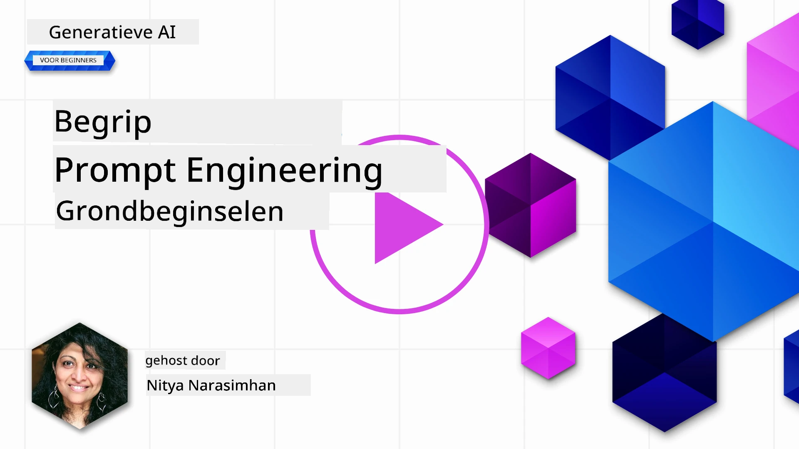
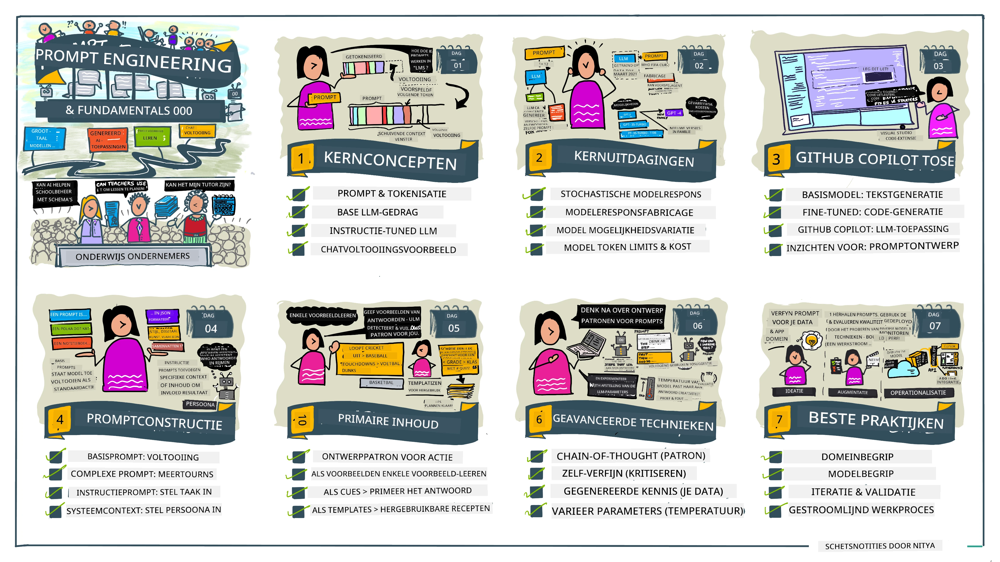
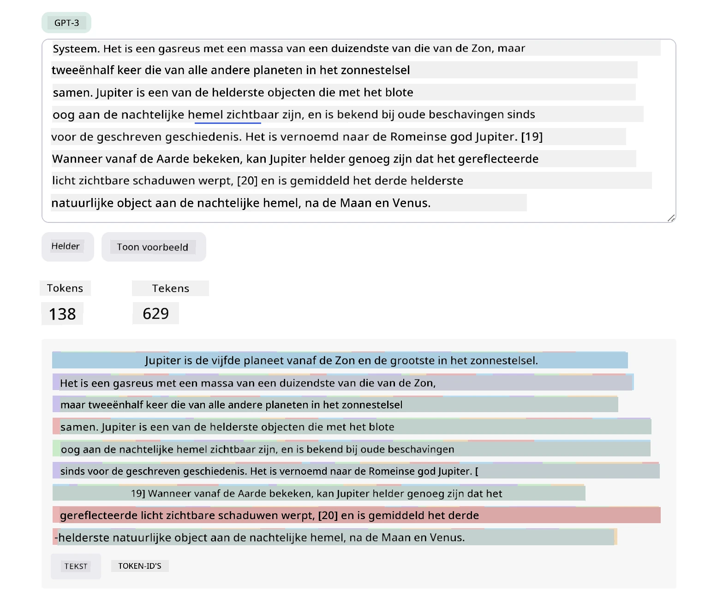
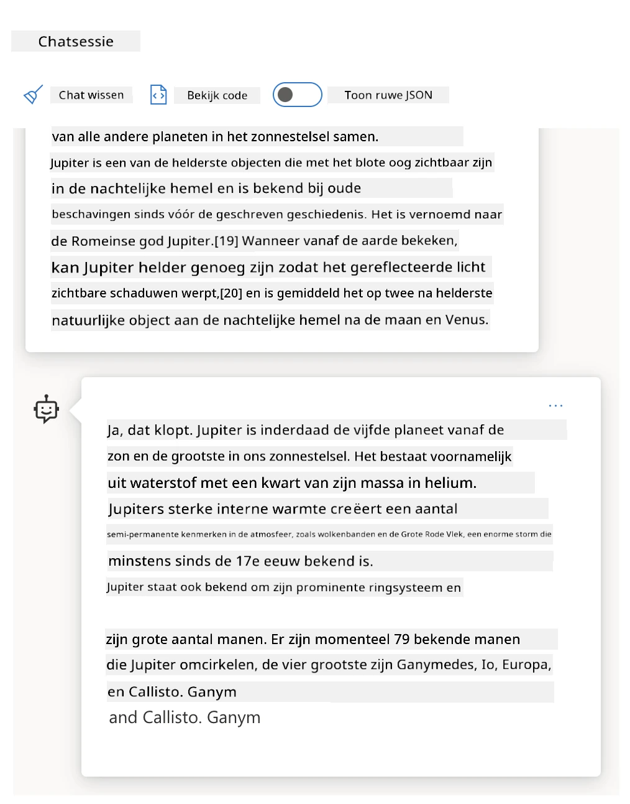
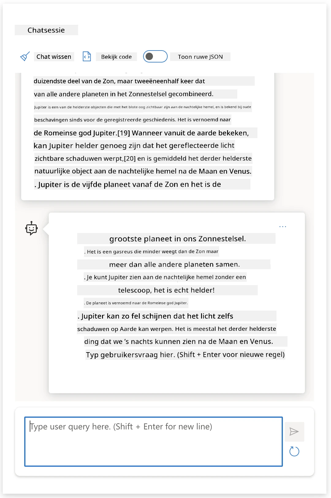
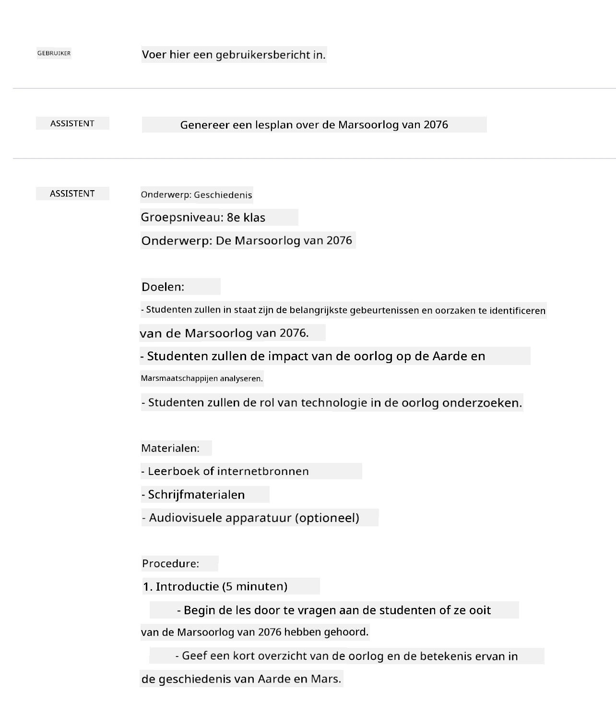
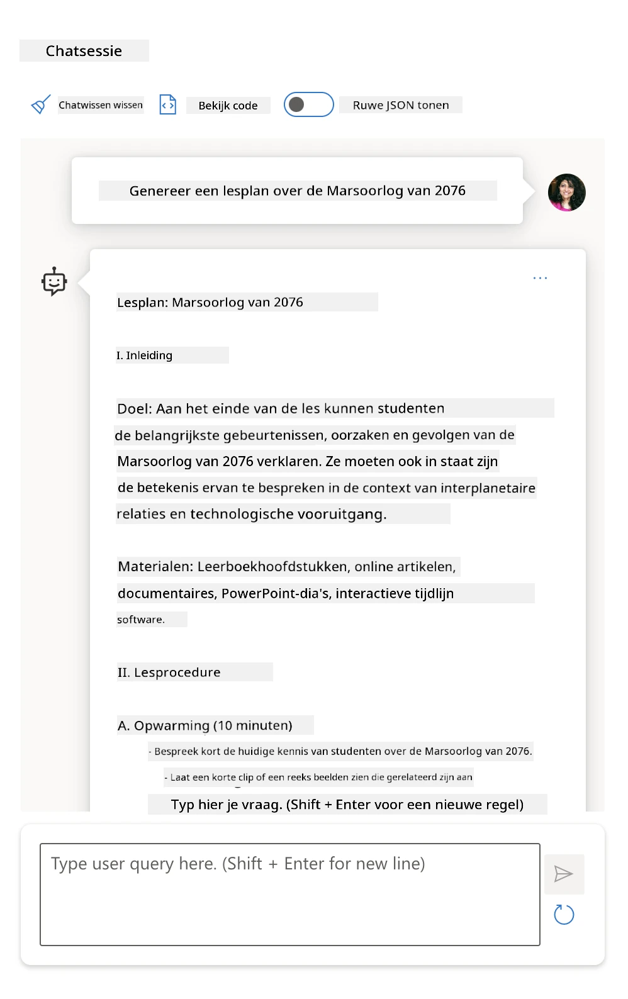
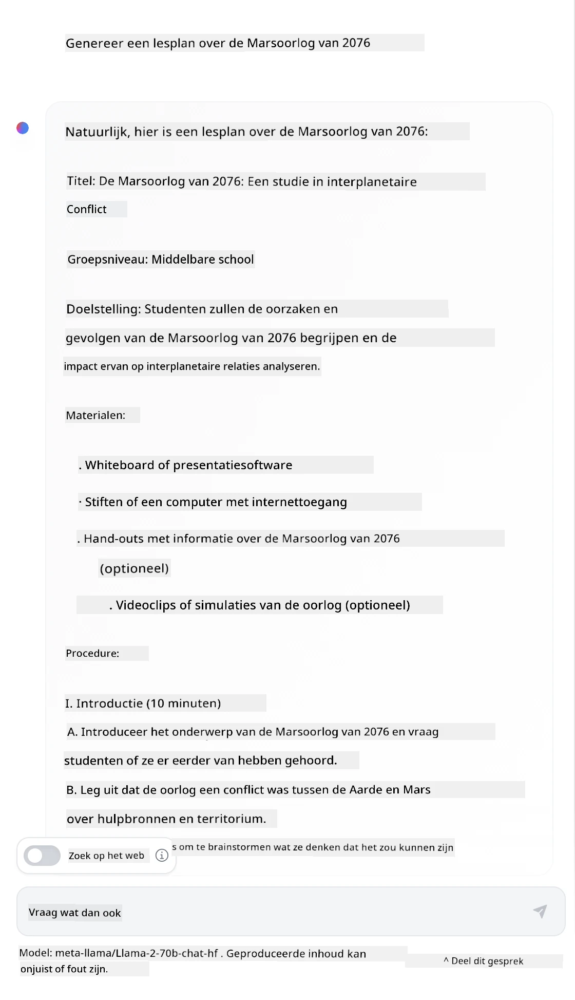

# Basisprincipes van Prompt Engineering

[](https://youtu.be/GElCu2kUlRs?si=qrXsBvXnCW12epb8)

## Introductie
Deze module behandelt essentiële concepten en technieken voor het maken van effectieve prompts in generatieve AI-modellen. De manier waarop je je prompt aan een LLM schrijft, maakt ook uit. Een zorgvuldig opgestelde prompt kan een betere kwaliteit van reactie opleveren. Maar wat betekenen termen zoals _prompt_ en _prompt engineering_ precies? En hoe verbeter ik de prompt _input_ die ik naar de LLM stuur? Dit zijn de vragen die we binnen dit hoofdstuk en het volgende zullen proberen te beantwoorden.

_Generatieve AI_ is in staat om nieuwe inhoud te creëren (bijvoorbeeld tekst, afbeeldingen, audio, code enz.) in reactie op gebruikersverzoeken. Dit gebeurt met behulp van _Large Language Models_ zoals de GPT-serie van OpenAI ("Generative Pre-trained Transformer") die getraind zijn voor het gebruik van natuurlijke taal en code.

Gebruikers kunnen nu met deze modellen communiceren via vertrouwde paradigma's zoals chatten, zonder technische kennis of training te hoeven hebben. De modellen zijn _prompt-gebaseerd_ - gebruikers sturen een tekstinvoer (prompt) en krijgen de AI-reactie (completion) terug. Ze kunnen vervolgens iteratief "chatten met de AI", in multi-turn gesprekken, waarbij ze hun prompt verfijnen totdat de reactie aan hun verwachtingen voldoet.

"Prompts" worden nu het primaire _programmeersinterface_ voor generatieve AI-apps, waarmee aan de modellen wordt verteld wat ze moeten doen en die de kwaliteit van de ontvangen reacties beïnvloeden. "Prompt Engineering" is een snelgroeiend studiegebied dat zich richt op het _ontwerpen en optimaliseren_ van prompts om consistente en kwalitatieve reacties op schaal te leveren.

## Leerdoelen

In deze les leren we wat Prompt Engineering is, waarom het belangrijk is en hoe we effectievere prompts kunnen maken voor een bepaald model en applicatiedoel. We begrijpen kernconcepten en best practices voor prompt engineering – en leren over een interactieve Jupyter Notebooks "sandbox"-omgeving waarin we deze concepten toegepast zien op echte voorbeelden.

Aan het eind van deze les kunnen we:

1. Uitleggen wat prompt engineering is en waarom het belangrijk is.
2. De componenten van een prompt beschrijven en hoe ze worden gebruikt.
3. Best practices en technieken voor prompt engineering leren.
4. De geleerde technieken toepassen op echte voorbeelden, met behulp van een OpenAI-endpoint.

## Kernbegrippen

Prompt Engineering: De praktijk van het ontwerpen en verfijnen van invoer om AI-modellen te sturen naar het produceren van gewenste output.
Tokenisatie: Het proces van het omzetten van tekst in kleinere eenheden, tokens genoemd, die een model kan begrijpen en verwerken.
Instruction-Tuned LLMs: Large Language Models (LLM's) die zijn fijn afgestemd met specifieke instructies om hun reactienauwkeurigheid en relevantie te verbeteren.

## Leer Sandbox

Prompt engineering is momenteel meer kunst dan wetenschap. De beste manier om onze intuïtie te verbeteren is door _meer te oefenen_ en een trial-and-error aanpak te gebruiken die domeinexpertise combineert met aanbevolen technieken en modelspecifieke optimalisaties.

De Jupyter Notebook die bij deze les hoort, biedt een _sandbox_-omgeving waarin je kunt uitproberen wat je leert – terwijl je bezig bent of als onderdeel van de code-uitdaging aan het einde. Om de oefeningen uit te voeren heb je nodig:

1. **Een Azure OpenAI API-sleutel** – de service-eindpunt voor een gedeployed LLM.
2. **Een Python-runtime** – waarin de Notebook kan worden uitgevoerd.
3. **Lokale omgevingsvariabelen** – _voltooi nu de [SETUP](./../00-course-setup/02-setup-local.md?WT.mc_id=academic-105485-koreyst) stappen om klaar te zijn_.

De notebook bevat _start_ oefeningen – maar je wordt aangemoedigd om je eigen _Markdown_ (beschrijving) en _Code_ (promptverzoeken) secties toe te voegen om meer voorbeelden of ideeën uit te proberen – en je intuïtie voor promptontwerp verder te ontwikkelen.

## Geïllustreerde Gids

Wil je het grote plaatje van wat deze les behandelt zien voordat je begint? Bekijk deze geïllustreerde gids, die je een overzicht geeft van de belangrijkste onderwerpen en de belangrijkste punten om over na te denken bij elk onderwerp. De lesroute leidt je van het begrijpen van de kernconcepten en uitdagingen naar het aanpakken ervan met relevante prompt engineering technieken en best practices. Let op dat de sectie "Geavanceerde Technieken" in deze gids verwijst naar inhoud die wordt behandeld in het _volgende_ hoofdstuk van deze cursus.



## Onze Startup

Laten we nu bespreken hoe _dit onderwerp_ zich verhoudt tot onze startup-missie om [AI-innovatie naar onderwijs te brengen](https://educationblog.microsoft.com/2023/06/collaborating-to-bring-ai-innovation-to-education?WT.mc_id=academic-105485-koreyst). We willen AI-gestuurde toepassingen bouwen voor _gepersonaliseerd leren_ – dus laten we nadenken over hoe verschillende gebruikers van onze applicatie prompts kunnen "ontwerpen":

- **Beheerders** kunnen de AI vragen om _curriculumgegevens te analyseren om hiaten in de dekking te identificeren_. De AI kan resultaten samenvatten of visualiseren met code.
- **Docenten** kunnen de AI vragen om _een lesplan te genereren voor een doelgroep en onderwerp_. De AI kan het gepersonaliseerde plan in een opgegeven formaat maken.
- **Studenten** kunnen de AI vragen om _hen te begeleiden in een moeilijk vak_. De AI kan studenten nu begeleiden met lessen, hints en voorbeelden die zijn afgestemd op hun niveau.

Dat is nog maar het topje van de ijsberg. Bekijk [Prompts For Education](https://github.com/microsoft/prompts-for-edu/tree/main?WT.mc_id=academic-105485-koreyst) – een open-source promptsbibliotheek samengesteld door onderwijsdeskundigen – om een breder beeld te krijgen van de mogelijkheden! _Probeer enkele van die prompts uit in de sandbox of in de OpenAI Playground om te zien wat er gebeurt!_

<!--
LESSONSJABLOON:
Deze eenheid zou kernconcept #1 moeten behandelen.
Bevestig het concept met voorbeelden en verwijzingen.

CONCEPT #1:
Prompt Engineering.
Definieer het en leg uit waarom het nodig is.
-->

## Wat is Prompt Engineering?

We begonnen deze les met het definiëren van **Prompt Engineering** als het proces van het _ontwerpen en optimaliseren_ van tekstinvoer (prompts) om consistente en kwalitatieve reacties (completions) te leveren voor een bepaald applicatiedoel en model. We kunnen dit zien als een 2-stappenproces:

- het _ontwerpen_ van de initiële prompt voor een gegeven model en doel
- het _iteratief verfijnen_ van de prompt om de kwaliteit van de reactie te verbeteren

Dit is per definitie een trial-and-error proces dat gebruikersintuïtie en inspanning vereist om optimale resultaten te behalen. Dus waarom is het belangrijk? Om die vraag te beantwoorden moeten we eerst drie concepten begrijpen:

- _Tokenisatie_ = hoe het model de prompt "ziet"
- _Basale LLMs_ = hoe het funderingsmodel een prompt "verwerkt"
- _Instruction-Tuned LLMs_ = hoe het model nu "taken" kan zien

### Tokenisatie

Een LLM ziet prompts als een _sequentie van tokens_ waarbij verschillende modellen (of versies van een model) dezelfde prompt op verschillende manieren kunnen tokeniseren. Omdat LLMs getraind zijn op tokens (en niet op ruwe tekst), heeft de manier waarop prompts worden getokeniseerd direct invloed op de kwaliteit van de gegenereerde reactie.

Om een intuïtie te krijgen voor hoe tokenisatie werkt, probeer tools zoals de [OpenAI Tokenizer](https://platform.openai.com/tokenizer?WT.mc_id=academic-105485-koreyst) hieronder weergegeven. Kopieer je prompt erin – en zie hoe die wordt omgezet in tokens, let op hoe witruimtekarakters en leestekens worden behandeld. Merk op dat dit voorbeeld een ouder LLM-model (GPT-3) toont – bij het proberen met een nieuwer model kan een ander resultaat verschijnen.



### Concept: Foundation Models

Zodra een prompt is getokeniseerd, is de primaire functie van de ["Base LLM"](https://blog.gopenai.com/an-introduction-to-base-and-instruction-tuned-large-language-models-8de102c785a6?WT.mc_id=academic-105485-koreyst) (of funderingsmodel) het voorspellen van het volgende token in die sequentie. Omdat LLMs getraind zijn op enorme tekstdatasets, hebben ze een goed gevoel voor de statistische relaties tussen tokens en kunnen ze die voorspelling met enige zekerheid maken. Let op dat ze de _betekenis_ van de woorden in de prompt of het token niet begrijpen; ze zien alleen een patroon dat ze kunnen "voltooien" met hun volgende voorspelling. Ze kunnen doorgaan met het voorspellen van de reeks totdat het wordt beëindigd door gebruikersinterventie of een vooraf bepaald criterium.

Wil je zien hoe prompt-gebaseerde completion werkt? Voer de bovenstaande prompt in Azure OpenAI Studio [_Chat Playground_](https://oai.azure.com/playground?WT.mc_id=academic-105485-koreyst) in met de standaardinstellingen. Het systeem is geconfigureerd om prompts als informatieverzoeken te behandelen – dus je zou een completion moeten zien die aan deze context voldoet.

Maar wat als de gebruiker iets specifieks wil zien dat aan bepaalde criteria of een taakdoel voldoet? Dan komen _instruction-tuned_ LLMs in beeld.



### Concept: Instruction Tuned LLMs

Een [Instruction Tuned LLM](https://blog.gopenai.com/an-introduction-to-base-and-instruction-tuned-large-language-models-8de102c785a6?WT.mc_id=academic-105485-koreyst) begint met het funderingsmodel en verfijnt het met voorbeelden of invoer-/uitvoerkoppels (bijv. multi-turn "berichten") die duidelijke instructies kunnen bevatten – en de reactie van de AI probeert die instructie te volgen.

Dit gebruikt technieken zoals Reinforcement Learning met Human Feedback (RLHF) die het model trainen om _instructies te volgen_ en _van feedback te leren_ zodat het reacties produceert die beter geschikt zijn voor praktische toepassingen en relevanter zijn voor gebruikersdoelen.

Laten we het proberen – herhaal de prompt hierboven, maar verander nu het _systeembericht_ om de volgende instructie als context te geven:

> _Vat de inhoud samen die je krijgt voor een leerling van groep 4. Houd het resultaat bij één alinea met 3-5 opsommingstekens._

Zie je hoe het resultaat nu is afgestemd op het gewenste doel en formaat? Een docent kan deze reactie direct gebruiken in hun dia’s voor die klas.



## Waarom hebben we Prompt Engineering nodig?

Nu we weten hoe prompts door LLMs worden verwerkt, laten we het hebben over _waarom_ we prompt engineering nodig hebben. Het antwoord ligt in het feit dat huidige LLMs een aantal uitdagingen hebben die het moeilijker maken om _betrouwbare en consistente completions_ te bereiken zonder inspanning in promptconstructie en -optimalisatie. Bijvoorbeeld:

1. **Modelreacties zijn stochastisch.** De _zelfde prompt_ zal waarschijnlijk verschillende reacties opleveren bij verschillende modellen of modelversies. En het kan zelfs verschillende resultaten geven met hetzelfde model op verschillende momenten. _Prompt engineering technieken kunnen ons helpen deze variaties te minimaliseren door betere afbakening_.

1. **Modellen kunnen reacties verzinnen.** Modellen zijn vooraf getraind met _grote maar beperkte_ datasets, wat betekent dat ze geen kennis hebben over concepten buiten die trainingsscope. Daardoor kunnen ze completions produceren die onjuist, verzonnen of zelfs direct tegenstrijdig zijn aan bekende feiten. _Prompt engineering technieken helpen gebruikers zulk verzinnen te herkennen en te beperken, bijvoorbeeld door AI om citaties of redenering te vragen_.

1. **Modelcapaciteiten variëren.** Nieuwere modellen of generaties hebben rijkere mogelijkheden, maar brengen ook unieke eigenaardigheden en afwegingen in kosten en complexiteit mee. _Prompt engineering kan ons helpen best practices en workflows te ontwikkelen die verschillen abstraheren en zich aanpassen aan modelspecifieke eisen op schaalbare, naadloze manieren_.

Laten we dit in actie zien in de OpenAI of Azure OpenAI Playground:

- Gebruik dezelfde prompt met verschillende LLM-implementaties (bijv. OpenAI, Azure OpenAI, Hugging Face) – zag je de variaties?
- Gebruik dezelfde prompt herhaaldelijk met dezelfde LLM-implementatie (bijv. Azure OpenAI playground) – hoe verschilden deze variaties?

### Voorbeeld van verzinsels

In deze cursus gebruiken we de term **"fabricatie"** om het fenomeen te benoemen waarbij LLMs soms feitelijk onjuiste informatie genereren door beperkingen in hun training of andere beperkingen. Je hebt dit misschien ook gehoord als _"hallucinaties"_ in populaire artikelen of wetenschappelijke publicaties. Wij raden echter sterk aan de term _"fabricatie"_ te gebruiken zodat we het gedrag niet per ongeluk antropomorfiseren door een menselijk kenmerk toe te dichten aan een machinegestuurd resultaat. Dit versterkt ook de [richtlijnen voor Verantwoorde AI](https://www.microsoft.com/ai/responsible-ai?WT.mc_id=academic-105485-koreyst) vanuit terminologieperspectief, waarbij termen worden verwijderd die in sommige contexten als kwetsend of niet-inclusief kunnen worden beschouwd.

Wil je een idee krijgen van hoe fabricaties werken? Denk aan een prompt die de AI opdraagt inhoud te genereren over een niet-bestaand onderwerp (om te zorgen dat het niet in de trainingsdata staat). Bijvoorbeeld – ik probeerde deze prompt:

> **Prompt:** genereer een lesplan over de Mars-oorlog van 2076.
Een webzoekopdracht toonde aan dat er fictieve verhalen waren (bijvoorbeeld televisieseries of boeken) over Mars-oorlogen - maar geen in 2076. Gezond verstand vertelt ons ook dat 2076 _in de toekomst_ ligt en daarom niet kan worden geassocieerd met een echte gebeurtenis.

Dus wat gebeurt er als we deze prompt uitvoeren bij verschillende LLM-aanbieders?

> **Antwoord 1**: OpenAI Playground (GPT-35)



> **Antwoord 2**: Azure OpenAI Playground (GPT-35)



> **Antwoord 3**: : Hugging Face Chat Playground (LLama-2)



Zoals verwacht genereren elk model (of modelversie) iets verschillende antwoorden dankzij de stochastische werking en variaties in modelcapaciteit. Bijvoorbeeld, het ene model richt zich op een doelgroep van groep 8 terwijl het andere uitgaat van een middelbare scholier. Maar alle drie de modellen genereerden antwoorden die een niet-ingewijde gebruiker konden overtuigen dat de gebeurtenis echt was.

Prompt engineering technieken zoals _metaprompting_ en _temperature-instelling_ kunnen in zekere mate modelfabricaties verminderen. Nieuwe prompt engineering _architecturen_ integreren ook naadloos nieuwe tools en technieken in de promptstroom, om sommige van deze effecten te beperken of te reduceren.

## Case Study: GitHub Copilot

Laten we deze sectie afsluiten met een indruk van hoe prompt engineering wordt gebruikt in oplossingen uit de praktijk door te kijken naar één Case Study: [GitHub Copilot](https://github.com/features/copilot?WT.mc_id=academic-105485-koreyst).

GitHub Copilot is jouw "AI Pair Programmer" - het zet tekstprompts om in codeaanvullingen en is geïntegreerd in je ontwikkelomgeving (bijvoorbeeld Visual Studio Code) voor een naadloze gebruikerservaring. Zoals gedocumenteerd in de onderstaande blogserie, was de vroegste versie gebaseerd op het OpenAI Codex-model - waarbij ingenieurs snel inzagen dat het nodig was het model fijn af te stemmen en betere prompt engineering technieken te ontwikkelen om de codekwaliteit te verbeteren. In juli introduceerden ze een [verbetermodel van AI dat verder gaat dan Codex](https://github.blog/2023-07-28-smarter-more-efficient-coding-github-copilot-goes-beyond-codex-with-improved-ai-model/?WT.mc_id=academic-105485-koreyst) voor nog snellere suggesties.

Lees de berichten op volgorde, om hun leerproces te volgen.

- **mei 2023** | [GitHub Copilot wordt beter in het begrijpen van je code](https://github.blog/2023-05-17-how-github-copilot-is-getting-better-at-understanding-your-code/?WT.mc_id=academic-105485-koreyst)
- **mei 2023** | [Inside GitHub: werken met de LLM’s achter GitHub Copilot](https://github.blog/2023-05-17-inside-github-working-with-the-llms-behind-github-copilot/?WT.mc_id=academic-105485-koreyst).
- **jun 2023** | [Hoe schrijf je betere prompts voor GitHub Copilot](https://github.blog/2023-06-20-how-to-write-better-prompts-for-github-copilot/?WT.mc_id=academic-105485-koreyst).
- **jul 2023** | [.. GitHub Copilot gaat verder dan Codex met verbeterd AI-model](https://github.blog/2023-07-28-smarter-more-efficient-coding-github-copilot-goes-beyond-codex-with-improved-ai-model/?WT.mc_id=academic-105485-koreyst)
- **jul 2023** | [Een handleiding voor ontwikkelaars over prompt engineering en LLM’s](https://github.blog/2023-07-17-prompt-engineering-guide-generative-ai-llms/?WT.mc_id=academic-105485-koreyst)
- **sep 2023** | [Hoe bouw je een LLM-applicatie voor bedrijven: lessen van GitHub Copilot](https://github.blog/2023-09-06-how-to-build-an-enterprise-llm-application-lessons-from-github-copilot/?WT.mc_id=academic-105485-koreyst)

Je kunt ook hun [Engineering-blog](https://github.blog/category/engineering/?WT.mc_id=academic-105485-koreyst) doorbladeren voor meer berichten zoals [deze](https://github.blog/2023-09-27-how-i-used-github-copilot-chat-to-build-a-reactjs-gallery-prototype/?WT.mc_id=academic-105485-koreyst) die laat zien hoe deze modellen en technieken worden _toegepast_ om toepassingen in de praktijk aan te sturen.

---

<!--
LESSON TEMPLATE:
This unit should cover core concept #2.
Reinforce the concept with examples and references.

CONCEPT #2:
Prompt Design.
Illustrated with examples.
-->

## Promptconstructie

We hebben gezien waarom prompt engineering belangrijk is - laten we nu begrijpen hoe prompts worden _opgebouwd_ zodat we verschillende technieken kunnen evalueren voor effectievere promptontwerp.

### Basisprompt

Laten we beginnen met de basisprompt: een tekstinvoer die naar het model wordt gestuurd zonder verdere context. Hier is een voorbeeld - wanneer we de eerste paar woorden van het Amerikaanse volkslied naar de OpenAI [Completion API](https://platform.openai.com/docs/api-reference/completions?WT.mc_id=academic-105485-koreyst) sturen, vult het meteen de volgende regels aan, wat het basisgedrag van voorspelling illustreert.

| Prompt (Invoer)    | Aanvulling (Uitvoer)                                                                                                                 |
| :----------------- | :---------------------------------------------------------------------------------------------------------------------------------- |
| Oh say can you see | Het klinkt alsof je de tekst begint van "The Star-Spangled Banner", het Amerikaanse volkslied. De volledige tekst is ...             |

### Complexe prompt

Laten we nu context en instructies toevoegen aan die basisprompt. De [Chat Completion API](https://learn.microsoft.com/azure/ai-services/openai/how-to/chatgpt?WT.mc_id=academic-105485-koreyst) stelt ons in staat een complexe prompt op te bouwen als een verzameling van _berichten_ met:

- Input/output-paren die de invoer van de _gebruiker_ en de respons van de _assistent_ weerspiegelen.
- Systembericht dat de context voor het gedrag of de persoonlijkheid van de assistent instelt.

De aanvraag heeft nu de onderstaande vorm, waarbij de _tokenization_ effectief relevante informatie uit de context en het gesprek vastlegt. Het veranderen van de systeemcontext kan nu net zo impactvol zijn voor de kwaliteit van de aanvullingen als de door de gebruiker gegeven invoer.

```python
response = openai.chat.completions.create(
    model="gpt-3.5-turbo",
    messages=[
        {"role": "system", "content": "You are a helpful assistant."},
        {"role": "user", "content": "Who won the world series in 2020?"},
        {"role": "assistant", "content": "The Los Angeles Dodgers won the World Series in 2020."},
        {"role": "user", "content": "Where was it played?"}
    ]
)
```

### Instructieprompt

In bovenstaande voorbeelden was de gebruikersprompt een eenvoudige tekstvraag die kan worden opgevat als een verzoek om informatie. Met _instructie_ prompts kunnen we die tekst gebruiken om een taak gedetailleerder te specificeren, zodat we de AI beter kunnen begeleiden. Hier is een voorbeeld:

| Prompt (Invoer)                                                                                                                                                                                                                           | Aanvulling (Uitvoer)                                                                                       | Instructietype    |
| :------------------------------------------------------------------------------------------------------------------------------------------------------------------------------------------------------------------------------------- | :--------------------------------------------------------------------------------------------------------- | :---------------- |
| Schrijf een beschrijving van de Amerikaanse Burgeroorlog                                                                                                                                                                               | _leverde een eenvoudige paragraaf op_                                                                      | Eenvoudig         |
| Schrijf een beschrijving van de Amerikaanse Burgeroorlog. Geef belangrijke data en gebeurtenissen en beschrijf hun betekenis                                                                                                        | _leverde een paragraaf gevolgd door een lijst met belangrijke data en beschrijvingen_                       | Complex           |
| Schrijf een beschrijving van de Amerikaanse Burgeroorlog in 1 alinea. Geef 3 opsommingstekens met belangrijke data en hun betekenis. Geef nog 3 opsommingen met belangrijke historische figuren en hun bijdragen. Lever de uitvoer als een JSON-bestand | _levert uitgebreidere details in een tekstvak, geformatteerd als JSON die je kunt kopiëren en valideren indien nodig_ | Complex. Geformatteerd. |

## Primaire inhoud

In bovenstaande voorbeelden was de prompt nog vrij open, waardoor het LLM zelf kon bepalen welk deel van de vooraf getrainde dataset relevant was. Met het _primaire inhoud_-ontwerppatroon wordt de invoertekst verdeeld in twee delen:

- een instructie (actie)
- relevante inhoud (die de actie beïnvloedt)

Hier is een voorbeeld waarbij de instructie is "vat dit samen in 2 zinnen".

| Prompt (Invoer)                                                                                                                                                                                                                                                                                                                                                                                                                                                                                                                                                                                                                                                                              | Aanvulling (Uitvoer)                                                                                                                                                                                                                                                        |
| :------------------------------------------------------------------------------------------------------------------------------------------------------------------------------------------------------------------------------------------------------------------------------------------------------------------------------------------------------------------------------------------------------------------------------------------------------------------------------------------------------------------------------------------------------------------------------------------------------------------------------------------------------------------------------------------------ | :--------------------------------------------------------------------------------------------------------------------------------------------------------------------------------------------------------------------------------------------------------------------------- |
| Jupiter is de vijfde planeet vanaf de zon en de grootste in het zonnestelsel. Het is een gasreus met een massa van een duizendste van die van de zon, maar tweeënhalf keer die van alle andere planeten in het zonnestelsel samen. Jupiter is een van de helderste objecten die met het blote oog aan de nachtelijke hemel zichtbaar is, en is bekend bij oude beschavingen sinds vóór de geschreven geschiedenis. Het is genoemd naar de Romeinse god Jupiter.[19] Wanneer vanaf de aarde bekeken, kan Jupiter helder genoeg zijn om schaduwen te werpen door weerkaatst licht,[20] en is gemiddeld het derde helderste natuurlijke object aan de nachtelijke hemel na de maan en Venus. <br/> **Vat dit samen in 2 korte zinnen** | Jupiter, de vijfde planeet vanaf de zon, is de grootste in het zonnestelsel en staat bekend als een van de helderste objecten aan de nachtelijke hemel. Genoemd naar de Romeinse god Jupiter, is het een gasreus met een massa die tweeënhalf keer die van alle andere planeten in het zonnestelsel samen is. |

Het primaire inhoudsegment kan op verschillende manieren worden gebruikt om effectievere instructies aan te sturen:

- **Voorbeelden** - in plaats van het model met een expliciete instructie te vertellen wat het moet doen, geef je voorbeelden van wat het moet doen en laat het de patroon afleiden.
- **Signaleringen** - voeg na de instructie een "signaal" toe dat de aanvulling voorbereidt en het model richting meer relevante antwoorden leidt.
- **Templates** - dit zijn herhaalbare 'recepten' voor prompts met aanduidingen (variabelen) die je kunt aanpassen met gegevens voor specifieke gebruikssituaties.

Laten we deze in actie verkennen.

### Voorbeelden gebruiken

Dit is een benadering waarbij je de primaire inhoud gebruikt om het model wat voorbeelden van de gewenste uitvoer te “voeden” voor een gegeven instructie, en het laat afleiden wat het patroon voor die uitvoer is. Afhankelijk van het aantal gegeven voorbeelden kunnen we onderscheid maken tussen zero-shot, one-shot, few-shot prompting enzovoort.

De prompt bestaat nu uit drie componenten:

- een taakbeschrijving
- een paar voorbeelden van de gewenste uitvoer
- het begin van een nieuw voorbeeld (dat een impliciete taakbeschrijving wordt)

| Leer Type    | Prompt (Invoer)                                                                     | Aanvulling (Uitvoer)       |
| :----------- | :--------------------------------------------------------------------------------- | :------------------------- |
| Zero-shot    | "The Sun is Shining". Vertaal naar Spaans                                        | "El Sol está brillando".   |
| One-shot     | "The Sun is Shining" => ""El Sol está brillando". <br> "It's a Cold and Windy Day" => | "Es un día frío y ventoso".|
| Few-shot     | The player ran the bases => Baseball <br/> The player hit an ace => Tennis <br/> The player hit a six => Cricket <br/> The player made a slam-dunk => | Basketbal                  |
|              |                                                                                    |                            |

Merk op dat we bij zero-shot prompting een expliciete instructie moesten geven ("Vertaal naar Spaans"), maar dat die wordt afgeleid in het one-shot voorbeeld. Het few-shot voorbeeld laat zien hoe het toevoegen van meer voorbeelden modellen in staat stelt nauwkeurigere afleidingen te maken zonder extra instructies.

### Prompt signaleringen

Een andere techniek voor het gebruik van primaire inhoud is het geven van _signaleringen_ in plaats van voorbeelden. In dit geval geven we het model een duwtje de goede richting op door met een fragment te _beginnen_ dat het gewenste antwoordformaat weerspiegelt. Het model "pakt de hint" op en gaat in die stijl verder.

| Aantal signaleringen | Prompt (Invoer)                                                                                                                                                                                                                                                                                                                                                                                                                                      | Aanvulling (Uitvoer)                                                                                                                                                                                                                                                                                   |
| :------------------- | :--------------------------------------------------------------------------------------------------------------------------------------------------------------------------------------------------------------------------------------------------------------------------------------------------------------------------------------------------------------------------------------------------------------------------------------------------- | :---------------------------------------------------------------------------------------------------------------------------------------------------------------------------------------------------------------------------------------------------------------------------------------------------- |
| 0                    | Jupiter is de vijfde planeet vanaf de zon en de grootste in het zonnestelsel. Het is een gasreus met een massa van een duizendste van die van de zon, maar tweeënhalf keer die van alle andere planeten in het zonnestelsel samen. Jupiter is een van de helderste objecten die met het blote oog aan de nachtelijke hemel zichtbaar is, en is bekend bij oude beschavingen sinds vóór de geschreven geschiedenis. <br/>**Vat dit samen**                                                                 | Jupiter is de grootste planeet in ons zonnestelsel en de vijfde vanaf de zon. Het is een gasreus met een massa van 1/1000ste van de zon, maar zwaarder dan alle andere planeten samen. Oude beschavingen kennen Jupiter al lang, en het is makkelijk zichtbaar aan de nachtelijke hemel.. |
| 1              | Jupiter is de vijfde planeet vanaf de Zon en de grootste in het zonnestelsel. Het is een gasreus met een massa van een duizendste van die van de Zon, maar tweeënhalf keer die van alle andere planeten in het zonnestelsel samen. Jupiter is een van de helderste objecten die met het blote oog zichtbaar zijn aan de nachtelijke hemel en is bekend bij oude beschavingen vanaf vóór de geschreven geschiedenis. <br/>**Vat dit samen** <br/> Wat we geleerd hebben is dat Jupiter | de vijfde planeet vanaf de Zon is en de grootste in het zonnestelsel. Het is een gasreus met een massa van een duizendste van die van de Zon, maar tweeënhalf keer die van alle andere planeten samen. Het is gemakkelijk met het blote oog zichtbaar en is sinds de oudheid bekend.                        |
| 2              | Jupiter is de vijfde planeet vanaf de Zon en de grootste in het zonnestelsel. Het is een gasreus met een massa van een duizendste van die van de Zon, maar tweeënhalf keer die van alle andere planeten in het zonnestelsel samen. Jupiter is een van de helderste objecten die met het blote oog zichtbaar zijn aan de nachtelijke hemel en is bekend bij oude beschavingen vanaf vóór de geschreven geschiedenis. <br/>**Vat dit samen** <br/> Top 3 feiten die we hebben geleerd:         | 1. Jupiter is de vijfde planeet vanaf de Zon en de grootste in het zonnestelsel. <br/> 2. Het is een gasreus met een massa van een duizendste van die van de Zon...<br/> 3. Jupiter is sinds de oudheid met het blote oog zichtbaar ...                                                                       |
|                |                                                                                                                                                                                                                                                                                                                                                                                                                                                              |                                                                                                                                                                                                                                                                                                           |

### Prompttemplates

Een prompttemplate is een _vooraf gedefinieerd recept voor een prompt_ dat kan worden opgeslagen en hergebruikt indien nodig, om meer consistente gebruikservaringen op schaal te stimuleren. In de eenvoudigste vorm is het gewoon een verzameling promptvoorbeelden zoals [dit voorbeeld van OpenAI](https://platform.openai.com/examples?WT.mc_id=academic-105485-koreyst) dat zowel de interactieve promptcomponenten (gebruikers- en systeemberichten) als het API-gestuurde aanvraagformaat bevat – ter ondersteuning van hergebruik.

In zijn complexere vorm, zoals [dit voorbeeld van LangChain](https://python.langchain.com/docs/concepts/prompt_templates/?WT.mc_id=academic-105485-koreyst), bevat het _plaatsaanduidingen_ die kunnen worden vervangen door gegevens uit verschillende bronnen (gebruikersinvoer, systeemcontext, externe gegevensbronnen, enz.) om een prompt dynamisch te genereren. Dit stelt ons in staat om een bibliotheek van herbruikbare prompts te maken die kunnen worden gebruikt om consistente gebruikerservaringen **programmeerbaar** op schaal aan te sturen.

Ten slotte ligt de echte waarde van templates in het vermogen om _promptbibliotheken_ te creëren en te publiceren voor verticale toepassingsdomeinen – waar de prompttemplate nu _geoptimaliseerd_ is om context of voorbeelden die toepassingsspecifiek zijn weer te geven, waardoor de reacties relevanter en accurater worden voor het gerichte gebruikerspubliek. De [Prompts For Edu](https://github.com/microsoft/prompts-for-edu?WT.mc_id=academic-105485-koreyst) repository is een uitstekend voorbeeld van deze benadering, die een bibliotheek van prompts voor het onderwijsdomein samenstelt met nadruk op belangrijke doelstellingen zoals lesplanning, curriculumontwerp, studentenbegeleiding, enzovoort.

## Ondersteunende inhoud

Als we nadenken over promptconstructie als het hebben van een instructie (taak) en een doel (primaire inhoud), dan is _secundaire inhoud_ als extra context die we bieden om de output op een bepaalde manier te **beïnvloeden**. Dit kunnen afstemmingsparameters, formatteringsinstructies, onderwerp-taxonomieën, enzovoort zijn die het model helpen om zijn antwoord af te stemmen op de gewenste gebruikersdoelen of -verwachtingen.

Bijvoorbeeld: Gegeven een cursuscatalogus met uitgebreide metadata (naam, beschrijving, niveau, metadatapunten, docent, enz.) over alle beschikbare cursussen in het curriculum:

- kunnen we een instructie definiëren om "de cursuscatalogus voor herfst 2023 samen te vatten"
- kunnen we de primaire inhoud gebruiken om een paar voorbeelden van de gewenste output te geven
- kunnen we de secundaire inhoud gebruiken om de top 5 "tags" van belang te identificeren.

Nu kan het model een samenvatting geven in het formaat dat wordt getoond door de paar voorbeelden – maar als een resultaat meerdere tags heeft, kan het prioriteit geven aan de 5 tags die in de secundaire inhoud zijn aangegeven.

---

<!--
LESSON TEMPLATE:
This unit should cover core concept #1.
Reinforce the concept with examples and references.

CONCEPT #3:
Prompt Engineering Techniques.
What are some basic techniques for prompt engineering?
Illustrate it with some exercises.
-->

## Best Practices voor Prompting

Nu we weten hoe prompts kunnen worden _geconstrueerd_, kunnen we gaan nadenken over hoe we ze kunnen _ontwerpen_ volgens best practices. We kunnen dit in twee delen bekijken – het juiste _mindset_ hebben en de juiste _technieken_ toepassen.

### Mindset voor Prompt Engineering

Prompt Engineering is een proces van trial-and-error, dus houd drie brede richtlijnen in gedachten:

1. **Domeinkennis is belangrijk.** De nauwkeurigheid en relevantie van het antwoord is een functie van het _domein_ waarin de applicatie of gebruiker opereert. Pas je intuïtie en domeinexpertise toe om **technieken verder aan te passen**. Definieer bijvoorbeeld _domeinspecifieke persoonlijkheden_ in je systeem-prompts, of gebruik _domeinspecifieke templates_ in je gebruikersprompts. Bied secundaire inhoud die domeinspecifieke contexten weerspiegelt, of gebruik _domeinspecifieke aanwijzingen en voorbeelden_ om het model naar vertrouwde gebruikspatronen te leiden.

2. **Modellbegrip is belangrijk.** We weten dat modellen van nature stochastisch zijn. Maar modelimplementaties kunnen ook verschillen in termen van de gebruikte trainingsdataset (vooraf getrainde kennis), de geboden mogelijkheden (b.v. via API of SDK) en het type inhoud waarvoor ze geoptimaliseerd zijn (bijv. code versus afbeeldingen versus tekst). Begrijp de sterke en zwakke punten van het model dat je gebruikt, en gebruik die kennis om taken te _prioriteren_ of _aangepaste templates_ te bouwen die zijn geoptimaliseerd voor de mogelijkheden van het model.

3. **Iteratie & Validatie is belangrijk.** Modellen evolueren snel, en dat geldt ook voor de technieken voor prompt engineering. Als domeinexpert heb je mogelijk andere context of criteria voor _jouw_ specifieke toepassing, die niet voor de bredere gemeenschap gelden. Gebruik prompt engineering tools & technieken om promptconstructie een “kickstart” te geven, en itereren en valideren de resultaten met je eigen intuïtie en domeinexpertise. Leg je inzichten vast en creëer een **kennisdatabase** (bijv. promptbibliotheken) die door anderen als nieuwe basislijn kan worden gebruikt voor snellere iteraties in de toekomst.

## Best Practices

Bekijk nu veelvoorkomende best practices die door [OpenAI](https://help.openai.com/en/articles/6654000-best-practices-for-prompt-engineering-with-openai-api?WT.mc_id=academic-105485-koreyst) en [Azure OpenAI](https://learn.microsoft.com/azure/ai-services/openai/concepts/prompt-engineering#best-practices?WT.mc_id=academic-105485-koreyst) beoefenaars worden aanbevolen.

| Wat                               | Waarom                                                                                                                                                                                                                                              |
| :-------------------------------- | :------------------------------------------------------------------------------------------------------------------------------------------------------------------------------------------------------------------------------------------------- |
| Evalueer de nieuwste modellen.    | Nieuwe modelgeneraties hebben waarschijnlijk verbeterde functies en kwaliteit – maar kunnen ook hogere kosten met zich meebrengen. Evalueer ze op impact en maak vervolgens migratiebeslissingen.                                                    |
| Scheid instructies & context       | Controleer of jouw model/provider _afbakeningstekens_ definieert om instructies, primaire en secundaire inhoud duidelijker te onderscheiden. Dit helpt modellen om gewichten aan tokens nauwkeuriger toe te kennen.                                 |
| Wees specifiek en duidelijk         | Geef meer details over de gewenste context, uitkomst, lengte, formaat, stijl enz. Dit verbetert zowel de kwaliteit als de consistentie van reacties. Leg recepten vast in herbruikbare templates.                                                  |
| Wees beschrijvend, gebruik voorbeelden | Modellen kunnen beter reageren op een “show and tell”-benadering. Begin met een `zero-shot` aanpak waar je een instructie geeft (maar zonder voorbeelden) en probeer dan `few-shot` als verfijning, waarbij je enkele voorbeelden van de gewenste output geeft. Gebruik analogieën. |
| Gebruik aanwijzingen om te starten | Zet het model op weg naar het gewenste resultaat door het een paar leidende woorden of zinnen te geven die het als uitgangspunt kan gebruiken voor het antwoord.                                                                                  |
| Geef het model herhaalde instructies | Soms moet je jezelf herhalen aan het model. Geef instructies vóór en na je primaire inhoud, gebruik een instructie en een aanwijzing, enz. Itereer en valideer om te zien wat werkt.                                                               |
| Volgorde is belangrijk              | De volgorde waarin je informatie aan het model presenteert kan de output beïnvloeden, zelfs bij de leervoorbeelden, dankzij het recency bias effect. Probeer verschillende opties om te zien wat het beste werkt.                                   |
| Geef het model een “uitweg”         | Geef het model een _fallback_-antwoord dat het kan geven als het om welke reden dan ook de taak niet kan voltooien. Dit kan het aantal valse of gefabriceerde reacties door het model verminderen.                                                 |
|                                  |                                                                                                                                                                                                                                                    |

Zoals bij elke best practice, houd in gedachten dat _je ervaring kan variëren_ afhankelijk van het model, de taak en het domein. Gebruik deze als uitgangspunt en itereren om te vinden wat voor jou het beste werkt. Evalueer je prompt engineering proces continu opnieuw naarmate nieuwe modellen en tools beschikbaar komen, met focus op schaalbaarheid van het proces en kwaliteit van de respons.

<!--
LESSON TEMPLATE:
This unit should provide a code challenge if applicable

CHALLENGE:
Link to a Jupyter Notebook with only the code comments in the instructions (code sections are empty).

SOLUTION:
Link to a copy of that Notebook with the prompts filled in and run, showing what one example could be.
-->

## Opdracht

Gefeliciteerd! Je bent aan het einde van de les gekomen! Het is tijd om enkele van die concepten en technieken te testen met echte voorbeelden!

Voor onze opdracht gebruiken we een Jupyter Notebook met oefeningen die je interactief kunt afronden. Je kunt het Notebook ook uitbreiden met je eigen Markdown- en Codesecties om ideeën en technieken zelf te verkennen.

### Om te beginnen, fork de repo, en daarna

- (Aanbevolen) Start GitHub Codespaces
- (Als alternatief) Clone de repo naar je lokale apparaat en gebruik die met Docker Desktop
- (Als alternatief) Open de Notebook met je favoriete Notebook runtime-omgeving.

### Configureer vervolgens je omgevingsvariabelen

- Kopieer het bestand `.env.copy` in de root van de repo naar `.env` en vul de waarden voor `AZURE_OPENAI_API_KEY`, `AZURE_OPENAI_ENDPOINT` en `AZURE_OPENAI_DEPLOYMENT` in. Ga terug naar de [Learning Sandbox sectie](../../../04-prompt-engineering-fundamentals) voor instructies.

### Open daarna de Jupyter Notebook

- Selecteer de runtime kernel. Als je optie 1 of 2 gebruikt, selecteer je simpelweg de standaard Python 3.10.x kernel die wordt geleverd door de dev container.

Je bent klaar om de oefeningen te doen. Let op dat er hier geen _juiste en foute_ antwoorden zijn – het gaat erom opties te verkennen met trial-and-error en intuïtie op te bouwen over wat werkt voor een bepaald model en toepassingsdomein.

_Vandaar dat er in deze les geen Code Oplossing segmenten staan. In plaats daarvan bevat het Notebook Markdown-cellen met de titel "Mijn Oplossing:" waarin één voorbeeldoutput als referentie wordt getoond._

 <!--
LESSON TEMPLATE:
Wrap the section with a summary and resources for self-guided learning.
-->

## Kennischeck

Welke van de volgende is een goede prompt die redelijk goede best practices volgt?

1. Toon mij een afbeelding van een rode auto
2. Toon mij een afbeelding van een rode auto van het merk Volvo en model XC90 geparkeerd bij een klif met de zonsondergang
3. Toon mij een afbeelding van een rode auto van het merk Volvo en model XC90

A: 2, dit is de beste prompt omdat het details geeft over "wat" en in detail gaat (niet zomaar een auto maar een specifiek merk en model) en het beschrijft ook de algehele setting. 3 is de volgende beste omdat het ook veel beschrijving bevat.

## 🚀 Uitdaging

Bekijk of je de "aanwijzing"-techniek kunt gebruiken met de prompt: Maak de zin af "Toon mij een afbeelding van een rode auto van het merk Volvo en ". Wat antwoordt het, en hoe zou je het verbeteren?

## Goed gedaan! Ga verder met leren

Wil je meer leren over verschillende prompt engineering concepten? Ga naar de [vervolgpagina voor leren](https://aka.ms/genai-collection?WT.mc_id=academic-105485-koreyst) om andere geweldige bronnen over dit onderwerp te vinden.

Ga door naar Les 5 waar we kijken naar [geavanceerde prompting technieken](../05-advanced-prompts/README.md?WT.mc_id=academic-105485-koreyst)!

---

<!-- CO-OP TRANSLATOR DISCLAIMER START -->
**Disclaimer**:
Dit document is vertaald met behulp van de AI-vertalingsservice [Co-op Translator](https://github.com/Azure/co-op-translator). Hoewel we streven naar nauwkeurigheid, dient u er rekening mee te houden dat geautomatiseerde vertalingen fouten of onnauwkeurigheden kunnen bevatten. Het originele document in de oorspronkelijke taal moet als de gezaghebbende bron worden beschouwd. Voor belangrijke informatie wordt professionele menselijke vertaling aanbevolen. Wij zijn niet aansprakelijk voor misverstanden of verkeerde interpretaties die voortvloeien uit het gebruik van deze vertaling.
<!-- CO-OP TRANSLATOR DISCLAIMER END -->