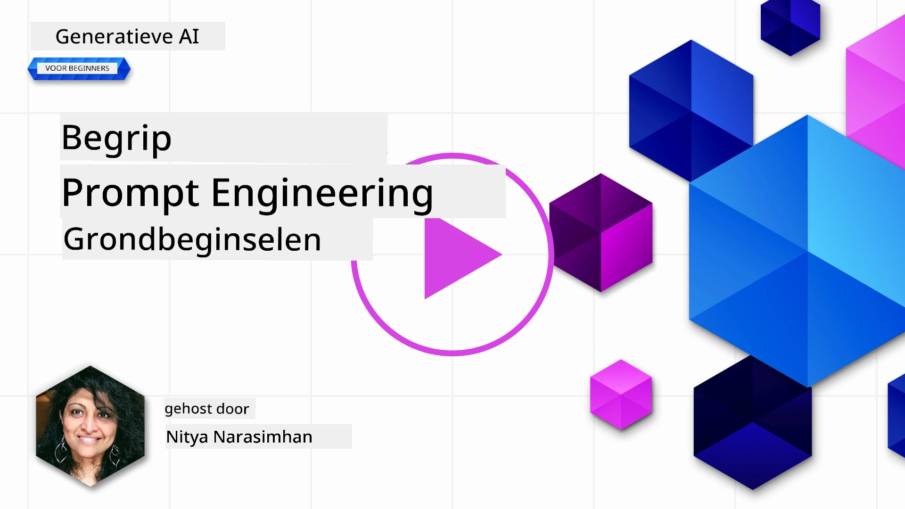
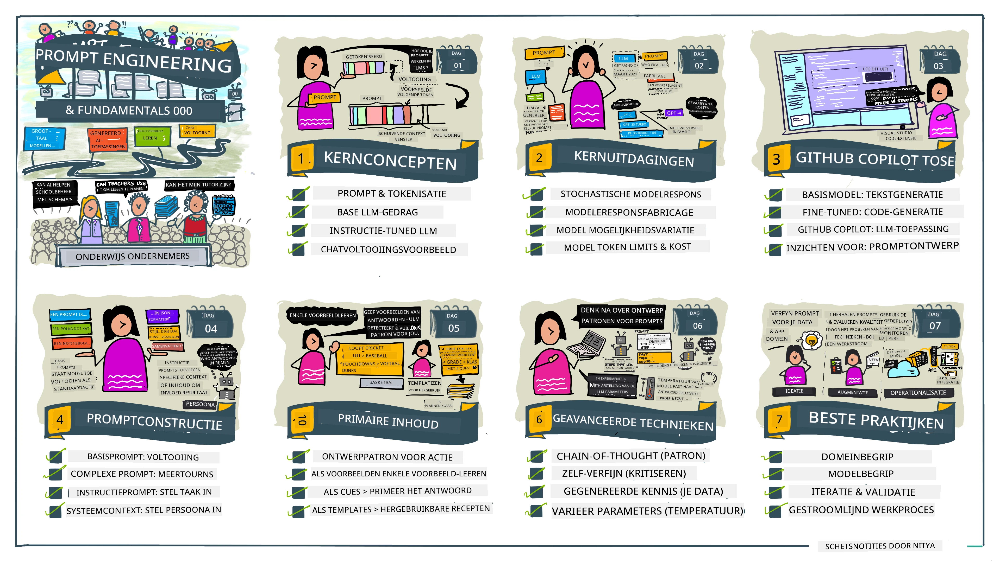
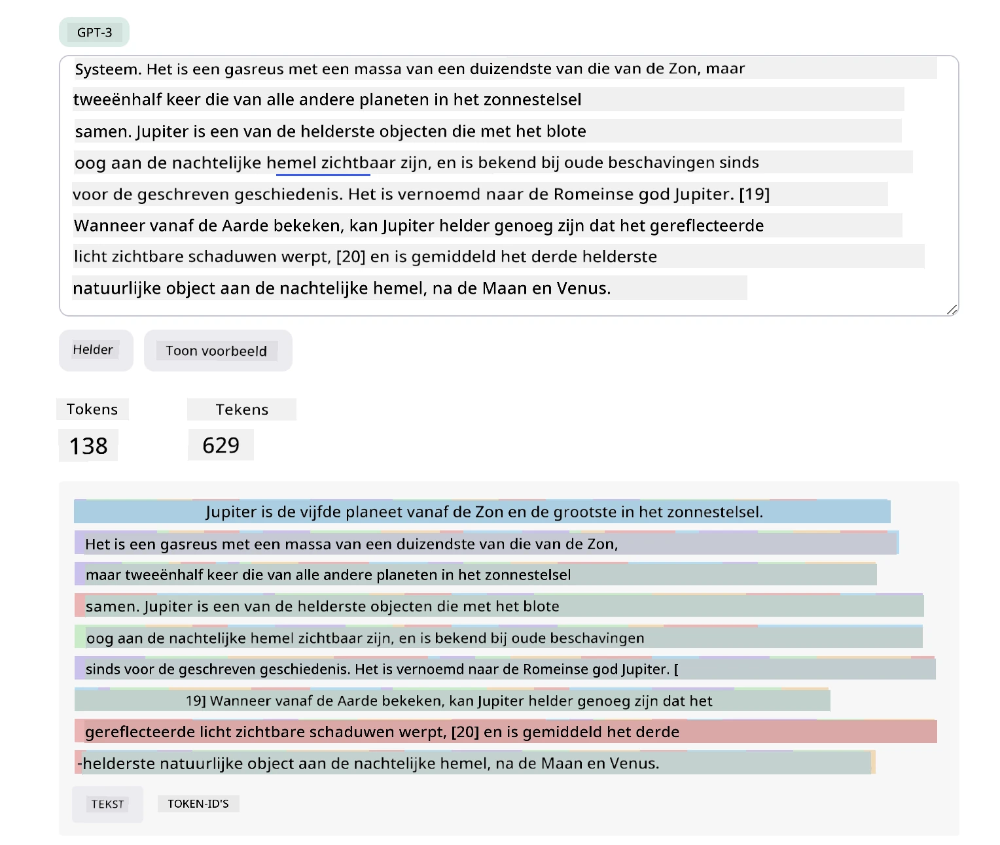
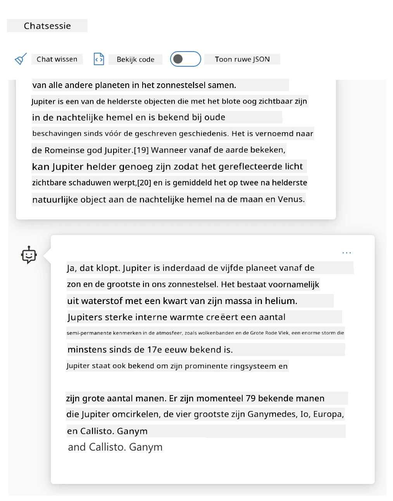
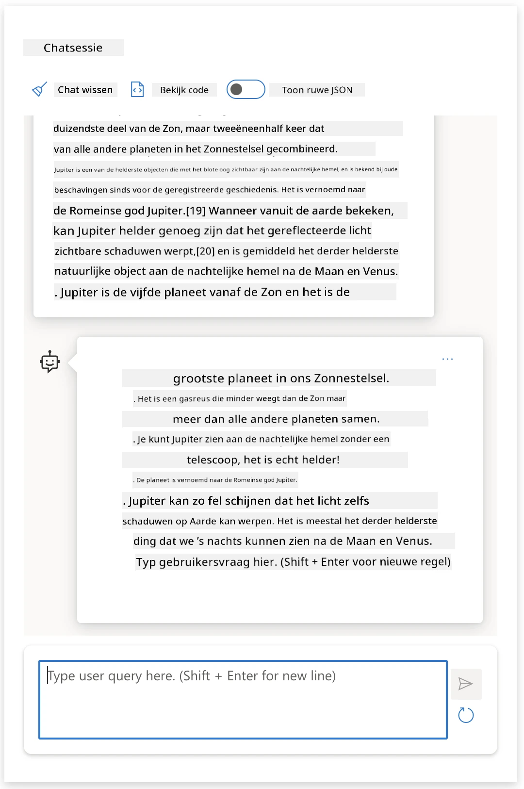
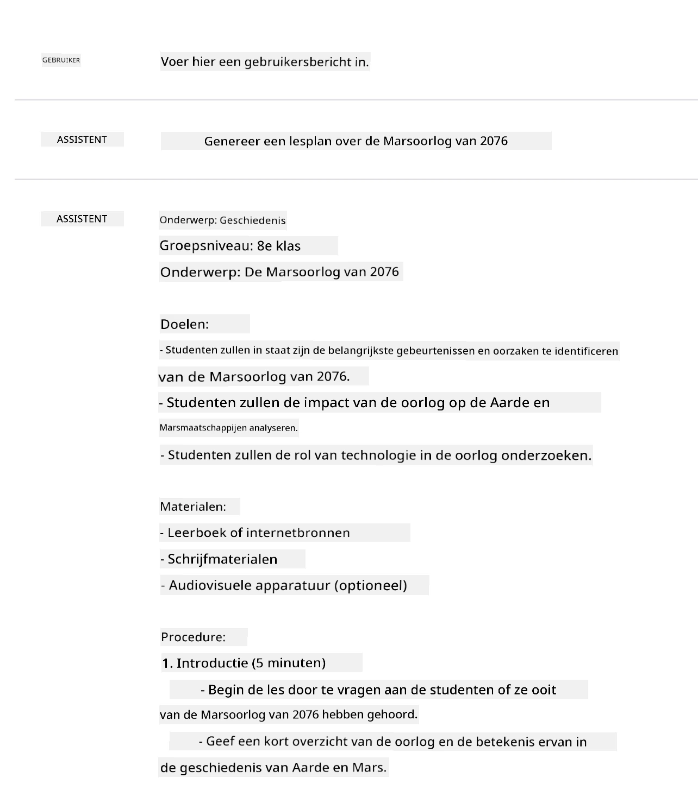
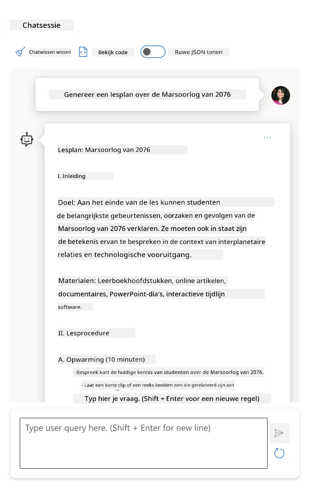
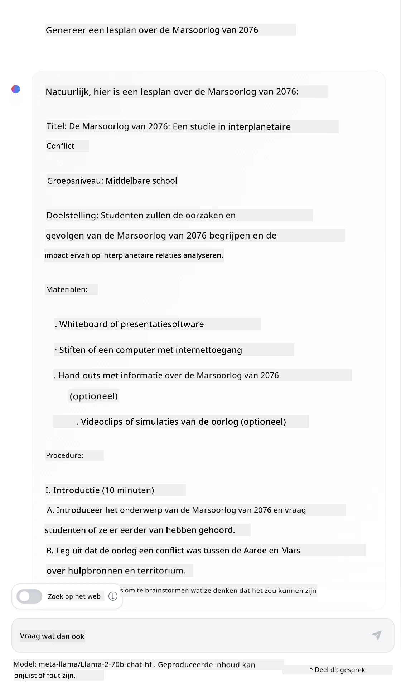

# Basisprincipes van Prompt Engineering

[](https://youtu.be/GElCu2kUlRs?si=qrXsBvXnCW12epb8)

## Introductie
Deze module behandelt essentiële concepten en technieken voor het maken van effectieve prompts in generatieve AI-modellen. De manier waarop je je prompt aan een LLM schrijft, doet er ook toe. Een zorgvuldig gemaakte prompt kan een betere kwaliteit van antwoord opleveren. Maar wat betekenen termen als _prompt_ en _prompt engineering_ precies? En hoe verbeter ik de prompt _input_ die ik naar de LLM stuur? Dit zijn de vragen die we proberen te beantwoorden in dit hoofdstuk en het volgende.

_Generatieve AI_ kan nieuwe inhoud creëren (bijv. tekst, afbeeldingen, audio, code enz.) als reactie op gebruikersvragen. Dit bereikt het met behulp van _Large Language Models_ zoals OpenAI's GPT ("Generative Pre-trained Transformer") serie die getraind zijn om natuurlijke taal en code te gebruiken.

Gebruikers kunnen nu met deze modellen communiceren via bekende paradigma's zoals chatten, zonder enige technische expertise of training te hoeven hebben. De modellen werken _prompt-based_ - gebruikers sturen een tekstinvoer (prompt) en krijgen de AI-reactie (completion) terug. Ze kunnen dan iteratief "chatten met de AI" in conversaties met meerdere beurten, waarbij ze hun prompt verfijnen totdat het antwoord aan hun verwachtingen voldoet.

"Prompts" worden nu de primaire _programmeertaalinterface_ voor generatieve AI-apps, die de modellen vertellen wat te doen en de kwaliteit van de teruggegeven reacties beïnvloeden. "Prompt Engineering" is een snelgroeiend studieveld dat zich richt op het _ontwerpen en optimaliseren_ van prompts om consistente en kwalitatief hoogwaardige reacties op schaal te leveren.

## Leerdoelen

In deze les leren we wat Prompt Engineering is, waarom het belangrijk is, en hoe we effectievere prompts kunnen maken voor een specifiek model en applicatiedoel. We begrijpen kernconcepten en best practices voor prompt engineering - en leren over een interactieve Jupyter Notebooks "sandbox" omgeving waar we deze concepten kunnen toepassen op echte voorbeelden.

Aan het einde van deze les kunnen we:

1. Uitleggen wat prompt engineering is en waarom het belangrijk is.
2. De onderdelen van een prompt beschrijven en hoe ze worden gebruikt.
3. Best practices en technieken voor prompt engineering leren.
4. Toegepaste technieken toepassen op echte voorbeelden, met behulp van een OpenAI-eindpunt.

## Kernbegrippen

Prompt Engineering: De praktijk van het ontwerpen en verfijnen van invoer om AI-modellen te sturen naar gewenste resultaten.
Tokenization: Het proces waarbij tekst wordt omgezet in kleinere eenheden, tokens genaamd, die een model kan begrijpen en verwerken.
Instruction-Tuned LLMs: Grote taalmodellen (LLM's) die zijn bijgesteld met specifieke instructies om hun reactienauwkeurigheid en relevantie te verbeteren.

## Leer Sandbox

Prompt engineering is momenteel meer kunst dan wetenschap. De beste manier om onze intuïtie te verbeteren, is door _meer te oefenen_ en een trial-and-error-benadering te volgen die vakkennis combineert met aanbevolen technieken en modelspecifieke optimalisaties.

De Jupyter Notebook die bij deze les hoort, biedt een _sandbox_ omgeving waar je kunt uitproberen wat je leert - terwijl je bezig bent of als onderdeel van de code-uitdaging aan het einde. Om de oefeningen uit te voeren, heb je nodig:

1. **Een Azure OpenAI API-sleutel** - het service-eindpunt voor een uitgerold LLM.
2. **Een Python-runtime** - waarin de Notebook uitgevoerd kan worden.
3. **Lokale omgevingsvariabelen** - _voltooi nu de [SETUP](./../00-course-setup/02-setup-local.md?WT.mc_id=academic-105485-koreyst) stappen om gereed te zijn_.

De notebook bevat _starter_ oefeningen - maar je wordt aangemoedigd om je eigen _Markdown_ (beschrijving) en _Code_ (promptaanvragen) secties toe te voegen om meer voorbeelden of ideeën uit te proberen - en je intuïtie voor promptontwerp te ontwikkelen.

## Geïllustreerde Gids

Wil je het grote geheel van wat deze les behandelt zien voordat je erin duikt? Bekijk deze geïllustreerde gids, die je een overzicht geeft van de belangrijkste onderwerpen en de belangrijkste punten om over na te denken bij elk ervan. De lesroute leidt je van het begrijpen van kernconcepten en uitdagingen naar het aanpakken daarvan met relevante prompt engineering-technieken en best practices. Let op dat de sectie "Geavanceerde Technieken" in deze gids verwijst naar inhoud die in het _volgende_ hoofdstuk van deze cursus behandeld wordt.



## Onze Startup

Laten we nu bespreken hoe _dit onderwerp_ aansluit bij onze startupmissie om [AI-innovatie naar het onderwijs te brengen](https://educationblog.microsoft.com/2023/06/collaborating-to-bring-ai-innovation-to-education?WT.mc_id=academic-105485-koreyst). We willen AI-gestuurde applicaties bouwen voor _gepersonaliseerd leren_ - dus laten we nadenken over hoe verschillende gebruikers van onze applicatie prompts kunnen "ontwerpen":

- **Beheerders** kunnen de AI vragen om _curriculumdata te analyseren om hiaten in de dekking te identificeren_. De AI kan resultaten samenvatten of visualiseren met code.
- **Leraren** kunnen de AI vragen om _een lesplan te genereren voor een doelgroep en onderwerp_. De AI kan het gepersonaliseerde plan in een opgegeven formaat opstellen.
- **Studenten** kunnen de AI vragen om _hen te begeleiden in een moeilijk vak_. De AI kan nu studenten sturen met lessen, hints en voorbeelden die zijn afgestemd op hun niveau.

Dat is nog maar het topje van de ijsberg. Bekijk [Prompts For Education](https://github.com/microsoft/prompts-for-edu/tree/main?WT.mc_id=academic-105485-koreyst) - een open-source bibliotheek met prompts samengesteld door onderwijsexperts - om een breder beeld te krijgen van de mogelijkheden! _Probeer enkele van die prompts uit in de sandbox of met de OpenAI Playground om te zien wat er gebeurt!_

<!--
LESSON TEMPLATE:
Deze eenheid zou kernconcept #1 moeten behandelen.
Versterk het concept met voorbeelden en verwijzingen.

CONCEPT #1:
Prompt Engineering.
Definieer het en leg uit waarom het nodig is.
-->

## Wat is Prompt Engineering?

We zijn deze les begonnen met het definiëren van **Prompt Engineering** als het proces van het _ontwerpen en optimaliseren_ van tekstinvoer (prompts) om consistente en kwalitatief goede reacties (completions) te leveren voor een bepaald applicatiedoel en model. We kunnen dit zien als een proces in twee stappen:

- _het ontwerpen_ van de initiële prompt voor een bepaald model en doel
- _het iteratief verfijnen_ van de prompt om de kwaliteit van het antwoord te verbeteren

Dit is per definitie een trial-and-errorproces dat gebruikersintuïtie en inspanning vereist om optimale resultaten te bereiken. Waarom is het belangrijk? Om die vraag te beantwoorden, moeten we eerst drie concepten begrijpen:

- _Tokenization_ = hoe het model de prompt "ziet"
- _Basismodel LLMs_ = hoe het funderingsmodel een prompt "verwerkt"
- _Instruction-Tuned LLMs_ = hoe het model nu "taken" kan herkennen

### Tokenization

Een LLM ziet prompts als een _reeks tokens_ waarbij verschillende modellen (of versies van een model) dezelfde prompt op verschillende manieren kunnen tokeniseren. Omdat LLM's getraind zijn op tokens (en niet op ruwe tekst), heeft de manier waarop prompts worden getokeniseerd een directe invloed op de kwaliteit van het gegenereerde antwoord.

Om een idee te krijgen van hoe tokenization werkt, probeer tools zoals de [OpenAI Tokenizer](https://platform.openai.com/tokenizer?WT.mc_id=academic-105485-koreyst) hieronder getoond. Kopieer je prompt erin - en zie hoe dat wordt omgezet in tokens, waarbij je let op hoe witruimtes en leestekens worden behandeld. Let op dat dit voorbeeld een ouder LLM (GPT-3) toont - dus bij een nieuwer model kan het resultaat anders zijn.



### Concept: Funderingsmodellen

Zodra een prompt is getokeniseerd, is de primaire functie van het ["Basis LLM"](https://blog.gopenai.com/an-introduction-to-base-and-instruction-tuned-large-language-models-8de102c785a6?WT.mc_id=academic-105485-koreyst) (of funderingsmodel) om het token in die reeks te voorspellen. Omdat LLM's getraind zijn op gigantische tekstdatasets, hebben ze een goed gevoel voor de statistische relaties tussen tokens en kunnen die voorspelling met enige zekerheid maken. Let op dat ze de _betekenis_ van de woorden in de prompt of token niet begrijpen; ze zien alleen een patroon dat ze met hun volgende voorspelling kunnen "voltooien". Ze kunnen de voorspelling in de reeks voortzetten totdat ze worden beëindigd door de gebruiker of een vooraf bepaalde conditie.

Wil je zien hoe prompt-gebaseerde voltooiing werkt? Voer bovenstaande prompt in bij de [Microsoft Foundry playground](https://ai.azure.com?WT.mc_id=academic-105485-koreyst) met de standaardinstellingen. Het systeem is geconfigureerd om prompts te behandelen als informatieverzoeken - dus je zou een antwoord moeten zien dat bij deze context past.

Maar wat als de gebruiker iets specifieks wil zien dat aan bepaalde criteria of een taakdoel voldoet? Dit is waar _instruction-tuned_ LLM's in beeld komen.



### Concept: Instruction Tuned LLMs

Een [Instruction Tuned LLM](https://blog.gopenai.com/an-introduction-to-base-and-instruction-tuned-large-language-models-8de102c785a6?WT.mc_id=academic-105485-koreyst) begint met het funderingsmodel en verfijnt dit met voorbeelden of invoer/uitvoerparen (bijv. multi-turn "berichten") die duidelijke instructies kunnen bevatten - en de reactie van de AI probeert die instructie te volgen.

Dit gebruikt technieken zoals Reinforcement Learning met Human Feedback (RLHF) die het model kunnen trainen om _instructies te volgen_ en _te leren van feedback_ zodat het antwoorden produceert die beter geschikt zijn voor praktische toepassingen en relevanter voor gebruikersdoelen.

Laten we het proberen - bekijk de prompt hierboven opnieuw, maar verander nu het _systeembericht_ om de volgende instructie als context te geven:

> _Vat de inhoud die je krijgt samen voor een leerling uit groep 4. Houd het resultaat tot één alinea met 3-5 opsommingstekens._

Zie je hoe het resultaat nu is afgestemd op het gewenste doel en formaat? Een leraar kan dit antwoord nu direct gebruiken in zijn dia's voor die les.



## Waarom hebben we Prompt Engineering nodig?

Nu we weten hoe prompts door LLMs worden verwerkt, laten we bespreken _waarom_ we prompt engineering nodig hebben. Het antwoord ligt in het feit dat huidige LLMs een aantal uitdagingen kennen waardoor _betrouwbare en consistente antwoorden_ moeilijker te realiseren zijn zonder inspanning in promptconstructie en -optimalisatie. Bijvoorbeeld:

1. **Modelreacties zijn stochastisch.** De _zelfde prompt_ zal waarschijnlijk verschillende reacties opleveren bij verschillende modellen of modelversies. En het kan zelfs verschillende resultaten geven met hetzelfde model op verschillende momenten. _Prompt engineering technieken kunnen ons helpen deze variaties te minimaliseren door betere geleiders te bieden_.

1. **Modellen kunnen reacties verzinnen.** Modellen zijn getraind op _grote maar beperkte_ datasets, wat betekent dat ze geen kennis hebben over concepten buiten die trainingsomvang. Als gevolg kunnen ze voltooien produceren die onjuist, verzonnen of direct tegenstrijdig zijn met bekende feiten. _Prompt engineering technieken helpen gebruikers om dergelijke verzinsels te herkennen en te beheersen, bijvoorbeeld door AI te vragen om citaties of redeneringen_.

1. **Modelcapaciteiten zullen variëren.** Nieuwere modellen of modelgeneraties zullen rijkere capaciteiten hebben maar ook unieke eigenaardigheden en compromissen in kosten en complexiteit met zich meebrengen. _Prompt engineering kan ons helpen best practices en workflows te ontwikkelen die verschillen abstraheren en zich aanpassen aan modelspecifieke vereisten op schaalbare, naadloze manieren_.

Laten we dit in actie zien in de OpenAI of Azure OpenAI Playground:

- Gebruik dezelfde prompt met verschillende LLM-implementaties (bijv. OpenAI, Azure OpenAI, Hugging Face) - zag je de variaties?
- Gebruik dezelfde prompt herhaaldelijk bij dezelfde LLM-implementatie (bijv. Azure OpenAI playground) - hoe verschilden deze variaties?

### Voorbeeld van Verzinsels

In deze cursus gebruiken we de term **"verzinsel"** om het fenomeen te beschrijven waarbij LLMs soms feitelijk onjuiste informatie genereren als gevolg van beperkingen in hun training of andere factoren. Je hebt dit misschien ook wel eens gehoord als _"hallucinaties"_ in populaire artikelen of onderzoeksartikelen. We raden echter sterk aan om de term _"verzinsel"_ te gebruiken, zodat we het gedrag niet per ongeluk antropomorfiseren door menselijke eigenschappen toe te kennen aan een machine-gedreven resultaat. Dit ondersteunt ook de [Responsible AI-richtlijnen](https://www.microsoft.com/ai/responsible-ai?WT.mc_id=academic-105485-koreyst) vanuit terminologisch perspectief, door termen te vermijden die ook als aanstootgevend of niet inclusief kunnen worden beschouwd in sommige contexten.

Wil je een idee krijgen van hoe verzinsels werken? Denk aan een prompt die de AI instrueert om inhoud te genereren voor een onderwerp dat niet bestaat (zodat het niet wordt gevonden in de trainingsdataset). Bijvoorbeeld - ik probeerde deze prompt:

> **Prompt:** genereer een lesplan over de Marsoorlog van 2076.

Een webzoektocht liet zien dat er fictieve verhalen waren (bijv. televisieseries of boeken) over Marsoorlogen - maar geen in 2076. De gezond verstand leert ons ook dat 2076 _in de toekomst ligt_ en daarmee niet gekoppeld kan worden aan een echt voorval.


Wat gebeurt er dus als we deze prompt uitvoeren met verschillende LLM-providers?

> **Reactie 1**: OpenAI Playground (GPT-35)



> **Reactie 2**: Azure OpenAI Playground (GPT-35)



> **Reactie 3**: : Hugging Face Chat Playground (LLama-2)



Zoals verwacht produceert elk model (of modelversie) iets andere reacties dankzij stochastisch gedrag en variaties in modelcapaciteiten. Bijvoorbeeld, het ene model richt zich op een publiek van groep 8, terwijl het andere uitgaat van een middelbare scholier. Maar alle drie de modellen genereerden reacties die een onwetende gebruiker konden overtuigen dat het evenement echt was.

Prompt-ingenieurstechnieken zoals _metaprompting_ en _temperatuurconfiguratie_ kunnen modelfabrikaties tot op zekere hoogte verminderen. Nieuwe prompt-ingenieurs_architecturen_ integreren ook naadloos nieuwe tools en technieken in de promptstroom om enkele van deze effecten te mitigeren of te verminderen.

## Case Study: GitHub Copilot

Laten we deze sectie afsluiten door te kijken hoe prompt engineering wordt gebruikt in oplossingen uit de echte wereld, met een Case Study: [GitHub Copilot](https://github.com/features/copilot?WT.mc_id=academic-105485-koreyst).

GitHub Copilot is je "AI Pair Programmer" - het zet tekstprompts om in code-aanvullingen en is geïntegreerd in je ontwikkelomgeving (bijv. Visual Studio Code) voor een naadloze gebruikerservaring. Zoals gedocumenteerd in de onderstaande reeks blogs, was de vroegste versie gebaseerd op het OpenAI Codex-model - waarbij engineers snel beseften dat ze het model moesten afstemmen en betere prompt engineering-technieken moesten ontwikkelen om de codekwaliteit te verbeteren. In juli brachten ze een [verbeterd AI-model uit dat verder gaat dan Codex](https://github.blog/2023-07-28-smarter-more-efficient-coding-github-copilot-goes-beyond-codex-with-improved-ai-model/?WT.mc_id=academic-105485-koreyst) voor nog snellere suggesties.

Lees de posts in volgorde om hun leertraject te volgen.

- **mei 2023** | [GitHub Copilot wordt beter in het begrijpen van je code](https://github.blog/2023-05-17-how-github-copilot-is-getting-better-at-understanding-your-code/?WT.mc_id=academic-105485-koreyst)
- **mei 2023** | [Binnen GitHub: werken met de LLM’s achter GitHub Copilot](https://github.blog/2023-05-17-inside-github-working-with-the-llms-behind-github-copilot/?WT.mc_id=academic-105485-koreyst).
- **juni 2023** | [Hoe schrijf je betere prompts voor GitHub Copilot](https://github.blog/2023-06-20-how-to-write-better-prompts-for-github-copilot/?WT.mc_id=academic-105485-koreyst).
- **juli 2023** | [.. GitHub Copilot gaat verder dan Codex met een verbeterd AI-model](https://github.blog/2023-07-28-smarter-more-efficient-coding-github-copilot-goes-beyond-codex-with-improved-ai-model/?WT.mc_id=academic-105485-koreyst)
- **juli 2023** | [Een ontwikkelaarsgids voor prompt engineering en LLMs](https://github.blog/2023-07-17-prompt-engineering-guide-generative-ai-llms/?WT.mc_id=academic-105485-koreyst)
- **sep 2023** | [Hoe bouw je een enterprise LLM-app: lessen van GitHub Copilot](https://github.blog/2023-09-06-how-to-build-an-enterprise-llm-application-lessons-from-github-copilot/?WT.mc_id=academic-105485-koreyst)

Je kunt ook hun [Engineering blog](https://github.blog/category/engineering/?WT.mc_id=academic-105485-koreyst) doorzoeken voor meer posts zoals [deze](https://github.blog/2023-09-27-how-i-used-github-copilot-chat-to-build-a-reactjs-gallery-prototype/?WT.mc_id=academic-105485-koreyst) die laat zien hoe deze modellen en technieken worden _toegepast_ om toepassingen uit de echte wereld aan te sturen.

---

<!--
LESSON TEMPLATE:
Deze eenheid zou kernconcept #2 moeten behandelen.
Versterk het concept met voorbeelden en verwijzingen.

CONCEPT #2:
Promptontwerp.
Geïllustreerd met voorbeelden.
-->

## Promptconstructie

We hebben gezien waarom prompt engineering belangrijk is - laten we nu begrijpen hoe prompts worden _geconstrueerd zodat we verschillende technieken kunnen evalueren voor effectiever promptontwerp.

### Basisprompt

Laten we beginnen met de basisprompt: een tekstinvoer die zonder verdere context naar het model wordt gestuurd. Hier is een voorbeeld - wanneer we de eerste paar woorden van het Amerikaanse volkslied naar de OpenAI [Completion API](https://platform.openai.com/docs/api-reference/completions?WT.mc_id=academic-105485-koreyst) sturen, vult het onmiddellijk de respons aan met de volgende regels, wat het basisvoorspellingsgedrag illustreert.

| Prompt (Invoer)     | Vervollediging (Uitvoer)                                                                                                                      |
| :----------------- | :------------------------------------------------------------------------------------------------------------------------------------------- |
| Oh say can you see | Het klinkt alsof je de tekst van "The Star-Spangled Banner," het Amerikaanse volkslied, begint. De volledige tekst is ...                     |

### Complexe Prompt

Laten we nu context en instructies toevoegen aan die basisprompt. De [Chat Completion API](https://learn.microsoft.com/azure/ai-services/openai/how-to/chatgpt?WT.mc_id=academic-105485-koreyst) stelt ons in staat een complexe prompt te bouwen als een verzameling _berichten_ met:

- Input/output-paren die de _gebruikers_ invoer en _assistent_ respons weerspiegelen.
- Systeembericht dat de context voor assistentgedrag of persoonlijkheid instelt.

Het verzoek is nu in onderstaande vorm, waarbij de _tokenisatie_ effectief relevante informatie uit context en gesprek vastlegt. Het veranderen van de systeemcontext kan net zo impactvol zijn op de kwaliteit van de vervolledigingen als de gegeven gebruikersinvoer.

```python
response = client.responses.create(
    model="gpt-4o-mini",
    input=[
        {"role": "system", "content": "You are a helpful assistant."},
        {"role": "user", "content": "Who won the world series in 2020?"},
        {"role": "assistant", "content": "The Los Angeles Dodgers won the World Series in 2020."},
        {"role": "user", "content": "Where was it played?"}
    ]
)
```

### Instructieprompt

In de bovenstaande voorbeelden was de gebruikersprompt een simpele tekstvraag die geïnterpreteerd kan worden als een verzoek om informatie. Met _instructie_ prompts kunnen we die tekst gebruiken om een taak gedetailleerder te specificeren, waardoor we de AI beter kunnen aansturen. Hier is een voorbeeld:

| Prompt (Invoer)                                                                                                                                                                                                                         | Vervollediging (Uitvoering)                                                                                              | Instructietype      |
| :------------------------------------------------------------------------------------------------------------------------------------------------------------------------------------------------------------------------------------- | :------------------------------------------------------------------------------------------------------------------------- | :------------------ |
| Geef een beschrijving van de Burgeroorlog                                                                                                                                                                                             | _keerde een eenvoudige alinea terug_                                                                                      | Simpel              |
| Geef een beschrijving van de Burgeroorlog. Geef belangrijke data en gebeurtenissen en beschrijf hun betekenis                                                                                                                           | _keerde een alinea terug gevolgd door een lijst met belangrijke datums en beschrijvingen_                                 | Complex             |
| Geef een beschrijving van de Burgeroorlog in 1 alinea. Geef 3 opsommingstekens met belangrijke data en hun betekenis. Geef 3 meer opsommingstekens met belangrijke historische figuren en hun bijdragen. Retourneer de uitvoer als een JSON-bestand | _geeft uitgebreidere details terug in een tekstvak, geformatteerd als JSON die je kunt kopiëren-plakken naar een bestand en indien nodig valideren_ | Complex. Geformatteerd. |

## Primaire Inhoud

In de bovenstaande voorbeelden was de prompt nog vrij open, en kon de LLM zelf beslissen welk deel van zijn getrainde dataset relevant was. Met het _primaire inhoud_ ontwerppatroon wordt de invoertekst verdeeld in twee delen:

- een instructie (actie)
- relevante inhoud (die invloed heeft op de actie)

Hier is een voorbeeld waarbij de instructie is om "dit samen te vatten in 2 zinnen".

| Prompt (Invoer)                                                                                                                                                                                                                                                                                                                                                                                                                                                                                                                                                                                                                                                                                      | Vervollediging (Uitvoer)                                                                                                                                                                                                                                                                                 |
| :-------------------------------------------------------------------------------------------------------------------------------------------------------------------------------------------------------------------------------------------------------------------------------------------------------------------------------------------------------------------------------------------------------------------------------------------------------------------------------------------------------------------------------------------------------------------------------------------------------------------------------------------------------------------------------------------------- | :------------------------------------------------------------------------------------------------------------------------------------------------------------------------------------------------------------------------------------------------------------------------------------------------------------ |
| Jupiter is de vijfde planeet vanaf de Zon en de grootste in het Zonnestelsel. Het is een gasreus met een massa van een duizendste van die van de Zon, maar tweeënhalf keer die van alle andere planeten in het Zonnestelsel samen. Jupiter is een van de helderste objecten die met het blote oog in de nachtelijke hemel zichtbaar zijn en is bekend bij oude beschavingen sinds voor de geregistreerde geschiedenis. Het is vernoemd naar de Romeinse god Jupiter.[19] Vanaf de aarde bekeken kan Jupiter helder genoeg zijn dat zijn gereflecteerde licht zichtbare schaduwen werpt,[20] en het is gemiddeld het derde helderste natuurlijke object in de nachtelijke hemel na de Maan en Venus. <br/> **Vat dit samen in 2 korte zinnen** | Jupiter, de vijfde planeet vanaf de Zon, is de grootste in het Zonnestelsel en staat bekend als een van de helderste objecten in de nachtelijke hemel. Vernoemd naar de Romeinse god Jupiter, is het een gasreus met een massa die tweeënhalf keer zo groot is als die van alle andere planeten in het Zonnestelsel samen. |

Het primaire inhoudsegment kan op verschillende manieren worden gebruikt om effectievere instructies te geven:

- **Voorbeelden** - in plaats van het model expliciet een instructie te geven, geef je voorbeelden van wat het moet doen en laat je het patroon afleiden.
- **Signalementen** - volg de instructie met een "signaal" dat de vervollediging aanstuurt en het model naar meer relevante antwoorden leidt.
- **Sjablonen** - dit zijn herhaalbare 'recepten' voor prompts met plaatsaanduidingen (variabelen) die kunnen worden aangepast met data voor specifieke toepassingen.

Laten we deze in de praktijk verkennen.

### Gebruik van Voorbeelden

Dit is een aanpak waarbij je de primaire inhoud gebruikt om het model "te voeden" met enkele voorbeelden van de gewenste uitvoer voor een bepaalde instructie en het patroon laat afleiden. Afhankelijk van het aantal gegeven voorbeelden, spreken we van zero-shot prompting, one-shot prompting, few-shot prompting enzovoort.

De prompt bestaat nu uit drie onderdelen:

- Een taakbeschrijving
- Enkele voorbeelden van de gewenste uitvoer
- Het begin van een nieuw voorbeeld (dat een impliciete taakbeschrijving wordt)

| Leertype      | Prompt (Invoer)                                                                                                                                       | Vervollediging (Uitvoer)        |
| :------------ | :--------------------------------------------------------------------------------------------------------------------------------------------------- | :------------------------------- |
| Zero-shot    | "The Sun is Shining". Vertaal naar het Spaans                                                                                                      | "El Sol está brillando".        |
| One-shot     | "The Sun is Shining" => ""El Sol está brillando". <br> "It's a Cold and Windy Day" =>                                                                | "Es un día frío y ventoso".     |
| Few-shot     | De speler rende de honken => Baseball <br/> De speler sloeg een ace => Tennis <br/> De speler sloeg een zes => Cricket <br/> De speler maakte een slam-dunk => | Basketbal                      |
|              |                                                                                                                                                     |                                |

Merk op hoe we bij zero-shot prompting een expliciete instructie moesten geven ("Vertaal naar het Spaans"), maar dit bij one-shot prompting werd afgeleid. Het few-shot voorbeeld toont hoe meer voorbeelden toevoegen modellen in staat stelt nauwkeurigere inferenties te maken zonder extra instructies.

### Prompt-Signalementen

Een andere techniek voor het gebruik van primaire inhoud is om _signalementen_ te geven in plaats van voorbeelden. In dit geval geven we het model een duwtje in de goede richting door _het te beginnen_ met een fragment dat het gewenste antwoordformaat weerspiegelt. Het model "pakt dan het signaal op" om in die stijl verder te gaan.

| Aantal signalementen | Prompt (Invoer)                                                                                                                                                                                                                                                                                                                                                                                                                                               | Vervollediging (Uitvoer)                                                                                                                                                                                                                                                                                        |
| :------------------- | :----------------------------------------------------------------------------------------------------------------------------------------------------------------------------------------------------------------------------------------------------------------------------------------------------------------------------------------------------------------------------------------------------------------------------------------------------------- | :--------------------------------------------------------------------------------------------------------------------------------------------------------------------------------------------------------------------------------------------------------------------------------------------------------- |
| 0                    | Jupiter is de vijfde planeet vanaf de Zon en de grootste in het Zonnestelsel. Het is een gasreus met een massa van een duizendste van die van de Zon, maar tweeënhalf keer die van alle andere planeten in het Zonnestelsel samen. Jupiter is een van de helderste objecten die met het blote oog in de nachtelijke hemel zichtbaar zijn en is bekend bij oude beschavingen sinds voor de geregistreerde geschiedenis. <br/>**Vat dit samen**                                         | Jupiter is de grootste planeet in ons zonnestelsel en de vijfde vanaf de Zon. Het is een gasreus met een massa van 1/1000 van die van de Zon, maar zwaarder dan alle andere planeten samen. Oude beschavingen kennen Jupiter al lang, en het is gemakkelijk zichtbaar aan de nachtelijke hemel.. |
| 1                    | Jupiter is de vijfde planeet vanaf de Zon en de grootste in het Zonnestelsel. Het is een gasreus met een massa van een duizendste van die van de Zon, maar tweeënhalf keer die van alle andere planeten in het Zonnestelsel samen. Jupiter is een van de helderste objecten die met het blote oog in de nachtelijke hemel zichtbaar zijn en is bekend bij oude beschavingen sinds voor de geregistreerde geschiedenis. <br/>**Vat dit samen** <br/> Wat we leerden is dat Jupiter | is de vijfde planeet vanaf de Zon en de grootste in het Zonnestelsel. Het is een gasreus met een massa van een duizendste van die van de Zon, maar tweeënhalf keer die van alle andere planeten samen. Het is gemakkelijk met het blote oog zichtbaar en is sinds de oudheid bekend.                       |

| 2              | Jupiter is de vijfde planeet vanaf de Zon en de grootste in het Zonnestelsel. Het is een gasreus met een massa die een duizendste is van die van de Zon, maar tweeënhalf keer die van alle andere planeten in het Zonnestelsel samen. Jupiter is een van de helderste objecten die met het blote oog aan de nachtelijke hemel zichtbaar zijn, en is bekend bij oude beschavingen sinds vóór de geschreven geschiedenis. <br/>**Samenvatting** <br/> Top 3 feiten die we hebben geleerd:         | 1. Jupiter is de vijfde planeet vanaf de Zon en de grootste in het Zonnestelsel. <br/> 2. Het is een gasreus met een massa die een duizendste is van die van de Zon...<br/> 3. Jupiter is sinds de oudheid met het blote oog zichtbaar ...                                                                       |
|                |                                                                                                                                                                                                                                                                                                                                                                                                                                                              |                                                                                                                                                                                                                                                                                                           |

### Promptsjablonen

Een promtsjabloon is een _vooraf gedefinieerd recept voor een prompt_ dat kan worden opgeslagen en hergebruikt wanneer nodig, om meer consistente gebruikerservaringen op grote schaal te bevorderen. In de eenvoudigste vorm is het gewoon een verzameling van promptsvoorbeelden zoals [deze van OpenAI](https://cookbook.openai.com/examples/gpt4-1_prompting_guide?WT.mc_id=academic-105485-koreyst) die zowel de interactieve promptcomponenten (gebruikers- en systeemberichten) als het API-gedreven aanvraagformaat biedt - ter ondersteuning van hergebruik.

In een complexere vorm zoals [dit voorbeeld van LangChain](https://python.langchain.com/docs/concepts/prompt_templates/?WT.mc_id=academic-105485-koreyst) bevat het _plaatsaanduidingen_ die kunnen worden vervangen door gegevens uit verschillende bronnen (gebruikersinvoer, systeemcontext, externe databronnen, enz.) om een prompt dynamisch te genereren. Dit stelt ons in staat een bibliotheek van herbruikbare prompts te creëren die **programmeerbaar** kunnen worden ingezet om consistente gebruikerservaringen op grote schaal te leveren.

Ten slotte ligt de echte waarde van sjablonen in het vermogen om _promptbibliotheken_ te maken en publiceren voor specifieke toepassingsdomeinen - waarbij het promptsjabloon nu _geoptimaliseerd_ is om context of voorbeelden te bevatten die relevant en accuraatere reacties opleveren voor het beoogde gebruikerspubliek. De [Prompts For Edu](https://github.com/microsoft/prompts-for-edu?WT.mc_id=academic-105485-koreyst) repository is een uitstekend voorbeeld van deze aanpak: een bibliotheek aan prompts voor het onderwijsdomein, met nadruk op kernobjectieven zoals lesplanning, curriculumontwerp, studentenbegeleiding enz.

## Ondersteunende inhoud

Als we denken aan promptconstructie als bestaande uit een instructie (taak) en een doel (primaire inhoud), dan is _secundaire inhoud_ als aanvullende context die we aanleveren om de output op een bepaalde manier te **beïnvloeden**. Dit kan bijvoorbeeld instelbare parameters, formatteringsinstructies, onderwerpstaxonomieën enz. zijn die het model helpen zijn antwoord af te stemmen op de gewenste gebruikersdoelen of verwachtingen.

Bijvoorbeeld: Gegeven een cursuscatalogus met uitgebreide metadata (naam, beschrijving, niveau, metadata-tags, docent enz.) van alle beschikbare cursussen in de curriculum:

- kunnen we een instructie definiëren om "de cursuscatalogus voor najaar 2023 samen te vatten"
- kunnen we de primaire inhoud gebruiken om enkele voorbeelden te geven van het gewenste resultaat
- kunnen we de secundaire inhoud gebruiken om de top 5 "tags" van belang aan te geven.

Nu kan het model een samenvatting geven in het formaat dat door de voorbeelden is getoond - maar als een resultaat meerdere tags heeft, kan het prioriteit geven aan de 5 tags die in de secundaire inhoud zijn geïdentificeerd.

---

<!--
LESSON TEMPLATE:
Deze eenheid zou kernconcept #1 moeten behandelen.
Versterk het concept met voorbeelden en referenties.

CONCEPT #3:
Prompt Engineering Technieken.
Wat zijn enkele basis technieken voor prompt engineering?
Maak dit duidelijk met enkele oefeningen.
-->

## Best practices voor prompting

Nu we weten hoe prompts kunnen worden _opgebouwd_, kunnen we nadenken over hoe ze te _ontwerpen_ om beste praktijken te weerspiegelen. We kunnen dit in twee delen bekijken: het hebben van de juiste _mindset_ en het toepassen van de juiste _technieken_.

### Mindset voor Prompt Engineering

Prompt Engineering is een leerproces door trial-and-error, dus houd drie brede leidende factoren in gedachten:

1. **Begrip van het domein is belangrijk.** De nauwkeurigheid en relevantie van de reactie hangen af van het _domein_ waarin die toepassing of gebruiker opereert. Pas je intuïtie en domeinexpertise toe om **technieken verder aan te passen**. Definieer bijvoorbeeld _domeinspecifieke persoonlijkheden_ in je systeem prompts, of gebruik _domeinspecifieke sjablonen_ in je gebruikersprompts. Geef secundaire inhoud die domeinspecifieke context weerspiegelt, of gebruik _domeinspecifieke signalen en voorbeelden_ om het model te leiden naar bekende gebruikspatronen.

2. **Begrip van het model is belangrijk.** We weten dat modellen van nature stochastisch zijn. Maar modelimplementaties kunnen ook variëren op basis van de trainingsdataset die ze gebruiken (voorgetrainde kennis), de mogelijkheden die ze bieden (bijv. via API of SDK) en het soort inhoud waarvoor ze geoptimaliseerd zijn (bijv. code vs. afbeeldingen vs. tekst). Begrijp de sterke en zwakke punten van het gebruikte model en gebruik die kennis om _taken te prioriteren_ of _aangepaste sjablonen_ te bouwen die zijn geoptimaliseerd voor de capaciteiten van het model.

3. **Iteratie en validatie zijn belangrijk.** Modellen ontwikkelen zich snel, en zo ook de technieken voor prompt engineering. Als domeinexpert heb je mogelijk andere context of criteria voor _jouw_ specifieke toepassing, die niet voor de bredere gemeenschap gelden. Gebruik tools en technieken voor prompt engineering om het bouwen van prompts “een vliegende start” te geven, en itereren en valideren daarna de resultaten met je eigen intuïtie en domeinexpertise. Documenteer je inzichten en bouw een **kennisbasis** (bijv. promptbibliotheken) die door anderen als nieuwe basislijn kan worden gebruikt voor snellere iteraties in de toekomst.

## Beste praktijken

Laten we nu kijken naar veelvoorkomende beste praktijken die aanbevolen worden door [OpenAI](https://help.openai.com/en/articles/6654000-best-practices-for-prompt-engineering-with-openai-api?WT.mc_id=academic-105485-koreyst) en [Azure OpenAI](https://learn.microsoft.com/azure/ai-services/openai/concepts/prompt-engineering#best-practices?WT.mc_id=academic-105485-koreyst) deskundigen.

| Wat                              | Waarom                                                                                                                                                                                                                                               |
| :-------------------------------- | :------------------------------------------------------------------------------------------------------------------------------------------------------------------------------------------------------------------------------------------------ |
| Evalueer de nieuwste modellen.       | Nieuwe modelgeneraties hebben waarschijnlijk verbeterde functies en kwaliteit - maar kunnen ook hogere kosten met zich meebrengen. Evalueer ze op impact en neem dan migratiebeslissingen.                                                                                |
| Scheid instructies en context   | Controleer of je model/provider _afbakeningstekens_ definieert om instructies, primaire en secundaire inhoud beter te onderscheiden. Dit kan modellen helpen gewichten nauwkeuriger toe te kennen aan tokens.                                                         |
| Wees specifiek en duidelijk             | Geef meer details over de gewenste context, uitkomst, lengte, formaat, stijl enz. Dit verbetert zowel kwaliteit als consistentie van reacties. Leg recepten vast in herbruikbare sjablonen.                                                          |
| Wees beschrijvend, gebruik voorbeelden      | Modellen reageren soms beter op een "show and tell" benadering. Begin met een `zero-shot` aanpak waarbij je een instructie geeft (zonder voorbeelden) en probeer dan `few-shot` als verfijning, door een paar voorbeelden van de gewenste output te geven. Gebruik analogieën. |
| Gebruik signalen om voltooien te starten | Duw het model naar een gewenste uitkomst door leidende woorden of zinnen te geven die het kan gebruiken als startpunt voor het antwoord.                                                                                                               |
| Ga er vol voor                       | Soms moet je jezelf aan het model herhalen. Geef instructies voor en na je primaire inhoud, gebruik een instructie en een hint, etc. Itereer en valideer om te zien wat werkt.                                                         |
| Volgorde doet ertoe                     | De volgorde waarin je informatie aan het model presenteert kan de output beïnvloeden, zelfs in de leervoorbeelden, dankzij het recency-effect. Probeer verschillende opties om te zien wat het beste werkt.                                                               |
| Geef het model een “uitweg”           | Geef het model een _fallback_ antwoordoptie die het kan gebruiken als het om welke reden dan ook de taak niet kan voltooien. Dit verkleint de kans dat modellen onjuiste of gefabriceerde antwoorden genereren.                                                         |
|                                   |                                                                                                                                                                                                                                                   |

Zoals bij elke beste praktijk geldt: _jouw ervaringen kunnen verschillen_ afhankelijk van het model, de taak en het domein. Gebruik deze als startpunt en blijf itereren om te ontdekken wat het beste voor jou werkt. Evalueer je prompt engineering proces constant opnieuw als er nieuwe modellen en tools beschikbaar komen, met focus op schaalbaarheid van het proces en kwaliteit van de reactie.

<!--
LESSON TEMPLATE:
Deze eenheid zou een code-uitdaging moeten bevatten indien van toepassing

UITDAGING:
Link naar een Jupyter Notebook met alleen codecommentaar in de instructies (code-secties zijn leeg).

OPLOSSING:
Link naar een kopie van die Notebook met de prompts ingevuld en uitgevoerd, die laat zien hoe één voorbeeld eruit kan zien.
-->

## Opdracht

Gefeliciteerd! Je hebt het einde van de les bereikt! Het is tijd om wat van die concepten en technieken te testen met echte voorbeelden!

Voor onze opdracht gebruiken we een Jupyter Notebook met oefeningen die je interactief kunt uitvoeren. Je kunt het Notebook ook uitbreiden met je eigen Markdown- en Codecellen om zelf ideeën en technieken te verkennen.

### Om te beginnen, fork de repo en dan

- (Aanbevolen) Start GitHub Codespaces
- (Alternatief) Clone de repo naar je lokale apparaat en gebruik deze met Docker Desktop
- (Alternatief) Open het Notebook met je voorkeursruntimeomgeving voor Notebooks.

### Configureer daarna je omgevingsvariabelen

- Kopieer het `.env.copy` bestand in de root van de repo naar `.env` en vul de waarden in voor `AZURE_OPENAI_API_KEY`, `AZURE_OPENAI_ENDPOINT` en `AZURE_OPENAI_DEPLOYMENT`. Kom terug naar de [Learning Sandbox sectie](#leer-sandbox) om te leren hoe.

### Open vervolgens het Jupyter Notebook

- Selecteer de runtime-kernel. Als je optie 1 of 2 gebruikt, selecteer dan gewoon de standaard Python 3.10.x kernel die wordt geleverd door de ontwikkelcontainer.

Je bent klaar om de oefeningen uit te voeren. Merk op dat er hier geen _goede of foute_ antwoorden zijn - het gaat erom opties te verkennen door trial-and-error en intuïtie voor wat werkt met een bepaald model en toepassingsdomein te ontwikkelen.

_Om deze reden zijn er in deze les geen Code Oplossingssegmenten. In plaats daarvan bevat het Notebook Markdown-cellen met de titel "Mijn oplossing:" die één voorbeelduitvoer als referentie tonen._

 <!--
LESSON TEMPLATE:
Sluit de sectie af met een samenvatting en bronnen voor zelfstudie.
-->

## Kenniscontrole

Welke van de volgende is een goede prompt volgens redelijkerwijze beste praktijken?

1. Laat me een afbeelding van een rode auto zien
2. Laat me een afbeelding van een rode auto van het merk Volvo en model XC90 zien, geparkeerd bij een klif met zonsondergang
3. Laat me een afbeelding van een rode auto van het merk Volvo en model XC90 zien

A: 2, het is de beste prompt omdat het details geeft over "wat" en in specifics gaat (niet zomaar een auto, maar een specifiek merk en model) en het beschrijft ook de totale setting. 3 is daarna het beste omdat ook veel omschrijving bevat.

## 🚀 Uitdaging

Kijk of je de "signalering" techniek kunt gebruiken met de prompt: Maak de zin af "Laat me een afbeelding van een rode auto van het merk Volvo en ". Wat is het antwoord, en hoe zou je het verbeteren?

## Goed gedaan! Ga door met leren

Wil je meer leren over verschillende Prompt Engineering concepten? Ga naar de [pagina voor voortgezet leren](https://aka.ms/genai-collection?WT.mc_id=academic-105485-koreyst) om andere uitstekende bronnen over dit onderwerp te vinden.

Ga naar Les 5 waarin we kijken naar [geavanceerde promptingtechnieken](../05-advanced-prompts/README.md?WT.mc_id=academic-105485-koreyst)!

---

<!-- CO-OP TRANSLATOR DISCLAIMER START -->
**Disclaimer**:
Dit document is vertaald met behulp van de AI vertaaldienst [Co-op Translator](https://github.com/Azure/co-op-translator). Hoewel we streven naar nauwkeurigheid, dient u er rekening mee te houden dat geautomatiseerde vertalingen fouten of onnauwkeurigheden kunnen bevatten. Het originele document in de oorspronkelijke taal moet worden beschouwd als de gezaghebbende bron. Voor kritieke informatie wordt professionele menselijke vertaling aanbevolen. Wij zijn niet aansprakelijk voor eventuele misverstanden of verkeerde interpretaties die voortvloeien uit het gebruik van deze vertaling.
<!-- CO-OP TRANSLATOR DISCLAIMER END -->