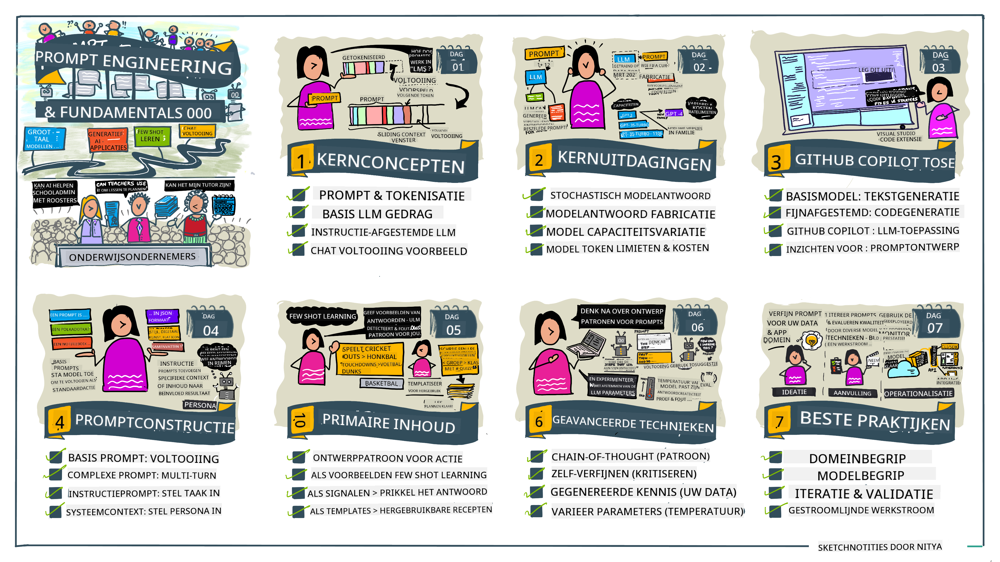
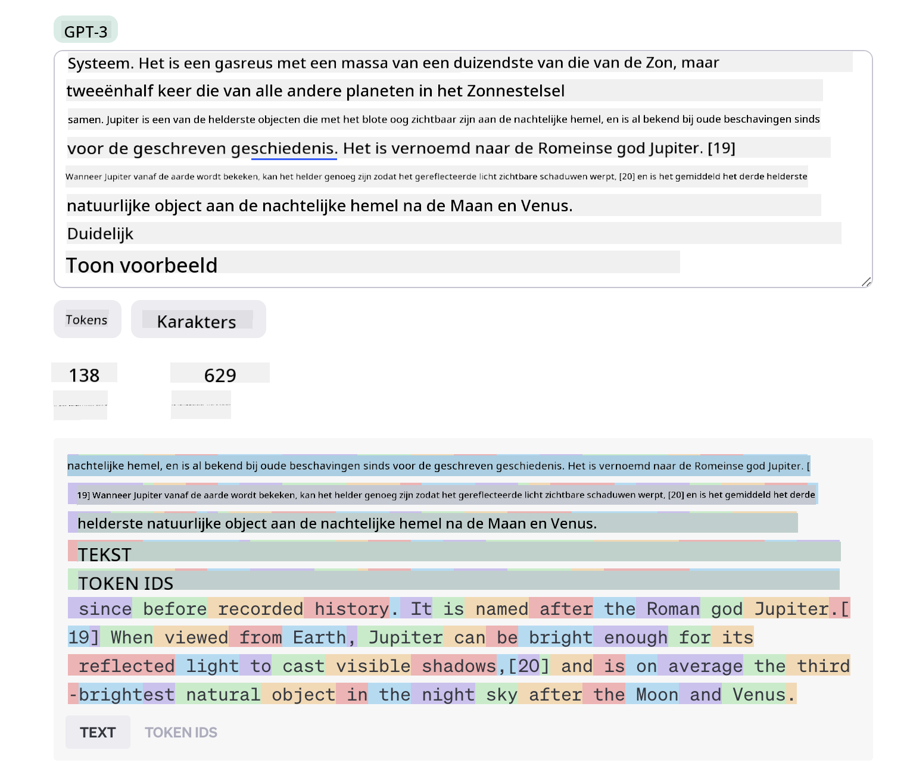
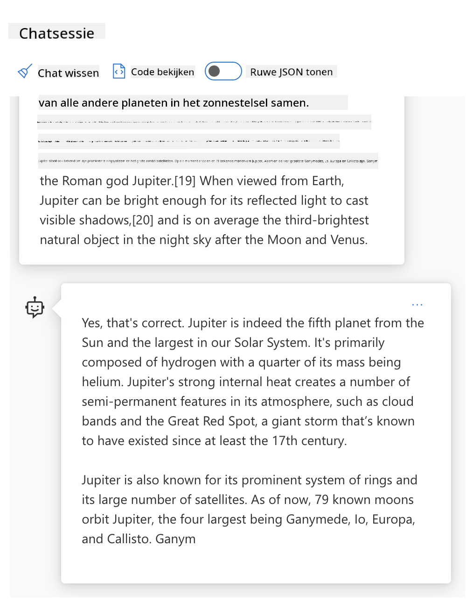
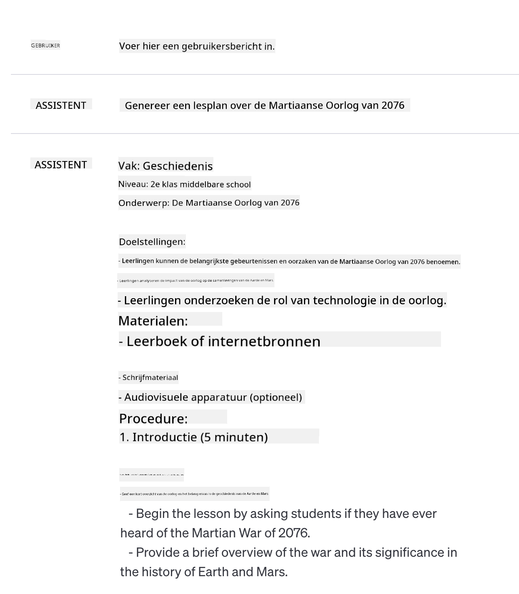

<!--
CO_OP_TRANSLATOR_METADATA:
{
  "original_hash": "8b3cb38518cf4fe7714d2f5e74dfa3eb",
  "translation_date": "2025-10-03T09:47:17+00:00",
  "source_file": "04-prompt-engineering-fundamentals/README.md",
  "language_code": "nl"
}
-->
# Basisprincipes van Prompt Engineering

[](https://aka.ms/gen-ai-lesson4-gh?WT.mc_id=academic-105485-koreyst)

## Introductie
Deze module behandelt essentiële concepten en technieken voor het maken van effectieve prompts in generatieve AI-modellen. De manier waarop je je prompt schrijft naar een LLM is ook van belang. Een zorgvuldig samengestelde prompt kan een betere kwaliteit van respons opleveren. Maar wat betekenen termen zoals _prompt_ en _prompt engineering_ precies? En hoe verbeter ik de _input_ prompt die ik naar de LLM stuur? Dit zijn de vragen die we in dit hoofdstuk en het volgende proberen te beantwoorden.

_Generatieve AI_ is in staat om nieuwe content te creëren (bijv. tekst, afbeeldingen, audio, code, enz.) als reactie op gebruikersverzoeken. Dit wordt bereikt met behulp van _Large Language Models_ zoals de GPT ("Generative Pre-trained Transformer") serie van OpenAI, die getraind zijn om natuurlijke taal en code te gebruiken.

Gebruikers kunnen nu met deze modellen communiceren via bekende paradigma's zoals chat, zonder technische expertise of training nodig te hebben. De modellen zijn _prompt-gebaseerd_ - gebruikers sturen een tekstinput (prompt) en krijgen een AI-respons (completion) terug. Ze kunnen vervolgens "met de AI chatten" in iteratieve, meerstapsgesprekken, waarbij ze hun prompt verfijnen totdat de respons aan hun verwachtingen voldoet.

"Prompts" worden nu de primaire _programmeerinterface_ voor generatieve AI-apps, waarmee de modellen worden verteld wat ze moeten doen en de kwaliteit van de geretourneerde reacties wordt beïnvloed. "Prompt Engineering" is een snelgroeiend vakgebied dat zich richt op het _ontwerpen en optimaliseren_ van prompts om consistente en kwalitatieve reacties op schaal te leveren.

## Leerdoelen

In deze les leren we wat Prompt Engineering is, waarom het belangrijk is en hoe we effectievere prompts kunnen maken voor een specifiek model en toepassingsdoel. We begrijpen kernconcepten en best practices voor prompt engineering - en leren over een interactieve Jupyter Notebooks "sandbox"-omgeving waar we deze concepten kunnen toepassen op echte voorbeelden.

Aan het einde van deze les kunnen we:

1. Uitleggen wat prompt engineering is en waarom het belangrijk is.
2. De componenten van een prompt beschrijven en hoe ze worden gebruikt.
3. Best practices en technieken voor prompt engineering leren.
4. Geleerde technieken toepassen op echte voorbeelden, met behulp van een OpenAI-endpoint.

## Belangrijke termen

Prompt Engineering: De praktijk van het ontwerpen en verfijnen van inputs om AI-modellen te sturen naar het produceren van gewenste outputs.  
Tokenization: Het proces van het omzetten van tekst in kleinere eenheden, genaamd tokens, die een model kan begrijpen en verwerken.  
Instruction-Tuned LLMs: Grote taalmodellen (LLMs) die zijn verfijnd met specifieke instructies om hun responsnauwkeurigheid en relevantie te verbeteren.

## Leeromgeving

Prompt engineering is momenteel meer kunst dan wetenschap. De beste manier om onze intuïtie ervoor te verbeteren is door _meer te oefenen_ en een trial-and-error aanpak te hanteren die domeinexpertise combineert met aanbevolen technieken en model-specifieke optimalisaties.

De Jupyter Notebook die bij deze les hoort, biedt een _sandbox_-omgeving waar je kunt uitproberen wat je leert - terwijl je bezig bent of als onderdeel van de code-uitdaging aan het einde. Om de oefeningen uit te voeren, heb je nodig:

1. **Een Azure OpenAI API-sleutel** - de service endpoint voor een geïmplementeerde LLM.  
2. **Een Python-runtime** - waarin de Notebook kan worden uitgevoerd.  
3. **Lokale omgevingsvariabelen** - _voltooi de [SETUP](./../00-course-setup/02-setup-local.md?WT.mc_id=academic-105485-koreyst) stappen nu om je voor te bereiden_.  

De notebook bevat _startoefeningen_ - maar je wordt aangemoedigd om je eigen _Markdown_ (beschrijving) en _Code_ (promptverzoeken) secties toe te voegen om meer voorbeelden of ideeën uit te proberen - en je intuïtie voor promptontwerp op te bouwen.

## Geïllustreerde gids

Wil je een overzicht krijgen van wat deze les behandelt voordat je erin duikt? Bekijk deze geïllustreerde gids, die je een idee geeft van de belangrijkste onderwerpen die worden behandeld en de belangrijkste inzichten om over na te denken bij elk onderwerp. De lesroutekaart neemt je mee van het begrijpen van de kernconcepten en uitdagingen tot het aanpakken ervan met relevante technieken en best practices voor prompt engineering. Merk op dat de sectie "Geavanceerde technieken" in deze gids verwijst naar inhoud die wordt behandeld in het _volgende_ hoofdstuk van dit curriculum.



## Onze startup

Laten we nu bespreken hoe _dit onderwerp_ verband houdt met onze missie om [AI-innovatie naar het onderwijs te brengen](https://educationblog.microsoft.com/2023/06/collaborating-to-bring-ai-innovation-to-education?WT.mc_id=academic-105485-koreyst). We willen AI-gestuurde toepassingen voor _gepersonaliseerd leren_ bouwen - dus laten we nadenken over hoe verschillende gebruikers van onze toepassing prompts zouden kunnen "ontwerpen":

- **Beheerders** kunnen de AI vragen om _curriculumgegevens te analyseren om hiaten in dekking te identificeren_. De AI kan resultaten samenvatten of visualiseren met code.  
- **Docenten** kunnen de AI vragen om _een lesplan te genereren voor een specifieke doelgroep en onderwerp_. De AI kan het gepersonaliseerde plan in een opgegeven formaat opstellen.  
- **Studenten** kunnen de AI vragen om _hen te begeleiden in een moeilijk vak_. De AI kan studenten nu begeleiden met lessen, hints en voorbeelden die zijn afgestemd op hun niveau.  

Dat is slechts het topje van de ijsberg. Bekijk [Prompts For Education](https://github.com/microsoft/prompts-for-edu/tree/main?WT.mc_id=academic-105485-koreyst) - een open-source promptbibliotheek samengesteld door onderwijsdeskundigen - om een breder beeld te krijgen van de mogelijkheden! _Probeer enkele van die prompts uit in de sandbox of gebruik de OpenAI Playground om te zien wat er gebeurt!_

## Wat is Prompt Engineering?

We begonnen deze les met het definiëren van **Prompt Engineering** als het proces van _ontwerpen en optimaliseren_ van tekstinputs (prompts) om consistente en kwalitatieve reacties (completions) te leveren voor een specifiek toepassingsdoel en model. We kunnen dit zien als een proces in twee stappen:

- _Ontwerpen_ van de initiële prompt voor een specifiek model en doel.  
- _Verfijnen_ van de prompt iteratief om de kwaliteit van de respons te verbeteren.  

Dit is noodzakelijkerwijs een trial-and-error proces dat gebruikersintuïtie en inspanning vereist om optimale resultaten te behalen. Maar waarom is het belangrijk? Om die vraag te beantwoorden, moeten we eerst drie concepten begrijpen:

- _Tokenization_ = hoe het model de prompt "ziet".  
- _Base LLMs_ = hoe het basismodel een prompt "verwerkt".  
- _Instruction-Tuned LLMs_ = hoe het model nu "taken" kan zien.  

### Tokenization

Een LLM ziet prompts als een _reeks tokens_ waarbij verschillende modellen (of versies van een model) dezelfde prompt op verschillende manieren kunnen tokeniseren. Omdat LLMs zijn getraind op tokens (en niet op ruwe tekst), heeft de manier waarop prompts worden getokeniseerd een directe invloed op de kwaliteit van de gegenereerde respons.

Om een intuïtie te krijgen voor hoe tokenization werkt, kun je tools zoals de [OpenAI Tokenizer](https://platform.openai.com/tokenizer?WT.mc_id=academic-105485-koreyst) proberen, zoals hieronder weergegeven. Kopieer je prompt en zie hoe deze wordt omgezet in tokens, waarbij je let op hoe witruimtes en leestekens worden behandeld. Merk op dat dit voorbeeld een ouder LLM (GPT-3) toont - het proberen met een nieuwer model kan een ander resultaat opleveren.



### Concept: Foundation Models

Zodra een prompt is getokeniseerd, is de primaire functie van het ["Base LLM"](https://blog.gopenai.com/an-introduction-to-base-and-instruction-tuned-large-language-models-8de102c785a6?WT.mc_id=academic-105485-koreyst) (of Foundation model) om het volgende token in die reeks te voorspellen. Omdat LLMs zijn getraind op enorme tekstdatasets, hebben ze een goed gevoel voor de statistische relaties tussen tokens en kunnen ze die voorspelling met enige zekerheid maken. Merk op dat ze de _betekenis_ van de woorden in de prompt of token niet begrijpen; ze zien alleen een patroon dat ze kunnen "voltooien" met hun volgende voorspelling. Ze kunnen doorgaan met het voorspellen van de reeks totdat dit wordt beëindigd door gebruikersinterventie of een vooraf vastgestelde voorwaarde.

Wil je zien hoe prompt-gebaseerde completions werken? Voer de bovenstaande prompt in de Azure OpenAI Studio [_Chat Playground_](https://oai.azure.com/playground?WT.mc_id=academic-105485-koreyst) in met de standaardinstellingen. Het systeem is geconfigureerd om prompts te behandelen als verzoeken om informatie - dus je zou een completion moeten zien die aan deze context voldoet.

Maar wat als de gebruiker iets specifieks wilde zien dat aan bepaalde criteria of taakdoelen voldeed? Hier komen _instruction-tuned_ LLMs in beeld.



### Concept: Instruction Tuned LLMs

Een [Instruction Tuned LLM](https://blog.gopenai.com/an-introduction-to-base-and-instruction-tuned-large-language-models-8de102c785a6?WT.mc_id=academic-105485-koreyst) begint met het basismodel en verfijnt dit met voorbeelden of input/output-paren (bijv. meerstaps "berichten") die duidelijke instructies kunnen bevatten - en de respons van de AI probeert die instructie te volgen.

Dit maakt gebruik van technieken zoals Reinforcement Learning with Human Feedback (RLHF) die het model kunnen trainen om _instructies te volgen_ en _van feedback te leren_, zodat het reacties produceert die beter geschikt zijn voor praktische toepassingen en relevanter zijn voor gebruikersdoelen.

Laten we het uitproberen - ga terug naar de bovenstaande prompt, maar verander nu het _systeembericht_ om de volgende instructie als context te geven:

> _Vat de inhoud samen die je wordt gegeven voor een leerling in groep 4. Houd het resultaat tot één alinea met 3-5 bullet points._

Zie je hoe het resultaat nu is afgestemd op het gewenste doel en formaat? Een docent kan deze respons nu direct gebruiken in zijn of haar slides voor die les.


## Waarom hebben we Prompt Engineering nodig?

Nu we weten hoe prompts worden verwerkt door LLMs, laten we bespreken _waarom_ we prompt engineering nodig hebben. Het antwoord ligt in het feit dat huidige LLMs een aantal uitdagingen met zich meebrengen die het moeilijker maken om _betrouwbare en consistente completions_ te bereiken zonder moeite te steken in het construeren en optimaliseren van prompts. Bijvoorbeeld:

1. **Modelreacties zijn stochastisch.** De _zelfde prompt_ zal waarschijnlijk verschillende reacties opleveren met verschillende modellen of modelversies. En het kan zelfs verschillende resultaten opleveren met hetzelfde model op verschillende tijdstippen. _Prompt engineering technieken kunnen ons helpen deze variaties te minimaliseren door betere richtlijnen te bieden_.  

2. **Modellen kunnen reacties verzinnen.** Modellen zijn vooraf getraind met _grote maar eindige_ datasets, wat betekent dat ze geen kennis hebben over concepten buiten die trainingsscope. Als gevolg hiervan kunnen ze completions produceren die onnauwkeurig, verzonnen of direct in tegenspraak zijn met bekende feiten. _Prompt engineering technieken helpen gebruikers dergelijke verzinsels te identificeren en te beperken, bijvoorbeeld door de AI om citaties of redeneringen te vragen_.  

3. **Modelcapaciteiten zullen variëren.** Nieuwere modellen of modelgeneraties zullen rijkere capaciteiten hebben, maar brengen ook unieke eigenaardigheden en afwegingen in kosten en complexiteit met zich mee. _Prompt engineering kan ons helpen best practices en workflows te ontwikkelen die verschillen abstraheren en zich aanpassen aan model-specifieke vereisten op schaalbare, naadloze manieren_.  

Laten we dit in actie zien in de OpenAI of Azure OpenAI Playground:

- Gebruik dezelfde prompt met verschillende LLM-implementaties (bijv. OpenAI, Azure OpenAI, Hugging Face) - zag je de variaties?  
- Gebruik dezelfde prompt herhaaldelijk met dezelfde LLM-implementatie (bijv. Azure OpenAI Playground) - hoe verschilden deze variaties?  

### Voorbeeld van verzinsels

In deze cursus gebruiken we de term **"verzinsels"** om te verwijzen naar het fenomeen waarbij LLMs soms feitelijk onjuiste informatie genereren vanwege beperkingen in hun training of andere beperkingen. Je hebt dit misschien ook gehoord als _"hallucinaties"_ in populaire artikelen of onderzoeksdocumenten. We raden echter sterk aan om _"verzinsels"_ als term te gebruiken, zodat we niet per ongeluk het gedrag antropomorfiseren door een menselijke eigenschap toe te schrijven aan een machinegedreven resultaat. Dit versterkt ook de [Responsible AI-richtlijnen](https://www.microsoft.com/ai/responsible-ai?WT.mc_id=academic-105485-koreyst) vanuit terminologieperspectief, waarbij termen worden verwijderd die mogelijk als beledigend of niet-inclusief worden beschouwd in sommige contexten.

Wil je een idee krijgen van hoe verzinsels werken? Bedenk een prompt die de AI instrueert om content te genereren voor een niet-bestaand onderwerp (om ervoor te zorgen dat het niet in de trainingsdataset voorkomt). Bijvoorbeeld - ik probeerde deze prompt:

> **Prompt:** maak een lesplan over de Mars-oorlog van 2076.
Een webzoektocht liet zien dat er fictieve verhalen zijn (bijvoorbeeld televisieseries of boeken) over oorlogen op Mars - maar geen enkele in 2076. Het is ook logisch dat 2076 _in de toekomst_ ligt en dus niet kan worden gekoppeld aan een echte gebeurtenis.

Dus wat gebeurt er als we deze prompt uitvoeren met verschillende LLM-aanbieders?

> **Reactie 1**: OpenAI Playground (GPT-35)



> **Reactie 2**: Azure OpenAI Playground (GPT-35)


> **Reactie 3**: Hugging Face Chat Playground (LLama-2)


Zoals verwacht produceert elk model (of modelversie) enigszins verschillende reacties dankzij stochastisch gedrag en variaties in modelcapaciteit. Bijvoorbeeld, het ene model richt zich op een publiek van groep 8, terwijl het andere uitgaat van een middelbare scholier. Maar alle drie de modellen genereerden reacties die een onwetende gebruiker zouden kunnen overtuigen dat de gebeurtenis echt was.

Technieken voor prompt-engineering zoals _metaprompting_ en _temperatuurconfiguratie_ kunnen modelfabricaties tot op zekere hoogte verminderen. Nieuwe architecturen voor prompt-engineering integreren ook naadloos nieuwe tools en technieken in de promptflow om enkele van deze effecten te beperken of te verminderen.

## Case Study: GitHub Copilot

Laten we dit gedeelte afsluiten door een idee te krijgen van hoe prompt-engineering wordt gebruikt in oplossingen uit de praktijk, door te kijken naar een case study: [GitHub Copilot](https://github.com/features/copilot?WT.mc_id=academic-105485-koreyst).

GitHub Copilot is jouw "AI Pair Programmer" - het zet tekstprompts om in codevoorstellen en is geïntegreerd in je ontwikkelomgeving (bijvoorbeeld Visual Studio Code) voor een naadloze gebruikerservaring. Zoals gedocumenteerd in de reeks blogs hieronder, was de vroegste versie gebaseerd op het OpenAI Codex-model - waarbij ingenieurs snel inzagen dat het nodig was om het model te verfijnen en betere technieken voor prompt-engineering te ontwikkelen om de codekwaliteit te verbeteren. In juli [introduceerden ze een verbeterd AI-model dat verder gaat dan Codex](https://github.blog/2023-07-28-smarter-more-efficient-coding-github-copilot-goes-beyond-codex-with-improved-ai-model/?WT.mc_id=academic-105485-koreyst) voor nog snellere suggesties.

Lees de berichten in volgorde om hun leerproces te volgen.

- **Mei 2023** | [GitHub Copilot wordt beter in het begrijpen van jouw code](https://github.blog/2023-05-17-how-github-copilot-is-getting-better-at-understanding-your-code/?WT.mc_id=academic-105485-koreyst)
- **Mei 2023** | [Binnen GitHub: Werken met de LLM's achter GitHub Copilot](https://github.blog/2023-05-17-inside-github-working-with-the-llms-behind-github-copilot/?WT.mc_id=academic-105485-koreyst).
- **Juni 2023** | [Hoe je betere prompts schrijft voor GitHub Copilot](https://github.blog/2023-06-20-how-to-write-better-prompts-for-github-copilot/?WT.mc_id=academic-105485-koreyst).
- **Juli 2023** | [.. GitHub Copilot gaat verder dan Codex met verbeterd AI-model](https://github.blog/2023-07-28-smarter-more-efficient-coding-github-copilot-goes-beyond-codex-with-improved-ai-model/?WT.mc_id=academic-105485-koreyst)
- **Juli 2023** | [Een ontwikkelaarsgids voor prompt-engineering en LLM's](https://github.blog/2023-07-17-prompt-engineering-guide-generative-ai-llms/?WT.mc_id=academic-105485-koreyst)
- **September 2023** | [Hoe je een zakelijke LLM-app bouwt: Lessen van GitHub Copilot](https://github.blog/2023-09-06-how-to-build-an-enterprise-llm-application-lessons-from-github-copilot/?WT.mc_id=academic-105485-koreyst)

Je kunt ook hun [Engineering blog](https://github.blog/category/engineering/?WT.mc_id=academic-105485-koreyst) bekijken voor meer berichten zoals [deze](https://github.blog/2023-09-27-how-i-used-github-copilot-chat-to-build-a-reactjs-gallery-prototype/?WT.mc_id=academic-105485-koreyst) die laat zien hoe deze modellen en technieken _toegepast_ worden om echte toepassingen te realiseren.

---

## Promptconstructie

We hebben gezien waarom prompt-engineering belangrijk is - nu gaan we begrijpen hoe prompts worden _geconstrueerd_ zodat we verschillende technieken kunnen evalueren voor een effectievere promptontwerp.

### Basisprompt

Laten we beginnen met de basisprompt: een tekstinvoer die naar het model wordt gestuurd zonder verdere context. Hier is een voorbeeld - wanneer we de eerste paar woorden van het Amerikaanse volkslied naar de OpenAI [Completion API](https://platform.openai.com/docs/api-reference/completions?WT.mc_id=academic-105485-koreyst) sturen, voltooit het onmiddellijk de reactie met de volgende paar regels, wat het basisvoorspellingsgedrag illustreert.

| Prompt (Invoer)     | Voltooiing (Uitvoer)                                                                                                                        |
| :------------------ | :----------------------------------------------------------------------------------------------------------------------------------------- |
| Oh say can you see | Het lijkt erop dat je begint met de tekst van "The Star-Spangled Banner," het volkslied van de Verenigde Staten. De volledige tekst is ... |

### Complexe prompt

Nu voegen we context en instructies toe aan die basisprompt. De [Chat Completion API](https://learn.microsoft.com/azure/ai-services/openai/how-to/chatgpt?WT.mc_id=academic-105485-koreyst) stelt ons in staat een complexe prompt te construeren als een verzameling _berichten_ met:

- Invoer/uitvoerparen die _gebruikers_ invoer en _assistent_ reactie weerspiegelen.
- Systeembericht dat de context voor het gedrag of de persoonlijkheid van de assistent instelt.

Het verzoek heeft nu de onderstaande vorm, waarbij de _tokenisatie_ effectief relevante informatie uit context en gesprek vastlegt. Het veranderen van de systeemcontext kan nu net zo'n grote impact hebben op de kwaliteit van de voltooiingen als de verstrekte gebruikersinvoer.

```python
response = openai.chat.completions.create(
    model="gpt-3.5-turbo",
    messages=[
        {"role": "system", "content": "You are a helpful assistant."},
        {"role": "user", "content": "Who won the world series in 2020?"},
        {"role": "assistant", "content": "The Los Angeles Dodgers won the World Series in 2020."},
        {"role": "user", "content": "Where was it played?"}
    ]
)
```

### Instructieprompt

In de bovenstaande voorbeelden was de gebruikersprompt een eenvoudige tekstquery die geïnterpreteerd kan worden als een verzoek om informatie. Met _instructie_ prompts kunnen we die tekst gebruiken om een taak gedetailleerder te specificeren, waardoor de AI beter wordt begeleid. Hier is een voorbeeld:

| Prompt (Invoer)                                                                                                                                                                                                                         | Voltooiing (Uitvoer)                                                                                                        | Type instructie     |
| :------------------------------------------------------------------------------------------------------------------------------------------------------------------------------------------------------------------------------------- | :------------------------------------------------------------------------------------------------------------------------- | :------------------ |
| Schrijf een beschrijving van de Amerikaanse Burgeroorlog                                                                                                                                                                               | _teruggegeven een eenvoudige alinea_                                                                                       | Eenvoudig           |
| Schrijf een beschrijving van de Amerikaanse Burgeroorlog. Geef belangrijke data en gebeurtenissen en beschrijf hun betekenis                                                                                                           | _teruggegeven een alinea gevolgd door een lijst van belangrijke datums met beschrijvingen_                                 | Complex             |
| Schrijf een beschrijving van de Amerikaanse Burgeroorlog in 1 alinea. Geef 3 opsommingstekens met belangrijke data en hun betekenis. Geef nog 3 opsommingstekens met belangrijke historische figuren en hun bijdragen. Geef de uitvoer als een JSON-bestand | _teruggegeven meer uitgebreide details in een tekstvak, geformatteerd als JSON die je kunt kopiëren en plakken in een bestand en valideren indien nodig_ | Complex. Geformatteerd. |

## Primaire inhoud

In de bovenstaande voorbeelden was de prompt nog vrij open, waardoor de LLM kon beslissen welk deel van zijn voorgetrainde dataset relevant was. Met het _primaire inhoud_ ontwerppatroon wordt de invoertekst verdeeld in twee delen:

- een instructie (actie)
- relevante inhoud (die de actie beïnvloedt)

Hier is een voorbeeld waarbij de instructie is om "vat dit samen in 2 zinnen".

| Prompt (Invoer)                                                                                                                                                                                                                                                                                                                                                                                                                                                                                                                                                                                                                                                                                      | Voltooiing (Uitvoer)                                                                                                                                                                                                                                                                             |
| :-------------------------------------------------------------------------------------------------------------------------------------------------------------------------------------------------------------------------------------------------------------------------------------------------------------------------------------------------------------------------------------------------------------------------------------------------------------------------------------------------------------------------------------------------------------------------------------------------------------------------------------------------------------------------------------------------- | :---------------------------------------------------------------------------------------------------------------------------------------------------------------------------------------------------------------------------------------------------------------------------------------------- |
| Jupiter is de vijfde planeet vanaf de zon en de grootste in het zonnestelsel. Het is een gasreus met een massa van een duizendste van die van de zon, maar tweeënhalf keer die van alle andere planeten in het zonnestelsel samen. Jupiter is een van de helderste objecten die met het blote oog zichtbaar zijn in de nachtelijke hemel, en is bekend bij oude beschavingen sinds vóór de geschreven geschiedenis. Het is vernoemd naar de Romeinse god Jupiter.[19] Wanneer bekeken vanaf de aarde, kan Jupiter helder genoeg zijn om zijn gereflecteerde licht zichtbare schaduwen te laten werpen,[20] en is gemiddeld het derde helderste natuurlijke object in de nachtelijke hemel na de maan en Venus. <br/> **Vat dit samen in 2 korte zinnen** | Jupiter, de vijfde planeet vanaf de zon, is de grootste in het zonnestelsel en staat bekend als een van de helderste objecten in de nachtelijke hemel. Vernoemd naar de Romeinse god Jupiter, is het een gasreus met een massa die tweeënhalf keer die van alle andere planeten in het zonnestelsel samen is. |

Het segment primaire inhoud kan op verschillende manieren worden gebruikt om effectievere instructies te sturen:

- **Voorbeelden** - in plaats van het model expliciet te vertellen wat te doen met een instructie, geef je voorbeelden van wat te doen en laat je het patroon afleiden.
- **Hints** - volg de instructie met een "hint" die de voltooiing stimuleert en het model naar relevantere reacties leidt.
- **Sjablonen** - dit zijn herhaalbare 'recepten' voor prompts met placeholders (variabelen) die kunnen worden aangepast met gegevens voor specifieke toepassingen.

Laten we deze in actie bekijken.

### Voorbeelden gebruiken

Dit is een aanpak waarbij je de primaire inhoud gebruikt om het model "te voeden" met enkele voorbeelden van de gewenste uitvoer voor een gegeven instructie, en het patroon voor de gewenste uitvoer laat afleiden. Afhankelijk van het aantal verstrekte voorbeelden kunnen we zero-shot prompting, one-shot prompting, few-shot prompting etc. hebben.

De prompt bestaat nu uit drie componenten:

- Een taakbeschrijving
- Een paar voorbeelden van de gewenste uitvoer
- Het begin van een nieuw voorbeeld (dat een impliciete taakbeschrijving wordt)

| Leerwijze      | Prompt (Invoer)                                                                                                                                        | Voltooiing (Uitvoer)         |
| :------------- | :---------------------------------------------------------------------------------------------------------------------------------------------------- | :-------------------------- |
| Zero-shot      | "De zon schijnt". Vertaal naar Spaans                                                                                                                | "El Sol está brillando".    |
| One-shot       | "De zon schijnt" => ""El Sol está brillando". <br> "Het is een koude en winderige dag" =>                                                             | "Es un día frío y ventoso". |
| Few-shot       | De speler rende over de honken => Honkbal <br/> De speler sloeg een ace => Tennis <br/> De speler sloeg een zes => Cricket <br/> De speler maakte een slam-dunk => | Basketbal                  |
|                |                                                                                                                                                       |                             |

Let op hoe we expliciete instructies moesten geven ("Vertaal naar Spaans") in zero-shot prompting, maar dit wordt afgeleid in het one-shot prompting voorbeeld. Het few-shot voorbeeld laat zien hoe het toevoegen van meer voorbeelden modellen in staat stelt om nauwkeurigere afleidingen te maken zonder extra instructies.

### Prompt hints

Een andere techniek voor het gebruik van primaire inhoud is het geven van _hints_ in plaats van voorbeelden. In dit geval geef je het model een duwtje in de juiste richting door het _te starten_ met een fragment dat het gewenste reactieformaat weerspiegelt. Het model "pakt de hint" en gaat verder in diezelfde lijn.

| Aantal hints | Prompt (Invoer)                                                                                                                                                                                                                                                                                                                                                                                                                                               | Voltooiing (Uitvoer)                                                                                                                                                                                                                                                                                       |
| :----------- | :----------------------------------------------------------------------------------------------------------------------------------------------------------------------------------------------------------------------------------------------------------------------------------------------------------------------------------------------------------------------------------------------------------------------------------------------------------- | :-------------------------------------------------------------------------------------------------------------------------------------------------------------------------------------------------------------------------------------------------------------------------------------------------------- |
| 0            | Jupiter is de vijfde planeet vanaf de zon en de grootste in het zonnestelsel. Het is een gasreus met een massa van een duizendste van die van de zon, maar tweeënhalf keer die van alle andere planeten in het zonnestelsel samen. Jupiter is een van de helderste objecten die met het blote oog zichtbaar zijn in de nachtelijke hemel, en is bekend bij oude beschavingen sinds vóór de geschreven geschiedenis. <br/>**Vat dit samen**                                       | Jupiter is de grootste planeet in ons zonnestelsel en de vijfde vanaf de zon. Het is een gasreus met een massa van 1/1000e van de zon, maar het is zwaarder dan alle andere planeten samen. Oude beschavingen kennen Jupiter al lang, en het is gemakkelijk zichtbaar in de nachtelijke hemel. |
| 1              | Jupiter is de vijfde planeet vanaf de zon en de grootste in het zonnestelsel. Het is een gasreus met een massa die duizendste is van die van de zon, maar tweeënhalf keer die van alle andere planeten in het zonnestelsel samen. Jupiter is een van de helderste objecten die met het blote oog zichtbaar zijn aan de nachtelijke hemel en is al bekend bij oude beschavingen sinds vóór de geschreven geschiedenis. <br/>**Samenvatting** <br/> Wat we hebben geleerd is dat Jupiter | de vijfde planeet vanaf de zon is en de grootste in het zonnestelsel. Het is een gasreus met een massa die duizendste is van die van de zon, maar tweeënhalf keer die van alle andere planeten samen. Het is gemakkelijk zichtbaar met het blote oog en is al sinds de oudheid bekend.                        |
| 2              | Jupiter is de vijfde planeet vanaf de zon en de grootste in het zonnestelsel. Het is een gasreus met een massa die duizendste is van die van de zon, maar tweeënhalf keer die van alle andere planeten in het zonnestelsel samen. Jupiter is een van de helderste objecten die met het blote oog zichtbaar zijn aan de nachtelijke hemel en is al bekend bij oude beschavingen sinds vóór de geschreven geschiedenis. <br/>**Samenvatting** <br/> Top 3 feiten die we hebben geleerd:         | 1. Jupiter is de vijfde planeet vanaf de zon en de grootste in het zonnestelsel. <br/> 2. Het is een gasreus met een massa die duizendste is van die van de zon...<br/> 3. Jupiter is al sinds de oudheid zichtbaar met het blote oog ...                                                                       |
|                |                                                                                                                                                                                                                                                                                                                                                                                                                                                              |                                                                                                                                                                                                                                                                                                           |

### Prompt Templates

Een prompttemplate is een _vooraf gedefinieerd recept voor een prompt_ dat kan worden opgeslagen en hergebruikt wanneer nodig, om meer consistente gebruikerservaringen op schaal te realiseren. In zijn eenvoudigste vorm is het simpelweg een verzameling van promptvoorbeelden zoals [dit voorbeeld van OpenAI](https://platform.openai.com/examples?WT.mc_id=academic-105485-koreyst) die zowel de interactieve promptcomponenten (gebruikers- en systeemberichten) als het API-gestuurde aanvraagformaat biedt - om hergebruik te ondersteunen.

In zijn meer complexe vorm, zoals [dit voorbeeld van LangChain](https://python.langchain.com/docs/concepts/prompt_templates/?WT.mc_id=academic-105485-koreyst), bevat het _plaatsvervangers_ die kunnen worden vervangen door gegevens uit verschillende bronnen (gebruikersinvoer, systeemcontext, externe gegevensbronnen, enz.) om een prompt dynamisch te genereren. Dit stelt ons in staat om een bibliotheek van herbruikbare prompts te creëren die consistentie in gebruikerservaringen **programmeerbaar** op schaal kunnen ondersteunen.

Ten slotte ligt de echte waarde van templates in de mogelijkheid om _promptbibliotheken_ te creëren en te publiceren voor verticale toepassingsdomeinen - waarbij het prompttemplate nu _geoptimaliseerd_ is om toepassingsspecifieke context of voorbeelden te weerspiegelen die de reacties relevanter en nauwkeuriger maken voor de beoogde gebruikersgroep. De [Prompts For Edu](https://github.com/microsoft/prompts-for-edu?WT.mc_id=academic-105485-koreyst) repository is een uitstekend voorbeeld van deze aanpak, waarbij een bibliotheek van prompts voor het onderwijsdomein wordt samengesteld met nadruk op belangrijke doelstellingen zoals lesplanning, curriculumontwerp, studentbegeleiding, enz.

## Ondersteunende inhoud

Als we promptconstructie beschouwen als het hebben van een instructie (taak) en een doel (primaire inhoud), dan is _secundaire inhoud_ zoals aanvullende context die we bieden om **de output op een bepaalde manier te beïnvloeden**. Het kan afstemmingsparameters, formatteringsinstructies, onderwerpclassificaties, enz. zijn die het model kunnen helpen om zijn reactie _aan te passen_ aan de gewenste gebruikersdoelen of verwachtingen.

Bijvoorbeeld: Gegeven een cursuscatalogus met uitgebreide metadata (naam, beschrijving, niveau, metadatatags, docent, enz.) over alle beschikbare cursussen in het curriculum:

- we kunnen een instructie definiëren om "de cursuscatalogus voor herfst 2023 samen te vatten"
- we kunnen de primaire inhoud gebruiken om enkele voorbeelden van de gewenste output te geven
- we kunnen de secundaire inhoud gebruiken om de top 5 "tags" van interesse te identificeren.

Nu kan het model een samenvatting geven in het formaat dat wordt getoond door de enkele voorbeelden - maar als een resultaat meerdere tags heeft, kan het prioriteit geven aan de 5 tags die in de secundaire inhoud zijn geïdentificeerd.

---

<!--
LESSON TEMPLATE:
Deze unit moet kernconcept #1 behandelen.
Versterk het concept met voorbeelden en referenties.

CONCEPT #3:
Prompt Engineering Technieken.
Wat zijn enkele basistechnieken voor prompt engineering?
Illustreer het met enkele oefeningen.
-->

## Best Practices voor Prompting

Nu we weten hoe prompts kunnen worden _geconstrueerd_, kunnen we beginnen na te denken over hoe we ze kunnen _ontwerpen_ om best practices te weerspiegelen. We kunnen dit in twee delen bekijken - de juiste _mindset_ hebben en de juiste _technieken_ toepassen.

### Mindset voor Prompt Engineering

Prompt Engineering is een proces van trial-and-error, dus houd drie brede leidende factoren in gedachten:

1. **Domeinbegrip is belangrijk.** De nauwkeurigheid en relevantie van de reactie is een functie van het _domein_ waarin die toepassing of gebruiker opereert. Gebruik je intuïtie en domeinexpertise om **technieken verder aan te passen**. Definieer bijvoorbeeld _domeinspecifieke persoonlijkheden_ in je systeemprompts, of gebruik _domeinspecifieke templates_ in je gebruikersprompts. Bied secundaire inhoud die domeinspecifieke contexten weerspiegelt, of gebruik _domeinspecifieke aanwijzingen en voorbeelden_ om het model te begeleiden naar vertrouwde gebruikspatronen.

2. **Begrip van het model is belangrijk.** We weten dat modellen stochastisch van aard zijn. Maar modelimplementaties kunnen ook variëren in termen van de trainingsdataset die ze gebruiken (vooraf getrainde kennis), de mogelijkheden die ze bieden (bijv. via API of SDK) en het type inhoud waarvoor ze zijn geoptimaliseerd (bijv. code versus afbeeldingen versus tekst). Begrijp de sterke en zwakke punten van het model dat je gebruikt, en gebruik die kennis om _taken te prioriteren_ of _aangepaste templates_ te bouwen die zijn geoptimaliseerd voor de mogelijkheden van het model.

3. **Iteratie en validatie zijn belangrijk.** Modellen evolueren snel, en dat geldt ook voor de technieken voor prompt engineering. Als domeinexpert heb je mogelijk andere context of criteria voor _jouw_ specifieke toepassing, die mogelijk niet van toepassing zijn op de bredere gemeenschap. Gebruik tools en technieken voor prompt engineering om de constructie van prompts te "starten", en itereren en valideren vervolgens de resultaten met je eigen intuïtie en domeinexpertise. Leg je inzichten vast en creëer een **kennisbasis** (bijv. promptbibliotheken) die door anderen kan worden gebruikt als nieuwe basislijn voor snellere iteraties in de toekomst.

## Best Practices

Laten we nu kijken naar veelvoorkomende best practices die worden aanbevolen door [OpenAI](https://help.openai.com/en/articles/6654000-best-practices-for-prompt-engineering-with-openai-api?WT.mc_id=academic-105485-koreyst) en [Azure OpenAI](https://learn.microsoft.com/azure/ai-services/openai/concepts/prompt-engineering#best-practices?WT.mc_id=academic-105485-koreyst) practitioners.

| Wat                               | Waarom                                                                                                                                                                                                                                               |
| :-------------------------------- | :------------------------------------------------------------------------------------------------------------------------------------------------------------------------------------------------------------------------------------------------ |
| Evalueer de nieuwste modellen.    | Nieuwe modelgeneraties hebben waarschijnlijk verbeterde functies en kwaliteit - maar kunnen ook hogere kosten met zich meebrengen. Evalueer ze op impact en neem vervolgens migratiebeslissingen.                                                    |
| Scheid instructies en context     | Controleer of je model/provider _scheidingstekens_ definieert om instructies, primaire en secundaire inhoud duidelijker te onderscheiden. Dit kan modellen helpen om nauwkeuriger gewichten toe te kennen aan tokens.                                 |
| Wees specifiek en duidelijk       | Geef meer details over de gewenste context, uitkomst, lengte, formaat, stijl, enz. Dit zal zowel de kwaliteit als de consistentie van reacties verbeteren. Leg recepten vast in herbruikbare templates.                                              |
| Wees beschrijvend, gebruik voorbeelden | Modellen reageren mogelijk beter op een "show and tell"-aanpak. Begin met een `zero-shot` aanpak waarbij je een instructie geeft (maar geen voorbeelden) en probeer vervolgens `few-shot` als verfijning, waarbij je enkele voorbeelden van de gewenste output geeft. Gebruik analogieën. |
| Gebruik aanwijzingen om reacties te starten | Geef het een duwtje in de richting van een gewenste uitkomst door het enkele leidende woorden of zinnen te geven die het kan gebruiken als startpunt voor de reactie.                                                                                 |
| Herhaal                          | Soms moet je jezelf herhalen voor het model. Geef instructies vóór en na je primaire inhoud, gebruik een instructie en een aanwijzing, enz. Itereren en valideren om te zien wat werkt.                                                             |
| Volgorde is belangrijk            | De volgorde waarin je informatie aan het model presenteert kan de output beïnvloeden, zelfs in de leervoorbeelden, dankzij recency bias. Probeer verschillende opties om te zien wat het beste werkt.                                                  |
| Geef het model een "uitweg"       | Geef het model een _fallback_-reactie die het kan geven als het de taak om welke reden dan ook niet kan voltooien. Dit kan de kans verkleinen dat modellen valse of verzonnen reacties genereren.                                                     |
|                                   |                                                                                                                                                                                                                                                   |

Zoals bij elke best practice, onthoud dat _jouw ervaring kan variëren_ afhankelijk van het model, de taak en het domein. Gebruik deze als uitgangspunt en itereren om te ontdekken wat het beste werkt voor jou. Evalueer je prompt engineering proces voortdurend opnieuw naarmate nieuwe modellen en tools beschikbaar komen, met een focus op proces schaalbaarheid en responskwaliteit.

<!--
LESSON TEMPLATE:
Deze unit moet een code-uitdaging bieden indien van toepassing

UITDAGING:
Link naar een Jupyter Notebook met alleen de code-opmerkingen in de instructies (codesecties zijn leeg).

OPLOSSING:
Link naar een kopie van dat Notebook met de prompts ingevuld en uitgevoerd, die laat zien wat één voorbeeld zou kunnen zijn.
-->

## Opdracht

Gefeliciteerd! Je hebt het einde van de les bereikt! Het is tijd om enkele van die concepten en technieken te testen met echte voorbeelden!

Voor onze opdracht gebruiken we een Jupyter Notebook met oefeningen die je interactief kunt voltooien. Je kunt het Notebook ook uitbreiden met je eigen Markdown- en Code-cellen om ideeën en technieken op eigen initiatief te verkennen.

### Om te beginnen, fork de repo, en

- (Aanbevolen) Start GitHub Codespaces
- (Alternatief) Clone de repo naar je lokale apparaat en gebruik het met Docker Desktop
- (Alternatief) Open het Notebook met je favoriete Notebook runtime-omgeving.

### Configureer vervolgens je omgevingsvariabelen

- Kopieer het `.env.copy` bestand in de root van de repo naar `.env` en vul de waarden in voor `AZURE_OPENAI_API_KEY`, `AZURE_OPENAI_ENDPOINT` en `AZURE_OPENAI_DEPLOYMENT`. Kom terug naar [Learning Sandbox sectie](../../../04-prompt-engineering-fundamentals/04-prompt-engineering-fundamentals) om te leren hoe.

### Open vervolgens het Jupyter Notebook

- Selecteer de runtime kernel. Als je optie 1 of 2 gebruikt, selecteer je gewoon de standaard Python 3.10.x kernel die door de ontwikkelcontainer wordt geleverd.

Je bent helemaal klaar om de oefeningen uit te voeren. Merk op dat er geen _goede en foute_ antwoorden zijn - alleen het verkennen van opties door middel van trial-and-error en het opbouwen van intuïtie voor wat werkt voor een bepaald model en toepassingsdomein.

_Om deze reden zijn er geen Code Solution segmenten in deze les. In plaats daarvan bevat het Notebook Markdown-cellen met de titel "Mijn oplossing:" die één voorbeeldoutput ter referentie tonen._

 <!--
LESSON TEMPLATE:
Sluit de sectie af met een samenvatting en bronnen voor zelfgestuurd leren.
-->

## Kennischeck

Welke van de volgende is een goede prompt die enkele redelijke best practices volgt?

1. Laat me een afbeelding zien van een rode auto
2. Laat me een afbeelding zien van een rode auto van het merk Volvo en model XC90 geparkeerd bij een klif met de zonsondergang
3. Laat me een afbeelding zien van een rode auto van het merk Volvo en model XC90

A: 2, dit is de beste prompt omdat het details geeft over "wat" en specifiek is (niet zomaar een auto, maar een specifiek merk en model) en het beschrijft ook de algehele setting. 3 is de volgende beste optie omdat het ook veel beschrijving bevat.

## 🚀 Uitdaging

Kun je de "aanwijzing"-techniek gebruiken met de prompt: Voltooi de zin "Laat me een afbeelding zien van een rode auto van het merk Volvo en ". Wat geeft het als reactie, en hoe zou je het verbeteren?

## Goed gedaan! Ga door met leren

Wil je meer leren over verschillende Prompt Engineering concepten? Ga naar de [vervolg leerpagina](https://aka.ms/genai-collection?WT.mc_id=academic-105485-koreyst) om andere geweldige bronnen over dit onderwerp te vinden.

Ga naar Les 5 waar we kijken naar [geavanceerde prompting technieken](../05-advanced-prompts/README.md?WT.mc_id=academic-105485-koreyst)!

---

**Disclaimer (Vrijwaring)**:  
Dit document is vertaald met behulp van de AI-vertalingsservice [Co-op Translator](https://github.com/Azure/co-op-translator). Hoewel we streven naar nauwkeurigheid, dient u zich ervan bewust te zijn dat geautomatiseerde vertalingen fouten of onnauwkeurigheden kunnen bevatten. Het originele document in de oorspronkelijke taal moet worden beschouwd als de gezaghebbende bron. Voor cruciale informatie wordt professionele menselijke vertaling aanbevolen. Wij zijn niet aansprakelijk voor misverstanden of verkeerde interpretaties die voortvloeien uit het gebruik van deze vertaling.