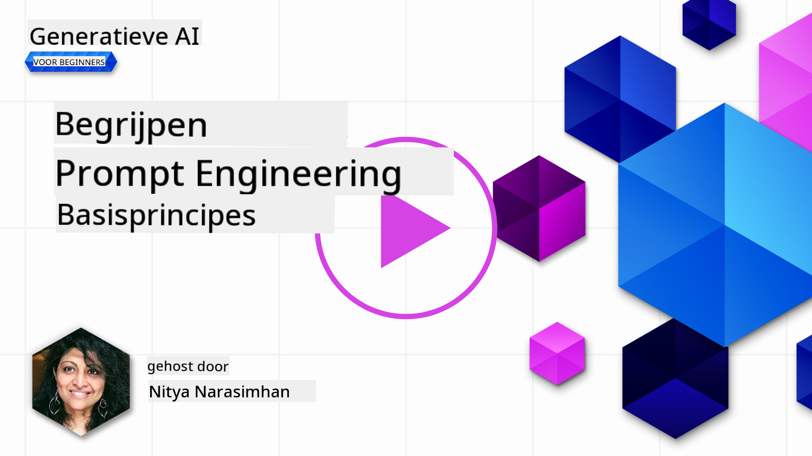
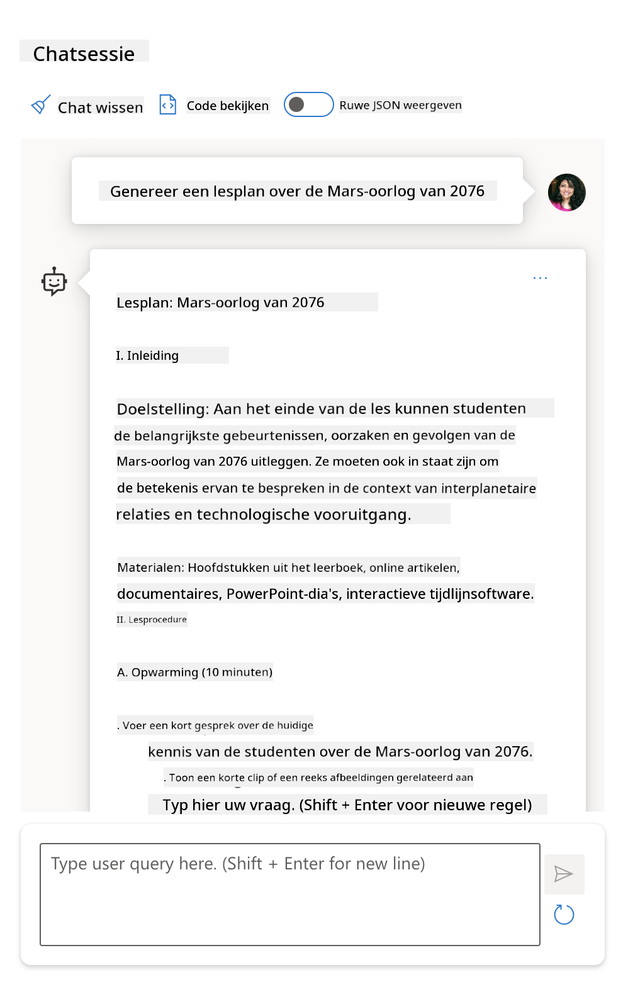
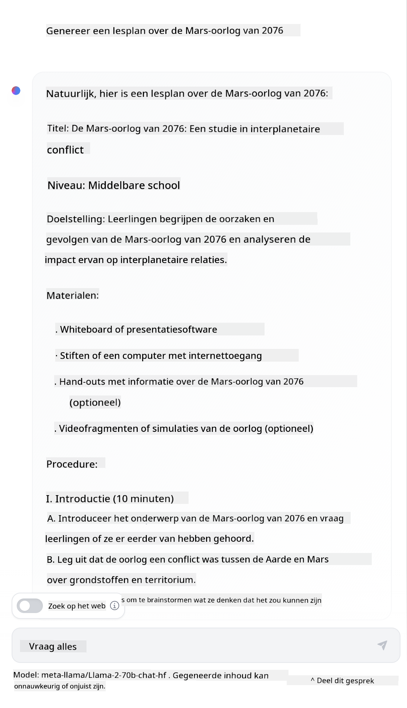

<!--
CO_OP_TRANSLATOR_METADATA:
{
  "original_hash": "a45c318dc6ebc2604f35b8b829f93af2",
  "translation_date": "2025-07-09T10:33:11+00:00",
  "source_file": "04-prompt-engineering-fundamentals/README.md",
  "language_code": "nl"
}
-->
# Prompt Engineering Fundamentals

[](https://aka.ms/gen-ai-lesson4-gh?WT.mc_id=academic-105485-koreyst)

## Introductie
Deze module behandelt essentiële concepten en technieken voor het maken van effectieve prompts in generatieve AI-modellen. De manier waarop je je prompt aan een LLM schrijft, is ook belangrijk. Een zorgvuldig opgestelde prompt kan een betere kwaliteit van de reactie opleveren. Maar wat betekenen termen als _prompt_ en _prompt engineering_ precies? En hoe verbeter ik de prompt _input_ die ik naar de LLM stuur? Dit zijn de vragen die we in dit hoofdstuk en het volgende proberen te beantwoorden.

_Generatieve AI_ kan nieuwe content creëren (bijvoorbeeld tekst, afbeeldingen, audio, code, enz.) als reactie op gebruikersverzoeken. Dit gebeurt met behulp van _Large Language Models_ zoals de GPT-serie van OpenAI ("Generative Pre-trained Transformer"), die getraind zijn om natuurlijke taal en code te gebruiken.

Gebruikers kunnen nu met deze modellen communiceren via bekende vormen zoals chat, zonder technische kennis of training. De modellen zijn _prompt-based_ – gebruikers sturen een tekstinvoer (prompt) en krijgen een AI-reactie (completion) terug. Ze kunnen vervolgens iteratief "chatten met de AI" in meertrapsgesprekken, waarbij ze hun prompt verfijnen totdat de reactie aan hun verwachtingen voldoet.

"Prompts" worden nu de belangrijkste _programmeertaal_ voor generatieve AI-applicaties, waarmee de modellen worden verteld wat ze moeten doen en die de kwaliteit van de teruggegeven reacties beïnvloeden. "Prompt Engineering" is een snelgroeiend vakgebied dat zich richt op het _ontwerpen en optimaliseren_ van prompts om consistente en kwalitatieve reacties op schaal te leveren.

## Leerdoelen

In deze les leren we wat Prompt Engineering is, waarom het belangrijk is en hoe we effectievere prompts kunnen maken voor een bepaald model en toepassingsdoel. We begrijpen kernconcepten en best practices voor prompt engineering – en leren over een interactieve Jupyter Notebooks "sandbox"-omgeving waar we deze concepten kunnen toepassen op echte voorbeelden.

Aan het einde van deze les kunnen we:

1. Uitleggen wat prompt engineering is en waarom het belangrijk is.
2. De onderdelen van een prompt beschrijven en hoe ze worden gebruikt.
3. Best practices en technieken voor prompt engineering leren.
4. De geleerde technieken toepassen op echte voorbeelden, met behulp van een OpenAI-endpoint.

## Belangrijke Begrippen

Prompt Engineering: De praktijk van het ontwerpen en verfijnen van invoer om AI-modellen te sturen naar het produceren van gewenste output.
Tokenization: Het proces waarbij tekst wordt omgezet in kleinere eenheden, tokens genoemd, die een model kan begrijpen en verwerken.
Instruction-Tuned LLMs: Large Language Models (LLM's) die zijn bijgesteld met specifieke instructies om hun reactienauwkeurigheid en relevantie te verbeteren.

## Leer Sandbox

Prompt engineering is momenteel meer kunst dan wetenschap. De beste manier om er beter in te worden is door _meer te oefenen_ en een trial-and-error aanpak te hanteren die domeinexpertise combineert met aanbevolen technieken en model-specifieke optimalisaties.

De Jupyter Notebook die bij deze les hoort, biedt een _sandbox_-omgeving waar je kunt uitproberen wat je leert – terwijl je bezig bent of als onderdeel van de code-uitdaging aan het einde. Om de oefeningen uit te voeren, heb je nodig:

1. **Een Azure OpenAI API-sleutel** – de service endpoint voor een ingezet LLM.
2. **Een Python-runtime** – waarin de Notebook kan worden uitgevoerd.
3. **Lokale omgevingsvariabelen** – _voltooi nu de [SETUP](./../00-course-setup/SETUP.md?WT.mc_id=academic-105485-koreyst) stappen om klaar te zijn_.

De notebook bevat _start_ oefeningen – maar je wordt aangemoedigd om je eigen _Markdown_ (beschrijving) en _Code_ (promptverzoeken) secties toe te voegen om meer voorbeelden of ideeën uit te proberen – en zo je intuïtie voor promptontwerp te ontwikkelen.

## Geïllustreerde Gids

Wil je een overzicht van wat deze les behandelt voordat je erin duikt? Bekijk deze geïllustreerde gids, die je een beeld geeft van de belangrijkste onderwerpen en de kernpunten om over na te denken bij elk onderwerp. De lesroute neemt je mee van het begrijpen van de kernconcepten en uitdagingen tot het aanpakken ervan met relevante prompt engineering technieken en best practices. Let op: de sectie "Geavanceerde Technieken" in deze gids verwijst naar inhoud die in het _volgende_ hoofdstuk van dit curriculum wordt behandeld.


## Onze Startup

Laten we nu bespreken hoe _dit onderwerp_ aansluit bij onze startup-missie om [AI-innovatie naar het onderwijs te brengen](https://educationblog.microsoft.com/2023/06/collaborating-to-bring-ai-innovation-to-education?WT.mc_id=academic-105485-koreyst). We willen AI-gedreven toepassingen voor _gepersonaliseerd leren_ bouwen – dus laten we nadenken over hoe verschillende gebruikers van onze applicatie prompts kunnen "ontwerpen":

- **Beheerders** kunnen de AI vragen om _curriculumgegevens te analyseren om hiaten in de dekking te identificeren_. De AI kan resultaten samenvatten of visualiseren met code.
- **Docenten** kunnen de AI vragen om _een lesplan te genereren voor een specifieke doelgroep en onderwerp_. De AI kan het gepersonaliseerde plan in een opgegeven formaat opstellen.
- **Studenten** kunnen de AI vragen om _hen te begeleiden bij een moeilijk vak_. De AI kan studenten nu begeleiden met lessen, hints en voorbeelden die zijn afgestemd op hun niveau.

Dat is nog maar het topje van de ijsberg. Bekijk [Prompts For Education](https://github.com/microsoft/prompts-for-edu/tree/main?WT.mc_id=academic-105485-koreyst) – een open-source promptsbibliotheek samengesteld door onderwijsdeskundigen – om een breder beeld te krijgen van de mogelijkheden! _Probeer enkele van die prompts uit in de sandbox of gebruik de OpenAI Playground om te zien wat er gebeurt!_

<!--
LESSON TEMPLATE:
This unit should cover core concept #1.
Reinforce the concept with examples and references.

CONCEPT #1:
Prompt Engineering.
Define it and explain why it is needed.
-->

## Wat is Prompt Engineering?

We zijn deze les begonnen met het definiëren van **Prompt Engineering** als het proces van het _ontwerpen en optimaliseren_ van tekstinvoer (prompts) om consistente en kwalitatieve reacties (completions) te leveren voor een bepaald toepassingsdoel en model. We kunnen dit zien als een proces in twee stappen:

- het _ontwerpen_ van de initiële prompt voor een bepaald model en doel
- het _verfijnen_ van de prompt iteratief om de kwaliteit van de reactie te verbeteren

Dit is per definitie een trial-and-error proces dat gebruikersintuïtie en inspanning vereist om optimale resultaten te behalen. Waarom is het belangrijk? Om die vraag te beantwoorden, moeten we eerst drie concepten begrijpen:

- _Tokenization_ = hoe het model de prompt "ziet"
- _Base LLMs_ = hoe het basismodel een prompt "verwerkt"
- _Instruction-Tuned LLMs_ = hoe het model nu "taken" kan begrijpen

### Tokenization

Een LLM ziet prompts als een _reeks tokens_ waarbij verschillende modellen (of versies van een model) dezelfde prompt op verschillende manieren kunnen tokenizen. Omdat LLMs getraind zijn op tokens (en niet op ruwe tekst), heeft de manier waarop prompts worden getokenized directe invloed op de kwaliteit van de gegenereerde reactie.

Om een gevoel te krijgen voor hoe tokenization werkt, kun je tools proberen zoals de [OpenAI Tokenizer](https://platform.openai.com/tokenizer?WT.mc_id=academic-105485-koreyst) hieronder. Kopieer je prompt erin en zie hoe deze wordt omgezet in tokens, let daarbij op hoe spaties en leestekens worden behandeld. Let op: dit voorbeeld toont een ouder model (GPT-3) – dus bij gebruik van een nieuwer model kan het resultaat anders zijn.


### Concept: Foundation Models

Zodra een prompt is getokenized, is de primaire functie van het ["Base LLM"](https://blog.gopenai.com/an-introduction-to-base-and-instruction-tuned-large-language-models-8de102c785a6?WT.mc_id=academic-105485-koreyst) (of Foundation model) het voorspellen van het volgende token in die reeks. Omdat LLMs getraind zijn op enorme tekstdatasets, hebben ze een goed gevoel voor de statistische relaties tussen tokens en kunnen ze die voorspelling met enige zekerheid doen. Let op: ze begrijpen de _betekenis_ van de woorden in de prompt of tokens niet; ze zien alleen een patroon dat ze kunnen "aanvullen" met hun volgende voorspelling. Ze kunnen de reeks blijven voorspellen totdat de gebruiker ingrijpt of een vooraf bepaalde voorwaarde wordt bereikt.

Wil je zien hoe prompt-gebaseerde completion werkt? Voer de bovenstaande prompt in in de Azure OpenAI Studio [_Chat Playground_](https://oai.azure.com/playground?WT.mc_id=academic-105485-koreyst) met de standaardinstellingen. Het systeem is zo ingesteld dat het prompts als informatieverzoeken behandelt – je zou dus een completion moeten zien die bij deze context past.

Maar wat als de gebruiker iets specifieks wil zien dat aan bepaalde criteria of een taakdoel voldoet? Hier komen _instruction-tuned_ LLMs om de hoek kijken.


### Concept: Instruction Tuned LLMs

Een [Instruction Tuned LLM](https://blog.gopenai.com/an-introduction-to-base-and-instruction-tuned-large-language-models-8de102c785a6?WT.mc_id=academic-105485-koreyst) begint met het foundation model en verfijnt dit met voorbeelden of input/output-paren (bijvoorbeeld meertraps "berichten") die duidelijke instructies kunnen bevatten – en de AI probeert die instructie te volgen in zijn reactie.

Dit maakt gebruik van technieken zoals Reinforcement Learning met Human Feedback (RLHF), waarmee het model kan worden getraind om _instructies te volgen_ en _te leren van feedback_, zodat het reacties produceert die beter geschikt zijn voor praktische toepassingen en relevanter zijn voor gebruikersdoelen.

Laten we het proberen – ga terug naar de bovenstaande prompt, maar verander nu het _systeembericht_ om de volgende instructie als context te geven:

> _Vat de inhoud samen die je krijgt voor een leerling van groep 4. Houd het resultaat bij één alinea met 3-5 opsommingstekens._

Zie je hoe het resultaat nu is afgestemd op het gewenste doel en formaat? Een docent kan deze reactie nu direct gebruiken in zijn of haar lesmateriaal.


## Waarom hebben we Prompt Engineering nodig?

Nu we weten hoe prompts door LLMs worden verwerkt, laten we het hebben over _waarom_ we prompt engineering nodig hebben. Het antwoord ligt in het feit dat huidige LLMs een aantal uitdagingen met zich meebrengen die het moeilijker maken om _betrouwbare en consistente completions_ te krijgen zonder inspanning te steken in het bouwen en optimaliseren van prompts. Bijvoorbeeld:

1. **Modelreacties zijn stochastisch.** De _zelfde prompt_ zal waarschijnlijk verschillende reacties opleveren bij verschillende modellen of modelversies. En het kan zelfs verschillende resultaten geven met hetzelfde model op verschillende momenten. _Prompt engineering technieken kunnen helpen deze variaties te minimaliseren door betere richtlijnen te bieden_.

1. **Modellen kunnen reacties verzinnen.** Modellen zijn getraind met _grote maar beperkte_ datasets, wat betekent dat ze geen kennis hebben van concepten buiten die trainingsscope. Daardoor kunnen ze reacties produceren die onjuist, verzonnen of zelfs tegenstrijdig zijn met bekende feiten. _Prompt engineering helpt gebruikers om zulke verzinsels te herkennen en te beperken, bijvoorbeeld door AI om bronvermeldingen of redeneringen te vragen_.

1. **Modelcapaciteiten variëren.** Nieuwere modellen of modelgeneraties hebben uitgebreidere mogelijkheden, maar brengen ook unieke eigenaardigheden en afwegingen mee in kosten en complexiteit. _Prompt engineering kan ons helpen best practices en workflows te ontwikkelen die verschillen abstraheren en zich aanpassen aan model-specifieke eisen op schaalbare en naadloze manieren_.

Laten we dit in actie zien in de OpenAI of Azure OpenAI Playground:

- Gebruik dezelfde prompt met verschillende LLM-implementaties (bijv. OpenAI, Azure OpenAI, Hugging Face) – zag je de verschillen?
- Gebruik dezelfde prompt herhaaldelijk met dezelfde LLM-implementatie (bijv. Azure OpenAI playground) – hoe verschilden deze reacties?

### Voorbeeld van Verzinsels

In deze cursus gebruiken we de term **"fabrication"** om het fenomeen te beschrijven waarbij LLMs soms feitelijk onjuiste informatie genereren vanwege beperkingen in hun training of andere factoren. Je hebt dit misschien ook wel eens gehoord als _"hallucinaties"_ in populaire artikelen of wetenschappelijke publicaties. Wij raden echter sterk aan om de term _"fabrication"_ te gebruiken, zodat we het gedrag niet per ongeluk antropomorfiseren door een menselijk kenmerk toe te schrijven aan een door een machine gegenereerd resultaat. Dit sluit ook aan bij de [Responsible AI-richtlijnen](https://www.microsoft.com/ai/responsible-ai?WT.mc_id=academic-105485-koreyst) vanuit terminologieperspectief, waarbij termen worden vermeden die in sommige contexten als ongepast of niet-inclusief kunnen worden gezien.

Wil je een idee krijgen van hoe fabrications werken? Denk aan een prompt die de AI instrueert om content te genereren over een niet-bestaand onderwerp (zodat het niet in de trainingsdata voorkomt). Bijvoorbeeld – ik probeerde deze prompt:
# Lesplan: De Marsoorlog van 2076

## Doelstellingen
- Begrijpen wat de Marsoorlog van 2076 inhield en waarom deze plaatsvond.
- De belangrijkste gebeurtenissen en betrokken partijen kunnen beschrijven.
- De impact van de oorlog op de mensheid en Marskolonies analyseren.
- Kritisch nadenken over de ethische en politieke aspecten van interplanetaire conflicten.

## Lesduur
90 minuten

## Benodigdheden
- Projector of smartboard
- Kaarten van Mars en de Aarde
- Video’s/documentaires over de Marsoorlog (optioneel)
- Werkbladen met vragen en opdrachten

## Lesopbouw

### 1. Introductie (10 minuten)
- Begin met een korte uitleg over de kolonisatie van Mars vóór 2076.
- Bespreek de spanningen tussen Aardse regeringen en Marskolonies.
- Introduceer het concept van de Marsoorlog van 2076.

### 2. Achtergrond en oorzaken (15 minuten)
- Leg uit wat de belangrijkste oorzaken waren van de oorlog, zoals grondstoffen, politieke autonomie en technologische conflicten.
- Bespreek de rol van verschillende facties en leiders.
- Gebruik kaarten om de strategische posities te tonen.

### 3. Belangrijkste gebeurtenissen (20 minuten)
- Overloop de belangrijkste veldslagen en diplomatieke onderhandelingen.
- Bespreek de inzet van nieuwe technologieën en wapens.
- Laat eventueel een korte video zien die de oorlog samenvat.

### 4. Gevolgen en impact (15 minuten)
- Analyseer de gevolgen voor Mars en de Aarde, zowel politiek als sociaal.
- Bespreek de veranderingen in wetgeving en ruimtevaartbeleid na de oorlog.
- Reflecteer op de menselijke kosten en de ethische dilemma’s.

### 5. Groepsopdracht (20 minuten)
- Verdeel de klas in groepen en geef elke groep een casus of stelling over de Marsoorlog.
- Laat ze een korte presentatie voorbereiden waarin ze hun standpunt verdedigen.
- Voorbeelden van stellingen:
  - "De Marskolonies hadden recht op onafhankelijkheid."
  - "De Aarde had het recht om militair op te treden."
  - "Technologische vooruitgang rechtvaardigt geen oorlog."

### 6. Afsluiting en discussie (10 minuten)
- Laat elke groep hun presentatie geven.
- Bespreek als klas de verschillende standpunten.
- Vat de belangrijkste lessen samen en beantwoord eventuele vragen.

## Huiswerk
- Schrijf een essay van 300 woorden over wat jij zou doen als je een leider was tijdens de Marsoorlog.
- Lees het artikel @@INLINE_CODE_1@@ voor meer achtergrondinformatie.

## Aanvullende bronnen
- [!NOTE] Bekijk de documentaire "Marsoorlog 2076: Een toekomstverhaal" voor extra inzicht.
- [!TIP] Gebruik de interactieve kaart op @@URL_1@@ om de veldslagen beter te begrijpen.
Een webzoekopdracht liet zien dat er fictieve verhalen waren (bijvoorbeeld televisieseries of boeken) over Martiaanse oorlogen – maar geen enkele in 2076. Gezond verstand zegt ons ook dat 2076 _in de toekomst_ ligt en dus niet gekoppeld kan worden aan een echte gebeurtenis.

Wat gebeurt er dus als we deze prompt uitvoeren bij verschillende LLM-aanbieders?

> **Reactie 1**: OpenAI Playground (GPT-35)


> **Reactie 2**: Azure OpenAI Playground (GPT-35)



> **Reactie 3**: : Hugging Face Chat Playground (LLama-2)



Zoals verwacht levert elk model (of modelversie) iets andere antwoorden dankzij de stochastische aard en verschillen in modelcapaciteit. Zo richt het ene model zich op een doelgroep van groep 8, terwijl het andere uitgaat van een middelbare scholier. Maar alle drie de modellen gaven antwoorden die een niet-ingewijde gebruiker zouden kunnen overtuigen dat het evenement echt was.

Prompt engineering-technieken zoals _metaprompting_ en _temperature configuration_ kunnen modelficties tot op zekere hoogte verminderen. Nieuwe prompt engineering _architecturen_ integreren ook naadloos nieuwe tools en technieken in de promptstroom, om sommige van deze effecten te beperken of te verminderen.

## Case Study: GitHub Copilot

Laten we deze sectie afsluiten met een indruk van hoe prompt engineering wordt toegepast in oplossingen uit de praktijk, door te kijken naar één Case Study: [GitHub Copilot](https://github.com/features/copilot?WT.mc_id=academic-105485-koreyst).

GitHub Copilot is jouw "AI Pair Programmer" – het zet tekstprompts om in code-aanvullingen en is geïntegreerd in je ontwikkelomgeving (bijvoorbeeld Visual Studio Code) voor een naadloze gebruikerservaring. Zoals gedocumenteerd in de onderstaande blogserie, was de eerste versie gebaseerd op het OpenAI Codex-model – waarbij ingenieurs snel inzagen dat het nodig was het model bij te stellen en betere prompt engineering-technieken te ontwikkelen om de codekwaliteit te verbeteren. In juli [introduceerden ze een verbeterd AI-model dat verder gaat dan Codex](https://github.blog/2023-07-28-smarter-more-efficient-coding-github-copilot-goes-beyond-codex-with-improved-ai-model/?WT.mc_id=academic-105485-koreyst) voor nog snellere suggesties.

Lees de berichten op volgorde om hun leerproces te volgen.

- **Mei 2023** | [GitHub Copilot wordt beter in het begrijpen van je code](https://github.blog/2023-05-17-how-github-copilot-is-getting-better-at-understanding-your-code/?WT.mc_id=academic-105485-koreyst)
- **Mei 2023** | [Inside GitHub: Werken met de LLMs achter GitHub Copilot](https://github.blog/2023-05-17-inside-github-working-with-the-llms-behind-github-copilot/?WT.mc_id=academic-105485-koreyst)
- **Jun 2023** | [Hoe schrijf je betere prompts voor GitHub Copilot](https://github.blog/2023-06-20-how-to-write-better-prompts-for-github-copilot/?WT.mc_id=academic-105485-koreyst)
- **Jul 2023** | [.. GitHub Copilot gaat verder dan Codex met verbeterd AI-model](https://github.blog/2023-07-28-smarter-more-efficient-coding-github-copilot-goes-beyond-codex-with-improved-ai-model/?WT.mc_id=academic-105485-koreyst)
- **Jul 2023** | [Een ontwikkelaarsgids voor prompt engineering en LLMs](https://github.blog/2023-07-17-prompt-engineering-guide-generative-ai-llms/?WT.mc_id=academic-105485-koreyst)
- **Sep 2023** | [Hoe bouw je een enterprise LLM-app: lessen van GitHub Copilot](https://github.blog/2023-09-06-how-to-build-an-enterprise-llm-application-lessons-from-github-copilot/?WT.mc_id=academic-105485-koreyst)

Je kunt ook hun [Engineering blog](https://github.blog/category/engineering/?WT.mc_id=academic-105485-koreyst) doorzoeken voor meer berichten zoals [deze](https://github.blog/2023-09-27-how-i-used-github-copilot-chat-to-build-a-reactjs-gallery-prototype/?WT.mc_id=academic-105485-koreyst) die laten zien hoe deze modellen en technieken worden _toegepast_ om echte toepassingen aan te sturen.

---

<!--
LESSON TEMPLATE:
Deze les behandelt kernconcept #2.
Versterk het concept met voorbeelden en verwijzingen.

CONCEPT #2:
Promptontwerp.
Geïllustreerd met voorbeelden.
-->

## Promptconstructie

We hebben gezien waarom prompt engineering belangrijk is – laten we nu begrijpen hoe prompts worden _opgebouwd_ zodat we verschillende technieken kunnen beoordelen voor effectiever promptontwerp.

### Basisprompt

Laten we beginnen met de basisprompt: een tekstinvoer die zonder verdere context naar het model wordt gestuurd. Hier is een voorbeeld – wanneer we de eerste paar woorden van het Amerikaanse volkslied naar de OpenAI [Completion API](https://platform.openai.com/docs/api-reference/completions?WT.mc_id=academic-105485-koreyst) sturen, vult het direct de reactie aan met de volgende regels, wat het basisvoorspellingsgedrag illustreert.

| Prompt (Input)     | Completion (Output)                                                                                                                        |
| :----------------- | :----------------------------------------------------------------------------------------------------------------------------------------- |
| Oh say can you see | Het klinkt alsof je de tekst van "The Star-Spangled Banner," het Amerikaanse volkslied, begint. De volledige tekst is ...                  |

### Complexe prompt

Laten we nu context en instructies toevoegen aan die basisprompt. De [Chat Completion API](https://learn.microsoft.com/azure/ai-services/openai/how-to/chatgpt?WT.mc_id=academic-105485-koreyst) stelt ons in staat een complexe prompt op te bouwen als een verzameling _berichten_ met:

- Input/output-paren die de _user_-invoer en _assistant_-reactie weerspiegelen.
- Een systeembericht dat de context voor het gedrag of de persoonlijkheid van de assistant instelt.

De aanvraag ziet er nu als volgt uit, waarbij de _tokenisatie_ effectief relevante informatie uit context en gesprek vastlegt. Het veranderen van de systeemcontext kan net zo veel invloed hebben op de kwaliteit van de antwoorden als de ingevoerde gebruikersinput.

```python
response = openai.chat.completions.create(
    model="gpt-3.5-turbo",
    messages=[
        {"role": "system", "content": "You are a helpful assistant."},
        {"role": "user", "content": "Who won the world series in 2020?"},
        {"role": "assistant", "content": "The Los Angeles Dodgers won the World Series in 2020."},
        {"role": "user", "content": "Where was it played?"}
    ]
)
```

### Instructieprompt

In de bovenstaande voorbeelden was de gebruikersprompt een eenvoudige tekstvraag die geïnterpreteerd kan worden als een informatieverzoek. Met _instructie_-prompts kunnen we die tekst gebruiken om een taak gedetailleerder te specificeren, waardoor de AI beter wordt aangestuurd. Hier is een voorbeeld:

| Prompt (Input)                                                                                                                                                                                                                         | Completion (Output)                                                                                                        | Type instructie     |
| :------------------------------------------------------------------------------------------------------------------------------------------------------------------------------------------------------------------------------------- | :------------------------------------------------------------------------------------------------------------------------- | :------------------ |
| Schrijf een beschrijving van de Amerikaanse Burgeroorlog                                                                                                                                                                              | _gaf een eenvoudige alinea terug_                                                                                          | Simpel              |
| Schrijf een beschrijving van de Amerikaanse Burgeroorlog. Geef belangrijke data en gebeurtenissen en beschrijf hun betekenis                                                                                                        | _gaf een alinea gevolgd door een lijst met belangrijke data en beschrijvingen_                                             | Complex             |
| Schrijf een beschrijving van de Amerikaanse Burgeroorlog in 1 alinea. Geef 3 opsommingstekens met belangrijke data en hun betekenis. Geef 3 extra opsommingstekens met belangrijke historische figuren en hun bijdragen. Lever de output als een JSON-bestand | _geeft uitgebreidere details in een tekstvak, geformatteerd als JSON die je kunt kopiëren en plakken in een bestand en indien nodig valideren_ | Complex. Geformatteerd. |

## Primaire inhoud

In de bovenstaande voorbeelden was de prompt nog vrij open, waardoor het LLM kon bepalen welk deel van zijn voorgetrainde dataset relevant was. Met het ontwerpprincipe _primaire inhoud_ wordt de invoertekst opgesplitst in twee delen:

- een instructie (actie)
- relevante inhoud (die de actie beïnvloedt)

Hier is een voorbeeld waarbij de instructie is om "dit samen te vatten in 2 zinnen".

| Prompt (Input)                                                                                                                                                                                                                                                                                                                                                                                                                                                                                                                                                                                                                                                                                      | Completion (Output)                                                                                                                                                                                                                                                                             |
| :-------------------------------------------------------------------------------------------------------------------------------------------------------------------------------------------------------------------------------------------------------------------------------------------------------------------------------------------------------------------------------------------------------------------------------------------------------------------------------------------------------------------------------------------------------------------------------------------------------------------------------------------------------------------------------------------------- | :---------------------------------------------------------------------------------------------------------------------------------------------------------------------------------------------------------------------------------------------------------------------------------------------- |
| Jupiter is de vijfde planeet vanaf de zon en de grootste in het zonnestelsel. Het is een gasreus met een massa van een duizendste van die van de zon, maar tweeënhalf keer die van alle andere planeten in het zonnestelsel samen. Jupiter is een van de helderste objecten die met het blote oog zichtbaar zijn aan de nachtelijke hemel en is bekend bij oude beschavingen sinds vóór de geschreven geschiedenis. Het is vernoemd naar de Romeinse god Jupiter.[19] Wanneer vanaf de aarde bekeken, kan Jupiter helder genoeg zijn om zichtbare schaduwen te werpen,[20] en is gemiddeld het derde helderste natuurlijke object aan de nachtelijke hemel na de maan en Venus. <br/> **Vat dit samen in 2 korte zinnen** | Jupiter, de vijfde planeet vanaf de zon, is de grootste in het zonnestelsel en staat bekend als een van de helderste objecten aan de nachtelijke hemel. Vernoemd naar de Romeinse god Jupiter, is het een gasreus met een massa die tweeënhalf keer zo groot is als die van alle andere planeten in het zonnestelsel samen. |

Het primaire-inhoudsegment kan op verschillende manieren worden gebruikt om effectievere instructies te geven:

- **Voorbeelden** – in plaats van het model expliciet te vertellen wat het moet doen, geef je voorbeelden van wat het moet doen en laat je het patroon afleiden.
- **Aanwijzingen** – volg de instructie met een "aanwijzing" die de output aanstuurt en het model richting relevantere antwoorden leidt.
- **Templates** – dit zijn herhaalbare 'recepten' voor prompts met placeholders (variabelen) die je kunt aanpassen met data voor specifieke toepassingen.

Laten we deze in de praktijk bekijken.

### Voorbeelden gebruiken

Dit is een aanpak waarbij je de primaire inhoud gebruikt om het model "te voeden" met voorbeelden van de gewenste output voor een bepaalde instructie, en het patroon laat afleiden. Afhankelijk van het aantal voorbeelden spreken we van zero-shot prompting, one-shot prompting, few-shot prompting, enzovoort.

De prompt bestaat nu uit drie onderdelen:

- Een taakbeschrijving
- Een paar voorbeelden van de gewenste output
- Het begin van een nieuw voorbeeld (dat een impliciete taakbeschrijving wordt)

| Leerwijze    | Prompt (Input)                                                                                                                                        | Completion (Output)         |
| :----------- | :---------------------------------------------------------------------------------------------------------------------------------------------------- | :-------------------------- |
| Zero-shot    | "The Sun is Shining". Vertaal naar het Spaans                                                                                                       | "El Sol está brillando".    |
| One-shot     | "The Sun is Shining" => "El Sol está brillando". <br> "It's a Cold and Windy Day" =>                                                                 | "Es un día frío y ventoso". |
| Few-shot     | The player ran the bases => Baseball <br/> The player hit an ace => Tennis <br/> The player hit a six => Cricket <br/> The player made a slam-dunk => | Basketbal                  |
|              |                                                                                                                                                       |                             |

Let op dat we bij zero-shot prompting een expliciete instructie moesten geven ("Vertaal naar het Spaans"), maar dat die bij one-shot prompting wordt afgeleid. Het few-shot voorbeeld laat zien dat het toevoegen van meer voorbeelden het model in staat stelt nauwkeurigere conclusies te trekken zonder extra instructies.

### Promptaanwijzingen

Een andere techniek om primaire inhoud te gebruiken is het geven van _aanwijzingen_ in plaats van voorbeelden. In dit geval geven we het model een duwtje in de goede richting door _te beginnen_ met een fragment dat het gewenste antwoordformaat weerspiegelt. Het model "pakt de aanwijzing op" en gaat in die stijl verder.

| Aantal aanwijzingen | Prompt (Input)                                                                                                                                                                                                                                                                                                                                                                                                                                               | Completion (Output)                                                                                                                                                                                                                                                                                       |
| :------------------ | :----------------------------------------------------------------------------------------------------------------------------------------------------------------------------------------------------------------------------------------------------------------------------------------------------------------------------------------------------------------------------------------------------------------------------------------------------------- | :-------------------------------------------------------------------------------------------------------------------------------------------------------------------------------------------------------------------------------------------------------------------------------------------------------- |
| 0                   | Jupiter is de vijfde planeet vanaf de zon en de grootste in het zonnestelsel. Het is een gasreus met een massa van een duizendste van die van de zon, maar tweeënhalf keer die van alle andere planeten in het zonnestelsel samen. Jupiter is een van de helderste objecten die met het blote oog zichtbaar zijn aan de nachtelijke hemel, en is bekend bij oude beschavingen sinds vóór de geschreven geschiedenis.

**Samenvatting**                                       | Jupiter is de grootste planeet in ons zonnestelsel en de vijfde vanaf de zon. Het is een gasreus met een massa van 1/1000e van die van de zon, maar zwaarder dan alle andere planeten samen. Oude beschavingen kennen Jupiter al lang, en hij is gemakkelijk zichtbaar aan de nachtelijke hemel. |
| 1              | Jupiter is de vijfde planeet vanaf de zon en de grootste in het zonnestelsel. Het is een gasreus met een massa van een duizendste van die van de zon, maar tweeënhalf keer zo zwaar als alle andere planeten in het zonnestelsel samen. Jupiter is een van de helderste objecten die met het blote oog zichtbaar zijn aan de nachtelijke hemel en is al bekend bij oude beschavingen, nog voordat er geschreven geschiedenis was. <br/>**Samenvatting** <br/> Wat we geleerd hebben is dat Jupiter | de vijfde planeet vanaf de zon is en de grootste in het zonnestelsel. Het is een gasreus met een massa van een duizendste van die van de zon, maar tweeënhalf keer zo zwaar als alle andere planeten samen. Hij is gemakkelijk met het blote oog te zien en is al sinds de oudheid bekend.                        |
| 2              | Jupiter is de vijfde planeet vanaf de zon en de grootste in het zonnestelsel. Het is een gasreus met een massa van een duizendste van die van de zon, maar tweeënhalf keer zo zwaar als alle andere planeten in het zonnestelsel samen. Jupiter is een van de helderste objecten die met het blote oog zichtbaar zijn aan de nachtelijke hemel en is al bekend bij oude beschavingen, nog voordat er geschreven geschiedenis was. <br/>**Samenvatting** <br/> Top 3 feiten die we leerden:         | 1. Jupiter is de vijfde planeet vanaf de zon en de grootste in het zonnestelsel. <br/> 2. Het is een gasreus met een massa van een duizendste van die van de zon...<br/> 3. Jupiter is sinds de oudheid met het blote oog zichtbaar ...                                                                       |
|                |                                                                                                                                                                                                                                                                                                                                                                                                                                                              |                                                                                                                                                                                                                                                                                                           |

### Prompt Templates

Een prompt template is een _vooraf gedefinieerd recept voor een prompt_ dat kan worden opgeslagen en hergebruikt wanneer nodig, om zo consistentere gebruikerservaringen op grote schaal te realiseren. In de eenvoudigste vorm is het gewoon een verzameling promptvoorbeelden zoals [dit voorbeeld van OpenAI](https://platform.openai.com/examples?WT.mc_id=academic-105485-koreyst) die zowel de interactieve promptcomponenten (gebruikers- en systeemberichten) als het API-gestuurde verzoekformaat biedt - ter ondersteuning van hergebruik.

In een complexere vorm, zoals [dit voorbeeld van LangChain](https://python.langchain.com/docs/concepts/prompt_templates/?WT.mc_id=academic-105485-koreyst), bevat het _plaatsaanduidingen_ die kunnen worden vervangen door data uit verschillende bronnen (gebruikersinvoer, systeemcontext, externe databronnen, enz.) om een prompt dynamisch te genereren. Dit stelt ons in staat een bibliotheek van herbruikbare prompts te creëren die **programmeerbaar** kunnen worden ingezet om consistente gebruikerservaringen op schaal te leveren.

De echte waarde van templates ligt tenslotte in het kunnen creëren en publiceren van _promptbibliotheken_ voor specifieke toepassingsdomeinen - waarbij de prompttemplate nu _geoptimaliseerd_ is om context of voorbeelden te bevatten die de reacties relevanter en nauwkeuriger maken voor de beoogde gebruikersgroep. De [Prompts For Edu](https://github.com/microsoft/prompts-for-edu?WT.mc_id=academic-105485-koreyst) repository is een uitstekend voorbeeld van deze aanpak, met een verzameling prompts voor het onderwijsdomein, gericht op belangrijke doelen zoals lesplanning, curriculumontwerp, studentbegeleiding, enz.

## Ondersteunende Inhoud

Als we promptconstructie zien als het hebben van een instructie (taak) en een doel (primaire inhoud), dan is _secundaire inhoud_ als extra context die we toevoegen om de output op een bepaalde manier te **beïnvloeden**. Dit kan bijvoorbeeld afstemmingsparameters, formatteringsinstructies, onderwerpenindelingen, enz. zijn die het model helpen zijn antwoord af te stemmen op de gewenste gebruikersdoelen of verwachtingen.

Bijvoorbeeld: Gegeven een cursuscatalogus met uitgebreide metadata (naam, beschrijving, niveau, metadata-tags, docent, enz.) van alle beschikbare cursussen in het curriculum:

- kunnen we een instructie definiëren om "de cursuscatalogus voor herfst 2023 samen te vatten"
- kunnen we de primaire inhoud gebruiken om een paar voorbeelden van de gewenste output te geven
- kunnen we de secundaire inhoud gebruiken om de top 5 "tags" van interesse te identificeren.

Nu kan het model een samenvatting geven in het formaat van de voorbeelden - maar als een resultaat meerdere tags heeft, kan het prioriteit geven aan de 5 tags die in de secundaire inhoud zijn aangegeven.

---

<!--
LESSON TEMPLATE:
Deze les behandelt kernconcept #1.
Versterk het concept met voorbeelden en verwijzingen.

CONCEPT #3:
Prompt Engineering Technieken.
Wat zijn enkele basis technieken voor prompt engineering?
Illustreer dit met oefeningen.
-->

## Beste Praktijken voor Prompting

Nu we weten hoe prompts kunnen worden _opgebouwd_, kunnen we nadenken over hoe we ze kunnen _ontwerpen_ volgens de beste praktijken. We kunnen dit in twee delen bekijken - de juiste _mindset_ en het toepassen van de juiste _technieken_.

### Mindset voor Prompt Engineering

Prompt Engineering is een proces van proberen en bijstellen, houd daarom drie brede richtlijnen in gedachten:

1. **Domeinkennis is belangrijk.** De nauwkeurigheid en relevantie van antwoorden hangt af van het _domein_ waarin de applicatie of gebruiker opereert. Gebruik je intuïtie en domeinexpertise om de **technieken verder aan te passen**. Definieer bijvoorbeeld _domeinspecifieke persoonlijkheden_ in je systeem prompts, of gebruik _domeinspecifieke templates_ in je gebruikersprompts. Lever secundaire inhoud die domeinspecifieke contexten weerspiegelt, of gebruik _domeinspecifieke aanwijzingen en voorbeelden_ om het model te sturen naar vertrouwde gebruikspatronen.

2. **Modelkennis is belangrijk.** We weten dat modellen van nature stochastisch zijn. Maar modelimplementaties kunnen ook verschillen in de trainingsdata die ze gebruiken (vooraf getrainde kennis), de mogelijkheden die ze bieden (bijv. via API of SDK) en het type inhoud waarvoor ze geoptimaliseerd zijn (bijv. code vs. afbeeldingen vs. tekst). Begrijp de sterke en zwakke punten van het model dat je gebruikt, en gebruik die kennis om _taken te prioriteren_ of _aangepaste templates_ te bouwen die geoptimaliseerd zijn voor de capaciteiten van het model.

3. **Iteratie & Validatie zijn belangrijk.** Modellen ontwikkelen zich snel, net als de technieken voor prompt engineering. Als domeinexpert heb je mogelijk andere context of criteria voor _jouw_ specifieke toepassing, die niet voor de bredere gemeenschap gelden. Gebruik prompt engineering tools & technieken om snel te starten met promptconstructie, en iteratief te verbeteren en valideren met je eigen intuïtie en domeinexpertise. Leg je inzichten vast en bouw een **kennisbank** (bijv. promptbibliotheken) die door anderen als nieuwe basis kan worden gebruikt, voor snellere iteraties in de toekomst.

## Beste Praktijken

Laten we nu kijken naar gangbare beste praktijken die worden aanbevolen door [OpenAI](https://help.openai.com/en/articles/6654000-best-practices-for-prompt-engineering-with-openai-api?WT.mc_id=academic-105485-koreyst) en [Azure OpenAI](https://learn.microsoft.com/azure/ai-services/openai/concepts/prompt-engineering#best-practices?WT.mc_id=academic-105485-koreyst) experts.

| Wat                              | Waarom                                                                                                                                                                                                                                               |
| :-------------------------------- | :------------------------------------------------------------------------------------------------------------------------------------------------------------------------------------------------------------------------------------------------ |
| Evalueer de nieuwste modellen.       | Nieuwe modelgeneraties hebben waarschijnlijk verbeterde functies en kwaliteit - maar kunnen ook hogere kosten met zich meebrengen. Evalueer ze op impact en maak dan migratiebeslissingen.                                                                                |
| Scheid instructies & context   | Controleer of je model/provider _afscheidingssymbolen_ gebruikt om instructies, primaire en secundaire inhoud duidelijker te onderscheiden. Dit helpt modellen om tokens nauwkeuriger te wegen.                                                         |
| Wees specifiek en duidelijk             | Geef meer details over de gewenste context, uitkomst, lengte, formaat, stijl, enz. Dit verbetert zowel de kwaliteit als de consistentie van antwoorden. Leg recepten vast in herbruikbare templates.                                                          |
| Wees beschrijvend, gebruik voorbeelden      | Modellen reageren vaak beter op een "show and tell" aanpak. Begin met een `zero-shot` aanpak waarbij je alleen een instructie geeft (zonder voorbeelden), probeer daarna `few-shot` als verfijning, met een paar voorbeelden van de gewenste output. Gebruik analogieën. |
| Gebruik aanwijzingen om antwoorden te starten | Stuur het model in de gewenste richting door enkele aanzetwoorden of zinnen te geven die het als startpunt voor het antwoord kan gebruiken.                                                                                                               |
| Herhaal indien nodig                       | Soms moet je het model herhalen of extra instructies geven. Geef instructies voor en na je primaire inhoud, gebruik een instructie en een aanwijzing, enz. Itereer en valideer wat het beste werkt.                                                         |
| Volgorde is belangrijk                     | De volgorde waarin je informatie aan het model presenteert kan de output beïnvloeden, ook in de leervoorbeelden, vanwege recency bias. Probeer verschillende opties om te zien wat het beste werkt.                                                               |
| Geef het model een “uitweg”           | Geef het model een _fallback_ antwoord dat het kan geven als het de taak om welke reden dan ook niet kan voltooien. Dit verkleint de kans op onjuiste of verzonnen antwoorden.                                                         |
|                                   |                                                                                                                                                                                                                                                   |

Zoals bij elke beste praktijk geldt: _jouw ervaring kan verschillen_ afhankelijk van het model, de taak en het domein. Gebruik deze als uitgangspunt en blijf itereren om te ontdekken wat het beste werkt voor jou. Evalueer je prompt engineering proces voortdurend opnieuw naarmate nieuwe modellen en tools beschikbaar komen, met focus op schaalbaarheid en kwaliteit van antwoorden.

<!--
LESSON TEMPLATE:
Deze les bevat een code-uitdaging indien van toepassing

UITDAGING:
Link naar een Jupyter Notebook met alleen codecommentaar in de instructies (codeblokken zijn leeg).

OPLOSSING:
Link naar een kopie van die Notebook met ingevulde prompts en uitgevoerd, als voorbeeld.
-->

## Opdracht

Gefeliciteerd! Je bent aan het einde van de les gekomen! Tijd om een aantal van deze concepten en technieken in de praktijk te brengen met echte voorbeelden!

Voor onze opdracht gebruiken we een Jupyter Notebook met oefeningen die je interactief kunt maken. Je kunt de Notebook ook uitbreiden met je eigen Markdown- en Code-cellen om zelf ideeën en technieken te verkennen.

### Om te beginnen, fork de repo en doe dan het volgende

- (Aanbevolen) Start GitHub Codespaces
- (Alternatief) Clone de repo naar je lokale apparaat en gebruik het met Docker Desktop
- (Alternatief) Open de Notebook met je favoriete Notebook runtime omgeving.

### Configureer vervolgens je omgevingsvariabelen

- Kopieer het bestand `.env.copy` in de root van de repo naar `.env` en vul de waarden in voor `AZURE_OPENAI_API_KEY`, `AZURE_OPENAI_ENDPOINT` en `AZURE_OPENAI_DEPLOYMENT`. Ga terug naar de [Learning Sandbox sectie](../../../04-prompt-engineering-fundamentals/04-prompt-engineering-fundamentals) om te leren hoe.

### Open daarna de Jupyter Notebook

- Selecteer de runtime kernel. Als je optie 1 of 2 gebruikt, kies dan simpelweg de standaard Python 3.10.x kernel die door de dev container wordt geleverd.

Je bent klaar om de oefeningen uit te voeren. Let op: er zijn hier geen _goede of foute_ antwoorden - het gaat om het verkennen van opties door proberen en het opbouwen van intuïtie voor wat werkt bij een bepaald model en toepassingsdomein.

_Vandaar dat er in deze les geen Code Oplossing segmenten zijn. In plaats daarvan bevat de Notebook Markdown-cellen met de titel "Mijn Oplossing:" die één voorbeeldoutput tonen ter referentie._

 <!--
LESSON TEMPLATE:
Sluit de sectie af met een samenvatting en bronnen voor zelfstudie.
-->

## Kennischeck

Welke van de volgende prompts is een goede prompt volgens redelijke beste praktijken?

1. Laat me een afbeelding zien van een rode auto  
2. Laat me een afbeelding zien van een rode auto van het merk Volvo en model XC90 geparkeerd bij een klif met de zonsondergang  
3. Laat me een afbeelding zien van een rode auto van het merk Volvo en model XC90

A: 2, dit is de beste prompt omdat het details geeft over "wat" en in gaat op specifics (niet zomaar een auto, maar een specifiek merk en model) en ook de algehele setting beschrijft. 3 is de op één na beste omdat het ook veel beschrijving bevat.

## 🚀 Uitdaging

Probeer de "aanwijzing" techniek te gebruiken met de prompt: Maak de zin af "Laat me een afbeelding zien van een rode auto van het merk Volvo en ". Wat antwoordt het, en hoe zou je het verbeteren?

## Goed gedaan! Ga door met leren

Wil je meer leren over verschillende Prompt Engineering concepten? Ga naar de [pagina voor voortgezet leren](https://aka.ms/genai-collection?WT.mc_id=academic-105485-koreyst) om andere goede bronnen over dit onderwerp te vinden.

Ga door naar Les 5 waar we kijken naar [geavanceerde prompting technieken](../05-advanced-prompts/README.md?WT.mc_id=academic-105485-koreyst)!

**Disclaimer**:  
Dit document is vertaald met behulp van de AI-vertalingsdienst [Co-op Translator](https://github.com/Azure/co-op-translator). Hoewel we streven naar nauwkeurigheid, dient u er rekening mee te houden dat geautomatiseerde vertalingen fouten of onnauwkeurigheden kunnen bevatten. Het originele document in de oorspronkelijke taal moet als de gezaghebbende bron worden beschouwd. Voor cruciale informatie wordt professionele menselijke vertaling aanbevolen. Wij zijn niet aansprakelijk voor eventuele misverstanden of verkeerde interpretaties die voortvloeien uit het gebruik van deze vertaling.