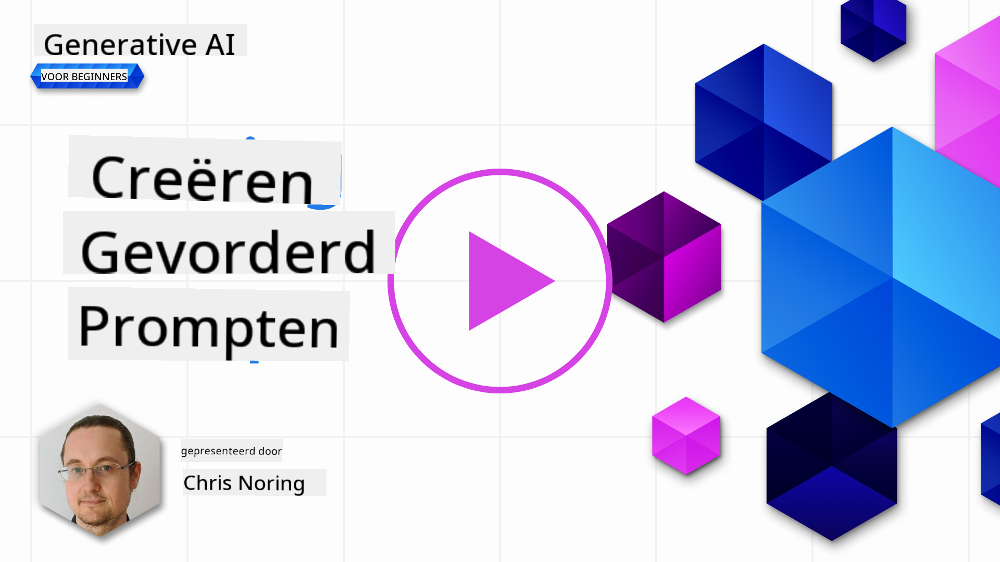

<!--
CO_OP_TRANSLATOR_METADATA:
{
  "original_hash": "b2651fb16bcfbc62b8e518751ed90fdb",
  "translation_date": "2025-10-17T19:50:13+00:00",
  "source_file": "05-advanced-prompts/README.md",
  "language_code": "nl"
}
-->
# Geavanceerde prompts maken

[](https://youtu.be/BAjzkaCdRok?si=NmUIyRf7-cDgbjtt)

Laten we enkele inzichten uit het vorige hoofdstuk herhalen:

> Prompt _engineering_ is het proces waarbij we **het model sturen naar relevantere antwoorden** door nuttigere instructies of context te bieden.

Er zijn ook twee stappen bij het schrijven van prompts: het construeren van de prompt door relevante context te bieden, en _optimalisatie_, hoe je de prompt geleidelijk kunt verbeteren.

Op dit punt hebben we een basisbegrip van hoe je prompts schrijft, maar we moeten dieper gaan. In dit hoofdstuk ga je van het uitproberen van verschillende prompts naar het begrijpen waarom de ene prompt beter is dan de andere. Je leert hoe je prompts kunt opstellen volgens enkele basistechnieken die op elk LLM kunnen worden toegepast.

## Introductie

In dit hoofdstuk behandelen we de volgende onderwerpen:

- Je kennis van prompt engineering uitbreiden door verschillende technieken toe te passen op je prompts.
- Je prompts configureren om de output te variëren.

## Leerdoelen

Na het voltooien van deze les kun je:

- Technieken voor prompt engineering toepassen die het resultaat van je prompts verbeteren.
- Prompts uitvoeren die gevarieerd of deterministisch zijn.

## Prompt engineering

Prompt engineering is het proces van het creëren van prompts die het gewenste resultaat opleveren. Er komt meer kijken bij prompt engineering dan alleen het schrijven van een tekstprompt. Prompt engineering is geen technische discipline, maar eerder een set technieken die je kunt toepassen om het gewenste resultaat te krijgen.

### Een voorbeeld van een prompt

Laten we een eenvoudige prompt nemen zoals deze:

> Genereer 10 vragen over geografie.

In deze prompt pas je eigenlijk een reeks verschillende prompttechnieken toe.

Laten we dit eens analyseren.

- **Context**, je specificeert dat het over "geografie" moet gaan.
- **Beperking van de output**, je wilt niet meer dan 10 vragen.

### Beperkingen van eenvoudige prompts

Je kunt wel of niet het gewenste resultaat krijgen. Je krijgt je vragen gegenereerd, maar geografie is een groot onderwerp en je krijgt mogelijk niet wat je wilt vanwege de volgende redenen:

- **Groot onderwerp**, je weet niet of het gaat over landen, hoofdsteden, rivieren, enzovoort.
- **Formaat**, wat als je wilt dat de vragen op een bepaalde manier worden geformatteerd?

Zoals je kunt zien, is er veel om rekening mee te houden bij het maken van prompts.

Tot nu toe hebben we een eenvoudig voorbeeld van een prompt gezien, maar generatieve AI is tot veel meer in staat om mensen in verschillende rollen en industrieën te helpen. Laten we enkele basistechnieken verkennen.

### Technieken voor prompting

Eerst moeten we begrijpen dat prompting een _emergent_ eigenschap is van een LLM, wat betekent dat dit geen functie is die in het model is ingebouwd, maar iets dat we ontdekken terwijl we het model gebruiken.

Er zijn enkele basistechnieken die we kunnen gebruiken om een LLM te prompten. Laten we ze verkennen.

- **Zero-shot prompting**, dit is de meest basale vorm van prompting. Het is een enkele prompt die een antwoord van de LLM vraagt op basis van alleen de trainingsgegevens.
- **Few-shot prompting**, dit type prompting begeleidt de LLM door 1 of meer voorbeelden te geven waarop het kan vertrouwen om zijn antwoord te genereren.
- **Chain-of-thought**, dit type prompting vertelt de LLM hoe een probleem in stappen kan worden opgesplitst.
- **Gegenereerde kennis**, om het antwoord van een prompt te verbeteren, kun je gegenereerde feiten of kennis toevoegen aan je prompt.
- **Least to most**, net als chain-of-thought, gaat deze techniek over het opsplitsen van een probleem in een reeks stappen en vervolgens vragen deze stappen in volgorde uit te voeren.
- **Self-refine**, deze techniek gaat over het bekritiseren van de output van de LLM en vervolgens vragen om verbetering.
- **Maieutische prompting**, hierbij wil je ervoor zorgen dat het antwoord van de LLM correct is en vraag je het om verschillende delen van het antwoord uit te leggen. Dit is een vorm van self-refine.

### Zero-shot prompting

Deze stijl van prompting is heel eenvoudig, het bestaat uit een enkele prompt. Deze techniek gebruik je waarschijnlijk als je begint te leren over LLM's. Hier is een voorbeeld:

- Prompt: "Wat is algebra?"
- Antwoord: "Algebra is een tak van de wiskunde die wiskundige symbolen en de regels voor het manipuleren van deze symbolen bestudeert."

### Few-shot prompting

Deze stijl van prompting helpt het model door een paar voorbeelden te geven samen met het verzoek. Het bestaat uit een enkele prompt met aanvullende taak-specifieke gegevens. Hier is een voorbeeld:

- Prompt: "Schrijf een gedicht in de stijl van Shakespeare. Hier zijn een paar voorbeelden van Shakespeareaanse sonnetten:
  Sonnet 18: 'Shall I compare thee to a summer's day? Thou art more lovely and more temperate...'
  Sonnet 116: 'Let me not to the marriage of true mind
Zoals je kunt zien, kunnen de resultaten niet meer uiteenlopend zijn.

> Let op, er zijn meer parameters die je kunt aanpassen om de output te variëren, zoals top-k, top-p, repetition penalty, length penalty en diversity penalty, maar deze vallen buiten de scope van deze cursus.

## Goede praktijken

Er zijn veel technieken die je kunt toepassen om te proberen het gewenste resultaat te krijgen. Naarmate je meer ervaring opdoet met het gebruik van prompts, zul je je eigen stijl ontwikkelen.

Naast de technieken die we hebben behandeld, zijn er enkele goede praktijken om te overwegen bij het werken met een LLM.

Hier zijn enkele goede praktijken om te overwegen:

- **Specificeer context**. Context is belangrijk; hoe meer je kunt specificeren, zoals domein, onderwerp, etc., hoe beter.
- Beperk de output. Als je een specifiek aantal items of een specifieke lengte wilt, geef dit dan aan.
- **Specificeer zowel wat als hoe**. Vergeet niet zowel te vermelden wat je wilt als hoe je het wilt, bijvoorbeeld: "Maak een Python Web API met routes voor producten en klanten, verdeel het in 3 bestanden".
- **Gebruik templates**. Vaak wil je je prompts verrijken met gegevens van je bedrijf. Gebruik templates om dit te doen. Templates kunnen variabelen bevatten die je vervangt door daadwerkelijke gegevens.
- **Spel correct**. LLMs kunnen je een correct antwoord geven, maar als je correct spelt, krijg je een beter antwoord.

## Opdracht

Hier is code in Python die laat zien hoe je een eenvoudige API kunt bouwen met Flask:

```python
from flask import Flask, request

app = Flask(__name__)

@app.route('/')
def hello():
    name = request.args.get('name', 'World')
    return f'Hello, {name}!'

if __name__ == '__main__':
    app.run()
```

Gebruik een AI-assistent zoals GitHub Copilot of ChatGPT en pas de "self-refine"-techniek toe om de code te verbeteren.

## Oplossing

Probeer de opdracht op te lossen door geschikte prompts toe te voegen aan de code.

> [!TIP]
> Formuleer een prompt om te vragen om verbetering; het is een goed idee om te beperken hoeveel verbeteringen je wilt. Je kunt ook vragen om het op een bepaalde manier te verbeteren, bijvoorbeeld qua architectuur, prestaties, beveiliging, etc.

[Oplossing](../../../05-advanced-prompts/python/aoai-solution.py)

## Kennischeck

Waarom zou ik chain-of-thought prompting gebruiken? Laat me 1 correct antwoord en 2 incorrecte antwoorden zien.

1. Om de LLM te leren hoe een probleem op te lossen.
1. B, Om de LLM te leren fouten in code te vinden.
1. C, Om de LLM te instrueren om met verschillende oplossingen te komen.

A: 1, omdat chain-of-thought gaat over het laten zien aan de LLM hoe een probleem op te lossen door het te voorzien van een reeks stappen, en vergelijkbare problemen en hoe deze zijn opgelost.

## 🚀 Uitdaging

Je hebt zojuist de self-refine techniek gebruikt in de opdracht. Neem een willekeurig programma dat je hebt gebouwd en bedenk welke verbeteringen je zou willen toepassen. Gebruik nu de self-refine techniek om de voorgestelde wijzigingen toe te passen. Wat vond je van het resultaat, beter of slechter?

## Goed gedaan! Ga door met leren

Na het voltooien van deze les, bekijk onze [Generative AI Learning collectie](https://aka.ms/genai-collection?WT.mc_id=academic-105485-koreyst) om je kennis over Generative AI verder uit te breiden!

Ga door naar Les 6, waar we onze kennis van Prompt Engineering gaan toepassen door [tekstgeneratie-apps te bouwen](../06-text-generation-apps/README.md?WT.mc_id=academic-105485-koreyst).

---

**Disclaimer**:  
Dit document is vertaald met behulp van de AI-vertalingsservice [Co-op Translator](https://github.com/Azure/co-op-translator). Hoewel we streven naar nauwkeurigheid, dient u zich ervan bewust te zijn dat geautomatiseerde vertalingen fouten of onnauwkeurigheden kunnen bevatten. Het originele document in de oorspronkelijke taal moet worden beschouwd als de gezaghebbende bron. Voor kritieke informatie wordt professionele menselijke vertaling aanbevolen. Wij zijn niet aansprakelijk voor eventuele misverstanden of verkeerde interpretaties die voortvloeien uit het gebruik van deze vertaling.