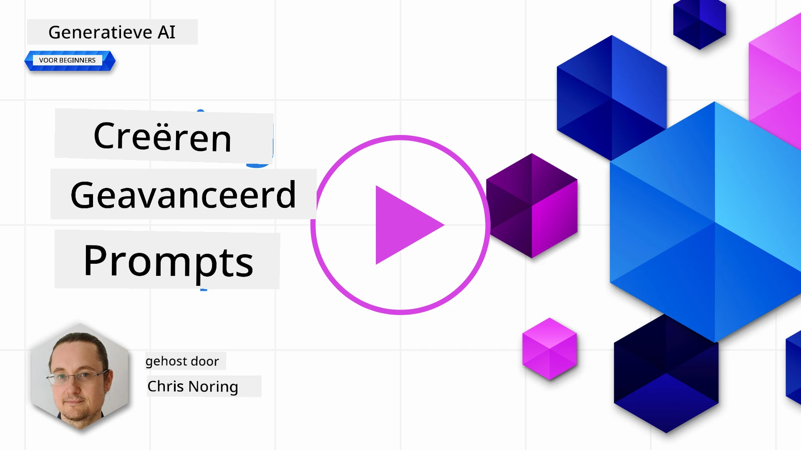

# Geavanceerde prompts maken

[](https://youtu.be/BAjzkaCdRok?si=NmUIyRf7-cDgbjtt)

Laten we enkele leerpunten uit het vorige hoofdstuk samenvatten:

> Prompt _engineering_ is het proces waarbij we het model **richten op relevantere reacties** door nuttigere instructies of context te geven.

Er zijn ook twee stappen voor het schrijven van prompts: het construeren van de prompt door relevante context te bieden, en _optimalisatie_, hoe je de prompt geleidelijk verbetert.

Op dit punt hebben we een basisbegrip van het schrijven van prompts, maar we moeten dieper gaan. In dit hoofdstuk ga je van het uitproberen van verschillende prompts naar het begrijpen waarom de ene prompt beter is dan de andere. Je leert hoe je prompts bouwt volgens enkele basistechnieken die op elke LLM toegepast kunnen worden.

## Inleiding

In dit hoofdstuk behandelen we de volgende onderwerpen:

- Breid je kennis van prompt engineering uit door verschillende technieken op je prompts toe te passen.
- Het configureren van je prompts om de output te variëren.

## Leerdoelen

Na het voltooien van deze les kun je:

- Prompt engineeringstechnieken toepassen die het resultaat van je prompts verbeteren.
- Prompting doen die ofwel gevarieerd of deterministisch is.

## Prompt engineering

Prompt engineering is het proces van het creëren van prompts die het gewenste resultaat opleveren. Er komt meer kijken bij prompt engineering dan alleen het schrijven van een tekstprompt. Prompt engineering is geen technische discipline, het is meer een verzameling technieken die je kunt toepassen om het gewenste resultaat te bereiken.

### Een voorbeeld van een prompt

Laten we een eenvoudige prompt nemen zoals deze:

> Genereer 10 vragen over aardrijkskunde.

In deze prompt pas je eigenlijk een set van verschillende prompttechnieken toe.

Laten we dit opsplitsen.

- **Context**, je specificeert dat het over "aardrijkskunde" moet gaan.
- **Beperking van output**, je wilt niet meer dan 10 vragen.

### Beperkingen van simpele prompting

Je krijgt misschien wel of niet het gewenste resultaat. Je krijgt wel vragen gegenereerd, maar aardrijkskunde is een breed onderwerp en je krijgt misschien niet wat je wilt door de volgende redenen:

- **Groot onderwerp**, je weet niet of het over landen, hoofdsteden, rivieren enzovoort gaat.
- **Formaat**, wat als je wilde dat de vragen op een bepaalde manier worden geformatteerd?

Zoals je ziet is er veel om rekening mee te houden bij het maken van prompts.

Tot nu toe hebben we een eenvoudig promptvoorbeeld gezien, maar generatieve AI kan veel meer om mensen in allerlei rollen en sectoren te helpen. Laten we nu enkele basistechnieken verkennen.

### Technieken voor prompting

Eerst moeten we begrijpen dat prompting een _emergente_ eigenschap is van een LLM, wat betekent dat dit geen functie is ingebouwd in het model maar iets wat we ontdekken naarmate we het model gebruiken.

Er zijn enkele basistechnieken die we kunnen gebruiken om een LLM te prompten. Laten we ze verkennen.

- **Zero-shot prompting**, dit is de meest basale vorm van prompting. Het is een enkele prompt die een reactie van de LLM vraagt puur gebaseerd op de trainingsdata.
- **Few-shot prompting**, deze prompting leidt de LLM door 1 of meer voorbeelden te geven waarop het de reactie kan baseren.
- **Chain-of-thought**, deze prompting vertelt de LLM hoe het een probleem in stappen moet opsplitsen.
- **Generated knowledge**, om de reactie op een prompt te verbeteren, kun je gegenereerde feiten of kennis aanvullend aan je prompt meegeven.
- **Least to most**, net als chain-of-thought gaat deze techniek over het opsplitsen van een probleem in een reeks stappen en vervolgens vragen om deze stappen op volgorde uit te voeren.
- **Self-refine**, deze techniek draait om het bekritiseren van de output van de LLM en het vervolgens vragen om te verbeteren.
- **Maieutic prompting**. Wat je hier wilt is zekerstellen dat het antwoord van de LLM correct is en je vraagt het diverse delen van het antwoord uit te leggen. Dit is een vorm van self-refine.

### Zero-shot prompting

Deze stijl van prompting is heel eenvoudig, het bestaat uit een enkele prompt. Deze techniek is waarschijnlijk wat je gebruikt als je begint met leren over LLM's. Hier is een voorbeeld:

- Prompt: "Wat is algebra?"
- Antwoord: "Algebra is een tak van de wiskunde die wiskundige symbolen bestudeert en de regels voor het manipuleren van deze symbolen."

### Few-shot prompting

Deze stijl van prompting helpt het model door een paar voorbeelden naast de vraag te geven. Het bestaat uit een enkele prompt met extra taakgerichte data. Hier is een voorbeeld:

- Prompt: "Schrijf een gedicht in de stijl van Shakespeare. Hier zijn een paar voorbeelden van Shakespeareaanse sonnetten.:
  Sonnet 18: 'Zal ik je vergelijken met een zomerdag? Jij bent lieflijker en gematigder...'
  Sonnet 116: 'Laat mij niet bij het huwelijk van ware geesten Belemmeringen toelaten. Liefde is geen liefde Die verandert wanneer zij verandering vindt...'
  Sonnet 132: 'Jouw ogen lief ik, en zij, medelijdend met mij, Wetend dat jouw hart mij kwelt met minachting,...'
  Schrijf nu een sonnet over de schoonheid van de maan."
- Antwoord: "Aan de hemel glanst de maan zachtjes, In zilveren licht dat zijn zachte gratie werpt,..."

Voorbeelden geven de LLM de context, het format of de stijl van de gewenste output. Ze helpen het model de specifieke taak te begrijpen en nauwkeurigere en relevantere reacties te genereren.

### Chain-of-thought

Chain-of-thought is een erg interessante techniek omdat het de LLM door een reeks stappen leidt. Het idee is om de LLM zo te instrueren dat het begrijpt hoe iets moet worden gedaan. Overweeg het volgende voorbeeld, met en zonder chain-of-thought:

    - Prompt: "Alice heeft 5 appels, gooit er 3 weg, geeft er 2 aan Bob en Bob geeft er één terug, hoeveel appels heeft Alice?"
    - Antwoord: 5

De LLM antwoordt 5, wat onjuist is. Het juiste antwoord is 1 appel, volgens de berekening (5 -3 -2 + 1 = 1).

Hoe kunnen we de LLM dit dan correct laten doen?

Laten we chain-of-thought proberen. Toepassen van chain-of-thought betekent:

1. Geef de LLM een soortgelijk voorbeeld.
1. Laat de berekening zien en hoe je deze correct uitvoert.
1. Geef de originele prompt.

Zo gaat het:

- Prompt: "Lisa heeft 7 appels, gooit er 1 weg, geeft er 4 aan Bart en Bart geeft er één terug:
  7 -1 = 6
  6 -4 = 2
  2 +1 = 3  
  Alice heeft 5 appels, gooit er 3 weg, geeft er 2 aan Bob en Bob geeft er één terug, hoeveel appels heeft Alice?"
  Antwoord: 1

Merk op hoe we substantieel langere prompts schrijven met een ander voorbeeld, een berekening en dan de originele prompt, en we komen op het juiste antwoord 1 uit.

Zoals je ziet is chain-of-thought een zeer krachtige techniek.

### Generated knowledge

Vaak wil je bij het maken van een prompt je eigen bedrijfsdata gebruiken. Je wilt dat een deel van de prompt van het bedrijf komt en het andere deel de daadwerkelijke prompt is waarin je geïnteresseerd bent.

Als voorbeeld kan je prompt er zo uitzien als je in de verzekeringsbranche zit:

```text
{{company}}: {{company_name}}
{{products}}:
{{products_list}}
Please suggest an insurance given the following budget and requirements:
Budget: {{budget}}
Requirements: {{requirements}}
```

Boven zie je hoe de prompt is opgebouwd met een template. In de template staat een aantal variabelen, aangeduid met `{{variable}}`, die vervangen worden door daadwerkelijke waarden uit een bedrijfs-API.

Hier is een voorbeeld van hoe de prompt eruit zou kunnen zien zodra de variabelen zijn vervangen door inhoud uit jouw bedrijf:

```text
Insurance company: ACME Insurance
Insurance products (cost per month):
- Car, cheap, 500 USD
- Car, expensive, 1100 USD
- Home, cheap, 600 USD
- Home, expensive, 1200 USD
- Life, cheap, 100 USD

Please suggest an insurance given the following budget and requirements:
Budget: $1000
Requirements: Car, Home, and Life insurance
```

Als je deze prompt door een LLM haalt, levert dat een reactie op zoals deze:

```output
Given the budget and requirements, we suggest the following insurance package from ACME Insurance:
- Car, cheap, 500 USD
- Home, cheap, 600 USD
- Life, cheap, 100 USD
Total cost: $1,200 USD
```

Zoals je ziet suggereert het ook Levensverzekering, wat het niet zou moeten doen. Dit resultaat geeft aan dat we de prompt moeten optimaliseren door de prompt duidelijker te maken over wat toegestaan is. Na wat _proberen en fouten_ komen we op de volgende prompt uit:

```text
Insurance company: ACME Insurance
Insurance products (cost per month):
- type: Car, cheap, cost: 500 USD
- type: Car, expensive, cost: 1100 USD
- type: Home, cheap, cost: 600 USD
- type: Home, expensive, cost: 1200 USD
- type: Life, cheap, cost: 100 USD

Please suggest an insurance given the following budget and requirements:
Budget: $1000 restrict choice to types: Car, Home
```

Let op hoe het toevoegen van _type_ en _kosten_ en ook het gebruik van het sleutelwoord _restrict_ helpt de LLM te begrijpen wat we willen.

Nu krijgen we de volgende reactie:

```output
Given the budget and requirements, we suggest the Car, Cheap insurance product which costs 500 USD per month.
```

Het punt van dit voorbeeld was aan te tonen dat zelfs als we een basistechniek zoals _generated knowledge_ gebruiken, we in de meeste gevallen de prompt moeten optimaliseren om het gewenste resultaat te krijgen.

### Least-to-most

Het idee bij Least-to-most prompting is om een groter probleem op te splitsen in subproblemen. Zo help je de LLM om het grotere probleem "te overwinnen". Een goed voorbeeld kan zijn voor datawetenschap waarbij je de LLM kunt vragen om een probleem als volgt op te splitsen:

> Prompt: Hoe voer je datawetenschap uit in 5 stappen?

Met je AI-assistent die antwoordt met:

1. Gegevens verzamelen
1. Gegevens schoonmaken
1. Gegevens analyseren
1. Gegevens visualiseren
1. Gegevens presenteren

### Self-refine, bekritiseer de resultaten

Met generatieve AI's en LLM's kun je de output niet blind vertrouwen. Je moet deze verifiëren. De LLM presenteert immers alleen wat het volgende meest waarschijnlijke is om te zeggen, niet wat correct is. Daarom is het een goed idee om de LLM zichzelf te laten bekritiseren, wat ons brengt bij de self-refine techniek.

Hoe het werkt is dat je de volgende stappen volgt:

1. Initiele prompt die de LLM vraagt een probleem op te lossen
1. LLM antwoordt
1. Jij bekritiseert het antwoord en vraagt de AI om te verbeteren
1. LLM antwoordt opnieuw, ditmaal rekening houdend met de kritiek en suggereert oplossingen die het heeft bedacht

Je kunt dit proces zo vaak herhalen als je wilt.

Hier is een voorbeeld dat deze techniek gebruikt:

> Prompt: "Maak een Python Web API met routes products en customers"

AI Antwoord:

```python
import flask
app = Flask(__name__)

@app.route('/products')
def products():
    return 'Products'

@app.route('/customers')
def customers():
    return 'Customers'
```

> Prompt: stel 3 verbeteringen voor van bovenstaande code

AI Antwoord:

```text
Sure, here are three suggestions to improve the code:

Import the correct module: The first line should import Flask instead of flask. The correct import statement should be from flask import Flask.

Add a main function: Add a if __name__ == '__main__': block to the end of the file to run the application when the file is executed.

Use f-strings: Use f-strings to format the return statements in the route functions. For example, return 'Products' can be changed to return f'This is the {request.path} page'.
```

```python
from flask import Flask, request

app = Flask(__name__)

@app.route('/products')
def products():
    return f'This is the {request.path} page'

@app.route('/customers')
def customers():
    return f'This is the {request.path} page'

if __name__ == '__main__':
    app.run()
```

Zoals je ziet verbetert het bovenstaande AI-antwoord de eerste voorgestelde code dankzij het bekritiseren van het eerste antwoord.

### Maieutic prompting

Maieutic prompting is een techniek die lijkt op self-refine maar vooral gaat over het vragen aan de LLM om zichzelf uit te leggen. Het doel is inconsistenties in de output van de LLM te verminderen, om zo het juiste antwoord te verzekeren. De workflow om te volgen is:

1. Vraag de LLM een vraag te beantwoorden
1. Vraag voor elk deel van het antwoord aan de LLM dit dieper uit te leggen.
1. Als er inconsistenties zijn, verwerp de onderdelen die inconsistent zijn.

Herhaal stap 2 en 3 totdat je alle delen hebt doorgenomen en tevreden bent met het antwoord.

Hier is een voorbeeldprompt:

> prompt: Hoe kan ik een crisisplan maken om een pandemie in 5 stappen te mitigeren?
> LLM antwoord:

```text
1. Identify the risks
1. Identify the stakeholders
1. Identify the resources
1. Identify the actions
1. Identify the communication channels
```

Er zijn 5 stappen geïdentificeerd, maar kunnen we bepalen of dit correct is? Laten we de LLM elk stap laten uitleggen:

> prompt: Leg de eerste stap in meer detail uit, wat zijn de risico's in detail bij een pandemie?

```text
The risks are the following:

- Loss of life
- Loss of business
- Loss of reputation
- Loss of customers
- Loss of employees
```

Op dit punt willen we zeker zijn dat de LLM correct is, dus vragen we het om het eerste risico meer gedetailleerd uit te leggen en hopen dat het consistent is met het bovenstaande antwoord:

> prompt: Wat is het grootste risico in een pandemie en waarom?

```text
The biggest risk is loss of life because it's the most important thing to protect.
```

> Wat zijn de twee grootste risico's in een pandemie?

```text
The two biggest risks are loss of life and loss of business.
```

Op dit punt is de LLM consistent en noemt "leven" en "bedrijf" als de twee grootste risico's. We kunnen nu doorgaan naar de volgende stap en redelijk vertrouwen hebben. Toch mogen we de LLM niet blindelings vertrouwen, we moeten altijd de output verifiëren.

## Varieer je output

LLM's zijn van nature niet deterministisch, wat betekent dat je verschillende resultaten krijgt elke keer dat je dezelfde prompt uitvoert. Probeer bijvoorbeeld de volgende prompt eens:

> "Genereer code voor een Python Web API"

```python
# Importeer benodigde modules
import flask
from flask import request, jsonify

# Maak een Flask-app aan
app = flask.Flask(__name__)

# Maak een route voor de API
@app.route('/api', methods=['GET'])
def api():
    # Haal de gegevens uit het verzoek
    data = request.args

    # Verwerk de gegevens
    result = process_data(data)

    # Geef het resultaat terug als JSON
    return jsonify(result)

# Functie om de gegevens te verwerken
def process_data(data):
    # Doe iets met de gegevens
    result = data + 1

    # Geef het resultaat terug
    return result

# Start de app
if __name__ == '__main__':
    app.run()

```

Door dezelfde prompt opnieuw uit te voeren krijg je een iets andere reactie:

```python
#importeer benodigde pakketten
import flask
from flask import request, jsonify

#maak de Flask-applicatie aan
app = flask.Flask(__name__)
app.config["DEBUG"] = True

#maak een lijst van boeken
books = [
    {'id': 0,
     'title': 'A Fire Upon the Deep',
     'author': 'Vernor Vinge',
     'first_sentence': 'The coldsleep itself was dreamless.',
     'year_published': '1992'},
    {'id': 1,
     'title': 'The Ones Who Walk Away From Omelas',
     'author': 'Ursula K. Le Guin',
     'first_sentence': 'With a clamor of bells that set the swallows soaring, the Festival of Summer came to the city Omelas, bright-towered by the sea.',
     'published': '1973'},
    {'id': 2,
     'title': 'Dhalgren',
     'author': 'Samuel R. Delany',
     'first_sentence': 'to wound the autumnal city.',
     'published': '1975'}
]

#maak een endpoint voor de API
@app.route('/', methods=['GET'])
def home():
    return '''<h1>Books API</h1>
<p>A prototype API for retrieving books.</p>'''

#maak een endpoint om alle boeken te retourneren
@app.route('/api/v1/resources/books/all', methods=['GET'])
def api_all():
    return jsonify(books)

#maak een endpoint om één enkel boek te retourneren
@app.route('/api/v1/resources/books', methods=['GET'])
def api_id():
    #controleer of een ID is opgegeven als onderdeel van de URL
    #als een ID is opgegeven, ken deze toe aan een variabele
    #als er geen ID is opgegeven, geef een foutmelding weer
    if 'id' in request.args:
        id = int(request.args['id'])
    else:
        return "Error: No id field provided. Please specify an id."

    #maak een lege lijst voor onze resultaten
    results = []

    #loop door de data en zoek resultaten die passen bij de gevraagde ID
    #ID's zijn uniek, maar andere velden kunnen meerdere resultaten teruggeven
    for book in books:
        if book['id'] == id:
            results.append(book)

    #gebruik de jsonify-functie van Flask om onze lijst van
    #Python-dictionaries om te zetten naar het JSON-formaat
    return jsonify(results)

app.run()
```

> Is de gevarieerde output dan een probleem?

Dat hangt af van wat je wilt doen. Als je een specifiek antwoord wilt is het een probleem. Als je oké bent met gevarieerde output zoals "Genereer willekeurige 3 vragen over aardrijkskunde", dan is het geen probleem.

### Gebruik temperatuur om je output te variëren

Oké, we hebben besloten dat we de output willen beperken tot meer voorspelbaar, dat wil zeggen deterministischer. Hoe doen we dat?

Temperatuur is een waarde tussen 0 en 1, waarbij 0 het meest deterministisch is en 1 het meest gevarieerd. De standaardwaarde is 0.7. Laten we kijken wat er gebeurt met twee runs van dezelfde prompt met de temperatuur ingesteld op 0.1:

> "Genereer code voor een Python Web API"

```python
#importeer benodigde bibliotheken
import flask
from flask import request, jsonify

#maak een instantie van de Flask-klasse
app = flask.Flask(__name__)

#maak een endpoint voor de API
@app.route('/api/v1/endpoint', methods=['GET'])
def api_endpoint():
    #haal de requestgegevens op
    data = request.get_json()

    #verwerk de gegevens
    result = process_data(data)

    #geef het resultaat terug
    return jsonify(result)

#functie om de gegevens te verwerken
def process_data(data):
    #verwerk de gegevens
    result = {'result': 'success'}

    #geef het resultaat terug
    return result

#start de Flask-app
if __name__ == '__main__':
    app.run()

```

Door de prompt opnieuw uit te voeren krijgen we dit resultaat:

```python
#importeer benodigde bibliotheken
import flask
from flask import request, jsonify

#maak een Flask-app
app = flask.Flask(__name__)

#maak een route voor de API
@app.route('/api', methods=['GET'])
def api_call():
    #haal de gegevens uit het verzoek
    data = request.get_json()

    #verwerk de gegevens
    result = process_data(data)

    #retourneer het resultaat
    return jsonify(result)

#definieer de functie process_data
def process_data(data):
    #doe iets met de gegevens
    result = data + 1

    #retourneer het resultaat
    return result

#start de app
if __name__ == '__main__':
    app.run()

```

Er is maar een klein verschil tussen deze twee outputs. Laten we nu het tegenovergestelde doen, we zetten de temperatuur op 0.9:

```python
# Importeer noodzakelijke bibliotheken
import flask
from flask import request, jsonify

# Maak een Flask-app aan
app = flask.Flask(__name__)

# Maak een route voor de API
@app.route('/api', methods=['GET'])
def api_call():
    # Haal de gegevens op uit het verzoek
    data = request.args

    # Verwerk de gegevens
    result = process_data(data)

    # Geef het resultaat terug
    return jsonify(result)

# Functie om de gegevens te verwerken
def process_data(data):
    # Doe iets met de gegevens
    result = data + 1

    # Geef het resultaat terug
    return result

# Start de app
if __name__ == '__main__':
    app.run()

```

en de tweede poging met 0.9 als temperatuurwaarde:

```python
import flask
from flask import request, jsonify

# maak de Flask-app aan
app = flask.Flask(__name__)
app.config['DEBUG'] = True

# maak wat testgegevens aan
books = [
    {'id': 0, 'title': 'A Fire Upon The Deep', 'author': 'Vernor Vinge', 'first_sentence': 'The coldsleep itself was dreamless.', 'year_published': '1992'},
    {'id': 1, 'title': 'The Ones Who Walk Away From Omelas', 'author': 'Ursula K. Le Guin', 'first_sentence': 'With a clamor of bells that set the swallows soaring, the Festival of Summer came to the city Omelas, bright-towered by the sea.', 'published': '1973'},
    {'id': 2, 'title': 'Dhalgren', 'author': 'Samuel R. Delany', 'first_sentence': 'to wound the autumnal city.', 'published': '1975'}
]

# maak een endpoint aan
@app.route('/', methods=['GET'])
def home():
    return '''<h1>Welcome to our book API!</h1>'''

@app.route('/api/v1/resources/books

```

Zoals je ziet kunnen de resultaten niet meer variëren.


> Let op dat er meer parameters zijn die je kunt aanpassen om de output te variëren, zoals top-k, top-p, repetitietoeslag, lengtetoeslag en diversiteitstoeslag, maar deze vallen buiten de reikwijdte van dit curriculum.

## Goede praktijken

Er zijn veel praktijken die je kunt toepassen om te proberen te krijgen wat je wilt. Je zult je eigen stijl vinden naarmate je meer en meer gebruik maakt van prompting.

Naast de technieken die we hebben behandeld, zijn er enkele goede praktijken om rekening mee te houden bij het prompten van een LLM.

Hier zijn enkele goede praktijken om te overwegen:

- **Specificeer de context**. Context is belangrijk, hoe meer je kunt specificeren zoals domein, onderwerp, enzovoort, hoe beter.
- Beperk de output. Als je een specifiek aantal items of een specifieke lengte wilt, geef dat aan.
- **Specificeer zowel wat als hoe**. Vergeet niet zowel te vermelden wat je wilt als hoe je het wilt, bijvoorbeeld "Maak een Python Web API met routes producten en klanten, verdeel het in 3 bestanden".
- **Gebruik sjablonen**. Vaak wil je je prompts verrijken met gegevens van je bedrijf. Gebruik sjablonen om dit te doen. Sjablonen kunnen variabelen bevatten die je vervangt door echte gegevens.
- **Spelling correct**. LLM's kunnen je een correct antwoord geven, maar als je correct spelt, krijg je een beter antwoord.

## Opdracht

Hier is code in Python die laat zien hoe je een eenvoudige API bouwt met Flask:

```python
from flask import Flask, request

app = Flask(__name__)

@app.route('/')
def hello():
    name = request.args.get('name', 'World')
    return f'Hello, {name}!'

if __name__ == '__main__':
    app.run()
```

Gebruik een AI-assistent zoals GitHub Copilot of ChatGPT en pas de "zelf verbeteren"-techniek toe om de code te verbeteren.

## Oplossing

Probeer de opdracht op te lossen door geschikte prompts aan de code toe te voegen.

> [!TIP]
> Formuleer een prompt om verbetering te vragen, het is een goed idee om te beperken hoeveel verbeteringen. Je kunt ook vragen om het op een bepaalde manier te verbeteren, bijvoorbeeld architectuur, prestaties, beveiliging, enzovoort.

[Oplossing](../../../05-advanced-prompts/python/aoai-solution.py)

## Kennischeck

Waarom zou ik chain-of-thought prompting gebruiken? Laat mij 1 correct antwoord en 2 onjuiste antwoorden zien.

1. Om de LLM te leren hoe een probleem op te lossen.
1. B, Om de LLM te leren fouten in code te vinden.
1. C, Om de LLM te instrueren verschillende oplossingen te bedenken.

A: 1, omdat chain-of-thought gaat over het laten zien aan de LLM hoe een probleem op te lossen door het te voorzien van een reeks stappen, soortgelijke problemen en hoe die zijn opgelost.

## 🚀 Uitdaging

Je hebt zojuist de zelf verbeteren-techniek gebruikt in de opdracht. Neem een programma dat je hebt gebouwd en bedenk welke verbeteringen je eraan zou willen toepassen. Gebruik nu de zelf verbeteren-techniek om de voorgestelde wijzigingen toe te passen. Wat vond je van het resultaat, beter of slechter?

## Goed gedaan! Ga door met leren

Na het voltooien van deze les, bekijk onze [Collectie Generatieve AI Leren](https://aka.ms/genai-collection?WT.mc_id=academic-105485-koreyst) om je kennis over Generatieve AI verder te verdiepen!

Ga naar Les 6 waar we onze kennis van Prompt Engineering toepassen door [tekstgeneratie-apps te bouwen](../06-text-generation-apps/README.md?WT.mc_id=academic-105485-koreyst)

---

<!-- CO-OP TRANSLATOR DISCLAIMER START -->
**Disclaimer**:
Dit document is vertaald met behulp van de AI vertaaldienst [Co-op Translator](https://github.com/Azure/co-op-translator). Hoewel we streven naar nauwkeurigheid, dient u er rekening mee te houden dat geautomatiseerde vertalingen fouten of onnauwkeurigheden kunnen bevatten. Het originele document in de oorspronkelijke taal moet worden beschouwd als de gezaghebbende bron. Voor kritieke informatie wordt professionele menselijke vertaling aanbevolen. Wij zijn niet aansprakelijk voor eventuele misverstanden of verkeerde interpretaties die voortvloeien uit het gebruik van deze vertaling.
<!-- CO-OP TRANSLATOR DISCLAIMER END -->