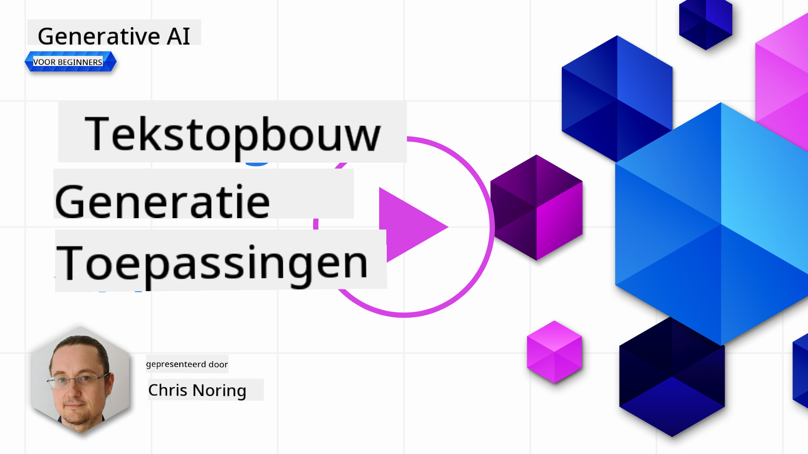

<!--
CO_OP_TRANSLATOR_METADATA:
{
  "original_hash": "5ec6c92b629564538ef397c550adb73e",
  "translation_date": "2025-05-19T17:04:37+00:00",
  "source_file": "06-text-generation-apps/README.md",
  "language_code": "nl"
}
-->
# Toepassingen voor tekstgeneratie bouwen

[](https://aka.ms/gen-ai-lesson6-gh?WT.mc_id=academic-105485-koreyst)

> _(Klik op de afbeelding hierboven om de video van deze les te bekijken)_

Tot nu toe heb je in deze cursus gezien dat er kernconcepten zijn zoals prompts en zelfs een hele discipline genaamd "prompt engineering". Veel tools waarmee je kunt werken, zoals ChatGPT, Office 365, Microsoft Power Platform en meer, ondersteunen je bij het gebruik van prompts om iets te bereiken.

Om zo'n ervaring aan een app toe te voegen, moet je concepten zoals prompts, completions begrijpen en een bibliotheek kiezen om mee te werken. Dat is precies wat je in dit hoofdstuk zult leren.

## Inleiding

In dit hoofdstuk zul je:

- Leren over de openai-bibliotheek en de kernconcepten ervan.
- Een tekstgeneratie-app bouwen met openai.
- Begrijpen hoe je concepten zoals prompt, temperatuur en tokens kunt gebruiken om een tekstgeneratie-app te bouwen.

## Leerdoelen

Aan het einde van deze les kun je:

- Uitleggen wat een tekstgeneratie-app is.
- Een tekstgeneratie-app bouwen met openai.
- Je app configureren om meer of minder tokens te gebruiken en ook de temperatuur aan te passen voor een gevarieerde output.

## Wat is een tekstgeneratie-app?

Normaal gesproken, wanneer je een app bouwt, heeft deze een soort interface zoals de volgende:

- Op commando's gebaseerd. Console-apps zijn typische apps waar je een commando typt en het voert een taak uit. Bijvoorbeeld, `git` is een op commando's gebaseerde app.
- Gebruikersinterface (UI). Sommige apps hebben grafische gebruikersinterfaces (GUI's) waar je knoppen klikt, tekst invoert, opties selecteert en meer.

### Console- en UI-apps zijn beperkt

Vergelijk het met een op commando's gebaseerde app waar je een commando typt:

- **Het is beperkt**. Je kunt niet zomaar elk commando typen, alleen degene die de app ondersteunt.
- **Taal specifiek**. Sommige apps ondersteunen veel talen, maar standaard is de app gebouwd voor een specifieke taal, zelfs als je meer taalondersteuning kunt toevoegen.

### Voordelen van tekstgeneratie-apps

Hoe verschilt een tekstgeneratie-app dan?

In een tekstgeneratie-app heb je meer flexibiliteit, je bent niet beperkt tot een reeks commando's of een specifieke invoertaal. In plaats daarvan kun je natuurlijke taal gebruiken om met de app te communiceren. Een ander voordeel is dat je al communiceert met een gegevensbron die is getraind op een enorme hoeveelheid informatie, terwijl een traditionele app mogelijk beperkt is tot wat er in een database staat.

### Wat kan ik bouwen met een tekstgeneratie-app?

Er zijn veel dingen die je kunt bouwen. Bijvoorbeeld:

- **Een chatbot**. Een chatbot die vragen beantwoordt over onderwerpen, zoals je bedrijf en zijn producten, kan een goede match zijn.
- **Helper**. LLM's zijn geweldig in dingen zoals het samenvatten van tekst, het verkrijgen van inzichten uit tekst, het produceren van tekst zoals cv's en meer.
- **Code-assistent**. Afhankelijk van het taalmodel dat je gebruikt, kun je een code-assistent bouwen die je helpt code te schrijven. Je kunt bijvoorbeeld een product zoals GitHub Copilot gebruiken, evenals ChatGPT om je te helpen code te schrijven.

## Hoe kan ik beginnen?

Nou, je moet een manier vinden om te integreren met een LLM, wat meestal de volgende twee benaderingen inhoudt:

- Gebruik een API. Hier construeer je webverzoeken met je prompt en krijg je gegenereerde tekst terug.
- Gebruik een bibliotheek. Bibliotheken helpen de API-aanroepen te kapselen en maken ze gemakkelijker te gebruiken.

## Bibliotheken/SDK's

Er zijn een paar bekende bibliotheken voor het werken met LLM's zoals:

- **openai**, deze bibliotheek maakt het gemakkelijk om verbinding te maken met je model en prompts in te sturen.

Dan zijn er bibliotheken die op een hoger niveau opereren zoals:

- **Langchain**. Langchain is goed bekend en ondersteunt Python.
- **Semantic Kernel**. Semantic Kernel is een bibliotheek van Microsoft die de talen C#, Python en Java ondersteunt.

## Eerste app met openai

Laten we eens kijken hoe we onze eerste app kunnen bouwen, welke bibliotheken we nodig hebben, hoeveel er nodig is, enzovoort.

### Installeer openai

Er zijn veel bibliotheken beschikbaar voor interactie met OpenAI of Azure OpenAI. Het is mogelijk om verschillende programmeertalen te gebruiken, zoals C#, Python, JavaScript, Java en meer. We hebben ervoor gekozen om de `openai` Python-bibliotheek te gebruiken, dus we zullen `pip` gebruiken om deze te installeren.

```bash
pip install openai
```

### Maak een resource aan

Je moet de volgende stappen uitvoeren:

- Maak een account aan op Azure [https://azure.microsoft.com/free/](https://azure.microsoft.com/free/?WT.mc_id=academic-105485-koreyst).
- Verkrijg toegang tot Azure OpenAI. Ga naar [https://learn.microsoft.com/azure/ai-services/openai/overview#how-do-i-get-access-to-azure-openai](https://learn.microsoft.com/azure/ai-services/openai/overview#how-do-i-get-access-to-azure-openai?WT.mc_id=academic-105485-koreyst) en vraag toegang aan.

  > [!NOTE]
  > Op het moment van schrijven moet je een aanvraag indienen voor toegang tot Azure OpenAI.

- Installeer Python <https://www.python.org/>
- Heb een Azure OpenAI Service-resource aangemaakt. Zie deze handleiding voor hoe je [een resource aanmaakt](https://learn.microsoft.com/azure/ai-services/openai/how-to/create-resource?pivots=web-portal?WT.mc_id=academic-105485-koreyst).

### Zoek de API-sleutel en eindpunt

Op dit punt moet je je `openai` bibliotheek vertellen welke API-sleutel je moet gebruiken. Om je API-sleutel te vinden, ga je naar de sectie "Sleutels en Eindpunt" van je Azure OpenAI-resource en kopieer je de waarde van "Sleutel 1".


Nu je deze informatie hebt gekopieerd, laten we de bibliotheken instrueren om het te gebruiken.

> [!NOTE]
> Het is de moeite waard om je API-sleutel te scheiden van je code. Je kunt dit doen door gebruik te maken van omgevingsvariabelen.
>
> - Stel de omgevingsvariabele `OPENAI_API_KEY` to your API key.
>   `export OPENAI_API_KEY='sk-...'` in.

### Configuratie instellen Azure

Als je Azure OpenAI gebruikt, is hier hoe je de configuratie instelt:

```python
openai.api_type = 'azure'
openai.api_key = os.environ["OPENAI_API_KEY"]
openai.api_version = '2023-05-15'
openai.api_base = os.getenv("API_BASE")
```

Hierboven stellen we het volgende in:

- `api_type` to `azure`. This tells the library to use Azure OpenAI and not OpenAI.
- `api_key`, this is your API key found in the Azure Portal.
- `api_version`, this is the version of the API you want to use. At the time of writing, the latest version is `2023-05-15`.
- `api_base`, this is the endpoint of the API. You can find it in the Azure Portal next to your API key.

> [!NOTE] > `os.getenv` is a function that reads environment variables. You can use it to read environment variables like `OPENAI_API_KEY` and `API_BASE`. Set these environment variables in your terminal or by using a library like `dotenv`.

## Generate text

The way to generate text is to use the `Completion` klasse. Hier is een voorbeeld:

```python
prompt = "Complete the following: Once upon a time there was a"

completion = openai.Completion.create(model="davinci-002", prompt=prompt)
print(completion.choices[0].text)
```

In de bovenstaande code maken we een completion-object en geven we het model en de prompt door die we willen gebruiken. Vervolgens printen we de gegenereerde tekst.

### Chat-completions

Tot nu toe heb je gezien hoe we `Completion` to generate text. But there's another class called `ChatCompletion` hebben gebruikt die meer geschikt is voor chatbots. Hier is een voorbeeld van het gebruik ervan:

```python
import openai

openai.api_key = "sk-..."

completion = openai.ChatCompletion.create(model="gpt-3.5-turbo", messages=[{"role": "user", "content": "Hello world"}])
print(completion.choices[0].message.content)
```

Meer over deze functionaliteit in een aankomend hoofdstuk.

## Oefening - je eerste tekstgeneratie-app

Nu we hebben geleerd hoe we openai kunnen instellen en configureren, is het tijd om je eerste tekstgeneratie-app te bouwen. Volg deze stappen om je app te bouwen:

1. Maak een virtuele omgeving en installeer openai:

   ```bash
   python -m venv venv
   source venv/bin/activate
   pip install openai
   ```

   > [!NOTE]
   > Als je Windows gebruikt, typ `venv\Scripts\activate` instead of `source venv/bin/activate`.

   > [!NOTE]
   > Locate your Azure OpenAI key by going to [https://portal.azure.com/](https://portal.azure.com/?WT.mc_id=academic-105485-koreyst) and search for `Open AI` and select the `Open AI resource` and then select `Keys and Endpoint` and copy the `Key 1` waarde.

1. Maak een _app.py_ bestand en geef het de volgende code:

   ```python
   import openai

   openai.api_key = "<replace this value with your open ai key or Azure OpenAI key>"

   openai.api_type = 'azure'
   openai.api_version = '2023-05-15'
   openai.api_base = "<endpoint found in Azure Portal where your API key is>"
   deployment_name = "<deployment name>"

   # add your completion code
   prompt = "Complete the following: Once upon a time there was a"
   messages = [{"role": "user", "content": prompt}]

   # make completion
   completion = openai.chat.completions.create(model=deployment_name, messages=messages)

   # print response
   print(completion.choices[0].message.content)
   ```

   > [!NOTE]
   > Als je Azure OpenAI gebruikt, moet je `api_type` to `azure` and set the `api_key` instellen op je Azure OpenAI-sleutel.

   Je zou een output moeten zien zoals de volgende:

   ```output
    very unhappy _____.

   Once upon a time there was a very unhappy mermaid.
   ```

## Verschillende soorten prompts, voor verschillende dingen

Nu heb je gezien hoe je tekst kunt genereren met behulp van een prompt. Je hebt zelfs een programma dat je kunt aanpassen en wijzigen om verschillende soorten tekst te genereren.

Prompts kunnen voor allerlei taken worden gebruikt. Bijvoorbeeld:

- **Genereer een soort tekst**. Bijvoorbeeld, je kunt een gedicht genereren, vragen voor een quiz, enz.
- **Informatie opzoeken**. Je kunt prompts gebruiken om informatie op te zoeken, zoals in het volgende voorbeeld 'Wat betekent CORS in webontwikkeling?'.
- **Genereer code**. Je kunt prompts gebruiken om code te genereren, bijvoorbeeld een reguliere expressie ontwikkelen die wordt gebruikt om e-mails te valideren of waarom niet een heel programma genereren, zoals een webapp?

## Een praktischere use case: een receptgenerator

Stel je voor dat je ingrediënten thuis hebt en je wilt iets koken. Daarvoor heb je een recept nodig. Een manier om recepten te vinden is door een zoekmachine te gebruiken of je kunt een LLM gebruiken om dit te doen.

Je zou een prompt kunnen schrijven zoals:

> "Toon me 5 recepten voor een gerecht met de volgende ingrediënten: kip, aardappelen en wortelen. Per recept, lijst alle gebruikte ingrediënten op"

Gezien de bovenstaande prompt, zou je een reactie kunnen krijgen zoals:

```output
1. Roasted Chicken and Vegetables:
Ingredients:
- 4 chicken thighs
- 2 potatoes, cut into cubes
- 2 carrots, cut into cubes
- 2 tablespoons olive oil
- 2 cloves garlic, minced
- 1 teaspoon dried thyme
- 1 teaspoon dried oregano
- Salt and pepper, to taste

2. Chicken and Potato Stew:
Ingredients:
- 2 tablespoons olive oil
- 1 onion, diced
- 2 cloves garlic, minced
- 2 chicken breasts, cut into cubes
- 2 potatoes, cut into cubes
- 2 carrots, cut into cubes
- 1 teaspoon dried oregano
- 1 teaspoon dried thyme
- 1 cup chicken broth
- Salt and pepper, to taste

3. Chicken and Potato Bake:
Ingredients:
- 2 tablespoons olive oil
- 2 chicken breasts, cut into cubes
- 2 potatoes, cut into cubes
- 2 carrots, cut into cubes
- 1 onion, diced
- 2 cloves garlic, minced
- 1 teaspoon dried oregano
- 1 teaspoon dried thyme
- 1 cup chicken broth
- Salt and pepper, to taste

4. Chicken and Potato Soup:
Ingredients:
- 2 tablespoons olive oil
- 1 onion, diced
- 2 cloves garlic, minced
- 2 chicken breasts, cut into cubes
- 2 potatoes, cut into cubes
- 2 carrots, cut into cubes
- 1 teaspoon dried oregano
- 1 teaspoon dried thyme
- 4 cups chicken broth
- Salt and pepper, to taste

5. Chicken and Potato Hash:
Ingredients:
- 2 tablespoons olive oil
- 2 chicken breasts, cut into cubes
- 2 potatoes, cut into cubes
- 2 carrots, cut into cubes
- 1 onion, diced
- 2 cloves garlic, minced
- 1 teaspoon dried oregano
```

Dit resultaat is geweldig, ik weet wat ik moet koken. Op dit punt zouden nuttige verbeteringen kunnen zijn:

- Ingrediënten filteren die ik niet lekker vind of waar ik allergisch voor ben.
- Een boodschappenlijstje maken, voor het geval ik niet alle ingrediënten thuis heb.

Voor de bovenstaande gevallen, laten we een extra prompt toevoegen:

> "Verwijder alsjeblieft recepten met knoflook omdat ik allergisch ben en vervang het door iets anders. Maak ook een boodschappenlijstje voor de recepten, rekening houdend met het feit dat ik al kip, aardappelen en wortelen thuis heb."

Nu heb je een nieuw resultaat, namelijk:

```output
1. Roasted Chicken and Vegetables:
Ingredients:
- 4 chicken thighs
- 2 potatoes, cut into cubes
- 2 carrots, cut into cubes
- 2 tablespoons olive oil
- 1 teaspoon dried thyme
- 1 teaspoon dried oregano
- Salt and pepper, to taste

2. Chicken and Potato Stew:
Ingredients:
- 2 tablespoons olive oil
- 1 onion, diced
- 2 chicken breasts, cut into cubes
- 2 potatoes, cut into cubes
- 2 carrots, cut into cubes
- 1 teaspoon dried oregano
- 1 teaspoon dried thyme
- 1 cup chicken broth
- Salt and pepper, to taste

3. Chicken and Potato Bake:
Ingredients:
- 2 tablespoons olive oil
- 2 chicken breasts, cut into cubes
- 2 potatoes, cut into cubes
- 2 carrots, cut into cubes
- 1 onion, diced
- 1 teaspoon dried oregano
- 1 teaspoon dried thyme
- 1 cup chicken broth
- Salt and pepper, to taste

4. Chicken and Potato Soup:
Ingredients:
- 2 tablespoons olive oil
- 1 onion, diced
- 2 chicken breasts, cut into cubes
- 2 potatoes, cut into cubes
- 2 carrots, cut into cubes
- 1 teaspoon dried oregano
- 1 teaspoon dried thyme
- 4 cups chicken broth
- Salt and pepper, to taste

5. Chicken and Potato Hash:
Ingredients:
- 2 tablespoons olive oil
- 2 chicken breasts, cut into cubes
- 2 potatoes, cut into cubes
- 2 carrots, cut into cubes
- 1 onion, diced
- 1 teaspoon dried oregano

Shopping List:
- Olive oil
- Onion
- Thyme
- Oregano
- Salt
- Pepper
```

Dat zijn je vijf recepten, zonder vermelding van knoflook en je hebt ook een boodschappenlijstje met inachtneming van wat je al thuis hebt.

## Oefening - bouw een receptgenerator

Nu we een scenario hebben uitgewerkt, laten we code schrijven om het gedemonstreerde scenario te evenaren. Volg deze stappen om dit te doen:

1. Gebruik het bestaande _app.py_ bestand als uitgangspunt
1. Zoek de `prompt` variabele en wijzig de code naar het volgende:

   ```python
   prompt = "Show me 5 recipes for a dish with the following ingredients: chicken, potatoes, and carrots. Per recipe, list all the ingredients used"
   ```

   Als je nu de code uitvoert, zou je een output moeten zien die lijkt op:

   ```output
   -Chicken Stew with Potatoes and Carrots: 3 tablespoons oil, 1 onion, chopped, 2 cloves garlic, minced, 1 carrot, peeled and chopped, 1 potato, peeled and chopped, 1 bay leaf, 1 thyme sprig, 1/2 teaspoon salt, 1/4 teaspoon black pepper, 1 1/2 cups chicken broth, 1/2 cup dry white wine, 2 tablespoons chopped fresh parsley, 2 tablespoons unsalted butter, 1 1/2 pounds boneless, skinless chicken thighs, cut into 1-inch pieces
   -Oven-Roasted Chicken with Potatoes and Carrots: 3 tablespoons extra-virgin olive oil, 1 tablespoon Dijon mustard, 1 tablespoon chopped fresh rosemary, 1 tablespoon chopped fresh thyme, 4 cloves garlic, minced, 1 1/2 pounds small red potatoes, quartered, 1 1/2 pounds carrots, quartered lengthwise, 1/2 teaspoon salt, 1/4 teaspoon black pepper, 1 (4-pound) whole chicken
   -Chicken, Potato, and Carrot Casserole: cooking spray, 1 large onion, chopped, 2 cloves garlic, minced, 1 carrot, peeled and shredded, 1 potato, peeled and shredded, 1/2 teaspoon dried thyme leaves, 1/4 teaspoon salt, 1/4 teaspoon black pepper, 2 cups fat-free, low-sodium chicken broth, 1 cup frozen peas, 1/4 cup all-purpose flour, 1 cup 2% reduced-fat milk, 1/4 cup grated Parmesan cheese

   -One Pot Chicken and Potato Dinner: 2 tablespoons olive oil, 1 pound boneless, skinless chicken thighs, cut into 1-inch pieces, 1 large onion, chopped, 3 cloves garlic, minced, 1 carrot, peeled and chopped, 1 potato, peeled and chopped, 1 bay leaf, 1 thyme sprig, 1/2 teaspoon salt, 1/4 teaspoon black pepper, 2 cups chicken broth, 1/2 cup dry white wine

   -Chicken, Potato, and Carrot Curry: 1 tablespoon vegetable oil, 1 large onion, chopped, 2 cloves garlic, minced, 1 carrot, peeled and chopped, 1 potato, peeled and chopped, 1 teaspoon ground coriander, 1 teaspoon ground cumin, 1/2 teaspoon ground turmeric, 1/2 teaspoon ground ginger, 1/4 teaspoon cayenne pepper, 2 cups chicken broth, 1/2 cup dry white wine, 1 (15-ounce) can chickpeas, drained and rinsed, 1/2 cup raisins, 1/2 cup chopped fresh cilantro
   ```

   > LET OP, je LLM is niet-deterministisch, dus je kunt elke keer dat je het programma uitvoert verschillende resultaten krijgen.

   Geweldig, laten we kijken hoe we dingen kunnen verbeteren. Om dingen te verbeteren, willen we ervoor zorgen dat de code flexibel is, zodat ingrediënten en het aantal recepten kunnen worden verbeterd en gewijzigd.

1. Laten we de code op de volgende manier wijzigen:

   ```python
   no_recipes = input("No of recipes (for example, 5): ")

   ingredients = input("List of ingredients (for example, chicken, potatoes, and carrots): ")

   # interpolate the number of recipes into the prompt an ingredients
   prompt = f"Show me {no_recipes} recipes for a dish with the following ingredients: {ingredients}. Per recipe, list all the ingredients used"
   ```

   De code testen kan er nu zo uitzien:

   ```output
   No of recipes (for example, 5): 3
   List of ingredients (for example, chicken, potatoes, and carrots): milk,strawberries

   -Strawberry milk shake: milk, strawberries, sugar, vanilla extract, ice cubes
   -Strawberry shortcake: milk, flour, baking powder, sugar, salt, unsalted butter, strawberries, whipped cream
   -Strawberry milk: milk, strawberries, sugar, vanilla extract
   ```

### Verbeteren door filter en boodschappenlijst toe te voegen

We hebben nu een werkende app die recepten kan produceren en het is flexibel omdat het afhankelijk is van invoer van de gebruiker, zowel over het aantal recepten als de gebruikte ingrediënten.

Om het verder te verbeteren, willen we het volgende toevoegen:

- **Ingrediënten filteren**. We willen ingrediënten kunnen filteren die we niet lekker vinden of waar we allergisch voor zijn. Om deze wijziging door te voeren, kunnen we onze bestaande prompt bewerken en een filtervoorwaarde aan het einde ervan toevoegen zoals:

  ```python
  filter = input("Filter (for example, vegetarian, vegan, or gluten-free): ")

  prompt = f"Show me {no_recipes} recipes for a dish with the following ingredients: {ingredients}. Per recipe, list all the ingredients used, no {filter}"
  ```

  Hierboven voegen we `{filter}` toe aan het einde van de prompt en we vangen ook de filterwaarde van de gebruiker.

  Een voorbeeldinvoer van het uitvoeren van het programma kan er nu zo uitzien:

  ```output
  No of recipes (for example, 5): 3
  List of ingredients (for example, chicken, potatoes, and carrots): onion,milk
  Filter (for example, vegetarian, vegan, or gluten-free): no milk

  1. French Onion Soup

  Ingredients:

  -1 large onion, sliced
  -3 cups beef broth
  -1 cup milk
  -6 slices french bread
  -1/4 cup shredded Parmesan cheese
  -1 tablespoon butter
  -1 teaspoon dried thyme
  -1/4 teaspoon salt
  -1/4 teaspoon black pepper

  Instructions:

  1. In a large pot, sauté onions in butter until golden brown.
  2. Add beef broth, milk, thyme, salt, and pepper. Bring to a boil.
  3. Reduce heat and simmer for 10 minutes.
  4. Place french bread slices on soup bowls.
  5. Ladle soup over bread.
  6. Sprinkle with Parmesan cheese.

  2. Onion and Potato Soup

  Ingredients:

  -1 large onion, chopped
  -2 cups potatoes, diced
  -3 cups vegetable broth
  -1 cup milk
  -1/4 teaspoon black pepper

  Instructions:

  1. In a large pot, sauté onions in butter until golden brown.
  2. Add potatoes, vegetable broth, milk, and pepper. Bring to a boil.
  3. Reduce heat and simmer for 10 minutes.
  4. Serve hot.

  3. Creamy Onion Soup

  Ingredients:

  -1 large onion, chopped
  -3 cups vegetable broth
  -1 cup milk
  -1/4 teaspoon black pepper
  -1/4 cup all-purpose flour
  -1/2 cup shredded Parmesan cheese

  Instructions:

  1. In a large pot, sauté onions in butter until golden brown.
  2. Add vegetable broth, milk, and pepper. Bring to a boil.
  3. Reduce heat and simmer for 10 minutes.
  4. In a small bowl, whisk together flour and Parmesan cheese until smooth.
  5. Add to soup and simmer for an additional 5 minutes, or until soup has thickened.
  ```

  Zoals je kunt zien, zijn alle recepten met melk eruit gefilterd. Maar als je lactose-intolerant bent, wil je misschien ook recepten met kaas eruit filteren, dus het is belangrijk om duidelijk te zijn.

- **Een boodschappenlijstje maken**. We willen een boodschappenlijstje maken, rekening houdend met wat we al thuis hebben.

  Voor deze functionaliteit kunnen we proberen alles in één prompt op te lossen of we kunnen het opsplitsen in twee prompts. Laten we de laatste benadering proberen. Hier stellen we voor om een extra prompt toe te voegen, maar om dat te laten werken, moeten we het resultaat van de eerste prompt als context aan de tweede prompt toevoegen.

  Zoek het deel in de code dat het resultaat van de eerste prompt afdrukt en voeg de volgende code eronder toe:

  ```python
  old_prompt_result = completion.choices[0].message.content
  prompt = "Produce a shopping list for the generated recipes and please don't include ingredients that I already have."

  new_prompt = f"{old_prompt_result} {prompt}"
  messages = [{"role": "user", "content": new_prompt}]
  completion = openai.Completion.create(engine=deployment_name, messages=messages, max_tokens=1200)

  # print response
  print("Shopping list:")
  print(completion.choices[0].message.content)
  ```

  Let op het volgende:

  1. We construeren een nieuwe prompt door het resultaat van de eerste prompt aan de nieuwe prompt toe te voegen:

     ```python
     new_prompt = f"{old_prompt_result} {prompt}"
     ```

  1. We doen een nieuw verzoek, maar ook rekening houdend met het aantal tokens dat we vroegen in de eerste prompt, dus deze keer zeggen we dat `max_tokens` 1200 is.

     ```python
     completion = openai.Completion.create(engine=deployment_name, prompt=new_prompt, max_tokens=1200)
     ```

     Door deze code uit te proberen, komen we nu tot de volgende output:

     ```output
     No of recipes (for example, 5): 2
     List of ingredients (for example, chicken, potatoes, and carrots): apple,flour
     Filter (for example, vegetarian, vegan, or gluten-free): sugar


     -Apple and flour pancakes: 1 cup flour, 1/2 tsp baking powder, 1/2 tsp baking soda, 1/4 tsp salt, 1 tbsp sugar, 1 egg, 1 cup buttermilk or sour milk, 1/4 cup melted butter, 1 Granny Smith apple, peeled and grated
     -Apple fritters: 1-1/2 cups flour, 1 tsp baking powder, 1/4 tsp salt, 1/4 tsp baking soda, 1/4 tsp nutmeg, 1/4 tsp cinnamon, 1/4 tsp allspice, 1/4 cup sugar, 1/4 cup vegetable shortening, 1/4 cup milk, 1 egg, 2 cups shredded, peeled apples
     Shopping list:
     -Flour, baking powder, baking soda, salt, sugar, egg, buttermilk, butter, apple, nutmeg, cinnamon, allspice
     ```

## Verbeter je setup

Wat we tot nu toe hebben is code die werkt, maar er zijn enkele aanpassingen die we moeten doen om dingen verder te verbeteren. Enkele dingen die we moeten doen zijn:

- **Scheiding van geheimen van code**, zoals de API-sleutel. Geheimen horen niet in code en moeten op een veilige locatie worden opgeslagen. Om geheimen van code te scheiden, kunnen we omgevingsvariabelen en bibliotheken zoals `python-dotenv` to load them from a file. Here's how that would look like in code:

  1. Create a `.env` bestand gebruiken met de volgende inhoud:

     ```bash
     OPENAI_API_KEY=sk-...
     ```

     > Let op, voor Azure moet je de volgende omgevingsvariabelen instellen:

     ```bash
     OPENAI_API_TYPE=azure
     OPENAI_API_VERSION=2023-05-15
     OPENAI_API_BASE=<replace>
     ```

     In de code zou je de omgevingsvariabelen als volgt laden:

     ```python
     from dotenv import load_dotenv

     load_dotenv()

     openai.api_key = os.environ["OPENAI_API_KEY"]
     ```

- **Een woord over tokenlengte**. We moeten overwegen hoeveel tokens we nodig hebben om de tekst te genereren die we willen. Tokens kosten geld, dus waar mogelijk moeten we proberen zuinig te zijn met het aantal tokens dat we gebruiken. Kunnen we bijvoorbeeld de prompt zo formuleren dat we minder tokens kunnen gebruiken?

  Om de gebruikte tokens te wijzigen, kun je de `max_tokens` parameter gebruiken. Als je bijvoorbeeld 100 tokens wilt gebruiken, zou je dit doen:

  ```python
  completion = client.chat.completions.create(model=deployment, messages=messages, max_tokens=100)
  ```

- **Experimenteren met temperatuur**. Temperatuur is iets dat we tot nu toe niet hebben genoemd, maar het is een belangrijke context voor hoe ons programma presteert. Hoe hoger de temperatuurwaarde, hoe willekeuriger de output zal zijn. Omgekeerd, hoe lager de temperatuurwaarde, hoe voorspelbaarder de output zal zijn. Overweeg of je variatie in je output wilt of niet.

  Om de temperatuur te wijzigen, kun je de `temperature` parameter gebruiken. Als je bijvoorbeeld een temperatuur van 0,5 wilt gebruiken, zou je dit doen:

  ```python
  completion = client.chat.completions.create(model=deployment, messages=messages, temperature=0.5)
  ```

  > Let op, hoe dichter bij 1,0, hoe gevarieerder de output.

## Opdracht

Voor deze opdracht kun je kiezen wat je wilt bouwen.

Hier zijn enkele suggesties:

- Pas de receptgenerator-app aan om deze verder te verbeteren. Speel met temperatuurwaarden en de prompts om te zien wat je kunt bedenken.
- Bouw een "studievriend". Deze app moet vragen over een onderwerp kunnen beantwoorden, bijvoorbeeld Python, je zou prompts kunnen hebben zoals "Wat is een bepaald onderwerp in Python?", of je zou een prompt kunnen hebben die zegt, laat me code zien voor een bepaald onderwerp, enz.
- Geschiedenisbot, laat geschiedenis tot leven komen, instrueer de bot om een bepaalde historische figuur te spelen en stel hem vragen over zijn leven en tijden.

## Oplossing

### Studievriend

Hieronder is een startprompt, kijk hoe je deze kunt gebruiken en aanpassen naar jouw wens.

```text
- "You're an expert on the Python language

    Suggest a beginner lesson for Python in the following format:

    Format:
    - concepts:
    - brief explanation of the lesson:
    - exercise in code with solutions"
```

### Geschiedenisbot

Hier zijn enkele prompts die je zou kunnen gebruiken:

```text
- "You are Abe Lincoln, tell me about yourself in 3 sentences, and respond using grammar and words like Abe would have used"
- "You are Abe Lincoln, respond using grammar and words like Abe would have used:

   Tell me about your greatest accomplishments, in 300 words"
```

## Kenniscontrole

Wat doet het concept temperatuur?

1. Het bepaalt hoe willekeurig de output is.
1. Het bepaalt hoe groot de respons is.
1. Het bepaalt hoeveel tokens worden gebruikt.

## 🚀 Uitdaging

Probeer tijdens het werken aan de opdracht de temperatuur te variëren, probeer deze in te stellen op 0, 0,5 en 1. Onthoud dat 0 het minst gevarieerd is en 1 het meest, welke waarde werkt het beste voor jouw app?

## Geweldig werk! Ga door met je leerproces

Na het voltooien van deze les, bekijk onze [Generatieve AI Leercollectie](https://aka.ms/genai-collection?WT.mc_id=academic-105485-koreyst) om je kennis van Generatieve AI verder uit te breiden!

Ga naar Les 7 waar we zullen kijken naar het [bouwen van chatapplicaties](../07-building-chat-applications/README.md?WT.mc_id=academic-105485-koreyst)!

**Disclaimer**:  
Dit document is vertaald met behulp van de AI vertaaldienst [Co-op Translator](https://github.com/Azure/co-op-translator). Hoewel we streven naar nauwkeurigheid, dient u zich ervan bewust te zijn dat geautomatiseerde vertalingen fouten of onnauwkeurigheden kunnen bevatten. Het oorspronkelijke document in zijn oorspronkelijke taal moet als de gezaghebbende bron worden beschouwd. Voor cruciale informatie wordt professionele menselijke vertaling aanbevolen. Wij zijn niet aansprakelijk voor misverstanden of verkeerde interpretaties die voortvloeien uit het gebruik van deze vertaling.