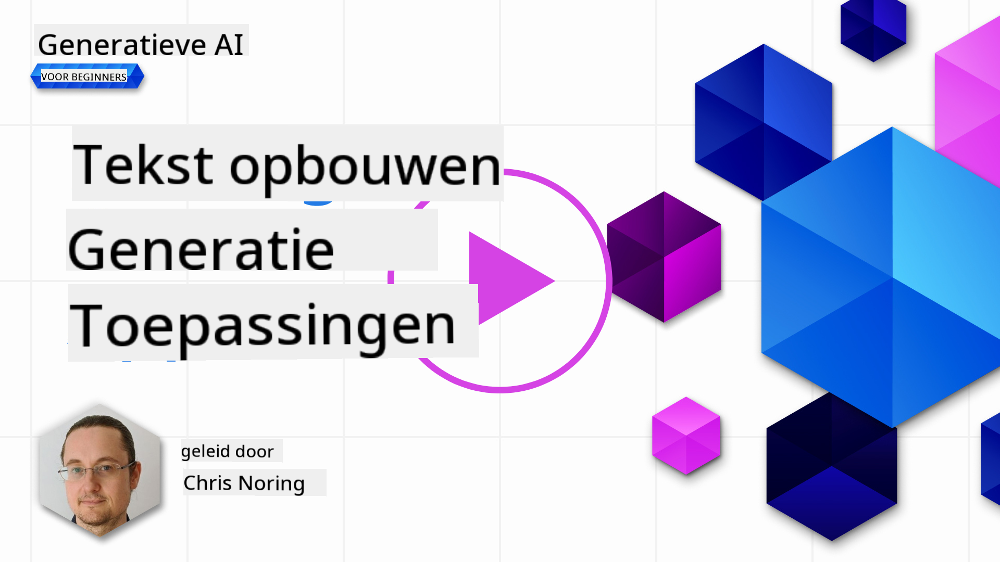

<!--
CO_OP_TRANSLATOR_METADATA:
{
  "original_hash": "ce8224073b86b728ed52b19bed7932fd",
  "translation_date": "2025-07-09T12:02:01+00:00",
  "source_file": "06-text-generation-apps/README.md",
  "language_code": "nl"
}
-->
# Tekstgeneratie-applicaties bouwen

[](https://aka.ms/gen-ai-lesson6-gh?WT.mc_id=academic-105485-koreyst)

> _(Klik op de afbeelding hierboven om de video van deze les te bekijken)_

Je hebt tot nu toe in deze cursus gezien dat er kernconcepten zijn zoals prompts en zelfs een hele discipline genaamd "prompt engineering". Veel tools waarmee je kunt werken, zoals ChatGPT, Office 365, Microsoft Power Platform en meer, ondersteunen je door middel van prompts om iets te bereiken.

Om zo’n ervaring aan een app toe te voegen, moet je concepten zoals prompts, completions begrijpen en een bibliotheek kiezen om mee te werken. Dat is precies wat je in dit hoofdstuk leert.

## Introductie

In dit hoofdstuk ga je:

- Leren over de openai-bibliotheek en de kernconcepten ervan.
- Een tekstgeneratie-app bouwen met openai.
- Begrijpen hoe je concepten zoals prompt, temperatuur en tokens gebruikt om een tekstgeneratie-app te bouwen.

## Leerdoelen

Aan het einde van deze les kun je:

- Uitleggen wat een tekstgeneratie-app is.
- Een tekstgeneratie-app bouwen met openai.
- Je app configureren om meer of minder tokens te gebruiken en ook de temperatuur aan te passen voor gevarieerdere output.

## Wat is een tekstgeneratie-app?

Normaal gesproken heeft een app een soort interface zoals de volgende:

- Command-based. Console-apps zijn typische apps waarbij je een commando typt en het een taak uitvoert. Bijvoorbeeld, `git` is een command-based app.
- Gebruikersinterface (UI). Sommige apps hebben grafische gebruikersinterfaces (GUI’s) waarbij je op knoppen klikt, tekst invoert, opties selecteert en meer.

### Console- en UI-apps zijn beperkt

Vergelijk het met een command-based app waarbij je een commando typt:

- **Het is beperkt**. Je kunt niet zomaar elk commando typen, alleen de commando’s die de app ondersteunt.
- **Taalgebonden**. Sommige apps ondersteunen meerdere talen, maar standaard is de app gebouwd voor een specifieke taal, ook al kun je soms extra taalondersteuning toevoegen.

### Voordelen van tekstgeneratie-apps

Wat maakt een tekstgeneratie-app anders?

In een tekstgeneratie-app heb je meer flexibiliteit, je bent niet beperkt tot een set commando’s of een specifieke invoertaal. In plaats daarvan kun je natuurlijke taal gebruiken om met de app te communiceren. Een ander voordeel is dat je al werkt met een databron die getraind is op een enorme hoeveelheid informatie, terwijl een traditionele app beperkt kan zijn tot wat er in een database staat.

### Wat kan ik bouwen met een tekstgeneratie-app?

Er zijn veel mogelijkheden. Bijvoorbeeld:

- **Een chatbot**. Een chatbot die vragen beantwoordt over onderwerpen zoals jouw bedrijf en producten kan goed van pas komen.
- **Hulpje**. LLM’s zijn uitstekend in taken zoals het samenvatten van tekst, inzichten halen uit tekst, teksten produceren zoals cv’s en meer.
- **Code-assistent**. Afhankelijk van het taalmodel dat je gebruikt, kun je een code-assistent bouwen die je helpt met programmeren. Bijvoorbeeld, je kunt producten zoals GitHub Copilot of ChatGPT gebruiken om code te schrijven.

## Hoe kan ik beginnen?

Je moet een manier vinden om te integreren met een LLM, wat meestal op de volgende twee manieren kan:

- Gebruik een API. Hierbij stel je webverzoeken op met je prompt en krijg je gegenereerde tekst terug.
- Gebruik een bibliotheek. Bibliotheken verpakken de API-aanroepen en maken ze makkelijker te gebruiken.

## Bibliotheken/SDK’s

Er zijn een paar bekende bibliotheken om met LLM’s te werken, zoals:

- **openai**, deze bibliotheek maakt het eenvoudig om verbinding te maken met je model en prompts te versturen.

Daarnaast zijn er bibliotheken die op een hoger niveau opereren, zoals:

- **Langchain**. Langchain is bekend en ondersteunt Python.
- **Semantic Kernel**. Semantic Kernel is een bibliotheek van Microsoft die de talen C#, Python en Java ondersteunt.

## Eerste app met openai

Laten we kijken hoe we onze eerste app kunnen bouwen, welke bibliotheken we nodig hebben, hoeveel er nodig is, enzovoort.

### openai installeren

Er zijn veel bibliotheken om met OpenAI of Azure OpenAI te werken. Het is mogelijk om verschillende programmeertalen te gebruiken zoals C#, Python, JavaScript, Java en meer. Wij hebben gekozen voor de `openai` Python-bibliotheek, dus we gebruiken `pip` om deze te installeren.

```bash
pip install openai
```

### Maak een resource aan

Je moet de volgende stappen uitvoeren:

- Maak een account aan op Azure [https://azure.microsoft.com/free/](https://azure.microsoft.com/free/?WT.mc_id=academic-105485-koreyst).
- Vraag toegang aan tot Azure OpenAI. Ga naar [https://learn.microsoft.com/azure/ai-services/openai/overview#how-do-i-get-access-to-azure-openai](https://learn.microsoft.com/azure/ai-services/openai/overview#how-do-i-get-access-to-azure-openai?WT.mc_id=academic-105485-koreyst) en vraag toegang aan.

  > [!NOTE]
  > Op het moment van schrijven moet je toegang aanvragen voor Azure OpenAI.

- Installeer Python <https://www.python.org/>
- Maak een Azure OpenAI Service resource aan. Zie deze handleiding voor hoe je een [resource aanmaakt](https://learn.microsoft.com/azure/ai-services/openai/how-to/create-resource?pivots=web-portal?WT.mc_id=academic-105485-koreyst).

### Vind API-sleutel en endpoint

Op dit punt moet je de `openai` bibliotheek vertellen welke API-sleutel gebruikt moet worden. Om je API-sleutel te vinden, ga je naar het gedeelte "Keys and Endpoint" van je Azure OpenAI resource en kopieer je de waarde van "Key 1".


Nu je deze informatie hebt gekopieerd, laten we de bibliotheken instrueren om deze te gebruiken.

> [!NOTE]
> Het is verstandig om je API-sleutel gescheiden te houden van je code. Dat kun je doen door gebruik te maken van omgevingsvariabelen.
>
> - Stel de omgevingsvariabele `OPENAI_API_KEY` in op je API-sleutel.
>   `export OPENAI_API_KEY='sk-...'`

### Configuratie instellen voor Azure

Als je Azure OpenAI gebruikt, stel je de configuratie als volgt in:

```python
openai.api_type = 'azure'
openai.api_key = os.environ["OPENAI_API_KEY"]
openai.api_version = '2023-05-15'
openai.api_base = os.getenv("API_BASE")
```

Hierboven stellen we het volgende in:

- `api_type` op `azure`. Dit vertelt de bibliotheek om Azure OpenAI te gebruiken en niet OpenAI.
- `api_key`, dit is je API-sleutel die je in het Azure Portal hebt gevonden.
- `api_version`, dit is de versie van de API die je wilt gebruiken. Op het moment van schrijven is de nieuwste versie `2023-05-15`.
- `api_base`, dit is het endpoint van de API. Je vindt dit in het Azure Portal naast je API-sleutel.

> [!NOTE] > `os.getenv` is een functie die omgevingsvariabelen uitleest. Je kunt het gebruiken om variabelen zoals `OPENAI_API_KEY` en `API_BASE` te lezen. Stel deze omgevingsvariabelen in je terminal in of gebruik een bibliotheek zoals `dotenv`.

## Tekst genereren

De manier om tekst te genereren is door de `Completion` klasse te gebruiken. Hier is een voorbeeld:

```python
prompt = "Complete the following: Once upon a time there was a"

completion = openai.Completion.create(model="davinci-002", prompt=prompt)
print(completion.choices[0].text)
```

In bovenstaande code maken we een completion-object aan en geven we het model en de prompt mee. Daarna printen we de gegenereerde tekst.

### Chat-completions

Tot nu toe heb je gezien hoe we `Completion` gebruiken om tekst te genereren. Maar er is ook een andere klasse genaamd `ChatCompletion` die beter geschikt is voor chatbots. Hier is een voorbeeld van het gebruik:

```python
import openai

openai.api_key = "sk-..."

completion = openai.ChatCompletion.create(model="gpt-3.5-turbo", messages=[{"role": "user", "content": "Hello world"}])
print(completion.choices[0].message.content)
```

Meer over deze functionaliteit in een volgend hoofdstuk.

## Oefening - je eerste tekstgeneratie-app

Nu we weten hoe we openai kunnen instellen en configureren, is het tijd om je eerste tekstgeneratie-app te bouwen. Volg deze stappen:

1. Maak een virtuele omgeving aan en installeer openai:

   ```bash
   python -m venv venv
   source venv/bin/activate
   pip install openai
   ```

   > [!NOTE]
   > Als je Windows gebruikt, typ dan `venv\Scripts\activate` in plaats van `source venv/bin/activate`.

   > [!NOTE]
   > Vind je Azure OpenAI sleutel door naar [https://portal.azure.com/](https://portal.azure.com/?WT.mc_id=academic-105485-koreyst) te gaan, zoek op `Open AI`, selecteer de `Open AI resource` en ga dan naar `Keys and Endpoint` en kopieer de waarde van `Key 1`.

1. Maak een _app.py_ bestand aan en geef het de volgende code:

   ```python
   import openai

   openai.api_key = "<replace this value with your open ai key or Azure OpenAI key>"

   openai.api_type = 'azure'
   openai.api_version = '2023-05-15'
   openai.api_base = "<endpoint found in Azure Portal where your API key is>"
   deployment_name = "<deployment name>"

   # add your completion code
   prompt = "Complete the following: Once upon a time there was a"
   messages = [{"role": "user", "content": prompt}]

   # make completion
   completion = openai.chat.completions.create(model=deployment_name, messages=messages)

   # print response
   print(completion.choices[0].message.content)
   ```

   > [!NOTE]
   > Als je Azure OpenAI gebruikt, moet je `api_type` op `azure` zetten en `api_key` op je Azure OpenAI sleutel.

   Je zou een output moeten zien zoals de volgende:

   ```output
    very unhappy _____.

   Once upon a time there was a very unhappy mermaid.
   ```

## Verschillende soorten prompts, voor verschillende doeleinden

Je hebt nu gezien hoe je tekst genereert met een prompt. Je hebt zelfs een programma dat draait en dat je kunt aanpassen om verschillende soorten tekst te genereren.

Prompts kunnen voor allerlei taken worden gebruikt. Bijvoorbeeld:

- **Genereer een type tekst**. Bijvoorbeeld, je kunt een gedicht genereren, vragen voor een quiz, enzovoort.
- **Informatie opzoeken**. Je kunt prompts gebruiken om informatie op te zoeken, zoals in het voorbeeld 'Wat betekent CORS in webontwikkeling?'.
- **Code genereren**. Je kunt prompts gebruiken om code te genereren, bijvoorbeeld een reguliere expressie om e-mails te valideren, of zelfs een heel programma zoals een webapp.

## Een praktischer voorbeeld: een receptengenerator

Stel je voor dat je ingrediënten thuis hebt en iets wilt koken. Daarvoor heb je een recept nodig. Je kunt een zoekmachine gebruiken, maar je kunt ook een LLM gebruiken.

Je zou een prompt kunnen schrijven zoals:

> "Geef me 5 recepten voor een gerecht met de volgende ingrediënten: kip, aardappelen en wortelen. Per recept, geef alle gebruikte ingrediënten weer."

Op basis van bovenstaande prompt zou je een antwoord kunnen krijgen zoals:

```output
1. Roasted Chicken and Vegetables:
Ingredients:
- 4 chicken thighs
- 2 potatoes, cut into cubes
- 2 carrots, cut into cubes
- 2 tablespoons olive oil
- 2 cloves garlic, minced
- 1 teaspoon dried thyme
- 1 teaspoon dried oregano
- Salt and pepper, to taste

2. Chicken and Potato Stew:
Ingredients:
- 2 tablespoons olive oil
- 1 onion, diced
- 2 cloves garlic, minced
- 2 chicken breasts, cut into cubes
- 2 potatoes, cut into cubes
- 2 carrots, cut into cubes
- 1 teaspoon dried oregano
- 1 teaspoon dried thyme
- 1 cup chicken broth
- Salt and pepper, to taste

3. Chicken and Potato Bake:
Ingredients:
- 2 tablespoons olive oil
- 2 chicken breasts, cut into cubes
- 2 potatoes, cut into cubes
- 2 carrots, cut into cubes
- 1 onion, diced
- 2 cloves garlic, minced
- 1 teaspoon dried oregano
- 1 teaspoon dried thyme
- 1 cup chicken broth
- Salt and pepper, to taste

4. Chicken and Potato Soup:
Ingredients:
- 2 tablespoons olive oil
- 1 onion, diced
- 2 cloves garlic, minced
- 2 chicken breasts, cut into cubes
- 2 potatoes, cut into cubes
- 2 carrots, cut into cubes
- 1 teaspoon dried oregano
- 1 teaspoon dried thyme
- 4 cups chicken broth
- Salt and pepper, to taste

5. Chicken and Potato Hash:
Ingredients:
- 2 tablespoons olive oil
- 2 chicken breasts, cut into cubes
- 2 potatoes, cut into cubes
- 2 carrots, cut into cubes
- 1 onion, diced
- 2 cloves garlic, minced
- 1 teaspoon dried oregano
```

Dit resultaat is prima, ik weet wat ik kan koken. Op dit punt zouden nuttige verbeteringen kunnen zijn:

- Ingrediënten filteren die ik niet lekker vind of waar ik allergisch voor ben.
- Een boodschappenlijst maken, voor het geval ik niet alle ingrediënten in huis heb.

Voor bovenstaande gevallen voegen we een extra prompt toe:

> "Verwijder alsjeblieft recepten met knoflook omdat ik daar allergisch voor ben en vervang het door iets anders. Maak ook een boodschappenlijst voor de recepten, rekening houdend met dat ik al kip, aardappelen en wortelen in huis heb."

Nu krijg je een nieuw resultaat, namelijk:

```output
1. Roasted Chicken and Vegetables:
Ingredients:
- 4 chicken thighs
- 2 potatoes, cut into cubes
- 2 carrots, cut into cubes
- 2 tablespoons olive oil
- 1 teaspoon dried thyme
- 1 teaspoon dried oregano
- Salt and pepper, to taste

2. Chicken and Potato Stew:
Ingredients:
- 2 tablespoons olive oil
- 1 onion, diced
- 2 chicken breasts, cut into cubes
- 2 potatoes, cut into cubes
- 2 carrots, cut into cubes
- 1 teaspoon dried oregano
- 1 teaspoon dried thyme
- 1 cup chicken broth
- Salt and pepper, to taste

3. Chicken and Potato Bake:
Ingredients:
- 2 tablespoons olive oil
- 2 chicken breasts, cut into cubes
- 2 potatoes, cut into cubes
- 2 carrots, cut into cubes
- 1 onion, diced
- 1 teaspoon dried oregano
- 1 teaspoon dried thyme
- 1 cup chicken broth
- Salt and pepper, to taste

4. Chicken and Potato Soup:
Ingredients:
- 2 tablespoons olive oil
- 1 onion, diced
- 2 chicken breasts, cut into cubes
- 2 potatoes, cut into cubes
- 2 carrots, cut into cubes
- 1 teaspoon dried oregano
- 1 teaspoon dried thyme
- 4 cups chicken broth
- Salt and pepper, to taste

5. Chicken and Potato Hash:
Ingredients:
- 2 tablespoons olive oil
- 2 chicken breasts, cut into cubes
- 2 potatoes, cut into cubes
- 2 carrots, cut into cubes
- 1 onion, diced
- 1 teaspoon dried oregano

Shopping List:
- Olive oil
- Onion
- Thyme
- Oregano
- Salt
- Pepper
```

Dat zijn je vijf recepten zonder knoflook en je hebt ook een boodschappenlijst, rekening houdend met wat je al in huis hebt.

## Oefening - bouw een receptengenerator

Nu we een scenario hebben uitgewerkt, schrijven we code die bij het scenario past. Volg deze stappen:

1. Gebruik het bestaande _app.py_ bestand als uitgangspunt.
1. Zoek de variabele `prompt` en verander de code naar het volgende:

   ```python
   prompt = "Show me 5 recipes for a dish with the following ingredients: chicken, potatoes, and carrots. Per recipe, list all the ingredients used"
   ```

   Als je nu de code uitvoert, zou je een output moeten zien zoals:

   ```output
   -Chicken Stew with Potatoes and Carrots: 3 tablespoons oil, 1 onion, chopped, 2 cloves garlic, minced, 1 carrot, peeled and chopped, 1 potato, peeled and chopped, 1 bay leaf, 1 thyme sprig, 1/2 teaspoon salt, 1/4 teaspoon black pepper, 1 1/2 cups chicken broth, 1/2 cup dry white wine, 2 tablespoons chopped fresh parsley, 2 tablespoons unsalted butter, 1 1/2 pounds boneless, skinless chicken thighs, cut into 1-inch pieces
   -Oven-Roasted Chicken with Potatoes and Carrots: 3 tablespoons extra-virgin olive oil, 1 tablespoon Dijon mustard, 1 tablespoon chopped fresh rosemary, 1 tablespoon chopped fresh thyme, 4 cloves garlic, minced, 1 1/2 pounds small red potatoes, quartered, 1 1/2 pounds carrots, quartered lengthwise, 1/2 teaspoon salt, 1/4 teaspoon black pepper, 1 (4-pound) whole chicken
   -Chicken, Potato, and Carrot Casserole: cooking spray, 1 large onion, chopped, 2 cloves garlic, minced, 1 carrot, peeled and shredded, 1 potato, peeled and shredded, 1/2 teaspoon dried thyme leaves, 1/4 teaspoon salt, 1/4 teaspoon black pepper, 2 cups fat-free, low-sodium chicken broth, 1 cup frozen peas, 1/4 cup all-purpose flour, 1 cup 2% reduced-fat milk, 1/4 cup grated Parmesan cheese

   -One Pot Chicken and Potato Dinner: 2 tablespoons olive oil, 1 pound boneless, skinless chicken thighs, cut into 1-inch pieces, 1 large onion, chopped, 3 cloves garlic, minced, 1 carrot, peeled and chopped, 1 potato, peeled and chopped, 1 bay leaf, 1 thyme sprig, 1/2 teaspoon salt, 1/4 teaspoon black pepper, 2 cups chicken broth, 1/2 cup dry white wine

   -Chicken, Potato, and Carrot Curry: 1 tablespoon vegetable oil, 1 large onion, chopped, 2 cloves garlic, minced, 1 carrot, peeled and chopped, 1 potato, peeled and chopped, 1 teaspoon ground coriander, 1 teaspoon ground cumin, 1/2 teaspoon ground turmeric, 1/2 teaspoon ground ginger, 1/4 teaspoon cayenne pepper, 2 cups chicken broth, 1/2 cup dry white wine, 1 (15-ounce) can chickpeas, drained and rinsed, 1/2 cup raisins, 1/2 cup chopped fresh cilantro
   ```

   > NOTE, je LLM is nondeterministisch, dus je kunt elke keer andere resultaten krijgen als je het programma draait.

   Geweldig, laten we kijken hoe we het kunnen verbeteren. Om het te verbeteren willen we de code flexibel maken, zodat het aantal recepten en de ingrediënten aangepast kunnen worden.

1. Pas de code als volgt aan:

   ```python
   no_recipes = input("No of recipes (for example, 5): ")

   ingredients = input("List of ingredients (for example, chicken, potatoes, and carrots): ")

   # interpolate the number of recipes into the prompt an ingredients
   prompt = f"Show me {no_recipes} recipes for a dish with the following ingredients: {ingredients}. Per recipe, list all the ingredients used"
   ```

   Een testuitvoering van de code kan er zo uitzien:

   ```output
   No of recipes (for example, 5): 3
   List of ingredients (for example, chicken, potatoes, and carrots): milk,strawberries

   -Strawberry milk shake: milk, strawberries, sugar, vanilla extract, ice cubes
   -Strawberry shortcake: milk, flour, baking powder, sugar, salt, unsalted butter, strawberries, whipped cream
   -Strawberry milk: milk, strawberries, sugar, vanilla extract
   ```

### Verbeteren door filter en boodschappenlijst toe te voegen

We hebben nu een werkende app die recepten kan maken en flexibel is omdat het afhankelijk is van gebruikersinvoer, zowel het aantal recepten als de gebruikte ingrediënten.

Om het verder te verbeteren willen we het volgende toevoegen:

- **Ingrediënten filteren**. We willen ingrediënten kunnen uitsluiten die we niet lekker vinden of waar we allergisch voor zijn. Om dit te doen passen we onze bestaande prompt aan en voegen we een filtervoorwaarde toe aan het einde, zoals:

  ```python
  filter = input("Filter (for example, vegetarian, vegan, or gluten-free): ")

  prompt = f"Show me {no_recipes} recipes for a dish with the following ingredients: {ingredients}. Per recipe, list all the ingredients used, no {filter}"
  ```

  Hier voegen we `{filter}` toe aan het einde van de prompt en vangen we ook de filterwaarde van de gebruiker op.

  Een voorbeeldinvoer bij het draaien van het programma kan er nu zo uitzien:

  ```output
  No of recipes (for example, 5): 3
  List of ingredients (for example, chicken, potatoes, and carrots): onion,milk
  Filter (for example, vegetarian, vegan, or gluten-free): no milk

  1. French Onion Soup

  Ingredients:

  -1 large onion, sliced
  -3 cups beef broth
  -1 cup milk
  -6 slices french bread
  -1/4 cup shredded Parmesan cheese
  -1 tablespoon butter
  -1 teaspoon dried thyme
  -1/4 teaspoon salt
  -1/4 teaspoon black pepper

  Instructions:

  1. In a large pot, sauté onions in butter until golden brown.
  2. Add beef broth, milk, thyme, salt, and pepper. Bring to a boil.
  3. Reduce heat and simmer for 10 minutes.
  4. Place french bread slices on soup bowls.
  5. Ladle soup over bread.
  6. Sprinkle with Parmesan cheese.

  2. Onion and Potato Soup

  Ingredients:

  -1 large onion, chopped
  -2 cups potatoes, diced
  -3 cups vegetable broth
  -1 cup milk
  -1/4 teaspoon black pepper

  Instructions:

  1. In a large pot, sauté onions in butter until golden brown.
  2. Add potatoes, vegetable broth, milk, and pepper. Bring to a boil.
  3. Reduce heat and simmer for 10 minutes.
  4. Serve hot.

  3. Creamy Onion Soup

  Ingredients:

  -1 large onion, chopped
  -3 cups vegetable broth
  -1 cup milk
  -1/4 teaspoon black pepper
  -1/4 cup all-purpose flour
  -1/2 cup shredded Parmesan cheese

  Instructions:

  1. In a large pot, sauté onions in butter until golden brown.
  2. Add vegetable broth, milk, and pepper. Bring to a boil.
  3. Reduce heat and simmer for 10 minutes.
  4. In a small bowl, whisk together flour and Parmesan cheese until smooth.
  5. Add to soup and simmer for an additional 5 minutes, or until soup has thickened.
  ```

  Zoals je ziet zijn recepten met melk eruit gefilterd. Maar als je lactose-intolerant bent, wil je misschien ook recepten met kaas uitsluiten, dus het is belangrijk om duidelijk te zijn.

- **Een boodschappenlijst maken**. We willen een boodschappenlijst maken, rekening houdend met wat we al in huis hebben.

  Voor deze functionaliteit kunnen we alles in één prompt proberen op te lossen, of we splitsen het op in twee prompts. Laten we de tweede aanpak proberen. We voegen een extra prompt toe, maar daarvoor moeten we het resultaat van de eerste prompt als context meegeven aan de tweede prompt.

  Zoek het deel in de code waar het resultaat van de eerste prompt wordt geprint en voeg de volgende code eronder toe:

  ```python
  old_prompt_result = completion.choices[0].message.content
  prompt = "Produce a shopping list for the generated recipes and please don't include ingredients that I already have."

  new_prompt = f"{old_prompt_result} {prompt}"
  messages = [{"role": "user", "content": new_prompt}]
  completion = openai.Completion.create(engine=deployment_name, messages=messages, max_tokens=1200)

  # print response
  print("Shopping list:")
  print(completion.choices[0].message.content)
  ```

  Let op het volgende:

  1. We bouwen een nieuwe prompt door het resultaat van de eerste prompt toe te voegen aan de nieuwe prompt:

     ```python
     new_prompt = f"{old_prompt_result} {prompt}"
     ```
  1. We maken een nieuw verzoek, maar houden ook rekening met het aantal tokens dat we in de eerste prompt hebben gevraagd, dus deze keer zeggen we dat `max_tokens` 1200 is.

     ```python
     completion = openai.Completion.create(engine=deployment_name, prompt=new_prompt, max_tokens=1200)
     ```

     Als we deze code uitvoeren, krijgen we de volgende output:

     ```output
     No of recipes (for example, 5): 2
     List of ingredients (for example, chicken, potatoes, and carrots): apple,flour
     Filter (for example, vegetarian, vegan, or gluten-free): sugar


     -Apple and flour pancakes: 1 cup flour, 1/2 tsp baking powder, 1/2 tsp baking soda, 1/4 tsp salt, 1 tbsp sugar, 1 egg, 1 cup buttermilk or sour milk, 1/4 cup melted butter, 1 Granny Smith apple, peeled and grated
     -Apple fritters: 1-1/2 cups flour, 1 tsp baking powder, 1/4 tsp salt, 1/4 tsp baking soda, 1/4 tsp nutmeg, 1/4 tsp cinnamon, 1/4 tsp allspice, 1/4 cup sugar, 1/4 cup vegetable shortening, 1/4 cup milk, 1 egg, 2 cups shredded, peeled apples
     Shopping list:
     -Flour, baking powder, baking soda, salt, sugar, egg, buttermilk, butter, apple, nutmeg, cinnamon, allspice
     ```

## Verbeter je setup

Wat we tot nu toe hebben is werkende code, maar er zijn een paar aanpassingen die we kunnen doen om het nog beter te maken. Enkele dingen die we zouden moeten doen zijn:

- **Scheiding van geheimen en code**, zoals de API-sleutel. Geheimen horen niet in de code thuis en moeten op een veilige plek worden opgeslagen. Om geheimen van code te scheiden, kunnen we omgevingsvariabelen gebruiken en bibliotheken zoals `python-dotenv` om ze uit een bestand te laden. Zo zou dat er in code uitzien:

  1. Maak een `.env` bestand aan met de volgende inhoud:

     ```bash
     OPENAI_API_KEY=sk-...
     ```

     
> Let op, voor Azure moet je de volgende omgevingsvariabelen instellen:

     ```bash
     OPENAI_API_TYPE=azure
     OPENAI_API_VERSION=2023-05-15
     OPENAI_API_BASE=<replace>
     ```

     In de code laad je de omgevingsvariabelen als volgt:

     ```python
     from dotenv import load_dotenv

     load_dotenv()

     openai.api_key = os.environ["OPENAI_API_KEY"]
     ```

- **Een woord over tokenlengte**. We moeten nadenken over hoeveel tokens we nodig hebben om de gewenste tekst te genereren. Tokens kosten geld, dus waar mogelijk moeten we zuinig zijn met het aantal tokens dat we gebruiken. Kunnen we bijvoorbeeld de prompt zo formuleren dat we minder tokens gebruiken?

  Om het aantal gebruikte tokens aan te passen, kun je de parameter `max_tokens` gebruiken. Als je bijvoorbeeld 100 tokens wilt gebruiken, doe je:

  ```python
  completion = client.chat.completions.create(model=deployment, messages=messages, max_tokens=100)
  ```

- **Experimenteren met temperature**. Temperature hebben we tot nu toe niet genoemd, maar het is een belangrijke factor voor hoe ons programma presteert. Hoe hoger de temperature, hoe willekeuriger de output zal zijn. Hoe lager de temperature, hoe voorspelbaarder de output. Bedenk of je variatie in je output wilt of niet.

  Om de temperature aan te passen, kun je de parameter `temperature` gebruiken. Als je bijvoorbeeld een temperature van 0.5 wilt gebruiken, doe je:

  ```python
  completion = client.chat.completions.create(model=deployment, messages=messages, temperature=0.5)
  ```

  > Let op, hoe dichter bij 1.0, hoe gevarieerder de output.

## Opdracht

Voor deze opdracht mag je zelf kiezen wat je bouwt.

Hier zijn een paar suggesties:

- Pas de receptgenerator-app aan om deze verder te verbeteren. Speel met temperature-waarden en prompts om te zien wat je kunt maken.
- Bouw een "studiepartner". Deze app moet vragen over een onderwerp kunnen beantwoorden, bijvoorbeeld Python. Je kunt prompts gebruiken zoals "Wat is een bepaald onderwerp in Python?" of "Laat me code zien voor een bepaald onderwerp" enzovoort.
- Geschiedenisbot, laat geschiedenis tot leven komen. Geef de bot de opdracht om een bepaalde historische figuur te spelen en stel vragen over zijn of haar leven en tijd.

## Oplossing

### Studiepartner

Hieronder staat een startprompt, kijk hoe je deze kunt gebruiken en aanpassen naar jouw smaak.

```text
- "You're an expert on the Python language

    Suggest a beginner lesson for Python in the following format:

    Format:
    - concepts:
    - brief explanation of the lesson:
    - exercise in code with solutions"
```

### Geschiedenisbot

Hier zijn een paar prompts die je kunt gebruiken:

```text
- "You are Abe Lincoln, tell me about yourself in 3 sentences, and respond using grammar and words like Abe would have used"
- "You are Abe Lincoln, respond using grammar and words like Abe would have used:

   Tell me about your greatest accomplishments, in 300 words"
```

## Kennischeck

Wat doet het concept temperature?

1. Het bepaalt hoe willekeurig de output is.
1. Het bepaalt hoe lang de reactie is.
1. Het bepaalt hoeveel tokens er worden gebruikt.

## 🚀 Uitdaging

Probeer bij het werken aan de opdracht de temperature te variëren, stel deze in op 0, 0.5 en 1. Onthoud dat 0 het minst gevarieerd is en 1 het meest. Welke waarde werkt het beste voor jouw app?

## Goed gedaan! Ga door met leren

Na het afronden van deze les, bekijk onze [Generative AI Learning collection](https://aka.ms/genai-collection?WT.mc_id=academic-105485-koreyst) om je kennis van Generative AI verder te vergroten!

Ga door naar Les 7, waar we kijken naar hoe je [chatapplicaties bouwt](../07-building-chat-applications/README.md?WT.mc_id=academic-105485-koreyst)!

**Disclaimer**:  
Dit document is vertaald met behulp van de AI-vertalingsdienst [Co-op Translator](https://github.com/Azure/co-op-translator). Hoewel we streven naar nauwkeurigheid, dient u er rekening mee te houden dat geautomatiseerde vertalingen fouten of onnauwkeurigheden kunnen bevatten. Het originele document in de oorspronkelijke taal moet als de gezaghebbende bron worden beschouwd. Voor cruciale informatie wordt professionele menselijke vertaling aanbevolen. Wij zijn niet aansprakelijk voor eventuele misverstanden of verkeerde interpretaties die voortvloeien uit het gebruik van deze vertaling.