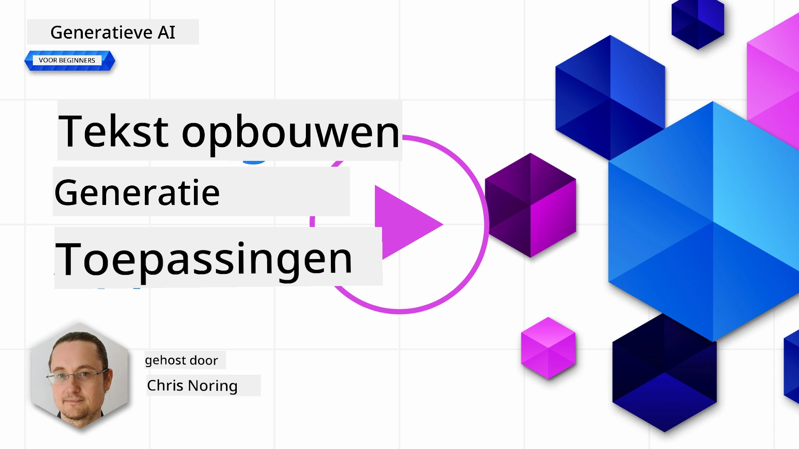

# Building Text Generation Applications

[](https://youtu.be/0Y5Luf5sRQA?si=t_xVg0clnAI4oUFZ)

> _(Klik op de afbeelding hierboven om de video van deze les te bekijken)_

Je hebt tot nu toe in deze cursus gezien dat er kernconcepten zijn zoals prompts en zelfs een hele discipline genaamd "prompt engineering". Veel tools waarmee je kunt interageren zoals ChatGPT, Office 365, Microsoft Power Platform en meer, ondersteunen je met prompts om iets te bereiken.

Om zo'n ervaring aan een app toe te voegen, moet je concepten zoals prompts, completions begrijpen en een bibliotheek kiezen om mee te werken. Dat is precies wat je in dit hoofdstuk zult leren.

## Introductie

In dit hoofdstuk zul je:

- Leren over de openai-bibliotheek en de kernconcepten ervan.
- Een app voor tekstgeneratie bouwen met openai.
- Begrijpen hoe je concepten zoals prompt, temperatuur en tokens kunt gebruiken om een app voor tekstgeneratie te bouwen.

## Leerdoelen

Aan het einde van deze les kun je:

- Uitleggen wat een app voor tekstgeneratie is.
- Een app voor tekstgeneratie bouwen met openai.
- Je app configureren om meer of minder tokens te gebruiken en ook de temperatuur aan te passen voor een gevarieerdere output.

## Wat is een app voor tekstgeneratie?

Normaal gesproken heeft een app die je bouwt een soort interface zoals de volgende:

- Gebaseerd op commando’s. Console-apps zijn typische apps waarbij je een commando typt en het een taak uitvoert. Bijvoorbeeld, `git` is een app gebaseerd op commando’s.
- Gebruikersinterface (UI). Sommige apps hebben grafische gebruikersinterfaces (GUI's) waarbij je op knoppen klikt, tekst invoert, opties selecteert en meer.

### Console- en UI-apps zijn beperkt

Vergelijk het met een app gebaseerd op commando’s waar je een commando typt:

- **Het is beperkt**. Je kunt niet zomaar elk commando typen, alleen die welke de app ondersteunt.
- **Taalgebonden**. Sommige apps ondersteunen veel talen, maar standaard is de app gebouwd voor een specifieke taal, ook al kun je meer taalondersteuning toevoegen.

### Voordelen van apps voor tekstgeneratie

Hoe is een app voor tekstgeneratie dan anders?

In een app voor tekstgeneratie heb je meer flexibiliteit, je bent niet beperkt tot een set commando’s of een specifieke invoertaal. In plaats daarvan kun je natuurlijke taal gebruiken om met de app te communiceren. Een ander voordeel is dat je al communiceert met een gegevensbron die is getraind op een enorme hoeveelheid informatie, terwijl een traditionele app beperkt kan zijn tot wat er in een database staat.

### Wat kan ik bouwen met een app voor tekstgeneratie?

Er zijn veel dingen die je kunt bouwen. Bijvoorbeeld:

- **Een chatbot**. Een chatbot die vragen beantwoordt over onderwerpen, zoals je bedrijf en zijn producten zou een goede match kunnen zijn.
- **Helper**. LLM’s zijn uitstekend in dingen zoals het samenvatten van tekst, inzichten halen uit tekst, teksten produceren zoals cv’s en meer.
- **Code-assistent**. Afhankelijk van het taalmodel dat je gebruikt, kun je een code-assistent bouwen die helpt met code schrijven. Bijvoorbeeld, je kunt gebruikmaken van een product zoals GitHub Copilot en ook ChatGPT om je te helpen code te schrijven.

## Hoe kan ik beginnen?

Wel, je moet een manier vinden om te integreren met een LLM, wat meestal de volgende twee benaderingen omvat:

- Gebruik een API. Hierbij stel je webverzoeken op met je prompt en krijg je gegenereerde tekst terug.
- Gebruik een bibliotheek. Bibliotheken helpen de API-aanroepen te kapselen en maken ze makkelijker te gebruiken.

## Bibliotheken/SDK’s

Er zijn een paar bekende bibliotheken om met LLM’s te werken zoals:

- **openai**, deze bibliotheek maakt het eenvoudig om verbinding te maken met je model en prompts te verzenden.

Dan zijn er bibliotheken die op een hoger niveau werken, zoals:

- **Langchain**. Langchain is bekend en ondersteunt Python.
- **Semantic Kernel**. Semantic Kernel is een bibliotheek van Microsoft die de talen C#, Python en Java ondersteunt.

## Eerste app maken met openai

Laten we kijken hoe we onze eerste app kunnen bouwen, welke bibliotheken we nodig hebben, hoeveel dit vereist en zo verder.

### Installeer openai

Er zijn veel bibliotheken beschikbaar voor interactie met OpenAI of Azure OpenAI. Het is ook mogelijk om diverse programmeertalen te gebruiken zoals C#, Python, JavaScript, Java en meer. We hebben ervoor gekozen de `openai` Python-bibliotheek te gebruiken, dus we gebruiken `pip` om het te installeren.

```bash
pip install openai
```

### Maak een resource aan

Je moet de volgende stappen uitvoeren:

- Maak een account aan op Azure [https://azure.microsoft.com/free/](https://azure.microsoft.com/free/?WT.mc_id=academic-105485-koreyst).
- Krijg toegang tot Azure OpenAI. Ga naar [https://learn.microsoft.com/azure/ai-services/openai/overview#how-do-i-get-access-to-azure-openai](https://learn.microsoft.com/azure/ai-services/openai/overview#how-do-i-get-access-to-azure-openai?WT.mc_id=academic-105485-koreyst) en vraag toegang aan.

  > [!NOTE]
  > Ten tijde van schrijven, moet je toegang aanvragen tot Azure OpenAI.

- Installeer Python <https://www.python.org/>
- Maak een Azure OpenAI Service resource aan. Zie deze gids voor hoe je een [resource aanmaakt](https://learn.microsoft.com/azure/ai-services/openai/how-to/create-resource?pivots=web-portal?WT.mc_id=academic-105485-koreyst).

### Vind API-sleutel en endpoint

Op dit punt moet je aan je `openai` bibliotheek vertellen welke API-sleutel te gebruiken. Om je API-sleutel te vinden, ga naar de sectie "Keys and Endpoint" van je Azure OpenAI resource en kopieer de waarde van "Key 1".


Nu je deze informatie hebt gekopieerd, laten we de bibliotheken instrueren die te gebruiken.

> [!NOTE]
> Het is aan te raden om je API-sleutel gescheiden te houden van je code. Dat kun je doen door gebruik te maken van omgevingsvariabelen.
>
> - Zet de omgevingsvariabele `OPENAI_API_KEY` naar je API-sleutel.
>   `export OPENAI_API_KEY='sk-...'`

### Configuratie Azure instellen

Als je Azure OpenAI gebruikt (nu onderdeel van Microsoft Foundry), zo stel je de configuratie in. We gebruiken de standaard `OpenAI` client die wijst naar de Azure OpenAI `/openai/v1/` endpoint, wat werkt met de Responses API en geen `api_version` nodig heeft:

```python
import os
from openai import OpenAI

client = OpenAI(
    api_key=os.environ["AZURE_OPENAI_API_KEY"],
    base_url=f"{os.environ['AZURE_OPENAI_ENDPOINT'].rstrip('/')}/openai/v1/",
)
```

Bovenstaand stellen we het volgende in:

- `api_key`, dit is je API-sleutel gevonden in het Azure Portal of Microsoft Foundry-portal.
- `base_url`, dit is je Foundry resource endpoint met `/openai/v1/` eraan toegevoegd. De stabiele v1-endpoint werkt zowel voor OpenAI als Azure OpenAI zonder `api_version` beheer.

> [!NOTE] > `os.environ` leest omgevingsvariabelen. Je kunt het gebruiken om omgevingsvariabelen te lezen zoals `AZURE_OPENAI_API_KEY` en `AZURE_OPENAI_ENDPOINT`. Zet deze omgevingsvariabelen in je terminal of gebruik een bibliotheek zoals `dotenv`.

## Tekst genereren

De manier om tekst te genereren is om de Responses API te gebruiken via de `responses.create` methode. Hier is een voorbeeld:

```python
prompt = "Complete the following: Once upon a time there was a"

response = client.responses.create(
    model="gpt-4o-mini",  # dit is de naam van je modelimplementatie
    input=prompt,
    store=False,
)
print(response.output_text)
```

In bovenstaande code maken we een respons aan en geven we het model dat we willen gebruiken en de prompt door. Daarna printen we de gegenereerde tekst via `response.output_text`.

### Meerdere beurten in gesprekken

De Responses API is geschikt voor zowel single-turn tekstgeneratie als multi-turn chatbots – je levert een lijst van berichten in `input` om een gesprek op te bouwen:

```python
from openai import OpenAI

client = OpenAI(api_key="sk-...")

response = client.responses.create(model="gpt-4o-mini", input="Hello world", store=False)
print(response.output_text)
```

Meer over deze functionaliteit in een volgend hoofdstuk.

## Oefening - je eerste tekstgeneratie-app

Nu we hebben geleerd hoe we openai kunnen instellen en configureren, is het tijd om je eerste tekstgeneratie-app te bouwen. Volg deze stappen om je app te bouwen:

1. Maak een virtuele omgeving en installeer openai:

   ```bash
   python -m venv venv
   source venv/bin/activate
   pip install openai
   ```

   > [!NOTE]
   > Als je Windows gebruikt typ dan `venv\Scripts\activate` in plaats van `source venv/bin/activate`.

   > [!NOTE]
   > Vind je Azure OpenAI sleutel door naar [https://portal.azure.com/](https://portal.azure.com/?WT.mc_id=academic-105485-koreyst) te gaan en zoek naar `Open AI`, selecteer de `Open AI resource` en klik vervolgens op `Keys and Endpoint` en kopieer de `Key 1` waarde.

1. Maak een _app.py_ bestand aan en geef het volgende code:

   ```python
   import os
   from openai import OpenAI

   client = OpenAI(
       api_key="<replace this value with your Azure OpenAI key>",
       base_url="<endpoint found in Azure Portal>/openai/v1/",
   )
   deployment_name = "<deployment name>"

   # voeg je voltooiingscode toe
   prompt = "Complete the following: Once upon a time there was a"

   # doe een verzoek met de Responses API
   response = client.responses.create(model=deployment_name, input=prompt, store=False)

   # print respons
   print(response.output_text)
   ```

   > [!NOTE]
   > Als je het gewone OpenAI gebruikt (niet Azure), gebruik dan `client = OpenAI(api_key="<vervang deze waarde door jouw OpenAI key>")` (geen `base_url`) en geef een modelnaam zoals `gpt-4o-mini` door in plaats van een deployment naam.

   Je zou zo’n output moeten zien:

   ```output
    very unhappy _____.

   Once upon a time there was a very unhappy mermaid.
   ```

## Verschillende soorten prompts, voor verschillende doeleinden

Nu heb je gezien hoe je tekst kunt genereren met een prompt. Je hebt zelfs een programma dat draait en dat je kunt aanpassen en wijzigen om verschillende soorten tekst te genereren.

Prompts kunnen voor allerlei taken worden gebruikt. Bijvoorbeeld:

- **Genereer een soort tekst**. Bijvoorbeeld, je kunt een gedicht genereren, vragen voor een quiz, enz.
- **Informatie opzoeken**. Je kunt prompts gebruiken om informatie op te zoeken zoals in het volgende voorbeeld: 'Wat betekent CORS in webontwikkeling?'.
- **Code genereren**. Je kunt prompts gebruiken om code te genereren, bijvoorbeeld het ontwikkelen van een reguliere expressie om e-mails te valideren of zelfs een heel programma, zoals een webapp, te genereren.

## Een praktischere use case: een receptengenerator

Stel je voor dat je ingrediënten thuis hebt en iets wilt koken. Daarvoor heb je een recept nodig. Een manier om recepten te vinden is met een zoekmachine, of je kunt een LLM gebruiken om dat te doen.

Je kunt zo’n prompt schrijven:

> "Toon me 5 recepten voor een gerecht met de volgende ingrediënten: kip, aardappelen en wortelen. Per recept, vermeld alle gebruikte ingrediënten"

Gegeven bovenstaande prompt, kun je een antwoord krijgen dat lijkt op:

```output
1. Roasted Chicken and Vegetables:
Ingredients:
- 4 chicken thighs
- 2 potatoes, cut into cubes
- 2 carrots, cut into cubes
- 2 tablespoons olive oil
- 2 cloves garlic, minced
- 1 teaspoon dried thyme
- 1 teaspoon dried oregano
- Salt and pepper, to taste

2. Chicken and Potato Stew:
Ingredients:
- 2 tablespoons olive oil
- 1 onion, diced
- 2 cloves garlic, minced
- 2 chicken breasts, cut into cubes
- 2 potatoes, cut into cubes
- 2 carrots, cut into cubes
- 1 teaspoon dried oregano
- 1 teaspoon dried thyme
- 1 cup chicken broth
- Salt and pepper, to taste

3. Chicken and Potato Bake:
Ingredients:
- 2 tablespoons olive oil
- 2 chicken breasts, cut into cubes
- 2 potatoes, cut into cubes
- 2 carrots, cut into cubes
- 1 onion, diced
- 2 cloves garlic, minced
- 1 teaspoon dried oregano
- 1 teaspoon dried thyme
- 1 cup chicken broth
- Salt and pepper, to taste

4. Chicken and Potato Soup:
Ingredients:
- 2 tablespoons olive oil
- 1 onion, diced
- 2 cloves garlic, minced
- 2 chicken breasts, cut into cubes
- 2 potatoes, cut into cubes
- 2 carrots, cut into cubes
- 1 teaspoon dried oregano
- 1 teaspoon dried thyme
- 4 cups chicken broth
- Salt and pepper, to taste

5. Chicken and Potato Hash:
Ingredients:
- 2 tablespoons olive oil
- 2 chicken breasts, cut into cubes
- 2 potatoes, cut into cubes
- 2 carrots, cut into cubes
- 1 onion, diced
- 2 cloves garlic, minced
- 1 teaspoon dried oregano
```

Dit resultaat is prima, ik weet wat ik ga koken. Op dit punt zouden nuttige verbeteringen zijn:

- Ingrediënten die ik niet lust of waarvoor ik allergisch ben eruit filteren.
- Een boodschappenlijst maken, voor het geval ik niet alle ingrediënten thuis heb.

Voor bovenstaande gevallen voegen we een extra prompt toe:

> "Verwijder recepten met knoflook aangezien ik allergisch ben en vervang deze door iets anders. Maak ook een boodschappenlijst voor de recepten, rekening houdend met het feit dat ik al kip, aardappelen en wortelen thuis heb."

Nu heb je een nieuw resultaat, namelijk:

```output
1. Roasted Chicken and Vegetables:
Ingredients:
- 4 chicken thighs
- 2 potatoes, cut into cubes
- 2 carrots, cut into cubes
- 2 tablespoons olive oil
- 1 teaspoon dried thyme
- 1 teaspoon dried oregano
- Salt and pepper, to taste

2. Chicken and Potato Stew:
Ingredients:
- 2 tablespoons olive oil
- 1 onion, diced
- 2 chicken breasts, cut into cubes
- 2 potatoes, cut into cubes
- 2 carrots, cut into cubes
- 1 teaspoon dried oregano
- 1 teaspoon dried thyme
- 1 cup chicken broth
- Salt and pepper, to taste

3. Chicken and Potato Bake:
Ingredients:
- 2 tablespoons olive oil
- 2 chicken breasts, cut into cubes
- 2 potatoes, cut into cubes
- 2 carrots, cut into cubes
- 1 onion, diced
- 1 teaspoon dried oregano
- 1 teaspoon dried thyme
- 1 cup chicken broth
- Salt and pepper, to taste

4. Chicken and Potato Soup:
Ingredients:
- 2 tablespoons olive oil
- 1 onion, diced
- 2 chicken breasts, cut into cubes
- 2 potatoes, cut into cubes
- 2 carrots, cut into cubes
- 1 teaspoon dried oregano
- 1 teaspoon dried thyme
- 4 cups chicken broth
- Salt and pepper, to taste

5. Chicken and Potato Hash:
Ingredients:
- 2 tablespoons olive oil
- 2 chicken breasts, cut into cubes
- 2 potatoes, cut into cubes
- 2 carrots, cut into cubes
- 1 onion, diced
- 1 teaspoon dried oregano

Shopping List:
- Olive oil
- Onion
- Thyme
- Oregano
- Salt
- Pepper
```

Dat zijn je vijf recepten, zonder knoflook genoemd, en je hebt ook een boodschappenlijst op basis van wat je al thuis hebt.

## Oefening - bouw een receptengenerator

Nu we een scenario hebben uitgewerkt, laten we een code schrijven die bij het gedemonstreerde scenario past. Volg hiervoor deze stappen:

1. Gebruik het bestaande _app.py_ bestand als startpunt.
1. Zoek de variabele `prompt` en verander de code naar het volgende:

   ```python
   prompt = "Show me 5 recipes for a dish with the following ingredients: chicken, potatoes, and carrots. Per recipe, list all the ingredients used"
   ```

   Als je nu de code uitvoert, zou je een output moeten zien zoals:

   ```output
   -Chicken Stew with Potatoes and Carrots: 3 tablespoons oil, 1 onion, chopped, 2 cloves garlic, minced, 1 carrot, peeled and chopped, 1 potato, peeled and chopped, 1 bay leaf, 1 thyme sprig, 1/2 teaspoon salt, 1/4 teaspoon black pepper, 1 1/2 cups chicken broth, 1/2 cup dry white wine, 2 tablespoons chopped fresh parsley, 2 tablespoons unsalted butter, 1 1/2 pounds boneless, skinless chicken thighs, cut into 1-inch pieces
   -Oven-Roasted Chicken with Potatoes and Carrots: 3 tablespoons extra-virgin olive oil, 1 tablespoon Dijon mustard, 1 tablespoon chopped fresh rosemary, 1 tablespoon chopped fresh thyme, 4 cloves garlic, minced, 1 1/2 pounds small red potatoes, quartered, 1 1/2 pounds carrots, quartered lengthwise, 1/2 teaspoon salt, 1/4 teaspoon black pepper, 1 (4-pound) whole chicken
   -Chicken, Potato, and Carrot Casserole: cooking spray, 1 large onion, chopped, 2 cloves garlic, minced, 1 carrot, peeled and shredded, 1 potato, peeled and shredded, 1/2 teaspoon dried thyme leaves, 1/4 teaspoon salt, 1/4 teaspoon black pepper, 2 cups fat-free, low-sodium chicken broth, 1 cup frozen peas, 1/4 cup all-purpose flour, 1 cup 2% reduced-fat milk, 1/4 cup grated Parmesan cheese

   -One Pot Chicken and Potato Dinner: 2 tablespoons olive oil, 1 pound boneless, skinless chicken thighs, cut into 1-inch pieces, 1 large onion, chopped, 3 cloves garlic, minced, 1 carrot, peeled and chopped, 1 potato, peeled and chopped, 1 bay leaf, 1 thyme sprig, 1/2 teaspoon salt, 1/4 teaspoon black pepper, 2 cups chicken broth, 1/2 cup dry white wine

   -Chicken, Potato, and Carrot Curry: 1 tablespoon vegetable oil, 1 large onion, chopped, 2 cloves garlic, minced, 1 carrot, peeled and chopped, 1 potato, peeled and chopped, 1 teaspoon ground coriander, 1 teaspoon ground cumin, 1/2 teaspoon ground turmeric, 1/2 teaspoon ground ginger, 1/4 teaspoon cayenne pepper, 2 cups chicken broth, 1/2 cup dry white wine, 1 (15-ounce) can chickpeas, drained and rinsed, 1/2 cup raisins, 1/2 cup chopped fresh cilantro
   ```

   > LET OP, je LLM is nondeterministisch, dus je krijgt mogelijk elke keer dat je het programma uitvoert andere resultaten.

   Geweldig, laten we kijken hoe we het kunnen verbeteren. Om het te verbeteren willen we de code flexibel maken, zodat ingrediënten en het aantal recepten aangepast kunnen worden.

1. Laten we de code op de volgende manier veranderen:

   ```python
   no_recipes = input("No of recipes (for example, 5): ")

   ingredients = input("List of ingredients (for example, chicken, potatoes, and carrots): ")

   # interpoleren het aantal recepten in de prompt en ingrediënten
   prompt = f"Show me {no_recipes} recipes for a dish with the following ingredients: {ingredients}. Per recipe, list all the ingredients used"
   ```

   De code voor een testrun zou er zo uit kunnen zien:

   ```output
   No of recipes (for example, 5): 3
   List of ingredients (for example, chicken, potatoes, and carrots): milk,strawberries

   -Strawberry milk shake: milk, strawberries, sugar, vanilla extract, ice cubes
   -Strawberry shortcake: milk, flour, baking powder, sugar, salt, unsalted butter, strawberries, whipped cream
   -Strawberry milk: milk, strawberries, sugar, vanilla extract
   ```

### Verbeter door filter en boodschappenlijst toe te voegen

We hebben nu een werkende app die recepten kan produceren en het is flexibel omdat het afhankelijk is van invoer van de gebruiker, zowel het aantal recepten als de gebruikte ingrediënten.

Om het verder te verbeteren willen we het volgende toevoegen:

- **Filter ingrediënten**. We willen ingrediënten kunnen uitsluiten die we niet lekker vinden of waarvoor we allergisch zijn. Om deze wijziging door te voeren kunnen we onze bestaande prompt aanpassen en aan het eind een filtervoorwaarde toevoegen zoals:

  ```python
  filter = input("Filter (for example, vegetarian, vegan, or gluten-free): ")

  prompt = f"Show me {no_recipes} recipes for a dish with the following ingredients: {ingredients}. Per recipe, list all the ingredients used, no {filter}"
  ```

  Bovenaan voegen we `{filter}` toe aan het einde van de prompt en we vangen ook de filterwaarde van de gebruiker op.

  Een voorbeeld van invoer tijdens de uitvoering van het programma kan er nu zo uitzien:

  ```output
  No of recipes (for example, 5): 3
  List of ingredients (for example, chicken, potatoes, and carrots): onion,milk
  Filter (for example, vegetarian, vegan, or gluten-free): no milk

  1. French Onion Soup

  Ingredients:

  -1 large onion, sliced
  -3 cups beef broth
  -1 cup milk
  -6 slices french bread
  -1/4 cup shredded Parmesan cheese
  -1 tablespoon butter
  -1 teaspoon dried thyme
  -1/4 teaspoon salt
  -1/4 teaspoon black pepper

  Instructions:

  1. In a large pot, sauté onions in butter until golden brown.
  2. Add beef broth, milk, thyme, salt, and pepper. Bring to a boil.
  3. Reduce heat and simmer for 10 minutes.
  4. Place french bread slices on soup bowls.
  5. Ladle soup over bread.
  6. Sprinkle with Parmesan cheese.

  2. Onion and Potato Soup

  Ingredients:

  -1 large onion, chopped
  -2 cups potatoes, diced
  -3 cups vegetable broth
  -1 cup milk
  -1/4 teaspoon black pepper

  Instructions:

  1. In a large pot, sauté onions in butter until golden brown.
  2. Add potatoes, vegetable broth, milk, and pepper. Bring to a boil.
  3. Reduce heat and simmer for 10 minutes.
  4. Serve hot.

  3. Creamy Onion Soup

  Ingredients:

  -1 large onion, chopped
  -3 cups vegetable broth
  -1 cup milk
  -1/4 teaspoon black pepper
  -1/4 cup all-purpose flour
  -1/2 cup shredded Parmesan cheese

  Instructions:

  1. In a large pot, sauté onions in butter until golden brown.
  2. Add vegetable broth, milk, and pepper. Bring to a boil.
  3. Reduce heat and simmer for 10 minutes.
  4. In a small bowl, whisk together flour and Parmesan cheese until smooth.
  5. Add to soup and simmer for an additional 5 minutes, or until soup has thickened.
  ```

  Zoals je kunt zien zijn recepten met melk eruit gefilterd. Maar als je lactose-intolerant bent wil je misschien ook recepten met kaas eruit filteren, dus het is belangrijk hier duidelijk over te zijn.


- **Maak een boodschappenlijst**. We willen een boodschappenlijst maken, rekening houdend met wat we al thuis hebben.

  Voor deze functionaliteit kunnen we proberen alles in één prompt op te lossen, of we kunnen het opdelen in twee prompts. Laten we de laatste aanpak proberen. Hier stellen we voor om een extra prompt toe te voegen, maar daarvoor moeten we het resultaat van de eerste prompt als context toevoegen aan de tweede prompt.

  Zoek het deel in de code dat het resultaat van de eerste prompt afdrukt en voeg de volgende code daaronder toe:

  ```python
  old_prompt_result = response.output_text
  prompt = "Produce a shopping list for the generated recipes and please don't include ingredients that I already have."

  new_prompt = f"{old_prompt_result} {prompt}"
  response = client.responses.create(model=deployment_name, input=new_prompt, max_output_tokens=1200, store=False)

  # print reactie
  print("Shopping list:")
  print(response.output_text)
  ```

  Let op het volgende:

  1. We construeren een nieuwe prompt door het resultaat van de eerste prompt toe te voegen aan de nieuwe prompt:

     ```python
     new_prompt = f"{old_prompt_result} {prompt}"
     ```

  1. We doen een nieuw verzoek, maar houden ook rekening met het aantal tokens dat we vroegen in de eerste prompt, dus deze keer zeggen we dat `max_output_tokens` 1200 is.

     ```python
     response = client.responses.create(model=deployment_name, input=new_prompt, max_output_tokens=1200, store=False)
     ```

     Als we deze code draaien, krijgen we nu de volgende uitvoer:

     ```output
     No of recipes (for example, 5): 2
     List of ingredients (for example, chicken, potatoes, and carrots): apple,flour
     Filter (for example, vegetarian, vegan, or gluten-free): sugar


     -Apple and flour pancakes: 1 cup flour, 1/2 tsp baking powder, 1/2 tsp baking soda, 1/4 tsp salt, 1 tbsp sugar, 1 egg, 1 cup buttermilk or sour milk, 1/4 cup melted butter, 1 Granny Smith apple, peeled and grated
     -Apple fritters: 1-1/2 cups flour, 1 tsp baking powder, 1/4 tsp salt, 1/4 tsp baking soda, 1/4 tsp nutmeg, 1/4 tsp cinnamon, 1/4 tsp allspice, 1/4 cup sugar, 1/4 cup vegetable shortening, 1/4 cup milk, 1 egg, 2 cups shredded, peeled apples
     Shopping list:
     -Flour, baking powder, baking soda, salt, sugar, egg, buttermilk, butter, apple, nutmeg, cinnamon, allspice
     ```

## Verbeter je setup

Wat we tot nu toe hebben is code die werkt, maar er zijn een paar aanpassingen die we moeten doen om het nog beter te maken. Enkele dingen die we moeten doen zijn:

- **Scheiding van geheimen en code**, zoals de API-sleutel. Geheimen horen niet in code en moeten op een veilige plek worden opgeslagen. Om geheimen te scheiden van code kunnen we omgevingsvariabelen gebruiken en bibliotheken zoals `python-dotenv` om ze vanuit een bestand te laden. Zo ziet dat er in code uit:

  1. Maak een `.env` bestand met de volgende inhoud:

     ```bash
     OPENAI_API_KEY=sk-...
     ```

     > Let op, voor Azure OpenAI in Microsoft Foundry moet je in plaats daarvan de volgende omgevingsvariabelen instellen:

     ```bash
     AZURE_OPENAI_API_KEY=<replace>
     AZURE_OPENAI_ENDPOINT=<replace>
     AZURE_OPENAI_API_VERSION=2024-10-21
     ```

     In de code laad je de omgevingsvariabelen als volgt:

     ```python
     import os
     from dotenv import load_dotenv
     from openai import OpenAI

     load_dotenv()

     client = OpenAI(api_key=os.environ["OPENAI_API_KEY"])
     ```

- **Een woord over tokenlengte**. We moeten overwegen hoeveel tokens we nodig hebben om de tekst te genereren die we willen. Tokens kosten geld, dus waar mogelijk moeten we zuinig zijn met het aantal tokens dat we gebruiken. Kunnen we bijvoorbeeld de prompt zo formuleren dat we minder tokens gebruiken?

  Om het aantal gebruikte tokens aan te passen, kun je de parameter `max_output_tokens` gebruiken. Bijvoorbeeld, als je 100 tokens wilt gebruiken, doe je:

  ```python
  response = client.responses.create(model=deployment, input=prompt, max_output_tokens=100, store=False)
  ```

- **Experimenteren met temperatuur**. Temperatuur is iets wat we tot nu toe niet hebben genoemd, maar het is een belangrijke factor voor hoe ons programma presteert. Hoe hoger de temperatuur, hoe willekeuriger de uitvoer. Hoe lager de temperatuur, hoe voorspelbaarder de uitvoer. Bedenk of je variatie in je uitvoer wilt of niet.

  Om de temperatuur aan te passen, gebruik je de parameter `temperature`. Bijvoorbeeld, als je een temperatuur van 0,5 wilt gebruiken, doe je:

  ```python
  response = client.responses.create(model=deployment, input=prompt, temperature=0.5, store=False)
  ```

  > Let op, hoe dichter bij 1,0 hoe gevarieerder de uitvoer.

## Opdracht

Voor deze opdracht kun je zelf kiezen wat je bouwt.

Hier zijn enkele suggesties:

- Pas de receptengenerator app aan om deze verder te verbeteren. Speel met temperatuurwaarden en de prompts om te zien wat je kunt bedenken.
- Bouw een "studiegenoot". Deze app moet in staat zijn vragen over een onderwerp te beantwoorden, bijvoorbeeld Python. Je kunt prompts gebruiken zoals "Wat is een bepaald onderwerp in Python?" of een prompt die zegt, laat me code zien voor een bepaald onderwerp, enzovoorts.
- Historiebot, laat geschiedenis tot leven komen, geef de bot de opdracht een bepaalde historische figuur te spelen en stel hem vragen over zijn leven en tijdperk.

## Oplossing

### Studienoot

Hieronder is een startprompt, kijk hoe je die kunt gebruiken en aanpassen naar eigen voorkeur.

```text
- "You're an expert on the Python language

    Suggest a beginner lesson for Python in the following format:

    Format:
    - concepts:
    - brief explanation of the lesson:
    - exercise in code with solutions"
```

### Historiebot

Hier zijn enkele prompts die je kunt gebruiken:

```text
- "You are Abe Lincoln, tell me about yourself in 3 sentences, and respond using grammar and words like Abe would have used"
- "You are Abe Lincoln, respond using grammar and words like Abe would have used:

   Tell me about your greatest accomplishments, in 300 words"
```

## Kennischeck

Wat doet het concept temperatuur?

1. Het bepaalt hoe willekeurig de uitvoer is.
1. Het bepaalt hoe groot het antwoord is.
1. Het bepaalt hoeveel tokens worden gebruikt.

## 🚀 Uitdaging

Tijdens het werken aan de opdracht, probeer de temperatuur te variëren, stel deze in op 0, 0,5, en 1. Onthoud dat 0 het minst gevarieerd is en 1 het meest. Welke waarde werkt het beste voor jouw app?

## Geweldig Werk! Ga Door Met Leren

Na het voltooien van deze les, bekijk onze [Generative AI Learning collection](https://aka.ms/genai-collection?WT.mc_id=academic-105485-koreyst) om je kennis van Generative AI verder te vergroten!

Ga door naar Les 7 waar we kijken naar hoe je [chatapplicaties bouwt](../07-building-chat-applications/README.md?WT.mc_id=academic-105485-koreyst)!

---

<!-- CO-OP TRANSLATOR DISCLAIMER START -->
**Disclaimer**:
Dit document is vertaald met behulp van de AI vertaaldienst [Co-op Translator](https://github.com/Azure/co-op-translator). Hoewel we streven naar nauwkeurigheid, dient u er rekening mee te houden dat geautomatiseerde vertalingen fouten of onnauwkeurigheden kunnen bevatten. Het originele document in de oorspronkelijke taal moet worden beschouwd als de gezaghebbende bron. Voor kritieke informatie wordt professionele menselijke vertaling aanbevolen. Wij zijn niet aansprakelijk voor eventuele misverstanden of verkeerde interpretaties die voortvloeien uit het gebruik van deze vertaling.
<!-- CO-OP TRANSLATOR DISCLAIMER END -->