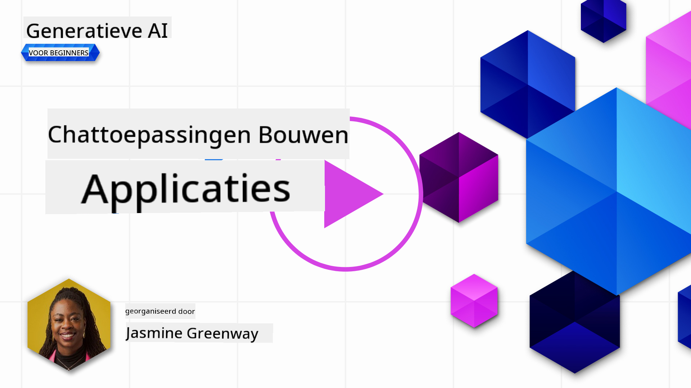
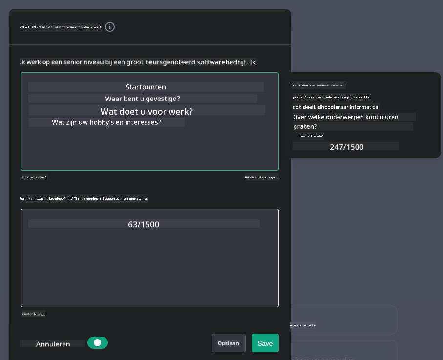
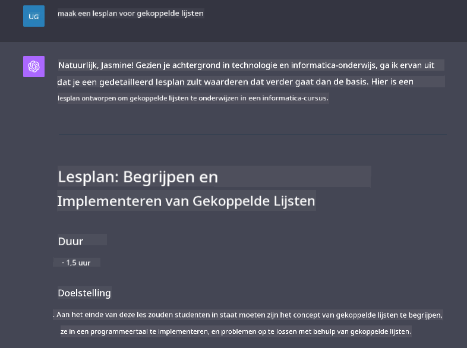

<!--
CO_OP_TRANSLATOR_METADATA:
{
  "original_hash": "ea4bbe640847aafbbba14dae4625e9af",
  "translation_date": "2025-05-19T17:57:43+00:00",
  "source_file": "07-building-chat-applications/README.md",
  "language_code": "nl"
}
-->
# Generatieve AI-aangedreven chatapplicaties bouwen

[](https://aka.ms/gen-ai-lessons7-gh?WT.mc_id=academic-105485-koreyst)

> _(Klik op de afbeelding hierboven om de video van deze les te bekijken)_

Nu we hebben gezien hoe we tekstgeneratie-apps kunnen bouwen, laten we eens kijken naar chatapplicaties.

Chatapplicaties zijn geïntegreerd in ons dagelijks leven en bieden meer dan alleen een middel voor informele communicatie. Ze zijn integrale onderdelen van klantenservice, technische ondersteuning en zelfs geavanceerde adviessystemen. Het is waarschijnlijk dat je niet zo lang geleden hulp hebt gekregen van een chatapplicatie. Naarmate we geavanceerdere technologieën zoals generatieve AI in deze platforms integreren, neemt de complexiteit toe en daarmee ook de uitdagingen.

Enkele vragen die we moeten beantwoorden zijn:

- **De app bouwen**. Hoe bouwen we deze AI-aangedreven applicaties efficiënt en integreren we ze naadloos voor specifieke gebruikssituaties?
- **Monitoring**. Hoe kunnen we, eenmaal geïmplementeerd, ervoor zorgen dat de applicaties op het hoogste kwaliteitsniveau functioneren, zowel qua functionaliteit als in overeenstemming met de [zes principes van verantwoorde AI](https://www.microsoft.com/ai/responsible-ai?WT.mc_id=academic-105485-koreyst)?

Naarmate we verder gaan in een tijdperk dat wordt gedefinieerd door automatisering en naadloze interacties tussen mens en machine, wordt het essentieel om te begrijpen hoe generatieve AI de reikwijdte, diepte en aanpasbaarheid van chatapplicaties transformeert. Deze les zal de aspecten van architectuur onderzoeken die deze complexe systemen ondersteunen, ingaan op de methodologieën voor het verfijnen ervan voor domeinspecifieke taken en de statistieken en overwegingen evalueren die relevant zijn voor het waarborgen van een verantwoorde AI-implementatie.

## Inleiding

Deze les behandelt:

- Technieken voor het efficiënt bouwen en integreren van chatapplicaties.
- Hoe aanpassing en verfijning op applicaties toe te passen.
- Strategieën en overwegingen om chatapplicaties effectief te monitoren.

## Leerdoelen

Aan het einde van deze les kun je:

- Overwegingen beschrijven voor het bouwen en integreren van chatapplicaties in bestaande systemen.
- Chatapplicaties aanpassen voor specifieke gebruikssituaties.
- Belangrijke statistieken en overwegingen identificeren om de kwaliteit van AI-aangedreven chatapplicaties effectief te monitoren en te behouden.
- Ervoor zorgen dat chatapplicaties AI op een verantwoorde manier gebruiken.

## Generatieve AI integreren in chatapplicaties

Het verbeteren van chatapplicaties met generatieve AI draait niet alleen om ze slimmer te maken; het gaat om het optimaliseren van hun architectuur, prestaties en gebruikersinterface om een kwaliteitsvolle gebruikerservaring te bieden. Dit omvat het onderzoeken van de architecturale fundamenten, API-integraties en gebruikersinterface-overwegingen. Dit gedeelte is bedoeld om je een uitgebreide routekaart te bieden voor het navigeren door deze complexe landschappen, of je ze nu aansluit op bestaande systemen of ze als zelfstandige platforms bouwt.

Aan het einde van dit gedeelte ben je uitgerust met de expertise die nodig is om chatapplicaties efficiënt te bouwen en te integreren.

### Chatbot of chatapplicatie?

Voordat we ingaan op het bouwen van chatapplicaties, laten we 'chatbots' vergelijken met 'AI-aangedreven chatapplicaties', die verschillende rollen en functionaliteiten vervullen. Het belangrijkste doel van een chatbot is het automatiseren van specifieke gesprekstaken, zoals het beantwoorden van veelgestelde vragen of het volgen van een pakket. Het wordt meestal aangestuurd door regelgebaseerde logica of complexe AI-algoritmen. Daarentegen is een AI-aangedreven chatapplicatie een veel uitgebreider omgeving die verschillende vormen van digitale communicatie faciliteert, zoals tekst-, spraak- en videochats tussen menselijke gebruikers. Het kenmerkende is de integratie van een generatief AI-model dat genuanceerde, mensachtige gesprekken simuleert en reacties genereert op basis van een breed scala aan input en contextuele aanwijzingen. Een generatieve AI-aangedreven chatapplicatie kan deelnemen aan open-domeindiscussies, zich aanpassen aan evoluerende gespreksscenario's en zelfs creatieve of complexe dialogen produceren.

De onderstaande tabel schetst de belangrijkste verschillen en overeenkomsten om ons te helpen hun unieke rollen in digitale communicatie te begrijpen.

| Chatbot                               | Generatieve AI-aangedreven chatapplicatie |
| ------------------------------------- | ----------------------------------------- |
| Taakgericht en regelgebaseerd         | Contextbewust                             |
| Vaak geïntegreerd in grotere systemen | Kan één of meerdere chatbots hosten       |
| Beperkt tot geprogrammeerde functies  | Integreert generatieve AI-modellen        |
| Gespecialiseerde & gestructureerde interacties | In staat tot open-domeindiscussies  |

### Gebruik maken van vooraf gebouwde functionaliteiten met SDK's en API's

Bij het bouwen van een chatapplicatie is een goede eerste stap om te beoordelen wat er al beschikbaar is. Het gebruik van SDK's en API's om chatapplicaties te bouwen is een voordelige strategie om verschillende redenen. Door goed gedocumenteerde SDK's en API's te integreren, positioneer je je applicatie strategisch voor langetermijnsucces en adresseer je schaalbaarheids- en onderhoudsproblemen.

- **Versnelt het ontwikkelingsproces en vermindert overhead**: Door te vertrouwen op vooraf gebouwde functionaliteiten in plaats van het dure proces om ze zelf te bouwen, kun je je richten op andere aspecten van je applicatie die je misschien belangrijker vindt, zoals bedrijfslogica.
- **Betere prestaties**: Wanneer je functionaliteit helemaal opnieuw bouwt, vraag je je uiteindelijk af "Hoe schaalbaar is het? Kan deze applicatie een plotselinge toestroom van gebruikers aan?" Goed onderhouden SDK's en API's hebben vaak ingebouwde oplossingen voor deze zorgen.
- **Eenvoudiger onderhoud**: Updates en verbeteringen zijn eenvoudiger te beheren omdat de meeste API's en SDK's simpelweg een update van een bibliotheek vereisen wanneer een nieuwere versie wordt uitgebracht.
- **Toegang tot geavanceerde technologie**: Door modellen te gebruiken die zijn verfijnd en getraind op uitgebreide datasets, voorzie je je applicatie van natuurlijke taalvaardigheden.

Toegang krijgen tot de functionaliteit van een SDK of API omvat doorgaans het verkrijgen van toestemming om de aangeboden diensten te gebruiken, wat vaak gebeurt via een unieke sleutel of authenticatietoken. We zullen de OpenAI Python Library gebruiken om te verkennen hoe dit eruitziet. Je kunt het ook zelf proberen in het volgende [notebook voor OpenAI](../../../07-building-chat-applications/python/oai-assignment.ipynb) of [notebook voor Azure OpenAI Services](../../../07-building-chat-applications/python/aoai-assignment.ipynb) voor deze les.

```python
import os
from openai import OpenAI

API_KEY = os.getenv("OPENAI_API_KEY","")

client = OpenAI(
    api_key=API_KEY
    )

chat_completion = client.chat.completions.create(model="gpt-3.5-turbo", messages=[{"role": "user", "content": "Suggest two titles for an instructional lesson on chat applications for generative AI."}])
```

Het bovenstaande voorbeeld gebruikt het GPT-3.5 Turbo-model om de prompt te voltooien, maar let op dat de API-sleutel vooraf is ingesteld. Je zou een foutmelding krijgen als je de sleutel niet instelt.

## Gebruikerservaring (UX)

Algemene UX-principes zijn van toepassing op chatapplicaties, maar hier zijn enkele aanvullende overwegingen die bijzonder belangrijk worden vanwege de betrokken machine learning-componenten.

- **Mechanisme voor het adresseren van ambiguïteit**: Generatieve AI-modellen genereren af en toe dubbelzinnige antwoorden. Een functie waarmee gebruikers om verduidelijking kunnen vragen, kan nuttig zijn als ze dit probleem tegenkomen.
- **Contextbehoud**: Geavanceerde generatieve AI-modellen hebben de mogelijkheid om context binnen een gesprek te onthouden, wat een noodzakelijke aanwinst kan zijn voor de gebruikerservaring. Gebruikers de mogelijkheid geven om context te beheren en te controleren, verbetert de gebruikerservaring, maar introduceert het risico van het behouden van gevoelige gebruikersinformatie. Overwegingen over hoe lang deze informatie wordt opgeslagen, zoals het introduceren van een retentiebeleid, kunnen de behoefte aan context in balans brengen met privacy.
- **Personalisatie**: Met het vermogen om te leren en zich aan te passen, bieden AI-modellen een geïndividualiseerde ervaring voor een gebruiker. Het afstemmen van de gebruikerservaring door middel van functies zoals gebruikersprofielen zorgt er niet alleen voor dat de gebruiker zich begrepen voelt, maar helpt ook bij hun zoektocht naar specifieke antwoorden, waardoor een efficiëntere en bevredigende interactie ontstaat.

Een voorbeeld van personalisatie is de "Aangepaste instructies" instellingen in OpenAI's ChatGPT. Het stelt je in staat om informatie over jezelf te geven die belangrijke context kan zijn voor je prompts. Hier is een voorbeeld van een aangepaste instructie.



Dit "profiel" vraagt ChatGPT om een lesplan over gekoppelde lijsten te maken. Let op dat ChatGPT rekening houdt met het feit dat de gebruiker misschien een diepergaand lesplan wil op basis van haar ervaring.



### Microsoft's System Message Framework voor Large Language Models

[Microsoft heeft richtlijnen gegeven](https://learn.microsoft.com/azure/ai-services/openai/concepts/system-message#define-the-models-output-format?WT.mc_id=academic-105485-koreyst) voor het schrijven van effectieve systeemberichten bij het genereren van reacties van LLM's, onderverdeeld in 4 gebieden:

1. Definieer voor wie het model is, evenals de mogelijkheden en beperkingen ervan.
2. Definieer het uitvoerformaat van het model.
3. Bied specifieke voorbeelden die het beoogde gedrag van het model demonstreren.
4. Bied aanvullende gedragsrichtlijnen.

### Toegankelijkheid

Of een gebruiker nu visuele, auditieve, motorische of cognitieve beperkingen heeft, een goed ontworpen chatapplicatie moet door iedereen bruikbaar zijn. De volgende lijst geeft specifieke functies weer die gericht zijn op het verbeteren van de toegankelijkheid voor verschillende gebruikersbeperkingen.

- **Functies voor visuele beperkingen**: Hoog contrast thema's en schaalbare tekst, compatibiliteit met schermlezers.
- **Functies voor auditieve beperkingen**: Tekst-naar-spraak en spraak-naar-tekst functies, visuele signalen voor audiomeldingen.
- **Functies voor motorische beperkingen**: Ondersteuning voor navigatie met het toetsenbord, spraakopdrachten.
- **Functies voor cognitieve beperkingen**: Opties voor vereenvoudigde taal.

## Aanpassing en verfijning voor domeinspecifieke taalmodellen

Stel je een chatapplicatie voor die de jargon van je bedrijf begrijpt en anticipeert op de specifieke vragen die de gebruikers ervan vaak hebben. Er zijn een paar benaderingen die het vermelden waard zijn:

- **Gebruik maken van DSL-modellen**. DSL staat voor domeinspecifieke taal. Je kunt een zogenaamd DSL-model gebruiken dat is getraind op een specifiek domein om de concepten en scenario's ervan te begrijpen.
- **Toepassen van verfijning**. Verfijning is het proces van verdere training van je model met specifieke data.

## Aanpassing: Gebruik maken van een DSL

Gebruik maken van domeinspecifieke taalmodellen (DSL-modellen) kan de gebruikersbetrokkenheid verbeteren door gespecialiseerde, contextueel relevante interacties te bieden. Het is een model dat is getraind of verfijnd om tekst te begrijpen en te genereren die verband houdt met een specifiek vakgebied, industrie of onderwerp. Opties voor het gebruik van een DSL-model kunnen variëren van het helemaal opnieuw trainen tot het gebruik van bestaande modellen via SDK's en API's. Een andere optie is verfijning, waarbij een bestaand voorgetraind model wordt aangepast voor een specifiek domein.

## Aanpassing: Toepassen van verfijning

Verfijning wordt vaak overwogen wanneer een voorgetraind model tekortschiet in een gespecialiseerd domein of specifieke taak.

Medische vragen zijn bijvoorbeeld complex en vereisen veel context. Wanneer een medisch professional een patiënt diagnosticeert, is dit gebaseerd op verschillende factoren zoals levensstijl of reeds bestaande aandoeningen, en kan het zelfs afhankelijk zijn van recente medische tijdschriften om hun diagnose te valideren. In dergelijke genuanceerde scenario's kan een algemeen AI-chatapplicatie geen betrouwbare bron zijn.

### Scenario: een medische applicatie

Stel je een chatapplicatie voor die medische professionals helpt door snel referenties te bieden naar behandelingsrichtlijnen, interacties tussen medicijnen of recente onderzoeksbevindingen.

Een algemeen model kan voldoende zijn voor het beantwoorden van basis medische vragen of het geven van algemeen advies, maar het kan moeite hebben met het volgende:

- **Zeer specifieke of complexe gevallen**. Bijvoorbeeld, een neuroloog kan de applicatie vragen: "Wat zijn de huidige best practices voor het beheren van medicijnresistente epilepsie bij pediatrische patiënten?"
- **Ontbreken van recente ontwikkelingen**. Een algemeen model kan moeite hebben om een actueel antwoord te geven dat de meest recente ontwikkelingen in neurologie en farmacologie omvat.

In dergelijke gevallen kan het verfijnen van het model met een gespecialiseerd medisch dataset de mogelijkheid om deze ingewikkelde medische vragen nauwkeuriger en betrouwbaarder te behandelen aanzienlijk verbeteren. Dit vereist toegang tot een grote en relevante dataset die de domeinspecifieke uitdagingen en vragen vertegenwoordigt die moeten worden aangepakt.

## Overwegingen voor een hoogwaardige AI-gedreven chatervaring

Dit gedeelte schetst de criteria voor "hoogwaardige" chatapplicaties, waaronder het vastleggen van bruikbare statistieken en het naleven van een kader dat AI-technologie op een verantwoorde manier benut.

### Belangrijke statistieken

Om de hoogwaardige prestaties van een applicatie te behouden, is het essentieel om belangrijke statistieken en overwegingen bij te houden. Deze metingen zorgen niet alleen voor de functionaliteit van de applicatie, maar beoordelen ook de kwaliteit van het AI-model en de gebruikerservaring. Hieronder staat een lijst met basisstatistieken, AI-statistieken en gebruikerservaring-statistieken om te overwegen.

| Statistiek                    | Definitie                                                                                                           | Overwegingen voor chatontwikkelaar                                        |
| ----------------------------- | ------------------------------------------------------------------------------------------------------------------- | ------------------------------------------------------------------------- |
| **Uptime**                    | Meet de tijd dat de applicatie operationeel en toegankelijk is voor gebruikers.                                      | Hoe minimaliseer je downtime?                                             |
| **Reactietijd**               | De tijd die de applicatie nodig heeft om op een gebruikersvraag te reageren.                                         | Hoe kun je queryverwerking optimaliseren om de reactietijd te verbeteren? |
| **Precisie**                  | De verhouding van echte positieve voorspellingen tot het totale aantal positieve voorspellingen                      | Hoe valideer je de precisie van je model?                                 |
| **Recall (Gevoeligheid)**     | De verhouding van echte positieve voorspellingen tot het werkelijke aantal positieven                               | Hoe meet en verbeter je recall?                                           |
| **F1-score**                  | Het harmonisch gemiddelde van precisie en recall, dat de afweging tussen beide in balans houdt.                      | Wat is je streef-F1-score? Hoe balanceer je precisie en recall?           |
| **Perplexiteit**              | Meet hoe goed de kansverdeling voorspeld door het model overeenkomt met de werkelijke verdeling van de gegevens.     | Hoe minimaliseer je perplexiteit?                                         |
| **Gebruikerstevredenheidsstatistieken** | Meet de perceptie van de gebruiker van de applicatie. Vaak vastgelegd via enquêtes.                          | Hoe vaak verzamel je gebruikersfeedback? Hoe pas je je aan op basis daarvan? |
| **Foutpercentage**            | Het percentage waarin het model fouten maakt bij het begrijpen of output.                                           | Welke strategieën heb je om foutpercentages te verminderen?               |
| **Hertrainingscycli**         | De frequentie waarmee het model wordt bijgewerkt om nieuwe gegevens en inzichten te integreren.                     | Hoe vaak retrain je het model? Wat triggert een hertrainingscyclus?       |
| **Anomaliedetectie**          | Hulpmiddelen en technieken voor het identificeren van ongebruikelijke patronen die niet voldoen aan verwacht gedrag. | Hoe reageer je op anomalieën?                                             |

### Implementatie van verantwoorde AI-praktijken in chatapplicaties

Microsoft's benadering van Verantwoorde AI heeft zes principes geïdentificeerd die AI-ontwikkeling en -gebruik moeten begeleiden. Hieronder staan de principes, hun definitie en dingen die een chatontwikkelaar moet overwegen en waarom ze serieus genomen moeten worden.

| Principes              | Microsoft's Definitie                                  | Overwegingen voor chatontwikkelaar                                       | Waarom het belangrijk is                                                                  |
| ---------------------- | ------------------------------------------------------ | ------------------------------------------------------------------------ | ----------------------------------------------------------------------------------------- |
| Gelijkheid             | AI-systemen moeten alle mensen eerlijk behandelen.     | Zorg ervoor dat de chatapplicatie niet discrimineert op basis van gebruikersgegevens. | Om vertrouwen en inclusiviteit onder gebruikers op te bouwen; vermijdt juridische gevolgen. |
| Betrouwbaarheid en Veiligheid | AI-systemen moeten betrouwbaar en veilig functioneren. | Implementeer tests en failsafes om fouten en risico's te minimaliseren. | Zorgt voor gebruikers tevredenheid en voorkomt mogelijke schade.                           |
| Privacy en Beveiliging | AI-systemen moeten veilig zijn en privacy respecteren. | Implementeer sterke encryptie en gegevensbeschermingsmaatregelen.       | Om gevoelige gebruikersgegevens te beschermen en te voldoen aan privacywetten.             |
| Inclusiviteit          | AI-systemen moeten iedereen in staat stellen en mensen betrekken. | Ontwerp UI/UX die toegankelijk en gemakkelijk te gebruiken is voor diverse doelgroepen. | Zorgt ervoor dat een breder scala aan mensen de applicatie effectief kan gebruiken.       |
| Transparantie          | AI-systemen moeten begrijpelijk zijn.                  | Bied duidelijke documentatie en redenering voor AI-antwoorden.           | Gebruikers hebben meer vertrouwen in een systeem als ze begrijpen hoe beslissingen worden genomen. |
| Verantwoordelijkheid   | Mensen moeten verantwoordelijk zijn voor AI-systemen.  | Stel een duidelijk proces vast voor het auditen en verbeteren van AI-beslissingen. | Maakt voortdurende verbetering en corrigerende maatregelen mogelijk in geval van fouten.  |

## Opdracht

Zie [opdracht](../../../07-building-chat-applications/python) het zal je door een reeks oefeningen leiden, van het uitvoeren van je eerste chatprompts tot het classificeren en samenvatten van tekst en meer. Let op dat de opdrachten beschikbaar zijn in verschillende programmeertalen!

## Goed gedaan! Ga verder met de reis

Na het voltooien van deze les, bekijk onze [Generatieve AI Leercollectie](https

**Disclaimer**:  
Dit document is vertaald met behulp van de AI-vertalingsdienst [Co-op Translator](https://github.com/Azure/co-op-translator). Hoewel we ons best doen voor nauwkeurigheid, willen we u erop wijzen dat geautomatiseerde vertalingen fouten of onnauwkeurigheden kunnen bevatten. Het originele document in zijn oorspronkelijke taal moet worden beschouwd als de gezaghebbende bron. Voor cruciale informatie wordt professionele menselijke vertaling aanbevolen. Wij zijn niet aansprakelijk voor misverstanden of verkeerde interpretaties die voortvloeien uit het gebruik van deze vertaling.