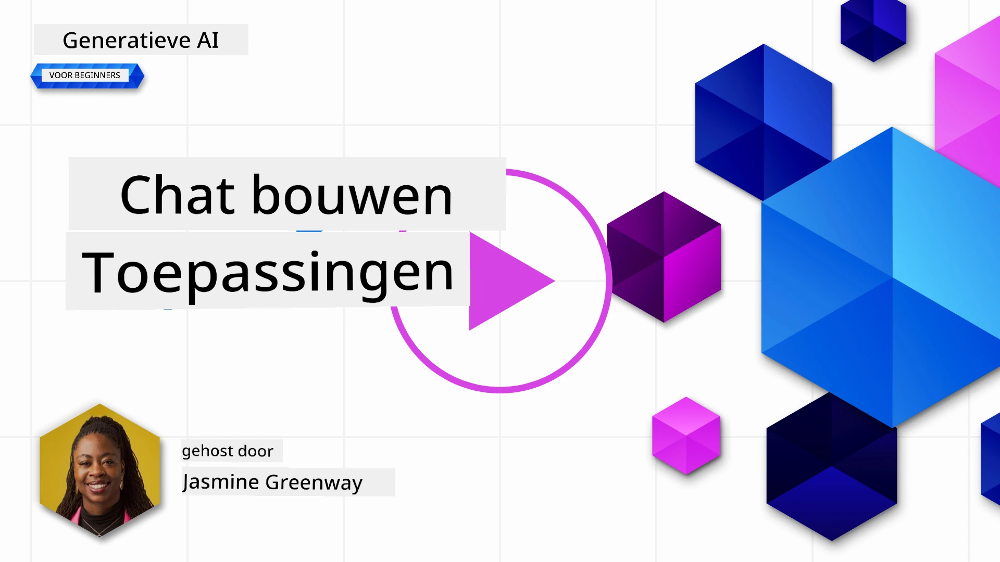
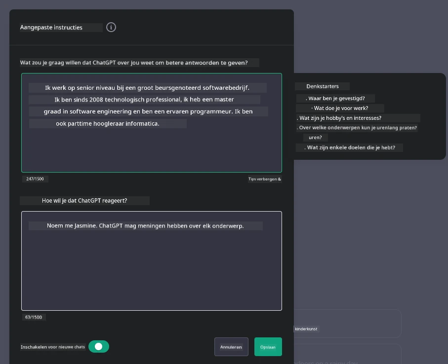
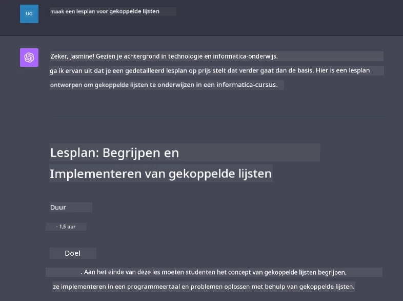

# Het bouwen van generatieve AI-aangedreven chatapplicaties

[](https://youtu.be/R9V0ZY1BEQo?si=IHuU-fS9YWT8s4sA)

> _(Klik op de afbeelding hierboven om de video van deze les te bekijken)_

Nu we hebben gezien hoe we tekstgeneratie-apps kunnen bouwen, gaan we kijken naar chatapplicaties.

Chatapplicaties zijn geïntegreerd in ons dagelijks leven en bieden meer dan alleen een middel voor informele gesprekken. Ze zijn onmisbare onderdelen van klantenservice, technische ondersteuning en zelfs geavanceerde adviesystemen. Het is waarschijnlijk dat je niet zo lang geleden hulp hebt gekregen van een chatapplicatie. Naarmate we geavanceerdere technologieën zoals generatieve AI in deze platforms integreren, neemt de complexiteit toe en daarmee ook de uitdagingen.

Enkele vragen die beantwoord moeten worden zijn:

- **Het bouwen van de app**. Hoe bouwen we deze AI-aangedreven applicaties efficiënt en integreren we ze naadloos voor specifieke gebruikssituaties?
- **Monitoring**. Nadat ze zijn ingezet, hoe kunnen we monitoren en garanderen dat de applicaties op het hoogste kwaliteitsniveau presteren, zowel qua functionaliteit als in overeenstemming met de [zes principes van verantwoordelijke AI](https://www.microsoft.com/ai/responsible-ai?WT.mc_id=academic-105485-koreyst)?

Nu we verder richting een tijdperk van automatisering en naadloze mens-machine-interacties gaan, wordt het essentieel te begrijpen hoe generatieve AI de reikwijdte, diepgang en aanpasbaarheid van chatapplicaties transformeert. Deze les onderzoekt de architecturale aspecten die deze complexe systemen ondersteunen, belicht methodologieën voor verfijning gericht op domeinspecifieke taken, en beoordeelt de metrics en overwegingen die relevant zijn voor een verantwoordelijke AI-uitrol.

## Introductie

Deze les behandelt:

- Technieken voor het efficiënt bouwen en integreren van chatapplicaties.
- Hoe aanpassing en fine-tuning toe te passen op applicaties.
- Strategieën en overwegingen voor het effectief monitoren van chatapplicaties.

## Leerdoelen

Aan het einde van deze les kun je:

- Beschrijven welke overwegingen er zijn bij het bouwen en integreren van chatapplicaties in bestaande systemen.
- Chatapplicaties aanpassen voor specifieke gebruikssituaties.
- Belangrijke metrics en overwegingen identificeren om AI-aangedreven chatapplicaties effectief te monitoren en te onderhouden.
- Ervoor zorgen dat chatapplicaties AI op verantwoorde wijze benutten.

## Generatieve AI integreren in chatapplicaties

Het verbeteren van chatapplicaties met generatieve AI draait niet enkel om ze slimmer maken; het gaat om het optimaliseren van hun architectuur, prestaties en gebruikersinterface om een kwalitatieve gebruikerservaring te leveren. Dit omvat het onderzoeken van architectonische fundamenten, API-integraties en gebruikersinterface-overwegingen. Dit gedeelte biedt een uitgebreid stappenplan om deze complexe landschappen te navigeren, of je ze nu in bestaande systemen integreert of als zelfstandige platforms bouwt.

Aan het einde van dit gedeelte beschik je over de expertise die nodig is om chatapplicaties efficiënt te bouwen en te integreren.

### Chatbot of chatapplicatie?

Voordat we dieper ingaan op het bouwen van chatapplicaties, vergelijken we 'chatbots' met 'AI-aangedreven chatapplicaties', die elk een eigen rol en functionaliteit vervullen. Het hoofddoel van een chatbot is het automatiseren van specifieke gesprekstaken, zoals het beantwoorden van veelgestelde vragen of het volgen van een pakket. Het wordt meestal gestuurd door regelgebaseerde logica of complexe AI-algoritmen. Daarentegen is een AI-aangedreven chatapplicatie een veel breder platform, ontworpen om diverse vormen van digitale communicatie te faciliteren, zoals tekst-, spraak- en videogesprekken tussen menselijke gebruikers. Het onderscheidende kenmerk is de integratie van een generatief AI-model dat genuanceerde, mensachtige gesprekken simuleert en antwoorden genereert op basis van een breed scala aan input en contextuele aanwijzingen. Een generatieve AI-aangedreven chatapplicatie kan deelnemen aan open-domein discussies, zich aanpassen aan evoluerende gesprekssituaties en zelfs creatieve of complexe dialogen produceren.

De onderstaande tabel geeft de belangrijkste verschillen en overeenkomsten weer om hun unieke rollen in digitale communicatie te begrijpen.

| Chatbot                               | Generatieve AI-aangedreven chatapplicatie              |
| ------------------------------------- | ------------------------------------------------------- |
| Taakgericht en regelgebaseerd         | Contextbewust                                          |
| Vaak geïntegreerd in grotere systemen | Kan één of meerdere chatbots hosten                     |
| Beperkt tot geprogrammeerde functies  | Bevat generatieve AI-modellen                           |
| Gespecialiseerde & gestructureerde interacties | In staat tot open-domeindiscussies                  |

### Gebruikmaken van vooraf gebouwde functionaliteiten met SDK's en API's

Bij het bouwen van een chatapplicatie is het een goed eerste stap te beoordelen wat er al beschikbaar is. Het gebruiken van SDK's en API's voor het bouwen van chatapplicaties is een voordelige strategie om verschillende redenen. Door goed gedocumenteerde SDK's en API's te integreren, positioneer je je applicatie strategisch voor langdurig succes, waarbij schaalbaarheid en onderhoud worden aangepakt.

- **Versnelt het ontwikkelproces en vermindert overhead**: Vertrouwen op vooraf gebouwde functionaliteiten in plaats van deze zelf duur te ontwikkelen, stelt je in staat je te richten op andere aspecten van je applicatie die belangrijker kunnen zijn, zoals businesslogica.
- **Betere prestaties**: Bij het zelf bouwen vraag je je uiteindelijk af "Hoe schaalt dit? Kan deze applicatie een plotselinge toestroom van gebruikers aan?" Goed onderhouden SDK's en API's hebben vaak ingebouwde oplossingen voor deze zorgen.
- **Makkelijker onderhoud**: Updates en verbeteringen zijn eenvoudiger te beheren, aangezien de meeste API's en SDK's alleen een update van een bibliotheek vereisen wanneer een nieuwere versie wordt vrijgegeven.
- **Toegang tot state-of-the-art technologie**: Het benutten van modellen die zijn fijngestemd en getraind op uitgebreide datasets biedt je applicatie mogelijkheden voor natuurlijke taalverwerking.

Toegang tot functionaliteit van een SDK of API vereist meestal toestemming om de geleverde services te gebruiken, vaak via een unieke sleutel of authenticatietoken. We gebruiken de OpenAI Python-bibliotheek om dit te verkennen. Je kunt het ook zelf uitproberen in de volgende [notebook voor OpenAI](./python/oai-assignment.ipynb?WT.mc_id=academic-105485-koreyst) of [notebook voor Azure OpenAI Services](./python/aoai-assignment.ipynb?WT.mc_id=academic-105485-koreys) voor deze les.

```python
import os
from openai import OpenAI

API_KEY = os.getenv("OPENAI_API_KEY","")

client = OpenAI(
    api_key=API_KEY
    )

response = client.responses.create(model="gpt-5-mini", input="Suggest two titles for an instructional lesson on chat applications for generative AI.", store=False)
print(response.output_text)
```

Het bovenstaande voorbeeld gebruikt het GPT-5 mini-model met de Responses API om de prompt te voltooien, maar let op dat de API-sleutel van tevoren is ingesteld. Je zou een foutmelding krijgen als je de sleutel niet instelt.

## Gebruikerservaring (UX)

Algemene UX-principes gelden ook voor chatapplicaties, maar hier zijn enkele aanvullende overwegingen die vooral belangrijk worden vanwege de machinaal leren componenten.

- **Mechanisme om ambiguïteit aan te pakken**: Generatieve AI-modellen genereren soms vage antwoorden. Een functie waarmee gebruikers om verduidelijking kunnen vragen kan nuttig zijn als ze dit probleem tegenkomen.
- **Contextbehoud**: Geavanceerde generatieve AI-modellen kunnen context binnen een gesprek onthouden, wat een essentiële hulp kan zijn voor de gebruikerservaring. Gebruikers controle geven over het beheren van context verbetert de ervaring, maar brengt ook risico's mee op het gebied van het bewaren van gevoelige gebruikersinformatie. Overwegingen over hoe lang deze informatie wordt opgeslagen, zoals het invoeren van een bewaarbeleid, kunnen de behoefte aan context afwegen tegen privacy.
- **Personalisatie**: Met de mogelijkheid om te leren en zich aan te passen, bieden AI-modellen een gepersonaliseerde ervaring voor gebruikers. Het afstemmen van de gebruikerservaring met functies zoals gebruikersprofielen zorgt er niet alleen voor dat de gebruiker zich begrepen voelt, maar ondersteunt ook het vinden van specifieke antwoorden, wat de interactie efficiënter en bevredigender maakt.

Een voorbeeld van personalisatie is de instelling "Aangepaste instructies" in OpenAI's ChatGPT. Hiermee kun je informatie over jezelf geven die belangrijke context voor je prompts kan zijn. Hier is een voorbeeld van een aangepaste instructie.



Dit "profiel" vraagt ChatGPT om een lesplan over gekoppelde lijsten te maken. Let op dat ChatGPT rekening houdt met het feit dat de gebruiker wellicht een diepgaander lesplan wil op basis van haar ervaring.



### Microsoft's Systeembericht-framework voor Grote Taalmodellen

[Microsoft heeft richtlijnen verstrekt](https://learn.microsoft.com/azure/ai-foundry/openai/concepts/system-message#define-the-models-output-format?WT.mc_id=academic-105485-koreyst) voor het schrijven van effectieve systeemberichten bij het genereren van antwoorden van LLM's, opgesplitst in 4 gebieden:

1. Definiëren voor wie het model is, evenals de mogelijkheden en beperkingen.
2. Definiëren van het uitvoerformaat van het model.
3. Specifieke voorbeelden geven die het beoogde gedrag van het model demonstreren.
4. Bieden van aanvullende gedragsrichtlijnen.

### Toegankelijkheid

Of een gebruiker nu visuele, auditieve, motorische of cognitieve beperkingen heeft, een goed ontworpen chatapplicatie moet voor iedereen bruikbaar zijn. De volgende lijst onderscheidt specifieke functies gericht op het verbeteren van de toegankelijkheid voor diverse gebruikersbeperkingen.

- **Functies voor visuele beperkingen**: Thema's met hoog contrast en aanpasbare tekst, compatibiliteit met schermlezers.
- **Functies voor auditieve beperkingen**: Tekst-naar-spraak en spraak-naar-tekst functies, visuele signalen voor geluidsmeldingen.
- **Functies voor motorische beperkingen**: Ondersteuning voor toetsenbordnavigatie, spraakopdrachten.
- **Functies voor cognitieve beperkingen**: Opties voor vereenvoudigde taal.

## Aanpassing en fine-tuning voor domeinspecifieke taalmodellen

Stel je een chatapplicatie voor die de vaktaal van jouw bedrijf begrijpt en anticipeert op specifieke vragen die de gebruikers vaak hebben. Er zijn een paar benaderingen het vermelden waard:

- **Gebruik maken van DSL-modellen**. DSL staat voor domeinspecifieke taal. Je kunt een zogenaamd DSL-model benutten dat getraind is op een specifiek domein om de concepten en scenario's daarvan te begrijpen.
- **Fine-tuning toepassen**. Fine-tuning is het proces waarbij je je model verder traint met specifieke data.

## Aanpassing: Gebruik van een DSL

Het benutten van domeinspecifieke taalmodellen (DSL-modellen) kan de gebruikersbetrokkenheid verbeteren door gespecialiseerde, contextueel relevante interacties te bieden. Het is een model dat getraind of fijngestemd is om tekst te begrijpen en te genereren die gerelateerd is aan een specifiek vakgebied, industrie of onderwerp. Opties voor het gebruik van een DSL-model variëren van het vanaf nul trainen van een model tot het gebruiken van bestaande via SDK's en API's. Een andere optie is fine-tuning, waarbij een bestaand getraind model wordt aangepast voor een specifiek domein.

## Aanpassing: Fine-tuning toepassen

Fine-tuning wordt vaak overwogen wanneer een voorgetraind model tekortschiet in een gespecialiseerd domein of specifieke taak.

Bijvoorbeeld: medische vragen zijn complex en vereisen veel context. Wanneer een medisch specialist een patiënt diagnosticeert, baseert die zich op diverse factoren zoals levensstijl of bestaande aandoeningen, en vertrouwt mogelijk op recente medische tijdschriften om diagnoses te onderbouwen. In zulke genuanceerde scenario's is een algemeen AI-chatmodel geen betrouwbare bron.

### Scenario: een medische toepassing

Denk aan een chatapplicatie die medische professionals ondersteunt door snelle referenties te bieden aan behandelrichtlijnen, medicatie-interacties of recente onderzoeksresultaten.

Een algemeen model kan voldoende zijn voor basisvragen of algemeen advies, maar kan moeite hebben met:

- **Zeer specifieke of complexe gevallen**. Bijvoorbeeld: een neuroloog vraagt, "Wat zijn de huidige best practices voor het behandelen van medicijnresistente epilepsie bij pediatrische patiënten?"
- **Ontbreken van recente ontwikkelingen**. Een algemeen model kan worstelen om een actueel antwoord te geven dat de nieuwste ontwikkelingen in neurologie en farmacologie incorporeert.

In zulke gevallen kan het fijn afstemmen van het model met een gespecialiseerde medische dataset de nauwkeurigheid en betrouwbaarheid bij het behandelen van deze complexe medische vragen aanzienlijk verbeteren. Dit vraagt om toegang tot een grote en relevante dataset die de domeinspecifieke uitdagingen en vragen volledig vertegenwoordigt.

## Overwegingen voor een hoogwaardige AI-gedreven chatervaring

Dit gedeelte beschrijft de criteria voor "hoogwaardige" chatapplicaties, waaronder het vastleggen van bruikbare meetgegevens en het naleven van een kader dat AI-technologie op verantwoorde wijze benut.

### Belangrijke metrics

Om de hoge kwaliteit van prestaties van een applicatie te waarborgen, is het essentieel om belangrijke metrics en overwegingen bij te houden. Deze metingen zorgen niet alleen voor de functionaliteit van de applicatie maar beoordelen ook de kwaliteit van het AI-model en de gebruikerservaring. Hieronder staat een lijst met basis-, AI- en gebruikerservaringsmetrics om te overwegen.

| Metric                        | Definitie                                                                                                             | Overwegingen voor chatontwikkelaar                                   |
| ----------------------------- | ---------------------------------------------------------------------------------------------------------------------- | ------------------------------------------------------------------- |
| **Beschikbaarheid (Uptime)** | Meet de tijd dat de applicatie operationeel en toegankelijk is voor gebruikers.                                         | Hoe minimaliseer je downtime?                                       |
| **Reactietijd**               | De tijd die de applicatie nodig heeft om op een gebruikerquery te reageren.                                            | Hoe kun je de queryverwerking optimaliseren om reactietijd te verbeteren? |
| **Precisie**                 | De verhouding van correcte positieve voorspellingen tot het totaal aantal positieve voorspellingen                      | Hoe valideer je de precisie van je model?                           |
| **Recall (Gevoeligheid)**     | De verhouding van correcte positieve voorspellingen tot het werkelijke aantal positieve gevallen                       | Hoe meet en verbeter je de recall?                                 |
| **F1-score**                 | Het harmonisch gemiddelde van precisie en recall, dat de afweging tussen beide balanceert                              | Wat is je streef-F1-score? Hoe balanceer je precisie en recall?    |
| **Perplexiteit**             | Meet hoe goed de door het model voorspelde waarschijnlijkheidsverdeling aansluit bij de werkelijke dataverdeling     | Hoe minimaliseer je perplexiteit?                                  |
| **Gebruikerstevredenheid Metrics** | Meet de perceptie van de gebruiker van de applicatie. Wordt vaak vastgelegd via enquêtes.                            | Hoe vaak verzamel je gebruikersfeedback? Hoe pas je je daarop aan?|
| **Foutpercentage**           | Het percentage fouten dat het model maakt in begrip of output                                                         | Welke strategieën heb je om foutpercentages te verminderen?       |
| **Hertrainingscycli**        | De frequentie waarmee het model wordt bijgewerkt met nieuwe data en inzichten                                         | Hoe vaak hertrain je het model? Wat veroorzaakt een hertrainingscyclus? |

| **Anomaliedetectie**         | Hulpmiddelen en technieken voor het identificeren van ongebruikelijke patronen die niet overeenkomen met verwacht gedrag.                        | Hoe ga je reageren op anomalieën?                                        |

### Implementatie van Verantwoorde AI-praktijken in Chatapplicaties

Microsoft's benadering van Verantwoorde AI heeft zes principes geïdentificeerd die AI-ontwikkeling en -gebruik zouden moeten leiden. Hieronder staan de principes, hun definitie en zaken waar een chatontwikkelaar op moet letten en waarom ze dit serieus moeten nemen.

| Principes             | Definitie van Microsoft                                | Overwegingen voor Chatontwikkelaar                                      | Waarom het Belangrijk Is                                                                     |
| ---------------------- | ----------------------------------------------------- | ---------------------------------------------------------------------- | -------------------------------------------------------------------------------------- |
| Eerlijkheid               | AI-systemen moeten alle mensen eerlijk behandelen.            | Zorg ervoor dat de chatapplicatie niet discrimineert op basis van gebruikersgegevens.  | Om vertrouwen en inclusiviteit onder gebruikers op te bouwen; voorkomt juridische consequenties.                |
| Betrouwbaarheid en Veiligheid | AI-systemen moeten betrouwbaar en veilig presteren.        | Implementeer testen en fail-safes om fouten en risico’s te minimaliseren.         | Zorgt voor gebruikerstevredenheid en voorkomt mogelijke schade.                                 |
| Privacy en Beveiliging   | AI-systemen moeten veilig zijn en privacy respecteren.      | Implementeer sterke encryptie en gegevensbeschermingsmaatregelen.              | Om gevoelige gebruikersgegevens te beschermen en te voldoen aan privacywetgeving.                         |
| Inclusiviteit          | AI-systemen moeten iedereen ondersteunen en mensen betrekken. | Ontwerp UI/UX die toegankelijk en gebruiksvriendelijk is voor diverse doelgroepen. | Zorgt ervoor dat een breder publiek de applicatie effectief kan gebruiken.                   |
| Transparantie           | AI-systemen moeten begrijpelijk zijn.                  | Bied duidelijke documentatie en uitleg voor AI-reacties.            | Gebruikers vertrouwen een systeem meer als ze begrijpen hoe beslissingen worden genomen. |
| Verantwoordingsplicht         | Mensen moeten verantwoordelijk zijn voor AI-systemen.          | Stel een duidelijk proces in voor het auditen en verbeteren van AI-beslissingen.     | Maakt voortdurende verbetering en corrigerende maatregelen mogelijk bij fouten.               |

## Opdracht

Zie [assignment](../../../07-building-chat-applications/python). Dit leidt je door een reeks oefeningen, van het uitvoeren van je eerste chatprompts tot het classificeren en samenvatten van tekst en meer. Let op dat de opdrachten beschikbaar zijn in verschillende programmeertalen!

## Geweldig Werk! Ga Verder met de Reis

Na het voltooien van deze les, bekijk onze [Generatieve AI Leercollectie](https://aka.ms/genai-collection?WT.mc_id=academic-105485-koreyst) om je Generatieve AI-kennis verder te ontwikkelen!

Ga naar Les 8 om te zien hoe je kunt beginnen met [het bouwen van zoekapplicaties](../08-building-search-applications/README.md?WT.mc_id=academic-105485-koreyst)!

---

<!-- CO-OP TRANSLATOR DISCLAIMER START -->
**Disclaimer**:
Dit document is vertaald met behulp van de AI vertaaldienst [Co-op Translator](https://github.com/Azure/co-op-translator). Hoewel we streven naar nauwkeurigheid, dient u er rekening mee te houden dat geautomatiseerde vertalingen fouten of onnauwkeurigheden kunnen bevatten. Het originele document in de oorspronkelijke taal moet worden beschouwd als de gezaghebbende bron. Voor kritieke informatie wordt professionele menselijke vertaling aanbevolen. Wij zijn niet aansprakelijk voor eventuele misverstanden of verkeerde interpretaties die voortvloeien uit het gebruik van deze vertaling.
<!-- CO-OP TRANSLATOR DISCLAIMER END -->