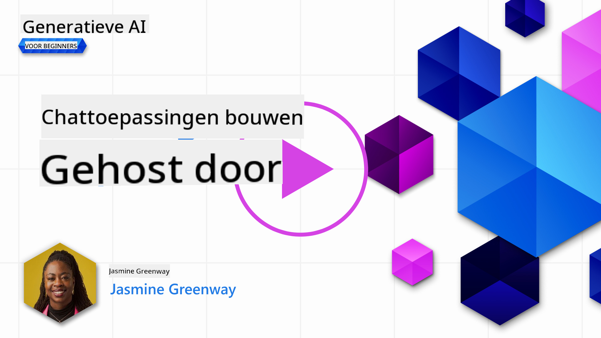
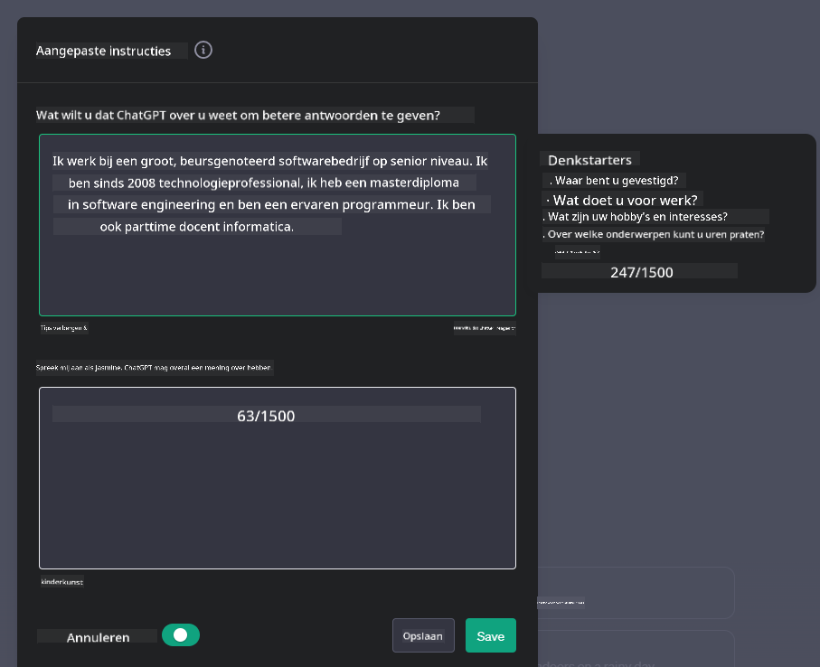
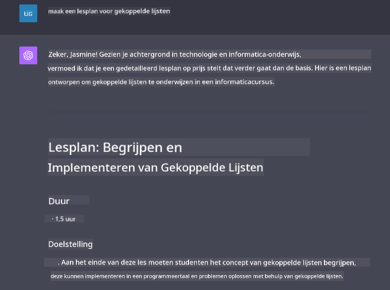

<!--
CO_OP_TRANSLATOR_METADATA:
{
  "original_hash": "ea4bbe640847aafbbba14dae4625e9af",
  "translation_date": "2025-07-09T12:33:15+00:00",
  "source_file": "07-building-chat-applications/README.md",
  "language_code": "nl"
}
-->
# Generatieve AI-Chatapplicaties Bouwen

[](https://aka.ms/gen-ai-lessons7-gh?WT.mc_id=academic-105485-koreyst)

> _(Klik op de afbeelding hierboven om de video van deze les te bekijken)_

Nu we hebben gezien hoe we tekstgeneratie-apps kunnen bouwen, richten we ons op chatapplicaties.

Chatapplicaties zijn geïntegreerd in ons dagelijks leven en bieden meer dan alleen een middel voor informele gesprekken. Ze zijn onmisbare onderdelen van klantenservice, technische ondersteuning en zelfs geavanceerde adviesystemen. Het is waarschijnlijk dat je onlangs nog hulp hebt gekregen via een chatapplicatie. Naarmate we geavanceerdere technologieën zoals generatieve AI in deze platforms integreren, neemt de complexiteit toe en daarmee ook de uitdagingen.

Enkele vragen die we moeten beantwoorden zijn:

- **De app bouwen**. Hoe bouwen we deze AI-gestuurde applicaties efficiënt en integreren we ze naadloos voor specifieke toepassingen?
- **Monitoring**. Hoe kunnen we, eenmaal geïmplementeerd, de applicaties monitoren en ervoor zorgen dat ze op het hoogste kwaliteitsniveau functioneren, zowel qua functionaliteit als in lijn met de [zes principes van verantwoord AI](https://www.microsoft.com/ai/responsible-ai?WT.mc_id=academic-105485-koreyst)?

Naarmate we verder gaan in een tijdperk dat wordt gekenmerkt door automatisering en naadloze interacties tussen mens en machine, wordt het essentieel te begrijpen hoe generatieve AI de reikwijdte, diepgang en aanpasbaarheid van chatapplicaties transformeert. Deze les onderzoekt de architecturale aspecten die deze complexe systemen ondersteunen, gaat in op methoden voor het fijn afstemmen voor domeinspecifieke taken en evalueert de meetwaarden en overwegingen die relevant zijn voor een verantwoorde AI-implementatie.

## Introductie

Deze les behandelt:

- Technieken voor het efficiënt bouwen en integreren van chatapplicaties.
- Hoe je aanpassingen en fijn afstemmen toepast op applicaties.
- Strategieën en overwegingen om chatapplicaties effectief te monitoren.

## Leerdoelen

Aan het einde van deze les kun je:

- Beschrijven welke overwegingen er zijn bij het bouwen en integreren van chatapplicaties in bestaande systemen.
- Chatapplicaties aanpassen voor specifieke toepassingen.
- Belangrijke meetwaarden en overwegingen identificeren om de kwaliteit van AI-gestuurde chatapplicaties effectief te monitoren en te onderhouden.
- Zorgen dat chatapplicaties AI op een verantwoorde manier inzetten.

## Generatieve AI integreren in chatapplicaties

Het verbeteren van chatapplicaties met generatieve AI draait niet alleen om ze slimmer maken; het gaat om het optimaliseren van de architectuur, prestaties en gebruikersinterface om een kwalitatieve gebruikerservaring te bieden. Dit omvat het onderzoeken van de architecturale basis, API-integraties en gebruikersinterface-overwegingen. Dit onderdeel biedt een uitgebreide routekaart om deze complexe gebieden te navigeren, of je ze nu in bestaande systemen integreert of als zelfstandige platforms bouwt.

Aan het einde van dit onderdeel beschik je over de kennis om chatapplicaties efficiënt te bouwen en te integreren.

### Chatbot of chatapplicatie?

Voordat we aan de slag gaan met het bouwen van chatapplicaties, vergelijken we 'chatbots' met 'AI-gestuurde chatapplicaties', die elk een eigen rol en functionaliteit hebben. Het hoofddoel van een chatbot is het automatiseren van specifieke gesprekstaken, zoals het beantwoorden van veelgestelde vragen of het volgen van een pakket. Dit gebeurt meestal op basis van regelgebaseerde logica of complexe AI-algoritmes. Een AI-gestuurde chatapplicatie is daarentegen een veel uitgebreider platform dat verschillende vormen van digitale communicatie faciliteert, zoals tekst-, spraak- en videogesprekken tussen menselijke gebruikers. Het onderscheidende kenmerk is de integratie van een generatief AI-model dat genuanceerde, mensachtige gesprekken simuleert en antwoorden genereert op basis van diverse input en contextuele aanwijzingen. Een generatieve AI-chatapplicatie kan open gesprekken voeren, zich aanpassen aan veranderende contexten en zelfs creatieve of complexe dialogen produceren.

De onderstaande tabel geeft de belangrijkste verschillen en overeenkomsten weer om hun unieke rollen in digitale communicatie te verduidelijken.

| Chatbot                               | Generatieve AI-Chatapplicatie           |
| ------------------------------------- | -------------------------------------- |
| Taakgericht en regelgebaseerd         | Contextbewust                         |
| Vaak geïntegreerd in grotere systemen | Kan één of meerdere chatbots bevatten  |
| Beperkt tot geprogrammeerde functies  | Maakt gebruik van generatieve AI-modellen |
| Gespecialiseerde & gestructureerde interacties | In staat tot open gesprekken          |

### Gebruikmaken van kant-en-klare functionaliteiten met SDK's en API's

Bij het bouwen van een chatapplicatie is het een goed begin om te kijken wat er al beschikbaar is. Het gebruik van SDK's en API's om chatapplicaties te bouwen is om verschillende redenen een slimme strategie. Door goed gedocumenteerde SDK's en API's te integreren, positioneer je je applicatie strategisch voor langdurig succes, met aandacht voor schaalbaarheid en onderhoud.

- **Versnelt het ontwikkelproces en vermindert overhead**: Door te vertrouwen op kant-en-klare functionaliteiten in plaats van deze zelf te bouwen, kun je je richten op andere belangrijke aspecten van je applicatie, zoals de bedrijfslogica.
- **Betere prestaties**: Bij het zelf bouwen van functionaliteit vraag je je uiteindelijk af: "Hoe schaalt dit? Kan deze applicatie een plotselinge toestroom van gebruikers aan?" Goed onderhouden SDK's en API's bieden vaak ingebouwde oplossingen voor deze uitdagingen.
- **Eenvoudiger onderhoud**: Updates en verbeteringen zijn makkelijker te beheren, omdat de meeste API's en SDK's alleen een update van een bibliotheek vereisen wanneer een nieuwe versie uitkomt.
- **Toegang tot geavanceerde technologie**: Door gebruik te maken van modellen die zijn fijn afgestemd en getraind op uitgebreide datasets, krijgt je applicatie natuurlijke taalverwerkingsmogelijkheden.

Toegang krijgen tot de functionaliteit van een SDK of API vereist meestal toestemming om de aangeboden diensten te gebruiken, vaak via een unieke sleutel of authenticatietoken. We gebruiken de OpenAI Python Library om te laten zien hoe dit werkt. Je kunt het ook zelf uitproberen in de volgende [notebook voor OpenAI](python/oai-assignment.ipynb) of [notebook voor Azure OpenAI Services](python/aoai-assignment.ipynb) voor deze les.

```python
import os
from openai import OpenAI

API_KEY = os.getenv("OPENAI_API_KEY","")

client = OpenAI(
    api_key=API_KEY
    )

chat_completion = client.chat.completions.create(model="gpt-3.5-turbo", messages=[{"role": "user", "content": "Suggest two titles for an instructional lesson on chat applications for generative AI."}])
```

Het bovenstaande voorbeeld gebruikt het GPT-3.5 Turbo-model om de prompt te voltooien, maar let op dat de API-sleutel vooraf is ingesteld. Zonder deze sleutel krijg je een foutmelding.

## Gebruikerservaring (UX)

Algemene UX-principes gelden ook voor chatapplicaties, maar hier zijn enkele extra aandachtspunten die vooral belangrijk worden door de machine learning-componenten.

- **Mechanisme om ambiguïteit aan te pakken**: Generatieve AI-modellen genereren soms vage of dubbelzinnige antwoorden. Een functie waarmee gebruikers om verduidelijking kunnen vragen, kan nuttig zijn als ze hiermee te maken krijgen.
- **Contextbehoud**: Geavanceerde generatieve AI-modellen kunnen context binnen een gesprek onthouden, wat een waardevolle toevoeging is voor de gebruikerservaring. Gebruikers de mogelijkheid geven om context te beheren verbetert de ervaring, maar brengt ook het risico met zich mee dat gevoelige informatie wordt opgeslagen. Overwegingen over hoe lang deze informatie wordt bewaard, bijvoorbeeld door een bewaarbeleid in te voeren, kunnen de behoefte aan context afwegen tegen privacy.
- **Personalisatie**: Met het vermogen om te leren en zich aan te passen, bieden AI-modellen een gepersonaliseerde ervaring. Het afstemmen van de gebruikerservaring via functies zoals gebruikersprofielen zorgt er niet alleen voor dat de gebruiker zich begrepen voelt, maar helpt ook bij het sneller vinden van specifieke antwoorden, wat leidt tot een efficiëntere en prettigere interactie.

Een voorbeeld van personalisatie is de instelling "Custom instructions" in OpenAI's ChatGPT. Hiermee kun je informatie over jezelf geven die belangrijk kan zijn als context voor je prompts. Hier is een voorbeeld van zo’n aangepaste instructie.



Dit "profiel" vraagt ChatGPT om een lesplan te maken over gekoppelde lijsten. Let op dat ChatGPT rekening houdt met het feit dat de gebruiker een diepgaander lesplan wil, gebaseerd op haar ervaring.



### Microsoft’s System Message Framework voor Large Language Models

[Microsoft heeft richtlijnen opgesteld](https://learn.microsoft.com/azure/ai-services/openai/concepts/system-message#define-the-models-output-format?WT.mc_id=academic-105485-koreyst) voor het schrijven van effectieve systeemberichten bij het genereren van antwoorden van LLM’s, onderverdeeld in 4 gebieden:

1. Definiëren voor wie het model bedoeld is, inclusief de mogelijkheden en beperkingen.
2. Definiëren van het outputformaat van het model.
3. Voorbeelden geven die het beoogde gedrag van het model illustreren.
4. Extra gedragsregels toevoegen.

### Toegankelijkheid

Of een gebruiker nu visuele, auditieve, motorische of cognitieve beperkingen heeft, een goed ontworpen chatapplicatie moet voor iedereen bruikbaar zijn. De volgende lijst geeft specifieke functies weer die gericht zijn op het verbeteren van de toegankelijkheid voor verschillende beperkingen.

- **Functies voor visuele beperkingen**: Hoog contrast thema’s en aanpasbare tekstgrootte, compatibiliteit met schermlezers.
- **Functies voor auditieve beperkingen**: Tekst-naar-spraak en spraak-naar-tekst functies, visuele signalen voor audio-meldingen.
- **Functies voor motorische beperkingen**: Ondersteuning voor toetsenbordnavigatie, spraakopdrachten.
- **Functies voor cognitieve beperkingen**: Opties voor vereenvoudigde taal.

## Aanpassing en fijn afstemmen voor domeinspecifieke taalmodellen

Stel je een chatapplicatie voor die de jargon van jouw bedrijf begrijpt en anticipeert op de specifieke vragen die gebruikers vaak stellen. Er zijn een paar benaderingen die het vermelden waard zijn:

- **Gebruik maken van DSL-modellen**. DSL staat voor domain specific language. Je kunt een zogenaamd DSL-model gebruiken dat getraind is op een specifiek domein om de concepten en scenario’s daarvan te begrijpen.
- **Fijn afstemmen toepassen**. Fijn afstemmen is het proces waarbij je je model verder traint met specifieke data.

## Aanpassing: Gebruik van een DSL

Het inzetten van domeinspecifieke taalmodellen (DSL-modellen) kan de betrokkenheid van gebruikers vergroten door gespecialiseerde, contextueel relevante interacties te bieden. Het is een model dat getraind of fijn afgestemd is om tekst te begrijpen en te genereren die gerelateerd is aan een bepaald vakgebied, industrie of onderwerp. Opties voor het gebruik van een DSL-model variëren van het zelf trainen van een model tot het gebruiken van bestaande via SDK's en API's. Een andere optie is fijn afstemmen, waarbij een bestaand voorgetraind model wordt aangepast voor een specifiek domein.

## Aanpassing: Fijn afstemmen toepassen

Fijn afstemmen wordt vaak overwogen wanneer een voorgetraind model tekortschiet in een gespecialiseerd domein of specifieke taak.

Bijvoorbeeld, medische vragen zijn complex en vereisen veel context. Wanneer een medisch specialist een patiënt diagnosticeert, baseert hij zich op diverse factoren zoals levensstijl of bestaande aandoeningen, en kan zelfs recente medische publicaties raadplegen om de diagnose te onderbouwen. In zulke genuanceerde situaties is een algemeen AI-chatmodel geen betrouwbare bron.

### Scenario: een medische applicatie

Denk aan een chatapplicatie die medische professionals helpt door snelle verwijzingen te geven naar behandelrichtlijnen, medicijninteracties of recente onderzoeksresultaten.

Een algemeen model kan voldoende zijn voor het beantwoorden van basis medische vragen of het geven van algemeen advies, maar kan moeite hebben met:

- **Zeer specifieke of complexe gevallen**. Bijvoorbeeld, een neuroloog vraagt: "Wat zijn de huidige beste praktijken voor het behandelen van medicijnresistente epilepsie bij kinderen?"
- **Ontbreken van recente ontwikkelingen**. Een algemeen model kan moeite hebben om een actueel antwoord te geven dat de nieuwste ontwikkelingen in neurologie en farmacologie omvat.

In zulke gevallen kan het fijn afstemmen van het model met een gespecialiseerd medisch dataset de nauwkeurigheid en betrouwbaarheid van de antwoorden aanzienlijk verbeteren. Dit vereist toegang tot een grote en relevante dataset die de domeinspecifieke uitdagingen en vragen weerspiegelt.

## Overwegingen voor een hoogwaardige AI-gestuurde chatervaring

Dit onderdeel beschrijft de criteria voor "hoogwaardige" chatapplicaties, waaronder het vastleggen van bruikbare meetwaarden en het naleven van een kader dat AI-technologie op een verantwoorde manier inzet.

### Belangrijke meetwaarden

Om de hoge kwaliteit van een applicatie te waarborgen, is het essentieel om belangrijke meetwaarden en overwegingen bij te houden. Deze metingen zorgen niet alleen voor de functionaliteit van de applicatie, maar beoordelen ook de kwaliteit van het AI-model en de gebruikerservaring. Hieronder een lijst met basis-, AI- en gebruikerservaringsmetingen om rekening mee te houden.

| Meetwaarde                   | Definitie                                                                                                             | Overwegingen voor Chatontwikkelaar                                  |
| ---------------------------- | -------------------------------------------------------------------------------------------------------------------- | ------------------------------------------------------------------ |
| **Uptime**                   | Meet de tijd dat de applicatie operationeel en toegankelijk is voor gebruikers.                                      | Hoe minimaliseer je downtime?                                      |
| **Reactietijd**              | De tijd die de applicatie nodig heeft om te reageren op een gebruikersvraag.                                         | Hoe optimaliseer je de verwerkingstijd om de reactietijd te verbeteren? |
| **Precisie**                 | De verhouding van juiste positieve voorspellingen tot het totaal aantal positieve voorspellingen.                    | Hoe valideer je de precisie van je model?                          |
| **Recall (gevoeligheid)**    | De verhouding van juiste positieve voorspellingen tot het werkelijke aantal positieve gevallen.                      | Hoe meet en verbeter je de recall?                                |
| **F1 Score**                 | Het harmonisch gemiddelde van precisie en recall, dat de balans tussen beide weergeeft.                              | Wat is je streefwaarde voor de F1 Score? Hoe balanceer je precisie en recall? |
| **Perplexity**               | Meet hoe goed de door het model voorspelde waarschijnlijkheidsverdeling overeenkomt met de werkelijke data.        | Hoe minimaliseer je perplexity?                                   |
| **Gebruikerstevredenheid**  | Meet de perceptie van de gebruiker over de applicatie, vaak verzameld via enquêtes.                                 | Hoe vaak verzamel je feedback? Hoe pas je je hierop aan?          |
| **Foutpercentage**           | Het percentage fouten dat het model maakt bij begrip of output.                                                     | Welke strategieën heb je om het foutpercentage te verlagen?       |
| **Hertrainingscycli**       | De frequentie waarmee het model wordt bijgewerkt met nieuwe data en inzichten.                                      | Hoe vaak train je het model opnieuw? Wat triggert een hertrainingscyclus? |
| **Anomaliedetectie**         | Tools en technieken om ongebruikelijke patronen te identificeren die niet overeenkomen met verwacht gedrag.                        | Hoe ga je reageren op anomalieën?                                        |

### Verantwoordelijke AI-praktijken implementeren in chatapplicaties

De aanpak van Microsoft voor Verantwoordelijke AI heeft zes principes vastgesteld die de ontwikkeling en het gebruik van AI moeten sturen. Hieronder vind je de principes, hun definitie, en zaken waar een chatontwikkelaar rekening mee moet houden en waarom dit serieus genomen moet worden.

| Principes              | Definitie van Microsoft                                | Overwegingen voor chatontwikkelaar                                      | Waarom het belangrijk is                                                               |
| ---------------------- | ----------------------------------------------------- | ---------------------------------------------------------------------- | -------------------------------------------------------------------------------------- |
| Eerlijkheid            | AI-systemen moeten alle mensen eerlijk behandelen.    | Zorg dat de chatapplicatie niet discrimineert op basis van gebruikersgegevens.  | Om vertrouwen en inclusiviteit onder gebruikers te bevorderen; voorkomt juridische problemen.                |
| Betrouwbaarheid en Veiligheid | AI-systemen moeten betrouwbaar en veilig functioneren. | Voer tests uit en implementeer fail-safes om fouten en risico’s te minimaliseren.         | Zorgt voor tevreden gebruikers en voorkomt mogelijke schade.                                 |
| Privacy en Beveiliging | AI-systemen moeten veilig zijn en privacy respecteren. | Implementeer sterke encryptie en maatregelen voor gegevensbescherming.              | Om gevoelige gebruikersgegevens te beschermen en te voldoen aan privacywetgeving.                         |
| Inclusiviteit          | AI-systemen moeten iedereen versterken en betrekken.  | Ontwerp een UI/UX die toegankelijk en gebruiksvriendelijk is voor diverse doelgroepen. | Zorgt ervoor dat een bredere groep mensen de applicatie effectief kan gebruiken.                   |
| Transparantie          | AI-systemen moeten begrijpelijk zijn.                  | Bied duidelijke documentatie en uitleg over AI-antwoorden.            | Gebruikers vertrouwen een systeem meer als ze begrijpen hoe beslissingen worden genomen. |
| Verantwoordingsplicht  | Mensen moeten verantwoordelijk zijn voor AI-systemen. | Stel een duidelijk proces in voor het auditen en verbeteren van AI-beslissingen.     | Maakt voortdurende verbetering en corrigerende maatregelen bij fouten mogelijk.               |

## Opdracht

Bekijk de [opdracht](../../../07-building-chat-applications/python) die je door een reeks oefeningen leidt, van het uitvoeren van je eerste chatprompts tot het classificeren en samenvatten van tekst en meer. Let op dat de opdrachten beschikbaar zijn in verschillende programmeertalen!

## Goed gedaan! Ga door met de reis

Na het voltooien van deze les, bekijk onze [Generative AI Learning collectie](https://aka.ms/genai-collection?WT.mc_id=academic-105485-koreyst) om je kennis van Generative AI verder te verdiepen!

Ga naar Les 8 om te zien hoe je kunt beginnen met [het bouwen van zoekapplicaties](../08-building-search-applications/README.md?WT.mc_id=academic-105485-koreyst)!

**Disclaimer**:  
Dit document is vertaald met behulp van de AI-vertalingsdienst [Co-op Translator](https://github.com/Azure/co-op-translator). Hoewel we streven naar nauwkeurigheid, dient u er rekening mee te houden dat geautomatiseerde vertalingen fouten of onnauwkeurigheden kunnen bevatten. Het originele document in de oorspronkelijke taal moet als de gezaghebbende bron worden beschouwd. Voor cruciale informatie wordt professionele menselijke vertaling aanbevolen. Wij zijn niet aansprakelijk voor eventuele misverstanden of verkeerde interpretaties die voortvloeien uit het gebruik van deze vertaling.