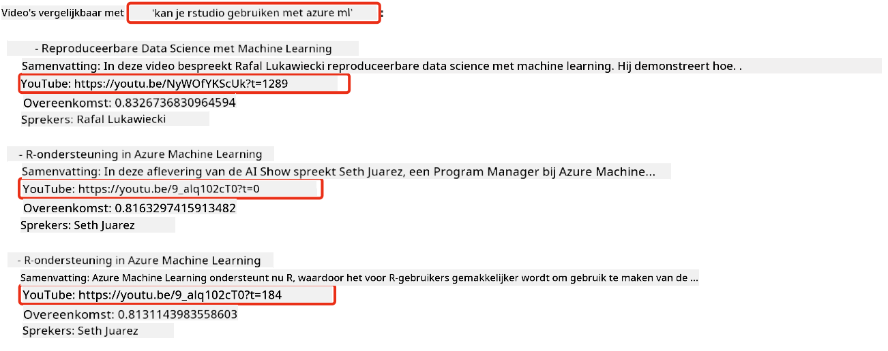

<!--
CO_OP_TRANSLATOR_METADATA:
{
  "original_hash": "d46aad0917a1a342d613e2c13d457da5",
  "translation_date": "2025-05-19T18:35:14+00:00",
  "source_file": "08-building-search-applications/README.md",
  "language_code": "nl"
}
-->
# Een zoekapplicatie bouwen

[](https://aka.ms/gen-ai-lesson8-gh?WT.mc_id=academic-105485-koreyst)

> > _Klik op de afbeelding hierboven om de video van deze les te bekijken_

Er is meer aan LLMs dan chatbots en tekstgeneratie. Het is ook mogelijk om zoekapplicaties te bouwen met behulp van Embeddings. Embeddings zijn numerieke representaties van data, ook wel vectoren genoemd, en kunnen worden gebruikt voor semantische zoekopdrachten naar data.

In deze les ga je een zoekapplicatie bouwen voor onze educatieve startup. Onze startup is een non-profitorganisatie die gratis onderwijs biedt aan studenten in ontwikkelingslanden. Onze startup heeft een groot aantal YouTube-video's die studenten kunnen gebruiken om te leren over AI. Onze startup wil een zoekapplicatie bouwen waarmee studenten een YouTube-video kunnen zoeken door een vraag in te typen.

Een student zou bijvoorbeeld kunnen typen 'Wat zijn Jupyter Notebooks?' of 'Wat is Azure ML' en de zoekapplicatie zal een lijst met YouTube-video's teruggeven die relevant zijn voor de vraag, en nog beter, de zoekapplicatie zal een link teruggeven naar de plaats in de video waar het antwoord op de vraag zich bevindt.

## Introductie

In deze les behandelen we:

- Semantisch versus Keyword zoeken.
- Wat zijn Tekst Embeddings.
- Een Tekst Embeddings Index creëren.
- Zoeken in een Tekst Embeddings Index.

## Leerdoelen

Na het voltooien van deze les kun je:

- Het verschil uitleggen tussen semantisch en keyword zoeken.
- Uitleggen wat Tekst Embeddings zijn.
- Een applicatie maken met Embeddings om naar data te zoeken.

## Waarom een zoekapplicatie bouwen?

Het creëren van een zoekapplicatie helpt je begrijpen hoe je Embeddings kunt gebruiken om naar data te zoeken. Je leert ook hoe je een zoekapplicatie kunt bouwen die door studenten kan worden gebruikt om snel informatie te vinden.

De les bevat een Embedding Index van de YouTube-transcripties voor het Microsoft [AI Show](https://www.youtube.com/playlist?list=PLlrxD0HtieHi0mwteKBOfEeOYf0LJU4O1) YouTube-kanaal. De AI Show is een YouTube-kanaal dat je leert over AI en machine learning. De Embedding Index bevat de Embeddings voor elk van de YouTube-transcripties tot en met oktober 2023. Je zult de Embedding Index gebruiken om een zoekapplicatie voor onze startup te bouwen. De zoekapplicatie geeft een link terug naar de plaats in de video waar het antwoord op de vraag zich bevindt. Dit is een geweldige manier voor studenten om snel de informatie te vinden die ze nodig hebben.

Het volgende is een voorbeeld van een semantische query voor de vraag 'kun je rstudio gebruiken met azure ml?'. Bekijk de YouTube-url, je zult zien dat de url een timestamp bevat die je naar de plaats in de video brengt waar het antwoord op de vraag zich bevindt.



## Wat is semantisch zoeken?

Nu vraag je je misschien af, wat is semantisch zoeken? Semantisch zoeken is een zoektechniek die de semantiek, of betekenis, van de woorden in een query gebruikt om relevante resultaten te retourneren.

Hier is een voorbeeld van een semantische zoekopdracht. Stel dat je een auto wilt kopen, je zou kunnen zoeken naar 'mijn droomauto', semantisch zoeken begrijpt dat je niet `dreaming` over een auto droomt, maar dat je je `ideal` auto wilt kopen. Semantisch zoeken begrijpt je intentie en geeft relevante resultaten terug. Het alternatief is `keyword search`, wat letterlijk zou zoeken naar dromen over auto's en vaak irrelevante resultaten zou teruggeven.

## Wat zijn Tekst Embeddings?

[Text embeddings](https://en.wikipedia.org/wiki/Word_embedding?WT.mc_id=academic-105485-koreyst) zijn een techniek voor tekstrepresentatie die wordt gebruikt in [natuurlijke taalverwerking](https://en.wikipedia.org/wiki/Natural_language_processing?WT.mc_id=academic-105485-koreyst). Tekst embeddings zijn semantische numerieke representaties van tekst. Embeddings worden gebruikt om data te representeren op een manier die gemakkelijk door een machine te begrijpen is. Er zijn veel modellen voor het bouwen van tekst embeddings, in deze les zullen we ons concentreren op het genereren van embeddings met behulp van het OpenAI Embedding Model.

Hier is een voorbeeld, stel je voor dat de volgende tekst in een transcriptie van een van de afleveringen op het AI Show YouTube-kanaal staat:

```text
Today we are going to learn about Azure Machine Learning.
```

We zouden de tekst doorgeven aan de OpenAI Embedding API en het zou de volgende embedding retourneren, bestaande uit 1536 nummers, ook wel een vector genoemd. Elk nummer in de vector vertegenwoordigt een ander aspect van de tekst. Voor de volledigheid zijn hier de eerste 10 nummers in de vector.

```python
[-0.006655829958617687, 0.0026128944009542465, 0.008792596869170666, -0.02446001023054123, -0.008540431968867779, 0.022071078419685364, -0.010703742504119873, 0.003311325330287218, -0.011632772162556648, -0.02187200076878071, ...]
```

## Hoe wordt de Embedding index gecreëerd?

De Embedding index voor deze les is gemaakt met een reeks Python-scripts. Je vindt de scripts samen met instructies in de [README](./scripts/README.md?WT.mc_id=academic-105485-koreyst) in de 'scripts` map voor deze les. Je hoeft deze scripts niet uit te voeren om deze les te voltooien, aangezien de Embedding Index voor je is voorzien.

De scripts voeren de volgende bewerkingen uit:

1. De transcriptie voor elke YouTube-video in de [AI Show](https://www.youtube.com/playlist?list=PLlrxD0HtieHi0mwteKBOfEeOYf0LJU4O1) afspeellijst wordt gedownload.
2. Met behulp van [OpenAI Functions](https://learn.microsoft.com/azure/ai-services/openai/how-to/function-calling?WT.mc_id=academic-105485-koreyst) wordt geprobeerd de naam van de spreker uit de eerste 3 minuten van de YouTube-transcriptie te halen. De naam van de spreker voor elke video wordt opgeslagen in de Embedding Index genaamd `embedding_index_3m.json`.
3. De transcriptietekst wordt vervolgens opgedeeld in **3 minuten tekstsegmenten**. Het segment bevat ongeveer 20 woorden die overlappen met het volgende segment om ervoor te zorgen dat de Embedding voor het segment niet wordt afgebroken en om een betere zoekcontext te bieden.
4. Elk tekstsegment wordt vervolgens doorgegeven aan de OpenAI Chat API om de tekst samen te vatten in 60 woorden. De samenvatting wordt ook opgeslagen in de Embedding Index `embedding_index_3m.json`.
5. Ten slotte wordt de segmenttekst doorgegeven aan de OpenAI Embedding API. De Embedding API retourneert een vector van 1536 nummers die de semantische betekenis van het segment vertegenwoordigen. Het segment samen met de OpenAI Embedding vector wordt opgeslagen in een Embedding Index `embedding_index_3m.json`.

### Vector Databases

Voor de eenvoud van de les wordt de Embedding Index opgeslagen in een JSON-bestand genaamd `embedding_index_3m.json` en geladen in een Pandas DataFrame. In productie zou de Embedding Index echter worden opgeslagen in een vectordatabase zoals [Azure Cognitive Search](https://learn.microsoft.com/training/modules/improve-search-results-vector-search?WT.mc_id=academic-105485-koreyst), [Redis](https://cookbook.openai.com/examples/vector_databases/redis/readme?WT.mc_id=academic-105485-koreyst), [Pinecone](https://cookbook.openai.com/examples/vector_databases/pinecone/readme?WT.mc_id=academic-105485-koreyst), [Weaviate](https://cookbook.openai.com/examples/vector_databases/weaviate/readme?WT.mc_id=academic-105485-koreyst), om er maar een paar te noemen.

## Begrip van cosine similarity

We hebben geleerd over tekst embeddings, de volgende stap is om te leren hoe je tekst embeddings kunt gebruiken om naar data te zoeken en in het bijzonder de meest vergelijkbare embeddings voor een gegeven query kunt vinden met behulp van cosine similarity.

### Wat is cosine similarity?

Cosine similarity is een maat voor de overeenkomst tussen twee vectoren, je zult dit ook horen als `nearest neighbor search`. Om een cosine similarity zoekopdracht uit te voeren, moet je _vectoriseren_ voor _query_ tekst met behulp van de OpenAI Embedding API. Bereken vervolgens de _cosine similarity_ tussen de queryvector en elke vector in de Embedding Index. Onthoud, de Embedding Index heeft een vector voor elke YouTube-transcriptietekstsegment. Sorteer ten slotte de resultaten op cosine similarity en de tekstsegmenten met de hoogste cosine similarity zijn het meest vergelijkbaar met de query.

Vanuit een wiskundig perspectief meet cosine similarity de cosine van de hoek tussen twee vectoren geprojecteerd in een multidimensionale ruimte. Deze meting is voordelig, omdat als twee documenten ver van elkaar liggen door Euclidische afstand vanwege grootte, ze nog steeds een kleinere hoek tussen hen kunnen hebben en dus een hogere cosine similarity. Voor meer informatie over cosine similarity vergelijkingen, zie [Cosine similarity](https://en.wikipedia.org/wiki/Cosine_similarity?WT.mc_id=academic-105485-koreyst).

## Je eerste zoekapplicatie bouwen

Vervolgens gaan we leren hoe we een zoekapplicatie kunnen bouwen met behulp van Embeddings. De zoekapplicatie stelt studenten in staat om naar een video te zoeken door een vraag in te typen. De zoekapplicatie retourneert een lijst met video's die relevant zijn voor de vraag. De zoekapplicatie geeft ook een link terug naar de plaats in de video waar het antwoord op de vraag zich bevindt.

Deze oplossing is gebouwd en getest op Windows 11, macOS en Ubuntu 22.04 met Python 3.10 of later. Je kunt Python downloaden van [python.org](https://www.python.org/downloads/?WT.mc_id=academic-105485-koreyst).

## Opdracht - een zoekapplicatie bouwen, om studenten te helpen

We hebben onze startup aan het begin van deze les geïntroduceerd. Nu is het tijd om de studenten in staat te stellen een zoekapplicatie voor hun beoordelingen te bouwen.

In deze opdracht maak je de Azure OpenAI Services die zullen worden gebruikt om de zoekapplicatie te bouwen. Je zult de volgende Azure OpenAI Services maken. Je hebt een Azure-abonnement nodig om deze opdracht te voltooien.

### Start de Azure Cloud Shell

1. Meld je aan bij de [Azure portal](https://portal.azure.com/?WT.mc_id=academic-105485-koreyst).
2. Selecteer het Cloud Shell-pictogram in de rechterbovenhoek van de Azure portal.
3. Selecteer **Bash** voor het type omgeving.

#### Maak een resourcegroep

> Voor deze instructies gebruiken we de resourcegroep genaamd "semantic-video-search" in East US.
> Je kunt de naam van de resourcegroep wijzigen, maar bij het wijzigen van de locatie voor de resources,
> controleer de [model beschikbaarheidstabel](https://aka.ms/oai/models?WT.mc_id=academic-105485-koreyst).

```shell
az group create --name semantic-video-search --location eastus
```

#### Maak een Azure OpenAI Service resource

Voer vanuit de Azure Cloud Shell het volgende commando uit om een Azure OpenAI Service resource te maken.

```shell
az cognitiveservices account create --name semantic-video-openai --resource-group semantic-video-search \
    --location eastus --kind OpenAI --sku s0
```

#### Verkrijg het eindpunt en de sleutels voor gebruik in deze applicatie

Voer vanuit de Azure Cloud Shell de volgende commando's uit om het eindpunt en de sleutels voor de Azure OpenAI Service resource te verkrijgen.

```shell
az cognitiveservices account show --name semantic-video-openai \
   --resource-group  semantic-video-search | jq -r .properties.endpoint
az cognitiveservices account keys list --name semantic-video-openai \
   --resource-group semantic-video-search | jq -r .key1
```

#### Implementeer het OpenAI Embedding model

Voer vanuit de Azure Cloud Shell het volgende commando uit om het OpenAI Embedding model te implementeren.

```shell
az cognitiveservices account deployment create \
    --name semantic-video-openai \
    --resource-group  semantic-video-search \
    --deployment-name text-embedding-ada-002 \
    --model-name text-embedding-ada-002 \
    --model-version "2"  \
    --model-format OpenAI \
    --sku-capacity 100 --sku-name "Standard"
```

## Oplossing

Open het [solution notebook](../../../08-building-search-applications/python/aoai-solution.ipynb) in GitHub Codespaces en volg de instructies in het Jupyter Notebook.

Wanneer je het notebook uitvoert, wordt je gevraagd om een query in te voeren. Het invoerveld ziet er als volgt uit:


## Goed gedaan! Ga door met leren

Na het voltooien van deze les, bekijk onze [Generatieve AI Leercollectie](https://aka.ms/genai-collection?WT.mc_id=academic-105485-koreyst) om je kennis over Generatieve AI verder te ontwikkelen!

Ga verder naar Les 9 waar we zullen kijken naar hoe je [beeldgeneratie applicaties kunt bouwen](../09-building-image-applications/README.md?WT.mc_id=academic-105485-koreyst)!

**Disclaimer**:  
Dit document is vertaald met behulp van de AI-vertalingsservice [Co-op Translator](https://github.com/Azure/co-op-translator). Hoewel we streven naar nauwkeurigheid, dient u zich ervan bewust te zijn dat geautomatiseerde vertalingen fouten of onnauwkeurigheden kunnen bevatten. Het originele document in zijn oorspronkelijke taal moet worden beschouwd als de gezaghebbende bron. Voor kritieke informatie wordt professionele menselijke vertaling aanbevolen. Wij zijn niet aansprakelijk voor misverstanden of misinterpretaties die voortvloeien uit het gebruik van deze vertaling.