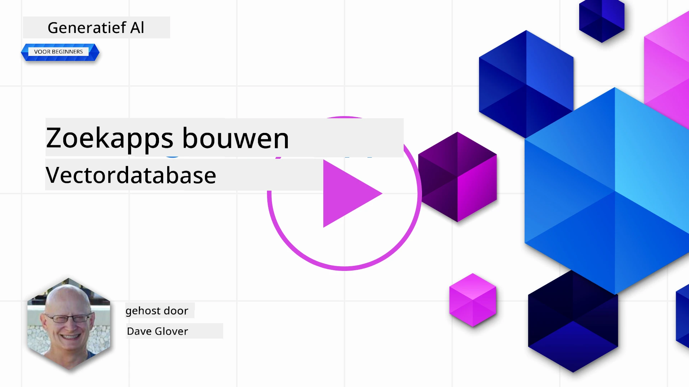
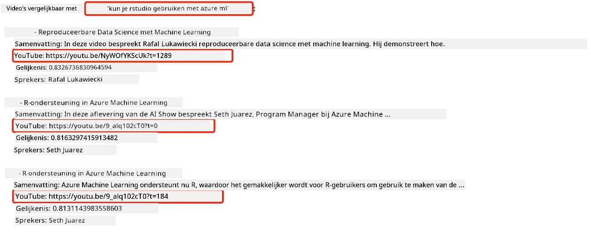
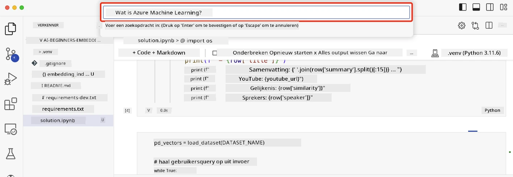

# Het bouwen van zoektoepassingen

[](https://youtu.be/W0-nzXjOjr0?si=GcsqiTTvd7RKbo7V)

> > _Klik op de afbeelding hierboven om de video van deze les te bekijken_

Er is meer aan LLM's dan chatbots en tekstgeneratie. Het is ook mogelijk om zoektoepassingen te bouwen met behulp van Embeddings. Embeddings zijn numerieke representaties van gegevens, ook wel vectoren genoemd, en kunnen worden gebruikt voor semantisch zoeken in gegevens.

In deze les ga je een zoektoepassing bouwen voor onze onderwijs-startup. Onze startup is een non-profitorganisatie die gratis onderwijs biedt aan studenten in ontwikkelingslanden. Onze startup heeft een groot aantal YouTube-video's die studenten kunnen gebruiken om te leren over AI. Onze startup wil een zoektoepassing bouwen waarmee studenten een YouTube-video kunnen zoeken door een vraag te typen.

Bijvoorbeeld, een student kan typen 'Wat zijn Jupyter Notebooks?' of 'Wat is Azure ML' en de zoektoepassing zal een lijst met YouTube-video's teruggeven die relevant zijn voor de vraag. Nog beter, de zoektoepassing zal een link teruggeven naar het gedeelte in de video waar het antwoord op de vraag te vinden is.

## Introductie

In deze les behandelen we:

- Semantisch versus trefwoord zoeken.
- Wat zijn tekstembeddings.
- Het creëren van een tekstembedding-index.
- Zoeken in een tekstembedding-index.

## Leerdoelen

Na het voltooien van deze les kun je:

- Het verschil uitleggen tussen semantisch zoeken en trefwoord zoeken.
- Uitleggen wat tekstembeddings zijn.
- Een toepassing maken die met embeddings zoekt in gegevens.

## Waarom een zoektoepassing bouwen?

Het bouwen van een zoektoepassing helpt je te begrijpen hoe je embeddings gebruikt om te zoeken in gegevens. Je leert ook hoe je een zoektoepassing bouwt die door studenten kan worden gebruikt om snel informatie te vinden.

De les bevat een embedding-index van de YouTube-transcripten voor het Microsoft [AI Show](https://www.youtube.com/playlist?list=PLlrxD0HtieHi0mwteKBOfEeOYf0LJU4O1) YouTube-kanaal. Het AI Show is een YouTube-kanaal dat je leert over AI en machine learning. De embedding-index bevat de embeddings voor elk van de YouTube-transcripten tot oktober 2023. Je gebruikt de embedding-index om een zoektoepassing voor onze startup te bouwen. De zoektoepassing geeft een link terug naar het gedeelte van de video waar het antwoord op de vraag te vinden is. Dit is een geweldige manier voor studenten om snel de informatie te vinden die ze nodig hebben.

Hieronder staat een voorbeeld van een semantische zoekopdracht voor de vraag 'kun je rstudio gebruiken met azure ml?'. Bekijk de YouTube-url, je zult zien dat de url een tijdstempel bevat die je naar het gedeelte in de video brengt waar het antwoord op de vraag te vinden is.



## Wat is semantisch zoeken?

Je vraagt je misschien af wat semantisch zoeken is? Semantisch zoeken is een zoektechniek die de semantiek, of betekenis, van de woorden in een zoekopdracht gebruikt om relevante resultaten terug te geven.

Hier is een voorbeeld van semantisch zoeken. Stel dat je een auto wilde kopen, dan zou je kunnen zoeken op 'mijn droomauto'. Semantisch zoeken begrijpt dat je niet `droomt` over een auto, maar dat je op zoek bent naar je `ideale` auto. Semantisch zoeken begrijpt je intentie en geeft relevante resultaten terug. Het alternatief is `trefwoord zoeken`, dat letterlijk zoekt naar dromen over auto's en vaak irrelevante resultaten oplevert.

## Wat zijn tekstembeddings?

[Tekstembeddings](https://en.wikipedia.org/wiki/Word_embedding?WT.mc_id=academic-105485-koreyst) zijn een techniek voor tekstreprentatie die wordt gebruikt in [natuurlijke taalverwerking](https://en.wikipedia.org/wiki/Natural_language_processing?WT.mc_id=academic-105485-koreyst). Tekstembeddings zijn semantische numerieke representaties van tekst. Embeddings worden gebruikt om gegevens zo te representeren dat een machine ze gemakkelijk kan begrijpen. Er zijn veel modellen om tekstembeddings te maken, in deze les richten we ons op het genereren van embeddings met het OpenAI-embeddingmodel.

Hier is een voorbeeld: stel dat de volgende tekst in een transcript staat van een aflevering van het AI Show YouTube-kanaal:

```text
Today we are going to learn about Azure Machine Learning.
```

We zouden de tekst doorgeven aan de OpenAI Embedding API en deze retourneert de volgende embedding bestaande uit 1536 getallen, ook wel een vector genoemd. Elke waarde in de vector vertegenwoordigt een ander aspect van de tekst. Hier zijn de eerste 10 getallen uit de vector ter beknoptheid.

```python
[-0.006655829958617687, 0.0026128944009542465, 0.008792596869170666, -0.02446001023054123, -0.008540431968867779, 0.022071078419685364, -0.010703742504119873, 0.003311325330287218, -0.011632772162556648, -0.02187200076878071, ...]
```

## Hoe wordt de embedding-index gemaakt?

De embedding-index voor deze les is gemaakt met een reeks Python-scripts. Je vindt deze scripts met instructies in de [README](./scripts/README.md?WT.mc_id=academic-105485-koreyst) in de 'scripts'-map van deze les. Je hoeft deze scripts niet uit te voeren om deze les te voltooien, want de embedding-index is al voor je beschikbaar.

De scripts voeren de volgende taken uit:

1. De transcriptie van elke YouTube-video in de [AI Show](https://www.youtube.com/playlist?list=PLlrxD0HtieHi0mwteKBOfEeOYf0LJU4O1) afspeellijst wordt gedownload.
2. Met behulp van [OpenAI Functions](https://learn.microsoft.com/azure/ai-foundry/openai/how-to/function-calling?WT.mc_id=academic-105485-koreyst) wordt geprobeerd om de naam van de spreker te achterhalen uit de eerste 3 minuten van het YouTube-transcript. De naam van de spreker van elke video wordt opgeslagen in de embedding-index met de naam `embedding_index_3m.json`.
3. De transcriptietekst wordt vervolgens opgedeeld in **tekstsegmenten van 3 minuten**. Het segment bevat ongeveer 20 overlappende woorden van het volgende segment om te zorgen dat de embedding voor het segment niet wordt afgekapt en om betere context voor het zoeken te bieden.
4. Elk tekstsegment wordt dan doorgegeven aan de OpenAI Chat API om de tekst samen te vatten in 60 woorden. De samenvatting wordt ook opgeslagen in de embedding-index `embedding_index_3m.json`.
5. Tot slot wordt de tekst van het segment doorgegeven aan de OpenAI Embedding API. De Embedding API retourneert een vector van 1536 getallen die de semantische betekenis van het segment representeren. Het segment, samen met de OpenAI Embedding-vector wordt opgeslagen in de embedding-index `embedding_index_3m.json`.

### Vector databases

Voor eenvoud is de embedding-index opgeslagen in een JSON-bestand met de naam `embedding_index_3m.json` en geladen in een Pandas DataFrame. In de productieomgeving wordt de embedding-index echter opgeslagen in een vectordatabase zoals [Azure Cognitive Search](https://learn.microsoft.com/training/modules/improve-search-results-vector-search?WT.mc_id=academic-105485-koreyst), [Redis](https://cookbook.openai.com/examples/vector_databases/redis/readme?WT.mc_id=academic-105485-koreyst), [Pinecone](https://cookbook.openai.com/examples/vector_databases/pinecone/readme?WT.mc_id=academic-105485-koreyst), [Weaviate](https://cookbook.openai.com/examples/vector_databases/weaviate/readme?WT.mc_id=academic-105485-koreyst), om er maar een paar te noemen.

## Begrijpen van cosinusgelijkenis

We hebben geleerd over tekstembeddings, de volgende stap is leren hoe je tekstembeddings gebruikt om te zoeken in gegevens en in het bijzonder hoe je de meest vergelijkbare embeddings vindt bij een gegeven zoekopdracht met behulp van cosinusgelijkenis.

### Wat is cosinusgelijkenis?

Cosinusgelijkenis is een maat voor gelijkenis tussen twee vectoren, dit wordt ook wel 'nearest neighbor search' genoemd. Om een cosinusgelijkenis-zoekopdracht uit te voeren moet je de zoekopdracht tekst _vectoriseren_ met behulp van de OpenAI Embedding API. Vervolgens bereken je de _cosinusgelijkenis_ tussen de zoekopdrachtvector en elke vector in de embedding-index. Onthoud, de embedding-index bevat een vector voor elk tekstsegment uit de YouTube-transcripten. Ten slotte sorteer je de resultaten op cosinusgelijkenis en de tekstsegmenten met de hoogste cosinusgelijkenis zijn het meest vergelijkbaar met de zoekopdracht.

Vanuit een wiskundig perspectief meet cosinusgelijkenis de cosinus van de hoek tussen twee vectoren geprojecteerd in een multidimensionale ruimte. Deze meting is nuttig omdat als twee documenten ver uit elkaar liggen qua Euclidische afstand door grootte, ze toch een kleinere hoek tussen zich kunnen hebben en daarom een hogere cosinusgelijkenis. Voor meer informatie over de formules van cosinusgelijkenis, zie [Cosine similarity](https://en.wikipedia.org/wiki/Cosine_similarity?WT.mc_id=academic-105485-koreyst).

## Bouw je eerste zoektoepassing

Vervolgens gaan we leren hoe je een zoektoepassing bouwt met embeddings. De zoektoepassing stelt studenten in staat om een video op te zoeken door een vraag te typen. De zoektoepassing geeft een lijst met video's terug die relevant zijn voor de vraag. De zoektoepassing geeft ook een link naar het gedeelte in de video waar het antwoord op de vraag te vinden is.

Deze oplossing is gebouwd en getest op Windows 11, macOS en Ubuntu 22.04 met Python 3.10 of later. Je kunt Python downloaden van [python.org](https://www.python.org/downloads/?WT.mc_id=academic-105485-koreyst).

## Opdracht - een zoektoepassing bouwen, voor studenten

We hebben onze startup geïntroduceerd aan het begin van deze les. Nu is het tijd om de studenten in staat te stellen een zoektoepassing te bouwen voor hun opdrachten.

In deze opdracht ga je de Azure OpenAI-services maken die gebruikt zullen worden om de zoektoepassing te bouwen. Je maakt de volgende Azure OpenAI-services aan. Je hebt een Azure-abonnement nodig om deze opdracht te voltooien.

### Start de Azure Cloud Shell

1. Meld je aan bij de [Azure-portal](https://portal.azure.com/?WT.mc_id=academic-105485-koreyst).
2. Selecteer het Cloud Shell-pictogram in de rechterbovenhoek van de Azure-portal.
3. Selecteer **Bash** als het type omgeving.

#### Maak een resourcegroep aan

> Voor deze instructies gebruiken we de resourcegroep met de naam "semantic-video-search" in East US.
> Je kunt de naam van de resourcegroep wijzigen, maar als je de locatie van de resources aanpast,
> controleer dan de [tabel met modelbeschikbaarheid](https://aka.ms/oai/models?WT.mc_id=academic-105485-koreyst).

```shell
az group create --name semantic-video-search --location eastus
```

#### Maak een Azure OpenAI Service resource aan

Voer in Azure Cloud Shell de volgende opdracht uit om een Azure OpenAI Service resource aan te maken.

```shell
az cognitiveservices account create --name semantic-video-openai --resource-group semantic-video-search \
    --location eastus --kind OpenAI --sku s0
```

#### Verkrijg het eindpunt en de sleutels voor gebruik in deze toepassing

Voer in Azure Cloud Shell de volgende opdrachten uit om het eindpunt en de sleutels te verkrijgen voor de Azure OpenAI Service resource.

```shell
az cognitiveservices account show --name semantic-video-openai \
   --resource-group  semantic-video-search | jq -r .properties.endpoint
az cognitiveservices account keys list --name semantic-video-openai \
   --resource-group semantic-video-search | jq -r .key1
```

#### Implementeer het OpenAI-embeddingmodel

Voer in Azure Cloud Shell de volgende opdracht uit om het OpenAI-embeddingmodel te implementeren.

```shell
az cognitiveservices account deployment create \
    --name semantic-video-openai \
    --resource-group  semantic-video-search \
    --deployment-name text-embedding-ada-002 \
    --model-name text-embedding-ada-002 \
    --model-version "2"  \
    --model-format OpenAI \
    --sku-capacity 100 --sku-name "Standard"
```

## Oplossing

Open de [oplossingsnotebook](./python/aoai-solution.ipynb?WT.mc_id=academic-105485-koreyst) in GitHub Codespaces en volg de instructies in de Jupyter Notebook.

Wanneer je de notebook uitvoert, wordt je gevraagd een zoekopdracht in te voeren. Het invoerveld ziet er als volgt uit:



## Goed gedaan! Ga verder met leren

Na het afronden van deze les, bekijk onze [Generatieve AI leercollectie](https://aka.ms/genai-collection?WT.mc_id=academic-105485-koreyst) om je Generatieve AI-kennis verder te verdiepen!

Ga naar les 9 waar we kijken naar hoe je [beeldgeneratie-toepassingen bouwt](../09-building-image-applications/README.md?WT.mc_id=academic-105485-koreyst)!

---

<!-- CO-OP TRANSLATOR DISCLAIMER START -->
**Disclaimer**:
Dit document is vertaald met behulp van de AI vertaaldienst [Co-op Translator](https://github.com/Azure/co-op-translator). Hoewel we streven naar nauwkeurigheid, dient u er rekening mee te houden dat geautomatiseerde vertalingen fouten of onnauwkeurigheden kunnen bevatten. Het originele document in de oorspronkelijke taal moet worden beschouwd als de gezaghebbende bron. Voor kritieke informatie wordt professionele menselijke vertaling aanbevolen. Wij zijn niet aansprakelijk voor eventuele misverstanden of verkeerde interpretaties die voortvloeien uit het gebruik van deze vertaling.
<!-- CO-OP TRANSLATOR DISCLAIMER END -->