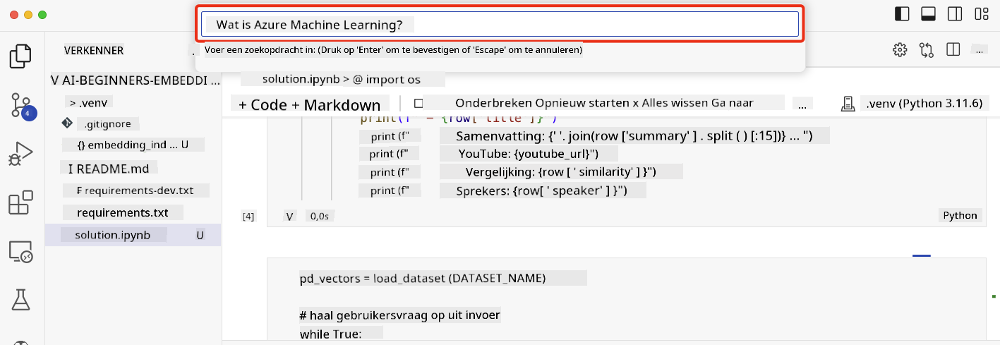

<!--
CO_OP_TRANSLATOR_METADATA:
{
  "original_hash": "d46aad0917a1a342d613e2c13d457da5",
  "translation_date": "2025-07-09T12:57:53+00:00",
  "source_file": "08-building-search-applications/README.md",
  "language_code": "nl"
}
-->
# Het bouwen van zoekapplicaties

[](https://aka.ms/gen-ai-lesson8-gh?WT.mc_id=academic-105485-koreyst)

> > _Klik op de afbeelding hierboven om de video van deze les te bekijken_

LLM's zijn meer dan alleen chatbots en tekstgeneratie. Het is ook mogelijk om zoekapplicaties te bouwen met behulp van Embeddings. Embeddings zijn numerieke representaties van data, ook wel vectoren genoemd, en kunnen worden gebruikt voor semantisch zoeken in data.

In deze les ga je een zoekapplicatie bouwen voor onze educatieve startup. Onze startup is een non-profitorganisatie die gratis onderwijs aanbiedt aan studenten in ontwikkelingslanden. We hebben een groot aantal YouTube-video’s die studenten kunnen gebruiken om te leren over AI. Onze startup wil een zoekapplicatie bouwen waarmee studenten een YouTube-video kunnen zoeken door een vraag in te typen.

Bijvoorbeeld, een student kan typen 'Wat zijn Jupyter Notebooks?' of 'Wat is Azure ML' en de zoekapplicatie geeft een lijst met YouTube-video’s terug die relevant zijn voor de vraag. Nog beter, de zoekapplicatie geeft een link naar het moment in de video waar het antwoord op de vraag te vinden is.

## Introductie

In deze les behandelen we:

- Semantisch zoeken versus zoekwoorden zoeken.
- Wat zijn Text Embeddings.
- Het maken van een Text Embeddings Index.
- Zoeken in een Text Embeddings Index.

## Leerdoelen

Na het afronden van deze les kun je:

- Het verschil uitleggen tussen semantisch zoeken en zoekwoorden zoeken.
- Uitleggen wat Text Embeddings zijn.
- Een applicatie maken die Embeddings gebruikt om data te doorzoeken.

## Waarom een zoekapplicatie bouwen?

Het maken van een zoekapplicatie helpt je te begrijpen hoe je Embeddings kunt gebruiken om data te doorzoeken. Je leert ook hoe je een zoekapplicatie bouwt die studenten snel helpt informatie te vinden.

De les bevat een Embedding Index van de YouTube-transcripten van het Microsoft [AI Show](https://www.youtube.com/playlist?list=PLlrxD0HtieHi0mwteKBOfEeOYf0LJU4O1) YouTube-kanaal. Het AI Show is een YouTube-kanaal dat je leert over AI en machine learning. De Embedding Index bevat de Embeddings voor elk van de YouTube-transcripten tot oktober 2023. Je gebruikt deze Embedding Index om een zoekapplicatie voor onze startup te bouwen. De zoekapplicatie geeft een link terug naar het moment in de video waar het antwoord op de vraag staat. Dit is een geweldige manier voor studenten om snel de informatie te vinden die ze nodig hebben.

Hieronder zie je een voorbeeld van een semantische zoekopdracht voor de vraag 'kun je rstudio gebruiken met azure ml?'. Bekijk de YouTube-url, je ziet dat de url een tijdstempel bevat die je naar het moment in de video brengt waar het antwoord te vinden is.


## Wat is semantisch zoeken?

Je vraagt je misschien af, wat is semantisch zoeken? Semantisch zoeken is een zoektechniek die de betekenis van de woorden in een zoekopdracht gebruikt om relevante resultaten te geven.

Hier is een voorbeeld van semantisch zoeken. Stel, je wilt een auto kopen en zoekt op 'mijn droomauto'. Semantisch zoeken begrijpt dat je niet aan het dromen bent over een auto, maar dat je op zoek bent naar je ideale auto. Semantisch zoeken begrijpt je intentie en geeft relevante resultaten. Het alternatief is `zoekwoorden zoeken`, dat letterlijk zoekt naar dromen over auto’s en vaak irrelevante resultaten oplevert.

## Wat zijn Text Embeddings?

[Text embeddings](https://en.wikipedia.org/wiki/Word_embedding?WT.mc_id=academic-105485-koreyst) zijn een techniek om tekst te representeren die wordt gebruikt in [natuurlijke taalverwerking](https://en.wikipedia.org/wiki/Natural_language_processing?WT.mc_id=academic-105485-koreyst). Text embeddings zijn semantische numerieke representaties van tekst. Embeddings worden gebruikt om data zo te representeren dat een machine het makkelijk kan begrijpen. Er zijn veel modellen om text embeddings te maken, in deze les richten we ons op het genereren van embeddings met het OpenAI Embedding Model.

Hier is een voorbeeld: stel dat de volgende tekst uit een transcript komt van een aflevering van het AI Show YouTube-kanaal:

```text
Today we are going to learn about Azure Machine Learning.
```

We sturen de tekst naar de OpenAI Embedding API en die geeft de volgende embedding terug, bestaande uit 1536 getallen, ook wel een vector genoemd. Elk getal in de vector vertegenwoordigt een ander aspect van de tekst. Hier zijn de eerste 10 getallen uit de vector, ter illustratie.

```python
[-0.006655829958617687, 0.0026128944009542465, 0.008792596869170666, -0.02446001023054123, -0.008540431968867779, 0.022071078419685364, -0.010703742504119873, 0.003311325330287218, -0.011632772162556648, -0.02187200076878071, ...]
```

## Hoe wordt de Embedding index gemaakt?

De Embedding index voor deze les is gemaakt met een reeks Python-scripts. Je vindt de scripts en instructies in de [README](./scripts/README.md?WT.mc_id=academic-105485-koreyst) in de map 'scripts' van deze les. Je hoeft deze scripts niet uit te voeren om deze les te voltooien, want de Embedding Index wordt voor je geleverd.

De scripts voeren de volgende stappen uit:

1. Het transcript van elke YouTube-video in de [AI Show](https://www.youtube.com/playlist?list=PLlrxD0HtieHi0mwteKBOfEeOYf0LJU4O1) afspeellijst wordt gedownload.
2. Met behulp van [OpenAI Functions](https://learn.microsoft.com/azure/ai-services/openai/how-to/function-calling?WT.mc_id=academic-105485-koreyst) wordt geprobeerd de naam van de spreker te extraheren uit de eerste 3 minuten van het YouTube-transcript. De naam van de spreker voor elke video wordt opgeslagen in de Embedding Index met de naam `embedding_index_3m.json`.
3. De transcripttekst wordt vervolgens opgedeeld in **tekstdelen van 3 minuten**. Elk deel overlapt ongeveer 20 woorden met het volgende deel om te zorgen dat de embedding niet wordt afgebroken en om betere zoekcontext te bieden.
4. Elk tekstdel wordt naar de OpenAI Chat API gestuurd om de tekst samen te vatten in 60 woorden. De samenvatting wordt ook opgeslagen in de Embedding Index `embedding_index_3m.json`.
5. Ten slotte wordt het tekstdel naar de OpenAI Embedding API gestuurd. De Embedding API geeft een vector van 1536 getallen terug die de semantische betekenis van het deel vertegenwoordigen. Het tekstdel samen met de OpenAI Embedding vector wordt opgeslagen in de Embedding Index `embedding_index_3m.json`.

### Vector databases

Voor de eenvoud van deze les wordt de Embedding Index opgeslagen in een JSON-bestand met de naam `embedding_index_3m.json` en ingeladen in een Pandas DataFrame. In een productieomgeving zou de Embedding Index echter worden opgeslagen in een vectordatabase zoals [Azure Cognitive Search](https://learn.microsoft.com/training/modules/improve-search-results-vector-search?WT.mc_id=academic-105485-koreyst), [Redis](https://cookbook.openai.com/examples/vector_databases/redis/readme?WT.mc_id=academic-105485-koreyst), [Pinecone](https://cookbook.openai.com/examples/vector_databases/pinecone/readme?WT.mc_id=academic-105485-koreyst), [Weaviate](https://cookbook.openai.com/examples/vector_databases/weaviate/readme?WT.mc_id=academic-105485-koreyst), om er maar een paar te noemen.

## Begrijpen van cosine similarity

We hebben geleerd wat text embeddings zijn, de volgende stap is leren hoe je text embeddings gebruikt om data te doorzoeken en in het bijzonder de meest vergelijkbare embeddings vindt bij een gegeven zoekopdracht met behulp van cosine similarity.

### Wat is cosine similarity?

Cosine similarity is een maat voor de gelijkenis tussen twee vectoren, dit wordt ook wel `nearest neighbor search` genoemd. Om een cosine similarity zoekopdracht uit te voeren moet je de _zoekopdracht_ tekst _vectoriseren_ met de OpenAI Embedding API. Daarna bereken je de _cosine similarity_ tussen de zoekopdrachtvector en elke vector in de Embedding Index. Onthoud dat de Embedding Index een vector heeft voor elk tekstdel van de YouTube-transcripten. Tot slot sorteer je de resultaten op cosine similarity en de tekstdelen met de hoogste cosine similarity zijn het meest vergelijkbaar met de zoekopdracht.

Wiskundig gezien meet cosine similarity de cosinus van de hoek tussen twee vectoren geprojecteerd in een multidimensionale ruimte. Deze maat is nuttig omdat twee documenten die ver uit elkaar liggen volgens de Euclidische afstand (bijvoorbeeld door grootte) toch een kleinere hoek kunnen hebben en daardoor een hogere cosine similarity. Voor meer informatie over de formules van cosine similarity, zie [Cosine similarity](https://en.wikipedia.org/wiki/Cosine_similarity?WT.mc_id=academic-105485-koreyst).

## Je eerste zoekapplicatie bouwen

Vervolgens gaan we leren hoe je een zoekapplicatie bouwt met Embeddings. De zoekapplicatie stelt studenten in staat om een video te zoeken door een vraag in te typen. De applicatie geeft een lijst met relevante video’s terug en ook een link naar het moment in de video waar het antwoord op de vraag staat.

Deze oplossing is gebouwd en getest op Windows 11, macOS en Ubuntu 22.04 met Python 3.10 of hoger. Je kunt Python downloaden van [python.org](https://www.python.org/downloads/?WT.mc_id=academic-105485-koreyst).

## Opdracht - een zoekapplicatie bouwen om studenten te helpen

We hebben onze startup aan het begin van deze les geïntroduceerd. Nu is het tijd om studenten in staat te stellen een zoekapplicatie te bouwen voor hun opdrachten.

In deze opdracht maak je de Azure OpenAI Services die gebruikt worden om de zoekapplicatie te bouwen. Je maakt de volgende Azure OpenAI Services aan. Je hebt een Azure-abonnement nodig om deze opdracht te voltooien.

### Start de Azure Cloud Shell

1. Meld je aan bij de [Azure portal](https://portal.azure.com/?WT.mc_id=academic-105485-koreyst).
2. Klik op het Cloud Shell-icoon rechtsboven in de Azure portal.
3. Kies **Bash** als omgevingstype.

#### Maak een resourcegroep aan

> Voor deze instructies gebruiken we de resourcegroep met de naam "semantic-video-search" in East US.
> Je kunt de naam van de resourcegroep wijzigen, maar als je de locatie van de resources verandert,
> controleer dan de [beschikbaarheid van modellen](https://aka.ms/oai/models?WT.mc_id=academic-105485-koreyst).

```shell
az group create --name semantic-video-search --location eastus
```

#### Maak een Azure OpenAI Service resource aan

Voer vanuit de Azure Cloud Shell de volgende opdracht uit om een Azure OpenAI Service resource aan te maken.

```shell
az cognitiveservices account create --name semantic-video-openai --resource-group semantic-video-search \
    --location eastus --kind OpenAI --sku s0
```

#### Haal de endpoint en sleutels op voor gebruik in deze applicatie

Voer vanuit de Azure Cloud Shell de volgende opdrachten uit om de endpoint en sleutels van de Azure OpenAI Service resource op te halen.

```shell
az cognitiveservices account show --name semantic-video-openai \
   --resource-group  semantic-video-search | jq -r .properties.endpoint
az cognitiveservices account keys list --name semantic-video-openai \
   --resource-group semantic-video-search | jq -r .key1
```

#### Implementeer het OpenAI Embedding model

Voer vanuit de Azure Cloud Shell de volgende opdracht uit om het OpenAI Embedding model te implementeren.

```shell
az cognitiveservices account deployment create \
    --name semantic-video-openai \
    --resource-group  semantic-video-search \
    --deployment-name text-embedding-ada-002 \
    --model-name text-embedding-ada-002 \
    --model-version "2"  \
    --model-format OpenAI \
    --sku-capacity 100 --sku-name "Standard"
```

## Oplossing

Open de [oplossingsnotebook](python/aoai-solution.ipynb) in GitHub Codespaces en volg de instructies in de Jupyter Notebook.

Wanneer je de notebook uitvoert, wordt je gevraagd een zoekopdracht in te voeren. Het invoerveld ziet er zo uit:



## Goed gedaan! Ga door met leren

Na het afronden van deze les, bekijk onze [Generative AI Learning collectie](https://aka.ms/genai-collection?WT.mc_id=academic-105485-koreyst) om je kennis van Generatieve AI verder uit te breiden!

Ga door naar Les 9 waar we kijken naar hoe je [beeldgeneratie-applicaties bouwt](../09-building-image-applications/README.md?WT.mc_id=academic-105485-koreyst)!

**Disclaimer**:  
Dit document is vertaald met behulp van de AI-vertalingsdienst [Co-op Translator](https://github.com/Azure/co-op-translator). Hoewel we streven naar nauwkeurigheid, dient u er rekening mee te houden dat geautomatiseerde vertalingen fouten of onnauwkeurigheden kunnen bevatten. Het originele document in de oorspronkelijke taal moet als de gezaghebbende bron worden beschouwd. Voor cruciale informatie wordt professionele menselijke vertaling aanbevolen. Wij zijn niet aansprakelijk voor eventuele misverstanden of verkeerde interpretaties die voortvloeien uit het gebruik van deze vertaling.