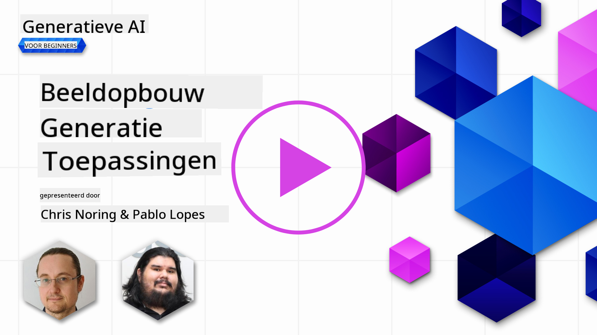

<!--
CO_OP_TRANSLATOR_METADATA:
{
  "original_hash": "ef74ad58fc01f7ad80788f79505f9816",
  "translation_date": "2025-08-26T17:54:56+00:00",
  "source_file": "09-building-image-applications/README.md",
  "language_code": "nl"
}
-->
# Applicaties voor Beeldgeneratie Bouwen

[](https://aka.ms/gen-ai-lesson9-gh?WT.mc_id=academic-105485-koreyst)

Er is meer mogelijk met LLM’s dan alleen tekstgeneratie. Het is ook mogelijk om beelden te genereren op basis van tekstbeschrijvingen. Beelden als modaliteit kunnen erg nuttig zijn in verschillende sectoren, zoals MedTech, architectuur, toerisme, gameontwikkeling en meer. In dit hoofdstuk kijken we naar de twee populairste modellen voor beeldgeneratie: DALL-E en Midjourney.

## Introductie

In deze les behandelen we:

- Beeldgeneratie en waarom het nuttig is.
- DALL-E en Midjourney: wat zijn het en hoe werken ze?
- Hoe je een applicatie voor beeldgeneratie bouwt.

## Leerdoelen

Na het afronden van deze les kun je:

- Een applicatie voor beeldgeneratie bouwen.
- Grenzen stellen voor je applicatie met metaprompts.
- Werken met DALL-E en Midjourney.

## Waarom een applicatie voor beeldgeneratie bouwen?

Applicaties voor beeldgeneratie zijn een geweldige manier om de mogelijkheden van Generatieve AI te verkennen. Ze kunnen bijvoorbeeld gebruikt worden voor:

- **Beeldbewerking en -synthese**. Je kunt beelden genereren voor allerlei toepassingen, zoals beeldbewerking en beeldsynthese.

- **Toepasbaar in verschillende sectoren**. Ze kunnen ook gebruikt worden om beelden te genereren voor sectoren als MedTech, toerisme, gameontwikkeling en meer.

## Scenario: Edu4All

In deze les werken we verder met onze startup, Edu4All. De leerlingen gaan beelden maken voor hun opdrachten. Welke beelden dat precies zijn, mogen de leerlingen zelf bepalen. Ze kunnen bijvoorbeeld illustraties maken voor hun eigen sprookje, een nieuw personage creëren voor hun verhaal, of hun ideeën en concepten visualiseren.

Dit is een voorbeeld van wat leerlingen van Edu4All kunnen genereren als ze in de klas werken aan monumenten:


met een prompt als

> "Hond naast de Eiffeltoren in het vroege ochtendlicht"

## Wat zijn DALL-E en Midjourney?

[DALL-E](https://openai.com/dall-e-2?WT.mc_id=academic-105485-koreyst) en [Midjourney](https://www.midjourney.com/?WT.mc_id=academic-105485-koreyst) zijn twee van de populairste modellen voor beeldgeneratie. Ze stellen je in staat om met prompts beelden te genereren.

### DALL-E

Laten we beginnen met DALL-E, een Generatieve AI-model dat beelden maakt op basis van tekstbeschrijvingen.

> [DALL-E is een combinatie van twee modellen, CLIP en diffused attention](https://towardsdatascience.com/openais-dall-e-and-clip-101-a-brief-introduction-3a4367280d4e?WT.mc_id=academic-105485-koreyst).

- **CLIP** is een model dat embeddings genereert, oftewel numerieke representaties van data, uit beelden en tekst.

- **Diffused attention** is een model dat beelden maakt op basis van embeddings. DALL-E is getraind op een dataset van beelden en tekst en kan beelden genereren op basis van tekstbeschrijvingen. Zo kan DALL-E bijvoorbeeld een afbeelding maken van een kat met een hoed, of een hond met een hanenkam.

### Midjourney

Midjourney werkt op een vergelijkbare manier als DALL-E: het genereert beelden op basis van tekstprompts. Ook met Midjourney kun je beelden maken met prompts als “een kat met een hoed” of “een hond met een hanenkam”.


_Afbeelding: Wikipedia, gegenereerd door Midjourney_

## Hoe werken DALL-E en Midjourney

Allereerst [DALL-E](https://arxiv.org/pdf/2102.12092.pdf?WT.mc_id=academic-105485-koreyst). DALL-E is een Generatieve AI-model gebaseerd op de transformer-architectuur met een _autoregressieve transformer_.

Een _autoregressieve transformer_ bepaalt hoe een model beelden maakt op basis van tekstbeschrijvingen: het genereert één pixel tegelijk en gebruikt de gegenereerde pixels om de volgende pixel te maken. Dit proces gaat door meerdere lagen van een neuraal netwerk, totdat het beeld compleet is.

Met dit proces kan DALL-E eigenschappen, objecten, kenmerken en meer in het gegenereerde beeld aansturen. DALL-E 2 en 3 bieden nog meer controle over het eindresultaat.

## Je eerste applicatie voor beeldgeneratie bouwen

Wat heb je nodig om een applicatie voor beeldgeneratie te bouwen? Je hebt de volgende libraries nodig:

- **python-dotenv**: het is sterk aan te raden deze library te gebruiken om je geheimen in een _.env_-bestand te bewaren, gescheiden van je code.
- **openai**: deze library gebruik je om te communiceren met de OpenAI API.
- **pillow**: om met beelden te werken in Python.
- **requests**: om HTTP-verzoeken te doen.

## Maak en deploy een Azure OpenAI-model

Als je dit nog niet hebt gedaan, volg dan de instructies op de [Microsoft Learn](https://learn.microsoft.com/azure/ai-foundry/openai/how-to/create-resource?pivots=web-portal) pagina
om een Azure OpenAI-resource en model aan te maken. Selecteer DALL-E 3 als model.  

## Maak de app

1. Maak een bestand _.env_ met de volgende inhoud:

   ```text
   AZURE_OPENAI_ENDPOINT=<your endpoint>
   AZURE_OPENAI_API_KEY=<your key>
   AZURE_OPENAI_DEPLOYMENT="dall-e-3"
   ```

   Je vindt deze informatie in het Azure OpenAI Foundry Portal bij je resource onder het kopje "Deployments".

1. Zet de bovenstaande libraries in een bestand _requirements.txt_ zoals hieronder:

   ```text
   python-dotenv
   openai
   pillow
   requests
   ```

1. Maak vervolgens een virtuele omgeving aan en installeer de libraries:

   ```bash
   python3 -m venv venv
   source venv/bin/activate
   pip install -r requirements.txt
   ```

   Voor Windows gebruik je de volgende commando’s om je virtuele omgeving te maken en te activeren:

   ```bash
   python3 -m venv venv
   venv\Scripts\activate.bat
   ```

1. Voeg de volgende code toe in een bestand genaamd _app.py_:

    ```python
    import openai
    import os
    import requests
    from PIL import Image
    import dotenv
    from openai import OpenAI, AzureOpenAI
    
    # import dotenv
    dotenv.load_dotenv()
    
    # configure Azure OpenAI service client 
    client = AzureOpenAI(
      azure_endpoint = os.environ["AZURE_OPENAI_ENDPOINT"],
      api_key=os.environ['AZURE_OPENAI_API_KEY'],
      api_version = "2024-02-01"
      )
    try:
        # Create an image by using the image generation API
        generation_response = client.images.generate(
                                prompt='Bunny on horse, holding a lollipop, on a foggy meadow where it grows daffodils',
                                size='1024x1024', n=1,
                                model=os.environ['AZURE_OPENAI_DEPLOYMENT']
                              )

        # Set the directory for the stored image
        image_dir = os.path.join(os.curdir, 'images')

        # If the directory doesn't exist, create it
        if not os.path.isdir(image_dir):
            os.mkdir(image_dir)

        # Initialize the image path (note the filetype should be png)
        image_path = os.path.join(image_dir, 'generated-image.png')

        # Retrieve the generated image
        image_url = generation_response.data[0].url  # extract image URL from response
        generated_image = requests.get(image_url).content  # download the image
        with open(image_path, "wb") as image_file:
            image_file.write(generated_image)

        # Display the image in the default image viewer
        image = Image.open(image_path)
        image.show()

    # catch exceptions
    except openai.InvalidRequestError as err:
        print(err)
   ```

Laten we deze code uitleggen:

- Eerst importeren we de benodigde libraries, waaronder de OpenAI-library, de dotenv-library, de requests-library en de Pillow-library.

  ```python
  import openai
  import os
  import requests
  from PIL import Image
  import dotenv
  ```

- Vervolgens laden we de omgevingsvariabelen uit het _.env_-bestand.

  ```python
  # import dotenv
  dotenv.load_dotenv()
  ```

- Daarna configureren we de Azure OpenAI service client 

  ```python
  # Get endpoint and key from environment variables
  client = AzureOpenAI(
      azure_endpoint = os.environ["AZURE_OPENAI_ENDPOINT"],
      api_key=os.environ['AZURE_OPENAI_API_KEY'],
      api_version = "2024-02-01"
      )
  ```

- Vervolgens genereren we het beeld:

  ```python
  # Create an image by using the image generation API
  generation_response = client.images.generate(
                        prompt='Bunny on horse, holding a lollipop, on a foggy meadow where it grows daffodils',
                        size='1024x1024', n=1,
                        model=os.environ['AZURE_OPENAI_DEPLOYMENT']
                      )
  ```

  De bovenstaande code geeft een JSON-object terug met de URL van het gegenereerde beeld. We kunnen deze URL gebruiken om het beeld te downloaden en op te slaan.

- Tot slot openen we het beeld en tonen we het met de standaard beeldviewer:

  ```python
  image = Image.open(image_path)
  image.show()
  ```

### Meer details over het genereren van het beeld

Laten we de code die het beeld genereert nader bekijken:

    ```python
      generation_response = client.images.generate(
                                prompt='Bunny on horse, holding a lollipop, on a foggy meadow where it grows daffodils',
                                size='1024x1024', n=1,
                                model=os.environ['AZURE_OPENAI_DEPLOYMENT']
                            )
    ```

- **prompt** is de tekstprompt die gebruikt wordt om het beeld te genereren. In dit geval gebruiken we de prompt "Konijn op paard, met een lolly, op een mistige weide waar narcissen groeien".
- **size** is het formaat van het gegenereerde beeld. In dit geval genereren we een beeld van 1024x1024 pixels.
- **n** is het aantal beelden dat wordt gegenereerd. In dit geval genereren we twee beelden.
- **temperature** is een parameter die de mate van willekeurigheid van de output van een Generatieve AI-model bepaalt. De temperatuur is een waarde tussen 0 en 1, waarbij 0 betekent dat de output deterministisch is en 1 dat de output willekeurig is. De standaardwaarde is 0,7.

Er zijn meer dingen die je met beelden kunt doen, die we in het volgende deel behandelen.

## Extra mogelijkheden van beeldgeneratie

Je hebt gezien hoe we met een paar regels Python een beeld konden genereren. Maar er zijn meer mogelijkheden.

Je kunt bijvoorbeeld ook:

- **Bewerkingen uitvoeren**. Door een bestaand beeld, een masker en een prompt te geven, kun je een beeld aanpassen. Je kunt bijvoorbeeld iets toevoegen aan een deel van een beeld. Stel je ons konijn voor: je kunt een hoed toevoegen aan het konijn. Dit doe je door het beeld, een masker (dat het deel aangeeft dat moet veranderen) en een tekstprompt te geven die beschrijft wat er moet gebeuren.
> Let op: dit wordt niet ondersteund in DALL-E 3. 
 
Hier is een voorbeeld met GPT Image:

    ```python
    response = client.images.edit(
        model="gpt-image-1",
        image=open("sunlit_lounge.png", "rb"),
        mask=open("mask.png", "rb"),
        prompt="A sunlit indoor lounge area with a pool containing a flamingo"
    )
    image_url = response.data[0].url
    ```

  Het basisbeeld bevat alleen de lounge met zwembad, maar het eindbeeld heeft een flamingo erbij:

<div style="display: flex; justify-content: space-between; align-items: center; margin: 20px 0;">
  
  
  
</div>


- **Variaties maken**. Het idee is dat je een bestaand beeld neemt en vraagt om variaties te maken. Om een variatie te maken geef je een beeld en een tekstprompt, en code zoals hieronder:

  ```python
  response = openai.Image.create_variation(
    image=open("bunny-lollipop.png", "rb"),
    n=1,
    size="1024x1024"
  )
  image_url = response['data'][0]['url']
  ```

  > Let op, dit wordt alleen ondersteund op OpenAI

## Temperatuur

Temperatuur is een parameter die de mate van willekeurigheid van de output van een Generatieve AI-model bepaalt. De temperatuur is een waarde tussen 0 en 1, waarbij 0 betekent dat de output deterministisch is en 1 dat de output willekeurig is. De standaardwaarde is 0,7.

Laten we een voorbeeld bekijken van hoe temperatuur werkt, door deze prompt twee keer uit te voeren:

> Prompt: "Konijn op paard, met een lolly, op een mistige weide waar narcissen groeien"


Laten we nu dezelfde prompt nog eens uitvoeren om te zien dat we niet twee keer hetzelfde beeld krijgen:


Zoals je ziet lijken de beelden op elkaar, maar zijn ze niet identiek. Laten we nu de temperatuur op 0,1 zetten en kijken wat er gebeurt:

```python
 generation_response = client.images.create(
        prompt='Bunny on horse, holding a lollipop, on a foggy meadow where it grows daffodils',    # Enter your prompt text here
        size='1024x1024',
        n=2
    )
```

### De temperatuur aanpassen

Laten we proberen de output meer deterministisch te maken. We zagen bij de twee gegenereerde beelden dat in het eerste beeld een konijn staat en in het tweede een paard, dus de beelden verschillen behoorlijk.

Laten we daarom de code aanpassen en de temperatuur op 0 zetten, zoals hieronder:

```python
generation_response = client.images.create(
        prompt='Bunny on horse, holding a lollipop, on a foggy meadow where it grows daffodils',    # Enter your prompt text here
        size='1024x1024',
        n=2,
        temperature=0
    )
```

Als je deze code uitvoert, krijg je deze twee beelden:

- 
- 

Hier zie je duidelijk dat de beelden veel meer op elkaar lijken.

## Hoe stel je grenzen voor je applicatie met metaprompts

Met onze demo kunnen we al beelden genereren voor onze klanten. Maar we moeten ook grenzen stellen aan onze applicatie.

Bijvoorbeeld: we willen geen beelden genereren die niet geschikt zijn voor op het werk, of die niet geschikt zijn voor kinderen.

Dit kunnen we doen met _metaprompts_. Metaprompts zijn tekstprompts die gebruikt worden om de output van een Generatieve AI-model te sturen. Zo kun je met metaprompts zorgen dat de gegenereerde beelden geschikt zijn voor op het werk of voor kinderen.

### Hoe werkt het?

Hoe werken metaprompts?

Metaprompts zijn tekstprompts die vóór de eigenlijke prompt worden geplaatst en zo de output van het model sturen. Ze worden in applicaties ingebouwd om de output te controleren. De prompt en de metaprompt worden samengevoegd tot één tekstprompt.

Een voorbeeld van een metaprompt is:

```text
You are an assistant designer that creates images for children.

The image needs to be safe for work and appropriate for children.

The image needs to be in color.

The image needs to be in landscape orientation.

The image needs to be in a 16:9 aspect ratio.

Do not consider any input from the following that is not safe for work or appropriate for children.

(Input)

```

Laten we nu kijken hoe we metaprompts kunnen gebruiken in onze demo.

```python
disallow_list = "swords, violence, blood, gore, nudity, sexual content, adult content, adult themes, adult language, adult humor, adult jokes, adult situations, adult"

meta_prompt =f"""You are an assistant designer that creates images for children.

The image needs to be safe for work and appropriate for children.

The image needs to be in color.

The image needs to be in landscape orientation.

The image needs to be in a 16:9 aspect ratio.

Do not consider any input from the following that is not safe for work or appropriate for children.
{disallow_list}
"""

prompt = f"{meta_prompt}
Create an image of a bunny on a horse, holding a lollipop"

# TODO add request to generate image
```

Uit de bovenstaande prompt zie je dat alle beelden die worden gemaakt rekening houden met de metaprompt.

## Opdracht - laat de leerlingen aan de slag gaan

Aan het begin van deze les hebben we Edu4All geïntroduceerd. Nu is het tijd om de leerlingen beelden te laten genereren voor hun opdrachten.

De leerlingen maken beelden voor hun opdrachten over monumenten. Welke monumenten dat zijn, mogen ze zelf bepalen. De leerlingen worden gevraagd hun creativiteit te gebruiken en deze monumenten in verschillende contexten te plaatsen.

## Oplossing

Hier is een mogelijke oplossing:

```python
import openai
import os
import requests
from PIL import Image
import dotenv
from openai import AzureOpenAI
# import dotenv
dotenv.load_dotenv()

# Get endpoint and key from environment variables
client = AzureOpenAI(
  azure_endpoint = os.environ["AZURE_OPENAI_ENDPOINT"],
  api_key=os.environ['AZURE_OPENAI_API_KEY'],
  api_version = "2024-02-01"
  )


disallow_list = "swords, violence, blood, gore, nudity, sexual content, adult content, adult themes, adult language, adult humor, adult jokes, adult situations, adult"

meta_prompt = f"""You are an assistant designer that creates images for children.

The image needs to be safe for work and appropriate for children.

The image needs to be in color.

The image needs to be in landscape orientation.

The image needs to be in a 16:9 aspect ratio.

Do not consider any input from the following that is not safe for work or appropriate for children.
{disallow_list}
"""

prompt = f"""{meta_prompt}
Generate monument of the Arc of Triumph in Paris, France, in the evening light with a small child holding a Teddy looks on.
""""

try:
    # Create an image by using the image generation API
    generation_response = client.images.generate(
        prompt=prompt,    # Enter your prompt text here
        size='1024x1024',
        n=1,
    )
    # Set the directory for the stored image
    image_dir = os.path.join(os.curdir, 'images')

    # If the directory doesn't exist, create it
    if not os.path.isdir(image_dir):
        os.mkdir(image_dir)

    # Initialize the image path (note the filetype should be png)
    image_path = os.path.join(image_dir, 'generated-image.png')

    # Retrieve the generated image
    image_url = generation_response.data[0].url  # extract image URL from response
    generated_image = requests.get(image_url).content  # download the image
    with open(image_path, "wb") as image_file:
        image_file.write(generated_image)

    # Display the image in the default image viewer
    image = Image.open(image_path)
    image.show()

# catch exceptions
except openai.BadRequestError as err:
    print(err)
```

## Goed gedaan! Ga verder met leren
Na het afronden van deze les, bekijk dan onze [Generative AI Learning collectie](https://aka.ms/genai-collection?WT.mc_id=academic-105485-koreyst) om je kennis over Generatieve AI verder uit te breiden!

Ga door naar Les 10, waar we gaan kijken hoe je [AI-toepassingen kunt bouwen met low-code](../10-building-low-code-ai-applications/README.md?WT.mc_id=academic-105485-koreyst)

---

**Disclaimer**:
Dit document is vertaald met behulp van de AI-vertalingsdienst [Co-op Translator](https://github.com/Azure/co-op-translator). Hoewel we streven naar nauwkeurigheid, dient u er rekening mee te houden dat geautomatiseerde vertalingen fouten of onnauwkeurigheden kunnen bevatten. Het originele document in de oorspronkelijke taal moet als de gezaghebbende bron worden beschouwd. Voor kritische informatie wordt professionele menselijke vertaling aanbevolen. Wij zijn niet aansprakelijk voor eventuele misverstanden of verkeerde interpretaties die voortvloeien uit het gebruik van deze vertaling.