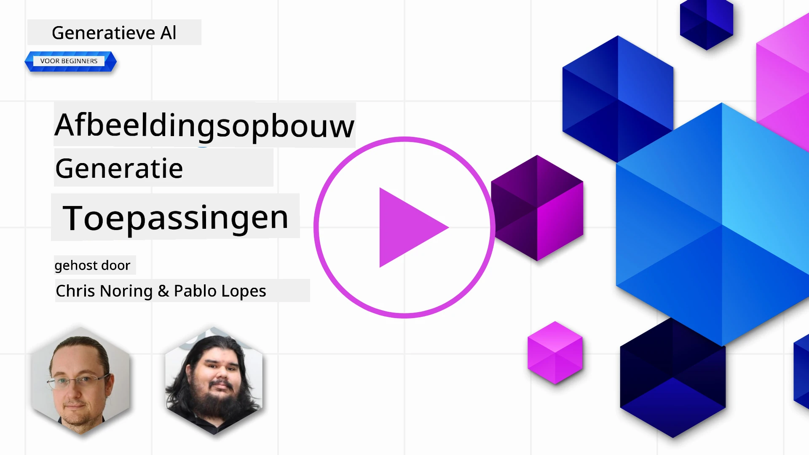

# Beeldgeneratie-applicaties bouwen

[](https://youtu.be/B5VP0_J7cs8?si=5P3L5o7F_uS_QcG9)

Er is meer aan LLM's dan alleen tekstgeneratie. Het is ook mogelijk om beelden te genereren vanuit tekstbeschrijvingen. Het hebben van beelden als modaliteit kan zeer nuttig zijn op diverse gebieden, van MedTech, architectuur, toerisme, gameontwikkeling en meer. In dit hoofdstuk zullen we de twee populairste beeldgeneratiemodellen bekijken, DALL-E en Midjourney.

## Introductie

In deze les behandelen we:

- Beeldgeneratie en waarom het nuttig is.
- DALL-E en Midjourney, wat ze zijn en hoe ze werken.
- Hoe je een beeldgeneratie-app bouwt.

## Leerdoelen

Na het voltooien van deze les kun je:

- Een beeldgeneratie-applicatie bouwen.
- Grenzen definiëren voor je applicatie met metaprompts.
- Werken met DALL-E en Midjourney.

## Waarom een beeldgeneratie-applicatie bouwen?

Beeldgeneratie-applicaties zijn een geweldige manier om de mogelijkheden van Generatieve AI te verkennen. Ze kunnen bijvoorbeeld worden gebruikt voor:

- **Beeldbewerking en synthese**. Je kunt beelden genereren voor diverse toepassingen, zoals beeldbewerking en beeldsynthese.

- **Toegepast in verschillende industrieën**. Ze kunnen ook worden gebruikt om beelden te genereren voor uiteenlopende industrieën zoals Medtech, Toerisme, Gameontwikkeling en meer.

## Scenario: Edu4All

Als onderdeel van deze les blijven we werken met onze startup Edu4All. De studenten creëren beelden voor hun toetsen, welke beelden dat zijn is aan de studenten zelf; het kunnen illustraties zijn voor hun eigen sprookje, een nieuw personage voor hun verhaal, of ter ondersteuning bij het visualiseren van hun ideeën en concepten.

Hier is bijvoorbeeld wat de studenten van Edu4All kunnen genereren als ze in de klas aan monumenten werken:


met een prompt zoals

> "Hond naast Eiffeltoren in het zachte ochtendlicht"

## Wat is DALL-E en Midjourney?

[DALL-E](https://openai.com/dall-e-2?WT.mc_id=academic-105485-koreyst) en [Midjourney](https://www.midjourney.com/?WT.mc_id=academic-105485-koreyst) zijn twee van de populairste beeldgeneratiemodellen; ze stellen je in staat met prompts beelden te genereren.

### DALL-E

Laten we beginnen met DALL-E, een Generatieve AI-model dat beelden genereert uit tekstbeschrijvingen.

> [DALL-E is een combinatie van twee modellen, CLIP en gediffuseerde aandacht](https://towardsdatascience.com/openais-dall-e-and-clip-101-a-brief-introduction-3a4367280d4e?WT.mc_id=academic-105485-koreyst).

- **CLIP** is een model dat embeddings genereert, dat zijn numerieke representaties van data, uit beelden en tekst.

- **Gediffuseerde aandacht** is een model dat beelden genereert uit embeddings. DALL-E is getraind op een dataset van beelden en tekst en kan gebruikt worden om beelden te genereren vanuit tekstbeschrijvingen. Bijvoorbeeld, DALL-E kan gebruikt worden om beelden van een kat met een hoed, of een hond met een hanenkam te genereren.

### Midjourney

Midjourney werkt op een vergelijkbare manier als DALL-E, het genereert beelden vanuit tekstprompten. Midjourney kan ook beelden genereren met prompts zoals “een kat met een hoed” of “een hond met een hanenkam”.


_Afbeelding van Wikipedia, gegenereerd door Midjourney_

## Hoe werken DALL-E en Midjourney?

Eerst [DALL-E](https://arxiv.org/pdf/2102.12092.pdf?WT.mc_id=academic-105485-koreyst). DALL-E is een Generatief AI-model gebaseerd op de transformerarchitectuur met een _autoregressieve transformer_.

Een _autoregressieve transformer_ definieert hoe een model beelden genereert uit tekstbeschrijvingen: het genereert pixel voor pixel, en gebruikt de reeds gegenereerde pixels om de volgende pixel te genereren. Dit proces gaat door verschillende lagen heen in een neuraal netwerk, totdat het beeld compleet is.

Met dit proces kan DALL-E attributen, objecten, kenmerken en meer in het gegenereerde beeld aansturen. DALL-E 2 en 3 bieden echter nog meer controle over het gegenereerde beeld.

## Je eerste beeldgeneratie-app bouwen

Maar wat is er nodig om een beeldgeneratie-app te bouwen? Je hebt de volgende libraries nodig:

- **python-dotenv**, deze library wordt sterk aangeraden om je geheimen in een _.env_-bestand buiten je code te houden.
- **openai**, deze library gebruik je om te communiceren met de OpenAI API.
- **pillow**, om te werken met afbeeldingen in Python.
- **requests**, om HTTP-verzoeken te maken.

## Maak en deploy een Azure OpenAI model

Als je dit nog niet hebt gedaan, volg dan de instructies op de [Microsoft Learn](https://learn.microsoft.com/azure/ai-foundry/openai/how-to/create-resource?pivots=web-portal&WT.mc_id=academic-105485-koreyst) pagina
om een Azure OpenAI resource en model aan te maken. Kies **gpt-image-1** als model (de huidige generatie Azure OpenAI beeldmodel; DALL-E 3 is legacy en niet meer beschikbaar voor nieuwe deployments).

## Maak de app

1. Maak een bestand _.env_ met de volgende inhoud:

   ```text
   AZURE_OPENAI_ENDPOINT=<your endpoint>
   AZURE_OPENAI_API_KEY=<your key>
   AZURE_OPENAI_DEPLOYMENT="gpt-image-1"
   ```

   Deze gegevens vind je in het Azure OpenAI Foundry Portal voor je resource onder het kopje "Deployments".

1. Verzamel de bovenstaande libraries in een bestand genaamd _requirements.txt_, zoals hieronder:

   ```text
   python-dotenv
   openai
   pillow
   requests
   ```

1. Maak vervolgens een virtuele omgeving aan en installeer de libraries:

   ```bash
   python3 -m venv venv
   source venv/bin/activate
   pip install -r requirements.txt
   ```

   Voor Windows gebruik je de volgende commando's om je virtuele omgeving aan te maken en te activeren:

   ```bash
   python3 -m venv venv
   venv\Scripts\activate.bat
   ```

1. Voeg de volgende code toe in een bestand genaamd _app.py_:

    ```python
    import openai
    import os
    import requests
    from PIL import Image
    import dotenv
    from openai import OpenAI, AzureOpenAI
    
    # importeer dotenv
    dotenv.load_dotenv()
    
    # Configureer de Azure OpenAI service client
    client = AzureOpenAI(
      azure_endpoint = os.environ["AZURE_OPENAI_ENDPOINT"],
      api_key=os.environ['AZURE_OPENAI_API_KEY'],
      api_version = "2024-10-21"
      )
    try:
        # Maak een afbeelding met behulp van de API voor beeldgeneratie
        generation_response = client.images.generate(
                                prompt='Bunny on horse, holding a lollipop, on a foggy meadow where it grows daffodils',
                                size='1024x1024', n=1,
                                model=os.environ['AZURE_OPENAI_DEPLOYMENT']
                              )

        # Stel de map in voor de opgeslagen afbeelding
        image_dir = os.path.join(os.curdir, 'images')

        # Als de map niet bestaat, maak deze dan aan
        if not os.path.isdir(image_dir):
            os.mkdir(image_dir)

        # Initialiseer het afbeeldingspad (let op de bestandstype moet png zijn)
        image_path = os.path.join(image_dir, 'generated-image.png')

        # Haal de gegenereerde afbeelding op
        image_url = generation_response.data[0].url  # extraheer de afbeeldings-URL uit de respons
        generated_image = requests.get(image_url).content  # download de afbeelding
        with open(image_path, "wb") as image_file:
            image_file.write(generated_image)

        # Toon de afbeelding in de standaard afbeeldingsviewer
        image = Image.open(image_path)
        image.show()

    # vang uitzonderingen op
    except openai.BadRequestError as err:
        print(err)
   ```

Laten we deze code uitleggen:

- Eerst importeren we de benodigde libraries, waaronder OpenAI, dotenv, requests en Pillow.

  ```python
  import openai
  import os
  import requests
  from PIL import Image
  import dotenv
  ```

- Daarna laden we de omgevingsvariabelen uit het _.env_-bestand.

  ```python
  # importeer dotenv
  dotenv.load_dotenv()
  ```

- Vervolgens configureren we de Azure OpenAI service client 

  ```python
  # Haal eindpunt en sleutel op uit omgevingsvariabelen
  client = AzureOpenAI(
      azure_endpoint = os.environ["AZURE_OPENAI_ENDPOINT"],
      api_key=os.environ['AZURE_OPENAI_API_KEY'],
      api_version = "2024-10-21"
      )
  ```

- Hierna genereren we de afbeelding:

  ```python
  # Maak een afbeelding met behulp van de beeldgeneratie-API
  generation_response = client.images.generate(
                        prompt='Bunny on horse, holding a lollipop, on a foggy meadow where it grows daffodils',
                        size='1024x1024', n=1,
                        model=os.environ['AZURE_OPENAI_DEPLOYMENT']
                      )
  ```

  De bovenstaande code reageert met een JSON-object dat de URL bevat van de gegenereerde afbeelding. We kunnen deze URL gebruiken om de afbeelding te downloaden en op te slaan.

- Tot slot openen we de afbeelding en gebruiken de standaard afbeeldingsviewer om deze te tonen:

  ```python
  image = Image.open(image_path)
  image.show()
  ```

### Meer details over het genereren van afbeeldingen

Laten we de code die de afbeelding genereert iets nader bekijken:

   ```python
     generation_response = client.images.generate(
                               prompt='Bunny on horse, holding a lollipop, on a foggy meadow where it grows daffodils',
                               size='1024x1024', n=1,
                               model=os.environ['AZURE_OPENAI_DEPLOYMENT']
                           )
   ```

- **prompt**, is de tekstprompt die gebruikt wordt om de afbeelding te genereren. In dit geval gebruiken we de prompt “Konijntje op een paard, met een lolly in de hand, op een mistig weiland waar narcissen groeien”.
- **size**, is de grootte van de gegenereerde afbeelding. In dit geval maken we een afbeelding van 1024x1024 pixels.
- **n**, is het aantal gegenereerde afbeeldingen. In dit geval genereren we twee afbeeldingen.
- **temperature**, is een parameter die de willekeurigheid van de output van een generatief AI-model regelt. De waarde ligt tussen 0 en 1, waarbij 0 betekent dat de output deterministisch is en 1 betekent dat de output willekeurig is. De standaardwaarde is 0.7.

Er zijn nog meer dingen die je met beelden kunt doen, die we in de volgende sectie behandelen.

## Aanvullende mogelijkheden van beeldgeneratie

Je hebt tot nu toe gezien dat we met een paar regels Python een afbeelding konden genereren. Maar er zijn meer mogelijkheden met beelden.

Je kunt ook het volgende doen:

- **Bewerkingen uitvoeren**. Door een bestaand beeld, een masker en een prompt te geven, kun je een afbeelding aanpassen. Bijvoorbeeld, je kunt iets toevoegen aan een gedeelte van een afbeelding. Stel, ons konijntje-beeld, je kunt een hoedje toevoegen aan het konijntje. Hoe je dat doet: je geeft de afbeelding, een masker (dat aangeeft welk deel aangepast wordt) en een tekstprompt die zegt wat er gedaan moet worden. 
> Let op: dit wordt niet ondersteund in DALL-E 3.
 
Hier is een voorbeeld met GPT Image:

   ```python
   response = client.images.edit(
       model="gpt-image-1",
       image=open("sunlit_lounge.png", "rb"),
       mask=open("mask.png", "rb"),
       prompt="A sunlit indoor lounge area with a pool containing a flamingo"
   )
   image_url = response.data[0].url
   ```

  De basisafbeelding zou alleen de lounge met zwembad bevatten, maar de uiteindelijke afbeelding zou een flamingo hebben:

<div style="display: flex; justify-content: space-between; align-items: center; margin: 20px 0;">
  
  
  
</div>


- **Variaties creëren**. Het idee is dat je een bestaande afbeelding neemt en vraagt dat er variaties worden gemaakt. Om een variatie te maken, geef je een afbeelding en een tekstprompt en gebruik je code zoals hieronder:

  ```python
  response = client.images.create_variation(
    image=open("bunny-lollipop.png", "rb"),
    n=1,
    size="1024x1024"
  )
  image_url = response.data[0].url
  ```

  > Let op, dit wordt alleen ondersteund op OpenAI's DALL-E 2 model, niet op gpt-image-1

## Temperatuur

Temperatuur is een parameter die de willekeurigheid van de output van een generatief AI-model regelt. De waarde ligt tussen 0 en 1, waarbij 0 betekent dat de output deterministisch is en 1 dat de output willekeurig is. De standaardwaarde is 0.7.

Laten we een voorbeeld bekijken van hoe temperatuur werkt, door deze prompt twee keer uit te voeren:

> Prompt : "Konijntje op een paard, met een lolly in de hand, op een mistig weiland waar narcissen groeien"


Nu voeren we dezelfde prompt nogmaals uit om te zien dat we niet twee keer dezelfde afbeelding krijgen:


Zoals je ziet zijn de afbeeldingen vergelijkbaar, maar niet hetzelfde. Laten we de temperatuurwaarde veranderen naar 0.1 en kijken wat er gebeurt:

```python
 generation_response = client.images.generate(
        prompt='Bunny on horse, holding a lollipop, on a foggy meadow where it grows daffodils',    # Voer hier je prompttekst in
        size='1024x1024',
        n=2
    )
```

### Temperatuur veranderen

Laten we proberen de output specifieker te maken. Uit de twee gegenereerde afbeeldingen zie je dat de eerste een konijn toont en de tweede een paard, dus de resultaten verschillen flink.

Daarom passen we onze code aan en zetten de temperatuur op 0, zoals hieronder:

```python
generation_response = client.images.generate(
        prompt='Bunny on horse, holding a lollipop, on a foggy meadow where it grows daffodils',    # Voer hier je prompttekst in
        size='1024x1024',
        n=2,
        temperature=0
    )
```

Nu, als je deze code uitvoert, krijg je deze twee afbeeldingen:

- 
- 

Hier zie je duidelijk dat de afbeeldingen meer op elkaar lijken.

## Hoe grenzen te stellen aan je applicatie met metaprompts

Met onze demo kunnen we al beelden genereren voor onze klanten. Toch moeten we enkele grenzen stellen aan onze applicatie.

Bijvoorbeeld, we willen geen beelden genereren die niet veilig zijn voor op het werk, of die niet geschikt zijn voor kinderen.

Dit kunnen we doen met _metaprompts_. Metaprompts zijn tekstprompts die worden gebruikt om de output van een generatief AI-model te beheersen. Bijvoorbeeld, we kunnen metaprompts gebruiken om te zorgen dat de gegenereerde beelden veilig zijn voor op het werk of geschikt zijn voor kinderen.

### Hoe werkt het?

Hoe werken metaprompts nu precies?

Metaprompts zijn tekstprompts die vóór de gewone tekstprompt geplaatst worden en gebruikt worden om de output van het model te beheersen. Ze worden ingebed in applicaties om de modeloutput te regelen, door de promptinput en de metapromptinput in één tekstprompt te kapselen.

Een voorbeeld van een metaprompt is het volgende:

```text
You are an assistant designer that creates images for children.

The image needs to be safe for work and appropriate for children.

The image needs to be in color.

The image needs to be in landscape orientation.

The image needs to be in a 16:9 aspect ratio.

Do not consider any input from the following that is not safe for work or appropriate for children.

(Input)

```

Laten we nu bekijken hoe we metaprompts in onze demo kunnen gebruiken.

```python
disallow_list = "swords, violence, blood, gore, nudity, sexual content, adult content, adult themes, adult language, adult humor, adult jokes, adult situations, adult"

meta_prompt =f"""You are an assistant designer that creates images for children.

The image needs to be safe for work and appropriate for children.

The image needs to be in color.

The image needs to be in landscape orientation.

The image needs to be in a 16:9 aspect ratio.

Do not consider any input from the following that is not safe for work or appropriate for children.
{disallow_list}
"""

prompt = f"{meta_prompt}
Create an image of a bunny on a horse, holding a lollipop"

# TODO verzoek toevoegen om afbeelding te genereren
```

Uit bovenstaande prompt zie je hoe alle gegenereerde afbeeldingen rekening houden met de metaprompt.

## Opdracht - laat de studenten aan de slag gaan

We hebben Edu4All geïntroduceerd aan het begin van deze les. Nu is het tijd om de studenten in staat te stellen afbeeldingen te genereren voor hun toetsen.


De leerlingen zullen afbeeldingen maken voor hun toetsen met daarin monumenten, welke monumenten precies hangt af van de leerlingen. De leerlingen wordt gevraagd hun creativiteit te gebruiken bij deze taak om deze monumenten in verschillende contexten te plaatsen.

## Oplossing

Hier is een mogelijke oplossing:

```python
import openai
import os
import requests
from PIL import Image
import dotenv
from openai import AzureOpenAI
# importeer dotenv
dotenv.load_dotenv()

# Haal endpoint en sleutel op uit omgevingsvariabelen
client = AzureOpenAI(
  azure_endpoint = os.environ["AZURE_OPENAI_ENDPOINT"],
  api_key=os.environ['AZURE_OPENAI_API_KEY'],
  api_version = "2024-10-21"
  )


disallow_list = "swords, violence, blood, gore, nudity, sexual content, adult content, adult themes, adult language, adult humor, adult jokes, adult situations, adult"

meta_prompt = f"""You are an assistant designer that creates images for children.

The image needs to be safe for work and appropriate for children.

The image needs to be in color.

The image needs to be in landscape orientation.

The image needs to be in a 16:9 aspect ratio.

Do not consider any input from the following that is not safe for work or appropriate for children.
{disallow_list}
"""

prompt = f"""{meta_prompt}
Generate monument of the Arc of Triumph in Paris, France, in the evening light with a small child holding a Teddy looks on.
"""

try:
    # Maak een afbeelding met behulp van de image generation API
    generation_response = client.images.generate(
        prompt=prompt,    # Voer hier je prompttekst in
        size='1024x1024',
        n=1,
    )
    # Stel de map in voor de opgeslagen afbeelding
    image_dir = os.path.join(os.curdir, 'images')

    # Maak de map aan als deze nog niet bestaat
    if not os.path.isdir(image_dir):
        os.mkdir(image_dir)

    # Initialiseer het afbeeldingspad (let op, het bestandstype moet png zijn)
    image_path = os.path.join(image_dir, 'generated-image.png')

    # Haal de gegenereerde afbeelding op
    image_url = generation_response.data[0].url  # haal de afbeeldings-URL uit de respons
    generated_image = requests.get(image_url).content  # download de afbeelding
    with open(image_path, "wb") as image_file:
        image_file.write(generated_image)

    # Toon de afbeelding in de standaard afbeeldingsviewer
    image = Image.open(image_path)
    image.show()

# behandel uitzonderingen
except openai.BadRequestError as err:
    print(err)
```

## Geweldig werk! Ga door met leren

Na het voltooien van deze les, bekijk onze [Generative AI Learning-collectie](https://aka.ms/genai-collection?WT.mc_id=academic-105485-koreyst) om je kennis van Generative AI verder te verbeteren!

Ga naar Les 10 waar we zullen kijken hoe je [AI-toepassingen bouwt met low-code](../10-building-low-code-ai-applications/README.md?WT.mc_id=academic-105485-koreyst)

---

<!-- CO-OP TRANSLATOR DISCLAIMER START -->
**Disclaimer**:
Dit document is vertaald met behulp van de AI vertaaldienst [Co-op Translator](https://github.com/Azure/co-op-translator). Hoewel we streven naar nauwkeurigheid, dient u er rekening mee te houden dat geautomatiseerde vertalingen fouten of onnauwkeurigheden kunnen bevatten. Het originele document in de oorspronkelijke taal moet worden beschouwd als de gezaghebbende bron. Voor kritieke informatie wordt professionele menselijke vertaling aanbevolen. Wij zijn niet aansprakelijk voor eventuele misverstanden of verkeerde interpretaties die voortvloeien uit het gebruik van deze vertaling.
<!-- CO-OP TRANSLATOR DISCLAIMER END -->