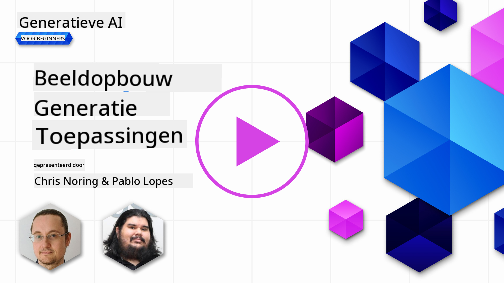

<!--
CO_OP_TRANSLATOR_METADATA:
{
  "original_hash": "7a655f30d1dcbdfe6eff2558eff249af",
  "translation_date": "2025-06-25T17:26:13+00:00",
  "source_file": "09-building-image-applications/README.md",
  "language_code": "nl"
}
-->
# Bouw Toepassingen voor Beeldgeneratie

[](https://aka.ms/gen-ai-lesson9-gh?WT.mc_id=academic-105485-koreyst)

Er is meer aan LLMs dan alleen tekstgeneratie. Het is ook mogelijk om beelden te genereren vanuit tekstbeschrijvingen. Beelden als een modaliteit kunnen zeer nuttig zijn in verschillende gebieden, van MedTech, architectuur, toerisme, spelontwikkeling en meer. In dit hoofdstuk zullen we de twee populairste beeldgeneratiemodellen, DALL-E en Midjourney, bekijken.

## Inleiding

In deze les behandelen we:

- Beeldgeneratie en waarom het nuttig is.
- DALL-E en Midjourney, wat ze zijn en hoe ze werken.
- Hoe je een beeldgeneratietoepassing zou bouwen.

## Leerdoelen

Na het voltooien van deze les kun je:

- Een beeldgeneratietoepassing bouwen.
- Grenzen voor je toepassing definiëren met metaprompts.
- Werken met DALL-E en Midjourney.

## Waarom een beeldgeneratietoepassing bouwen?

Beeldgeneratietoepassingen zijn een geweldige manier om de mogelijkheden van Generatieve AI te verkennen. Ze kunnen bijvoorbeeld worden gebruikt voor:

- **Beeldbewerking en synthese**. Je kunt beelden genereren voor verschillende toepassingen, zoals beeldbewerking en beeldsynthese.

- **Toegepast in verschillende industrieën**. Ze kunnen ook worden gebruikt om beelden te genereren voor verschillende industrieën zoals Medtech, Toerisme, Spelontwikkeling en meer.

## Scenario: Edu4All

Als onderdeel van deze les zullen we verder werken met onze startup, Edu4All. De studenten zullen beelden creëren voor hun beoordelingen, precies welke beelden is aan de studenten, maar ze kunnen illustraties maken voor hun eigen sprookje of een nieuw personage voor hun verhaal creëren of hen helpen hun ideeën en concepten te visualiseren.

Hier is een voorbeeld van wat de studenten van Edu4All zouden kunnen genereren als ze in de klas werken aan monumenten:


met een prompt zoals

> "Hond naast de Eiffeltoren in de vroege ochtendzon"

## Wat is DALL-E en Midjourney?

[DALL-E](https://openai.com/dall-e-2?WT.mc_id=academic-105485-koreyst) en [Midjourney](https://www.midjourney.com/?WT.mc_id=academic-105485-koreyst) zijn twee van de populairste beeldgeneratiemodellen, ze stellen je in staat om prompts te gebruiken om beelden te genereren.

### DALL-E

Laten we beginnen met DALL-E, een Generatieve AI-model dat beelden genereert vanuit tekstbeschrijvingen.

> [DALL-E is een combinatie van twee modellen, CLIP en diffused attention](https://towardsdatascience.com/openais-dall-e-and-clip-101-a-brief-introduction-3a4367280d4e?WT.mc_id=academic-105485-koreyst).

- **CLIP**, is een model dat embeddings genereert, wat numerieke representaties van data zijn, vanuit beelden en tekst.

- **Diffused attention**, is een model dat beelden genereert vanuit embeddings. DALL-E is getraind op een dataset van beelden en tekst en kan worden gebruikt om beelden te genereren vanuit tekstbeschrijvingen. Bijvoorbeeld, DALL-E kan worden gebruikt om beelden te genereren van een kat met een hoed, of een hond met een hanenkam.

### Midjourney

Midjourney werkt op een vergelijkbare manier als DALL-E, het genereert beelden vanuit tekstprompts. Midjourney kan ook worden gebruikt om beelden te genereren met prompts zoals "een kat met een hoed", of een "hond met een hanenkam".


_Beeldcred Wikipedia, beeld gegenereerd door Midjourney_

## Hoe werken DALL-E en Midjourney

Ten eerste, [DALL-E](https://arxiv.org/pdf/2102.12092.pdf?WT.mc_id=academic-105485-koreyst). DALL-E is een Generatieve AI-model gebaseerd op de transformerarchitectuur met een _autoregressieve transformer_.

Een _autoregressieve transformer_ definieert hoe een model beelden genereert vanuit tekstbeschrijvingen, het genereert één pixel tegelijk, en gebruikt vervolgens de gegenereerde pixels om de volgende pixel te genereren. Het doorloopt meerdere lagen in een neuraal netwerk, totdat het beeld compleet is.

Met dit proces controleert DALL-E attributen, objecten, kenmerken en meer in het beeld dat het genereert. Echter, DALL-E 2 en 3 hebben meer controle over het gegenereerde beeld.

## Je eerste beeldgeneratietoepassing bouwen

Wat is er nodig om een beeldgeneratietoepassing te bouwen? Je hebt de volgende bibliotheken nodig:

- **python-dotenv**, het wordt sterk aanbevolen om deze bibliotheek te gebruiken om je geheimen in een _.env_ bestand weg van de code te bewaren.
- **openai**, deze bibliotheek gebruik je om te communiceren met de OpenAI API.
- **pillow**, om met beelden in Python te werken.
- **requests**, om je te helpen HTTP-verzoeken te doen.

1. Maak een bestand _.env_ met de volgende inhoud:

   ```text
   AZURE_OPENAI_ENDPOINT=<your endpoint>
   AZURE_OPENAI_API_KEY=<your key>
   ```

   Zoek deze informatie in Azure Portal voor je resource in de sectie "Keys and Endpoint".

1. Verzamel de bovenstaande bibliotheken in een bestand genaamd _requirements.txt_ zoals volgt:

   ```text
   python-dotenv
   openai
   pillow
   requests
   ```

1. Maak vervolgens een virtuele omgeving en installeer de bibliotheken:

   ```bash
   python3 -m venv venv
   source venv/bin/activate
   pip install -r requirements.txt
   ```

   Voor Windows, gebruik de volgende commando's om je virtuele omgeving te creëren en te activeren:

   ```bash
   python3 -m venv venv
   venv\Scripts\activate.bat
   ```

1. Voeg de volgende code toe in een bestand genaamd _app.py_:

   ```python
   import openai
   import os
   import requests
   from PIL import Image
   import dotenv

   # import dotenv
   dotenv.load_dotenv()

   # Get endpoint and key from environment variables
   openai.api_base = os.environ['AZURE_OPENAI_ENDPOINT']
   openai.api_key = os.environ['AZURE_OPENAI_API_KEY']

   # Assign the API version (DALL-E is currently supported for the 2023-06-01-preview API version only)
   openai.api_version = '2023-06-01-preview'
   openai.api_type = 'azure'


   try:
       # Create an image by using the image generation API
       generation_response = openai.Image.create(
           prompt='Bunny on horse, holding a lollipop, on a foggy meadow where it grows daffodils',    # Enter your prompt text here
           size='1024x1024',
           n=2,
           temperature=0,
       )
       # Set the directory for the stored image
       image_dir = os.path.join(os.curdir, 'images')

       # If the directory doesn't exist, create it
       if not os.path.isdir(image_dir):
           os.mkdir(image_dir)

       # Initialize the image path (note the filetype should be png)
       image_path = os.path.join(image_dir, 'generated-image.png')

       # Retrieve the generated image
       image_url = generation_response["data"][0]["url"]  # extract image URL from response
       generated_image = requests.get(image_url).content  # download the image
       with open(image_path, "wb") as image_file:
           image_file.write(generated_image)

       # Display the image in the default image viewer
       image = Image.open(image_path)
       image.show()

   # catch exceptions
   except openai.InvalidRequestError as err:
       print(err)

   ```

Laten we deze code uitleggen:

- Eerst importeren we de bibliotheken die we nodig hebben, inclusief de OpenAI bibliotheek, de dotenv bibliotheek, de requests bibliotheek, en de Pillow bibliotheek.

  ```python
  import openai
  import os
  import requests
  from PIL import Image
  import dotenv
  ```

- Vervolgens laden we de omgevingsvariabelen uit het _.env_ bestand.

  ```python
  # import dotenv
  dotenv.load_dotenv()
  ```

- Daarna stellen we het eindpunt, de sleutel voor de OpenAI API, versie en type in.

  ```python
  # Get endpoint and key from environment variables
  openai.api_base = os.environ['AZURE_OPENAI_ENDPOINT']
  openai.api_key = os.environ['AZURE_OPENAI_API_KEY']

  # add version and type, Azure specific
  openai.api_version = '2023-06-01-preview'
  openai.api_type = 'azure'
  ```

- Vervolgens genereren we het beeld:

  ```python
  # Create an image by using the image generation API
  generation_response = openai.Image.create(
      prompt='Bunny on horse, holding a lollipop, on a foggy meadow where it grows daffodils',    # Enter your prompt text here
      size='1024x1024',
      n=2,
      temperature=0,
  )
  ```

  De bovenstaande code reageert met een JSON-object dat de URL van het gegenereerde beeld bevat. We kunnen de URL gebruiken om het beeld te downloaden en op te slaan in een bestand.

- Ten slotte openen we het beeld en gebruiken we de standaard beeldviewer om het weer te geven:

  ```python
  image = Image.open(image_path)
  image.show()
  ```

### Meer details over het genereren van het beeld

Laten we de code die het beeld genereert in meer detail bekijken:

```python
generation_response = openai.Image.create(
        prompt='Bunny on horse, holding a lollipop, on a foggy meadow where it grows daffodils',    # Enter your prompt text here
        size='1024x1024',
        n=2,
        temperature=0,
    )
```

- **prompt**, is de tekstprompt die wordt gebruikt om het beeld te genereren. In dit geval gebruiken we de prompt "Konijn op paard, met een lolly, op een mistige weide waar narcissen groeien".
- **size**, is de grootte van het beeld dat wordt gegenereerd. In dit geval genereren we een beeld van 1024x1024 pixels.
- **n**, is het aantal beelden dat wordt gegenereerd. In dit geval genereren we twee beelden.
- **temperature**, is een parameter die de willekeurigheid van de output van een Generatieve AI-model controleert. De temperatuur is een waarde tussen 0 en 1 waarbij 0 betekent dat de output deterministisch is en 1 betekent dat de output willekeurig is. De standaardwaarde is 0.7.

Er zijn meer dingen die je kunt doen met beelden die we in het volgende gedeelte zullen behandelen.

## Aanvullende mogelijkheden van beeldgeneratie

Je hebt tot nu toe gezien hoe we een beeld konden genereren met een paar regels in Python. Er zijn echter meer dingen die je kunt doen met beelden.

Je kunt ook het volgende doen:

- **Bewerkingen uitvoeren**. Door een bestaand beeld een masker en een prompt te geven, kun je een beeld wijzigen. Bijvoorbeeld, je kunt iets toevoegen aan een deel van een beeld. Stel je ons konijnbeeld voor, je kunt een hoed aan het konijn toevoegen. Hoe je dat zou doen is door het beeld, een masker (dat het deel van het gebied voor de wijziging identificeert) en een tekstprompt te geven om te zeggen wat er moet worden gedaan.

  ```python
  response = openai.Image.create_edit(
    image=open("base_image.png", "rb"),
    mask=open("mask.png", "rb"),
    prompt="An image of a rabbit with a hat on its head.",
    n=1,
    size="1024x1024"
  )
  image_url = response['data'][0]['url']
  ```

  Het basisbeeld zou alleen het konijn bevatten, maar het uiteindelijke beeld zou de hoed op het konijn hebben.

- **Variaties creëren**. Het idee is dat je een bestaand beeld neemt en vraagt dat er variaties worden gemaakt. Om een variatie te creëren, geef je een beeld en een tekstprompt en code zoals volgt:

  ```python
  response = openai.Image.create_variation(
    image=open("bunny-lollipop.png", "rb"),
    n=1,
    size="1024x1024"
  )
  image_url = response['data'][0]['url']
  ```

  > Opmerking, dit wordt alleen ondersteund op OpenAI

## Temperatuur

Temperatuur is een parameter die de willekeurigheid van de output van een Generatieve AI-model controleert. De temperatuur is een waarde tussen 0 en 1 waarbij 0 betekent dat de output deterministisch is en 1 betekent dat de output willekeurig is. De standaardwaarde is 0.7.

Laten we een voorbeeld bekijken van hoe temperatuur werkt, door deze prompt twee keer uit te voeren:

> Prompt : "Konijn op paard, met een lolly, op een mistige weide waar narcissen groeien"


Nu laten we dezelfde prompt nog een keer uitvoeren om te zien dat we niet hetzelfde beeld twee keer krijgen:


Zoals je kunt zien, zijn de beelden vergelijkbaar, maar niet hetzelfde. Laten we proberen de temperatuurwaarde te veranderen naar 0.1 en zien wat er gebeurt:

```python
 generation_response = openai.Image.create(
        prompt='Bunny on horse, holding a lollipop, on a foggy meadow where it grows daffodils',    # Enter your prompt text here
        size='1024x1024',
        n=2
    )
```

### De temperatuur veranderen

Laten we proberen de respons meer deterministisch te maken. We konden observeren van de twee beelden die we genereerden dat er in het eerste beeld een konijn is en in het tweede beeld een paard, dus de beelden variëren sterk.

Laten we daarom onze code veranderen en de temperatuur instellen op 0, zoals volgt:

```python
generation_response = openai.Image.create(
        prompt='Bunny on horse, holding a lollipop, on a foggy meadow where it grows daffodils',    # Enter your prompt text here
        size='1024x1024',
        n=2,
        temperature=0
    )
```

Nu wanneer je deze code uitvoert, krijg je deze twee beelden:

- 
- 

Hier kun je duidelijk zien hoe de beelden elkaar meer lijken.

## Hoe grenzen voor je toepassing te definiëren met metaprompts

Met onze demo kunnen we al beelden genereren voor onze klanten. Echter, we moeten enkele grenzen voor onze toepassing creëren.

Bijvoorbeeld, we willen geen beelden genereren die niet veilig zijn voor werk, of die niet geschikt zijn voor kinderen.

We kunnen dit doen met _metaprompts_. Metaprompts zijn tekstprompts die worden gebruikt om de output van een Generatieve AI-model te controleren. Bijvoorbeeld, we kunnen metaprompts gebruiken om de output te controleren, en ervoor zorgen dat de gegenereerde beelden veilig zijn voor werk, of geschikt voor kinderen.

### Hoe werkt het?

Nu, hoe werken metaprompts?

Metaprompts zijn tekstprompts die worden gebruikt om de output van een Generatieve AI-model te controleren, ze worden vóór de tekstprompt geplaatst, en worden gebruikt om de output van het model te controleren en ingebed in toepassingen om de output van het model te controleren. De promptinput en de metapromptinput in één tekstprompt samenvoegen.

Een voorbeeld van een metaprompt zou het volgende zijn:

```text
You are an assistant designer that creates images for children.

The image needs to be safe for work and appropriate for children.

The image needs to be in color.

The image needs to be in landscape orientation.

The image needs to be in a 16:9 aspect ratio.

Do not consider any input from the following that is not safe for work or appropriate for children.

(Input)

```

Nu, laten we zien hoe we metaprompts in onze demo kunnen gebruiken.

```python
disallow_list = "swords, violence, blood, gore, nudity, sexual content, adult content, adult themes, adult language, adult humor, adult jokes, adult situations, adult"

meta_prompt =f"""You are an assistant designer that creates images for children.

The image needs to be safe for work and appropriate for children.

The image needs to be in color.

The image needs to be in landscape orientation.

The image needs to be in a 16:9 aspect ratio.

Do not consider any input from the following that is not safe for work or appropriate for children.
{disallow_list}
"""

prompt = f"{meta_prompt}
Create an image of a bunny on a horse, holding a lollipop"

# TODO add request to generate image
```

Uit de bovenstaande prompt kun je zien hoe alle beelden die worden gecreëerd rekening houden met de metaprompt.

## Opdracht - laten we studenten in staat stellen

We introduceerden Edu4All aan het begin van deze les. Nu is het tijd om de studenten in staat te stellen beelden te genereren voor hun beoordelingen.

De studenten zullen beelden creëren voor hun beoordelingen met monumenten, precies welke monumenten is aan de studenten. De studenten worden gevraagd hun creativiteit te gebruiken in deze taak om deze monumenten in verschillende contexten te plaatsen.

## Oplossing

Hier is een mogelijke oplossing:

```python
import openai
import os
import requests
from PIL import Image
import dotenv

# import dotenv
dotenv.load_dotenv()

# Get endpoint and key from environment variables
openai.api_base = "<replace with endpoint>"
openai.api_key = "<replace with api key>"

# Assign the API version (DALL-E is currently supported for the 2023-06-01-preview API version only)
openai.api_version = '2023-06-01-preview'
openai.api_type = 'azure'

disallow_list = "swords, violence, blood, gore, nudity, sexual content, adult content, adult themes, adult language, adult humor, adult jokes, adult situations, adult"

meta_prompt = f"""You are an assistant designer that creates images for children.

The image needs to be safe for work and appropriate for children.

The image needs to be in color.

The image needs to be in landscape orientation.

The image needs to be in a 16:9 aspect ratio.

Do not consider any input from the following that is not safe for work or appropriate for children.
{disallow_list}"""

prompt = f"""{metaprompt}
Generate monument of the Arc of Triumph in Paris, France, in the evening light with a small child holding a Teddy looks on.
""""

try:
    # Create an image by using the image generation API
    generation_response = openai.Image.create(
        prompt=prompt,    # Enter your prompt text here
        size='1024x1024',
        n=2,
        temperature=0,
    )
    # Set the directory for the stored image
    image_dir = os.path.join(os.curdir, 'images')

    # If the directory doesn't exist, create it
    if not os.path.isdir(image_dir):
        os.mkdir(image_dir)

    # Initialize the image path (note the filetype should be png)
    image_path = os.path.join(image_dir, 'generated-image.png')

    # Retrieve the generated image
    image_url = generation_response["data"][0]["url"]  # extract image URL from response
    generated_image = requests.get(image_url).content  # download the image
    with open(image_path, "wb") as image_file:
        image_file.write(generated_image)

    # Display the image in the default image viewer
    image = Image.open(image_path)
    image.show()

# catch exceptions
except openai.InvalidRequestError as err:
    print(err)
```

## Goed Werk! Ga Verder met Je Leren

Na het voltooien van deze les, bekijk onze [Generative AI Learning collectie](https://aka.ms/genai-collection?WT.mc_id=academic-105485-koreyst) om je kennis van Generatieve AI verder uit te breiden!

Ga naar Les 10 waar we zullen kijken naar hoe je [AI-toepassingen kunt bouwen met low-code](../10-building-low-code-ai-applications/README.md?WT.mc_id=academic-105485-koreyst)

**Disclaimer**:  
Dit document is vertaald met behulp van de AI-vertalingsdienst [Co-op Translator](https://github.com/Azure/co-op-translator). Hoewel we ons best doen voor nauwkeurigheid, dient u zich ervan bewust te zijn dat geautomatiseerde vertalingen fouten of onnauwkeurigheden kunnen bevatten. Het originele document in zijn oorspronkelijke taal moet worden beschouwd als de gezaghebbende bron. Voor cruciale informatie wordt professionele menselijke vertaling aanbevolen. Wij zijn niet aansprakelijk voor misverstanden of misinterpretaties die voortvloeien uit het gebruik van deze vertaling.