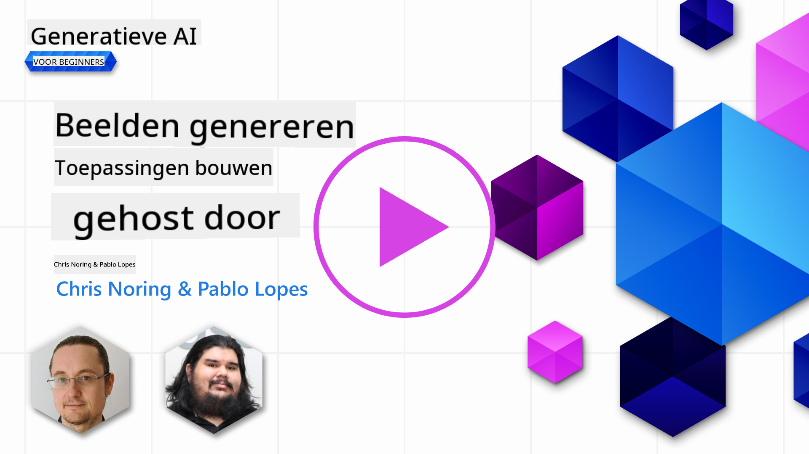

<!--
CO_OP_TRANSLATOR_METADATA:
{
  "original_hash": "1a7fd0f95f9eb673b79da47c0814f4d4",
  "translation_date": "2025-07-09T13:28:29+00:00",
  "source_file": "09-building-image-applications/README.md",
  "language_code": "nl"
}
-->
# Het Bouwen van Beeldgeneratie-applicaties

[](https://aka.ms/gen-ai-lesson9-gh?WT.mc_id=academic-105485-koreyst)

LLM’s zijn niet alleen voor tekstgeneratie. Het is ook mogelijk om beelden te genereren op basis van tekstbeschrijvingen. Beelden als modality kunnen in veel verschillende gebieden erg nuttig zijn, zoals MedTech, architectuur, toerisme, game-ontwikkeling en meer. In dit hoofdstuk bekijken we de twee populairste beeldgeneratiemodellen, DALL-E en Midjourney.

## Introductie

In deze les behandelen we:

- Beeldgeneratie en waarom het nuttig is.
- DALL-E en Midjourney: wat ze zijn en hoe ze werken.
- Hoe je een beeldgeneratie-app bouwt.

## Leerdoelen

Na het afronden van deze les kun je:

- Een beeldgeneratie-applicatie bouwen.
- Grenzen voor je applicatie definiëren met meta prompts.
- Werken met DALL-E en Midjourney.

## Waarom een beeldgeneratie-app bouwen?

Beeldgeneratie-applicaties zijn een geweldige manier om de mogelijkheden van Generatieve AI te verkennen. Ze kunnen bijvoorbeeld worden gebruikt voor:

- **Beeldbewerking en synthese**. Je kunt beelden genereren voor diverse toepassingen, zoals beeldbewerking en beeldsynthese.

- **Toepassing in verschillende sectoren**. Ze kunnen ook worden ingezet om beelden te genereren voor uiteenlopende sectoren zoals Medtech, Toerisme, Game-ontwikkeling en meer.

## Scenario: Edu4All

Als onderdeel van deze les blijven we werken met onze startup Edu4All. De studenten maken beelden voor hun opdrachten; welke beelden precies, mogen ze zelf bepalen. Het kunnen illustraties zijn voor hun eigen sprookje, een nieuw personage voor hun verhaal, of om hun ideeën en concepten te visualiseren.

Hier is een voorbeeld van wat de studenten van Edu4All zouden kunnen genereren als ze in de klas werken aan monumenten:


met een prompt zoals

> "Hond naast de Eiffeltoren in het vroege ochtendlicht"

## Wat zijn DALL-E en Midjourney?

[DALL-E](https://openai.com/dall-e-2?WT.mc_id=academic-105485-koreyst) en [Midjourney](https://www.midjourney.com/?WT.mc_id=academic-105485-koreyst) zijn twee van de populairste beeldgeneratiemodellen, waarmee je beelden kunt genereren op basis van prompts.

### DALL-E

Laten we beginnen met DALL-E, een Generatieve AI-model dat beelden maakt op basis van tekstbeschrijvingen.

> [DALL-E is een combinatie van twee modellen, CLIP en diffused attention](https://towardsdatascience.com/openais-dall-e-and-clip-101-a-brief-introduction-3a4367280d4e?WT.mc_id=academic-105485-koreyst).

- **CLIP** is een model dat embeddings genereert, dit zijn numerieke representaties van data, uit beelden en tekst.

- **Diffused attention** is een model dat beelden genereert vanuit embeddings. DALL-E is getraind op een dataset van beelden en tekst en kan beelden maken op basis van tekstbeschrijvingen. Bijvoorbeeld, DALL-E kan beelden genereren van een kat met een hoed, of een hond met een hanenkam.

### Midjourney

Midjourney werkt op een vergelijkbare manier als DALL-E: het genereert beelden op basis van tekstprompts. Midjourney kan ook beelden maken met prompts zoals “een kat met een hoed” of “een hond met een hanenkam”.

  
_Afbeelding credit Wikipedia, beeld gegenereerd door Midjourney_

## Hoe werken DALL-E en Midjourney?

Eerst [DALL-E](https://arxiv.org/pdf/2102.12092.pdf?WT.mc_id=academic-105485-koreyst). DALL-E is een Generatieve AI-model gebaseerd op de transformer-architectuur met een _autoregressieve transformer_.

Een _autoregressieve transformer_ bepaalt hoe een model beelden genereert vanuit tekstbeschrijvingen: het genereert één pixel tegelijk, en gebruikt de gegenereerde pixels om de volgende pixel te maken. Dit proces gaat door meerdere lagen in een neuraal netwerk, totdat het beeld compleet is.

Met dit proces kan DALL-E attributen, objecten, kenmerken en meer in het gegenereerde beeld aansturen. DALL-E 2 en 3 bieden nog meer controle over het gegenereerde beeld.

## Je eerste beeldgeneratie-app bouwen

Wat heb je nodig om een beeldgeneratie-app te bouwen? De volgende libraries:

- **python-dotenv**, sterk aanbevolen om je geheimen in een _.env_-bestand te bewaren, gescheiden van de code.
- **openai**, deze library gebruik je om te communiceren met de OpenAI API.
- **pillow**, om met beelden te werken in Python.
- **requests**, om HTTP-verzoeken te maken.

1. Maak een bestand _.env_ met de volgende inhoud:

   ```text
   AZURE_OPENAI_ENDPOINT=<your endpoint>
   AZURE_OPENAI_API_KEY=<your key>
   ```

   Deze informatie vind je in de Azure Portal voor je resource onder "Keys and Endpoint".

1. Verzamel de bovenstaande libraries in een bestand genaamd _requirements.txt_ zoals hieronder:

   ```text
   python-dotenv
   openai
   pillow
   requests
   ```

1. Maak vervolgens een virtuele omgeving aan en installeer de libraries:

   ```bash
   python3 -m venv venv
   source venv/bin/activate
   pip install -r requirements.txt
   ```

   Voor Windows gebruik je de volgende commando’s om de virtuele omgeving te maken en te activeren:

   ```bash
   python3 -m venv venv
   venv\Scripts\activate.bat
   ```

1. Voeg de volgende code toe in een bestand genaamd _app.py_:

   ```python
   import openai
   import os
   import requests
   from PIL import Image
   import dotenv

   # import dotenv
   dotenv.load_dotenv()

   # Get endpoint and key from environment variables
   openai.api_base = os.environ['AZURE_OPENAI_ENDPOINT']
   openai.api_key = os.environ['AZURE_OPENAI_API_KEY']

   # Assign the API version (DALL-E is currently supported for the 2023-06-01-preview API version only)
   openai.api_version = '2023-06-01-preview'
   openai.api_type = 'azure'


   try:
       # Create an image by using the image generation API
       generation_response = openai.Image.create(
           prompt='Bunny on horse, holding a lollipop, on a foggy meadow where it grows daffodils',    # Enter your prompt text here
           size='1024x1024',
           n=2,
           temperature=0,
       )
       # Set the directory for the stored image
       image_dir = os.path.join(os.curdir, 'images')

       # If the directory doesn't exist, create it
       if not os.path.isdir(image_dir):
           os.mkdir(image_dir)

       # Initialize the image path (note the filetype should be png)
       image_path = os.path.join(image_dir, 'generated-image.png')

       # Retrieve the generated image
       image_url = generation_response["data"][0]["url"]  # extract image URL from response
       generated_image = requests.get(image_url).content  # download the image
       with open(image_path, "wb") as image_file:
           image_file.write(generated_image)

       # Display the image in the default image viewer
       image = Image.open(image_path)
       image.show()

   # catch exceptions
   except openai.InvalidRequestError as err:
       print(err)

   ```

Laten we deze code uitleggen:

- Eerst importeren we de benodigde libraries, waaronder OpenAI, dotenv, requests en Pillow.

  ```python
  import openai
  import os
  import requests
  from PIL import Image
  import dotenv
  ```

- Daarna laden we de omgevingsvariabelen uit het _.env_-bestand.

  ```python
  # import dotenv
  dotenv.load_dotenv()
  ```

- Vervolgens stellen we de endpoint, sleutel, versie en type in voor de OpenAI API.

  ```python
  # Get endpoint and key from environment variables
  openai.api_base = os.environ['AZURE_OPENAI_ENDPOINT']
  openai.api_key = os.environ['AZURE_OPENAI_API_KEY']

  # add version and type, Azure specific
  openai.api_version = '2023-06-01-preview'
  openai.api_type = 'azure'
  ```

- Daarna genereren we het beeld:

  ```python
  # Create an image by using the image generation API
  generation_response = openai.Image.create(
      prompt='Bunny on horse, holding a lollipop, on a foggy meadow where it grows daffodils',    # Enter your prompt text here
      size='1024x1024',
      n=2,
      temperature=0,
  )
  ```

  De bovenstaande code geeft een JSON-object terug met de URL van het gegenereerde beeld. We kunnen deze URL gebruiken om het beeld te downloaden en op te slaan.

- Tot slot openen we het beeld en tonen het met de standaard beeldviewer:

  ```python
  image = Image.open(image_path)
  image.show()
  ```

### Meer details over het genereren van het beeld

Laten we de code die het beeld genereert wat nader bekijken:

```python
generation_response = openai.Image.create(
        prompt='Bunny on horse, holding a lollipop, on a foggy meadow where it grows daffodils',    # Enter your prompt text here
        size='1024x1024',
        n=2,
        temperature=0,
    )
```

- **prompt** is de tekstprompt die gebruikt wordt om het beeld te genereren. In dit geval gebruiken we de prompt "Konijntje op een paard, met een lolly, op een mistige weide waar narcissen groeien".
- **size** is de grootte van het gegenereerde beeld. Hier maken we een beeld van 1024x1024 pixels.
- **n** is het aantal beelden dat gegenereerd wordt. Hier maken we twee beelden.
- **temperature** is een parameter die de willekeurigheid van de output van een Generatief AI-model regelt. De temperatuur is een waarde tussen 0 en 1, waarbij 0 betekent dat de output deterministisch is en 1 dat de output willekeurig is. De standaardwaarde is 0.7.

Er zijn nog meer mogelijkheden met beelden die we in de volgende sectie behandelen.

## Extra mogelijkheden van beeldgeneratie

Je hebt tot nu toe gezien hoe je met een paar regels Python een beeld kunt genereren. Maar er is meer mogelijk met beelden.

Je kunt ook het volgende doen:

- **Bewerkingen uitvoeren**. Door een bestaand beeld, een masker en een prompt te geven, kun je een beeld aanpassen. Bijvoorbeeld, je kunt iets toevoegen aan een deel van een beeld. Stel je ons konijntje voor, je kunt een hoed toevoegen aan het konijntje. Dit doe je door het beeld, een masker (dat het deel aangeeft waar de wijziging moet komen) en een tekstprompt te geven waarin staat wat er moet gebeuren.

  ```python
  response = openai.Image.create_edit(
    image=open("base_image.png", "rb"),
    mask=open("mask.png", "rb"),
    prompt="An image of a rabbit with a hat on its head.",
    n=1,
    size="1024x1024"
  )
  image_url = response['data'][0]['url']
  ```

  Het basisbeeld bevat alleen het konijn, maar het eindbeeld heeft een hoed op het konijn.

- **Variaties maken**. Het idee is dat je een bestaand beeld neemt en vraagt om variaties te maken. Om een variatie te maken, geef je een beeld en een tekstprompt en code zoals deze:

  ```python
  response = openai.Image.create_variation(
    image=open("bunny-lollipop.png", "rb"),
    n=1,
    size="1024x1024"
  )
  image_url = response['data'][0]['url']
  ```

  > Let op, dit wordt alleen ondersteund door OpenAI

## Temperatuur

Temperatuur is een parameter die de willekeurigheid van de output van een Generatief AI-model regelt. De temperatuur is een waarde tussen 0 en 1, waarbij 0 betekent dat de output deterministisch is en 1 dat de output willekeurig is. De standaardwaarde is 0.7.

Laten we een voorbeeld bekijken van hoe temperatuur werkt, door deze prompt twee keer uit te voeren:

> Prompt: "Konijntje op een paard, met een lolly, op een mistige weide waar narcissen groeien"


Laten we diezelfde prompt nogmaals uitvoeren om te zien dat we niet twee keer hetzelfde beeld krijgen:


Zoals je ziet lijken de beelden op elkaar, maar zijn ze niet hetzelfde. Laten we de temperatuurwaarde veranderen naar 0.1 en kijken wat er gebeurt:

```python
 generation_response = openai.Image.create(
        prompt='Bunny on horse, holding a lollipop, on a foggy meadow where it grows daffodils',    # Enter your prompt text here
        size='1024x1024',
        n=2
    )
```

### Temperatuur aanpassen

Laten we proberen de output meer deterministisch te maken. We zagen bij de twee beelden dat in het eerste beeld een konijntje staat en in het tweede een paard, dus de beelden verschillen sterk.

Laten we daarom onze code aanpassen en de temperatuur op 0 zetten, zo:

```python
generation_response = openai.Image.create(
        prompt='Bunny on horse, holding a lollipop, on a foggy meadow where it grows daffodils',    # Enter your prompt text here
        size='1024x1024',
        n=2,
        temperature=0
    )
```

Als je deze code nu uitvoert, krijg je deze twee beelden:

- 
- 

Hier zie je duidelijk dat de beelden veel meer op elkaar lijken.

## Hoe definieer je grenzen voor je applicatie met metaprompts?

Met onze demo kunnen we al beelden genereren voor onze klanten. Toch moeten we grenzen stellen aan onze applicatie.

We willen bijvoorbeeld geen beelden genereren die niet geschikt zijn voor op het werk, of die niet geschikt zijn voor kinderen.

Dat kunnen we doen met _metaprompts_. Metaprompts zijn tekstprompts die gebruikt worden om de output van een Generatief AI-model te sturen. Zo kunnen we met metaprompts ervoor zorgen dat de gegenereerde beelden veilig zijn voor op het werk of geschikt voor kinderen.

### Hoe werkt dat?

Hoe werken metaprompts precies?

Metaprompts zijn tekstprompts die vóór de tekstprompt geplaatst worden en gebruikt worden om de output van het model te sturen. Ze worden ingebed in applicaties om de output te controleren. Zo worden de prompt-input en de metaprompt-input samengevoegd in één tekstprompt.

Een voorbeeld van een metaprompt is de volgende:

```text
You are an assistant designer that creates images for children.

The image needs to be safe for work and appropriate for children.

The image needs to be in color.

The image needs to be in landscape orientation.

The image needs to be in a 16:9 aspect ratio.

Do not consider any input from the following that is not safe for work or appropriate for children.

(Input)

```

Laten we nu kijken hoe we metaprompts kunnen gebruiken in onze demo.

```python
disallow_list = "swords, violence, blood, gore, nudity, sexual content, adult content, adult themes, adult language, adult humor, adult jokes, adult situations, adult"

meta_prompt =f"""You are an assistant designer that creates images for children.

The image needs to be safe for work and appropriate for children.

The image needs to be in color.

The image needs to be in landscape orientation.

The image needs to be in a 16:9 aspect ratio.

Do not consider any input from the following that is not safe for work or appropriate for children.
{disallow_list}
"""

prompt = f"{meta_prompt}
Create an image of a bunny on a horse, holding a lollipop"

# TODO add request to generate image
```

Uit bovenstaande prompt blijkt dat alle gegenereerde beelden rekening houden met de metaprompt.

## Opdracht - laten we studenten in staat stellen

We introduceerden Edu4All aan het begin van deze les. Nu is het tijd om de studenten in staat te stellen beelden te genereren voor hun opdrachten.

De studenten maken beelden voor hun opdrachten met monumenten; welke monumenten precies, mogen ze zelf bepalen. De studenten worden gevraagd hun creativiteit te gebruiken om deze monumenten in verschillende contexten te plaatsen.

## Oplossing

Hier is een mogelijke oplossing:

```python
import openai
import os
import requests
from PIL import Image
import dotenv

# import dotenv
dotenv.load_dotenv()

# Get endpoint and key from environment variables
openai.api_base = "<replace with endpoint>"
openai.api_key = "<replace with api key>"

# Assign the API version (DALL-E is currently supported for the 2023-06-01-preview API version only)
openai.api_version = '2023-06-01-preview'
openai.api_type = 'azure'

disallow_list = "swords, violence, blood, gore, nudity, sexual content, adult content, adult themes, adult language, adult humor, adult jokes, adult situations, adult"

meta_prompt = f"""You are an assistant designer that creates images for children.

The image needs to be safe for work and appropriate for children.

The image needs to be in color.

The image needs to be in landscape orientation.

The image needs to be in a 16:9 aspect ratio.

Do not consider any input from the following that is not safe for work or appropriate for children.
{disallow_list}"""

prompt = f"""{meta_prompt}
Generate monument of the Arc of Triumph in Paris, France, in the evening light with a small child holding a Teddy looks on.
""""

try:
    # Create an image by using the image generation API
    generation_response = openai.Image.create(
        prompt=prompt,    # Enter your prompt text here
        size='1024x1024',
        n=2,
        temperature=0,
    )
    # Set the directory for the stored image
    image_dir = os.path.join(os.curdir, 'images')

    # If the directory doesn't exist, create it
    if not os.path.isdir(image_dir):
        os.mkdir(image_dir)

    # Initialize the image path (note the filetype should be png)
    image_path = os.path.join(image_dir, 'generated-image.png')

    # Retrieve the generated image
    image_url = generation_response["data"][0]["url"]  # extract image URL from response
    generated_image = requests.get(image_url).content  # download the image
    with open(image_path, "wb") as image_file:
        image_file.write(generated_image)

    # Display the image in the default image viewer
    image = Image.open(image_path)
    image.show()

# catch exceptions
except openai.InvalidRequestError as err:
    print(err)
```

## Goed gedaan! Ga door met leren

Na het afronden van deze les, bekijk onze [Generative AI Learning collectie](https://aka.ms/genai-collection?WT.mc_id=academic-105485-koreyst) om je kennis van Generatieve AI verder uit te breiden!

Ga door naar Les 10, waar we bekijken hoe je [AI-applicaties bouwt met low-code](../10-building-low-code-ai-applications/README.md?WT.mc_id=academic-105485-koreyst)

**Disclaimer**:  
Dit document is vertaald met behulp van de AI-vertalingsdienst [Co-op Translator](https://github.com/Azure/co-op-translator). Hoewel we streven naar nauwkeurigheid, dient u er rekening mee te houden dat geautomatiseerde vertalingen fouten of onnauwkeurigheden kunnen bevatten. Het originele document in de oorspronkelijke taal moet als de gezaghebbende bron worden beschouwd. Voor cruciale informatie wordt professionele menselijke vertaling aanbevolen. Wij zijn niet aansprakelijk voor eventuele misverstanden of verkeerde interpretaties die voortvloeien uit het gebruik van deze vertaling.