<!--
CO_OP_TRANSLATOR_METADATA:
{
  "original_hash": "f5ff3b6204a695a117d6f452403c95f7",
  "translation_date": "2025-06-25T18:59:04+00:00",
  "source_file": "10-building-low-code-ai-applications/README.md",
  "language_code": "nl"
}
-->
# Low Code AI-toepassingen Bouwen

[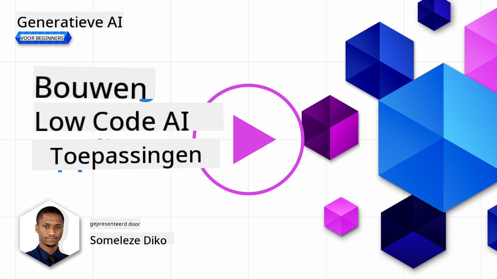](https://aka.ms/gen-ai-lesson10-gh?WT.mc_id=academic-105485-koreyst)

> _(Klik op de afbeelding hierboven om de video van deze les te bekijken)_

## Inleiding

Nu we hebben geleerd hoe we applicaties kunnen bouwen die afbeeldingen genereren, laten we het hebben over low code. Generatieve AI kan worden gebruikt voor verschillende gebieden, waaronder low code, maar wat is low code en hoe kunnen we AI eraan toevoegen?

Het bouwen van apps en oplossingen is eenvoudiger geworden voor traditionele ontwikkelaars en niet-ontwikkelaars door het gebruik van Low Code Development Platforms. Low Code Development Platforms stellen je in staat om apps en oplossingen te bouwen met weinig tot geen code. Dit wordt bereikt door een visuele ontwikkelomgeving te bieden waarmee je componenten kunt slepen en neerzetten om apps en oplossingen te bouwen. Dit stelt je in staat om sneller en met minder middelen apps en oplossingen te bouwen. In deze les duiken we diep in hoe je Low Code kunt gebruiken en hoe je low code-ontwikkeling kunt verbeteren met AI met behulp van Power Platform.

Het Power Platform biedt organisaties de mogelijkheid om hun teams in staat te stellen hun eigen oplossingen te bouwen via een intuïtieve low-code of no-code omgeving. Deze omgeving helpt het proces van het bouwen van oplossingen te vereenvoudigen. Met Power Platform kunnen oplossingen in dagen of weken worden gebouwd in plaats van maanden of jaren. Power Platform bestaat uit vijf belangrijke producten: Power Apps, Power Automate, Power BI, Power Pages en Copilot Studio.

Deze les behandelt:

- Introductie tot Generatieve AI in Power Platform
- Introductie tot Copilot en hoe je het kunt gebruiken
- Het gebruik van Generatieve AI om apps en flows te bouwen in Power Platform
- Inzicht in de AI-modellen in Power Platform met AI Builder

## Leerdoelen

Aan het einde van deze les kun je:

- Begrijpen hoe Copilot werkt in Power Platform.

- Een Student Assignment Tracker App bouwen voor onze educatieve startup.

- Een Factuurverwerkingsstroom bouwen die AI gebruikt om informatie uit facturen te halen.

- Best practices toepassen bij het gebruik van het Create Text with GPT AI Model.

De tools en technologieën die je in deze les zult gebruiken zijn:

- **Power Apps**, voor de Student Assignment Tracker-app, die een low-code ontwikkelomgeving biedt voor het bouwen van apps om gegevens te volgen, beheren en ermee te interacteren.

- **Dataverse**, voor het opslaan van de gegevens voor de Student Assignment Tracker-app, waar Dataverse een low-code dataplatform zal bieden voor het opslaan van de app-gegevens.

- **Power Automate**, voor de Factuurverwerkingsstroom, waar je een low-code ontwikkelomgeving hebt voor het bouwen van workflows om het factuurverwerkingsproces te automatiseren.

- **AI Builder**, voor het Factuurverwerkings-AI Model, waar je vooraf gebouwde AI-modellen zult gebruiken om de facturen voor onze startup te verwerken.

## Generatieve AI in Power Platform

Het verbeteren van low-code ontwikkeling en applicatie met generatieve AI is een belangrijk aandachtsgebied voor Power Platform. Het doel is om iedereen in staat te stellen AI-aangedreven apps, sites, dashboards en processen te automatiseren met AI, _zonder dat er expertise in datawetenschap nodig is_. Dit doel wordt bereikt door generatieve AI te integreren in de low-code ontwikkelervaring in Power Platform in de vorm van Copilot en AI Builder.

### Hoe werkt dit?

Copilot is een AI-assistent die je in staat stelt om Power Platform-oplossingen te bouwen door je vereisten te beschrijven in een reeks gesprekstappen met behulp van natuurlijke taal. Je kunt bijvoorbeeld je AI-assistent instrueren om aan te geven welke velden je app zal gebruiken en het zal zowel de app als het onderliggende datamodel maken, of je kunt specificeren hoe je een flow in Power Automate instelt.

Je kunt Copilot-gestuurde functionaliteiten gebruiken als een functie in je app-schermen om gebruikers in staat te stellen inzichten te ontdekken via conversatie-interacties.

AI Builder is een low-code AI-capaciteit die beschikbaar is in Power Platform waarmee je AI-modellen kunt gebruiken om processen te automatiseren en uitkomsten te voorspellen. Met AI Builder kun je AI naar je apps en flows brengen die verbinding maken met je gegevens in Dataverse of in verschillende cloudgegevensbronnen, zoals SharePoint, OneDrive of Azure.

Copilot is beschikbaar in alle Power Platform-producten: Power Apps, Power Automate, Power BI, Power Pages en Power Virtual Agents. AI Builder is beschikbaar in Power Apps en Power Automate. In deze les zullen we ons richten op hoe je Copilot en AI Builder kunt gebruiken in Power Apps en Power Automate om een oplossing te bouwen voor onze educatieve startup.

### Copilot in Power Apps

Als onderdeel van het Power Platform biedt Power Apps een low-code ontwikkelomgeving voor het bouwen van apps om gegevens te volgen, beheren en ermee te interacteren. Het is een suite van app-ontwikkelingsdiensten met een schaalbaar dataplatform en de mogelijkheid om verbinding te maken met clouddiensten en on-premises gegevens. Power Apps stelt je in staat om apps te bouwen die op browsers, tablets en telefoons draaien, en die gedeeld kunnen worden met collega's. Power Apps maakt het voor gebruikers eenvoudig om apps te ontwikkelen met een eenvoudige interface, zodat elke zakelijke gebruiker of professionele ontwikkelaar aangepaste apps kan bouwen. De app-ontwikkelervaring wordt ook verbeterd met Generatieve AI via Copilot.

De copilot AI-assistentfunctie in Power Apps stelt je in staat om te beschrijven welk type app je nodig hebt en welke informatie je app moet bijhouden, verzamelen of tonen. Copilot genereert vervolgens een responsieve Canvas-app op basis van je beschrijving. Je kunt de app vervolgens aanpassen aan je behoeften. De AI Copilot genereert en suggereert ook een Dataverse-tabel met de velden die je nodig hebt om de gegevens op te slaan die je wilt volgen en wat voorbeeldgegevens. We zullen later in deze les kijken wat Dataverse is en hoe je het kunt gebruiken in Power Apps. Je kunt de tabel vervolgens aanpassen aan je behoeften met behulp van de AI Copilot-assistentfunctie via gesprekstappen. Deze functie is direct beschikbaar vanaf het Power Apps-startscherm.

### Copilot in Power Automate

Als onderdeel van het Power Platform stelt Power Automate gebruikers in staat om geautomatiseerde workflows tussen applicaties en diensten te creëren. Het helpt bij het automatiseren van repetitieve bedrijfsprocessen zoals communicatie, gegevensverzameling en besluitgoedkeuringen. De eenvoudige interface stelt gebruikers van elk technisch niveau (van beginners tot ervaren ontwikkelaars) in staat om werkprocessen te automatiseren. De workflow-ontwikkelervaring wordt ook verbeterd met Generatieve AI via Copilot.

De copilot AI-assistentfunctie in Power Automate stelt je in staat om te beschrijven welk type flow je nodig hebt en welke acties je flow moet uitvoeren. Copilot genereert vervolgens een flow op basis van je beschrijving. Je kunt de flow vervolgens aanpassen aan je behoeften. De AI Copilot genereert en suggereert ook de acties die je nodig hebt om de taak die je wilt automatiseren uit te voeren. We zullen later in deze les kijken wat flows zijn en hoe je ze kunt gebruiken in Power Automate. Je kunt de acties vervolgens aanpassen aan je behoeften met behulp van de AI Copilot-assistentfunctie via gesprekstappen. Deze functie is direct beschikbaar vanaf het Power Automate-startscherm.

## Opdracht: Beheer studentopdrachten en facturen voor onze startup, met behulp van Copilot

Onze startup biedt online cursussen aan studenten. De startup is snel gegroeid en heeft nu moeite om aan de vraag naar zijn cursussen te voldoen. De startup heeft jou ingehuurd als Power Platform-ontwikkelaar om hen te helpen een low-code oplossing te bouwen om hen te helpen hun studentopdrachten en facturen te beheren. Hun oplossing moet hen in staat stellen studentopdrachten te volgen en te beheren via een app en het factuurverwerkingsproces te automatiseren via een workflow. Je bent gevraagd om Generatieve AI te gebruiken om de oplossing te ontwikkelen.

Wanneer je begint met het gebruik van Copilot, kun je de [Power Platform Copilot Prompt Library](https://github.com/pnp/powerplatform-prompts?WT.mc_id=academic-109639-somelezediko) gebruiken om te beginnen met de prompts. Deze bibliotheek bevat een lijst met prompts die je kunt gebruiken om apps en flows te bouwen met Copilot. Je kunt ook de prompts in de bibliotheek gebruiken om een idee te krijgen van hoe je je vereisten aan Copilot kunt beschrijven.

### Bouw een Student Assignment Tracker App voor Onze Startup

De docenten bij onze startup hebben moeite om studentopdrachten bij te houden. Ze hebben een spreadsheet gebruikt om de opdrachten bij te houden, maar dit is moeilijk te beheren geworden naarmate het aantal studenten is toegenomen. Ze hebben je gevraagd om een app te bouwen die hen helpt bij het bijhouden en beheren van studentopdrachten. De app moet hen in staat stellen nieuwe opdrachten toe te voegen, opdrachten te bekijken, opdrachten bij te werken en opdrachten te verwijderen. De app moet ook docenten en studenten in staat stellen de opdrachten te bekijken die zijn beoordeeld en die niet zijn beoordeeld.

Je zult de app bouwen met Copilot in Power Apps volgens de onderstaande stappen:

1. Navigeer naar het [Power Apps](https://make.powerapps.com?WT.mc_id=academic-105485-koreyst) startscherm.

1. Gebruik het tekstvak op het startscherm om de app te beschrijven die je wilt bouwen. Bijvoorbeeld, **_Ik wil een app bouwen om studentopdrachten bij te houden en te beheren_**. Klik op de **Verzenden**-knop om de prompt naar de AI Copilot te sturen.

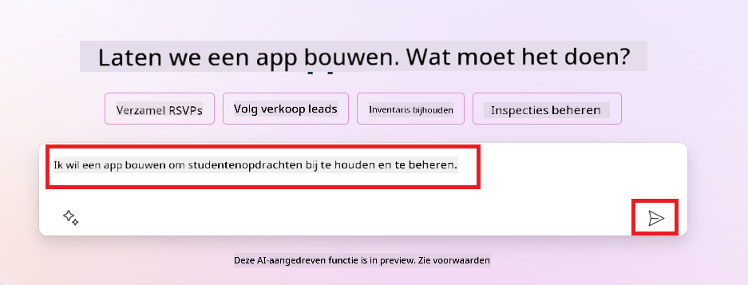

1. De AI Copilot zal een Dataverse-tabel voorstellen met de velden die je nodig hebt om de gegevens die je wilt bijhouden op te slaan en wat voorbeeldgegevens. Je kunt de tabel vervolgens aanpassen aan je behoeften met behulp van de AI Copilot-assistentfunctie via gesprekstappen.

   > **Belangrijk**: Dataverse is het onderliggende dataplatform voor Power Platform. Het is een low-code dataplatform voor het opslaan van de gegevens van de app. Het is een volledig beheerde dienst die gegevens veilig opslaat in de Microsoft Cloud en wordt voorzien binnen je Power Platform-omgeving. Het biedt ingebouwde gegevensbeheerfuncties, zoals gegevensclassificatie, gegevenslijnage, fijnmazige toegangscontrole en meer. Je kunt meer leren over Dataverse [hier](https://docs.microsoft.com/powerapps/maker/data-platform/data-platform-intro?WT.mc_id=academic-109639-somelezediko).

   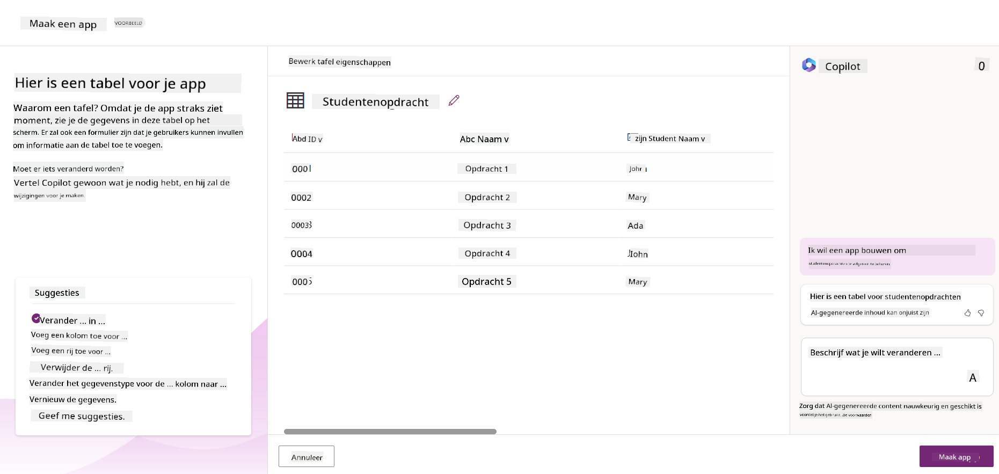

1. Docenten willen e-mails sturen naar de studenten die hun opdrachten hebben ingediend om hen op de hoogte te houden van de voortgang van hun opdrachten. Je kunt Copilot gebruiken om een nieuw veld aan de tabel toe te voegen om de e-mail van de student op te slaan. Je kunt bijvoorbeeld de volgende prompt gebruiken om een nieuw veld aan de tabel toe te voegen: **_Ik wil een kolom toevoegen om de e-mail van de student op te slaan_**. Klik op de **Verzenden**-knop om de prompt naar de AI Copilot te sturen.

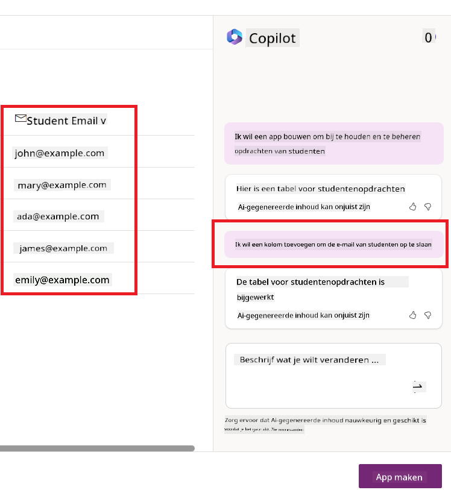

1. De AI Copilot zal een nieuw veld genereren en je kunt het veld vervolgens aanpassen aan je behoeften.

1. Zodra je klaar bent met de tabel, klik je op de **App maken**-knop om de app te maken.

1. De AI Copilot zal een responsieve Canvas-app genereren op basis van je beschrijving. Je kunt de app vervolgens aanpassen aan je behoeften.

1. Om docenten in staat te stellen e-mails naar studenten te sturen, kun je Copilot gebruiken om een nieuw scherm aan de app toe te voegen. Je kunt bijvoorbeeld de volgende prompt gebruiken om een nieuw scherm aan de app toe te voegen: **_Ik wil een scherm toevoegen om e-mails naar studenten te sturen_**. Klik op de **Verzenden**-knop om de prompt naar de AI Copilot te sturen.

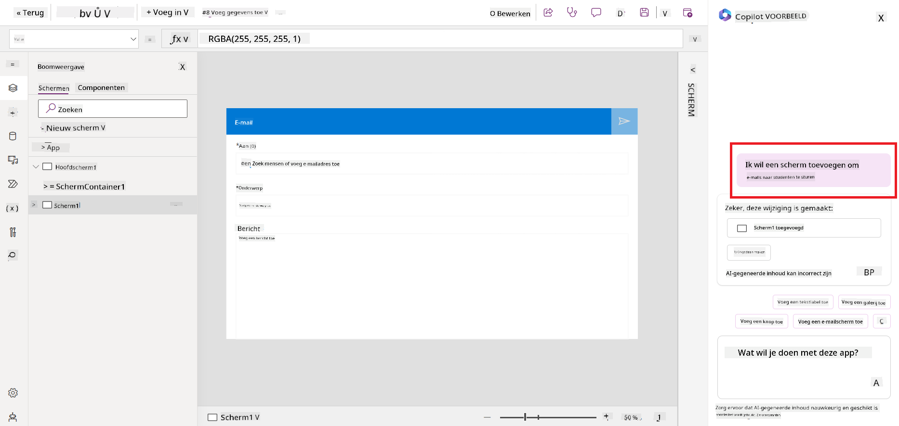

1. De AI Copilot zal een nieuw scherm genereren en je kunt het scherm vervolgens aanpassen aan je behoeften.

1. Zodra je klaar bent met de app, klik je op de **Opslaan**-knop om de app op te slaan.

1. Om de app met de docenten te delen, klik je op de **Delen**-knop en klik je vervolgens nogmaals op de **Delen**-knop. Je kunt de app vervolgens delen met de docenten door hun e-mailadressen in te voeren.

> **Je huiswerk**: De app die je zojuist hebt gebouwd is een goed begin, maar kan worden verbeterd. Met de e-mailfunctie kunnen docenten alleen handmatig e-mails naar studenten sturen door hun e-mails te typen. Kun je Copilot gebruiken om een automatisering te bouwen waarmee docenten automatisch e-mails naar studenten kunnen sturen wanneer ze hun opdrachten indienen? Je hint is dat je met de juiste prompt Copilot in Power Automate kunt gebruiken om dit te bouwen.

### Bouw een Factuurinformatietabel voor Onze Startup

Het financiële team van onze startup heeft moeite om facturen bij te houden. Ze hebben een spreadsheet gebruikt om de facturen bij te houden, maar dit is moeilijk te beheren geworden naarmate het aantal facturen is toegenomen. Ze hebben je gevraagd om een tabel te bouwen die hen helpt de informatie van de ontvangen facturen op te slaan, bij te houden en te beheren. De tabel moet worden gebruikt om een automatisering te bouwen die alle factuurinformatie extraheert en in de tabel opslaat. De tabel moet ook het financiële team in staat stellen de facturen te bekijken die zijn betaald en die niet zijn betaald.

Het Power Platform heeft een onderliggend dataplatform genaamd Dataverse waarmee je de gegevens voor je apps en oplossingen kunt opslaan. Dataverse biedt een low-code dataplatform voor het opslaan van de gegevens van de app. Het is een volledig beheerde dienst die gegevens veilig opslaat in de Microsoft Cloud en wordt voorzien binnen je Power Platform-omgeving. Het biedt ingebouwde gegevensbeheerfuncties, zoals gegevensclassificatie, gegevenslijnage, fijnmazige toegangscontrole en meer. Je kunt meer leren [over Dataverse hier](https://docs.microsoft.com/powerapps/maker/data-platform/data-platform-intro?WT.mc_id=academic-109639-somelezediko).

Waarom zouden we Dataverse voor onze startup gebruiken? De standaard- en aangepaste tabellen binnen Dataverse bieden een veilige en cloudgebaseerde opslagoptie voor je gegevens. Tabellen stellen je in staat verschillende soorten gegevens op te slaan, vergelijkbaar met hoe je meerdere werkbladen in een enkele Excel-werkmap zou gebruiken. Je kunt tabellen gebruiken om gegevens op te slaan die specifiek zijn voor de behoeften van je organisatie of bedrijf. Enkele van de voordelen die onze startup zal halen uit het gebruik van Dataverse zijn onder andere:

- **Eenvoudig te beheren**: Zowel de metadata als de gegevens worden in de cloud opgeslagen, dus je hoeft je geen zorgen te maken over de details van hoe ze worden opgeslagen of beheerd. Je kunt je richten op het bouwen van je apps en oplossingen.

- **Veilig**: Dataverse biedt een veilige en cloudgebaseerde opslagoptie voor je gegevens. Je kunt bepalen wie toegang heeft tot de gegevens in je tabellen en hoe ze deze kunnen benaderen met behulp van op rollen gebaseerde beveiliging.

- **Rijke metadata**: Gegevenstypen en relaties worden direct binnen Power Apps gebruikt.

- **Logica en validatie**: Je kunt bedrijfsregels, berekende velden en validatieregels gebruiken om bedrijfslogica af te dwingen en gegevensnauwkeurigheid te behouden.

Nu je weet wat Dataverse is en waarom je het zou moeten gebruiken, laten we eens kijken hoe je Copilot kunt gebruiken om een tabel in Dataverse te maken die voldoet aan de eisen van ons financiële team.

> **Opmerking**: Je zult deze tabel in de volgende sectie gebruiken om een automatisering te bouwen die alle factuurinformatie extraheert en in de tabel opslaat. Om een tabel in Dataverse te maken met Copilot, volg je de onderstaande stappen: 1. Navigeer naar het [Power Apps](https://make.powerapps.com?WT.mc_id=academic-105485-koreyst) startscherm. 2. Selecteer in de linkernavigatiebalk op **Tabellen** en klik vervolgens op **Beschrijf de nieuwe tabel**. 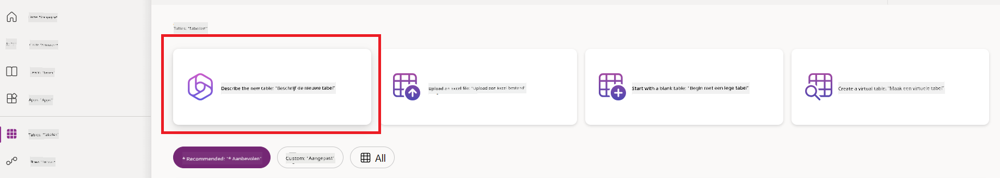 1. Op het scherm **Beschrijf de nieuwe tabel**, gebruik je het tekstvak om de tabel te beschrijven die je wilt maken. Bijvoorbeeld, **_Ik wil een tabel maken om factuurinformatie op te slaan_**. Klik op de **Verzenden**-knop om de prompt naar de AI Copilot te sturen. 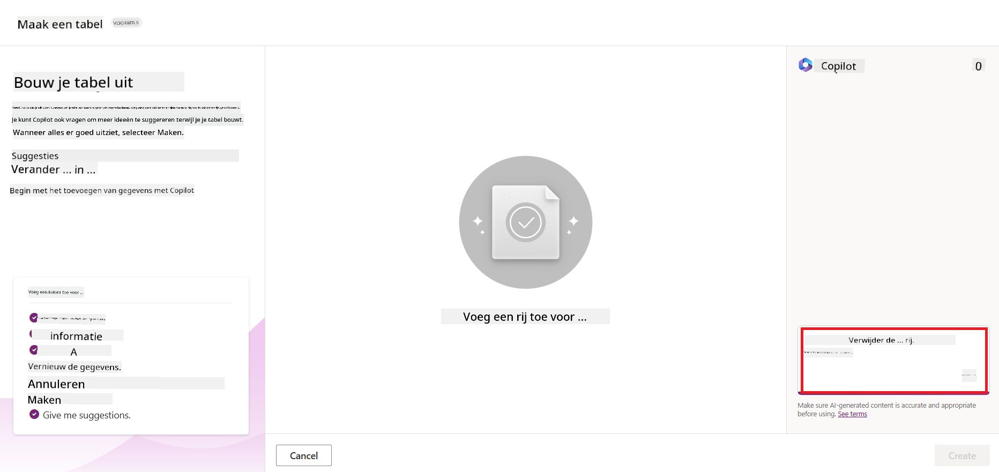 1. De AI Copilot zal een Dataverse-tabel voorstellen met de velden die je nodig hebt om de gegevens die je wilt bijhouden op te slaan en wat voorbeeldgegevens. Je kunt de tabel vervolgens aanpassen aan je behoeften met behulp van de AI Copilot-assistentfunctie via gesprekstappen. 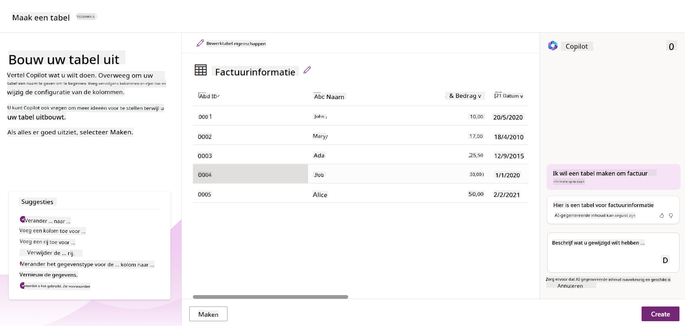 1. Het financiële team wil een e-mail sturen naar de leverancier om hen op de hoogte te houden van de huidige status van hun factuur. Je kunt Copilot gebruiken om een nieuw veld aan de tabel toe te voegen om de e-mail van de leverancier op te slaan. Je kunt bijvoorbeeld de volgende prompt gebruiken om een nieuw veld aan de tabel toe te voegen: **_Ik wil een kolom toevoegen om de e-mail van de leverancier op te slaan_**. Klik op de **Verzenden**-knop om de prompt naar de AI Copilot te sturen. 1. De AI Copilot zal een nieuw veld genereren en je kunt het veld vervolgens aanpassen aan je behoeften. 1. Zodra je klaar bent met de tabel, klik je op de **Maken**-knop om de tabel te maken. ## AI-modellen in Power Platform met AI Builder AI Builder is een low-code AI-capaciteit die beschikbaar is in Power Platform waarmee je AI-modellen kunt gebruiken om processen te automatiseren en uitkomsten te voorspellen. Met AI Builder kun je AI naar je apps en flows brengen die verbinding maken met je gegevens
een tekst. - **Sentimentanalyse**: Dit model detecteert positieve, negatieve, neutrale of gemengde gevoelens in tekst. - **Visitekaartjeslezer**: Dit model haalt informatie uit visitekaartjes. - **Tekstherkenning**: Dit model haalt tekst uit afbeeldingen. - **Objectdetectie**: Dit model detecteert en haalt objecten uit afbeeldingen. - **Documentverwerking**: Dit model haalt informatie uit formulieren. - **Factuurverwerking**: Dit model haalt informatie uit facturen. Met Aangepaste AI-modellen kun je je eigen model in AI Builder brengen, zodat het kan functioneren als elk ander AI Builder-aangepast model, waardoor je het model kunt trainen met je eigen gegevens. Je kunt deze modellen gebruiken om processen te automatiseren en resultaten te voorspellen in zowel Power Apps als Power Automate. Bij het gebruik van je eigen model zijn er beperkingen van toepassing. Lees meer over deze [beperkingen](https://learn.microsoft.com/ai-builder/byo-model#limitations?WT.mc_id=academic-105485-koreyst). 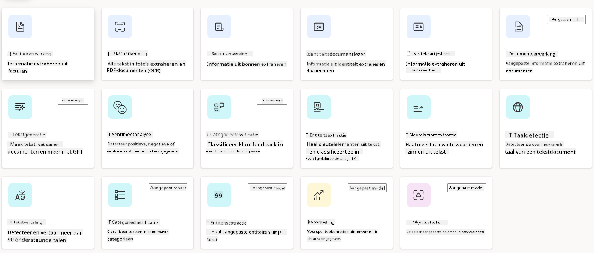 ## Opdracht #2 - Bouw een Factuurverwerkingsflow voor Onze Startup Het financiële team heeft moeite met het verwerken van facturen. Ze gebruiken een spreadsheet om de facturen bij te houden, maar dit is moeilijk te beheren geworden naarmate het aantal facturen is toegenomen. Ze hebben je gevraagd om een workflow te bouwen die hen helpt facturen te verwerken met behulp van AI. De workflow moet hen in staat stellen om informatie uit facturen te halen en deze informatie op te slaan in een Dataverse-tabel. De workflow moet hen ook in staat stellen om een e-mail te sturen naar het financiële team met de uitgetrokken informatie. Nu je weet wat AI Builder is en waarom je het zou moeten gebruiken, laten we eens kijken hoe je het Factuurverwerkings AI-model in AI Builder kunt gebruiken, dat we eerder hebben behandeld, om een workflow te bouwen die het financiële team helpt facturen te verwerken. Om een workflow te bouwen die het financiële team helpt facturen te verwerken met behulp van het Factuurverwerkings AI-model in AI Builder, volg je de onderstaande stappen: 1. Navigeer naar het [Power Automate](https://make.powerautomate.com?WT.mc_id=academic-105485-koreyst) startscherm. 2. Gebruik het tekstvak op het startscherm om de workflow te beschrijven die je wilt bouwen. Bijvoorbeeld, **_Verwerk een factuur wanneer deze in mijn mailbox arriveert_**. Klik op de **Verzenden** knop om de prompt naar de AI Copilot te sturen. 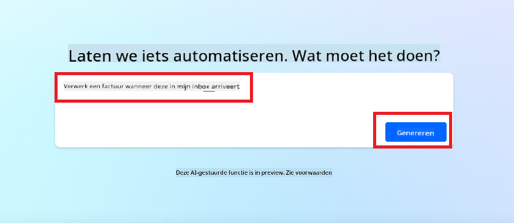 3. De AI Copilot zal de acties voorstellen die je moet uitvoeren om de taak die je wilt automatiseren uit te voeren. Je kunt op de **Volgende** knop klikken om door te gaan naar de volgende stappen. 4. In de volgende stap zal Power Automate je vragen om de benodigde verbindingen voor de flow in te stellen. Zodra je klaar bent, klik je op de **Flow maken** knop om de flow te maken. 5. De AI Copilot zal een flow genereren en je kunt de flow vervolgens aanpassen aan je behoeften. 6. Werk de trigger van de flow bij en stel de **Map** in op de map waar de facturen worden opgeslagen. Bijvoorbeeld, je kunt de map instellen op **Inbox**. Klik op **Geavanceerde opties weergeven** en stel **Alleen met Bijlagen** in op **Ja**. Dit zorgt ervoor dat de flow alleen wordt uitgevoerd wanneer een e-mail met een bijlage in de map wordt ontvangen. 7. Verwijder de volgende acties uit de flow: **HTML naar tekst**, **Samenstellen**, **Samenstellen 2**, **Samenstellen 3** en **Samenstellen 4** omdat je deze niet zult gebruiken. 8. Verwijder de **Voorwaarde** actie uit de flow omdat je deze niet zult gebruiken. Het zou er als volgt uit moeten zien: 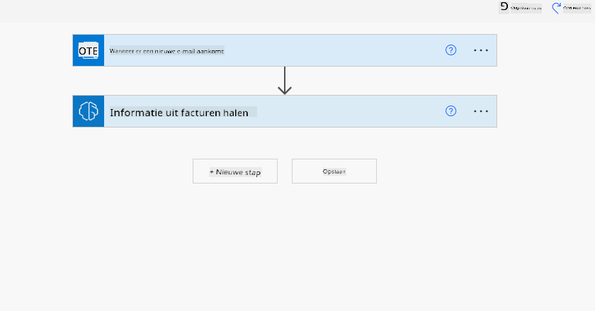 9. Klik op de **Actie toevoegen** knop en zoek naar **Dataverse**. Selecteer de **Nieuwe rij toevoegen** actie. 10. Bij de **Informatie uit facturen halen** actie, werk je het **Factuurbestand** bij om te verwijzen naar de **Bijlage-inhoud** uit de e-mail. Dit zorgt ervoor dat de flow informatie uit de factuurbijlage haalt. 11. Selecteer de **Tabel** die je eerder hebt gemaakt. Bijvoorbeeld, je kunt de **Factuurinformatie** tabel selecteren. Kies de dynamische inhoud van de vorige actie om de volgende velden in te vullen: - ID - Bedrag - Datum - Naam - Status - Stel de **Status** in op **In behandeling**. - Leverancier E-mail - Gebruik de **Van** dynamische inhoud van de **Wanneer een nieuwe e-mail arriveert** trigger. 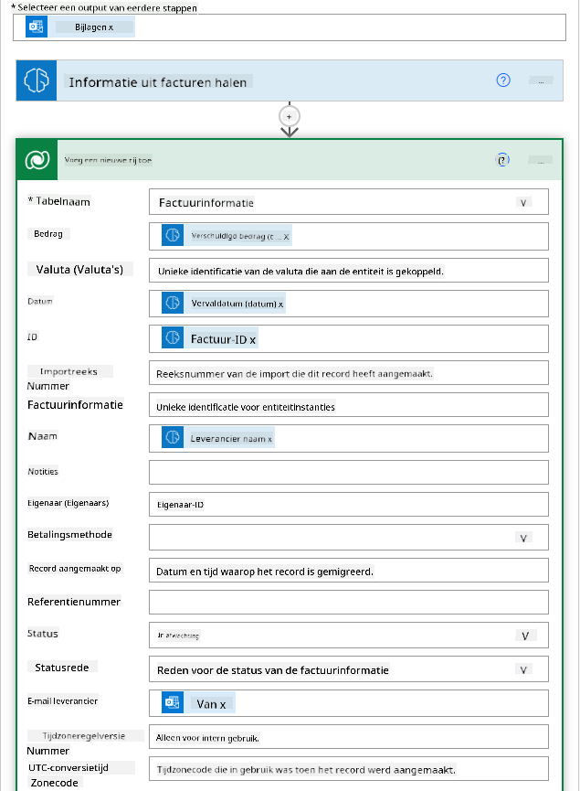 12. Zodra je klaar bent met de flow, klik je op de **Opslaan** knop om de flow op te slaan. Je kunt de flow vervolgens testen door een e-mail met een factuur naar de map te sturen die je in de trigger hebt opgegeven. > **Je huiswerk**: De flow die je zojuist hebt gebouwd is een goed begin, nu moet je nadenken over hoe je een automatisering kunt bouwen die ons financiële team in staat stelt om een e-mail naar de leverancier te sturen om hen op de hoogte te stellen van de huidige status van hun factuur. Je hint: de flow moet worden uitgevoerd wanneer de status van de factuur verandert.

## Gebruik een Tekstgeneratie AI-model in Power Automate

Het Creëer Tekst met GPT AI-model in AI Builder stelt je in staat om tekst te genereren op basis van een prompt en wordt aangedreven door de Microsoft Azure OpenAI Service. Met deze mogelijkheid kun je GPT (Generative Pre-Trained Transformer) technologie in je apps en flows integreren om een verscheidenheid aan geautomatiseerde flows en inzichtelijke toepassingen te bouwen.

GPT-modellen ondergaan uitgebreide training op enorme hoeveelheden data, waardoor ze in staat zijn om tekst te produceren die nauw aansluit bij menselijke taal wanneer ze een prompt krijgen. Wanneer geïntegreerd met workflowautomatisering, kunnen AI-modellen zoals GPT worden benut om een breed scala aan taken te stroomlijnen en te automatiseren.

Bijvoorbeeld, je kunt flows bouwen om automatisch tekst te genereren voor verschillende gebruiksscenario's, zoals: concepten van e-mails, productbeschrijvingen, en meer. Je kunt het model ook gebruiken om tekst te genereren voor verschillende apps, zoals chatbots en klantenservice-apps die klantenservicemedewerkers in staat stellen om effectief en efficiënt te reageren op klantvragen.

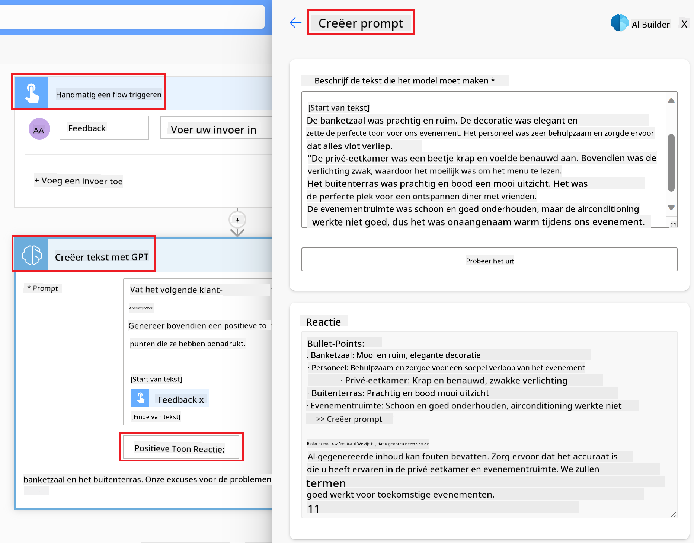

Om te leren hoe je dit AI-model in Power Automate kunt gebruiken, doorloop de [Intelligentie toevoegen met AI Builder en GPT](https://learn.microsoft.com/training/modules/ai-builder-text-generation/?WT.mc_id=academic-109639-somelezediko) module.

## Goed Gedaan! Ga Door met Leren

Na het voltooien van deze les, bekijk onze [Generatieve AI Leercollectie](https://aka.ms/genai-collection?WT.mc_id=academic-105485-koreyst) om je kennis van Generatieve AI verder uit te breiden!

Ga naar Les 11 waar we zullen kijken naar hoe we [Generatieve AI met Functie Aanroepen kunnen integreren](../11-integrating-with-function-calling/README.md?WT.mc_id=academic-105485-koreyst)!

**Disclaimer**:  
Dit document is vertaald met behulp van de AI-vertalingsdienst [Co-op Translator](https://github.com/Azure/co-op-translator). Hoewel we ons best doen voor nauwkeurigheid, dient u zich ervan bewust te zijn dat geautomatiseerde vertalingen fouten of onnauwkeurigheden kunnen bevatten. Het oorspronkelijke document in zijn oorspronkelijke taal moet worden beschouwd als de gezaghebbende bron. Voor kritische informatie wordt professionele menselijke vertaling aanbevolen. Wij zijn niet aansprakelijk voor eventuele misverstanden of verkeerde interpretaties die voortvloeien uit het gebruik van deze vertaling.