# Het bouwen van Low Code AI-toepassingen

> _(Klik op de afbeelding hierboven om de video van deze les te bekijken)_

## Introductie

Nu we geleerd hebben hoe je toepassingen voor het genereren van afbeeldingen bouwt, laten we het hebben over low code. Generatieve AI kan worden gebruikt voor verschillende gebieden, waaronder low code, maar wat is low code en hoe kunnen we AI eraan toevoegen?

Het bouwen van apps en oplossingen is gemakkelijker geworden voor traditionele ontwikkelaars en niet-ontwikkelaars door het gebruik van Low Code Development Platforms. Low Code Development Platforms stellen je in staat om apps en oplossingen te bouwen met weinig tot geen code. Dit wordt bereikt door een visuele ontwikkelomgeving te bieden waarmee je componenten kunt slepen en neerzetten om apps en oplossingen te bouwen. Dit stelt je in staat om apps en oplossingen sneller en met minder middelen te bouwen. In deze les duiken we diep in hoe je low code gebruikt en hoe je low code ontwikkeling kunt verbeteren met AI door gebruik te maken van Power Platform.

Het Power Platform biedt organisaties de mogelijkheid om hun teams te versterken zodat ze hun eigen oplossingen kunnen bouwen via een intuïtieve low-code of no-code omgeving. Deze omgeving helpt het proces van het bouwen van oplossingen te vereenvoudigen. Met Power Platform kunnen oplossingen in dagen of weken worden gebouwd in plaats van maanden of jaren. Power Platform bestaat uit vijf belangrijke producten: Power Apps, Power Automate, Power BI, Power Pages en Copilot Studio.

Deze les behandelt:

- Introductie tot Generatieve AI in Power Platform
- Introductie tot Copilot en hoe je het gebruikt
- Het gebruik van Generatieve AI om apps en flows te bouwen in Power Platform
- Begrijpen van de AI-modellen in Power Platform met AI Builder
- Het bouwen van intelligente agenten met Microsoft Copilot Studio

## Leerdoelen

Aan het einde van deze les kun je:

- Begrijpen hoe Copilot werkt in Power Platform.

- Een Student Assignment Tracker App bouwen voor onze educatieve startup.

- Een Factuurverwerkingsflow bouwen die AI gebruikt om informatie uit facturen te halen.

- Best practices toepassen bij het gebruik van het Create Text met GPT AI Model.

- Begrijpen wat Microsoft Copilot Studio is en hoe je intelligente agenten ermee bouwt.

De tools en technologieën die je in deze les zult gebruiken zijn:

- **Power Apps**, voor de Student Assignment Tracker app, die een low-code ontwikkelomgeving biedt voor het bouwen van apps om gegevens te volgen, te beheren en te interactiëren.

- **Dataverse**, voor het opslaan van de gegevens voor de Student Assignment Tracker app waar Dataverse een low-code dataplaform biedt voor het opslaan van de gegevens van de app.

- **Power Automate**, voor de Factuurverwerkingsflow waar je een low-code ontwikkelomgeving hebt voor het bouwen van workflows om het factuurverwerkingsproces te automatiseren.

- **AI Builder**, voor het Factuurverwerkings AI Model waar je gebruik maakt van vooraf gebouwde AI-modellen om de facturen voor onze startup te verwerken.

## Generatieve AI in Power Platform

Het verbeteren van low-code ontwikkeling en toepassingen met generatieve AI is een belangrijk aandachtsgebied voor Power Platform. Het doel is om iedereen in staat te stellen AI-gestuurde apps, sites, dashboards te bouwen en processen met AI te automatiseren, _zonder dat er data science expertise vereist is_. Dit doel wordt bereikt door generatieve AI te integreren in de low-code ontwikkelervaring in Power Platform in de vorm van Copilot en AI Builder.

### Hoe werkt dit?

Copilot is een AI-assistent die je in staat stelt om Power Platform oplossingen te bouwen door je vereisten te beschrijven in een reeks van conversatiestappen met natuurlijke taal. Je kunt bijvoorbeeld je AI-assistent instrueren om aan te geven welke velden je app gaat gebruiken en het zal zowel de app als het onderliggende datamodel creëren, of je zou kunnen specificeren hoe je een flow instelt in Power Automate.

Je kunt door Copilot aangedreven functionaliteiten gebruiken als een feature in je app-schermen om gebruikers in staat te stellen inzichten te ontdekken via conversatie-interacties.

AI Builder is een low-code AI-mogelijkheid beschikbaar in Power Platform waarmee je AI-modellen kunt gebruiken om je te helpen processen te automatiseren en uitkomsten te voorspellen. Met AI Builder kun je AI naar je apps en flows brengen die verbonden zijn met je data in Dataverse of in verschillende cloud-databronnen, zoals SharePoint, OneDrive of Azure.

Copilot is beschikbaar in alle Power Platform producten: Power Apps, Power Automate, Power BI, Power Pages en Copilot Studio (voorheen Power Virtual Agents). AI Builder is beschikbaar in Power Apps en Power Automate. In deze les richten we ons op hoe je Copilot en AI Builder in Power Apps en Power Automate gebruikt om een oplossing te bouwen voor onze educatieve startup.

### Copilot in Power Apps

Als onderdeel van Power Platform biedt Power Apps een low-code ontwikkelomgeving voor het bouwen van apps om gegevens te volgen, beheren en ermee te interacteren. Het is een suite van app-ontwikkelingsdiensten met een schaalbaar dataplaform en de mogelijkheid om verbinding te maken met cloudservices en on-premise data. Power Apps laat je apps bouwen die draaien op browsers, tablets en telefoons, en die gedeeld kunnen worden met collega's. Power Apps maakt app-ontwikkeling toegankelijk met een eenvoudige interface, zodat elke zakelijke gebruiker of professionele ontwikkelaar aangepaste apps kan bouwen. De app-ontwikkelervaring wordt ook verbeterd met Generative AI via Copilot.

De copilot AI-assistent functie in Power Apps stelt je in staat te beschrijven wat voor soort app je nodig hebt en welke informatie je wilt dat je app volgt, verzamelt of toont. Copilot genereert vervolgens een responsive Canvas app op basis van jouw beschrijving. Je kunt de app daarna aanpassen aan je wensen. De AI Copilot genereert ook en suggereert een Dataverse-tabel met de velden die je nodig hebt om de gegevens die je wilt volgen op te slaan, inclusief enkele voorbeeldgegevens. We zullen later in deze les kijken wat Dataverse is en hoe je het in Power Apps kunt gebruiken. Je kunt de tabel vervolgens aanpassen aan je wensen met de AI Copilot assistent functie door middel van conversatiestappen. Deze functie is direct beschikbaar vanaf het Power Apps startscherm.

### Copilot in Power Automate

Als onderdeel van Power Platform stelt Power Automate gebruikers in staat geautomatiseerde workflows te maken tussen applicaties en services. Het helpt bij het automatiseren van repetitieve bedrijfsprocessen zoals communicatie, gegevensverzameling en goedkeuringen van beslissingen. De eenvoudige interface maakt het mogelijk dat gebruikers van elk technisch niveau (van beginners tot ervaren ontwikkelaars) taken kunnen automatiseren. De workflow-ontwikkelervaring wordt ook verrijkt met Generatieve AI via Copilot.

De copilot AI-assistent functie in Power Automate laat je beschrijven wat voor soort flow je nodig hebt en welke acties je flow moet uitvoeren. Copilot genereert dan een flow op basis van jouw beschrijving. Je kunt de flow daarna aanpassen aan je wensen. De AI Copilot genereert ook en suggereert de acties die je nodig hebt om de taak die je wilt automatiseren uit te voeren. We zullen later in deze les bekijken wat flows zijn en hoe je ze kunt gebruiken in Power Automate. Je kunt de acties vervolgens aanpassen aan je wensen met de AI Copilot assistent functie door middel van conversatiestappen. Deze functie is direct beschikbaar vanaf het Power Automate startscherm.

## Intelligente agenten bouwen met Microsoft Copilot Studio

[Microsoft Copilot Studio](https://learn.microsoft.com/microsoft-copilot-studio/fundamentals-what-is-copilot-studio?WT.mc_id=academic-105485-koreyst) (voorheen Power Virtual Agents) is het low-code lid van Power Platform voor het bouwen van **AI-agenten** — converserende copiloten die vragen kunnen beantwoorden, acties uitvoeren en taken automatiseren namens je gebruikers. Net als de rest van Power Platform bouw je deze agenten in een visuele ervaring die natuurlijk taalgebruik voorop stelt: je beschrijft wat je wilt dat de agent doet, en Copilot Studio helpt bij het structureren van de instructies, kennis en acties.

Voor onze educatieve startup zou je een agent kunnen bouwen die vragen van studenten over cursussen beantwoordt, deadlines voor opdrachten controleert en zelfs een docent e-mailt — allemaal zonder code te schrijven.

Hier zijn enkele van de nieuwste mogelijkheden die Copilot Studio krachtig maken:

- **Generatieve antwoorden uit je kennis**. In plaats van elke conversatie handmatig te schrijven, kun je **kennisbronnen** koppelen — openbare websites, SharePoint, OneDrive, Dataverse, geüploade bestanden of bedrijfsdata via connectors — en genereert de agent hieruit gegrondvestte antwoorden.

- **Generatieve orkestratie**. In plaats van starre trigger-woorden gebruikt de agent AI om een verzoek te begrijpen en dynamisch te besluiten welke kennis, onderwerpen en acties gecombineerd dienen te worden, inclusief het koppelen van meerdere stappen.

- **Acties en connectors**. Agenten kunnen dingen *doen*, niet alleen chatten. Je kunt een agent acties geven ondersteund door de 1.500+ vooraf gebouwde Power Platform connectors, Power Automate flows, custom REST API's, prompts, of **Model Context Protocol (MCP)** servers.

- **Autonome agenten**. Agenten zijn niet beperkt tot antwoorden in een chatvenster. Je kunt **autonome agenten** bouwen die worden geactiveerd door gebeurtenissen — zoals een nieuwe e-mail, een nieuw record in Dataverse of een bestand dat wordt geüpload — en dan op de achtergrond handelen om een taak te voltooien.

- **Multi-agent orkestratie**. Agenten kunnen andere agenten aanroepen. Een Copilot Studio agent kan het stokje overdragen aan, of worden uitgebreid met, andere agenten, inclusief agenten gepubliceerd naar Microsoft 365 Copilot en agenten gebouwd in Microsoft Foundry.

- **Modelkeuze**. Naast de ingebouwde modellen kun je modellen uit de Microsoft Foundry modelcatalogus gebruiken om te bepalen hoe je agent redeneert en reageert.

- **Publiceren overal**. Eenmaal gebouwd kan een agent worden gepubliceerd naar meerdere kanalen — Microsoft Teams, Microsoft 365 Copilot, een website of custom app, en meer — met beveiliging, authenticatie en analytics beheerd via de Power Platform admin ervaring.

Je kunt je eerste agent bouwen op [copilotstudio.microsoft.com](https://copilotstudio.microsoft.com?WT.mc_id=academic-105485-koreyst) en meer leren in de [Microsoft Copilot Studio documentatie](https://learn.microsoft.com/microsoft-copilot-studio/?WT.mc_id=academic-105485-koreyst).

## Opdracht: Beheer studentopdrachten en facturen voor onze startup met Copilot

Onze startup biedt online cursussen aan studenten. De startup is snel gegroeid en heeft nu moeite om aan de vraag naar haar cursussen te voldoen. De startup heeft jou ingehuurd als Power Platform ontwikkelaar om hen te helpen een low code oplossing te bouwen voor het beheren van studentopdrachten en facturen. Hun oplossing moet hen kunnen helpen bij het volgen en beheren van studentopdrachten via een app en het automatiseren van het factuurverwerkingsproces via een workflow. Je bent gevraagd om Generatieve AI te gebruiken bij het ontwikkelen van de oplossing.

Wanneer je begint met het gebruik van Copilot, kun je de [Power Platform Copilot Prompt Library](https://github.com/pnp/powerplatform-prompts?WT.mc_id=academic-109639-somelezediko) gebruiken om te starten met prompts. Deze bibliotheek bevat een lijst met prompts die je kunt gebruiken om apps en flows te bouwen met Copilot. Je kunt ook de prompts in de bibliotheek gebruiken om een idee te krijgen van hoe je je vereisten aan Copilot kunt beschrijven.

### Bouw een Student Assignment Tracker App voor onze Startup

De docenten bij onze startup hebben moeite om studentopdrachten bij te houden. Ze gebruikten een spreadsheet om de opdrachten te volgen, maar dit is moeilijk te beheren geworden naarmate het aantal studenten toenam. Ze hebben je gevraagd een app te bouwen die hen helpt studentopdrachten te volgen en te beheren. De app moet hen toestaan nieuwe opdrachten toe te voegen, opdrachten te bekijken, opdrachten bij te werken en opdrachten te verwijderen. De app moet ook docenten en studenten in staat stellen om de opdrachten die beoordeeld zijn en die nog niet beoordeeld zijn te bekijken.

Je bouwt de app met Copilot in Power Apps volgens onderstaande stappen:

1. Ga naar het [Power Apps](https://make.powerapps.com?WT.mc_id=academic-105485-koreyst) startscherm.

1. Gebruik het tekstvak op het startscherm om de app te beschrijven die je wilt bouwen. Bijvoorbeeld, **_Ik wil een app bouwen om studentopdrachten te volgen en beheren_**. Klik op de **Verzenden** knop om de prompt naar de AI Copilot te sturen.

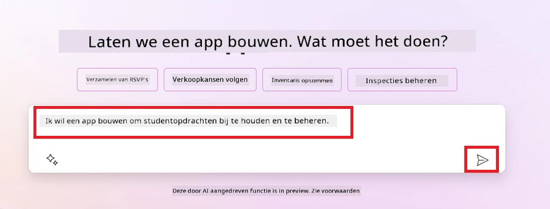

1. De AI Copilot zal een Dataverse-tabel voorstellen met de velden die je nodig hebt om de gegevens die je wilt volgen op te slaan en wat voorbeeldgegevens. Je kunt de tabel vervolgens aanpassen aan je wensen met de AI Copilot assistent functie via conversatiestappen.

   > **Belangrijk**: Dataverse is het onderliggende dataplaform voor Power Platform. Het is een low-code dataplaform voor het opslaan van de gegevens van de app. Het is een volledig beheerde service die veilig data opslaat in de Microsoft Cloud en is voorzien binnen jouw Power Platform-omgeving. Het beschikt over ingebouwde data governance mogelijkheden, zoals dataclassificatie, data lineage, fijnmazige toegangscontrole, en meer. Je kunt hier meer leren over Dataverse [hier](https://docs.microsoft.com/powerapps/maker/data-platform/data-platform-intro?WT.mc_id=academic-109639-somelezediko).

   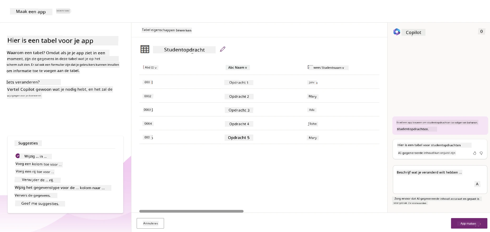

1. Docenten willen e-mails sturen naar studenten die hun opdrachten hebben ingeleverd om hen op de hoogte te houden van de voortgang van hun opdrachten. Je kunt Copilot gebruiken om een nieuw veld toe te voegen aan de tabel om de student e-mail op te slaan. Bijvoorbeeld, je kunt de volgende prompt gebruiken om een nieuw veld aan de tabel toe te voegen: **_Ik wil een kolom toevoegen om student e-mail op te slaan_**. Klik op de **Verzenden** knop om de prompt naar de AI Copilot te sturen.

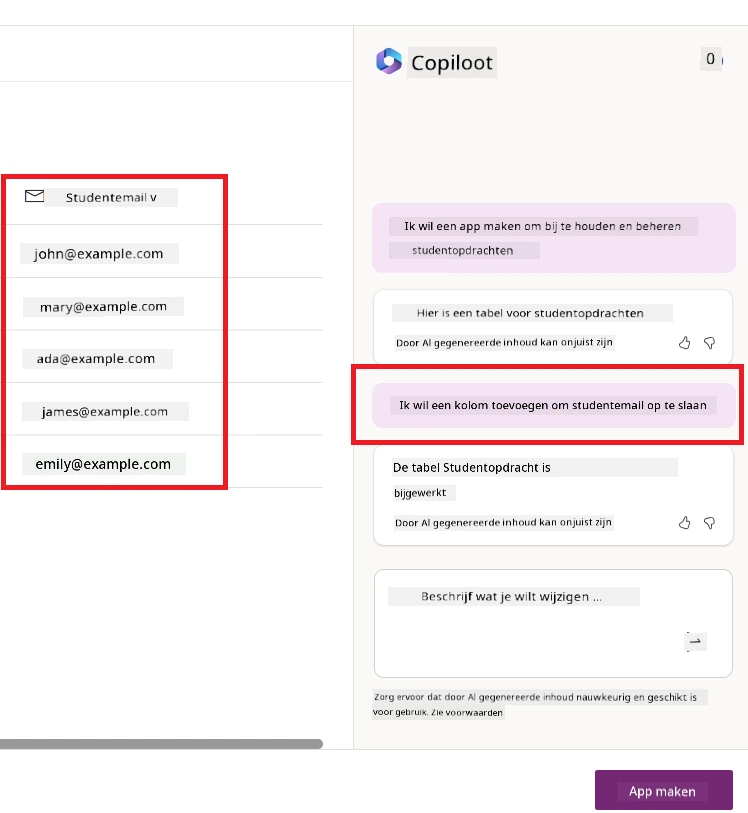

1. De AI Copilot zal een nieuw veld genereren en je kunt het veld vervolgens aanpassen aan je wensen.

1. Zodra je klaar bent met de tabel, klik je op de knop **App maken** om de app te creëren.

1. De AI Copilot zal een responsieve Canvas-app genereren op basis van je beschrijving. Je kunt de app vervolgens aanpassen aan jouw behoeften.

1. Voor docenten die e-mails naar studenten willen sturen, kun je Copilot gebruiken om een nieuw scherm aan de app toe te voegen. Bijvoorbeeld, je kunt de volgende prompt gebruiken om een nieuw scherm toe te voegen: **_Ik wil een scherm toevoegen om e-mails naar studenten te sturen_**. Klik op de knop **Verzenden** om de prompt naar de AI Copilot te sturen.

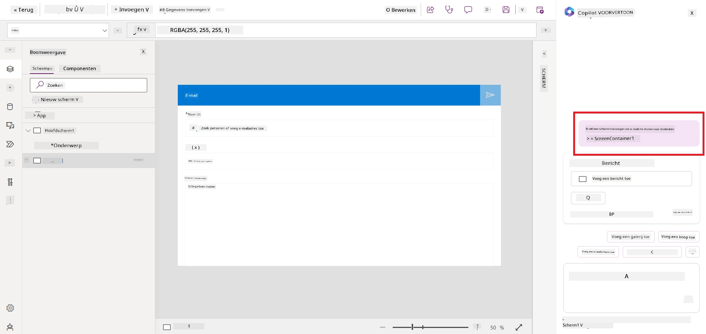

1. De AI Copilot genereert een nieuw scherm en je kunt het scherm vervolgens aanpassen aan jouw behoeften.

1. Zodra je klaar bent met de app, klik je op de knop **Opslaan** om de app op te slaan.

1. Om de app te delen met de docenten, klik je op de knop **Delen** en klik je vervolgens nogmaals op de knop **Delen**. Je kunt de app dan delen met de docenten door hun e-mailadressen in te voeren.

> **Je huiswerk**: De app die je zojuist hebt gebouwd is een goed begin, maar kan worden verbeterd. Met de e-mailfunctie kunnen docenten alleen handmatig e-mails naar studenten sturen door hun e-mailadressen te typen. Kun je Copilot gebruiken om een automatisering te bouwen waarmee docenten automatisch e-mails kunnen sturen naar studenten wanneer ze hun opdrachten indienen? Je hint is dat je met de juiste prompt Copilot in Power Automate kunt gebruiken om dit te bouwen.

### Bouw een facturen-informatietabel voor onze startup

Het financiën-team van onze startup heeft moeite om facturen bij te houden. Ze gebruiken een spreadsheet om de facturen te volgen, maar dit is moeilijk te beheren geworden naarmate het aantal facturen is toegenomen. Ze hebben je gevraagd een tabel te maken die hen helpt om de informatie van ontvangen facturen op te slaan, te volgen en te beheren. De tabel moet worden gebruikt om een automatisering te bouwen die alle factuurinformatie extraheert en opslaat in de tabel. De tabel moet het ook mogelijk maken voor het financiën-team om de facturen te zien die betaald zijn en die nog niet betaald zijn.

Het Power Platform heeft een onderliggende gegevensplatform genaamd Dataverse waarmee je de gegevens voor je apps en oplossingen kunt opslaan. Dataverse levert een low-code gegevensplatform voor het opslaan van de gegevens van de app. Het is een volledig beheerde service die gegevens veilig opslaat in de Microsoft Cloud en wordt geprovisioneerd binnen je Power Platform-omgeving. Het heeft ingebouwde capaciteiten voor gegevensbeheer, zoals gegevensclassificatie, gegevensafkomst, fijnmazige toegangscontrole, en meer. Je kunt meer leren [over Dataverse hier](https://docs.microsoft.com/powerapps/maker/data-platform/data-platform-intro?WT.mc_id=academic-109639-somelezediko).

Waarom zouden we Dataverse gebruiken voor onze startup? De standaard- en aangepaste tabellen binnen Dataverse bieden een veilige en cloud-gebaseerde opslagoptie voor je gegevens. Tabellen laten je verschillende soorten gegevens opslaan, vergelijkbaar met hoe je meerdere werkbladen in een enkele Excel-werkmap zou gebruiken. Je kunt tabellen gebruiken om gegevens op te slaan die specifiek zijn voor je organisatie of zakelijke behoeften. Enkele voordelen die onze startup zal krijgen door Dataverse te gebruiken zijn onder andere:

- **Makkelijk te beheren**: Zowel de metadata als de gegevens worden in de cloud opgeslagen, dus je hoeft je geen zorgen te maken over de details van hoe ze worden opgeslagen of beheerd. Je kunt je concentreren op het bouwen van je apps en oplossingen.

- **Veilig**: Dataverse biedt een veilige en cloud-gebaseerde opslagoptie voor je gegevens. Je kunt bepalen wie toegang heeft tot de gegevens in je tabellen en hoe ze toegang hebben met behulp van op rollen gebaseerde beveiliging.

- **Rijke metadata**: Gegevenstypen en relaties worden direct gebruikt binnen Power Apps.

- **Logica en validatie**: Je kunt bedrijfsregels, berekende velden en validatieregels gebruiken om bedrijfslogica af te dwingen en gegevensnauwkeurigheid te behouden.

Nu je weet wat Dataverse is en waarom je het zou moeten gebruiken, laten we kijken hoe je Copilot kunt gebruiken om een tabel in Dataverse te maken die voldoet aan de eisen van ons financiën-team.

> **Opmerking** : Je zult deze tabel in de volgende sectie gebruiken om een automatisering te bouwen die alle factuurinformatie extraheert en opslaat in de tabel.

Om een tabel in Dataverse te maken met Copilot, volg je de onderstaande stappen:

1. Ga naar het [Power Apps](https://make.powerapps.com?WT.mc_id=academic-105485-koreyst) startscherm.

2. Selecteer in de linker navigatiebalk **Tabellen** en klik vervolgens op **Beschrijf de nieuwe tabel**.

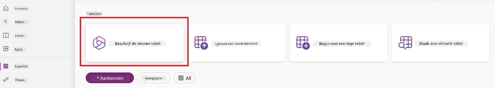

1. Gebruik op het scherm **Beschrijf de nieuwe tabel** het tekstvak om de tabel te beschrijven die je wilt maken. Bijvoorbeeld, **_Ik wil een tabel maken om factuurinformatie op te slaan_**. Klik op de knop **Verzenden** om de prompt naar de AI Copilot te sturen.

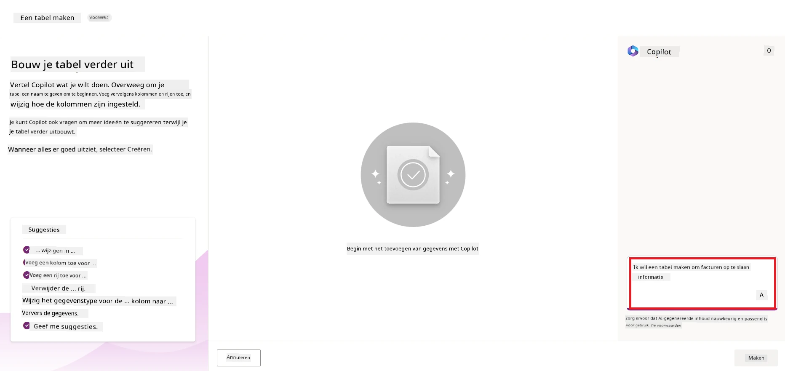

1. De AI Copilot zal een Dataverse-tabel voorstellen met de velden die je nodig hebt om de informatie die je wilt volgen op te slaan, inclusief voorbeeldgegevens. Je kunt de tabel vervolgens aanpassen aan jouw wensen met behulp van de AI Copilot-assistent via interactieve stappen.

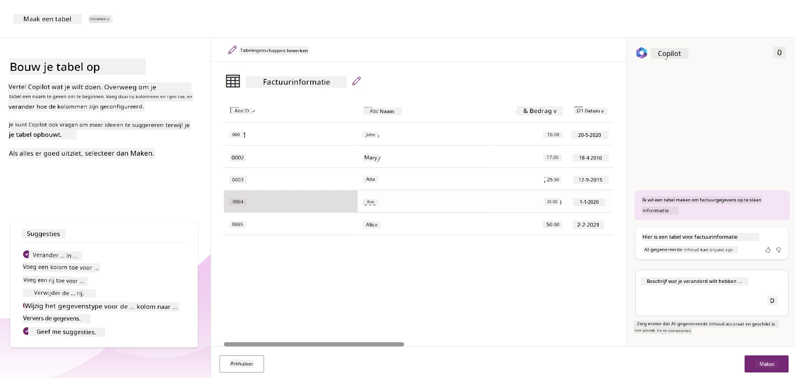

1. Het financiën-team wil een e-mail sturen naar de leverancier om hen te informeren over de huidige status van hun factuur. Je kunt Copilot gebruiken om een nieuw veld aan de tabel toe te voegen om het e-mailadres van de leverancier op te slaan. Bijvoorbeeld, je kunt de volgende prompt gebruiken om een nieuw veld toe te voegen: **_Ik wil een kolom toevoegen om het e-mailadres van de leverancier op te slaan_**. Klik op de knop **Verzenden** om de prompt naar AI Copilot te sturen.

1. De AI Copilot zal een nieuw veld genereren en je kunt het veld vervolgens aanpassen aan jouw behoeften.

1. Zodra je klaar bent met de tabel, klik je op de knop **Maken** om de tabel aan te maken.

## AI-modellen in Power Platform met AI Builder

AI Builder is een low-code AI-functionaliteit beschikbaar in Power Platform die je in staat stelt AI-modellen te gebruiken om processen te automatiseren en uitkomsten te voorspellen. Met AI Builder kun je AI integreren in je apps en flows die verbonden zijn met je gegevens in Dataverse of via verschillende cloudgegevensbronnen, zoals SharePoint, OneDrive of Azure.

## Voorgebouwde AI-modellen versus aangepaste AI-modellen

AI Builder biedt twee soorten AI-modellen: Voorgebouwde AI-modellen en Aangepaste AI-modellen. Voorgebouwde AI-modellen zijn kant-en-klare AI-modellen die door Microsoft zijn getraind en beschikbaar zijn in Power Platform. Deze helpen je om intelligentie toe te voegen aan je apps en flows zonder dat je zelf gegevens hoeft te verzamelen en je eigen modellen te bouwen, trainen en publiceren. Je kunt deze modellen gebruiken om processen te automatiseren en uitkomsten te voorspellen.

Enkele van de voorgebouwde AI-modellen beschikbaar in Power Platform zijn onder andere:

- **Extractie van sleutelzinnen**: Dit model extraheert sleutelzinnen uit tekst.
- **Taalherkenning**: Dit model detecteert de taal van een tekst.
- **Sentimentanalyse**: Dit model bepaalt of de tekst een positieve, negatieve, neutrale of gemengde emotie heeft.
- **Visitekaartjescanner**: Dit model extraheert informatie van visitekaartjes.
- **Tekstherkenning**: Dit model haalt tekst uit afbeeldingen.
- **Objectdetectie**: Dit model detecteert en extraheert objecten uit afbeeldingen.
- **Documentverwerking**: Dit model extraheert informatie uit formulieren.
- **Factuurverwerking**: Dit model extraheert informatie uit facturen.

Met aangepaste AI-modellen kun je je eigen model in AI Builder gebruiken zodat het functioneert als elk ander aangepast AI-model in AI Builder, waardoor je het model kunt trainen met je eigen gegevens. Je kunt deze modellen gebruiken om processen te automatiseren en uitkomsten te voorspellen in zowel Power Apps als Power Automate. Er gelden beperkingen wanneer je je eigen model gebruikt. Lees meer over deze [beperkingen](https://learn.microsoft.com/ai-builder/byo-model#limitations?WT.mc_id=academic-105485-koreyst).

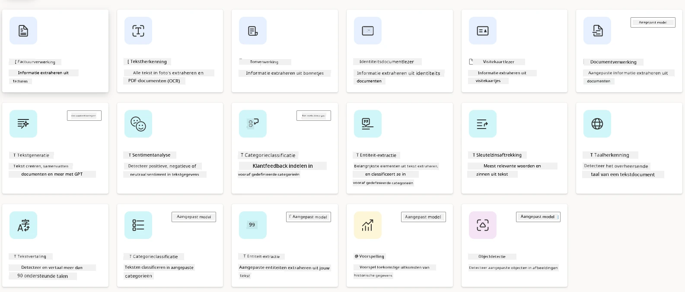

## Opdracht #2 - Bouw een Factuurverwerkingsflow voor onze startup

Het financiën-team heeft moeite met het verwerken van facturen. Ze gebruiken een spreadsheet om de facturen bij te houden, maar dit is moeilijk te beheren geworden naarmate het aantal facturen is toegenomen. Ze hebben je gevraagd een workflow te bouwen die hen helpt facturen te verwerken met behulp van AI. De workflow moet hen in staat stellen informatie van facturen te extraheren en die informatie op te slaan in een Dataverse-tabel. De workflow moet hen ook in staat stellen een e-mail te sturen naar het financiën-team met de geëxtraheerde informatie.

Nu je weet wat AI Builder is en waarom je het zou moeten gebruiken, laten we kijken hoe je het Factuurverwerkings-AI-model in AI Builder, dat eerder werd besproken, kunt gebruiken om een workflow te bouwen die het financiën-team helpt bij het verwerken van facturen.

Om een workflow te bouwen die het financiën-team helpt facturen te verwerken met het Factuurverwerkings-AI-model in AI Builder, volg je de onderstaande stappen:

1. Ga naar het [Power Automate](https://make.powerautomate.com?WT.mc_id=academic-105485-koreyst) startscherm.

2. Gebruik het tekstvak op het startscherm om de workflow te beschrijven die je wilt bouwen. Bijvoorbeeld, **_Verwerk een factuur wanneer deze in mijn mailbox aankomt_**. Klik op de knop **Verzenden** om de prompt naar AI Copilot te sturen.

   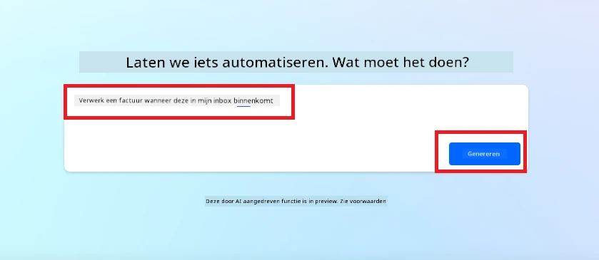

3. AI Copilot zal de acties voorstellen die je nodig hebt om de taak te automatiseren. Je kunt op de knop **Volgende** klikken om door de volgende stappen te gaan.

4. In de volgende stap vraagt Power Automate je de verbindingen in te stellen die nodig zijn voor de flow. Zodra je klaar bent, klik je op de knop **Flow maken** om de flow aan te maken.

5. AI Copilot zal een flow genereren en je kunt de flow vervolgens aanpassen aan jouw wensen.

6. Werk de trigger van de flow bij en stel de **Map** in op de map waar de facturen zullen worden opgeslagen. Bijvoorbeeld, je kunt de map instellen op **Postvak IN**. Klik op **Geavanceerde opties weergeven** en stel **Alleen met bijlagen** in op **Ja**. Dit zorgt ervoor dat de flow alleen wordt uitgevoerd als een e-mail met een bijlage wordt ontvangen in de map.

7. Verwijder de volgende acties uit de flow: **HTML naar tekst**, **Opstellen**, **Opstellen 2**, **Opstellen 3** en **Opstellen 4** omdat je deze niet gaat gebruiken.

8. Verwijder de actie **Voorwaarde** uit de flow omdat je deze niet gaat gebruiken. Het zou er als volgt uit moeten zien:

   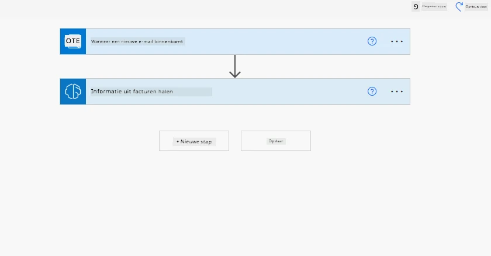

9. Klik op de knop **Een actie toevoegen** en zoek op **Dataverse**. Selecteer de actie **Een nieuwe rij toevoegen**.

10. Bij de actie **Informatie uit facturen extraheren**, werk je het veld **Factuurbestand** bij zodat het wijst naar de **Bijlage-inhoud** van de e-mail. Dit zorgt ervoor dat de flow informatie uit de factuurbijlage extraheert.

11. Selecteer de **Tabel** die je eerder maakte. Bijvoorbeeld, je kunt de tabel **Factuur Informatie** kiezen. Kies de dynamische inhoud uit de vorige actie om de volgende velden te vullen:

    - ID
    - Bedrag
    - Datum
    - Naam
    - Status - Stel de **Status** in op **In behandeling**.
    - Leverancier Email - Gebruik de **Van** dynamische inhoud van de trigger **Wanneer een nieuwe e-mail aankomt**.

    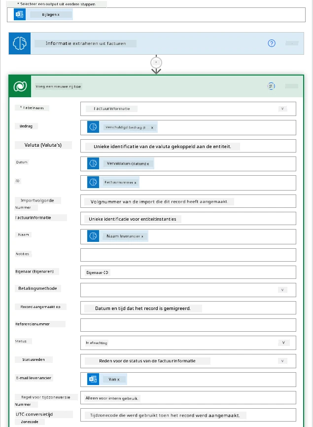

12. Zodra je klaar bent met de flow, klik je op de knop **Opslaan** om de flow op te slaan. Je kunt de flow testen door een e-mail met een factuur te sturen naar de map die je hebt opgegeven in de trigger.

> **Je huiswerk**: De flow die je zojuist hebt gebouwd is een goed begin, nu moet je nadenken over hoe je een automatisering kunt bouwen waarmee ons financiën-team een e-mail kan sturen naar de leverancier om hen te informeren over de huidige status van hun factuur. Je hint: de flow moet worden uitgevoerd wanneer de status van de factuur verandert.

## Gebruik een Tekstgeneratie AI-model in Power Automate

Het AI-model Create Text with GPT in AI Builder stelt je in staat om tekst te genereren op basis van een prompt en wordt aangedreven door de Microsoft Azure OpenAI Service. Met deze functionaliteit kun je GPT (Generative Pre-Trained Transformer) technologie integreren in je apps en flows om allerlei geautomatiseerde flows en waardevolle toepassingen te bouwen.

GPT-modellen ondergaan uitgebreide training op enorme hoeveelheden data, waardoor ze tekst kunnen produceren die sterk lijkt op menselijke taal wanneer ze een prompt krijgen. Gecombineerd met workflowautomatisering kunnen AI-modellen zoals GPT worden gebruikt om een breed scala aan taken te stroomlijnen en te automatiseren.

Bijvoorbeeld, je kunt flows bouwen die automatisch tekst genereren voor diverse toepassingen, zoals: concepten van e-mails, productbeschrijvingen en meer. Je kunt het model ook gebruiken om tekst te genereren voor uiteenlopende apps, zoals chatbots en klantenservice-apps die klantenservicemedewerkers helpen snel en efficiënt te reageren op klantvragen.

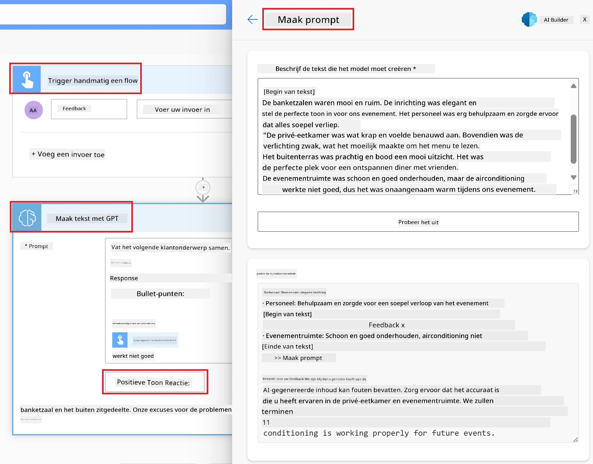

Om te leren hoe u dit AI-model in Power Automate kunt gebruiken, doorloopt u de module [Intelligentie toevoegen met AI Builder en GPT](https://learn.microsoft.com/training/modules/ai-builder-text-generation/?WT.mc_id=academic-109639-somelezediko).

## Geweldig werk! Ga door met leren

Na het voltooien van deze les, bekijk onze [Generatieve AI Leercollectie](https://aka.ms/genai-collection?WT.mc_id=academic-105485-koreyst) om je kennis over Generatieve AI verder te vergroten!

Wil je Copilot aanpassen en er meer uit halen? Verken [Awesome Copilot](https://github.com/github/awesome-copilot?WT.mc_id=academic-105485-koreyst) — een door de community bijgedragen verzameling instructies, agenten, vaardigheden en configuraties om je te helpen het beste uit GitHub Copilot te halen.

Ga naar les 11, waar we zullen bekijken hoe we [Generatieve AI integreren met Function Calling](../11-integrating-with-function-calling/README.md?WT.mc_id=academic-105485-koreyst)!

---

<!-- CO-OP TRANSLATOR DISCLAIMER START -->
**Disclaimer**:
Dit document is vertaald met behulp van de AI vertaaldienst [Co-op Translator](https://github.com/Azure/co-op-translator). Hoewel we streven naar nauwkeurigheid, dient u er rekening mee te houden dat geautomatiseerde vertalingen fouten of onnauwkeurigheden kunnen bevatten. Het originele document in de oorspronkelijke taal moet worden beschouwd als de gezaghebbende bron. Voor kritieke informatie wordt professionele menselijke vertaling aanbevolen. Wij zijn niet aansprakelijk voor eventuele misverstanden of verkeerde interpretaties die voortvloeien uit het gebruik van deze vertaling.
<!-- CO-OP TRANSLATOR DISCLAIMER END -->