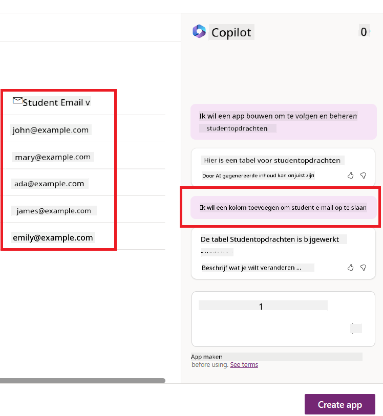
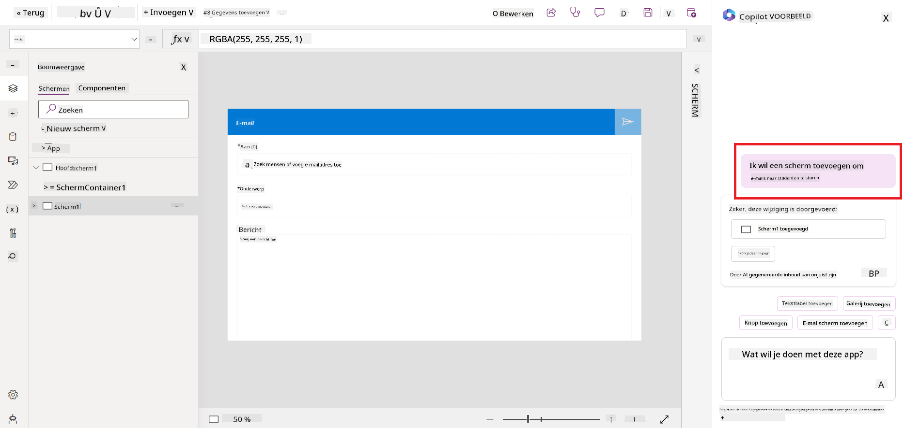
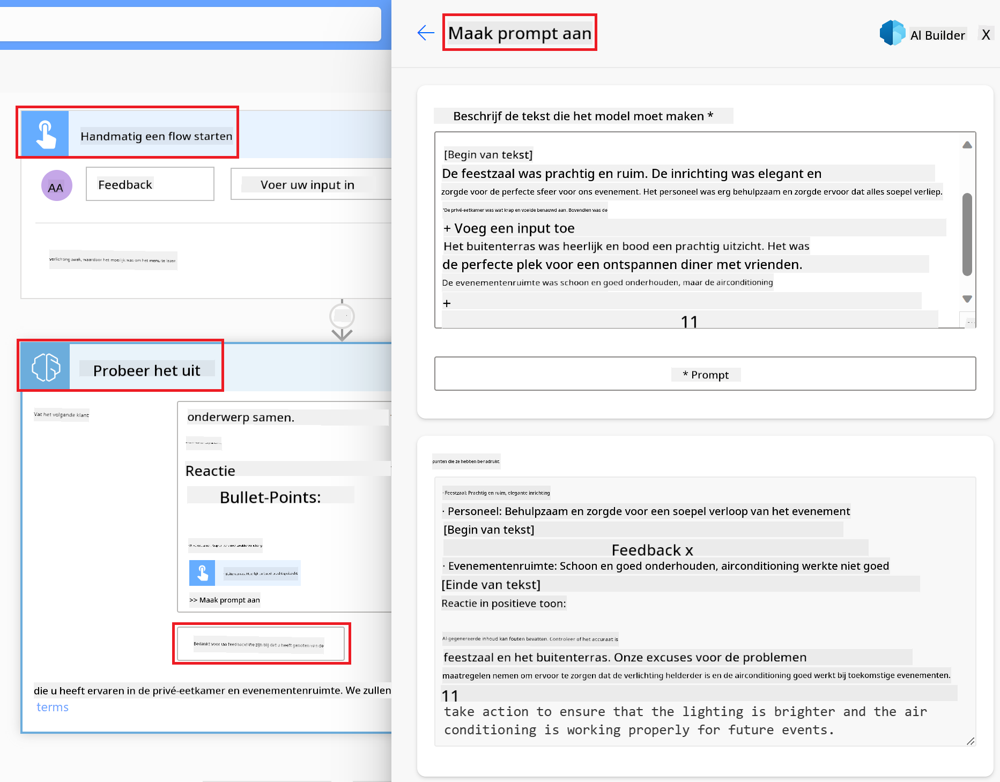

<!--
CO_OP_TRANSLATOR_METADATA:
{
  "original_hash": "f5ff3b6204a695a117d6f452403c95f7",
  "translation_date": "2025-07-09T14:04:51+00:00",
  "source_file": "10-building-low-code-ai-applications/README.md",
  "language_code": "nl"
}
-->
# Low Code AI-toepassingen bouwen

> _(Klik op de afbeelding hierboven om de video van deze les te bekijken)_

## Introductie

Nu we hebben geleerd hoe we applicaties kunnen bouwen die afbeeldingen genereren, gaan we het hebben over low code. Generatieve AI kan voor verschillende gebieden worden ingezet, waaronder low code, maar wat is low code precies en hoe kunnen we AI eraan toevoegen?

Het bouwen van apps en oplossingen is eenvoudiger geworden voor zowel traditionele ontwikkelaars als niet-ontwikkelaars dankzij Low Code Development Platforms. Low Code Development Platforms stellen je in staat om apps en oplossingen te bouwen met weinig tot geen code. Dit wordt mogelijk gemaakt door een visuele ontwikkelomgeving waarin je componenten kunt slepen en neerzetten om apps en oplossingen te maken. Hierdoor kun je sneller en met minder middelen apps en oplossingen bouwen. In deze les duiken we diep in hoe je Low Code kunt gebruiken en hoe je low code ontwikkeling kunt verbeteren met AI via Power Platform.

Het Power Platform biedt organisaties de mogelijkheid om hun teams te versterken zodat zij zelf oplossingen kunnen bouwen via een intuïtieve low-code of no-code omgeving. Deze omgeving vereenvoudigt het proces van het bouwen van oplossingen. Met Power Platform kunnen oplossingen in dagen of weken worden gebouwd in plaats van maanden of jaren. Power Platform bestaat uit vijf kernproducten: Power Apps, Power Automate, Power BI, Power Pages en Copilot Studio.

Deze les behandelt:

- Introductie tot Generatieve AI in Power Platform  
- Introductie tot Copilot en hoe je het gebruikt  
- Gebruik van Generatieve AI om apps en flows te bouwen in Power Platform  
- Inzicht in de AI-modellen in Power Platform met AI Builder  

## Leerdoelen

Aan het einde van deze les kun je:

- Begrijpen hoe Copilot werkt in Power Platform.

- Een Student Assignment Tracker-app bouwen voor onze onderwijs-startup.

- Een factuurverwerkingsflow bouwen die AI gebruikt om informatie uit facturen te halen.

- Best practices toepassen bij het gebruik van het Create Text met GPT AI Model.

De tools en technologieën die je in deze les gebruikt zijn:

- **Power Apps**, voor de Student Assignment Tracker-app, die een low-code ontwikkelomgeving biedt om apps te bouwen voor het bijhouden, beheren en interactie met data.

- **Dataverse**, voor het opslaan van de data van de Student Assignment Tracker-app, waarbij Dataverse een low-code dataplatform biedt voor het opslaan van de app-data.

- **Power Automate**, voor de factuurverwerkingsflow, waar je een low-code ontwikkelomgeving hebt om workflows te bouwen die het factuurverwerkingsproces automatiseren.

- **AI Builder**, voor het factuurverwerkings-AI-model, waarbij je gebruikmaakt van vooraf gebouwde AI-modellen om facturen voor onze startup te verwerken.

## Generatieve AI in Power Platform

Het verbeteren van low-code ontwikkeling en applicaties met generatieve AI is een belangrijk aandachtspunt voor Power Platform. Het doel is om iedereen in staat te stellen AI-gestuurde apps, sites, dashboards te bouwen en processen te automatiseren met AI, _zonder dat er datawetenschappelijke kennis nodig is_. Dit wordt bereikt door generatieve AI te integreren in de low-code ontwikkelervaring van Power Platform in de vorm van Copilot en AI Builder.

### Hoe werkt dit?

Copilot is een AI-assistent die je helpt Power Platform-oplossingen te bouwen door je wensen te beschrijven in een reeks gesprekstappen met natuurlijke taal. Je kunt bijvoorbeeld aan je AI-assistent uitleggen welke velden je app moet gebruiken en het zal zowel de app als het onderliggende datamodel creëren, of je kunt aangeven hoe je een flow in Power Automate wilt opzetten.

Je kunt Copilot-gestuurde functionaliteiten gebruiken als een functie in je app-schermen, zodat gebruikers via conversaties inzichten kunnen ontdekken.

AI Builder is een low-code AI-mogelijkheid binnen Power Platform waarmee je AI-modellen kunt gebruiken om processen te automatiseren en uitkomsten te voorspellen. Met AI Builder breng je AI naar je apps en flows die verbinding maken met je data in Dataverse of diverse cloud-databronnen, zoals SharePoint, OneDrive of Azure.

Copilot is beschikbaar in alle Power Platform-producten: Power Apps, Power Automate, Power BI, Power Pages en Power Virtual Agents. AI Builder is beschikbaar in Power Apps en Power Automate. In deze les richten we ons op het gebruik van Copilot en AI Builder in Power Apps en Power Automate om een oplossing te bouwen voor onze onderwijs-startup.

### Copilot in Power Apps

Als onderdeel van Power Platform biedt Power Apps een low-code ontwikkelomgeving om apps te bouwen die data bijhouden, beheren en waarmee je kunt interacteren. Het is een suite van app-ontwikkeldiensten met een schaalbaar dataplatform en de mogelijkheid om verbinding te maken met cloudservices en on-premises data. Power Apps stelt je in staat apps te bouwen die draaien in browsers, op tablets en telefoons, en die je kunt delen met collega’s. Power Apps maakt app-ontwikkeling toegankelijk met een eenvoudige interface, zodat elke zakelijke gebruiker of professionele ontwikkelaar aangepaste apps kan bouwen. De app-ontwikkelervaring wordt ook verbeterd met Generatieve AI via Copilot.

De Copilot AI-assistentfunctie in Power Apps stelt je in staat te beschrijven wat voor soort app je nodig hebt en welke informatie je app moet bijhouden, verzamelen of tonen. Copilot genereert vervolgens een responsieve Canvas-app op basis van je beschrijving. Je kunt de app daarna aanpassen aan je wensen. De AI Copilot genereert en stelt ook een Dataverse-tabel voor met de velden die je nodig hebt om de data op te slaan die je wilt bijhouden, inclusief voorbeelddata. We zullen later in deze les bekijken wat Dataverse is en hoe je het in Power Apps kunt gebruiken. Je kunt de tabel vervolgens aanpassen aan je wensen met behulp van de AI Copilot-assistent via gesprekstappen. Deze functie is direct beschikbaar vanaf het startscherm van Power Apps.

### Copilot in Power Automate

Als onderdeel van Power Platform stelt Power Automate gebruikers in staat geautomatiseerde workflows te creëren tussen applicaties en diensten. Het helpt bij het automatiseren van repetitieve bedrijfsprocessen zoals communicatie, dataverzameling en goedkeuringen. De eenvoudige interface maakt het mogelijk voor gebruikers van elk technisch niveau (van beginners tot ervaren ontwikkelaars) om werkprocessen te automatiseren. De workflow-ontwikkelervaring wordt ook verbeterd met Generatieve AI via Copilot.

De Copilot AI-assistentfunctie in Power Automate stelt je in staat te beschrijven wat voor soort flow je nodig hebt en welke acties je flow moet uitvoeren. Copilot genereert vervolgens een flow op basis van je beschrijving. Je kunt de flow daarna aanpassen aan je wensen. De AI Copilot genereert en stelt ook de acties voor die je nodig hebt om de taak te automatiseren. We zullen later in deze les bekijken wat flows zijn en hoe je ze in Power Automate kunt gebruiken. Je kunt de acties vervolgens aanpassen aan je wensen met behulp van de AI Copilot-assistent via gesprekstappen. Deze functie is direct beschikbaar vanaf het startscherm van Power Automate.

## Opdracht: Beheer studentopdrachten en facturen voor onze startup met Copilot

Onze startup biedt online cursussen aan studenten. De startup is snel gegroeid en heeft moeite om de vraag naar de cursussen bij te houden. De startup heeft jou ingehuurd als Power Platform-ontwikkelaar om hen te helpen een low code oplossing te bouwen om hun studentopdrachten en facturen te beheren. Hun oplossing moet hen helpen studentopdrachten bij te houden en te beheren via een app en het factuurverwerkingsproces te automatiseren via een workflow. Je bent gevraagd om Generatieve AI te gebruiken om de oplossing te ontwikkelen.

Als je begint met het gebruik van Copilot, kun je de [Power Platform Copilot Prompt Library](https://github.com/pnp/powerplatform-prompts?WT.mc_id=academic-109639-somelezediko) gebruiken om aan de slag te gaan met prompts. Deze bibliotheek bevat een lijst met prompts die je kunt gebruiken om apps en flows te bouwen met Copilot. Je kunt de prompts in de bibliotheek ook gebruiken om een idee te krijgen van hoe je je wensen aan Copilot kunt beschrijven.

### Bouw een Student Assignment Tracker-app voor onze startup

De docenten bij onze startup hebben moeite om studentopdrachten bij te houden. Ze gebruikten een spreadsheet om de opdrachten te volgen, maar dit is moeilijk te beheren geworden nu het aantal studenten is toegenomen. Ze hebben je gevraagd een app te bouwen die hen helpt studentopdrachten bij te houden en te beheren. De app moet hen in staat stellen nieuwe opdrachten toe te voegen, opdrachten te bekijken, opdrachten bij te werken en opdrachten te verwijderen. De app moet ook docenten en studenten in staat stellen om de opdrachten te zien die beoordeeld zijn en die nog niet beoordeeld zijn.

Je bouwt de app met Copilot in Power Apps volgens de onderstaande stappen:

1. Ga naar het [Power Apps](https://make.powerapps.com?WT.mc_id=academic-105485-koreyst) startscherm.

1. Gebruik het tekstvak op het startscherm om de app te beschrijven die je wilt bouwen. Bijvoorbeeld: **_Ik wil een app bouwen om studentopdrachten bij te houden en te beheren_**. Klik op de **Verzenden**-knop om de prompt naar de AI Copilot te sturen.

1. De AI Copilot zal een Dataverse-tabel voorstellen met de velden die je nodig hebt om de data op te slaan die je wilt bijhouden, inclusief voorbeelddata. Je kunt de tabel vervolgens aanpassen aan je wensen met behulp van de AI Copilot-assistent via gesprekstappen.

   > **Belangrijk**: Dataverse is het onderliggende dataplatform van Power Platform. Het is een low-code dataplatform voor het opslaan van de app-data. Het is een volledig beheerde service die data veilig opslaat in de Microsoft Cloud en wordt ingericht binnen je Power Platform-omgeving. Het beschikt over ingebouwde data governance-mogelijkheden, zoals dataclassificatie, data lineage, fijnmazige toegangscontrole en meer. Je kunt meer leren over Dataverse [hier](https://docs.microsoft.com/powerapps/maker/data-platform/data-platform-intro?WT.mc_id=academic-109639-somelezediko).

   

1. Docenten willen e-mails sturen naar studenten die hun opdrachten hebben ingeleverd om hen op de hoogte te houden van de voortgang. Je kunt Copilot gebruiken om een nieuw veld toe te voegen aan de tabel om het e-mailadres van de student op te slaan. Bijvoorbeeld, je kunt de volgende prompt gebruiken om een nieuw veld toe te voegen: **_Ik wil een kolom toevoegen om het e-mailadres van de student op te slaan_**. Klik op de **Verzenden**-knop om de prompt naar de AI Copilot te sturen.

1. De AI Copilot genereert een nieuw veld en je kunt het veld vervolgens aanpassen aan je wensen.

1. Als je klaar bent met de tabel, klik je op de **App maken**-knop om de app te creëren.

1. De AI Copilot genereert een responsieve Canvas-app op basis van je beschrijving. Je kunt de app daarna aanpassen aan je wensen.

1. Om docenten in staat te stellen e-mails te sturen naar studenten, kun je Copilot gebruiken om een nieuw scherm aan de app toe te voegen. Bijvoorbeeld, je kunt de volgende prompt gebruiken om een nieuw scherm toe te voegen: **_Ik wil een scherm toevoegen om e-mails te sturen naar studenten_**. Klik op de **Verzenden**-knop om de prompt naar de AI Copilot te sturen.

1. De AI Copilot genereert een nieuw scherm en je kunt het scherm vervolgens aanpassen aan je wensen.

1. Als je klaar bent met de app, klik je op de **Opslaan**-knop om de app op te slaan.

1. Om de app te delen met de docenten, klik je op de **Delen**-knop en daarna nogmaals op de **Delen**-knop. Je kunt de app vervolgens delen door de e-mailadressen van de docenten in te voeren.

> **Je huiswerk**: De app die je zojuist hebt gebouwd is een goed begin, maar kan verbeterd worden. Met de e-mailfunctie kunnen docenten alleen handmatig e-mails sturen door de e-mailadressen in te typen. Kun je Copilot gebruiken om een automatisering te bouwen die docenten automatisch e-mails laat sturen naar studenten zodra zij hun opdrachten indienen? Een hint: met de juiste prompt kun je Copilot in Power Automate gebruiken om dit te bouwen.

### Bouw een factuurinformatietabel voor onze startup

Het financiële team van onze startup heeft moeite om facturen bij te houden. Ze gebruikten een spreadsheet om de facturen te volgen, maar dit is moeilijk te beheren geworden nu het aantal facturen is toegenomen. Ze hebben je gevraagd een tabel te bouwen die hen helpt de informatie van de ontvangen facturen op te slaan, bij te houden en te beheren. De tabel moet gebruikt worden om een automatisering te bouwen die alle factuurinformatie extraheert en opslaat in de tabel. De tabel moet het financiële team ook in staat stellen om te zien welke facturen betaald zijn en welke niet.

Power Platform heeft een onderliggend dataplatform genaamd Dataverse dat je in staat stelt data voor je apps en oplossingen op te slaan. Dataverse biedt een low-code dataplatform voor het opslaan van app-data. Het is een volledig beheerde service die data veilig opslaat in de Microsoft Cloud en wordt ingericht binnen je Power Platform-omgeving. Het beschikt over ingebouwde data governance-mogelijkheden, zoals dataclassificatie, data lineage, fijnmazige toegangscontrole en meer. Je kunt meer leren [over Dataverse hier](https://docs.microsoft.com/powerapps/maker/data-platform/data-platform-intro?WT.mc_id=academic-109639-somelezediko).

Waarom zouden we Dataverse gebruiken voor onze startup? De standaard- en aangepaste tabellen binnen Dataverse bieden een veilige en cloudgebaseerde opslagoptie voor je data. Tabellen laten je verschillende soorten data opslaan, vergelijkbaar met hoe je meerdere werkbladen in één Excel-werkmap gebruikt. Je kunt tabellen gebruiken om data op te slaan die specifiek is voor jouw organisatie of zakelijke behoeften. Enkele voordelen die onze startup krijgt door Dataverse te gebruiken zijn onder andere:
- **Gemakkelijk te beheren**: Zowel de metadata als de gegevens worden in de cloud opgeslagen, dus je hoeft je geen zorgen te maken over de details van hoe ze worden opgeslagen of beheerd. Je kunt je richten op het bouwen van je apps en oplossingen.

- **Veilig**: Dataverse biedt een veilige en cloudgebaseerde opslagoptie voor je gegevens. Je kunt bepalen wie toegang heeft tot de gegevens in je tabellen en hoe ze die kunnen benaderen met behulp van rolgebaseerde beveiliging.

- **Rijke metadata**: Gegevenstypen en relaties worden direct gebruikt binnen Power Apps.

- **Logica en validatie**: Je kunt bedrijfsregels, berekende velden en validatieregels gebruiken om bedrijfslogica af te dwingen en de nauwkeurigheid van gegevens te waarborgen.

Nu je weet wat Dataverse is en waarom je het zou moeten gebruiken, bekijken we hoe je Copilot kunt gebruiken om een tabel in Dataverse te maken die voldoet aan de wensen van ons finance team.

> **Note** : Je zult deze tabel in de volgende sectie gebruiken om een automatisering te bouwen die alle factuurinformatie extraheert en opslaat in de tabel.

Volg de onderstaande stappen om een tabel in Dataverse te maken met behulp van Copilot:

1. Ga naar het [Power Apps](https://make.powerapps.com?WT.mc_id=academic-105485-koreyst) startscherm.

2. Selecteer in de linker navigatiebalk **Tables** en klik vervolgens op **Describe the new Table**.

3. Gebruik op het scherm **Describe the new Table** het tekstvak om de tabel te beschrijven die je wilt maken. Bijvoorbeeld: **_I want to create a table to store invoice information_**. Klik op de knop **Send** om de prompt naar AI Copilot te sturen.

4. AI Copilot zal een Dataverse-tabel voorstellen met de velden die je nodig hebt om de gegevens die je wilt bijhouden op te slaan, inclusief voorbeeldgegevens. Je kunt de tabel vervolgens aanpassen aan je wensen met behulp van de AI Copilot-assistent via een gesprek.

5. Het finance team wil een e-mail sturen naar de leverancier om hen te informeren over de huidige status van hun factuur. Je kunt Copilot gebruiken om een nieuw veld toe te voegen aan de tabel om het e-mailadres van de leverancier op te slaan. Bijvoorbeeld met de volgende prompt: **_I want to add a column to store supplier email_**. Klik op de knop **Send** om de prompt naar AI Copilot te sturen.

6. AI Copilot zal een nieuw veld genereren en je kunt dit veld vervolgens aanpassen aan je wensen.

7. Als je klaar bent met de tabel, klik je op de knop **Create** om de tabel aan te maken.

## AI-modellen in Power Platform met AI Builder

AI Builder is een low-code AI-mogelijkheid binnen Power Platform waarmee je AI-modellen kunt gebruiken om processen te automatiseren en uitkomsten te voorspellen. Met AI Builder kun je AI integreren in je apps en flows die verbinding maken met je gegevens in Dataverse of in diverse cloudgegevensbronnen, zoals SharePoint, OneDrive of Azure.

## Vooraf gebouwde AI-modellen versus aangepaste AI-modellen

AI Builder biedt twee soorten AI-modellen: Vooraf gebouwde AI-modellen en Aangepaste AI-modellen. Vooraf gebouwde AI-modellen zijn kant-en-klare modellen die door Microsoft zijn getraind en beschikbaar zijn in Power Platform. Deze helpen je om intelligentie toe te voegen aan je apps en flows zonder dat je zelf data hoeft te verzamelen en je eigen modellen hoeft te bouwen, trainen en publiceren. Je kunt deze modellen gebruiken om processen te automatiseren en uitkomsten te voorspellen.

Enkele van de vooraf gebouwde AI-modellen die beschikbaar zijn in Power Platform zijn:

- **Key Phrase Extraction**: Dit model haalt sleutelzinnen uit tekst.
- **Language Detection**: Dit model detecteert de taal van een tekst.
- **Sentiment Analysis**: Dit model herkent positieve, negatieve, neutrale of gemengde sentimenten in tekst.
- **Business Card Reader**: Dit model haalt informatie uit visitekaartjes.
- **Text Recognition**: Dit model haalt tekst uit afbeeldingen.
- **Object Detection**: Dit model detecteert en haalt objecten uit afbeeldingen.
- **Document processing**: Dit model haalt informatie uit formulieren.
- **Invoice Processing**: Dit model haalt informatie uit facturen.

Met Aangepaste AI-modellen kun je je eigen model in AI Builder brengen zodat het functioneert als elk ander AI Builder-model, waarbij je het model kunt trainen met je eigen data. Je kunt deze modellen gebruiken om processen te automatiseren en uitkomsten te voorspellen in zowel Power Apps als Power Automate. Er gelden beperkingen bij het gebruik van je eigen model. Lees meer over deze [beperkingen](https://learn.microsoft.com/ai-builder/byo-model#limitations?WT.mc_id=academic-105485-koreyst).

## Opdracht #2 - Bouw een factuurverwerkingsflow voor onze startup

Het finance team heeft moeite met het verwerken van facturen. Ze gebruiken een spreadsheet om de facturen bij te houden, maar dit is moeilijk te beheren geworden nu het aantal facturen is toegenomen. Ze hebben je gevraagd een workflow te bouwen die hen helpt facturen te verwerken met behulp van AI. De workflow moet hen in staat stellen informatie uit facturen te halen en deze informatie op te slaan in een Dataverse-tabel. De workflow moet ook een e-mail kunnen sturen naar het finance team met de geëxtraheerde informatie.

Nu je weet wat AI Builder is en waarom je het zou moeten gebruiken, bekijken we hoe je het Invoice Processing AI Model in AI Builder kunt gebruiken, dat we eerder hebben behandeld, om een workflow te bouwen die het finance team helpt bij het verwerken van facturen.

Volg de onderstaande stappen om een workflow te bouwen die het finance team helpt facturen te verwerken met het Invoice Processing AI Model in AI Builder:

1. Ga naar het [Power Automate](https://make.powerautomate.com?WT.mc_id=academic-105485-koreyst) startscherm.

2. Gebruik het tekstvak op het startscherm om de workflow te beschrijven die je wilt bouwen. Bijvoorbeeld: **_Process an invoice when it arrives in my mailbox_**. Klik op de knop **Send** om de prompt naar AI Copilot te sturen.

   

3. AI Copilot zal de acties voorstellen die je moet uitvoeren om de taak te automatiseren. Je kunt op de knop **Next** klikken om door de volgende stappen te gaan.

4. In de volgende stap vraagt Power Automate je om de verbindingen in te stellen die nodig zijn voor de flow. Als je klaar bent, klik je op de knop **Create flow** om de flow aan te maken.

5. AI Copilot zal een flow genereren die je vervolgens kunt aanpassen aan je wensen.

6. Pas de trigger van de flow aan en stel de **Folder** in op de map waar de facturen worden opgeslagen. Bijvoorbeeld kun je de map instellen op **Inbox**. Klik op **Show advanced options** en zet **Only with Attachments** op **Yes**. Dit zorgt ervoor dat de flow alleen wordt uitgevoerd wanneer er een e-mail met een bijlage in de map binnenkomt.

7. Verwijder de volgende acties uit de flow: **HTML to text**, **Compose**, **Compose 2**, **Compose 3** en **Compose 4**, omdat je deze niet zult gebruiken.

8. Verwijder de actie **Condition** uit de flow omdat je deze niet zult gebruiken. Het zou er ongeveer zo uit moeten zien als in de onderstaande screenshot:

   

9. Klik op de knop **Add an action** en zoek naar **Dataverse**. Selecteer de actie **Add a new row**.

10. Bij de actie **Extract Information from invoices** pas je het veld **Invoice File** aan zodat het verwijst naar de **Attachment Content** van de e-mail. Dit zorgt ervoor dat de flow informatie uit de factuurbijlage haalt.

11. Selecteer de **Table** die je eerder hebt gemaakt. Bijvoorbeeld de tabel **Invoice Information**. Kies de dynamische inhoud van de vorige actie om de volgende velden te vullen:

    - ID
    - Amount
    - Date
    - Name
    - Status - Zet de **Status** op **Pending**.
    - Supplier Email - Gebruik de dynamische inhoud **From** van de trigger **When a new email arrives**.

    

12. Als je klaar bent met de flow, klik je op de knop **Save** om de flow op te slaan. Je kunt de flow testen door een e-mail met een factuur te sturen naar de map die je in de trigger hebt opgegeven.

> **Je huiswerk**: De flow die je zojuist hebt gebouwd is een goed begin, nu moet je bedenken hoe je een automatisering kunt bouwen die ons finance team in staat stelt een e-mail te sturen naar de leverancier om hen te informeren over de huidige status van hun factuur. Tip: de flow moet worden uitgevoerd wanneer de status van de factuur verandert.

## Gebruik een tekstgeneratie AI-model in Power Automate

Het Create Text with GPT AI Model in AI Builder stelt je in staat om tekst te genereren op basis van een prompt en wordt aangedreven door de Microsoft Azure OpenAI Service. Met deze mogelijkheid kun je GPT (Generative Pre-Trained Transformer) technologie integreren in je apps en flows om allerlei geautomatiseerde flows en slimme toepassingen te bouwen.

GPT-modellen worden uitgebreid getraind op enorme hoeveelheden data, waardoor ze tekst kunnen produceren die sterk lijkt op menselijke taal wanneer ze een prompt krijgen. Geïntegreerd in workflowautomatisering kunnen AI-modellen zoals GPT worden ingezet om een breed scala aan taken te stroomlijnen en te automatiseren.

Je kunt bijvoorbeeld flows bouwen die automatisch tekst genereren voor diverse toepassingen, zoals concepten van e-mails, productbeschrijvingen en meer. Je kunt het model ook gebruiken om tekst te genereren voor verschillende apps, zoals chatbots en klantenservice-apps die klantenservicemedewerkers helpen om effectief en efficiënt te reageren op klantvragen.

Om te leren hoe je dit AI-model in Power Automate gebruikt, doorloop je de module [Add intelligence with AI Builder and GPT](https://learn.microsoft.com/training/modules/ai-builder-text-generation/?WT.mc_id=academic-109639-somelezediko).

## Goed gedaan! Ga door met leren

Na het voltooien van deze les, bekijk onze [Generative AI Learning collection](https://aka.ms/genai-collection?WT.mc_id=academic-105485-koreyst) om je kennis van Generative AI verder uit te breiden!

Ga naar Les 11 waar we bekijken hoe je [Generative AI kunt integreren met Function Calling](../11-integrating-with-function-calling/README.md?WT.mc_id=academic-105485-koreyst)!

**Disclaimer**:  
Dit document is vertaald met behulp van de AI-vertalingsdienst [Co-op Translator](https://github.com/Azure/co-op-translator). Hoewel we streven naar nauwkeurigheid, dient u er rekening mee te houden dat geautomatiseerde vertalingen fouten of onnauwkeurigheden kunnen bevatten. Het originele document in de oorspronkelijke taal moet als de gezaghebbende bron worden beschouwd. Voor cruciale informatie wordt professionele menselijke vertaling aanbevolen. Wij zijn niet aansprakelijk voor eventuele misverstanden of verkeerde interpretaties die voortvloeien uit het gebruik van deze vertaling.