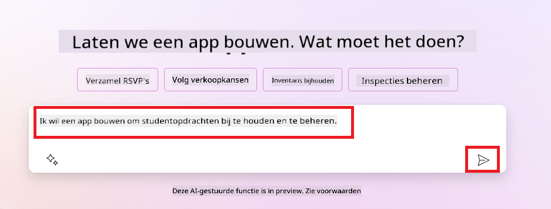
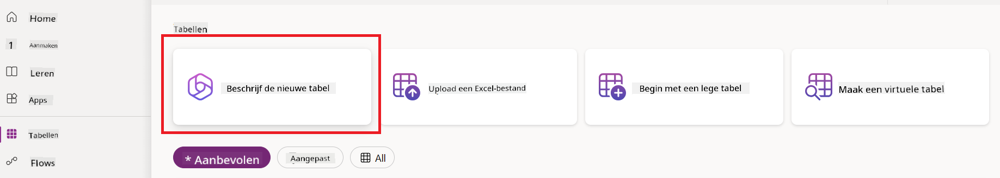
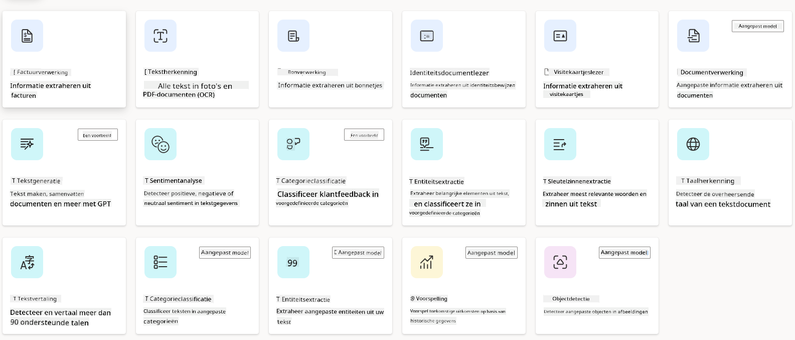
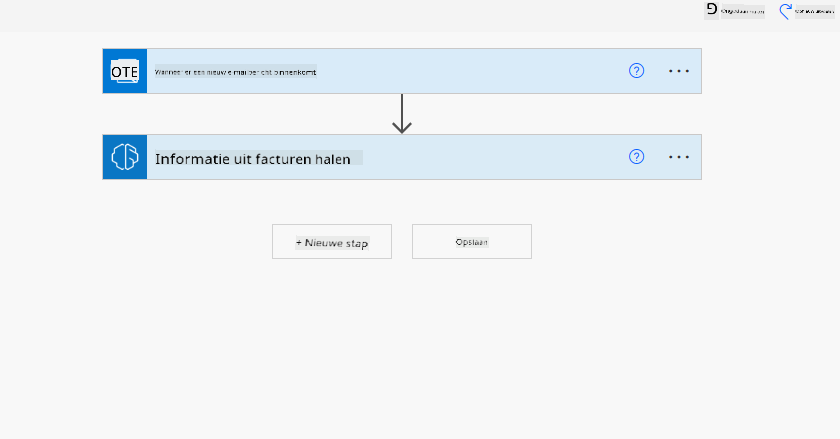
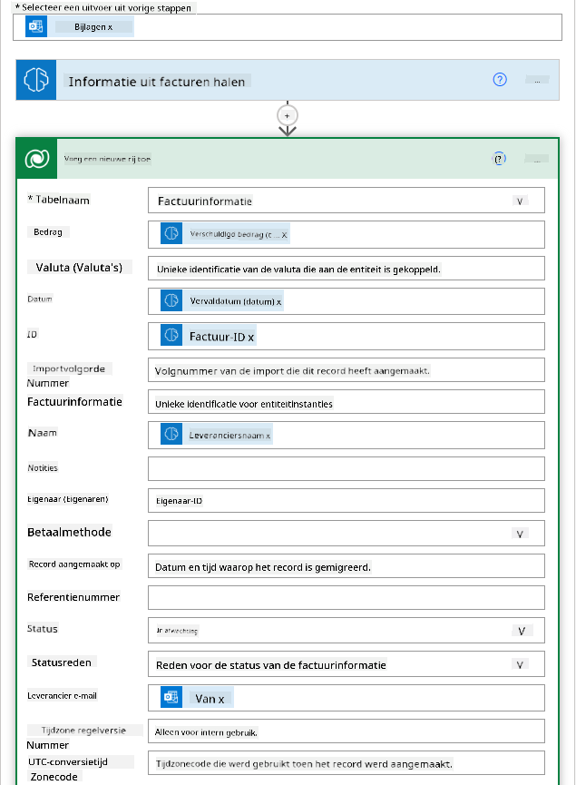

<!--
CO_OP_TRANSLATOR_METADATA:
{
  "original_hash": "846ac8e3b7dcfb697d3309fec05f0fea",
  "translation_date": "2025-10-17T19:54:38+00:00",
  "source_file": "10-building-low-code-ai-applications/README.md",
  "language_code": "nl"
}
-->
# Low Code AI-toepassingen bouwen

> _(Klik op de afbeelding hierboven om de video van deze les te bekijken)_

## Introductie

Nu we hebben geleerd hoe we applicaties kunnen bouwen die afbeeldingen genereren, laten we het hebben over low code. Generatieve AI kan worden gebruikt voor verschillende gebieden, waaronder low code, maar wat is low code en hoe kunnen we AI eraan toevoegen?

Het bouwen van apps en oplossingen is eenvoudiger geworden voor zowel traditionele ontwikkelaars als niet-ontwikkelaars door het gebruik van Low Code Development Platforms. Deze platforms stellen je in staat om apps en oplossingen te bouwen met weinig tot geen code. Dit wordt mogelijk gemaakt door een visuele ontwikkelomgeving waarin je componenten kunt slepen en neerzetten om apps en oplossingen te bouwen. Hierdoor kun je sneller en met minder middelen apps en oplossingen ontwikkelen. In deze les gaan we dieper in op hoe je low code kunt gebruiken en hoe je low code-ontwikkeling kunt verbeteren met AI via Power Platform.

Het Power Platform biedt organisaties de mogelijkheid om hun teams te versterken door hen hun eigen oplossingen te laten bouwen in een intuïtieve low-code of no-code omgeving. Deze omgeving vereenvoudigt het proces van het bouwen van oplossingen. Met Power Platform kunnen oplossingen in dagen of weken worden gebouwd in plaats van maanden of jaren. Power Platform bestaat uit vijf kernproducten: Power Apps, Power Automate, Power BI, Power Pages en Copilot Studio.

Deze les behandelt:

- Introductie tot generatieve AI in Power Platform
- Introductie tot Copilot en hoe je het kunt gebruiken
- Generatieve AI gebruiken om apps en workflows te bouwen in Power Platform
- Begrip van de AI-modellen in Power Platform met AI Builder

## Leerdoelen

Aan het einde van deze les kun je:

- Begrijpen hoe Copilot werkt in Power Platform.

- Een Student Assignment Tracker App bouwen voor onze onderwijsstartup.

- Een factuurverwerkingsworkflow bouwen die AI gebruikt om informatie uit facturen te halen.

- Best practices toepassen bij het gebruik van het Create Text met GPT AI Model.

De tools en technologieën die je in deze les zult gebruiken zijn:

- **Power Apps**, voor de Student Assignment Tracker-app, die een low-code ontwikkelomgeving biedt voor het bouwen van apps om gegevens bij te houden, te beheren en ermee te werken.

- **Dataverse**, voor het opslaan van de gegevens voor de Student Assignment Tracker-app, waarbij Dataverse een low-code dataplatform biedt voor het opslaan van de gegevens van de app.

- **Power Automate**, voor de factuurverwerkingsworkflow, waar je een low-code ontwikkelomgeving hebt voor het bouwen van workflows om het factuurverwerkingsproces te automatiseren.

- **AI Builder**, voor het factuurverwerkings-AI-model, waarbij je vooraf gebouwde AI-modellen gebruikt om de facturen voor onze startup te verwerken.

## Generatieve AI in Power Platform

Het verbeteren van low-code ontwikkeling en applicaties met generatieve AI is een belangrijk aandachtsgebied voor Power Platform. Het doel is om iedereen in staat te stellen AI-gestuurde apps, sites, dashboards en geautomatiseerde processen te bouwen met AI, _zonder dat er expertise in datawetenschap nodig is_. Dit doel wordt bereikt door generatieve AI te integreren in de low-code ontwikkelervaring in Power Platform in de vorm van Copilot en AI Builder.

### Hoe werkt dit?

Copilot is een AI-assistent die je in staat stelt om Power Platform-oplossingen te bouwen door je vereisten te beschrijven in een reeks conversatiestappen met behulp van natuurlijke taal. Je kunt bijvoorbeeld je AI-assistent instrueren om te specificeren welke velden je app zal gebruiken, en het zal zowel de app als het onderliggende datamodel creëren. Of je kunt aangeven hoe je een workflow in Power Automate wilt instellen.

Je kunt Copilot-gestuurde functionaliteiten als een functie in je app-schermen gebruiken om gebruikers inzichten te laten ontdekken via conversatie-interacties.

AI Builder is een low-code AI-mogelijkheid beschikbaar in Power Platform waarmee je AI-modellen kunt gebruiken om processen te automatiseren en uitkomsten te voorspellen. Met AI Builder kun je AI toevoegen aan je apps en workflows die verbinding maken met je gegevens in Dataverse of in verschillende cloudgegevensbronnen, zoals SharePoint, OneDrive of Azure.

Copilot is beschikbaar in alle Power Platform-producten: Power Apps, Power Automate, Power BI, Power Pages en Power Virtual Agents. AI Builder is beschikbaar in Power Apps en Power Automate. In deze les richten we ons op hoe je Copilot en AI Builder kunt gebruiken in Power Apps en Power Automate om een oplossing te bouwen voor onze onderwijsstartup.

### Copilot in Power Apps

Als onderdeel van het Power Platform biedt Power Apps een low-code ontwikkelomgeving voor het bouwen van apps om gegevens bij te houden, te beheren en ermee te werken. Het is een suite van app-ontwikkeldiensten met een schaalbaar dataplatform en de mogelijkheid om verbinding te maken met cloudservices en on-premises gegevens. Power Apps stelt je in staat om apps te bouwen die werken op browsers, tablets en telefoons, en die kunnen worden gedeeld met collega's. Power Apps maakt app-ontwikkeling toegankelijk met een eenvoudige interface, zodat elke zakelijke gebruiker of professionele ontwikkelaar aangepaste apps kan bouwen. De app-ontwikkelervaring wordt ook verbeterd met generatieve AI via Copilot.

De Copilot AI-assistentfunctie in Power Apps stelt je in staat om te beschrijven wat voor soort app je nodig hebt en welke informatie je app moet bijhouden, verzamelen of tonen. Copilot genereert vervolgens een responsieve Canvas-app op basis van je beschrijving. Je kunt de app vervolgens aanpassen aan je behoeften. De AI Copilot genereert en stelt ook een Dataverse-tabel voor met de velden die je nodig hebt om de gegevens die je wilt bijhouden op te slaan, samen met enkele voorbeeldgegevens. We zullen later in deze les bekijken wat Dataverse is en hoe je het kunt gebruiken in Power Apps. Je kunt de tabel vervolgens aanpassen aan je behoeften met behulp van de AI Copilot-assistentfunctie via conversatiestappen. Deze functie is direct beschikbaar vanaf het startscherm van Power Apps.

### Copilot in Power Automate

Als onderdeel van het Power Platform stelt Power Automate gebruikers in staat om geautomatiseerde workflows te creëren tussen applicaties en diensten. Het helpt bij het automatiseren van repetitieve bedrijfsprocessen zoals communicatie, gegevensverzameling en goedkeuringen van beslissingen. De eenvoudige interface stelt gebruikers van elk technisch niveau (van beginners tot ervaren ontwikkelaars) in staat om werkprocessen te automatiseren. De workflow-ontwikkelervaring wordt ook verbeterd met generatieve AI via Copilot.

De Copilot AI-assistentfunctie in Power Automate stelt je in staat om te beschrijven wat voor soort workflow je nodig hebt en welke acties je workflow moet uitvoeren. Copilot genereert vervolgens een workflow op basis van je beschrijving. Je kunt de workflow vervolgens aanpassen aan je behoeften. De AI Copilot genereert en stelt ook de acties voor die je nodig hebt om de taak die je wilt automatiseren uit te voeren. We zullen later in deze les bekijken wat workflows zijn en hoe je ze kunt gebruiken in Power Automate. Je kunt de acties vervolgens aanpassen aan je behoeften met behulp van de AI Copilot-assistentfunctie via conversatiestappen. Deze functie is direct beschikbaar vanaf het startscherm van Power Automate.

## Opdracht: Beheer studentopdrachten en facturen voor onze startup met Copilot

Onze startup biedt online cursussen aan studenten. De startup is snel gegroeid en heeft nu moeite om de vraag naar zijn cursussen bij te houden. De startup heeft jou aangenomen als Power Platform-ontwikkelaar om hen te helpen een low-code oplossing te bouwen om hen te helpen bij het beheren van hun studentopdrachten en facturen. De oplossing moet hen helpen bij het bijhouden en beheren van studentopdrachten via een app en het automatiseren van het factuurverwerkingsproces via een workflow. Je bent gevraagd om generatieve AI te gebruiken om de oplossing te ontwikkelen.

Wanneer je begint met het gebruik van Copilot, kun je de [Power Platform Copilot Prompt Library](https://github.com/pnp/powerplatform-prompts?WT.mc_id=academic-109639-somelezediko) gebruiken om aan de slag te gaan met de prompts. Deze bibliotheek bevat een lijst met prompts die je kunt gebruiken om apps en workflows te bouwen met Copilot. Je kunt de prompts in de bibliotheek ook gebruiken om een idee te krijgen van hoe je je vereisten aan Copilot kunt beschrijven.

### Bouw een Student Assignment Tracker App voor onze startup

De docenten bij onze startup hebben moeite om studentopdrachten bij te houden. Ze hebben een spreadsheet gebruikt om de opdrachten bij te houden, maar dit is moeilijk te beheren geworden naarmate het aantal studenten is toegenomen. Ze hebben je gevraagd om een app te bouwen die hen helpt bij het bijhouden en beheren van studentopdrachten. De app moet hen in staat stellen om nieuwe opdrachten toe te voegen, opdrachten te bekijken, opdrachten bij te werken en opdrachten te verwijderen. De app moet ook docenten en studenten in staat stellen om de opdrachten te bekijken die zijn beoordeeld en die nog niet zijn beoordeeld.

Je zult de app bouwen met Copilot in Power Apps volgens de onderstaande stappen:

1. Navigeer naar het [Power Apps](https://make.powerapps.com?WT.mc_id=academic-105485-koreyst) startscherm.

1. Gebruik het tekstvak op het startscherm om de app te beschrijven die je wilt bouwen. Bijvoorbeeld: **_Ik wil een app bouwen om studentopdrachten bij te houden en te beheren_**. Klik op de knop **Verzenden** om de prompt naar de AI Copilot te sturen.

1. De AI Copilot zal een Dataverse-tabel voorstellen met de velden die je nodig hebt om de gegevens die je wilt bijhouden op te slaan, samen met enkele voorbeeldgegevens. Je kunt de tabel vervolgens aanpassen aan je behoeften met behulp van de AI Copilot-assistentfunctie via conversatiestappen.

   > **Belangrijk**: Dataverse is het onderliggende dataplatform voor Power Platform. Het is een low-code dataplatform voor het opslaan van de gegevens van de app. Het is een volledig beheerde service die gegevens veilig opslaat in de Microsoft Cloud en wordt ingericht binnen je Power Platform-omgeving. Het biedt ingebouwde mogelijkheden voor gegevensbeheer, zoals gegevensclassificatie, gegevenslijnage, fijnmazige toegangscontrole en meer. Je kunt meer leren over Dataverse [hier](https://docs.microsoft.com/powerapps/maker/data-platform/data-platform-intro?WT.mc_id=academic-109639-somelezediko).

   

1. Docenten willen e-mails sturen naar de studenten die hun opdrachten hebben ingediend om hen op de hoogte te houden van de voortgang van hun opdrachten. Je kunt Copilot gebruiken om een nieuw veld aan de tabel toe te voegen om het e-mailadres van de student op te slaan. Bijvoorbeeld, je kunt de volgende prompt gebruiken om een nieuw veld aan de tabel toe te voegen: **_Ik wil een kolom toevoegen om het e-mailadres van de student op te slaan_**. Klik op de knop **Verzenden** om de prompt naar de AI Copilot te sturen.

1. De AI Copilot zal een nieuw veld genereren en je kunt het veld vervolgens aanpassen aan je behoeften.

1. Zodra je klaar bent met de tabel, klik je op de knop **App maken** om de app te maken.

1. De AI Copilot zal een responsieve Canvas-app genereren op basis van je beschrijving. Je kunt de app vervolgens aanpassen aan je behoeften.

1. Om docenten in staat te stellen e-mails naar studenten te sturen, kun je Copilot gebruiken om een nieuw scherm aan de app toe te voegen. Bijvoorbeeld, je kunt de volgende prompt gebruiken om een nieuw scherm aan de app toe te voegen: **_Ik wil een scherm toevoegen om e-mails naar studenten te sturen_**. Klik op de knop **Verzenden** om de prompt naar de AI Copilot te sturen.

1. De AI Copilot zal een nieuw scherm genereren en je kunt het scherm vervolgens aanpassen aan je behoeften.

1. Zodra je klaar bent met de app, klik je op de knop **Opslaan** om de app op te slaan.

1. Om de app te delen met de docenten, klik je op de knop **Delen** en vervolgens opnieuw op de knop **Delen**. Je kunt de app vervolgens delen met de docenten door hun e-mailadressen in te voeren.

> **Je huiswerk**: De app die je zojuist hebt gebouwd is een goed begin, maar kan worden verbeterd. Met de e-mailfunctie kunnen docenten alleen handmatig e-mails naar studenten sturen door hun e-mailadressen te typen. Kun je Copilot gebruiken om een automatisering te bouwen waarmee docenten automatisch e-mails naar studenten kunnen sturen wanneer ze hun opdrachten indienen? Je hint is dat je met de juiste prompt Copilot in Power Automate kunt gebruiken om dit te bouwen.

### Bouw een factuurinformatietabel voor onze startup

Het financiële team van onze startup heeft moeite om facturen bij te houden. Ze hebben een spreadsheet gebruikt om de facturen bij te houden, maar dit is moeilijk te beheren geworden naarmate het aantal facturen is toegenomen. Ze hebben je gevraagd om een tabel te bouwen die hen helpt bij het opslaan, bijhouden en beheren van de informatie van de ontvangen facturen. De tabel moet worden gebruikt om een automatisering te bouwen die alle factuurinformatie extraheert en opslaat in de tabel. De tabel moet het financiële team ook in staat stellen om de facturen te bekijken die zijn betaald en die nog niet zijn betaald.

Het Power Platform heeft een onderliggend dataplatform genaamd Dataverse waarmee je de gegevens voor je apps en oplossingen kunt opslaan. Dataverse biedt een low-code dataplatform voor het opslaan van de gegevens van de app. Het is een volledig beheerde service die gegevens veilig opslaat in de Microsoft Cloud en wordt ingericht binnen je Power Platform-omgeving. Het biedt ingebouwde mogelijkheden voor gegevensbeheer, zoals gegevensclassificatie, gegevenslijnage, fijnmazige toegangscontrole en meer. Je kunt meer leren [over Dataverse hier](https://docs.microsoft.com/powerapps/maker/data-platform/data-platform-intro?WT.mc_id=academic-109639-somelezediko).
Waarom zouden we Dataverse gebruiken voor onze startup? De standaard- en aangepaste tabellen binnen Dataverse bieden een veilige en cloudgebaseerde opslagoptie voor je gegevens. Tabellen stellen je in staat om verschillende soorten gegevens op te slaan, vergelijkbaar met hoe je meerdere werkbladen in een enkele Excel-werkmap zou gebruiken. Je kunt tabellen gebruiken om gegevens op te slaan die specifiek zijn voor de behoeften van jouw organisatie of bedrijf. Enkele voordelen die onze startup kan halen uit het gebruik van Dataverse zijn onder andere:

- **Eenvoudig te beheren**: Zowel de metadata als de gegevens worden in de cloud opgeslagen, dus je hoeft je geen zorgen te maken over de details van hoe ze worden opgeslagen of beheerd. Je kunt je richten op het bouwen van je apps en oplossingen.

- **Veilig**: Dataverse biedt een veilige en cloudgebaseerde opslagoptie voor je gegevens. Je kunt bepalen wie toegang heeft tot de gegevens in je tabellen en hoe ze toegang krijgen met behulp van op rollen gebaseerde beveiliging.

- **Rijke metadata**: Gegevenstypen en relaties worden direct binnen Power Apps gebruikt.

- **Logica en validatie**: Je kunt bedrijfsregels, berekende velden en validatieregels gebruiken om bedrijfslogica af te dwingen en gegevensnauwkeurigheid te behouden.

Nu je weet wat Dataverse is en waarom je het zou moeten gebruiken, laten we kijken hoe je Copilot kunt gebruiken om een tabel in Dataverse te maken die voldoet aan de eisen van ons financiële team.

> **Note**: Je zult deze tabel in de volgende sectie gebruiken om een automatisering te bouwen die alle factuurinformatie extraheert en opslaat in de tabel.

Om een tabel in Dataverse te maken met Copilot, volg je de onderstaande stappen:

1. Ga naar het [Power Apps](https://make.powerapps.com?WT.mc_id=academic-105485-koreyst) startscherm.

2. Selecteer in de navigatiebalk links **Tabellen** en klik vervolgens op **Beschrijf de nieuwe tabel**.

3. Op het scherm **Beschrijf de nieuwe tabel**, gebruik je het tekstveld om de tabel te beschrijven die je wilt maken. Bijvoorbeeld: **_Ik wil een tabel maken om factuurinformatie op te slaan_**. Klik op de knop **Verzenden** om de prompt naar de AI Copilot te sturen.

4. De AI Copilot zal een Dataverse-tabel voorstellen met de velden die je nodig hebt om de gegevens die je wilt bijhouden op te slaan, samen met enkele voorbeeldgegevens. Je kunt de tabel vervolgens aanpassen aan je behoeften met behulp van de AI Copilot-assistent via conversatiestappen.

5. Het financiële team wil een e-mail sturen naar de leverancier om hen op de hoogte te stellen van de huidige status van hun factuur. Je kunt Copilot gebruiken om een nieuw veld aan de tabel toe te voegen om het e-mailadres van de leverancier op te slaan. Bijvoorbeeld: je kunt de volgende prompt gebruiken om een nieuw veld aan de tabel toe te voegen: **_Ik wil een kolom toevoegen om het e-mailadres van de leverancier op te slaan_**. Klik op de knop **Verzenden** om de prompt naar de AI Copilot te sturen.

6. De AI Copilot zal een nieuw veld genereren en je kunt het veld vervolgens aanpassen aan je behoeften.

7. Zodra je klaar bent met de tabel, klik je op de knop **Maken** om de tabel te maken.

## AI-modellen in Power Platform met AI Builder

AI Builder is een low-code AI-functionaliteit beschikbaar in Power Platform waarmee je AI-modellen kunt gebruiken om processen te automatiseren en uitkomsten te voorspellen. Met AI Builder kun je AI integreren in je apps en flows die verbinding maken met je gegevens in Dataverse of in verschillende cloudgegevensbronnen, zoals SharePoint, OneDrive of Azure.

## Voorgebouwde AI-modellen versus aangepaste AI-modellen

AI Builder biedt twee soorten AI-modellen: Voorgebouwde AI-modellen en Aangepaste AI-modellen. Voorgebouwde AI-modellen zijn kant-en-klare AI-modellen die door Microsoft zijn getraind en beschikbaar zijn in Power Platform. Deze helpen je intelligentie toe te voegen aan je apps en flows zonder dat je gegevens hoeft te verzamelen en vervolgens je eigen modellen hoeft te bouwen, trainen en publiceren. Je kunt deze modellen gebruiken om processen te automatiseren en uitkomsten te voorspellen.

Enkele van de voorgebouwde AI-modellen die beschikbaar zijn in Power Platform zijn:

- **Belangrijke zinnen extractie**: Dit model haalt belangrijke zinnen uit tekst.
- **Taalherkenning**: Dit model herkent de taal van een tekst.
- **Sentimentanalyse**: Dit model detecteert positieve, negatieve, neutrale of gemengde sentimenten in tekst.
- **Visitekaartjeslezer**: Dit model haalt informatie uit visitekaartjes.
- **Tekstherkenning**: Dit model haalt tekst uit afbeeldingen.
- **Objectherkenning**: Dit model detecteert en haalt objecten uit afbeeldingen.
- **Documentverwerking**: Dit model haalt informatie uit formulieren.
- **Factuurverwerking**: Dit model haalt informatie uit facturen.

Met aangepaste AI-modellen kun je je eigen model in AI Builder integreren zodat het kan functioneren als elk ander AI Builder aangepast model, waarmee je het model kunt trainen met je eigen gegevens. Je kunt deze modellen gebruiken om processen te automatiseren en uitkomsten te voorspellen in zowel Power Apps als Power Automate. Bij het gebruik van je eigen model gelden er beperkingen. Lees meer over deze [beperkingen](https://learn.microsoft.com/ai-builder/byo-model#limitations?WT.mc_id=academic-105485-koreyst).

## Opdracht #2 - Bouw een factuurverwerkingsflow voor onze startup

Het financiële team heeft moeite met het verwerken van facturen. Ze gebruiken een spreadsheet om de facturen bij te houden, maar dit is moeilijk te beheren geworden naarmate het aantal facturen is toegenomen. Ze hebben je gevraagd om een workflow te bouwen die hen helpt facturen te verwerken met behulp van AI. De workflow moet hen in staat stellen om informatie uit facturen te halen en deze informatie op te slaan in een Dataverse-tabel. De workflow moet hen ook in staat stellen een e-mail te sturen naar het financiële team met de geëxtraheerde informatie.

Nu je weet wat AI Builder is en waarom je het zou moeten gebruiken, laten we kijken hoe je het Factuurverwerkings-AI-model in AI Builder, dat we eerder hebben behandeld, kunt gebruiken om een workflow te bouwen die het financiële team helpt facturen te verwerken.

Om een workflow te bouwen die het financiële team helpt facturen te verwerken met behulp van het Factuurverwerkings-AI-model in AI Builder, volg je de onderstaande stappen:

1. Ga naar het [Power Automate](https://make.powerautomate.com?WT.mc_id=academic-105485-koreyst) startscherm.

2. Gebruik het tekstveld op het startscherm om de workflow te beschrijven die je wilt bouwen. Bijvoorbeeld: **_Verwerk een factuur wanneer deze in mijn mailbox aankomt_**. Klik op de knop **Verzenden** om de prompt naar de AI Copilot te sturen.

   

3. De AI Copilot zal de acties voorstellen die je nodig hebt om de taak die je wilt automatiseren uit te voeren. Je kunt op de knop **Volgende** klikken om door te gaan naar de volgende stappen.

4. In de volgende stap zal Power Automate je vragen om de vereiste verbindingen voor de flow in te stellen. Zodra je klaar bent, klik je op de knop **Flow maken** om de flow te maken.

5. De AI Copilot zal een flow genereren en je kunt de flow vervolgens aanpassen aan je behoeften.

6. Werk de trigger van de flow bij en stel de **Map** in op de map waar de facturen worden opgeslagen. Bijvoorbeeld: je kunt de map instellen op **Inbox**. Klik op **Geavanceerde opties weergeven** en stel **Alleen met bijlagen** in op **Ja**. Dit zorgt ervoor dat de flow alleen wordt uitgevoerd wanneer een e-mail met een bijlage in de map wordt ontvangen.

7. Verwijder de volgende acties uit de flow: **HTML naar tekst**, **Samenstellen**, **Samenstellen 2**, **Samenstellen 3** en **Samenstellen 4**, omdat je deze niet zult gebruiken.

8. Verwijder de **Voorwaarde**-actie uit de flow, omdat je deze niet zult gebruiken. Het zou eruit moeten zien zoals in de volgende screenshot:

   

9. Klik op de knop **Actie toevoegen** en zoek naar **Dataverse**. Selecteer de actie **Een nieuwe rij toevoegen**.

10. Bij de actie **Informatie uit facturen extraheren**, werk je het **Factuurbestand** bij zodat het verwijst naar de **Bijlage-inhoud** van de e-mail. Dit zorgt ervoor dat de flow informatie uit de factuurbijlage haalt.

11. Selecteer de **Tabel** die je eerder hebt gemaakt. Bijvoorbeeld: je kunt de tabel **Factuurinformatie** selecteren. Kies de dynamische inhoud van de vorige actie om de volgende velden in te vullen:

    - ID
    - Bedrag
    - Datum
    - Naam
    - Status - Stel de **Status** in op **In behandeling**.
    - E-mailadres leverancier - Gebruik de **Van** dynamische inhoud van de trigger **Wanneer een nieuwe e-mail aankomt**.

    

12. Zodra je klaar bent met de flow, klik je op de knop **Opslaan** om de flow op te slaan. Je kunt de flow vervolgens testen door een e-mail met een factuur te sturen naar de map die je hebt opgegeven in de trigger.

> **Je huiswerk**: De flow die je zojuist hebt gebouwd is een goed begin, nu moet je nadenken over hoe je een automatisering kunt bouwen waarmee ons financiële team een e-mail kan sturen naar de leverancier om hen op de hoogte te stellen van de huidige status van hun factuur. Je hint: de flow moet worden uitgevoerd wanneer de status van de factuur verandert.

## Gebruik een tekstgeneratie-AI-model in Power Automate

Het tekstgeneratie-AI-model "Create Text with GPT" in AI Builder stelt je in staat om tekst te genereren op basis van een prompt en wordt aangedreven door de Microsoft Azure OpenAI Service. Met deze functionaliteit kun je GPT (Generative Pre-Trained Transformer)-technologie integreren in je apps en flows om een breed scala aan geautomatiseerde flows en inzichtelijke toepassingen te bouwen.

GPT-modellen ondergaan uitgebreide training op enorme hoeveelheden gegevens, waardoor ze tekst kunnen produceren die sterk lijkt op menselijke taal wanneer ze een prompt krijgen. Wanneer ze worden geïntegreerd met workflowautomatisering, kunnen AI-modellen zoals GPT worden ingezet om een breed scala aan taken te stroomlijnen en te automatiseren.

Bijvoorbeeld: je kunt flows bouwen om automatisch tekst te genereren voor verschillende toepassingen, zoals: concepten van e-mails, productbeschrijvingen en meer. Je kunt het model ook gebruiken om tekst te genereren voor verschillende apps, zoals chatbots en klantenservice-apps waarmee klantenserviceagenten effectief en efficiënt kunnen reageren op klantvragen.

Om te leren hoe je dit AI-model in Power Automate kunt gebruiken, doorloop je de module [Intelligentie toevoegen met AI Builder en GPT](https://learn.microsoft.com/training/modules/ai-builder-text-generation/?WT.mc_id=academic-109639-somelezediko).

## Goed gedaan! Ga door met leren

Na het voltooien van deze les, bekijk onze [Generatieve AI-leercollectie](https://aka.ms/genai-collection?WT.mc_id=academic-105485-koreyst) om je kennis over Generatieve AI verder te vergroten!

Ga naar Les 11, waar we zullen kijken naar hoe je [Generatieve AI kunt integreren met Function Calling](../11-integrating-with-function-calling/README.md?WT.mc_id=academic-105485-koreyst)!

---

**Disclaimer**:  
Dit document is vertaald met behulp van de AI-vertalingsservice [Co-op Translator](https://github.com/Azure/co-op-translator). Hoewel we streven naar nauwkeurigheid, dient u zich ervan bewust te zijn dat geautomatiseerde vertalingen fouten of onnauwkeurigheden kunnen bevatten. Het originele document in de oorspronkelijke taal moet worden beschouwd als de gezaghebbende bron. Voor kritieke informatie wordt professionele menselijke vertaling aanbevolen. Wij zijn niet aansprakelijk voor eventuele misverstanden of verkeerde interpretaties die voortvloeien uit het gebruik van deze vertaling.