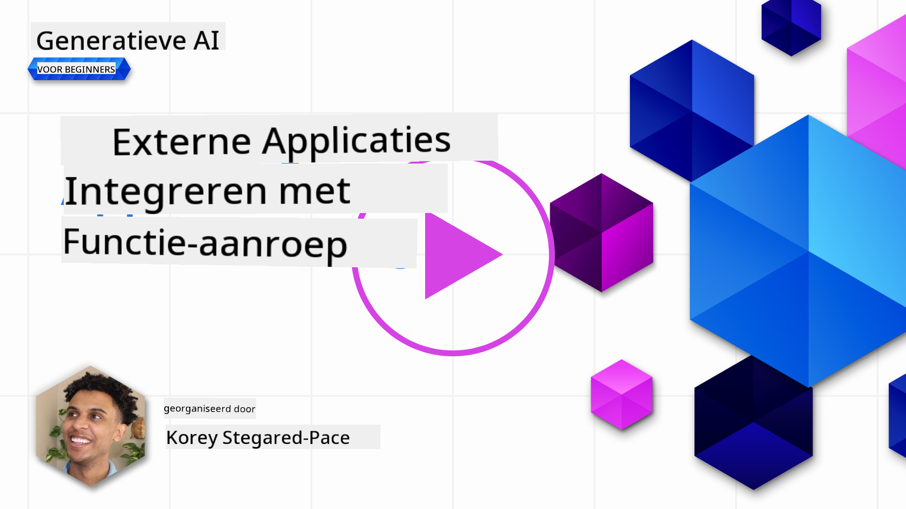
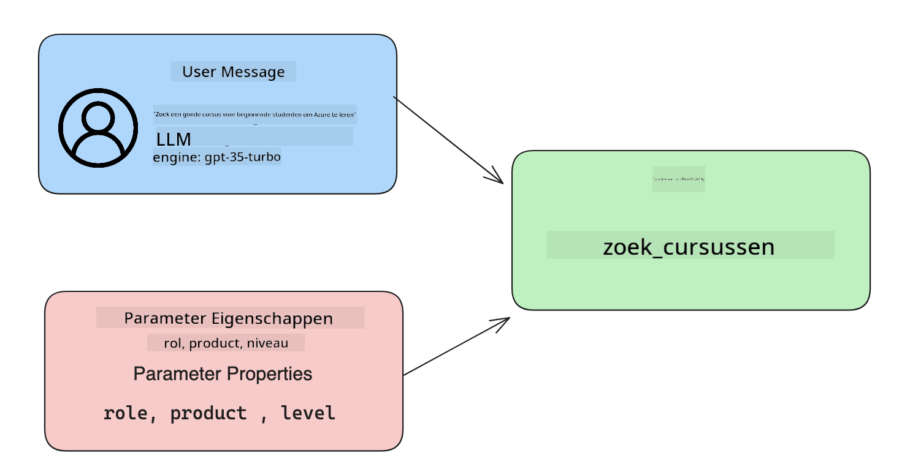

<!--
CO_OP_TRANSLATOR_METADATA:
{
  "original_hash": "77a48a201447be19aa7560706d6f93a0",
  "translation_date": "2025-05-19T21:32:36+00:00",
  "source_file": "11-integrating-with-function-calling/README.md",
  "language_code": "nl"
}
-->
# Integreren met functieverzoeken

[](https://aka.ms/gen-ai-lesson11-gh?WT.mc_id=academic-105485-koreyst)

Je hebt al aardig wat geleerd in de vorige lessen. Echter, we kunnen nog verder verbeteren. Enkele zaken die we kunnen aanpakken zijn hoe we een consistenter reactieformaat kunnen krijgen om het gemakkelijker te maken om met de reactie verder te werken. Ook willen we misschien data van andere bronnen toevoegen om onze applicatie verder te verrijken.

De bovengenoemde problemen zijn wat dit hoofdstuk wil aanpakken.

## Introductie

Deze les behandelt:

- Uitleggen wat functieverzoeken zijn en hun gebruikscases.
- Een functieverzoek maken met Azure OpenAI.
- Hoe een functieverzoek in een applicatie te integreren.

## Leerdoelen

Aan het einde van deze les zul je in staat zijn om:

- Het doel van het gebruik van functieverzoeken uit te leggen.
- Een Functieverzoek op te zetten met de Azure OpenAI Service.
- Effectieve functieverzoeken te ontwerpen voor de use case van je applicatie.

## Scenario: Verbeteren van onze chatbot met functies

Voor deze les willen we een functie bouwen voor onze educatieve startup waarmee gebruikers een chatbot kunnen gebruiken om technische cursussen te vinden. We zullen cursussen aanbevelen die passen bij hun vaardigheidsniveau, huidige rol en interesse in technologie.

Om dit scenario te voltooien, zullen we een combinatie gebruiken van:

- `Azure OpenAI` om een chatervaring voor de gebruiker te creëren.
- `Microsoft Learn Catalog API` om gebruikers te helpen cursussen te vinden op basis van het verzoek van de gebruiker.
- `Function Calling` om de vraag van de gebruiker te nemen en deze naar een functie te sturen om het API-verzoek te doen.

Om te beginnen, laten we eens kijken waarom we in de eerste plaats functieverzoeken zouden willen gebruiken:

## Waarom Functieverzoeken

Voor functieverzoeken waren reacties van een LLM ongestructureerd en inconsistent. Ontwikkelaars moesten complexe validatiecode schrijven om ervoor te zorgen dat ze elke variatie van een reactie konden verwerken. Gebruikers konden geen antwoorden krijgen zoals "Wat is het huidige weer in Stockholm?". Dit komt omdat modellen beperkt waren tot de tijd waarop de data was getraind.

Functieverzoeken zijn een functie van de Azure OpenAI Service om de volgende beperkingen te overwinnen:

- **Consistent reactieformaat**. Als we het reactieformaat beter kunnen controleren, kunnen we de reactie gemakkelijker integreren in andere systemen.
- **Externe data**. Mogelijkheid om data uit andere bronnen van een applicatie te gebruiken in een chatcontext.

## Het probleem illustreren door middel van een scenario

> We raden je aan om de [bijgevoegde notebook](../../../11-integrating-with-function-calling/python/aoai-assignment.ipynb) te gebruiken als je het onderstaande scenario wilt uitvoeren. Je kunt ook gewoon meelezen terwijl we proberen een probleem te illustreren waar functies kunnen helpen om het probleem aan te pakken.

Laten we eens kijken naar het voorbeeld dat het probleem met het reactieformaat illustreert:

Stel dat we een database van studentgegevens willen maken, zodat we hen de juiste cursus kunnen voorstellen. Hieronder hebben we twee beschrijvingen van studenten die erg op elkaar lijken qua gegevens die ze bevatten.

1. Maak een verbinding met onze Azure OpenAI-bron:

   ```python
   import os
   import json
   from openai import AzureOpenAI
   from dotenv import load_dotenv
   load_dotenv()

   client = AzureOpenAI(
   api_key=os.environ['AZURE_OPENAI_API_KEY'],  # this is also the default, it can be omitted
   api_version = "2023-07-01-preview"
   )

   deployment=os.environ['AZURE_OPENAI_DEPLOYMENT']
   ```

   Hieronder staat wat Python-code voor het configureren van onze verbinding met Azure OpenAI, waarbij we `api_type`, `api_base`, `api_version` and `api_key`.

1. Creating two student descriptions using variables `student_1_description` and `student_2_description` instellen.

   ```python
   student_1_description="Emily Johnson is a sophomore majoring in computer science at Duke University. She has a 3.7 GPA. Emily is an active member of the university's Chess Club and Debate Team. She hopes to pursue a career in software engineering after graduating."

   student_2_description = "Michael Lee is a sophomore majoring in computer science at Stanford University. He has a 3.8 GPA. Michael is known for his programming skills and is an active member of the university's Robotics Club. He hopes to pursue a career in artificial intelligence after finishing his studies."
   ```

   We willen de bovenstaande studentbeschrijvingen naar een LLM sturen om de gegevens te parseren. Deze gegevens kunnen later in onze applicatie worden gebruikt en naar een API worden gestuurd of in een database worden opgeslagen.

1. Laten we twee identieke prompts maken waarin we de LLM instrueren over welke informatie we geïnteresseerd zijn:

   ```python
   prompt1 = f'''
   Please extract the following information from the given text and return it as a JSON object:

   name
   major
   school
   grades
   club

   This is the body of text to extract the information from:
   {student_1_description}
   '''

   prompt2 = f'''
   Please extract the following information from the given text and return it as a JSON object:

   name
   major
   school
   grades
   club

   This is the body of text to extract the information from:
   {student_2_description}
   '''
   ```

   De bovenstaande prompts instrueren de LLM om informatie te extraheren en de reactie in JSON-formaat terug te geven.

1. Nadat we de prompts en de verbinding met Azure OpenAI hebben ingesteld, sturen we nu de prompts naar de LLM door `openai.ChatCompletion`. We store the prompt in the `messages` variable and assign the role to `user` te gebruiken. Dit is om een bericht van een gebruiker naar een chatbot na te bootsen.

   ```python
   # response from prompt one
   openai_response1 = client.chat.completions.create(
   model=deployment,
   messages = [{'role': 'user', 'content': prompt1}]
   )
   openai_response1.choices[0].message.content

   # response from prompt two
   openai_response2 = client.chat.completions.create(
   model=deployment,
   messages = [{'role': 'user', 'content': prompt2}]
   )
   openai_response2.choices[0].message.content
   ```

Nu kunnen we beide verzoeken naar de LLM sturen en de reactie die we ontvangen onderzoeken door deze als volgt te vinden `openai_response1['choices'][0]['message']['content']`.

1. Lastly, we can convert the response to JSON format by calling `json.loads`:

   ```python
   # Loading the response as a JSON object
   json_response1 = json.loads(openai_response1.choices[0].message.content)
   json_response1
   ```

   Reactie 1:

   ```json
   {
     "name": "Emily Johnson",
     "major": "computer science",
     "school": "Duke University",
     "grades": "3.7",
     "club": "Chess Club"
   }
   ```

   Reactie 2:

   ```json
   {
     "name": "Michael Lee",
     "major": "computer science",
     "school": "Stanford University",
     "grades": "3.8 GPA",
     "club": "Robotics Club"
   }
   ```

   Hoewel de prompts hetzelfde zijn en de beschrijvingen vergelijkbaar, zien we waarden van de `Grades` property formatted differently, as we can sometimes get the format `3.7` or `3.7 GPA` for example.

   This result is because the LLM takes unstructured data in the form of the written prompt and returns also unstructured data. We need to have a structured format so that we know what to expect when storing or using this data

So how do we solve the formatting problem then? By using functional calling, we can make sure that we receive structured data back. When using function calling, the LLM does not actually call or run any functions. Instead, we create a structure for the LLM to follow for its responses. We then use those structured responses to know what function to run in our applications.


We can then take what is returned from the function and send this back to the LLM. The LLM will then respond using natural language to answer the user's query.

## Use Cases for using function calls

There are many different use cases where function calls can improve your app like:

- **Calling External Tools**. Chatbots are great at providing answers to questions from users. By using function calling, the chatbots can use messages from users to complete certain tasks. For example, a student can ask the chatbot to "Send an email to my instructor saying I need more assistance with this subject". This can make a function call to `send_email(to: string, body: string)`

- **Create API or Database Queries**. Users can find information using natural language that gets converted into a formatted query or API request. An example of this could be a teacher who requests "Who are the students that completed the last assignment" which could call a function named `get_completed(student_name: string, assignment: int, current_status: string)`

- **Creating Structured Data**. Users can take a block of text or CSV and use the LLM to extract important information from it. For example, a student can convert a Wikipedia article about peace agreements to create AI flashcards. This can be done by using a function called `get_important_facts(agreement_name: string, date_signed: string, parties_involved: list)`

## Creating Your First Function Call

The process of creating a function call includes 3 main steps:

1. **Calling** the Chat Completions API with a list of your functions and a user message.
2. **Reading** the model's response to perform an action i.e. execute a function or API Call.
3. **Making** another call to Chat Completions API with the response from your function to use that information to create a response to the user.



### Step 1 - creating messages

The first step is to create a user message. This can be dynamically assigned by taking the value of a text input or you can assign a value here. If this is your first time working with the Chat Completions API, we need to define the `role` and the `content` of the message.

The `role` can be either `system` (creating rules), `assistant` (the model) or `user` (the end-user). For function calling, we will assign this as `user` en een voorbeeldvraag.

```python
messages= [ {"role": "user", "content": "Find me a good course for a beginner student to learn Azure."} ]
```

Door verschillende rollen toe te wijzen, wordt het voor de LLM duidelijk of het het systeem is dat iets zegt of de gebruiker, wat helpt om een gespreksgeschiedenis op te bouwen waarop de LLM kan voortbouwen.

### Stap 2 - functies maken

Vervolgens definiëren we een functie en de parameters van die functie. We zullen hier slechts één functie gebruiken genaamd `search_courses` but you can create multiple functions.

> **Important** : Functions are included in the system message to the LLM and will be included in the amount of available tokens you have available.

Below, we create the functions as an array of items. Each item is a function and has properties `name`, `description` and `parameters`:

```python
functions = [
   {
      "name":"search_courses",
      "description":"Retrieves courses from the search index based on the parameters provided",
      "parameters":{
         "type":"object",
         "properties":{
            "role":{
               "type":"string",
               "description":"The role of the learner (i.e. developer, data scientist, student, etc.)"
            },
            "product":{
               "type":"string",
               "description":"The product that the lesson is covering (i.e. Azure, Power BI, etc.)"
            },
            "level":{
               "type":"string",
               "description":"The level of experience the learner has prior to taking the course (i.e. beginner, intermediate, advanced)"
            }
         },
         "required":[
            "role"
         ]
      }
   }
]
```

Laten we elke instantie van de functie hieronder meer in detail beschrijven:

- `name` - The name of the function that we want to have called.
- `description` - This is the description of how the function works. Here it's important to be specific and clear.
- `parameters` - A list of values and format that you want the model to produce in its response. The parameters array consists of items where the items have the following properties:
  1.  `type` - The data type of the properties will be stored in.
  1.  `properties` - List of the specific values that the model will use for its response
      1. `name` - The key is the name of the property that the model will use in its formatted response, for example, `product`.
      1. `type` - The data type of this property, for example, `string`.
      1. `description` - Description of the specific property.

There's also an optional property `required` - required property for the function call to be completed.

### Step 3 - Making the function call

After defining a function, we now need to include it in the call to the Chat Completion API. We do this by adding `functions` to the request. In this case `functions=functions`.

There is also an option to set `function_call` to `auto`. This means we will let the LLM decide which function should be called based on the user message rather than assigning it ourselves.

Here's some code below where we call `ChatCompletion.create`, note how we set `functions=functions` and `function_call="auto"` en daarmee de LLM de keuze geven wanneer de functies die we aanbieden aan te roepen:

```python
response = client.chat.completions.create(model=deployment,
                                        messages=messages,
                                        functions=functions,
                                        function_call="auto")

print(response.choices[0].message)
```

De reactie die nu terugkomt ziet er als volgt uit:

```json
{
  "role": "assistant",
  "function_call": {
    "name": "search_courses",
    "arguments": "{\n  \"role\": \"student\",\n  \"product\": \"Azure\",\n  \"level\": \"beginner\"\n}"
  }
}
```

Hier kunnen we zien hoe de functie `search_courses` was called and with what arguments, as listed in the `arguments` property in the JSON response.

The conclusion the LLM was able to find the data to fit the arguments of the function as it was extracting it from the value provided to the `messages` parameter in the chat completion call. Below is a reminder of the `messages` waarde:

```python
messages= [ {"role": "user", "content": "Find me a good course for a beginner student to learn Azure."} ]
```

Zoals je kunt zien, `student`, `Azure` and `beginner` was extracted from `messages` and set as input to the function. Using functions this way is a great way to extract information from a prompt but also to provide structure to the LLM and have reusable functionality.

Next, we need to see how we can use this in our app.

## Integrating Function Calls into an Application

After we have tested the formatted response from the LLM, we can now integrate this into an application.

### Managing the flow

To integrate this into our application, let's take the following steps:

1. First, let's make the call to the OpenAI services and store the message in a variable called `response_message`.

   ```python
   response_message = response.choices[0].message
   ```

1. Nu zullen we de functie definiëren die de Microsoft Learn API aanroept om een lijst met cursussen te krijgen:

   ```python
   import requests

   def search_courses(role, product, level):
     url = "https://learn.microsoft.com/api/catalog/"
     params = {
        "role": role,
        "product": product,
        "level": level
     }
     response = requests.get(url, params=params)
     modules = response.json()["modules"]
     results = []
     for module in modules[:5]:
        title = module["title"]
        url = module["url"]
        results.append({"title": title, "url": url})
     return str(results)
   ```

   Let op hoe we nu een daadwerkelijke Python-functie maken die overeenkomt met de functienamen die zijn geïntroduceerd in de `functions` variable. We're also making real external API calls to fetch the data we need. In this case, we go against the Microsoft Learn API to search for training modules.

Ok, so we created `functions` variables and a corresponding Python function, how do we tell the LLM how to map these two together so our Python function is called?

1. To see if we need to call a Python function, we need to look into the LLM response and see if `function_call` is er onderdeel van en de aangewezen functie aanroept. Hier is hoe je de genoemde controle hieronder kunt uitvoeren:

   ```python
   # Check if the model wants to call a function
   if response_message.function_call.name:
    print("Recommended Function call:")
    print(response_message.function_call.name)
    print()

    # Call the function.
    function_name = response_message.function_call.name

    available_functions = {
            "search_courses": search_courses,
    }
    function_to_call = available_functions[function_name]

    function_args = json.loads(response_message.function_call.arguments)
    function_response = function_to_call(**function_args)

    print("Output of function call:")
    print(function_response)
    print(type(function_response))


    # Add the assistant response and function response to the messages
    messages.append( # adding assistant response to messages
        {
            "role": response_message.role,
            "function_call": {
                "name": function_name,
                "arguments": response_message.function_call.arguments,
            },
            "content": None
        }
    )
    messages.append( # adding function response to messages
        {
            "role": "function",
            "name": function_name,
            "content":function_response,
        }
    )
   ```

   Deze drie regels zorgen ervoor dat we de functienaam, de argumenten extraheren en de aanroep doen:

   ```python
   function_to_call = available_functions[function_name]

   function_args = json.loads(response_message.function_call.arguments)
   function_response = function_to_call(**function_args)
   ```

   Hieronder is de uitvoer van het uitvoeren van onze code:

   **Uitvoer**

   ```Recommended Function call:
   {
     "name": "search_courses",
     "arguments": "{\n  \"role\": \"student\",\n  \"product\": \"Azure\",\n  \"level\": \"beginner\"\n}"
   }

   Output of function call:
   [{'title': 'Describe concepts of cryptography', 'url': 'https://learn.microsoft.com/training/modules/describe-concepts-of-cryptography/?
   WT.mc_id=api_CatalogApi'}, {'title': 'Introduction to audio classification with TensorFlow', 'url': 'https://learn.microsoft.com/en-
   us/training/modules/intro-audio-classification-tensorflow/?WT.mc_id=api_CatalogApi'}, {'title': 'Design a Performant Data Model in Azure SQL
   Database with Azure Data Studio', 'url': 'https://learn.microsoft.com/training/modules/design-a-data-model-with-ads/?
   WT.mc_id=api_CatalogApi'}, {'title': 'Getting started with the Microsoft Cloud Adoption Framework for Azure', 'url':
   'https://learn.microsoft.com/training/modules/cloud-adoption-framework-getting-started/?WT.mc_id=api_CatalogApi'}, {'title': 'Set up the
   Rust development environment', 'url': 'https://learn.microsoft.com/training/modules/rust-set-up-environment/?WT.mc_id=api_CatalogApi'}]
   <class 'str'>
   ```

1. Nu zullen we het bijgewerkte bericht, `messages` naar de LLM sturen zodat we een reactie in natuurlijke taal kunnen ontvangen in plaats van een API JSON-geformatteerde reactie.

   ```python
   print("Messages in next request:")
   print(messages)
   print()

   second_response = client.chat.completions.create(
      messages=messages,
      model=deployment,
      function_call="auto",
      functions=functions,
      temperature=0
         )  # get a new response from GPT where it can see the function response


   print(second_response.choices[0].message)
   ```

   **Uitvoer**

   ```python
   {
     "role": "assistant",
     "content": "I found some good courses for beginner students to learn Azure:\n\n1. [Describe concepts of cryptography] (https://learn.microsoft.com/training/modules/describe-concepts-of-cryptography/?WT.mc_id=api_CatalogApi)\n2. [Introduction to audio classification with TensorFlow](https://learn.microsoft.com/training/modules/intro-audio-classification-tensorflow/?WT.mc_id=api_CatalogApi)\n3. [Design a Performant Data Model in Azure SQL Database with Azure Data Studio](https://learn.microsoft.com/training/modules/design-a-data-model-with-ads/?WT.mc_id=api_CatalogApi)\n4. [Getting started with the Microsoft Cloud Adoption Framework for Azure](https://learn.microsoft.com/training/modules/cloud-adoption-framework-getting-started/?WT.mc_id=api_CatalogApi)\n5. [Set up the Rust development environment](https://learn.microsoft.com/training/modules/rust-set-up-environment/?WT.mc_id=api_CatalogApi)\n\nYou can click on the links to access the courses."
   }

   ```

## Opdracht

Om je leerproces van Azure OpenAI Functieverzoeken voort te zetten, kun je bouwen:

- Meer parameters van de functie die leerlingen kunnen helpen meer cursussen te vinden.
- Een andere functieverzoek maken die meer informatie van de leerling opneemt, zoals hun moedertaal.
- Foutafhandeling maken wanneer het functieverzoek en/of API-aanroep geen geschikte cursussen retourneert.

Hint: Volg de [Learn API referentiedocumentatie](https://learn.microsoft.com/training/support/catalog-api-developer-reference?WT.mc_id=academic-105485-koreyst) pagina om te zien hoe en waar deze gegevens beschikbaar zijn.

## Goed gedaan! Zet de reis voort

Na het voltooien van deze les, bekijk onze [Generatieve AI Leercollectie](https://aka.ms/genai-collection?WT.mc_id=academic-105485-koreyst) om je kennis van Generatieve AI verder te ontwikkelen!

Ga verder naar Les 12, waar we zullen kijken naar hoe we [UX voor AI-applicaties ontwerpen](../12-designing-ux-for-ai-applications/README.md?WT.mc_id=academic-105485-koreyst)!

**Disclaimer**:
Dit document is vertaald met behulp van de AI-vertalingsservice [Co-op Translator](https://github.com/Azure/co-op-translator). Hoewel we streven naar nauwkeurigheid, moet u zich ervan bewust zijn dat geautomatiseerde vertalingen fouten of onnauwkeurigheden kunnen bevatten. Het originele document in zijn oorspronkelijke taal moet worden beschouwd als de gezaghebbende bron. Voor cruciale informatie wordt professionele menselijke vertaling aanbevolen. Wij zijn niet aansprakelijk voor misverstanden of misinterpretaties die voortvloeien uit het gebruik van deze vertaling.