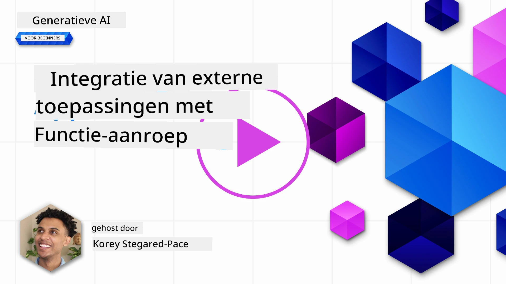
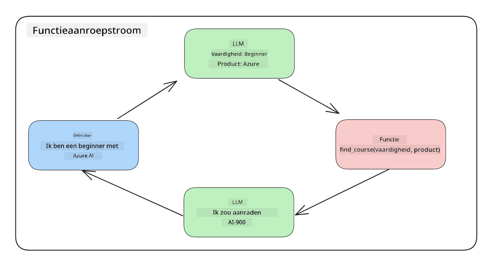
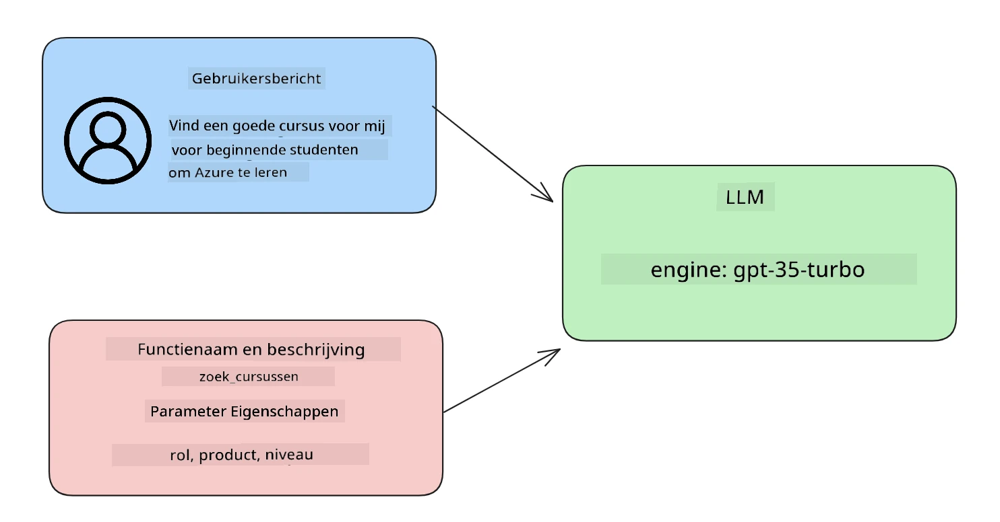

# Integratie met functie-aanroepen

[](https://youtu.be/DgUdCLX8qYQ?si=f1ouQU5HQx6F8Gl2)

Je hebt tot nu toe al heel wat geleerd in de vorige lessen. Toch kunnen we het verder verbeteren. Sommige zaken die we kunnen aanpakken zijn hoe we een meer consistente antwoordindeling kunnen krijgen, zodat het eenvoudiger wordt om met het antwoord verder te werken. Ook willen we misschien gegevens uit andere bronnen toevoegen om onze applicatie verder te verrijken.

De hierboven genoemde problemen zijn wat dit hoofdstuk probeert aan te pakken.

## Introductie

Deze les behandelt:

- Uitleg wat functie-aanroepen zijn en hun gebruikssituaties.
- Het maken van een functie-aanroep met Azure OpenAI.
- Hoe een functie-aanroep te integreren in een applicatie.

## Leerdoelen

Aan het einde van deze les kun je:

- Het doel van functie-aanroepen uitleggen.
- Een functie-aanroep opzetten met de Azure OpenAI Service.
- Effectieve functie-aanroepen ontwerpen voor je applicatie.

## Scenario: Onze chatbot verbeteren met functies

Voor deze les willen we een functie bouwen voor onze educatieve startup waarmee gebruikers een chatbot kunnen gebruiken om technische cursussen te vinden. We zullen cursussen aanbevelen die passen bij hun vaardigheidsniveau, huidige rol en interesse in technologie.

Om dit scenario te voltooien, gebruiken we een combinatie van:

- `Azure OpenAI` om een chatervaring voor de gebruiker te creëren.
- `Microsoft Learn Catalog API` om gebruikers te helpen cursussen te vinden op basis van hun verzoek.
- `Functie-aanroepen` om de query van de gebruiker naar een functie te sturen die de API-aanroep maakt.

Laten we eerst bekijken waarom we functie-aanroepen willen gebruiken:

## Waarom Functie-aanroepen

Voor functie-aanroepen waren antwoorden van een LLM ongestructureerd en inconsistent. Ontwikkelaars moesten complexe validatiecode schrijven om alle variaties van een antwoord te kunnen afhandelen. Gebruikers konden geen antwoorden krijgen op vragen als "Wat is het huidige weer in Stockholm?". Dit komt omdat modellen beperkt waren tot de tijd waarop de data getraind was.

Functie-aanroepen zijn een functie van de Azure OpenAI Service om de volgende beperkingen te overwinnen:

- **Consistente antwoordindeling**. Als we de antwoordindeling beter kunnen beheersen, kunnen we het antwoord makkelijker integreren in andere systemen.
- **Externe data**. Mogelijkheid om data uit andere bronnen van een applicatie te gebruiken in een chatcontext.

## Het probleem illustreren aan de hand van een scenario

> We raden aan de [meegeleverde notebook](./python/aoai-assignment.ipynb?WT.mc_id=academic-105485-koreyst) te gebruiken als je het onderstaande scenario wilt uitvoeren. Je kunt ook alleen meelezen terwijl we een probleem illustreren waarbij functies kunnen helpen.

Laten we kijken naar het voorbeeld dat het probleem van de antwoordindeling illustreert:

Stel je voor dat we een database van studentgegevens willen maken zodat we de juiste cursus kunnen aanbevelen. Hieronder staan twee omschrijvingen van studenten die erg lijken wat betreft de gegevens die ze bevatten.

1. Maak een verbinding met onze Azure OpenAI resource:

   ```python
   import os
   import json
   from openai import OpenAI
   from dotenv import load_dotenv
   load_dotenv()

   # De Responses API wordt bediend vanaf de Azure OpenAI (Microsoft Foundry) v1
   # endpoint, dus we richten de OpenAI-client op <your-endpoint>/openai/v1/.
   endpoint = os.environ['AZURE_OPENAI_ENDPOINT']
   client = OpenAI(
   api_key=os.environ['AZURE_OPENAI_API_KEY'],
   base_url=f"{endpoint.rstrip('/')}/openai/v1/",
   )

   deployment=os.environ['AZURE_OPENAI_DEPLOYMENT']
   ```

   Hieronder staat Python-code om onze verbinding met Azure OpenAI te configureren. Omdat we de v1 endpoint gebruiken, hoeven we alleen de `api_key` en `base_url` in te stellen (geen `api_version` nodig).

1. Maak twee studentbeschrijvingen met de variabelen `student_1_description` en `student_2_description`.

   ```python
   student_1_description="Emily Johnson is a sophomore majoring in computer science at Duke University. She has a 3.7 GPA. Emily is an active member of the university's Chess Club and Debate Team. She hopes to pursue a career in software engineering after graduating."

   student_2_description = "Michael Lee is a sophomore majoring in computer science at Stanford University. He has a 3.8 GPA. Michael is known for his programming skills and is an active member of the university's Robotics Club. He hopes to pursue a career in artificial intelligence after finishing his studies."
   ```

   We willen bovenstaande studentbeschrijvingen naar een LLM sturen om de data te ontleden. Deze data kan later in onze applicatie worden gebruikt, of naar een API worden gestuurd of opgeslagen in een database.

1. Laten we twee identieke prompts maken waarin we de LLM instrueren welke informatie we willen:

   ```python
   prompt1 = f'''
   Please extract the following information from the given text and return it as a JSON object:

   name
   major
   school
   grades
   club

   This is the body of text to extract the information from:
   {student_1_description}
   '''

   prompt2 = f'''
   Please extract the following information from the given text and return it as a JSON object:

   name
   major
   school
   grades
   club

   This is the body of text to extract the information from:
   {student_2_description}
   '''
   ```

   De bovenstaande prompts instrueren de LLM om informatie te extraheren en het antwoord in JSON-formaat te geven.

1. Na het opzetten van de prompts en de verbinding met Azure OpenAI, sturen we de prompts naar de LLM met `client.responses.create`. We slaan de prompt op in de variabele `input` en de rol wordt `user`. Dit bootst een bericht van een gebruiker naar een chatbot na.

   ```python
   # reactie van prompt een
   openai_response1 = client.responses.create(
   model=deployment,
   input = [{'role': 'user', 'content': prompt1}],
   store=False,
   )
   openai_response1.output_text

   # reactie van prompt twee
   openai_response2 = client.responses.create(
   model=deployment,
   input = [{'role': 'user', 'content': prompt2}],
   store=False,
   )
   openai_response2.output_text
   ```

Nu kunnen we beide verzoeken naar de LLM sturen en het antwoord bekijken met `openai_response1.output_text`.

1. Tot slot kunnen we het antwoord converteren naar JSON met `json.loads`:

   ```python
   # De respons laden als een JSON-object
   json_response1 = json.loads(openai_response1.output_text)
   json_response1
   ```

   Antwoord 1:

   ```json
   {
     "name": "Emily Johnson",
     "major": "computer science",
     "school": "Duke University",
     "grades": "3.7",
     "club": "Chess Club"
   }
   ```

   Antwoord 2:

   ```json
   {
     "name": "Michael Lee",
     "major": "computer science",
     "school": "Stanford University",
     "grades": "3.8 GPA",
     "club": "Robotics Club"
   }
   ```

   Hoewel de prompts hetzelfde zijn en de beschrijvingen vergelijkbaar, zien we dat de waarden van de eigenschap `Grades` anders zijn geformatteerd, bijvoorbeeld soms als `3.7` of `3.7 GPA`.

   Dit resultaat komt doordat de LLM ongestructureerde data in de vorm van de geschreven prompt ontvangt en ook ongestructureerde data terugstuurt. We hebben een gestructureerd formaat nodig, zodat we weten wat we kunnen verwachten bij het opslaan of gebruiken van deze data.

Dus hoe lossen we het op met het formatprobleem? Door functie-aanroepen kunnen we ervoor zorgen dat we gestructureerde data terugkrijgen. Bij functie-aanroepen roept de LLM geen functies aan of voert ze uit. In plaats daarvan creëren we een structuur waar de LLM zich aan moet houden voor zijn antwoorden. We gebruiken deze gestructureerde antwoorden vervolgens om te bepalen welke functies we in onze applicaties moeten aanroepen.



We kunnen dan nemen wat er uit de functie komt en dit terugsturen naar de LLM. De LLM zal vervolgens in natuurlijke taal reageren op de vraag van de gebruiker.

## Gebruikssituaties voor functie-aanroepen

Er zijn veel verschillende situaties waarin functie-aanroepen je app kunnen verbeteren, zoals:

- **Externe tools aanroepen**. Chatbots zijn prima in het geven van antwoorden op vragen van gebruikers. Door functie-aanroepen te gebruiken kunnen chatbots berichten van gebruikers gebruiken om bepaalde taken uit te voeren. Bijvoorbeeld kan een student de chatbot vragen "Stuur een email naar mijn docent dat ik meer hulp nodig heb bij dit vak". Dit kan een functie-aanroep maken naar `send_email(to: string, body: string)`

- **API of database queries maken**. Gebruikers kunnen informatie vinden met natuurlijke taal die wordt omgezet in een geformatteerde query of API-aanroep. Bijvoorbeeld een docent die vraagt "Wie zijn de studenten die de laatste opdracht hebben afgerond" wat een functie-aanroep kan zijn `get_completed(student_name: string, assignment: int, current_status: string)`

- **Gestructureerde data creëren**. Gebruikers kunnen een tekstblok of CSV gebruiken en de LLM gebruiken om belangrijke informatie eruit te halen. Bijvoorbeeld een student kan een Wikipedia-artikel over vredesakkoorden converteren om AI-flashcards te maken. Dit kan door een functie te gebruiken `get_important_facts(agreement_name: string, date_signed: string, parties_involved: list)`

## Je eerste functie-aanroep maken

Het proces van het maken van een functie-aanroep bestaat uit 3 stappen:

1. **Aanroepen** van de Responses API met een lijst van je functies (tools) en een gebruikersbericht.
2. **Lezen** van het modelantwoord om een actie uit te voeren, bijvoorbeeld het aanroepen van een functie of API.
3. **Een nieuwe oproep doen** naar de Responses API met het antwoord van je functie om een antwoord aan de gebruiker te maken.



### Stap 1 - berichten maken

De eerste stap is een gebruikersbericht maken. Dit kan dynamisch worden toegewezen door een tekstinput te gebruiken of je kunt hier een waarde toewijzen. Als dit je eerste keer is met de Responses API, moeten we de `rol` en `inhoud` van het bericht definiëren.

De `rol` kan `system` (regels maken), `assistant` (het model) of `user` (de eindgebruiker) zijn. Voor functie-aanroepen wijzen we dit toe als `user` met een voorbeeldvraag.

```python
messages= [ {"role": "user", "content": "Find me a good course for a beginner student to learn Azure."} ]
```

Door verschillende rollen toe te wijzen wordt het voor de LLM duidelijk of het een bericht van het systeem of de gebruiker is, wat helpt om een gesprekshistorie op te bouwen waarop de LLM kan voortbouwen.

### Stap 2 - functies maken

Vervolgens definiëren we een functie en de parameters daarvan. We gebruiken hier slechts één functie genaamd `search_courses`, maar je kunt meerdere functies maken.

> **Belangrijk** : Functies worden opgenomen in het systeembericht naar de LLM en tellen mee voor het aantal beschikbare tokens.

Hieronder maken we de functies als array van items. Elk item is een tool in de platte Responses API-formaat, met eigenschappen `type`, `name`, `description` en `parameters`:

```python
functions = [
   {
      "type":"function",
      "name":"search_courses",
      "description":"Retrieves courses from the search index based on the parameters provided",
      "parameters":{
         "type":"object",
         "properties":{
            "role":{
               "type":"string",
               "description":"The role of the learner (i.e. developer, data scientist, student, etc.)"
            },
            "product":{
               "type":"string",
               "description":"The product that the lesson is covering (i.e. Azure, Power BI, etc.)"
            },
            "level":{
               "type":"string",
               "description":"The level of experience the learner has prior to taking the course (i.e. beginner, intermediate, advanced)"
            }
         },
         "required":[
            "role"
         ]
      }
   }
]
```

Laten we elke functie-instantie hieronder meer in detail beschrijven:

- `name` - De naam van de functie die we willen aanroepen.
- `description` - De beschrijving van hoe de functie werkt. Dit moet specifiek en duidelijk zijn.
- `parameters` - Een lijst van waarden en het formaat dat je wilt dat het model produceert in het antwoord. De parameters-array bestaat uit items met de volgende eigenschappen:
  1.  `type` - Het datatypes waarin de eigenschappen opgeslagen worden.
  1.  `properties` - Lijst van specifieke waarden die het model gebruikt voor het antwoord
      1. `name` - De sleutel is de naam van de eigenschap die het model gebruikt in het geformatteerde antwoord, bijvoorbeeld `product`.
      1. `type` - Het datatype van deze eigenschap, bijvoorbeeld `string`.
      1. `description` - Beschrijving van de specifieke eigenschap.

Er is ook een optionele eigenschap `required` - verplichte eigenschap om de functie-aanroep te voltooien.

### Stap 3 - Een functie-aanroep maken

Nadat we een functie hebben gedefinieerd moeten we die opnemen in de oproep aan de Responses API. Dit doen we door `tools` toe te voegen aan het verzoek. In dit geval `tools=functions`.

Er is ook een optie om `tool_choice` in te stellen op `auto`. Dat betekent dat we de LLM laten beslissen welke functie aangeroepen moet worden aan de hand van het gebruikersbericht in plaats van dat wij dat zelf doen.

Hieronder staat code waarin we `client.responses.create` aanroepen, let op hoe we `tools=functions` en `tool_choice="auto"` instellen en de LLM daarmee de keuze geven wanneer functies aangeroepen worden:

```python
response = client.responses.create(model=deployment,
                                        input=messages,
                                        tools=functions,
                                        tool_choice="auto",
                                        store=False)

print(response.output)
```

Het antwoord dat terugkomt bevat nu een `function_call` item in `response.output` dat er zo uitziet:

```json
{
  "type": "function_call",
  "name": "search_courses",
  "call_id": "call_abc123",
  "arguments": "{\n  \"role\": \"student\",\n  \"product\": \"Azure\",\n  \"level\": \"beginner\"\n}"
}
```

Hier zien we hoe de functie `search_courses` werd aangeroepen en met welke argumenten, zoals vermeld in de `arguments` eigenschap van het JSON antwoord.

De conclusie is dat de LLM de data kon vinden die bij de argumenten van de functie past omdat hij deze extracteerde uit de waarde die aan de `input` parameter in de Responses API-oproep was meegegeven. Hieronder staat nogmaals de waarde van `messages`:

```python
messages= [ {"role": "user", "content": "Find me a good course for a beginner student to learn Azure."} ]
```

Zoals je ziet, werden `student`, `Azure` en `beginner` uit `messages` gehaald en als input aan de functie doorgegeven. Functies op deze manier gebruiken is een geweldige methode om informatie uit een prompt te halen en tegelijkertijd structuur te geven aan de LLM en herbruikbare functionaliteit te creëren.

Nu moeten we bekijken hoe we dit in onze app kunnen gebruiken.

## Functie-aanroepen integreren in een applicatie

Nadat we het geformatteerde antwoord van de LLM hebben getest kunnen we dit nu integreren in een applicatie.

### De flow beheren

Om dit in onze applicatie te integreren nemen we de volgende stappen:

1. Maak eerst de oproep aan de OpenAI services en haal de functie-aanroepitems uit het antwoord `output`.

   ```python
   response_items = response.output
   tool_calls = [item for item in response_items if item.type == "function_call"]
   ```

1. Definieer nu de functie die de Microsoft Learn API zal aanroepen om een lijst met cursussen te krijgen:

   ```python
   import requests

   def search_courses(role, product, level):
     url = "https://learn.microsoft.com/api/catalog/"
     params = {
        "role": role,
        "product": product,
        "level": level
     }
     response = requests.get(url, params=params)
     modules = response.json()["modules"]
     results = []
     for module in modules[:5]:
        title = module["title"]
        url = module["url"]
        results.append({"title": title, "url": url})
     return str(results)
   ```

   Let op dat we nu een daadwerkelijke Python-functie maken die overeenkomt met de functienamen in de `functions` variabele. We maken ook echte externe API-aanroepen om de benodigde data op te halen. In dit geval doen we een zoekopdracht tegen de Microsoft Learn API.

Oké, we maakten de variabele `functions` en een bijbehorende Python-functie, hoe vertellen we de LLM hoe deze twee gekoppeld worden zodat onze Python-functie wordt aangeroepen?

1. Om te zien of we een Python-functie moeten aanroepen, moeten we in het LLM-antwoord kijken of een `function_call` item deel is van het antwoord en dan de aangegeven functie aanroepen. Hieronder zie je hoe je deze check kunt uitvoeren:

   ```python
   # Controleer of het model een functie wil aanroepen
   if tool_calls:
    for tool_call in tool_calls:
     print("Recommended Function call:")
     print(tool_call.name)
     print()

     # Roep de functie aan.
     function_name = tool_call.name

     available_functions = {
             "search_courses": search_courses,
     }
     function_to_call = available_functions[function_name]

     function_args = json.loads(tool_call.arguments)
     function_response = function_to_call(**function_args)

     print("Output of function call:")
     print(function_response)
     print(type(function_response))

     # Voeg de functieaanroep en het resultaat terug toe aan het gesprek.
     # Het function_call-item van het model moet vóór de uitvoer worden toegevoegd.
     messages.append(tool_call)  # het function_call-item van de assistent
     messages.append( # het functieresultaat
         {
             "type": "function_call_output",
             "call_id": tool_call.call_id,
             "output": function_response,
         }
     )
   ```

   Deze drie regels zorgen ervoor dat we de functienaam, de argumenten extraheren en de oproep doen:

   ```python
   function_to_call = available_functions[function_name]

   function_args = json.loads(tool_call.arguments)
   function_response = function_to_call(**function_args)
   ```

   Hieronder de output van het uitvoeren van onze code:

   **Uitvoer**

   ```Recommended Function call:
   {
     "name": "search_courses",
     "arguments": "{\n  \"role\": \"student\",\n  \"product\": \"Azure\",\n  \"level\": \"beginner\"\n}"
   }

   Output of function call:
   [{'title': 'Describe concepts of cryptography', 'url': 'https://learn.microsoft.com/training/modules/describe-concepts-of-cryptography/?
   WT.mc_id=api_CatalogApi'}, {'title': 'Introduction to audio classification with TensorFlow', 'url': 'https://learn.microsoft.com/en-
   us/training/modules/intro-audio-classification-tensorflow/?WT.mc_id=api_CatalogApi'}, {'title': 'Design a Performant Data Model in Azure SQL
   Database with Azure Data Studio', 'url': 'https://learn.microsoft.com/training/modules/design-a-data-model-with-ads/?
   WT.mc_id=api_CatalogApi'}, {'title': 'Getting started with the Microsoft Cloud Adoption Framework for Azure', 'url':
   'https://learn.microsoft.com/training/modules/cloud-adoption-framework-getting-started/?WT.mc_id=api_CatalogApi'}, {'title': 'Set up the
   Rust development environment', 'url': 'https://learn.microsoft.com/training/modules/rust-set-up-environment/?WT.mc_id=api_CatalogApi'}]
   <class 'str'>
   ```

1. We sturen nu het geüpdatete bericht `messages` naar de LLM zodat we een antwoord in natuurlijke taal kunnen krijgen in plaats van een API JSON-formaat.

   ```python
   print("Messages in next request:")
   print(messages)
   print()

   second_response = client.responses.create(
      input=messages,
      model=deployment,
      tool_choice="auto",
      tools=functions,
      temperature=0,
      store=False,
         )  # krijg een nieuw antwoord van het model waar het de functierespons kan zien


   print(second_response.output_text)
   ```

   **Uitvoer**

   ```text
   I found some good courses for beginner students to learn Azure:

   1. [Describe concepts of cryptography](https://learn.microsoft.com/training/modules/describe-concepts-of-cryptography/?WT.mc_id=api_CatalogApi)
   2. [Introduction to audio classification with TensorFlow](https://learn.microsoft.com/training/modules/intro-audio-classification-tensorflow/?WT.mc_id=api_CatalogApi)
   3. [Design a Performant Data Model in Azure SQL Database with Azure Data Studio](https://learn.microsoft.com/training/modules/design-a-data-model-with-ads/?WT.mc_id=api_CatalogApi)
   4. [Getting started with the Microsoft Cloud Adoption Framework for Azure](https://learn.microsoft.com/training/modules/cloud-adoption-framework-getting-started/?WT.mc_id=api_CatalogApi)
   5. [Set up the Rust development environment](https://learn.microsoft.com/training/modules/rust-set-up-environment/?WT.mc_id=api_CatalogApi)

   You can click on the links to access the courses.
   ```

## Opdracht

Om je leren over Azure OpenAI Functie-aanroepen voort te zetten, kun je bouwen aan:

- Meer parameters van de functie die mogelijk helpen om meer cursussen te vinden.

- Maak een andere functieaanroep die meer informatie van de leerling vraagt, zoals hun moedertaal
- Maak foutafhandeling wanneer de functieaanroep en/of API-aanroep geen geschikte cursussen retourneert

Hint: Volg de [Learn API referentiedocumentatie](https://learn.microsoft.com/training/support/catalog-api-developer-reference?WT.mc_id=academic-105485-koreyst) pagina om te zien hoe en waar deze data beschikbaar is.

## Geweldig werk! Ga door met de reis

Na het voltooien van deze les, kun je onze [Generative AI Learning-collectie](https://aka.ms/genai-collection?WT.mc_id=academic-105485-koreyst) bekijken om je kennis van Generatieve AI verder te verdiepen!

Ga naar Les 12, waar we zullen bekijken hoe je [UX ontwerpt voor AI-applicaties](../12-designing-ux-for-ai-applications/README.md?WT.mc_id=academic-105485-koreyst)!

---

<!-- CO-OP TRANSLATOR DISCLAIMER START -->
**Disclaimer**:
Dit document is vertaald met behulp van de AI vertaaldienst [Co-op Translator](https://github.com/Azure/co-op-translator). Hoewel we streven naar nauwkeurigheid, dient u er rekening mee te houden dat geautomatiseerde vertalingen fouten of onnauwkeurigheden kunnen bevatten. Het originele document in de oorspronkelijke taal moet worden beschouwd als de gezaghebbende bron. Voor kritieke informatie wordt professionele menselijke vertaling aanbevolen. Wij zijn niet aansprakelijk voor eventuele misverstanden of verkeerde interpretaties die voortvloeien uit het gebruik van deze vertaling.
<!-- CO-OP TRANSLATOR DISCLAIMER END -->