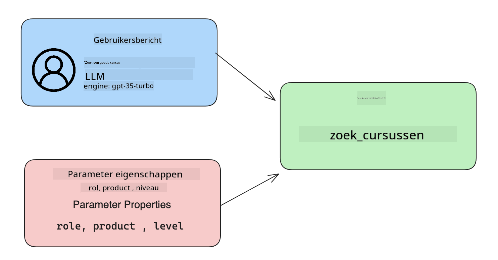

<!--
CO_OP_TRANSLATOR_METADATA:
{
  "original_hash": "77a48a201447be19aa7560706d6f93a0",
  "translation_date": "2025-07-09T14:37:25+00:00",
  "source_file": "11-integrating-with-function-calling/README.md",
  "language_code": "nl"
}
-->
# Integreren met function calling

[](https://aka.ms/gen-ai-lesson11-gh?WT.mc_id=academic-105485-koreyst)

Je hebt tot nu toe al het een en ander geleerd in de vorige lessen. Toch kunnen we nog verder verbeteren. Een aantal punten die we kunnen aanpakken zijn hoe we een meer consistente responsindeling kunnen krijgen, zodat het makkelijker wordt om met de respons verder te werken. Ook willen we misschien data uit andere bronnen toevoegen om onze applicatie verder te verrijken.

De hierboven genoemde problemen zijn wat dit hoofdstuk wil aanpakken.

## Introductie

Deze les behandelt:

- Uitleg over wat function calling is en de toepassingsmogelijkheden.
- Het maken van een function call met Azure OpenAI.
- Hoe je een function call integreert in een applicatie.

## Leerdoelen

Aan het einde van deze les kun je:

- Uitleggen waarom je function calling gebruikt.
- Function Call instellen met de Azure OpenAI Service.
- Effectieve function calls ontwerpen voor jouw applicatie.

## Scenario: Onze chatbot verbeteren met functies

Voor deze les willen we een functie bouwen voor onze educatieve startup waarmee gebruikers via een chatbot technische cursussen kunnen vinden. We zullen cursussen aanbevelen die passen bij hun vaardigheidsniveau, huidige rol en interesse in technologie.

Om dit scenario te voltooien gebruiken we een combinatie van:

- `Azure OpenAI` om een chatervaring voor de gebruiker te creëren.
- `Microsoft Learn Catalog API` om gebruikers te helpen cursussen te vinden op basis van hun verzoek.
- `Function Calling` om de vraag van de gebruiker te verwerken en naar een functie te sturen die de API-aanvraag doet.

Laten we eerst kijken waarom we function calling überhaupt willen gebruiken:

## Waarom Function Calling

Voor function calling waren de antwoorden van een LLM ongestructureerd en inconsistent. Ontwikkelaars moesten complexe validatiecode schrijven om elke variatie van een antwoord te kunnen verwerken. Gebruikers konden geen antwoorden krijgen op vragen als "Wat is het huidige weer in Stockholm?". Dit komt omdat modellen beperkt waren tot de data waarop ze getraind waren.

Function Calling is een functie van de Azure OpenAI Service om de volgende beperkingen te overwinnen:

- **Consistente responsindeling**. Als we de responsindeling beter kunnen beheersen, kunnen we de respons makkelijker integreren in andere systemen.
- **Externe data**. Mogelijkheid om data uit andere bronnen van een applicatie te gebruiken in een chatcontext.

## Het probleem illustreren met een scenario

> We raden aan om de [meegeleverde notebook](../../../11-integrating-with-function-calling/python/aoai-assignment.ipynb) te gebruiken als je het onderstaande scenario wilt uitvoeren. Je kunt ook gewoon meelezen terwijl we proberen een probleem te illustreren waarbij functies kunnen helpen.

Laten we kijken naar een voorbeeld dat het probleem met de responsindeling laat zien:

Stel dat we een database willen maken met studentgegevens zodat we de juiste cursus kunnen aanbevelen. Hieronder staan twee beschrijvingen van studenten die erg op elkaar lijken qua data.

1. Maak een verbinding met onze Azure OpenAI resource:

   ```python
   import os
   import json
   from openai import AzureOpenAI
   from dotenv import load_dotenv
   load_dotenv()

   client = AzureOpenAI(
   api_key=os.environ['AZURE_OPENAI_API_KEY'],  # this is also the default, it can be omitted
   api_version = "2023-07-01-preview"
   )

   deployment=os.environ['AZURE_OPENAI_DEPLOYMENT']
   ```

   Hieronder staat wat Python-code om onze verbinding met Azure OpenAI te configureren, waarbij we `api_type`, `api_base`, `api_version` en `api_key` instellen.

1. Maak twee studentbeschrijvingen met de variabelen `student_1_description` en `student_2_description`.

   ```python
   student_1_description="Emily Johnson is a sophomore majoring in computer science at Duke University. She has a 3.7 GPA. Emily is an active member of the university's Chess Club and Debate Team. She hopes to pursue a career in software engineering after graduating."

   student_2_description = "Michael Lee is a sophomore majoring in computer science at Stanford University. He has a 3.8 GPA. Michael is known for his programming skills and is an active member of the university's Robotics Club. He hopes to pursue a career in artificial intelligence after finishing his studies."
   ```

   We willen de bovenstaande studentbeschrijvingen naar een LLM sturen om de data te parseren. Deze data kan later in onze applicatie worden gebruikt, naar een API worden gestuurd of in een database worden opgeslagen.

1. Laten we twee identieke prompts maken waarin we de LLM instrueren welke informatie we willen:

   ```python
   prompt1 = f'''
   Please extract the following information from the given text and return it as a JSON object:

   name
   major
   school
   grades
   club

   This is the body of text to extract the information from:
   {student_1_description}
   '''

   prompt2 = f'''
   Please extract the following information from the given text and return it as a JSON object:

   name
   major
   school
   grades
   club

   This is the body of text to extract the information from:
   {student_2_description}
   '''
   ```

   De bovenstaande prompts instrueren de LLM om informatie te extraheren en de respons in JSON-formaat terug te geven.

1. Na het instellen van de prompts en de verbinding met Azure OpenAI, sturen we nu de prompts naar de LLM met `openai.ChatCompletion`. We slaan de prompt op in de variabele `messages` en geven de rol `user` mee. Dit bootst een bericht van een gebruiker naar een chatbot na.

   ```python
   # response from prompt one
   openai_response1 = client.chat.completions.create(
   model=deployment,
   messages = [{'role': 'user', 'content': prompt1}]
   )
   openai_response1.choices[0].message.content

   # response from prompt two
   openai_response2 = client.chat.completions.create(
   model=deployment,
   messages = [{'role': 'user', 'content': prompt2}]
   )
   openai_response2.choices[0].message.content
   ```

Nu kunnen we beide verzoeken naar de LLM sturen en de respons bekijken door deze op te halen met `openai_response1['choices'][0]['message']['content']`.

1. Tot slot kunnen we de respons omzetten naar JSON-formaat met `json.loads`:

   ```python
   # Loading the response as a JSON object
   json_response1 = json.loads(openai_response1.choices[0].message.content)
   json_response1
   ```

   Respons 1:

   ```json
   {
     "name": "Emily Johnson",
     "major": "computer science",
     "school": "Duke University",
     "grades": "3.7",
     "club": "Chess Club"
   }
   ```

   Respons 2:

   ```json
   {
     "name": "Michael Lee",
     "major": "computer science",
     "school": "Stanford University",
     "grades": "3.8 GPA",
     "club": "Robotics Club"
   }
   ```

   Hoewel de prompts hetzelfde zijn en de beschrijvingen vergelijkbaar, zien we dat de waarden van de eigenschap `Grades` verschillend zijn geformatteerd, bijvoorbeeld `3.7` of `3.7 GPA`.

   Dit resultaat komt doordat de LLM ongestructureerde data in de vorm van de geschreven prompt neemt en ook ongestructureerde data teruggeeft. We hebben een gestructureerd formaat nodig zodat we weten wat we kunnen verwachten bij het opslaan of gebruiken van deze data.

Hoe lossen we het formatteringsprobleem dan op? Door function calling te gebruiken, kunnen we ervoor zorgen dat we gestructureerde data terugkrijgen. Bij function calling roept de LLM zelf geen functies aan of voert ze uit. In plaats daarvan creëren we een structuur waar de LLM zich aan houdt in zijn antwoorden. We gebruiken die gestructureerde antwoorden vervolgens om te bepalen welke functie we in onze applicaties moeten aanroepen.


We kunnen dan de output van de functie terugsturen naar de LLM. De LLM zal vervolgens in natuurlijke taal reageren om de vraag van de gebruiker te beantwoorden.

## Toepassingen van function calls

Er zijn veel verschillende toepassingen waarbij function calls je app kunnen verbeteren, zoals:

- **Aanroepen van externe tools**. Chatbots zijn goed in het geven van antwoorden op vragen van gebruikers. Door function calling te gebruiken, kunnen chatbots berichten van gebruikers gebruiken om bepaalde taken uit te voeren. Bijvoorbeeld, een student kan de chatbot vragen: "Stuur een e-mail naar mijn docent dat ik meer hulp nodig heb bij dit vak". Dit kan een function call doen naar `send_email(to: string, body: string)`.

- **API- of databasequery's maken**. Gebruikers kunnen informatie vinden met natuurlijke taal die wordt omgezet in een geformatteerde query of API-aanvraag. Een voorbeeld is een docent die vraagt: "Wie hebben de laatste opdracht ingeleverd?" wat een functie kan aanroepen genaamd `get_completed(student_name: string, assignment: int, current_status: string)`.

- **Gestructureerde data creëren**. Gebruikers kunnen een tekstblok of CSV gebruiken en de LLM laten belangrijke informatie eruit halen. Bijvoorbeeld, een student kan een Wikipedia-artikel over vredesakkoorden omzetten in AI-flashcards. Dit kan met een functie `get_important_facts(agreement_name: string, date_signed: string, parties_involved: list)`.

## Je eerste function call maken

Het proces van het maken van een function call bestaat uit 3 hoofd stappen:

1. **Aanroepen** van de Chat Completions API met een lijst van je functies en een gebruikersbericht.
2. **Lezen** van de respons van het model om een actie uit te voeren, bijvoorbeeld een functie of API-aanroep.
3. **Nog een keer aanroepen** van de Chat Completions API met de respons van je functie om die informatie te gebruiken om een antwoord aan de gebruiker te maken.



### Stap 1 - berichten maken

De eerste stap is het maken van een gebruikersbericht. Dit kan dynamisch worden toegewezen door de waarde van een tekstinvoer te nemen, of je kunt hier een waarde toewijzen. Als dit je eerste keer is met de Chat Completions API, moeten we de `role` en de `content` van het bericht definiëren.

De `role` kan `system` zijn (regels maken), `assistant` (het model) of `user` (de eindgebruiker). Voor function calling geven we dit de rol `user` met een voorbeeldvraag.

```python
messages= [ {"role": "user", "content": "Find me a good course for a beginner student to learn Azure."} ]
```

Door verschillende rollen toe te wijzen, is het voor de LLM duidelijk of het systeem iets zegt of de gebruiker, wat helpt bij het opbouwen van een gespreksgeschiedenis waar de LLM op kan voortbouwen.

### Stap 2 - functies maken

Vervolgens definiëren we een functie en de parameters daarvan. We gebruiken hier één functie genaamd `search_courses`, maar je kunt meerdere functies maken.

> **Belangrijk**: Functies worden opgenomen in het systeembericht naar de LLM en tellen mee in het aantal beschikbare tokens.

Hieronder maken we de functies als een array van items. Elk item is een functie met de eigenschappen `name`, `description` en `parameters`:

```python
functions = [
   {
      "name":"search_courses",
      "description":"Retrieves courses from the search index based on the parameters provided",
      "parameters":{
         "type":"object",
         "properties":{
            "role":{
               "type":"string",
               "description":"The role of the learner (i.e. developer, data scientist, student, etc.)"
            },
            "product":{
               "type":"string",
               "description":"The product that the lesson is covering (i.e. Azure, Power BI, etc.)"
            },
            "level":{
               "type":"string",
               "description":"The level of experience the learner has prior to taking the course (i.e. beginner, intermediate, advanced)"
            }
         },
         "required":[
            "role"
         ]
      }
   }
]
```

Laten we elke functie-instantie hieronder wat gedetailleerder beschrijven:

- `name` - De naam van de functie die we willen aanroepen.
- `description` - Een beschrijving van hoe de functie werkt. Hier is het belangrijk om specifiek en duidelijk te zijn.
- `parameters` - Een lijst van waarden en het formaat dat je wilt dat het model in zijn respons gebruikt. De parameters-array bestaat uit items met de volgende eigenschappen:
  1.  `type` - Het datatype waarin de eigenschappen worden opgeslagen.
  1.  `properties` - Lijst van specifieke waarden die het model gebruikt in zijn respons
      1. `name` - De sleutel is de naam van de eigenschap die het model gebruikt in het geformatteerde antwoord, bijvoorbeeld `product`.
      1. `type` - Het datatype van deze eigenschap, bijvoorbeeld `string`.
      1. `description` - Beschrijving van de specifieke eigenschap.

Er is ook een optionele eigenschap `required` - verplichte eigenschap voor het voltooien van de function call.

### Stap 3 - De function call maken

Na het definiëren van een functie moeten we deze opnemen in de aanroep naar de Chat Completion API. Dit doen we door `functions` toe te voegen aan het verzoek. In dit geval `functions=functions`.

Er is ook een optie om `function_call` op `auto` te zetten. Dit betekent dat we de LLM laten bepalen welke functie moet worden aangeroepen op basis van het gebruikersbericht, in plaats van dit zelf toe te wijzen.

Hieronder staat wat code waarin we `ChatCompletion.create` aanroepen, let op hoe we `functions=functions` en `function_call="auto"` instellen, waardoor de LLM zelf kan kiezen wanneer de functies worden aangeroepen:

```python
response = client.chat.completions.create(model=deployment,
                                        messages=messages,
                                        functions=functions,
                                        function_call="auto")

print(response.choices[0].message)
```

De respons die nu terugkomt ziet er zo uit:

```json
{
  "role": "assistant",
  "function_call": {
    "name": "search_courses",
    "arguments": "{\n  \"role\": \"student\",\n  \"product\": \"Azure\",\n  \"level\": \"beginner\"\n}"
  }
}
```

Hier zien we hoe de functie `search_courses` werd aangeroepen en met welke argumenten, zoals vermeld in de eigenschap `arguments` in de JSON-respons.

De conclusie is dat de LLM de data kon vinden die past bij de argumenten van de functie, omdat deze werd geëxtraheerd uit de waarde die aan de `messages` parameter in de chat completion call werd meegegeven. Hieronder een herinnering aan de waarde van `messages`:

```python
messages= [ {"role": "user", "content": "Find me a good course for a beginner student to learn Azure."} ]
```

Zoals je ziet, werden `student`, `Azure` en `beginner` uit `messages` gehaald en als input aan de functie gegeven. Functies op deze manier gebruiken is een goede manier om informatie uit een prompt te halen, maar ook om structuur aan de LLM te geven en herbruikbare functionaliteit te creëren.

Vervolgens moeten we kijken hoe we dit in onze app kunnen gebruiken.

## Function Calls integreren in een applicatie

Nadat we de geformatteerde respons van de LLM hebben getest, kunnen we dit nu integreren in een applicatie.

### De flow beheren

Om dit in onze applicatie te integreren, nemen we de volgende stappen:

1. Maak eerst de aanroep naar de OpenAI-services en sla het bericht op in een variabele genaamd `response_message`.

   ```python
   response_message = response.choices[0].message
   ```

1. Definieer nu de functie die de Microsoft Learn API aanroept om een lijst met cursussen op te halen:

   ```python
   import requests

   def search_courses(role, product, level):
     url = "https://learn.microsoft.com/api/catalog/"
     params = {
        "role": role,
        "product": product,
        "level": level
     }
     response = requests.get(url, params=params)
     modules = response.json()["modules"]
     results = []
     for module in modules[:5]:
        title = module["title"]
        url = module["url"]
        results.append({"title": title, "url": url})
     return str(results)
   ```

   Let op dat we nu een echte Python-functie maken die overeenkomt met de functienamen die in de `functions` variabele zijn geïntroduceerd. We doen ook echte externe API-aanroepen om de benodigde data op te halen. In dit geval gebruiken we de Microsoft Learn API om trainingsmodules te zoeken.

Oké, we hebben de `functions` variabele en een bijbehorende Python-functie gemaakt, hoe vertellen we de LLM nu hoe deze twee aan elkaar gekoppeld worden zodat onze Python-functie wordt aangeroepen?

1. Om te zien of we een Python-functie moeten aanroepen, moeten we in de LLM-respons kijken of `function_call` erin staat en dan de aangegeven functie aanroepen. Hieronder zie je hoe je deze check kunt doen:

   ```python
   # Check if the model wants to call a function
   if response_message.function_call.name:
    print("Recommended Function call:")
    print(response_message.function_call.name)
    print()

    # Call the function.
    function_name = response_message.function_call.name

    available_functions = {
            "search_courses": search_courses,
    }
    function_to_call = available_functions[function_name]

    function_args = json.loads(response_message.function_call.arguments)
    function_response = function_to_call(**function_args)

    print("Output of function call:")
    print(function_response)
    print(type(function_response))


    # Add the assistant response and function response to the messages
    messages.append( # adding assistant response to messages
        {
            "role": response_message.role,
            "function_call": {
                "name": function_name,
                "arguments": response_message.function_call.arguments,
            },
            "content": None
        }
    )
    messages.append( # adding function response to messages
        {
            "role": "function",
            "name": function_name,
            "content":function_response,
        }
    )
   ```

   Deze drie regels zorgen ervoor dat we de functienaam, de argumenten extraheren en de functie aanroepen:

   ```python
   function_to_call = available_functions[function_name]

   function_args = json.loads(response_message.function_call.arguments)
   function_response = function_to_call(**function_args)
   ```

   Hieronder staat de output van het uitvoeren van onze code:

   **Output**

   ```Recommended Function call:
   {
     "name": "search_courses",
     "arguments": "{\n  \"role\": \"student\",\n  \"product\": \"Azure\",\n  \"level\": \"beginner\"\n}"
   }

   Output of function call:
   [{'title': 'Describe concepts of cryptography', 'url': 'https://learn.microsoft.com/training/modules/describe-concepts-of-cryptography/?
   WT.mc_id=api_CatalogApi'}, {'title': 'Introduction to audio classification with TensorFlow', 'url': 'https://learn.microsoft.com/en-
   us/training/modules/intro-audio-classification-tensorflow/?WT.mc_id=api_CatalogApi'}, {'title': 'Design a Performant Data Model in Azure SQL
   Database with Azure Data Studio', 'url': 'https://learn.microsoft.com/training/modules/design-a-data-model-with-ads/?
   WT.mc_id=api_CatalogApi'}, {'title': 'Getting started with the Microsoft Cloud Adoption Framework for Azure', 'url':
   'https://learn.microsoft.com/training/modules/cloud-adoption-framework-getting-started/?WT.mc_id=api_CatalogApi'}, {'title': 'Set up the
   Rust development environment', 'url': 'https://learn.microsoft.com/training/modules/rust-set-up-environment/?WT.mc_id=api_CatalogApi'}]
   <class 'str'>
   ```

1. Nu sturen we het bijgewerkte bericht, `messages`, naar de LLM zodat we een antwoord in natuurlijke taal krijgen in plaats van een API JSON-geformatteerd antwoord.

   ```python
   print("Messages in next request:")
   print(messages)
   print()

   second_response = client.chat.completions.create(
      messages=messages,
      model=deployment,
      function_call="auto",
      functions=functions,
      temperature=0
         )  # get a new response from GPT where it can see the function response


   print(second_response.choices[0].message)
   ```

   **Output**

   ```python
   {
     "role": "assistant",
     "content": "I found some good courses for beginner students to learn Azure:\n\n1. [Describe concepts of cryptography] (https://learn.microsoft.com/training/modules/describe-concepts-of-cryptography/?WT.mc_id=api_CatalogApi)\n2. [Introduction to audio classification with TensorFlow](https://learn.microsoft.com/training/modules/intro-audio-classification-tensorflow/?WT.mc_id=api_CatalogApi)\n3. [Design a Performant Data Model in Azure SQL Database with Azure Data Studio](https://learn.microsoft.com/training/modules/design-a-data-model-with-ads/?WT.mc_id=api_CatalogApi)\n4. [Getting started with the Microsoft Cloud Adoption Framework for Azure](https://learn.microsoft.com/training/modules/cloud-adoption-framework-getting-started/?WT.mc_id=api_CatalogApi)\n5. [Set up the Rust development environment](https://learn.microsoft.com/training/modules/rust-set-up-environment/?WT.mc_id=api_CatalogApi)\n\nYou can click on the links to access the courses."
   }

   ```

## Opdracht

Om je kennis van Azure OpenAI Function Calling verder uit te breiden, kun je bouwen aan:

- Meer parameters toevoegen aan de functie die leerlingen kunnen helpen meer cursussen te vinden.
- Een extra function call maken die meer informatie van de leerling vraagt, zoals hun moedertaal.
- Foutafhandeling toevoegen voor het geval de function call en/of API-aanroep geen geschikte cursussen teruggeeft.
## Geweldig werk! Ga door met de reis

Na het voltooien van deze les, bekijk onze [Generative AI Learning collectie](https://aka.ms/genai-collection?WT.mc_id=academic-105485-koreyst) om je kennis van Generative AI verder te vergroten!

Ga naar Les 12, waar we zullen bekijken hoe je [UX ontwerpt voor AI-toepassingen](../12-designing-ux-for-ai-applications/README.md?WT.mc_id=academic-105485-koreyst)!

**Disclaimer**:  
Dit document is vertaald met behulp van de AI-vertalingsdienst [Co-op Translator](https://github.com/Azure/co-op-translator). Hoewel we streven naar nauwkeurigheid, dient u er rekening mee te houden dat geautomatiseerde vertalingen fouten of onnauwkeurigheden kunnen bevatten. Het originele document in de oorspronkelijke taal moet als de gezaghebbende bron worden beschouwd. Voor cruciale informatie wordt professionele menselijke vertaling aanbevolen. Wij zijn niet aansprakelijk voor eventuele misverstanden of verkeerde interpretaties die voortvloeien uit het gebruik van deze vertaling.