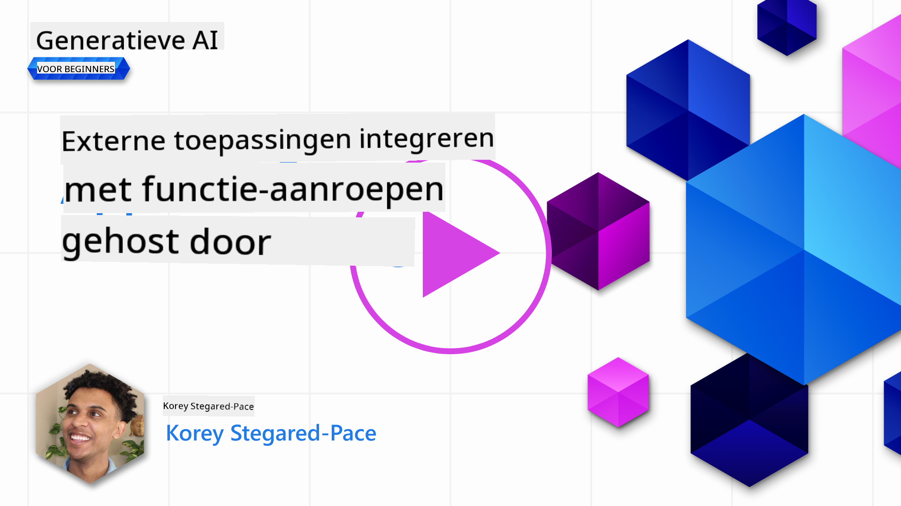

<!--
CO_OP_TRANSLATOR_METADATA:
{
  "original_hash": "f6f84f9ef2d066cd25850cab93580a50",
  "translation_date": "2025-10-17T19:51:58+00:00",
  "source_file": "11-integrating-with-function-calling/README.md",
  "language_code": "nl"
}
-->
# Integreren met functie-aanroepen

[](https://youtu.be/DgUdCLX8qYQ?si=f1ouQU5HQx6F8Gl2)

Je hebt al veel geleerd in de vorige lessen. Maar er is nog ruimte voor verbetering. Enkele zaken die we kunnen aanpakken zijn hoe we een consistenter responsformaat kunnen krijgen, zodat het eenvoudiger wordt om met de respons verder te werken. Ook willen we mogelijk gegevens uit andere bronnen toevoegen om onze applicatie verder te verrijken.

De bovengenoemde problemen zijn wat dit hoofdstuk probeert aan te pakken.

## Introductie

Deze les behandelt:

- Uitleg over wat functie-aanroepen zijn en hun toepassingen.
- Een functie-aanroep maken met Azure OpenAI.
- Hoe een functie-aanroep in een applicatie te integreren.

## Leerdoelen

Aan het einde van deze les kun je:

- Het doel van het gebruik van functie-aanroepen uitleggen.
- Een functie-aanroep instellen met de Azure OpenAI Service.
- Effectieve functie-aanroepen ontwerpen voor het gebruik in jouw applicatie.

## Scenario: Onze chatbot verbeteren met functies

Voor deze les willen we een functie bouwen voor onze educatieve startup waarmee gebruikers een chatbot kunnen gebruiken om technische cursussen te vinden. We zullen cursussen aanbevelen die passen bij hun vaardigheidsniveau, huidige rol en interesse in technologie.

Om dit scenario te voltooien, gebruiken we een combinatie van:

- `Azure OpenAI` om een chatervaring voor de gebruiker te creëren.
- `Microsoft Learn Catalog API` om gebruikers te helpen cursussen te vinden op basis van hun verzoek.
- `Functie-aanroepen` om de vraag van de gebruiker te verwerken en door te sturen naar een functie die de API-aanroep uitvoert.

Laten we beginnen met te kijken waarom we überhaupt functie-aanroepen zouden willen gebruiken:

## Waarom functie-aanroepen?

Voor de introductie van functie-aanroepen waren de antwoorden van een LLM ongestructureerd en inconsistent. Ontwikkelaars moesten complexe validatiecode schrijven om ervoor te zorgen dat ze elke variatie van een antwoord konden verwerken. Gebruikers konden geen antwoorden krijgen op vragen zoals "Wat is het huidige weer in Stockholm?". Dit komt omdat modellen beperkt waren tot de tijd waarin de gegevens werden getraind.

Functie-aanroepen zijn een functie van de Azure OpenAI Service om de volgende beperkingen te overwinnen:

- **Consistent responsformaat**. Als we het responsformaat beter kunnen beheersen, kunnen we de respons eenvoudiger integreren in andere systemen.
- **Externe gegevens**. Mogelijkheid om gegevens uit andere bronnen van een applicatie te gebruiken in een chatcontext.

## Het probleem illustreren met een scenario

> We raden aan om de [meegeleverde notebook](./python/aoai-assignment.ipynb?WT.mc_id=academic-105485-koreyst) te gebruiken als je het onderstaande scenario wilt uitvoeren. Je kunt ook gewoon meelezen, omdat we proberen een probleem te illustreren waarbij functies kunnen helpen om het op te lossen.

Laten we eens kijken naar een voorbeeld dat het probleem met het responsformaat illustreert:

Stel dat we een database van studentgegevens willen maken, zodat we hen de juiste cursus kunnen aanbevelen. Hieronder hebben we twee beschrijvingen van studenten die erg vergelijkbaar zijn in de gegevens die ze bevatten.

1. Maak een verbinding met onze Azure OpenAI-resource:

   ```python
   import os
   import json
   from openai import AzureOpenAI
   from dotenv import load_dotenv
   load_dotenv()

   client = AzureOpenAI(
   api_key=os.environ['AZURE_OPENAI_API_KEY'],  # this is also the default, it can be omitted
   api_version = "2023-07-01-preview"
   )

   deployment=os.environ['AZURE_OPENAI_DEPLOYMENT']
   ```

   Hieronder staat wat Python-code om onze verbinding met Azure OpenAI te configureren, waarbij we `api_type`, `api_base`, `api_version` en `api_key` instellen.

1. Twee studentbeschrijvingen maken met behulp van de variabelen `student_1_description` en `student_2_description`.

   ```python
   student_1_description="Emily Johnson is a sophomore majoring in computer science at Duke University. She has a 3.7 GPA. Emily is an active member of the university's Chess Club and Debate Team. She hopes to pursue a career in software engineering after graduating."

   student_2_description = "Michael Lee is a sophomore majoring in computer science at Stanford University. He has a 3.8 GPA. Michael is known for his programming skills and is an active member of the university's Robotics Club. He hopes to pursue a career in artificial intelligence after finishing his studies."
   ```

   We willen de bovenstaande studentbeschrijvingen naar een LLM sturen om de gegevens te analyseren. Deze gegevens kunnen later in onze applicatie worden gebruikt en naar een API worden verzonden of in een database worden opgeslagen.

1. Laten we twee identieke prompts maken waarin we de LLM instrueren over welke informatie we geïnteresseerd zijn:

   ```python
   prompt1 = f'''
   Please extract the following information from the given text and return it as a JSON object:

   name
   major
   school
   grades
   club

   This is the body of text to extract the information from:
   {student_1_description}
   '''

   prompt2 = f'''
   Please extract the following information from the given text and return it as a JSON object:

   name
   major
   school
   grades
   club

   This is the body of text to extract the information from:
   {student_2_description}
   '''
   ```

   De bovenstaande prompts instrueren de LLM om informatie te extraheren en de respons in JSON-formaat terug te geven.

1. Nadat we de prompts en de verbinding met Azure OpenAI hebben ingesteld, sturen we nu de prompts naar de LLM met behulp van `openai.ChatCompletion`. We slaan de prompt op in de variabele `messages` en wijzen de rol toe aan `user`. Dit is om een bericht van een gebruiker naar een chatbot na te bootsen.

   ```python
   # response from prompt one
   openai_response1 = client.chat.completions.create(
   model=deployment,
   messages = [{'role': 'user', 'content': prompt1}]
   )
   openai_response1.choices[0].message.content

   # response from prompt two
   openai_response2 = client.chat.completions.create(
   model=deployment,
   messages = [{'role': 'user', 'content': prompt2}]
   )
   openai_response2.choices[0].message.content
   ```

Nu kunnen we beide verzoeken naar de LLM sturen en de respons die we ontvangen onderzoeken door deze te vinden zoals `openai_response1['choices'][0]['message']['content']`.

1. Tot slot kunnen we de respons converteren naar JSON-formaat door `json.loads` aan te roepen:

   ```python
   # Loading the response as a JSON object
   json_response1 = json.loads(openai_response1.choices[0].message.content)
   json_response1
   ```

   Respons 1:

   ```json
   {
     "name": "Emily Johnson",
     "major": "computer science",
     "school": "Duke University",
     "grades": "3.7",
     "club": "Chess Club"
   }
   ```

   Respons 2:

   ```json
   {
     "name": "Michael Lee",
     "major": "computer science",
     "school": "Stanford University",
     "grades": "3.8 GPA",
     "club": "Robotics Club"
   }
   ```

   Hoewel de prompts hetzelfde zijn en de beschrijvingen vergelijkbaar, zien we dat de waarden van de eigenschap `Grades` verschillend zijn geformatteerd, zoals `3.7` of `3.7 GPA`.

   Dit resultaat komt doordat de LLM ongestructureerde gegevens in de vorm van de geschreven prompt neemt en ook ongestructureerde gegevens teruggeeft. We moeten een gestructureerd formaat hebben, zodat we weten wat we kunnen verwachten bij het opslaan of gebruiken van deze gegevens.

Hoe lossen we het formatteringsprobleem dan op? Door gebruik te maken van functie-aanroepen kunnen we ervoor zorgen dat we gestructureerde gegevens terugkrijgen. Bij het gebruik van functie-aanroepen roept of voert de LLM eigenlijk geen functies uit. In plaats daarvan creëren we een structuur voor de LLM om te volgen voor zijn antwoorden. We gebruiken die gestructureerde antwoorden vervolgens om te weten welke functie we in onze applicaties moeten uitvoeren.


We kunnen vervolgens wat wordt geretourneerd door de functie terugsturen naar de LLM. De LLM zal dan reageren met natuurlijke taal om de vraag van de gebruiker te beantwoorden.

## Toepassingen van functie-aanroepen

Er zijn veel verschillende toepassingen waarbij functie-aanroepen je app kunnen verbeteren, zoals:

- **Externe tools aanroepen**. Chatbots zijn geweldig in het beantwoorden van vragen van gebruikers. Door gebruik te maken van functie-aanroepen kunnen chatbots berichten van gebruikers gebruiken om bepaalde taken uit te voeren. Bijvoorbeeld, een student kan de chatbot vragen: "Stuur een e-mail naar mijn docent waarin staat dat ik meer hulp nodig heb bij dit onderwerp". Dit kan een functie-aanroep maken naar `send_email(to: string, body: string)`.

- **API- of databasequery's maken**. Gebruikers kunnen informatie vinden met natuurlijke taal die wordt omgezet in een geformatteerde query of API-verzoek. Een voorbeeld hiervan kan een docent zijn die vraagt: "Wie zijn de studenten die de laatste opdracht hebben voltooid", wat een functie kan aanroepen genaamd `get_completed(student_name: string, assignment: int, current_status: string)`.

- **Gestructureerde gegevens maken**. Gebruikers kunnen een tekstblok of CSV nemen en de LLM gebruiken om belangrijke informatie eruit te halen. Bijvoorbeeld, een student kan een Wikipedia-artikel over vredesakkoorden omzetten om AI-flashcards te maken. Dit kan worden gedaan met een functie genaamd `get_important_facts(agreement_name: string, date_signed: string, parties_involved: list)`.

## Je eerste functie-aanroep maken

Het proces van het maken van een functie-aanroep omvat 3 hoofdstappen:

1. **Aanroepen** van de Chat Completions API met een lijst van je functies en een gebruikersbericht.
2. **Lezen** van de respons van het model om een actie uit te voeren, zoals het uitvoeren van een functie of API-aanroep.
3. **Nogmaals aanroepen** van de Chat Completions API met de respons van je functie om die informatie te gebruiken om een antwoord voor de gebruiker te creëren.


### Stap 1 - berichten maken

De eerste stap is het maken van een gebruikersbericht. Dit kan dynamisch worden toegewezen door de waarde van een tekstinvoer te nemen of je kunt hier een waarde toewijzen. Als dit je eerste keer is dat je werkt met de Chat Completions API, moeten we de `role` en de `content` van het bericht definiëren.

De `role` kan `system` (regels maken), `assistant` (het model) of `user` (de eindgebruiker) zijn. Voor functie-aanroepen wijzen we dit toe als `user` en een voorbeeldvraag.

```python
messages= [ {"role": "user", "content": "Find me a good course for a beginner student to learn Azure."} ]
```

Door verschillende rollen toe te wijzen, wordt het voor de LLM duidelijk of het de systeemboodschap is of de gebruiker, wat helpt om een gespreksgeschiedenis op te bouwen waarop de LLM kan voortbouwen.

### Stap 2 - functies maken

Vervolgens definiëren we een functie en de parameters van die functie. We gebruiken hier slechts één functie genaamd `search_courses`, maar je kunt meerdere functies maken.

> **Belangrijk**: Functies worden opgenomen in het systeembericht aan de LLM en tellen mee voor het aantal beschikbare tokens dat je hebt.

Hieronder maken we de functies als een array van items. Elk item is een functie en heeft de eigenschappen `name`, `description` en `parameters`:

```python
functions = [
   {
      "name":"search_courses",
      "description":"Retrieves courses from the search index based on the parameters provided",
      "parameters":{
         "type":"object",
         "properties":{
            "role":{
               "type":"string",
               "description":"The role of the learner (i.e. developer, data scientist, student, etc.)"
            },
            "product":{
               "type":"string",
               "description":"The product that the lesson is covering (i.e. Azure, Power BI, etc.)"
            },
            "level":{
               "type":"string",
               "description":"The level of experience the learner has prior to taking the course (i.e. beginner, intermediate, advanced)"
            }
         },
         "required":[
            "role"
         ]
      }
   }
]
```

Laten we elke functie-instantie hieronder meer in detail beschrijven:

- `name` - De naam van de functie die we willen laten aanroepen.
- `description` - Dit is de beschrijving van hoe de functie werkt. Hier is het belangrijk om specifiek en duidelijk te zijn.
- `parameters` - Een lijst van waarden en het formaat dat je wilt dat het model produceert in zijn respons. De parameters-array bestaat uit items waarbij de items de volgende eigenschappen hebben:
  1.  `type` - Het datatype waarin de eigenschappen worden opgeslagen.
  1.  `properties` - Lijst van de specifieke waarden die het model zal gebruiken voor zijn respons.
      1. `name` - De sleutel is de naam van de eigenschap die het model zal gebruiken in zijn geformatteerde respons, bijvoorbeeld `product`.
      1. `type` - Het datatype van deze eigenschap, bijvoorbeeld `string`.
      1. `description` - Beschrijving van de specifieke eigenschap.

Er is ook een optionele eigenschap `required` - vereiste eigenschap voor het voltooien van de functie-aanroep.

### Stap 3 - De functie-aanroep uitvoeren

Na het definiëren van een functie, moeten we deze nu opnemen in de aanroep naar de Chat Completion API. Dit doen we door `functions` toe te voegen aan het verzoek. In dit geval `functions=functions`.

Er is ook een optie om `function_call` in te stellen op `auto`. Dit betekent dat we de LLM laten beslissen welke functie moet worden aangeroepen op basis van het gebruikersbericht in plaats van dit zelf toe te wijzen.

Hieronder staat wat code waarin we `ChatCompletion.create` aanroepen. Let op hoe we `functions=functions` en `function_call="auto"` instellen en daarmee de LLM de keuze geven wanneer de functies die we aanbieden worden aangeroepen:

```python
response = client.chat.completions.create(model=deployment,
                                        messages=messages,
                                        functions=functions,
                                        function_call="auto")

print(response.choices[0].message)
```

De respons die nu terugkomt ziet er als volgt uit:

```json
{
  "role": "assistant",
  "function_call": {
    "name": "search_courses",
    "arguments": "{\n  \"role\": \"student\",\n  \"product\": \"Azure\",\n  \"level\": \"beginner\"\n}"
  }
}
```

Hier zien we hoe de functie `search_courses` werd aangeroepen en met welke argumenten, zoals vermeld in de eigenschap `arguments` in de JSON-respons.

De conclusie is dat de LLM in staat was om de gegevens te vinden die passen bij de argumenten van de functie, omdat het deze uit de waarde van de parameter `messages` in de chat completion-aanroep haalde. Hieronder is een herinnering aan de waarde van `messages`:

```python
messages= [ {"role": "user", "content": "Find me a good course for a beginner student to learn Azure."} ]
```

Zoals je kunt zien, werden `student`, `Azure` en `beginner` geëxtraheerd uit `messages` en ingesteld als invoer voor de functie. Het gebruik van functies op deze manier is een geweldige manier om informatie uit een prompt te halen, maar ook om structuur te bieden aan de LLM en herbruikbare functionaliteit te hebben.

Vervolgens moeten we zien hoe we dit in onze app kunnen gebruiken.

## Functie-aanroepen integreren in een applicatie

Nadat we de geformatteerde respons van de LLM hebben getest, kunnen we deze nu integreren in een applicatie.

### Het proces beheren

Om dit in onze applicatie te integreren, nemen we de volgende stappen:

1. Eerst maken we de aanroep naar de OpenAI-services en slaan we het bericht op in een variabele genaamd `response_message`.

   ```python
   response_message = response.choices[0].message
   ```

1. Nu definiëren we de functie die de Microsoft Learn API zal aanroepen om een lijst met cursussen op te halen:

   ```python
   import requests

   def search_courses(role, product, level):
     url = "https://learn.microsoft.com/api/catalog/"
     params = {
        "role": role,
        "product": product,
        "level": level
     }
     response = requests.get(url, params=params)
     modules = response.json()["modules"]
     results = []
     for module in modules[:5]:
        title = module["title"]
        url = module["url"]
        results.append({"title": title, "url": url})
     return str(results)
   ```

   Let op hoe we nu een echte Python-functie maken die overeenkomt met de functienamen die zijn geïntroduceerd in de variabele `functions`. We maken ook echte externe API-aanroepen om de gegevens op te halen die we nodig hebben. In dit geval gebruiken we de Microsoft Learn API om trainingsmodules te zoeken.

Oké, dus we hebben de variabele `functions` en een bijbehorende Python-functie gemaakt. Hoe vertellen we de LLM hoe deze twee aan elkaar te koppelen zodat onze Python-functie wordt aangeroepen?

1. Om te zien of we een Python-functie moeten aanroepen, moeten we in de LLM-respons kijken of `function_call` er deel van uitmaakt en de aangegeven functie aanroepen. Hier is hoe je de genoemde controle kunt uitvoeren:

   ```python
   # Check if the model wants to call a function
   if response_message.function_call.name:
    print("Recommended Function call:")
    print(response_message.function_call.name)
    print()

    # Call the function.
    function_name = response_message.function_call.name

    available_functions = {
            "search_courses": search_courses,
    }
    function_to_call = available_functions[function_name]

    function_args = json.loads(response_message.function_call.arguments)
    function_response = function_to_call(**function_args)

    print("Output of function call:")
    print(function_response)
    print(type(function_response))


    # Add the assistant response and function response to the messages
    messages.append( # adding assistant response to messages
        {
            "role": response_message.role,
            "function_call": {
                "name": function_name,
                "arguments": response_message.function_call.arguments,
            },
            "content": None
        }
    )
    messages.append( # adding function response to messages
        {
            "role": "function",
            "name": function_name,
            "content":function_response,
        }
    )
   ```

   Deze drie regels zorgen ervoor dat we de functienaam, de argumenten extraheren en de aanroep uitvoeren:

   ```python
   function_to_call = available_functions[function_name]

   function_args = json.loads(response_message.function_call.arguments)
   function_response = function_to_call(**function_args)
   ```

   Hieronder staat de uitvoer van het uitvoeren van onze code:

   **Uitvoer**

   ```Recommended Function call:
   {
     "name": "search_courses",
     "arguments": "{\n  \"role\": \"student\",\n  \"product\": \"Azure\",\n  \"level\": \"beginner\"\n}"
   }

   Output of function call:
   [{'title': 'Describe concepts of cryptography', 'url': 'https://learn.microsoft.com/training/modules/describe-concepts-of-cryptography/?
   WT.mc_id=api_CatalogApi'}, {'title': 'Introduction to audio classification with TensorFlow', 'url': 'https://learn.microsoft.com/en-
   us/training/modules/intro-audio-classification-tensorflow/?WT.mc_id=api_CatalogApi'}, {'title': 'Design a Performant Data Model in Azure SQL
   Database with Azure Data Studio', 'url': 'https://learn.microsoft.com/training/modules/design-a-data-model-with-ads/?
   WT.mc_id=api_CatalogApi'}, {'title': 'Getting started with the Microsoft Cloud Adoption Framework for Azure', 'url':
   'https://learn.microsoft.com/training/modules/cloud-adoption-framework-getting-started/?WT.mc_id=api_CatalogApi'}, {'title': 'Set up the
   Rust development environment', 'url': 'https://learn.microsoft.com/training/modules/rust-set-up-environment/?WT.mc_id=api_CatalogApi'}]
   <class 'str'>
   ```

1. Nu sturen we het bijgewerkte bericht, `messages`, naar de LLM zodat we een antwoord in natuurlijke taal kunnen ontvangen in plaats van een API JSON-geformatteerde respons.

   ```python
   print("Messages in next request:")
   print(messages)
   print()

   second_response = client.chat.completions.create(
      messages=messages,
      model=deployment,
      function_call="auto",
      functions=functions,
      temperature=0
         )  # get a new response from GPT where it can see the function response


   print(second_response.choices[0].message)
   ```

   **Uitvoer**

   ```python
   {
     "role": "assistant",
     "content": "I found some good courses for beginner students to learn Azure:\n\n1. [Describe concepts of cryptography] (https://learn.microsoft.com/training/modules/describe-concepts-of-cryptography/?WT.mc_id=api_CatalogApi)\n2. [Introduction to audio classification with TensorFlow](https://learn.microsoft.com/training/modules/intro-audio-classification-tensorflow/?WT.mc_id=api_CatalogApi)\n3. [Design a Performant Data Model in Azure SQL Database with Azure Data Studio](https://learn.microsoft.com/training/modules/design-a-data-model-with-ads/?WT.mc_id=api_CatalogApi)\n4. [Getting started with the Microsoft Cloud Adoption Framework for Azure](https://learn.microsoft.com/training/modules/cloud-adoption-framework-getting-started/?WT.mc_id=api_CatalogApi)\n5. [Set up the Rust development environment](https://learn.microsoft.com/training/modules/rust-set-up-environment/?WT.mc_id=api_CatalogApi)\n\nYou can click on the links to access the courses."
   }

   ```

## Opdracht

Om je kennis van Azure OpenAI Functie-aanroepen verder te ontwikkelen, kun je:

- Meer parameters toevoegen aan de functie die leerlingen kunnen helpen meer cursussen te vinden.
- Een andere functie-aanroep maken die meer informatie van de leerling gebruikt, zoals hun moedertaal.
- Maak foutafhandeling wanneer de functieaanroep en/of API-aanroep geen geschikte cursussen retourneert.

Tip: Raadpleeg de [Learn API referentiedocumentatie](https://learn.microsoft.com/training/support/catalog-api-developer-reference?WT.mc_id=academic-105485-koreyst) om te zien hoe en waar deze gegevens beschikbaar zijn.

## Goed gedaan! Ga verder met de reis

Na het voltooien van deze les, bekijk onze [Generative AI Learning collectie](https://aka.ms/genai-collection?WT.mc_id=academic-105485-koreyst) om je kennis over Generatieve AI verder uit te breiden!

Ga door naar Les 12, waar we gaan kijken hoe je [UX kunt ontwerpen voor AI-toepassingen](../12-designing-ux-for-ai-applications/README.md?WT.mc_id=academic-105485-koreyst)!

---

**Disclaimer**:  
Dit document is vertaald met behulp van de AI-vertalingsservice [Co-op Translator](https://github.com/Azure/co-op-translator). Hoewel we streven naar nauwkeurigheid, dient u zich ervan bewust te zijn dat geautomatiseerde vertalingen fouten of onnauwkeurigheden kunnen bevatten. Het originele document in de oorspronkelijke taal moet worden beschouwd als de gezaghebbende bron. Voor kritieke informatie wordt professionele menselijke vertaling aanbevolen. Wij zijn niet aansprakelijk voor eventuele misverstanden of verkeerde interpretaties die voortvloeien uit het gebruik van deze vertaling.