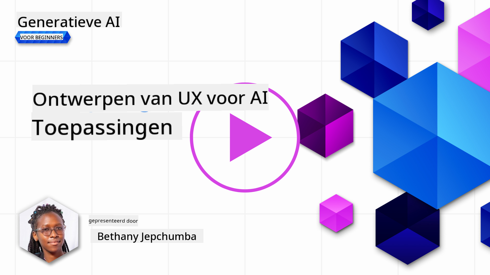
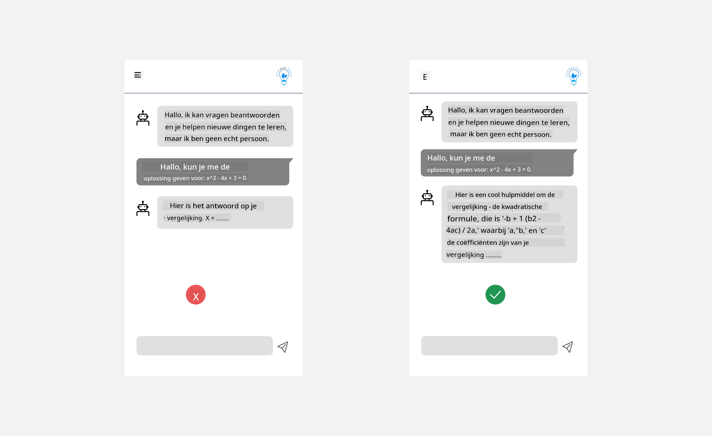
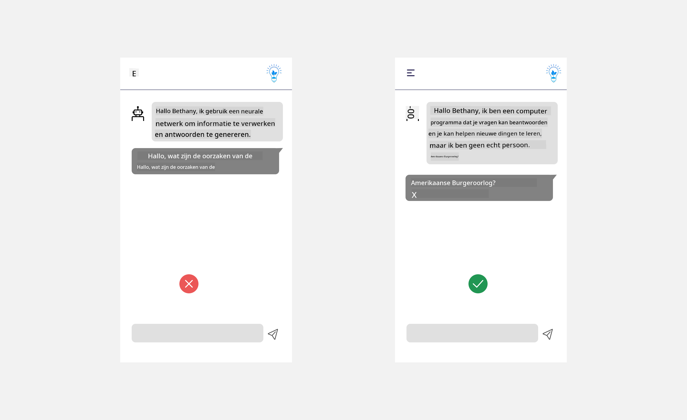
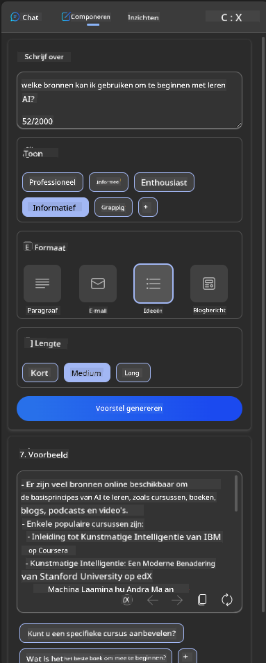
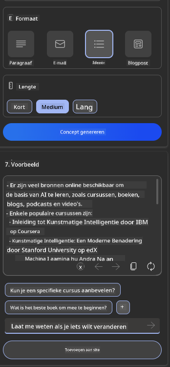
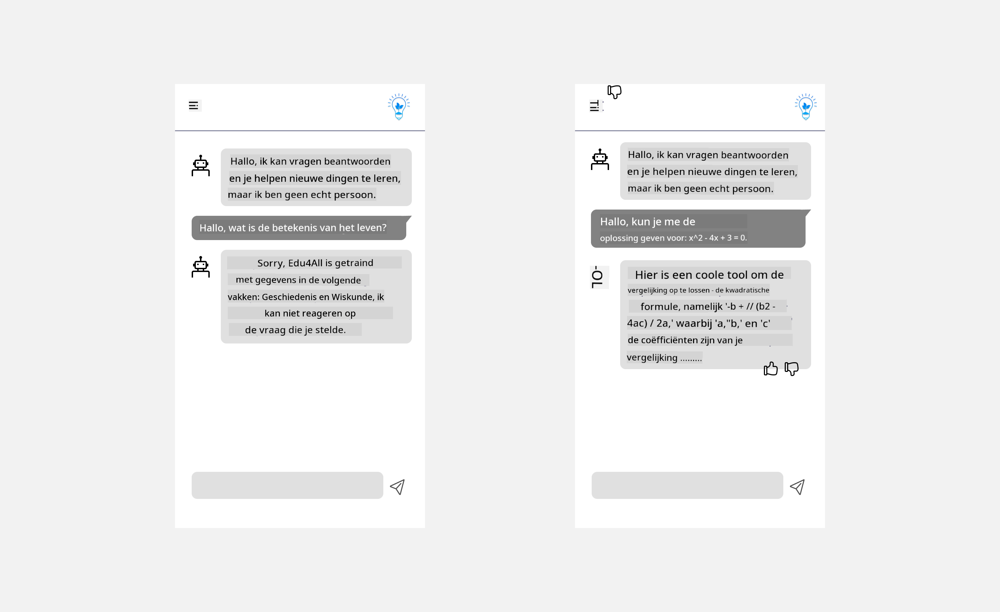

<!--
CO_OP_TRANSLATOR_METADATA:
{
  "original_hash": "ec385b41ee50579025d50cc03bfb3a25",
  "translation_date": "2025-05-19T21:59:21+00:00",
  "source_file": "12-designing-ux-for-ai-applications/README.md",
  "language_code": "nl"
}
-->
# Het Ontwerpen van UX voor AI-toepassingen

> _(Klik op de afbeelding hierboven om de video van deze les te bekijken)_

Gebruikerservaring is een zeer belangrijk aspect bij het bouwen van apps. Gebruikers moeten uw app op een efficiënte manier kunnen gebruiken om taken uit te voeren. Efficiënt zijn is één ding, maar u moet ook apps ontwerpen zodat ze door iedereen gebruikt kunnen worden, om ze _toegankelijk_ te maken. Dit hoofdstuk richt zich op dit gebied zodat u hopelijk een app ontwerpt die mensen kunnen en willen gebruiken.

## Inleiding

Gebruikerservaring is hoe een gebruiker interacteert met en gebruikmaakt van een specifiek product of dienst, of het nu een systeem, tool of ontwerp is. Bij het ontwikkelen van AI-toepassingen richten ontwikkelaars zich niet alleen op het waarborgen van een effectieve gebruikerservaring, maar ook op ethische aspecten. In deze les behandelen we hoe je toepassingen voor Kunstmatige Intelligentie (AI) bouwt die tegemoetkomen aan de behoeften van gebruikers.

De les behandelt de volgende gebieden:

- Inleiding tot gebruikerservaring en begrip van gebruikersbehoeften
- Het ontwerpen van AI-toepassingen voor vertrouwen en transparantie
- Het ontwerpen van AI-toepassingen voor samenwerking en feedback

## Leerdoelen

Na het volgen van deze les kun je:

- Begrijpen hoe je AI-toepassingen bouwt die voldoen aan de behoeften van de gebruiker.
- AI-toepassingen ontwerpen die vertrouwen en samenwerking bevorderen.

### Vereiste voorkennis

Neem de tijd en lees meer over [gebruikerservaring en design thinking.](https://learn.microsoft.com/training/modules/ux-design?WT.mc_id=academic-105485-koreyst)

## Inleiding tot Gebruikerservaring en Begrip van Gebruikersbehoeften

In onze fictieve onderwijsstartup hebben we twee primaire gebruikers: docenten en studenten. Elk van deze gebruikers heeft unieke behoeften. Een gebruikersgericht ontwerp geeft prioriteit aan de gebruiker en zorgt ervoor dat de producten relevant en nuttig zijn voor degenen voor wie ze bedoeld zijn.

De applicatie moet **nuttig, betrouwbaar, toegankelijk en aangenaam** zijn om een goede gebruikerservaring te bieden.

### Bruikbaarheid

Nuttig zijn betekent dat de applicatie functionaliteit heeft die overeenkomt met het beoogde doel, zoals het automatiseren van het beoordelingsproces of het genereren van flitskaarten voor herziening. Een applicatie die het beoordelingsproces automatiseert, moet in staat zijn om nauwkeurig en efficiënt scores toe te kennen aan het werk van studenten op basis van vooraf gedefinieerde criteria. Evenzo moet een applicatie die flitskaarten voor herziening genereert, relevante en diverse vragen kunnen maken op basis van zijn data.

### Betrouwbaarheid

Betrouwbaar zijn betekent dat de applicatie zijn taak consistent en zonder fouten kan uitvoeren. Echter, AI is net als mensen niet perfect en kan gevoelig zijn voor fouten. De applicaties kunnen fouten tegenkomen of onverwachte situaties die menselijke tussenkomst of correctie vereisen. Hoe ga je om met fouten? In het laatste gedeelte van deze les behandelen we hoe AI-systemen en -toepassingen zijn ontworpen voor samenwerking en feedback.

### Toegankelijkheid

Toegankelijk zijn betekent dat de gebruikerservaring wordt uitgebreid naar gebruikers met verschillende mogelijkheden, inclusief mensen met een handicap, zodat niemand wordt buitengesloten. Door toegankelijkheidsrichtlijnen en -principes te volgen, worden AI-oplossingen inclusiever, bruikbaarder en nuttiger voor alle gebruikers.

### Aangenaam

Aangenaam zijn betekent dat de applicatie prettig in gebruik is. Een aantrekkelijke gebruikerservaring kan een positieve impact hebben op de gebruiker, hen aanmoedigen om terug te keren naar de applicatie en de bedrijfsinkomsten verhogen.

Niet elke uitdaging kan met AI worden opgelost. AI komt om uw gebruikerservaring te verbeteren, of het nu gaat om het automatiseren van handmatige taken of het personaliseren van gebruikerservaringen.

## Het Ontwerpen van AI-toepassingen voor Vertrouwen en Transparantie

Vertrouwen opbouwen is cruciaal bij het ontwerpen van AI-toepassingen. Vertrouwen zorgt ervoor dat een gebruiker er zeker van is dat de applicatie het werk zal doen, consistent resultaten levert en dat de resultaten zijn wat de gebruiker nodig heeft. Een risico in dit gebied is wantrouwen en oververtrouwen. Wantrouwen treedt op wanneer een gebruiker weinig of geen vertrouwen heeft in een AI-systeem, wat ertoe leidt dat de gebruiker uw applicatie afwijst. Oververtrouwen treedt op wanneer een gebruiker de capaciteit van een AI-systeem overschat, waardoor gebruikers te veel vertrouwen hebben in het AI-systeem. Bijvoorbeeld, een geautomatiseerd beoordelingssysteem kan in het geval van oververtrouwen ertoe leiden dat de docent sommige papieren niet controleert om ervoor te zorgen dat het beoordelingssysteem goed werkt. Dit kan resulteren in oneerlijke of onnauwkeurige cijfers voor de studenten, of gemiste kansen voor feedback en verbetering.

Twee manieren om ervoor te zorgen dat vertrouwen centraal staat in het ontwerp zijn uitlegbaarheid en controle.

### Uitlegbaarheid

Wanneer AI helpt bij het informeren van beslissingen, zoals het overdragen van kennis aan toekomstige generaties, is het cruciaal voor docenten en ouders om te begrijpen hoe AI-beslissingen worden genomen. Dit is uitlegbaarheid - begrijpen hoe AI-toepassingen beslissingen nemen. Ontwerpen voor uitlegbaarheid omvat het toevoegen van details van voorbeelden van wat een AI-toepassing kan doen. Bijvoorbeeld, in plaats van "Aan de slag met AI-leraar", kan het systeem gebruiken: "Vat uw aantekeningen samen voor gemakkelijkere herziening met behulp van AI."

Een ander voorbeeld is hoe AI gebruikmaakt van gebruikers- en persoonlijke gegevens. Bijvoorbeeld, een gebruiker met de persona student kan beperkingen hebben op basis van hun persona. De AI kan misschien geen antwoorden op vragen onthullen, maar kan de gebruiker helpen nadenken over hoe ze een probleem kunnen oplossen.

Een laatste belangrijk onderdeel van uitlegbaarheid is de vereenvoudiging van uitleg. Studenten en docenten zijn misschien geen AI-experts, daarom moeten uitleggen van wat de applicatie wel of niet kan doen, vereenvoudigd en gemakkelijk te begrijpen zijn.

### Controle

Generatieve AI creëert een samenwerking tussen AI en de gebruiker, waarbij bijvoorbeeld een gebruiker prompts kan wijzigen voor verschillende resultaten. Bovendien, zodra een output is gegenereerd, moeten gebruikers in staat zijn de resultaten te wijzigen, waardoor ze een gevoel van controle krijgen. Bijvoorbeeld, bij het gebruik van Bing kunt u uw prompt aanpassen op basis van formaat, toon en lengte. Bovendien kunt u wijzigingen aanbrengen in uw output en de output aanpassen zoals hieronder weergegeven:

Een andere functie in Bing die een gebruiker controle over de applicatie geeft, is de mogelijkheid om in te schrijven en uit te schrijven voor de gegevens die AI gebruikt. Voor een schoolapplicatie wil een student misschien zijn aantekeningen gebruiken, evenals de bronnen van de docenten als herzieningsmateriaal.

> Bij het ontwerpen van AI-toepassingen is intentionaliteit de sleutel om ervoor te zorgen dat gebruikers niet te veel vertrouwen, waardoor onrealistische verwachtingen van de capaciteiten ontstaan. Een manier om dit te doen is door wrijving te creëren tussen de prompts en de resultaten. De gebruiker eraan herinneren dat dit AI is en geen medemens.

## Het Ontwerpen van AI-toepassingen voor Samenwerking en Feedback

Zoals eerder vermeld, creëert generatieve AI een samenwerking tussen de gebruiker en AI. De meeste interacties zijn met een gebruiker die een prompt invoert en de AI die een output genereert. Wat als de output onjuist is? Hoe gaat de applicatie om met fouten als ze zich voordoen? Geeft de AI de gebruiker de schuld of neemt het de tijd om de fout uit te leggen?

AI-toepassingen moeten worden gebouwd om feedback te ontvangen en te geven. Dit helpt niet alleen het AI-systeem te verbeteren, maar bouwt ook vertrouwen op bij de gebruikers. Een feedbacklus moet in het ontwerp worden opgenomen, een voorbeeld kan een eenvoudige duim omhoog of omlaag op de output zijn.

Een andere manier om hiermee om te gaan is door duidelijk de capaciteiten en beperkingen van het systeem te communiceren. Wanneer een gebruiker een fout maakt door iets te vragen buiten de capaciteiten van de AI, moet er ook een manier zijn om hiermee om te gaan, zoals hieronder weergegeven.

Systeemfouten komen vaak voor bij applicaties waar de gebruiker mogelijk hulp nodig heeft met informatie buiten de reikwijdte van de AI of de applicatie kan een limiet hebben op hoeveel vragen/onderwerpen een gebruiker samenvattingen kan genereren. Bijvoorbeeld, een AI-toepassing die is getraind met gegevens over beperkte onderwerpen, bijvoorbeeld Geschiedenis en Wiskunde, kan misschien geen vragen over Aardrijkskunde behandelen. Om dit te verzachten, kan het AI-systeem een reactie geven zoals: "Sorry, ons product is getraind met gegevens in de volgende onderwerpen....., ik kan niet reageren op de vraag die je stelde."

AI-toepassingen zijn niet perfect, daarom zullen ze fouten maken. Bij het ontwerpen van uw toepassingen moet u ervoor zorgen dat u ruimte creëert voor feedback van gebruikers en foutafhandeling op een manier die eenvoudig en gemakkelijk te begrijpen is.

## Opdracht

Neem alle AI-apps die je tot nu toe hebt gebouwd en overweeg de onderstaande stappen in je app te implementeren:

- **Aangenaam:** Overweeg hoe je je app aangenamer kunt maken. Voeg je overal uitleg toe? Moedig je de gebruiker aan om te verkennen? Hoe formuleer je je foutmeldingen?

- **Bruikbaarheid:** Bouw een webapp. Zorg ervoor dat je app zowel met de muis als het toetsenbord navigeerbaar is.

- **Vertrouwen en transparantie:** Vertrouw niet volledig op de AI en de output ervan, overweeg hoe je een mens zou toevoegen aan het proces om de output te verifiëren. Overweeg en implementeer ook andere manieren om vertrouwen en transparantie te bereiken.

- **Controle:** Geef de gebruiker controle over de gegevens die ze aan de applicatie verstrekken. Implementeer een manier waarop een gebruiker kan kiezen om wel of niet deel te nemen aan gegevensverzameling in de AI-toepassing.

## Ga Verder met Leren!

Na het voltooien van deze les, bekijk onze [Generatieve AI Leercollectie](https://aka.ms/genai-collection?WT.mc_id=academic-105485-koreyst) om je kennis over Generatieve AI verder te vergroten!

Ga naar Les 13, waar we zullen kijken naar hoe we [AI-toepassingen beveiligen](../13-securing-ai-applications/README.md?WT.mc_id=academic-105485-koreyst)!

**Disclaimer**:  
Dit document is vertaald met behulp van de AI-vertalingsdienst [Co-op Translator](https://github.com/Azure/co-op-translator). Hoewel we ons best doen voor nauwkeurigheid, dient u zich ervan bewust te zijn dat geautomatiseerde vertalingen fouten of onnauwkeurigheden kunnen bevatten. Het originele document in zijn oorspronkelijke taal moet worden beschouwd als de gezaghebbende bron. Voor cruciale informatie wordt professionele menselijke vertaling aanbevolen. Wij zijn niet aansprakelijk voor misverstanden of verkeerde interpretaties die voortvloeien uit het gebruik van deze vertaling.