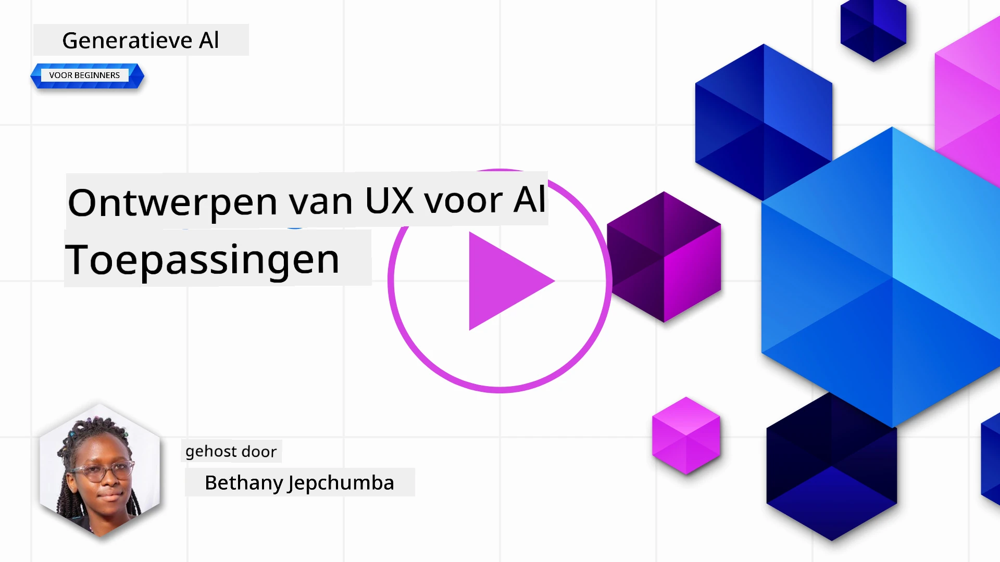
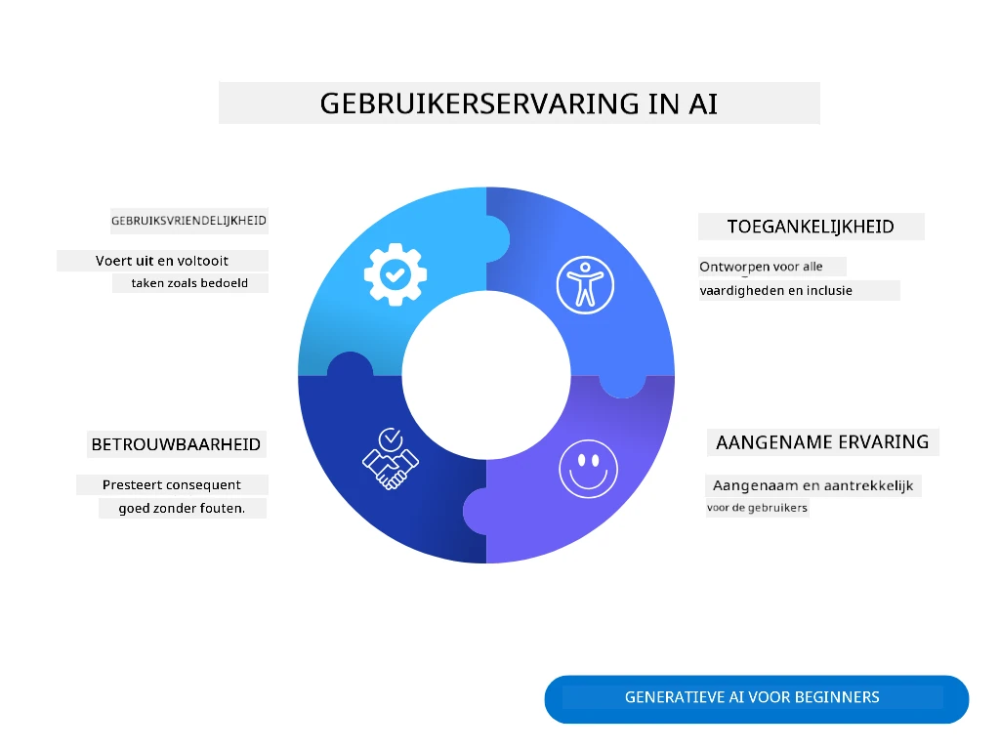
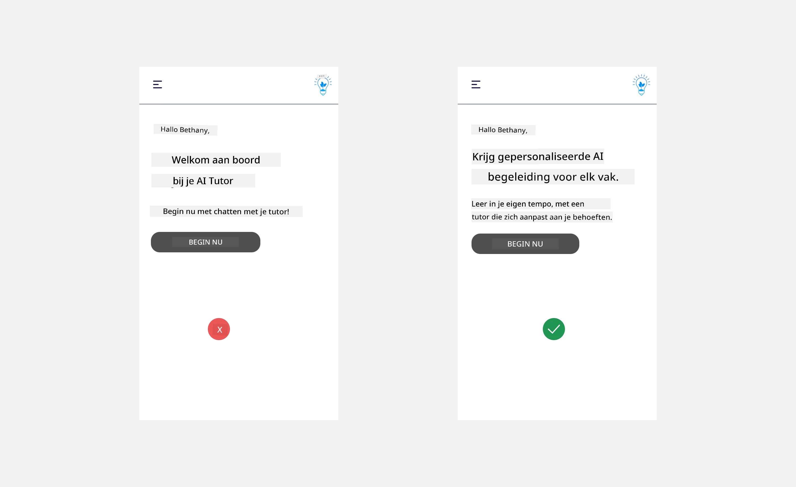
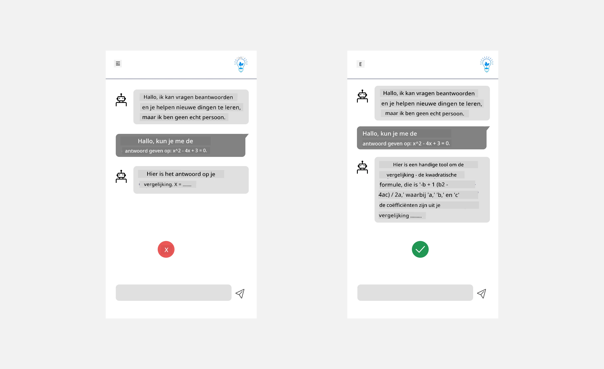
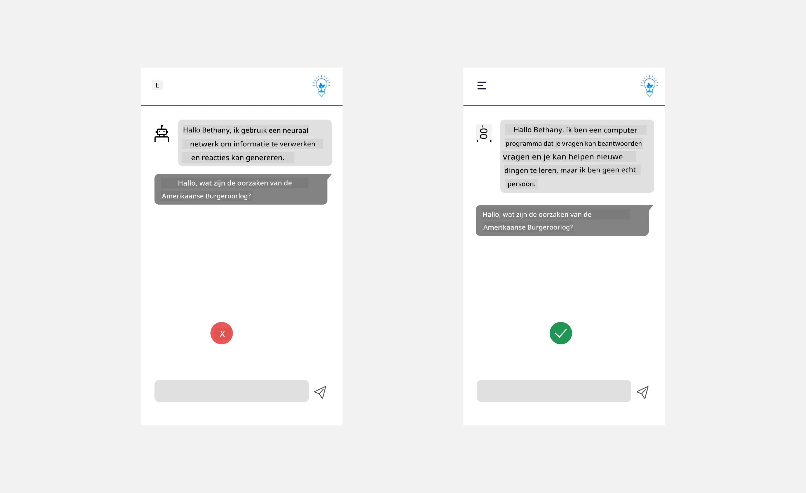
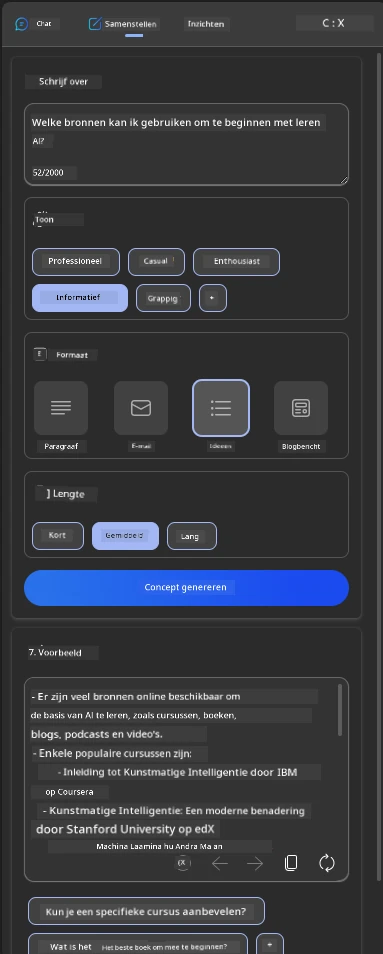
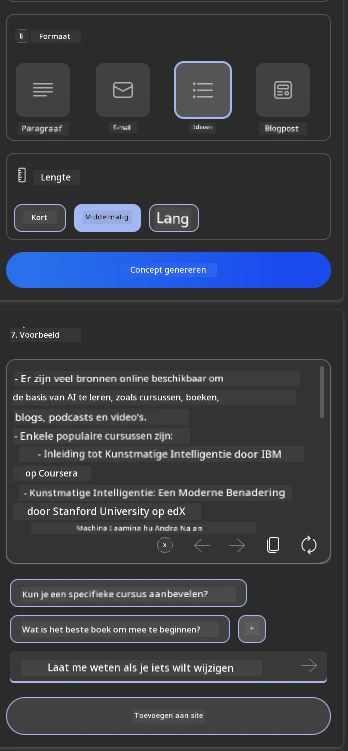
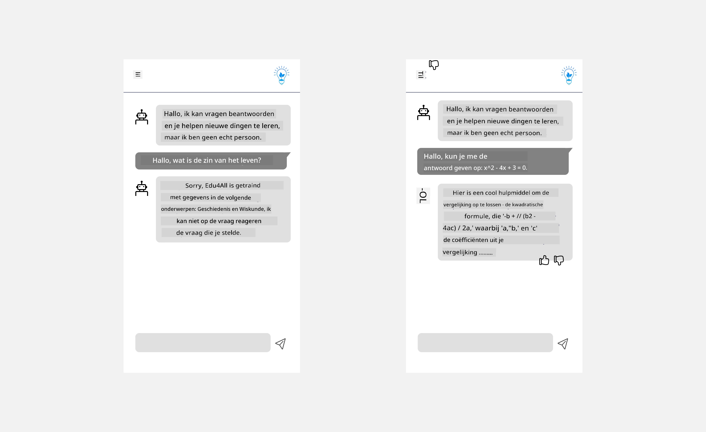

# UX ontwerpen voor AI-toepassingen

> _(Klik op de afbeelding hierboven om de video van deze les te bekijken)_

Gebruikerservaring is een zeer belangrijk aspect bij het bouwen van apps. Gebruikers moeten in staat zijn om je app efficiënt te gebruiken om taken uit te voeren. Efficiënt zijn is één ding, maar je moet apps ook zo ontwerpen dat ze door iedereen kunnen worden gebruikt, om ze _toegankelijk_ te maken. Dit hoofdstuk richt zich op dit gebied zodat je hopelijk een app ontwerpt die mensen kunnen en willen gebruiken.

## Introductie

Gebruikerservaring is hoe een gebruiker interactie heeft met en een specifiek product of dienst gebruikt, of het nu een systeem, tool of ontwerp is. Bij het ontwikkelen van AI-toepassingen richten ontwikkelaars zich niet alleen op het waarborgen dat de gebruikerservaring effectief is, maar ook ethisch. In deze les behandelen we hoe je Kunstmatige Intelligentie (AI)-toepassingen bouwt die inspelen op de behoeften van gebruikers.

De les behandelt de volgende gebieden:

- Introductie tot gebruikerservaring en het begrijpen van gebruikersbehoeften
- AI-toepassingen ontwerpen voor vertrouwen en transparantie
- AI-toepassingen ontwerpen voor samenwerking en feedback

## Leerdoelen

Na het volgen van deze les kun je:

- Begrijpen hoe je AI-toepassingen bouwt die voldoen aan de behoeften van gebruikers.
- AI-toepassingen ontwerpen die vertrouwen en samenwerking bevorderen.

### Vereisten

Neem wat tijd om meer te lezen over [gebruikerservaring en design thinking.](https://learn.microsoft.com/training/modules/ux-design?WT.mc_id=academic-105485-koreyst)

## Introductie tot gebruikerservaring en het begrijpen van gebruikersbehoeften

In onze fictieve educatieve startup hebben we twee primaire gebruikers, leraren en studenten. Elk van de twee gebruikers heeft unieke behoeften. Een gebruiker-centrisch ontwerp plaatst de gebruiker op de voorgrond om ervoor te zorgen dat de producten relevant en nuttig zijn voor degenen voor wie ze bedoeld zijn.

De toepassing moet **bruikbaar, betrouwbaar, toegankelijk en aangenaam** zijn om een goede gebruikerservaring te bieden.

### Bruikbaarheid

Bruikbaar zijn betekent dat de toepassing functionaliteit heeft die past bij het beoogde doel, zoals het automatiseren van het beoordelingsproces of het genereren van flashcards voor herhaling. Een toepassing die het beoordelingsproces automatiseert, moet in staat zijn om accuraat en efficiënt scores toe te kennen aan het werk van studenten op basis van vooraf gedefinieerde criteria. Op dezelfde manier moet een toepassing die herhalingsflashcards genereert relevante en diverse vragen kunnen creëren op basis van zijn data.

### Betrouwbaarheid

Betrouwbaar zijn betekent dat de toepassing zijn taak consistent en zonder fouten kan uitvoeren. Echter, AI is net als mensen niet perfect en kan fouten maken. De toepassingen kunnen fouten of onverwachte situaties tegenkomen die menselijke interventie of correctie vereisen. Hoe ga je om met fouten? In het laatste gedeelte van deze les behandelen we hoe AI-systemen en -toepassingen zijn ontworpen voor samenwerking en feedback.

### Toegankelijkheid

Toegankelijk zijn betekent dat de gebruikerservaring wordt uitgebreid naar gebruikers met verschillende vermogens, inclusief degenen met een beperking, zodat niemand wordt uitgesloten. Door toegankelijkheidsrichtlijnen en -principes te volgen, worden AI-oplossingen inclusiever, beter bruikbaar en voordeliger voor alle gebruikers.

### Aangenaam

Aangenaam zijn betekent dat de toepassing plezierig in gebruik is. Een aansprekende gebruikerservaring kan een positief effect hebben op de gebruiker en hen aanmoedigen om terug te keren naar de toepassing, wat de bedrijfsomzet verhoogt.

Niet elke uitdaging kan met AI worden opgelost. AI komt om je gebruikerservaring te versterken, bijvoorbeeld door handmatige taken te automatiseren of gebruikerservaringen te personaliseren.

## AI-toepassingen ontwerpen voor vertrouwen en transparantie

Vertrouwen opbouwen is cruciaal bij het ontwerpen van AI-toepassingen. Vertrouwen zorgt ervoor dat een gebruiker ervan overtuigd is dat de toepassing het werk zal doen, consistent resultaten levert en dat de resultaten zijn wat de gebruiker nodig heeft. Een risico op dit gebied is wantrouwen en overmatig vertrouwen. Wantrouwen ontstaat wanneer een gebruiker weinig of geen vertrouwen heeft in een AI-systeem, wat ertoe leidt dat de gebruiker je toepassing afwijst. Overmatig vertrouwen ontstaat wanneer een gebruiker de mogelijkheden van een AI-systeem overschat, waardoor gebruikers het AI-systeem te veel vertrouwen. Bijvoorbeeld, een geautomatiseerd beoordelingssysteem kan bij overmatig vertrouwen ertoe leiden dat de leraar sommige papers niet nakijkt om te controleren of het beoordelingssysteem goed functioneert. Dit kan resulteren in oneerlijke of onnauwkeurige cijfers voor studenten of gemiste kansen voor feedback en verbetering.

Twee manieren om ervoor te zorgen dat vertrouwen centraal staat in het ontwerp zijn verklaarbaarheid en controle.

### Verklaarbaarheid

Wanneer AI helpt bij het nemen van beslissingen zoals het overbrengen van kennis aan toekomstige generaties, is het cruciaal dat leraren en ouders begrijpen hoe AI-beslissingen worden genomen. Dit is verklaarbaarheid - begrijpen hoe AI-toepassingen beslissingen maken. Ontwerpen voor verklaarbaarheid omvat het toevoegen van details die benadrukken hoe AI tot de output is gekomen. Het publiek moet zich ervan bewust zijn dat de output door AI is gegenereerd en niet door een mens. Zeg bijvoorbeeld niet "Begin nu met chatten met je tutor", maar "Gebruik de AI-tutor die zich aanpast aan jouw behoeften en je helpt leren in jouw tempo."

Een ander voorbeeld is hoe AI gebruikers- en persoonlijke gegevens gebruikt. Bijvoorbeeld, een gebruiker met het persona student kan beperkingen hebben op basis van hun persona. De AI mag bijvoorbeeld geen antwoorden op vragen geven, maar kan wel de gebruiker begeleiden om na te denken over hoe ze een probleem kunnen oplossen.

Een laatste belangrijk onderdeel van verklaarbaarheid is het vereenvoudigen van uitleg. Studenten en leraren zijn mogelijk geen AI-experts, daarom moeten uitleggen over wat de toepassing wel of niet kan doen vereenvoudigd en gemakkelijk te begrijpen zijn.

### Controle

Generatieve AI creëert een samenwerking tussen AI en de gebruiker, waarbij bijvoorbeeld een gebruiker prompts kan aanpassen voor verschillende resultaten. Daarnaast moeten gebruikers nadat een output is gegenereerd, de resultaten kunnen wijzigen, waardoor ze een gevoel van controle krijgen. Bijvoorbeeld, bij het gebruik van Microsoft Copilot (voorheen Bing Chat), kun je je prompt aanpassen op basis van formaat, toon en lengte. Daarnaast kun je aanpassingen aan je output toevoegen en de output wijzigen zoals hieronder weergegeven:

Een andere functie in Microsoft Copilot die een gebruiker controle geeft over de toepassing is de mogelijkheid om al dan niet toestemming te geven voor de data die AI gebruikt. Voor een schoolapplicatie kan een student bijvoorbeeld zijn aantekeningen willen gebruiken evenals de bronnen van leraren als studiemateriaal.

> Bij het ontwerpen van AI-toepassingen is doelgerichtheid essentieel om te voorkomen dat gebruikers onrealistische verwachtingen krijgen en te veel vertrouwen in de mogelijkheden van de AI. Een manier om dit te doen is door wrijving te creëren tussen de prompts en de resultaten. Herinner de gebruiker eraan dat dit AI is en geen mede-mens.

## AI-toepassingen ontwerpen voor samenwerking en feedback

Zoals eerder vermeld, creëert generatieve AI een samenwerking tussen gebruiker en AI. Meestal voert een gebruiker een prompt in en genereert de AI een output. Wat als de output onjuist is? Hoe gaat de toepassing om met fouten als die optreden? Geeft de AI de gebruiker de schuld of neemt het de tijd om de fout uit te leggen?

AI-toepassingen moeten worden gebouwd om feedback te ontvangen en te geven. Dit helpt niet alleen het AI-systeem verbeteren, maar bouwt ook vertrouwen op bij gebruikers. Een feedbacklus moet in het ontwerp worden opgenomen, een voorbeeld kan een eenvoudige duim omhoog of omlaag op de output zijn.

Een andere manier om hiermee om te gaan is duidelijk communiceren over de mogelijkheden en beperkingen van het systeem. Wanneer een gebruiker een fout maakt door iets te vragen buiten de AI-mogelijkheden, moet er ook een manier zijn om dit af te handelen, zoals hieronder wordt getoond.

Systeemfouten komen vaak voor bij toepassingen waarbij de gebruiker wellicht hulp nodig heeft met informatie buiten het bereik van de AI of wanneer de toepassing een limiet heeft op hoeveel vragen/onderwerpen een gebruiker samenvattingen kan genereren. Bijvoorbeeld, een AI-toepassing die getraind is met data over beperkte onderwerpen zoals Geschiedenis en Wiskunde, kan mogelijk geen vragen over Aardrijkskunde behandelen. Om dit te beperken, kan het AI-systeem een reactie geven zoals: "Sorry, ons product is getraind met data over de volgende onderwerpen....., ik kan de gestelde vraag niet beantwoorden."

AI-toepassingen zijn niet perfect, daarom zullen ze fouten maken. Bij het ontwerpen van je toepassingen moet je zorgen dat je ruimte creëert voor feedback van gebruikers en foutafhandeling op een manier die eenvoudig en gemakkelijk uit te leggen is.

## Opdracht

Neem een of meer AI-apps die je tot nu toe hebt gebouwd, en overweeg de onderstaande stappen in je app te implementeren:

- **Aangenaam:** Overweeg hoe je je app aangenamer kunt maken. Voeg je overal uitleg toe? Moedig je gebruikers aan om te verkennen? Hoe formuleer je je foutmeldingen?

- **Bruikbaarheid:** Bouw je een webapp? Zorg dat je app navigeerbaar is met zowel muis als toetsenbord.

- **Vertrouwen en transparantie:** Vertrouw de AI en de output niet volledig, overweeg hoe je een mens kunt toevoegen om de output te verifiëren. Overweeg ook andere manieren om vertrouwen en transparantie te bereiken en implementeer deze.

- **Controle:** Geef de gebruiker controle over de data die zij aan de toepassing leveren. Implementeer een manier waarop een gebruiker kan kiezen om wel of geen toestemming te geven voor het verzamelen van data in de AI-toepassing.

<!-- ## [Post-lecture quiz](../../../12-designing-ux-for-ai-applications/quiz-url) -->

## Ga door met leren!

Na het voltooien van deze les, bekijk onze [Generative AI Learning collection](https://aka.ms/genai-collection?WT.mc_id=academic-105485-koreyst) om je kennis van Generatieve AI verder te vergroten!

Ga naar Les 13, waar we bekijken hoe je [AI-toepassingen beveiligt](../13-securing-ai-applications/README.md?WT.mc_id=academic-105485-koreyst)!

---

<!-- CO-OP TRANSLATOR DISCLAIMER START -->
**Disclaimer**:
Dit document is vertaald met behulp van de AI vertaaldienst [Co-op Translator](https://github.com/Azure/co-op-translator). Hoewel we streven naar nauwkeurigheid, dient u er rekening mee te houden dat geautomatiseerde vertalingen fouten of onnauwkeurigheden kunnen bevatten. Het originele document in de oorspronkelijke taal moet worden beschouwd als de gezaghebbende bron. Voor kritieke informatie wordt professionele menselijke vertaling aanbevolen. Wij zijn niet aansprakelijk voor eventuele misverstanden of verkeerde interpretaties die voortvloeien uit het gebruik van deze vertaling.
<!-- CO-OP TRANSLATOR DISCLAIMER END -->