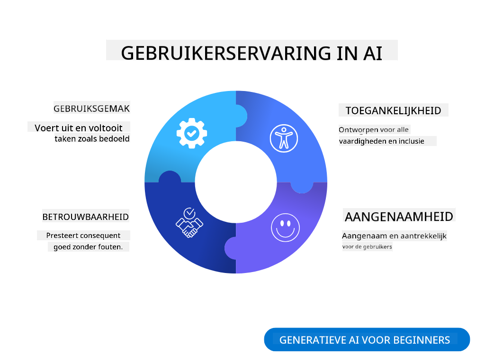
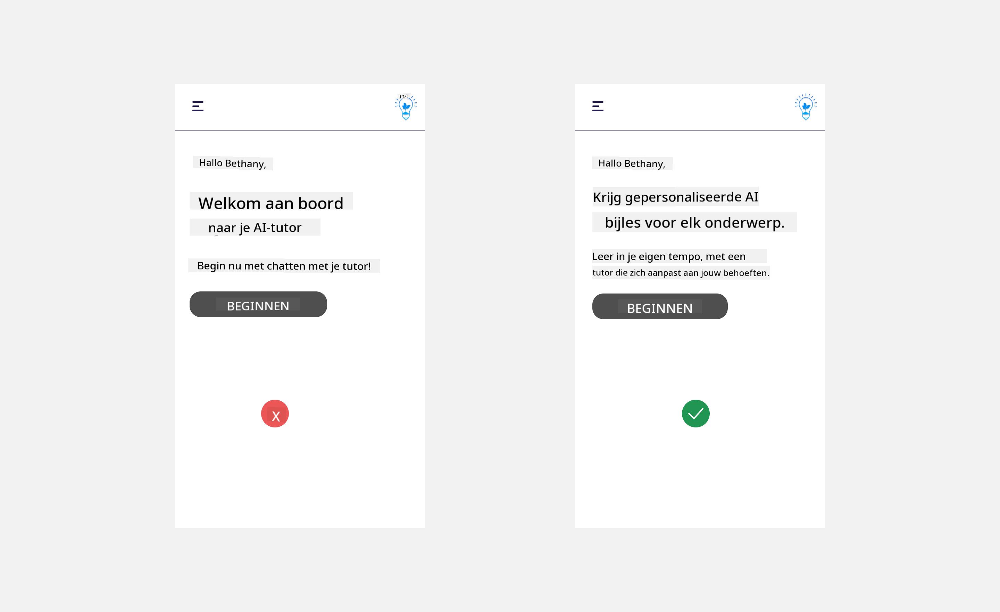
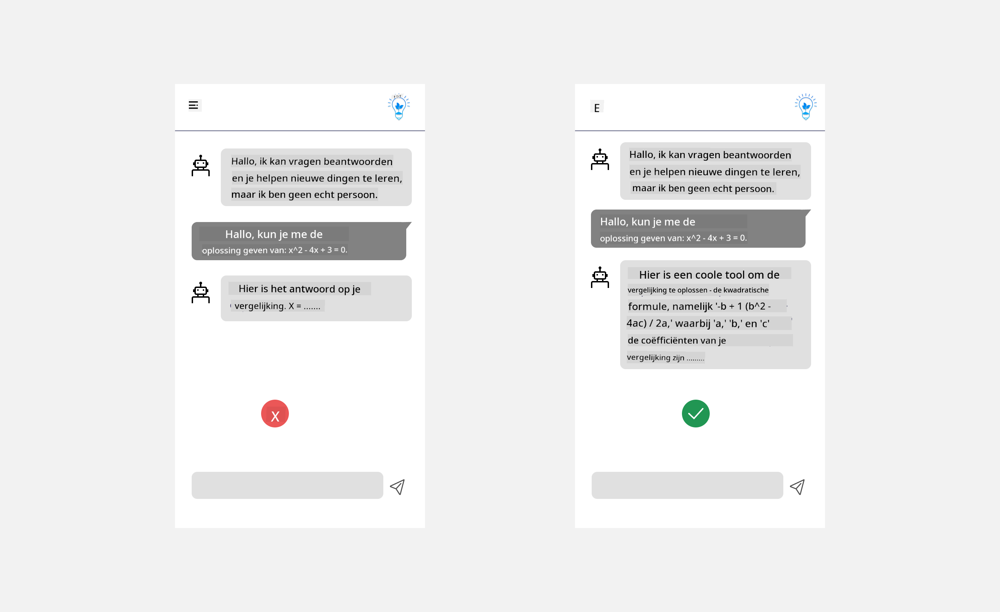
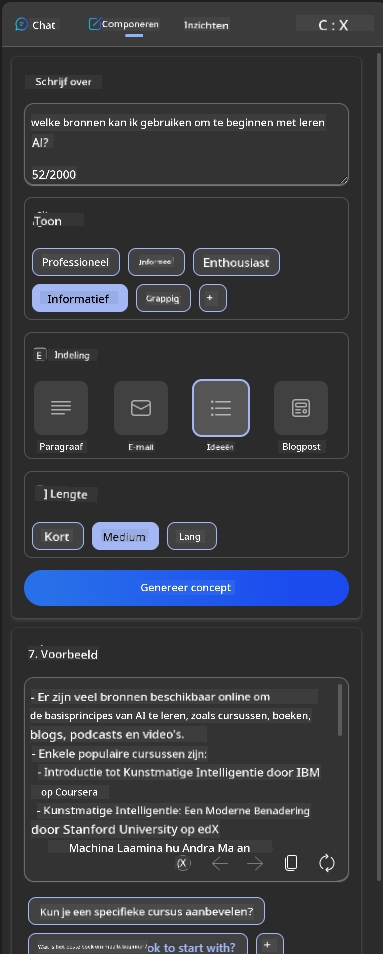
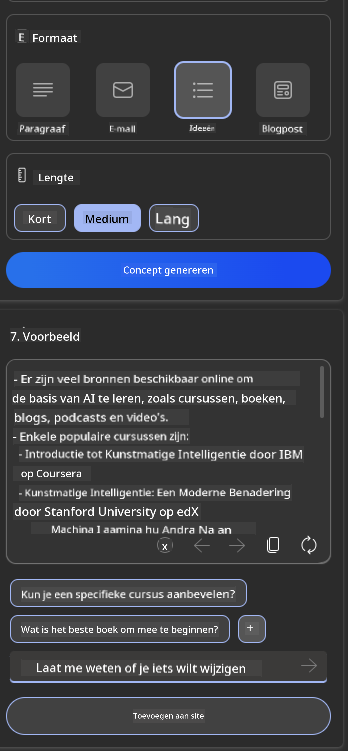

<!--
CO_OP_TRANSLATOR_METADATA:
{
  "original_hash": "ec385b41ee50579025d50cc03bfb3a25",
  "translation_date": "2025-06-25T20:27:12+00:00",
  "source_file": "12-designing-ux-for-ai-applications/README.md",
  "language_code": "nl"
}
-->
# UX Ontwerpen voor AI-toepassingen

> _(Klik op de afbeelding hierboven om de video van deze les te bekijken)_

Gebruikerservaring is een zeer belangrijk aspect van het bouwen van apps. Gebruikers moeten je app efficiënt kunnen gebruiken om taken uit te voeren. Efficiënt zijn is één ding, maar je moet ook apps ontwerpen zodat ze door iedereen gebruikt kunnen worden, om ze _toegankelijk_ te maken. Dit hoofdstuk zal zich op dit gebied richten, zodat je hopelijk een app ontwerpt die mensen kunnen en willen gebruiken.

## Inleiding

Gebruikerservaring is hoe een gebruiker een specifiek product of dienst gebruikt en ermee omgaat, of het nu een systeem, tool of ontwerp is. Bij het ontwikkelen van AI-toepassingen richten ontwikkelaars zich niet alleen op het effectief maken van de gebruikerservaring, maar ook op het ethisch maken ervan. In deze les behandelen we hoe je toepassingen voor kunstmatige intelligentie (AI) kunt bouwen die aan de behoeften van de gebruiker voldoen.

De les behandelt de volgende gebieden:

- Inleiding tot gebruikerservaring en begrip van gebruikersbehoeften
- AI-toepassingen ontwerpen voor vertrouwen en transparantie
- AI-toepassingen ontwerpen voor samenwerking en feedback

## Leerdoelen

Na het volgen van deze les kun je:

- Begrijpen hoe je AI-toepassingen bouwt die aan de behoeften van de gebruiker voldoen.
- AI-toepassingen ontwerpen die vertrouwen en samenwerking bevorderen.

### Voorwaarde

Neem de tijd om meer te lezen over [gebruikerservaring en design thinking.](https://learn.microsoft.com/training/modules/ux-design?WT.mc_id=academic-105485-koreyst)

## Inleiding tot Gebruikerservaring en Begrip van Gebruikersbehoeften

In onze fictieve onderwijs-startup hebben we twee primaire gebruikers, leraren en studenten. Elk van de twee gebruikers heeft unieke behoeften. Een gebruiksgerichte ontwerpbenadering prioriteert de gebruiker en zorgt ervoor dat de producten relevant en nuttig zijn voor degenen waarvoor ze bedoeld zijn.

De applicatie moet **nuttig, betrouwbaar, toegankelijk en aangenaam** zijn om een goede gebruikerservaring te bieden.

### Bruikbaarheid

Nuttig zijn betekent dat de applicatie functionaliteit heeft die overeenkomt met het beoogde doel, zoals het automatiseren van het beoordelingsproces of het genereren van flashcards voor herziening. Een applicatie die het beoordelingsproces automatiseert, moet in staat zijn om scores nauwkeurig en efficiënt toe te wijzen aan het werk van studenten op basis van vooraf gedefinieerde criteria. Evenzo moet een applicatie die herzieningsflashcards genereert, relevante en diverse vragen kunnen creëren op basis van zijn gegevens.

### Betrouwbaarheid

Betrouwbaar zijn betekent dat de applicatie zijn taak consistent en zonder fouten kan uitvoeren. Echter, AI is net als mensen niet perfect en kan gevoelig zijn voor fouten. De toepassingen kunnen fouten of onverwachte situaties tegenkomen die menselijke tussenkomst of correctie vereisen. Hoe ga je om met fouten? In het laatste gedeelte van deze les zullen we behandelen hoe AI-systemen en -toepassingen zijn ontworpen voor samenwerking en feedback.

### Toegankelijkheid

Toegankelijk zijn betekent dat de gebruikerservaring wordt uitgebreid naar gebruikers met verschillende capaciteiten, inclusief degenen met een handicap, zodat niemand wordt buitengesloten. Door toegankelijkheidsrichtlijnen en -principes te volgen, worden AI-oplossingen inclusiever, bruikbaarder en voordeliger voor alle gebruikers.

### Aangenaam

Aangenaam zijn betekent dat de applicatie prettig is om te gebruiken. Een aantrekkelijke gebruikerservaring kan een positieve impact hebben op de gebruiker, hen aanmoedigen om terug te keren naar de applicatie en de bedrijfsinkomsten verhogen.

Niet elke uitdaging kan worden opgelost met AI. AI komt om je gebruikerservaring te verbeteren, of het nu gaat om het automatiseren van handmatige taken of het personaliseren van gebruikerservaringen.

## AI-toepassingen Ontwerpen voor Vertrouwen en Transparantie

Vertrouwen opbouwen is cruciaal bij het ontwerpen van AI-toepassingen. Vertrouwen zorgt ervoor dat een gebruiker er zeker van is dat de applicatie het werk zal doen, consistent resultaten zal leveren en dat de resultaten zijn wat de gebruiker nodig heeft. Een risico op dit gebied is wantrouwen en oververtrouwen. Wantrouwen treedt op wanneer een gebruiker weinig of geen vertrouwen heeft in een AI-systeem, wat ertoe leidt dat de gebruiker je applicatie afwijst. Oververtrouwen treedt op wanneer een gebruiker de capaciteit van een AI-systeem overschat, waardoor gebruikers het AI-systeem te veel vertrouwen. Bijvoorbeeld, een geautomatiseerd beoordelingssysteem in het geval van oververtrouwen kan ertoe leiden dat de leraar niet door sommige van de papieren kijkt om ervoor te zorgen dat het beoordelingssysteem goed werkt. Dit kan resulteren in oneerlijke of onnauwkeurige cijfers voor de studenten, of gemiste kansen voor feedback en verbetering.

Twee manieren om ervoor te zorgen dat vertrouwen centraal staat in het ontwerp zijn verklaarbaarheid en controle.

### Verklaarbaarheid

Wanneer AI helpt bij het informeren van beslissingen, zoals het overdragen van kennis aan toekomstige generaties, is het cruciaal voor leraren en ouders om te begrijpen hoe AI-beslissingen worden genomen. Dit is verklaarbaarheid - begrijpen hoe AI-toepassingen beslissingen nemen. Ontwerpen voor verklaarbaarheid omvat het toevoegen van details van voorbeelden van wat een AI-toepassing kan doen. Bijvoorbeeld, in plaats van "Begin met AI-leraar", kan het systeem gebruiken: "Vat je notities samen voor gemakkelijker herziening met behulp van AI."

Een ander voorbeeld is hoe AI gebruikers- en persoonlijke gegevens gebruikt. Bijvoorbeeld, een gebruiker met de persona student kan beperkingen hebben op basis van hun persona. De AI kan mogelijk geen antwoorden op vragen onthullen, maar kan de gebruiker helpen nadenken over hoe ze een probleem kunnen oplossen.

Een laatste belangrijk onderdeel van verklaarbaarheid is het vereenvoudigen van verklaringen. Studenten en leraren zijn mogelijk geen AI-experts, dus verklaringen van wat de applicatie wel of niet kan doen, moeten eenvoudig en gemakkelijk te begrijpen zijn.

### Controle

Generatieve AI creëert een samenwerking tussen AI en de gebruiker, waarbij bijvoorbeeld een gebruiker prompts kan aanpassen voor verschillende resultaten. Bovendien, zodra een output is gegenereerd, moeten gebruikers de resultaten kunnen wijzigen, waardoor ze een gevoel van controle krijgen. Bijvoorbeeld, bij het gebruik van Bing kun je je prompt aanpassen op basis van formaat, toon en lengte. Bovendien kun je wijzigingen aanbrengen in je output en de output aanpassen zoals hieronder weergegeven:

Een andere functie in Bing die een gebruiker controle over de applicatie geeft, is de mogelijkheid om in te stemmen en zich af te melden voor de gegevens die AI gebruikt. Voor een schoolapplicatie wil een student mogelijk zijn notities gebruiken evenals de middelen van de leraren als herzieningsmateriaal.

> Bij het ontwerpen van AI-toepassingen is intentionaliteit cruciaal om ervoor te zorgen dat gebruikers niet oververtrouwen en onrealistische verwachtingen van de capaciteiten ervan stellen. Een manier om dit te doen is door wrijving te creëren tussen de prompts en de resultaten. Herinner de gebruiker eraan dat dit AI is en geen medemens.

## AI-toepassingen Ontwerpen voor Samenwerking en Feedback

Zoals eerder vermeld, creëert generatieve AI een samenwerking tussen de gebruiker en AI. De meeste interacties zijn met een gebruiker die een prompt invoert en de AI die een output genereert. Wat als de output incorrect is? Hoe gaat de applicatie om met fouten als ze optreden? Geeft de AI de gebruiker de schuld of neemt de tijd om de fout uit te leggen?

AI-toepassingen moeten zo gebouwd zijn dat ze feedback kunnen ontvangen en geven. Dit helpt niet alleen het AI-systeem te verbeteren, maar bouwt ook vertrouwen op bij de gebruikers. Een feedbackloop moet in het ontwerp worden opgenomen, een voorbeeld kan een eenvoudige duim omhoog of omlaag op de output zijn.

Een andere manier om hiermee om te gaan is door duidelijk de capaciteiten en beperkingen van het systeem te communiceren. Wanneer een gebruiker een fout maakt door iets te vragen dat buiten de capaciteiten van de AI valt, moet er ook een manier zijn om hiermee om te gaan, zoals hieronder weergegeven.

Systeemfouten komen vaak voor bij toepassingen waarbij de gebruiker mogelijk hulp nodig heeft met informatie buiten het bereik van de AI of de applicatie kan een limiet hebben op hoeveel vragen/onderwerpen een gebruiker kan samenvattingen genereren. Bijvoorbeeld, een AI-toepassing die is getraind met gegevens over beperkte onderwerpen, bijvoorbeeld Geschiedenis en Wiskunde, kan mogelijk geen vragen over Aardrijkskunde afhandelen. Om dit te mitigeren, kan het AI-systeem een reactie geven zoals: "Sorry, ons product is getraind met gegevens in de volgende onderwerpen....., ik kan niet reageren op de vraag die je hebt gesteld."

AI-toepassingen zijn niet perfect, dus ze zullen onvermijdelijk fouten maken. Bij het ontwerpen van je toepassingen moet je ervoor zorgen dat je ruimte creëert voor feedback van gebruikers en foutafhandeling op een manier die eenvoudig en gemakkelijk te begrijpen is.

## Opdracht

Neem een van de AI-apps die je tot nu toe hebt gebouwd en overweeg de onderstaande stappen in je app te implementeren:

- **Aangenaam:** Overweeg hoe je je app aangenamer kunt maken. Voeg je overal verklaringen toe? Moedig je de gebruiker aan om te verkennen? Hoe formuleer je je foutmeldingen?

- **Bruikbaarheid:** Bouw een webapp. Zorg ervoor dat je app navigeerbaar is met zowel muis als toetsenbord.

- **Vertrouwen en transparantie:** Vertrouw niet volledig op de AI en zijn output, overweeg hoe je een mens zou toevoegen aan het proces om de output te verifiëren. Overweeg en implementeer ook andere manieren om vertrouwen en transparantie te bereiken.

- **Controle:** Geef de gebruiker controle over de gegevens die ze aan de applicatie verstrekken. Implementeer een manier waarop een gebruiker kan kiezen om wel of niet deel te nemen aan gegevensverzameling in de AI-toepassing.

## Ga Verder met Leren!

Na het voltooien van deze les, bekijk onze [Generatieve AI Leercollectie](https://aka.ms/genai-collection?WT.mc_id=academic-105485-koreyst) om je kennis van Generatieve AI verder te ontwikkelen!

Ga naar Les 13, waar we zullen kijken naar hoe je [AI-toepassingen beveiligt](../13-securing-ai-applications/README.md?WT.mc_id=academic-105485-koreyst)!

**Disclaimer**:  
Dit document is vertaald met behulp van de AI-vertalingsdienst [Co-op Translator](https://github.com/Azure/co-op-translator). Hoewel we ons best doen voor nauwkeurigheid, dient u zich ervan bewust te zijn dat geautomatiseerde vertalingen fouten of onnauwkeurigheden kunnen bevatten. Het originele document in zijn oorspronkelijke taal moet worden beschouwd als de gezaghebbende bron. Voor kritieke informatie wordt professionele menselijke vertaling aanbevolen. We zijn niet aansprakelijk voor eventuele misverstanden of verkeerde interpretaties die voortvloeien uit het gebruik van deze vertaling.