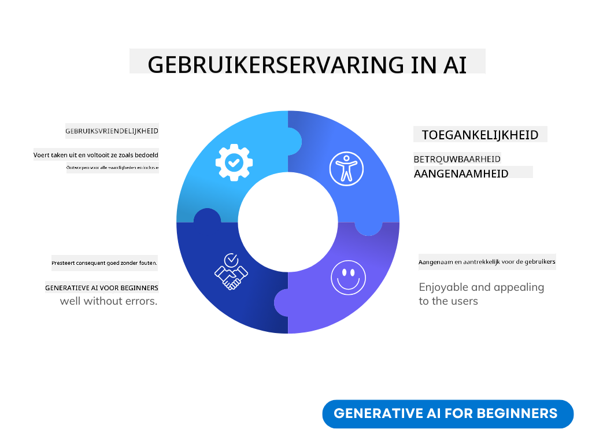

<!--
CO_OP_TRANSLATOR_METADATA:
{
  "original_hash": "747668e4c53d067369f06e9ec2e6313e",
  "translation_date": "2025-08-26T17:55:46+00:00",
  "source_file": "12-designing-ux-for-ai-applications/README.md",
  "language_code": "nl"
}
-->
# UX ontwerpen voor AI-toepassingen

> _(Klik op de afbeelding hierboven om de video van deze les te bekijken)_

Gebruikerservaring is een heel belangrijk onderdeel bij het bouwen van apps. Gebruikers moeten je app efficiënt kunnen gebruiken om taken uit te voeren. Efficiëntie is belangrijk, maar je moet er ook voor zorgen dat je apps door iedereen gebruikt kunnen worden, zodat ze _toegankelijk_ zijn. In dit hoofdstuk gaan we hier dieper op in, zodat je hopelijk een app ontwerpt die mensen kunnen én willen gebruiken.

## Introductie

Gebruikerservaring gaat over hoe een gebruiker omgaat met en gebruikmaakt van een bepaald product of dienst, of het nu een systeem, tool of ontwerp is. Bij het ontwikkelen van AI-toepassingen richten ontwikkelaars zich niet alleen op een effectieve gebruikerservaring, maar ook op ethiek. In deze les behandelen we hoe je AI-toepassingen bouwt die inspelen op de behoeften van gebruikers.

De les behandelt de volgende onderwerpen:

- Introductie tot gebruikerservaring en het begrijpen van gebruikersbehoeften
- AI-toepassingen ontwerpen voor vertrouwen en transparantie
- AI-toepassingen ontwerpen voor samenwerking en feedback

## Leerdoelen

Na deze les kun je:

- Begrijpen hoe je AI-toepassingen bouwt die aansluiten bij de behoeften van gebruikers.
- AI-toepassingen ontwerpen die vertrouwen en samenwerking bevorderen.

### Voorkennis

Neem de tijd om meer te lezen over [gebruikerservaring en design thinking.](https://learn.microsoft.com/training/modules/ux-design?WT.mc_id=academic-105485-koreyst)

## Introductie tot gebruikerservaring en het begrijpen van gebruikersbehoeften

In onze fictieve onderwijs-startup hebben we twee hoofdgebruikers: docenten en studenten. Beide groepen hebben hun eigen behoeften. Een ontwerp dat de gebruiker centraal stelt, zorgt ervoor dat het product relevant en nuttig is voor wie het bedoeld is.

De applicatie moet **nuttig, betrouwbaar, toegankelijk en prettig** zijn om een goede gebruikerservaring te bieden.

### Bruikbaarheid

Nuttig zijn betekent dat de applicatie functies heeft die passen bij het doel, zoals het automatiseren van het nakijkproces of het genereren van flitskaarten voor herhaling. Een applicatie die het nakijken automatiseert, moet in staat zijn om nauwkeurig en efficiënt cijfers toe te kennen aan het werk van studenten op basis van vooraf bepaalde criteria. Op dezelfde manier moet een applicatie die flitskaarten maakt, relevante en gevarieerde vragen kunnen genereren op basis van de beschikbare data.

### Betrouwbaarheid

Betrouwbaar zijn betekent dat de applicatie haar taak consequent en zonder fouten kan uitvoeren. Maar AI is, net als mensen, niet perfect en kan fouten maken. De applicaties kunnen fouten tegenkomen of onverwachte situaties die menselijke tussenkomst of correctie vereisen. Hoe ga je om met fouten? In het laatste deel van deze les bespreken we hoe AI-systemen en -applicaties worden ontworpen voor samenwerking en feedback.

### Toegankelijkheid

Toegankelijk zijn betekent dat de gebruikerservaring wordt uitgebreid naar mensen met verschillende mogelijkheden, ook mensen met een beperking, zodat niemand wordt buitengesloten. Door toegankelijkheidsrichtlijnen en -principes te volgen, worden AI-oplossingen inclusiever, bruikbaarder en nuttiger voor alle gebruikers.

### Prettig

Prettig zijn betekent dat de applicatie fijn is om te gebruiken. Een aantrekkelijke gebruikerservaring kan een positieve invloed hebben op de gebruiker, waardoor diegene terugkomt naar de applicatie en de omzet stijgt.

Niet elk probleem kan met AI worden opgelost. AI is bedoeld om je gebruikerservaring te versterken, bijvoorbeeld door handmatige taken te automatiseren of gebruikerservaringen te personaliseren.

## AI-toepassingen ontwerpen voor vertrouwen en transparantie

Vertrouwen opbouwen is cruciaal bij het ontwerpen van AI-toepassingen. Vertrouwen zorgt ervoor dat een gebruiker erop vertrouwt dat de applicatie het werk doet, consequent resultaten levert en dat die resultaten aansluiten bij wat de gebruiker nodig heeft. Een risico hier is wantrouwen of juist te veel vertrouwen. Wantrouwen ontstaat als een gebruiker weinig of geen vertrouwen heeft in een AI-systeem, waardoor de gebruiker je applicatie afwijst. Te veel vertrouwen ontstaat als een gebruiker de mogelijkheden van een AI-systeem overschat, waardoor gebruikers het AI-systeem te veel vertrouwen. Bijvoorbeeld, een geautomatiseerd nakijksysteem kan bij te veel vertrouwen ertoe leiden dat een docent sommige toetsen niet meer controleert om te kijken of het systeem goed werkt. Dit kan leiden tot oneerlijke of onjuiste cijfers voor studenten, of gemiste kansen voor feedback en verbetering.

Twee manieren om vertrouwen centraal te stellen in het ontwerp zijn uitlegbaarheid en controle.

### Uitlegbaarheid

Wanneer AI helpt bij het nemen van beslissingen, zoals het overdragen van kennis aan toekomstige generaties, is het belangrijk dat docenten en ouders begrijpen hoe AI-beslissingen worden genomen. Dit noemen we uitlegbaarheid: begrijpen hoe AI-toepassingen tot hun beslissingen komen. Ontwerpen voor uitlegbaarheid betekent dat je details toevoegt die laten zien hoe AI tot het resultaat is gekomen. De gebruiker moet weten dat het resultaat door AI is gegenereerd en niet door een mens. Bijvoorbeeld, in plaats van "Begin nu met chatten met je tutor" kun je zeggen: "Gebruik de AI-tutor die zich aanpast aan jouw behoeften en je helpt op jouw tempo te leren."

Een ander voorbeeld is hoe AI omgaat met gebruikers- en persoonlijke data. Bijvoorbeeld, een gebruiker met de persona student kan beperkingen hebben op basis van die persona. De AI mag misschien geen antwoorden op vragen geven, maar kan wel helpen om de gebruiker te begeleiden bij het oplossen van een probleem.

Een laatste belangrijk onderdeel van uitlegbaarheid is het vereenvoudigen van uitleg. Studenten en docenten zijn vaak geen AI-experts, dus uitleg over wat de applicatie wel of niet kan moet eenvoudig en begrijpelijk zijn.

### Controle

Generatieve AI zorgt voor samenwerking tussen AI en gebruiker, waarbij een gebruiker bijvoorbeeld prompts kan aanpassen voor verschillende resultaten. Daarnaast moet een gebruiker, zodra er een resultaat is gegenereerd, het resultaat kunnen aanpassen, zodat ze het gevoel hebben controle te hebben. Bijvoorbeeld, bij Bing kun je je prompt aanpassen op formaat, toon en lengte. Ook kun je wijzigingen aanbrengen in je resultaat en het aanpassen zoals hieronder te zien is:

Een andere functie in Bing die de gebruiker controle geeft over de applicatie is de mogelijkheid om zelf te kiezen of je data door AI gebruikt mag worden. Voor een schoolapplicatie wil een student misschien zijn eigen aantekeningen en de bronnen van de docent gebruiken als studiemateriaal.

> Bij het ontwerpen van AI-toepassingen is het belangrijk om bewust te zijn van het risico dat gebruikers te veel vertrouwen krijgen en onrealistische verwachtingen van de mogelijkheden. Een manier om dit te voorkomen is door wat 'frictie' te creëren tussen de prompts en de resultaten. Herinner de gebruiker eraan dat dit AI is en geen mens.

## AI-toepassingen ontwerpen voor samenwerking en feedback

Zoals eerder genoemd, zorgt generatieve AI voor samenwerking tussen gebruiker en AI. Meestal voert een gebruiker een prompt in en genereert de AI een resultaat. Maar wat als het resultaat niet klopt? Hoe gaat de applicatie om met fouten als die voorkomen? Geeft de AI de gebruiker de schuld of wordt de fout uitgelegd?

AI-toepassingen moeten gebouwd zijn om feedback te ontvangen en te geven. Dit helpt niet alleen het AI-systeem te verbeteren, maar bouwt ook vertrouwen op bij gebruikers. Een feedbackmechanisme moet in het ontwerp zitten, bijvoorbeeld een simpele duim omhoog of omlaag bij het resultaat.

Een andere manier om hiermee om te gaan is door duidelijk te communiceren wat het systeem wel en niet kan. Als een gebruiker een fout maakt door iets te vragen wat buiten de mogelijkheden van de AI valt, moet er ook een manier zijn om dit op te vangen, zoals hieronder te zien is.

Systeemfouten komen vaak voor bij applicaties waarbij de gebruiker hulp nodig heeft met informatie die buiten het bereik van de AI valt, of de applicatie een limiet heeft aan het aantal vragen/vakken waarvoor een gebruiker samenvattingen kan genereren. Bijvoorbeeld, een AI-applicatie die getraind is op data van een beperkt aantal vakken, zoals geschiedenis en wiskunde, kan geen vragen over aardrijkskunde beantwoorden. Om dit op te lossen kan het AI-systeem reageren met: "Sorry, ons product is getraind met data in de volgende vakken....., ik kan niet reageren op de vraag die je stelde."

AI-toepassingen zijn niet perfect, dus ze zullen fouten maken. Bij het ontwerpen van je applicaties moet je zorgen dat er ruimte is voor feedback van gebruikers en dat fouten op een eenvoudige en begrijpelijke manier worden afgehandeld.

## Opdracht

Neem een AI-app die je tot nu toe hebt gebouwd en kijk of je onderstaande stappen kunt toepassen in je app:

- **Prettig:** Bedenk hoe je je app prettiger kunt maken. Voeg je overal uitleg toe? Moedig je de gebruiker aan om te ontdekken? Hoe formuleer je je foutmeldingen?

- **Bruikbaarheid:** Bouw je een webapp? Zorg dat je app te bedienen is met zowel muis als toetsenbord.

- **Vertrouwen en transparantie:** Vertrouw niet volledig op de AI en haar resultaten, bedenk hoe je een mens in het proces kunt toevoegen om het resultaat te controleren. Denk ook na over andere manieren om vertrouwen en transparantie te bereiken en voer ze uit.

- **Controle:** Geef de gebruiker controle over de data die ze aan de applicatie geven. Implementeer een manier waarop een gebruiker kan kiezen om wel of niet mee te doen aan dataverzameling in de AI-applicatie.

## Ga verder met leren!

Na het afronden van deze les kun je onze [Generative AI Learning collectie](https://aka.ms/genai-collection?WT.mc_id=academic-105485-koreyst) bekijken om je kennis over Generative AI verder uit te breiden!

Ga door naar Les 13, waarin we kijken naar [AI-toepassingen beveiligen](../13-securing-ai-applications/README.md?WT.mc_id=academic-105485-koreyst)!

---

**Disclaimer**:  
Dit document is vertaald met behulp van de AI-vertalingsdienst [Co-op Translator](https://github.com/Azure/co-op-translator). Hoewel we streven naar nauwkeurigheid, dient u er rekening mee te houden dat geautomatiseerde vertalingen fouten of onnauwkeurigheden kunnen bevatten. Het originele document in de oorspronkelijke taal moet worden beschouwd als de gezaghebbende bron. Voor kritische informatie wordt professionele menselijke vertaling aanbevolen. Wij zijn niet aansprakelijk voor eventuele misverstanden of verkeerde interpretaties die voortvloeien uit het gebruik van deze vertaling.