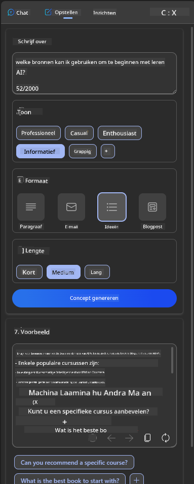
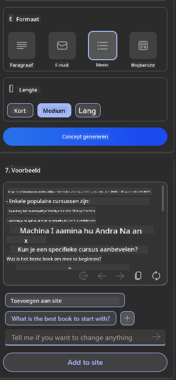

<!--
CO_OP_TRANSLATOR_METADATA:
{
  "original_hash": "ec385b41ee50579025d50cc03bfb3a25",
  "translation_date": "2025-07-09T15:00:21+00:00",
  "source_file": "12-designing-ux-for-ai-applications/README.md",
  "language_code": "nl"
}
-->
# UX ontwerpen voor AI-toepassingen

> _(Klik op de afbeelding hierboven om de video van deze les te bekijken)_

Gebruikerservaring is een zeer belangrijk aspect bij het bouwen van apps. Gebruikers moeten je app op een efficiënte manier kunnen gebruiken om taken uit te voeren. Efficiënt zijn is één ding, maar je moet apps ook zo ontwerpen dat ze door iedereen gebruikt kunnen worden, om ze _toegankelijk_ te maken. Dit hoofdstuk richt zich op dit gebied, zodat je hopelijk een app ontwerpt die mensen kunnen en willen gebruiken.

## Introductie

Gebruikerservaring is hoe een gebruiker interactie heeft met en gebruikmaakt van een specifiek product of dienst, of het nu een systeem, tool of ontwerp is. Bij het ontwikkelen van AI-toepassingen richten ontwikkelaars zich niet alleen op het zorgen voor een effectieve gebruikerservaring, maar ook op ethiek. In deze les behandelen we hoe je Artificial Intelligence (AI)-toepassingen bouwt die inspelen op de behoeften van gebruikers.

De les behandelt de volgende onderwerpen:

- Introductie tot gebruikerservaring en het begrijpen van gebruikersbehoeften
- AI-toepassingen ontwerpen voor vertrouwen en transparantie
- AI-toepassingen ontwerpen voor samenwerking en feedback

## Leerdoelen

Na het volgen van deze les kun je:

- Begrijpen hoe je AI-toepassingen bouwt die voldoen aan de behoeften van gebruikers.
- AI-toepassingen ontwerpen die vertrouwen en samenwerking bevorderen.

### Vereisten

Neem de tijd om meer te lezen over [gebruikerservaring en design thinking.](https://learn.microsoft.com/training/modules/ux-design?WT.mc_id=academic-105485-koreyst)

## Introductie tot gebruikerservaring en het begrijpen van gebruikersbehoeften

In onze fictieve onderwijs-startup hebben we twee primaire gebruikers: leraren en studenten. Elk van deze gebruikers heeft unieke behoeften. Een gebruikersgericht ontwerp plaatst de gebruiker centraal, zodat de producten relevant en nuttig zijn voor degenen voor wie ze bedoeld zijn.

De applicatie moet **bruikbaar, betrouwbaar, toegankelijk en prettig** zijn om een goede gebruikerservaring te bieden.

### Bruikbaarheid

Bruikbaar zijn betekent dat de applicatie functionaliteit heeft die aansluit bij het beoogde doel, zoals het automatiseren van het beoordelingsproces of het genereren van flashcards voor herhaling. Een applicatie die het beoordelingsproces automatiseert, moet in staat zijn om nauwkeurig en efficiënt scores toe te kennen aan het werk van studenten op basis van vooraf bepaalde criteria. Evenzo moet een applicatie die flashcards genereert, relevante en gevarieerde vragen kunnen maken op basis van de beschikbare data.

### Betrouwbaarheid

Betrouwbaar zijn betekent dat de applicatie zijn taak consistent en zonder fouten kan uitvoeren. AI is echter, net als mensen, niet perfect en kan fouten maken. De applicaties kunnen fouten of onverwachte situaties tegenkomen die menselijke tussenkomst of correctie vereisen. Hoe ga je om met fouten? In het laatste deel van deze les behandelen we hoe AI-systemen en applicaties ontworpen worden voor samenwerking en feedback.

### Toegankelijkheid

Toegankelijk zijn betekent dat de gebruikerservaring wordt uitgebreid naar gebruikers met verschillende mogelijkheden, inclusief mensen met een beperking, zodat niemand wordt buitengesloten. Door richtlijnen en principes voor toegankelijkheid te volgen, worden AI-oplossingen inclusiever, gebruiksvriendelijker en nuttiger voor alle gebruikers.

### Prettig

Prettig zijn betekent dat de applicatie plezierig is om te gebruiken. Een aantrekkelijke gebruikerservaring kan een positieve invloed hebben op de gebruiker, waardoor deze terugkeert naar de applicatie en de omzet van het bedrijf stijgt.

Niet elke uitdaging kan met AI worden opgelost. AI komt om je gebruikerservaring te versterken, bijvoorbeeld door handmatige taken te automatiseren of gebruikerservaringen te personaliseren.

## AI-toepassingen ontwerpen voor vertrouwen en transparantie

Vertrouwen opbouwen is cruciaal bij het ontwerpen van AI-toepassingen. Vertrouwen zorgt ervoor dat een gebruiker erop vertrouwt dat de applicatie het werk doet, consequent resultaten levert en dat die resultaten zijn wat de gebruiker nodig heeft. Een risico in dit gebied is wantrouwen en overmatig vertrouwen. Wantrouwen ontstaat wanneer een gebruiker weinig of geen vertrouwen heeft in een AI-systeem, wat ertoe leidt dat de gebruiker je applicatie afwijst. Overmatig vertrouwen ontstaat wanneer een gebruiker de capaciteiten van een AI-systeem overschat, waardoor gebruikers het AI-systeem te veel vertrouwen. Bijvoorbeeld, bij een geautomatiseerd beoordelingssysteem kan overmatig vertrouwen ertoe leiden dat een leraar sommige papieren niet meer controleert om te zien of het beoordelingssysteem goed werkt. Dit kan resulteren in oneerlijke of onnauwkeurige cijfers voor studenten, of gemiste kansen voor feedback en verbetering.

Twee manieren om ervoor te zorgen dat vertrouwen centraal staat in het ontwerp zijn uitlegbaarheid en controle.

### Uitlegbaarheid

Wanneer AI helpt bij het nemen van beslissingen, zoals het overdragen van kennis aan toekomstige generaties, is het essentieel dat leraren en ouders begrijpen hoe AI-beslissingen worden genomen. Dit is uitlegbaarheid – begrijpen hoe AI-toepassingen beslissingen maken. Ontwerpen voor uitlegbaarheid betekent onder andere het toevoegen van voorbeelden van wat een AI-applicatie kan doen. Bijvoorbeeld, in plaats van "Begin met AI-leraar", kan het systeem zeggen: "Vat je aantekeningen samen voor makkelijker herhalen met AI."

Een ander voorbeeld is hoe AI gebruikers- en persoonlijke gegevens gebruikt. Bijvoorbeeld, een gebruiker met de persona student kan beperkingen hebben op basis van die persona. De AI kan mogelijk geen antwoorden geven op vragen, maar kan de gebruiker wel helpen nadenken over hoe ze een probleem kunnen oplossen.

Een laatste belangrijk onderdeel van uitlegbaarheid is het vereenvoudigen van uitleg. Studenten en leraren zijn misschien geen AI-experts, daarom moeten de uitleg over wat de applicatie wel of niet kan doen eenvoudig en makkelijk te begrijpen zijn.

### Controle

Generatieve AI creëert een samenwerking tussen AI en de gebruiker, waarbij een gebruiker bijvoorbeeld prompts kan aanpassen voor verschillende resultaten. Daarnaast moeten gebruikers, zodra een output is gegenereerd, de resultaten kunnen aanpassen, zodat ze het gevoel van controle hebben. Bijvoorbeeld, bij het gebruik van Bing kun je je prompt afstemmen op formaat, toon en lengte. Ook kun je wijzigingen aanbrengen in je output en deze aanpassen, zoals hieronder te zien is:

Een andere functie in Bing die gebruikers controle geeft over de applicatie is de mogelijkheid om in- en uit te schakelen welke data AI gebruikt. Voor een schoolapplicatie wil een student misschien zijn eigen aantekeningen gebruiken, evenals de bronnen van de leraren als studiemateriaal.

> Bij het ontwerpen van AI-toepassingen is doelgerichtheid essentieel om te voorkomen dat gebruikers te veel vertrouwen krijgen en onrealistische verwachtingen van de mogelijkheden ontwikkelen. Een manier om dit te doen is door wrijving te creëren tussen de prompts en de resultaten. Zo herinner je de gebruiker eraan dat dit AI is en geen medemens.

## AI-toepassingen ontwerpen voor samenwerking en feedback

Zoals eerder genoemd, creëert generatieve AI een samenwerking tussen de gebruiker en AI. Meestal voert een gebruiker een prompt in en genereert de AI een output. Wat als de output onjuist is? Hoe gaat de applicatie om met fouten als die optreden? Geeft de AI de gebruiker de schuld of neemt het de tijd om de fout uit te leggen?

AI-toepassingen moeten zo worden gebouwd dat ze feedback kunnen ontvangen en geven. Dit helpt niet alleen het AI-systeem te verbeteren, maar bouwt ook vertrouwen op bij de gebruikers. Een feedbacklus moet worden opgenomen in het ontwerp, bijvoorbeeld een simpele duim omhoog of omlaag bij de output.

Een andere manier om hiermee om te gaan is door duidelijk te communiceren wat de mogelijkheden en beperkingen van het systeem zijn. Wanneer een gebruiker een fout maakt door iets te vragen wat buiten de capaciteiten van de AI ligt, moet er ook een manier zijn om dit af te handelen, zoals hieronder wordt getoond.

Systeemfouten komen vaak voor bij applicaties waarbij de gebruiker mogelijk hulp nodig heeft met informatie buiten het bereik van de AI, of wanneer de applicatie een limiet heeft op het aantal vragen/onderwerpen waarvoor een gebruiker samenvattingen kan genereren. Bijvoorbeeld, een AI-applicatie die getraind is met data over beperkte vakken, zoals geschiedenis en wiskunde, kan mogelijk geen vragen over aardrijkskunde beantwoorden. Om dit te voorkomen kan het AI-systeem een reactie geven zoals: "Sorry, ons product is getraind met data over de volgende vakken....., ik kan de vraag die je stelde niet beantwoorden."

AI-toepassingen zijn niet perfect, daarom zullen ze fouten maken. Bij het ontwerpen van je applicaties moet je ruimte creëren voor feedback van gebruikers en foutafhandeling op een manier die eenvoudig en makkelijk uit te leggen is.

## Opdracht

Neem een AI-app die je tot nu toe hebt gebouwd en overweeg de onderstaande stappen in je app te implementeren:

- **Prettig:** Denk na over hoe je je app prettiger kunt maken. Voeg je overal uitleg toe? Moedig je de gebruiker aan om te verkennen? Hoe formuleer je je foutmeldingen?

- **Bruikbaarheid:** Bouw je een webapp? Zorg ervoor dat je app navigeerbaar is met zowel muis als toetsenbord.

- **Vertrouwen en transparantie:** Vertrouw niet volledig op de AI en de output. Overweeg hoe je een mens kunt toevoegen aan het proces om de output te verifiëren. Overweeg en implementeer ook andere manieren om vertrouwen en transparantie te bereiken.

- **Controle:** Geef de gebruiker controle over de data die ze aan de applicatie leveren. Implementeer een manier waarop een gebruiker kan kiezen om wel of niet mee te doen aan dataverzameling in de AI-applicatie.

## Ga door met leren!

Na het voltooien van deze les, bekijk onze [Generative AI Learning collection](https://aka.ms/genai-collection?WT.mc_id=academic-105485-koreyst) om je kennis van Generative AI verder te verdiepen!

Ga door naar Les 13, waar we kijken naar hoe je [AI-toepassingen beveiligt](../13-securing-ai-applications/README.md?WT.mc_id=academic-105485-koreyst)!

**Disclaimer**:  
Dit document is vertaald met behulp van de AI-vertalingsdienst [Co-op Translator](https://github.com/Azure/co-op-translator). Hoewel we streven naar nauwkeurigheid, dient u er rekening mee te houden dat geautomatiseerde vertalingen fouten of onnauwkeurigheden kunnen bevatten. Het originele document in de oorspronkelijke taal moet als de gezaghebbende bron worden beschouwd. Voor cruciale informatie wordt professionele menselijke vertaling aanbevolen. Wij zijn niet aansprakelijk voor eventuele misverstanden of verkeerde interpretaties die voortvloeien uit het gebruik van deze vertaling.