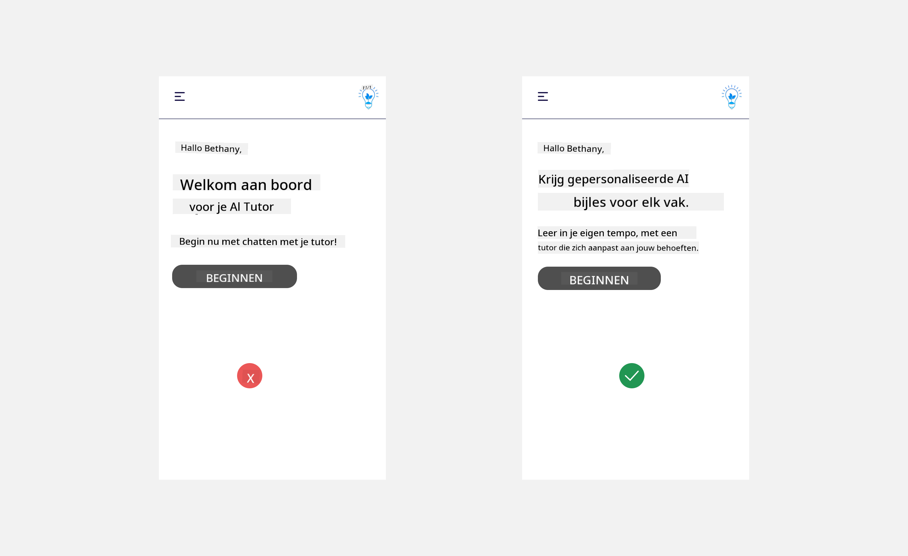

<!--
CO_OP_TRANSLATOR_METADATA:
{
  "original_hash": "78bbeed50fd4dc9fdee931f5daf98cb3",
  "translation_date": "2025-10-17T19:51:14+00:00",
  "source_file": "12-designing-ux-for-ai-applications/README.md",
  "language_code": "nl"
}
-->
# Ontwerpen van UX voor AI-toepassingen

> _(Klik op de afbeelding hierboven om de video van deze les te bekijken)_

Gebruikerservaring is een zeer belangrijk aspect bij het bouwen van apps. Gebruikers moeten je app op een efficiënte manier kunnen gebruiken om taken uit te voeren. Efficiëntie is één ding, maar je moet ook apps ontwerpen die door iedereen gebruikt kunnen worden, zodat ze _toegankelijk_ zijn. Dit hoofdstuk richt zich op dit gebied, zodat je hopelijk een app ontwerpt die mensen kunnen en willen gebruiken.

## Introductie

Gebruikerservaring is hoe een gebruiker interacteert met en gebruikmaakt van een specifiek product of dienst, of het nu een systeem, hulpmiddel of ontwerp is. Bij het ontwikkelen van AI-toepassingen richten ontwikkelaars zich niet alleen op het waarborgen van een effectieve gebruikerservaring, maar ook op ethiek. In deze les behandelen we hoe je toepassingen voor kunstmatige intelligentie (AI) bouwt die voldoen aan de behoeften van gebruikers.

De les behandelt de volgende onderwerpen:

- Introductie tot gebruikerservaring en het begrijpen van gebruikersbehoeften
- Ontwerpen van AI-toepassingen voor vertrouwen en transparantie
- Ontwerpen van AI-toepassingen voor samenwerking en feedback

## Leerdoelen

Na het volgen van deze les kun je:

- Begrijpen hoe je AI-toepassingen bouwt die voldoen aan de behoeften van gebruikers.
- AI-toepassingen ontwerpen die vertrouwen en samenwerking bevorderen.

### Vereiste voorkennis

Neem de tijd om meer te lezen over [gebruikerservaring en design thinking.](https://learn.microsoft.com/training/modules/ux-design?WT.mc_id=academic-105485-koreyst)

## Introductie tot gebruikerservaring en het begrijpen van gebruikersbehoeften

Bij onze fictieve educatieve startup hebben we twee primaire gebruikers: docenten en studenten. Elk van deze gebruikers heeft unieke behoeften. Een gebruikersgericht ontwerp geeft prioriteit aan de gebruiker en zorgt ervoor dat de producten relevant en nuttig zijn voor degenen waarvoor ze bedoeld zijn.

De applicatie moet **nuttig, betrouwbaar, toegankelijk en aangenaam** zijn om een goede gebruikerservaring te bieden.

### Bruikbaarheid

Nuttig zijn betekent dat de applicatie functionaliteit heeft die aansluit bij het beoogde doel, zoals het automatiseren van het beoordelingsproces of het genereren van flashcards voor herhaling. Een applicatie die het beoordelingsproces automatiseert, moet in staat zijn om scores nauwkeurig en efficiënt toe te wijzen aan het werk van studenten op basis van vooraf gedefinieerde criteria. Evenzo moet een applicatie die herhalingsflashcards genereert relevante en diverse vragen kunnen maken op basis van zijn gegevens.

### Betrouwbaarheid

Betrouwbaar zijn betekent dat de applicatie haar taak consistent en zonder fouten kan uitvoeren. AI, net als mensen, is echter niet perfect en kan fouten maken. De applicaties kunnen fouten of onverwachte situaties tegenkomen die menselijke tussenkomst of correctie vereisen. Hoe ga je om met fouten? In het laatste deel van deze les behandelen we hoe AI-systemen en -toepassingen zijn ontworpen voor samenwerking en feedback.

### Toegankelijkheid

Toegankelijk zijn betekent dat de gebruikerservaring wordt uitgebreid naar gebruikers met verschillende mogelijkheden, inclusief mensen met een beperking, zodat niemand wordt buitengesloten. Door richtlijnen en principes voor toegankelijkheid te volgen, worden AI-oplossingen inclusiever, bruikbaarder en nuttiger voor alle gebruikers.

### Aangenaam

Aangenaam zijn betekent dat de applicatie prettig is om te gebruiken. Een aantrekkelijke gebruikerservaring kan een positieve impact hebben op de gebruiker, waardoor deze terugkeert naar de applicatie en de bedrijfsinkomsten toenemen.

Niet elke uitdaging kan worden opgelost met AI. AI wordt ingezet om je gebruikerservaring te verbeteren, bijvoorbeeld door handmatige taken te automatiseren of gebruikerservaringen te personaliseren.

## Ontwerpen van AI-toepassingen voor vertrouwen en transparantie

Vertrouwen opbouwen is cruciaal bij het ontwerpen van AI-toepassingen. Vertrouwen zorgt ervoor dat een gebruiker erop vertrouwt dat de applicatie het werk zal doen, consistent resultaten levert en dat de resultaten zijn wat de gebruiker nodig heeft. Een risico op dit gebied is wantrouwen en overmatig vertrouwen. Wantrouwen ontstaat wanneer een gebruiker weinig of geen vertrouwen heeft in een AI-systeem, wat ertoe leidt dat de gebruiker je applicatie afwijst. Overmatig vertrouwen ontstaat wanneer een gebruiker de capaciteiten van een AI-systeem overschat, waardoor gebruikers het AI-systeem te veel vertrouwen. Bijvoorbeeld, een geautomatiseerd beoordelingssysteem kan bij overmatig vertrouwen ertoe leiden dat de docent sommige werkstukken niet controleert om te zien of het beoordelingssysteem goed werkt. Dit kan resulteren in oneerlijke of onnauwkeurige cijfers voor de studenten, of gemiste kansen voor feedback en verbetering.

Twee manieren om ervoor te zorgen dat vertrouwen centraal staat in het ontwerp zijn uitlegbaarheid en controle.

### Uitlegbaarheid

Wanneer AI helpt bij het nemen van beslissingen, zoals het overdragen van kennis aan toekomstige generaties, is het cruciaal voor docenten en ouders om te begrijpen hoe AI-beslissingen worden genomen. Dit is uitlegbaarheid - begrijpen hoe AI-toepassingen beslissingen nemen. Ontwerpen voor uitlegbaarheid omvat het toevoegen van details die benadrukken hoe AI tot de output is gekomen. Het publiek moet zich ervan bewust zijn dat de output door AI is gegenereerd en niet door een mens. Bijvoorbeeld, in plaats van te zeggen "Begin nu met chatten met je tutor" kun je zeggen "Gebruik een AI-tutor die zich aanpast aan jouw behoeften en je helpt in jouw tempo te leren."

Een ander voorbeeld is hoe AI gebruikmaakt van gebruikers- en persoonlijke gegevens. Bijvoorbeeld, een gebruiker met de persona 'student' kan beperkingen hebben op basis van hun persona. De AI kan mogelijk geen antwoorden op vragen onthullen, maar kan de gebruiker helpen na te denken over hoe ze een probleem kunnen oplossen.

Een laatste belangrijk onderdeel van uitlegbaarheid is het vereenvoudigen van uitleg. Studenten en docenten zijn mogelijk geen AI-experts, daarom moeten de uitleg over wat de applicatie wel of niet kan eenvoudig en gemakkelijk te begrijpen zijn.

### Controle

Generatieve AI creëert een samenwerking tussen AI en de gebruiker, waarbij een gebruiker bijvoorbeeld prompts kan aanpassen voor verschillende resultaten. Bovendien moeten gebruikers, zodra een output is gegenereerd, de resultaten kunnen aanpassen, zodat ze een gevoel van controle hebben. Bijvoorbeeld, bij het gebruik van Bing kun je je prompt aanpassen op basis van formaat, toon en lengte. Daarnaast kun je wijzigingen aanbrengen in je output en deze aanpassen zoals hieronder weergegeven:

Een andere functie in Bing die een gebruiker controle geeft over de applicatie is de mogelijkheid om in te stemmen met of af te zien van de gegevens die AI gebruikt. Voor een schoolapplicatie kan een student bijvoorbeeld zijn notities willen gebruiken, evenals de bronnen van de docent als studiemateriaal.

> Bij het ontwerpen van AI-toepassingen is intentionaliteit essentieel om ervoor te zorgen dat gebruikers niet te veel vertrouwen hebben en onrealistische verwachtingen van de capaciteiten stellen. Een manier om dit te doen is door wrijving te creëren tussen de prompts en de resultaten. Herinner de gebruiker eraan dat dit AI is en geen medemens.

## Ontwerpen van AI-toepassingen voor samenwerking en feedback

Zoals eerder vermeld, creëert generatieve AI een samenwerking tussen de gebruiker en AI. De meeste interacties bestaan uit een gebruiker die een prompt invoert en de AI die een output genereert. Wat als de output onjuist is? Hoe gaat de applicatie om met fouten als ze optreden? Geeft de AI de gebruiker de schuld of neemt het de tijd om de fout uit te leggen?

AI-toepassingen moeten worden ontworpen om feedback te ontvangen en te geven. Dit helpt niet alleen het AI-systeem te verbeteren, maar bouwt ook vertrouwen op bij de gebruikers. Een feedbackloop moet worden opgenomen in het ontwerp, een voorbeeld kan een eenvoudige duim omhoog of omlaag op de output zijn.

Een andere manier om hiermee om te gaan is door duidelijk te communiceren wat de capaciteiten en beperkingen van het systeem zijn. Wanneer een gebruiker een fout maakt door iets te vragen dat buiten de mogelijkheden van de AI ligt, moet er ook een manier zijn om hiermee om te gaan, zoals hieronder weergegeven.

Systeemfouten komen vaak voor bij applicaties waarbij de gebruiker mogelijk hulp nodig heeft met informatie buiten het bereik van de AI, of de applicatie kan een limiet hebben op hoeveel vragen/onderwerpen een gebruiker samenvattingen kan genereren. Bijvoorbeeld, een AI-toepassing die is getraind met gegevens over beperkte onderwerpen, zoals Geschiedenis en Wiskunde, kan mogelijk geen vragen over Aardrijkskunde behandelen. Om dit te beperken kan het AI-systeem een reactie geven zoals: "Sorry, ons product is getraind met gegevens over de volgende onderwerpen....., ik kan niet reageren op de vraag die je hebt gesteld."

AI-toepassingen zijn niet perfect, dus ze zullen fouten maken. Bij het ontwerpen van je applicaties moet je ervoor zorgen dat je ruimte creëert voor feedback van gebruikers en foutafhandeling op een manier die eenvoudig en gemakkelijk uitlegbaar is.

## Opdracht

Neem een van de AI-apps die je tot nu toe hebt gebouwd en overweeg de onderstaande stappen in je app te implementeren:

- **Aangenaam:** Overweeg hoe je je app aangenamer kunt maken. Voeg je overal uitleg toe? Moedig je de gebruiker aan om te verkennen? Hoe formuleer je je foutmeldingen?

- **Bruikbaarheid:** Bouw een webapp. Zorg ervoor dat je app zowel met muis als toetsenbord navigeerbaar is.

- **Vertrouwen en transparantie:** Vertrouw niet volledig op de AI en de output ervan, overweeg hoe je een mens in het proces kunt opnemen om de output te verifiëren. Overweeg en implementeer ook andere manieren om vertrouwen en transparantie te bereiken.

- **Controle:** Geef de gebruiker controle over de gegevens die ze aan de applicatie verstrekken. Implementeer een manier waarop een gebruiker kan instemmen met of afzien van gegevensverzameling in de AI-applicatie.

<!-- ## [Quiz na de les](../../../12-designing-ux-for-ai-applications/quiz-url) -->

## Ga verder met leren!

Na het voltooien van deze les, bekijk onze [Generative AI Learning-collectie](https://aka.ms/genai-collection?WT.mc_id=academic-105485-koreyst) om je kennis over Generatieve AI verder te vergroten!

Ga naar Les 13, waar we gaan kijken naar [het beveiligen van AI-toepassingen](../13-securing-ai-applications/README.md?WT.mc_id=academic-105485-koreyst)!

---

**Disclaimer**:  
Dit document is vertaald met behulp van de AI-vertalingsservice [Co-op Translator](https://github.com/Azure/co-op-translator). Hoewel we streven naar nauwkeurigheid, dient u zich ervan bewust te zijn dat geautomatiseerde vertalingen fouten of onnauwkeurigheden kunnen bevatten. Het originele document in de oorspronkelijke taal moet worden beschouwd als de gezaghebbende bron. Voor kritieke informatie wordt professionele menselijke vertaling aanbevolen. Wij zijn niet aansprakelijk voor eventuele misverstanden of verkeerde interpretaties die voortvloeien uit het gebruik van deze vertaling.