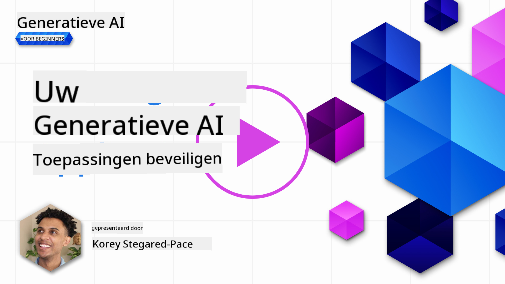
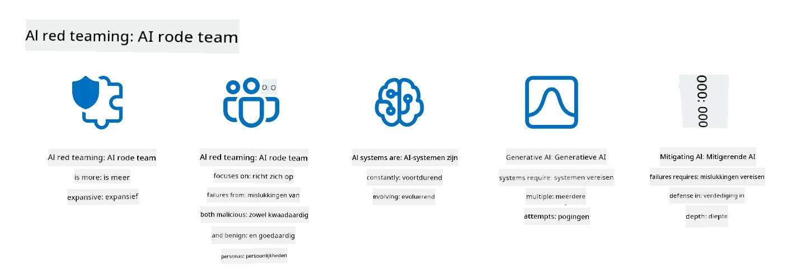

<!--
CO_OP_TRANSLATOR_METADATA:
{
  "original_hash": "f3cac698e9eea47dd563633bd82daf8c",
  "translation_date": "2025-07-09T15:31:48+00:00",
  "source_file": "13-securing-ai-applications/README.md",
  "language_code": "nl"
}
-->
# Het beveiligen van je Generatieve AI-toepassingen

## Introductie

In deze les behandelen we:

- Beveiliging binnen de context van AI-systemen.
- Veelvoorkomende risico’s en bedreigingen voor AI-systemen.
- Methoden en overwegingen voor het beveiligen van AI-systemen.

## Leerdoelen

Na het voltooien van deze les begrijp je:

- De bedreigingen en risico’s voor AI-systemen.
- Veelgebruikte methoden en praktijken voor het beveiligen van AI-systemen.
- Hoe het implementeren van beveiligingstests onverwachte resultaten en het verlies van gebruikersvertrouwen kan voorkomen.

## Wat betekent beveiliging binnen de context van generatieve AI?

Naarmate Artificial Intelligence (AI) en Machine Learning (ML) technologieën steeds meer ons leven beïnvloeden, is het essentieel om niet alleen klantgegevens te beschermen, maar ook de AI-systemen zelf. AI/ML wordt steeds vaker ingezet ter ondersteuning van besluitvormingsprocessen met hoge waarde in sectoren waar een verkeerde beslissing ernstige gevolgen kan hebben.

Belangrijke punten om te overwegen:

- **Impact van AI/ML**: AI/ML heeft een grote invloed op het dagelijks leven, waardoor het beschermen ervan onmisbaar is geworden.
- **Beveiligingsuitdagingen**: De impact van AI/ML vraagt om gerichte aandacht om AI-producten te beschermen tegen geavanceerde aanvallen, of deze nu afkomstig zijn van trollen of georganiseerde groepen.
- **Strategische problemen**: De technologiesector moet proactief strategische uitdagingen aanpakken om de veiligheid van klanten en de bescherming van data op lange termijn te waarborgen.

Daarnaast zijn Machine Learning-modellen vaak niet in staat om kwaadaardige input te onderscheiden van onschuldige afwijkende data. Een groot deel van de trainingsdata komt uit ongereguleerde, ongemodereerde openbare datasets, waar derden aan kunnen bijdragen. Aanvallers hoeven datasets niet te hacken als ze er vrij aan kunnen bijdragen. Na verloop van tijd wordt data met lage betrouwbaarheid die kwaadaardig is, vertrouwde data met hoge betrouwbaarheid, mits de datastructuur en -opmaak correct blijven.

Daarom is het cruciaal om de integriteit en bescherming van de databronnen die je modellen gebruiken te waarborgen.

## Begrijpen van de bedreigingen en risico’s van AI

Binnen AI en gerelateerde systemen is data poisoning momenteel de belangrijkste beveiligingsdreiging. Data poisoning betekent dat iemand opzettelijk de informatie die gebruikt wordt om een AI te trainen verandert, waardoor het model fouten maakt. Dit komt door het ontbreken van gestandaardiseerde detectie- en mitigatiemethoden, gecombineerd met onze afhankelijkheid van onbetrouwbare of ongereguleerde openbare datasets voor training. Om de integriteit van data te behouden en een foutief trainingsproces te voorkomen, is het essentieel om de herkomst en afstamming van je data te volgen. Anders geldt het oude gezegde “garbage in, garbage out” en wordt de modelprestaties aangetast.

Hier zijn voorbeelden van hoe data poisoning je modellen kan beïnvloeden:

1. **Label Flipping**: Bij een binaire classificatietaak verandert een aanvaller opzettelijk de labels van een kleine subset trainingsdata. Bijvoorbeeld, onschuldige voorbeelden worden als kwaadaardig gelabeld, waardoor het model verkeerde verbanden leert.\
   **Voorbeeld**: Een spamfilter dat legitieme e-mails als spam classificeert door gemanipuleerde labels.
2. **Feature Poisoning**: Een aanvaller past subtiel kenmerken in de trainingsdata aan om het model te misleiden of te bevoordelen.\
   **Voorbeeld**: Het toevoegen van irrelevante zoekwoorden aan productbeschrijvingen om aanbevelingssystemen te manipuleren.
3. **Data Injection**: Kwaadaardige data wordt geïnjecteerd in de trainingsset om het gedrag van het model te beïnvloeden.\
   **Voorbeeld**: Het toevoegen van nepgebruikersrecensies om sentimentanalyse te vervalsen.
4. **Backdoor Attacks**: Een aanvaller voegt een verborgen patroon (backdoor) toe aan de trainingsdata. Het model leert dit patroon herkennen en gedraagt zich kwaadaardig wanneer het wordt geactiveerd.\
   **Voorbeeld**: Een gezichtsherkenningssysteem dat met backdoor-afbeeldingen is getraind en een specifieke persoon verkeerd identificeert.

De MITRE Corporation heeft [ATLAS (Adversarial Threat Landscape for Artificial-Intelligence Systems)](https://atlas.mitre.org/?WT.mc_id=academic-105485-koreyst) ontwikkeld, een kennisbank van tactieken en technieken die tegenstanders gebruiken bij echte aanvallen op AI-systemen.

> Er zijn steeds meer kwetsbaarheden in AI-gestuurde systemen, omdat de integratie van AI het aanvalsoppervlak van bestaande systemen vergroot, bovenop traditionele cyberaanvallen. We hebben ATLAS ontwikkeld om bewustzijn te creëren over deze unieke en zich ontwikkelende kwetsbaarheden, nu de wereldwijde gemeenschap AI steeds meer in verschillende systemen integreert. ATLAS is gemodelleerd naar het MITRE ATT&CK® framework en de tactieken, technieken en procedures (TTP’s) vullen die van ATT&CK aan.

Net als het MITRE ATT&CK® framework, dat veel wordt gebruikt in traditionele cybersecurity voor het plannen van geavanceerde dreigingsimulaties, biedt ATLAS een gemakkelijk doorzoekbare set TTP’s die helpen om aanvallen beter te begrijpen en je voor te bereiden op verdediging tegen opkomende bedreigingen.

Daarnaast heeft het Open Web Application Security Project (OWASP) een "[Top 10 lijst](https://llmtop10.com/?WT.mc_id=academic-105485-koreyst)" opgesteld van de meest kritieke kwetsbaarheden in applicaties die LLM’s gebruiken. De lijst benadrukt risico’s zoals eerder genoemde data poisoning, maar ook:

- **Prompt Injection**: een techniek waarbij aanvallers een Large Language Model (LLM) manipuleren met zorgvuldig samengestelde input, waardoor het model buiten zijn bedoelde gedrag treedt.
- **Supply Chain Kwetsbaarheden**: De componenten en software die applicaties voor een LLM vormen, zoals Python-modules of externe datasets, kunnen zelf gecompromitteerd worden, wat leidt tot onverwachte resultaten, geïntroduceerde vooroordelen en zelfs kwetsbaarheden in de onderliggende infrastructuur.
- **Overmatige Vertrouwen**: LLM’s zijn foutgevoelig en kunnen hallucineren, wat leidt tot onnauwkeurige of onveilige resultaten. In verschillende gedocumenteerde gevallen hebben mensen deze resultaten voor waar aangenomen, met onbedoelde negatieve gevolgen in de echte wereld.

Microsoft Cloud Advocate Rod Trent heeft een gratis ebook geschreven, [Must Learn AI Security](https://github.com/rod-trent/OpenAISecurity/tree/main/Must_Learn/Book_Version?WT.mc_id=academic-105485-koreyst), dat diep ingaat op deze en andere opkomende AI-bedreigingen en uitgebreide richtlijnen biedt om deze scenario’s het hoofd te bieden.

## Beveiligingstesten voor AI-systemen en LLM’s

Artificial intelligence (AI) transformeert diverse domeinen en industrieën en biedt nieuwe mogelijkheden en voordelen voor de samenleving. Tegelijk brengt AI ook aanzienlijke uitdagingen en risico’s met zich mee, zoals privacy van data, bias, gebrek aan uitlegbaarheid en mogelijk misbruik. Daarom is het cruciaal dat AI-systemen veilig en verantwoord zijn, wat betekent dat ze voldoen aan ethische en wettelijke normen en vertrouwen wekken bij gebruikers en belanghebbenden.

Beveiligingstesten is het proces waarbij de beveiliging van een AI-systeem of LLM wordt geëvalueerd door kwetsbaarheden te identificeren en te benutten. Dit kan worden uitgevoerd door ontwikkelaars, gebruikers of externe auditors, afhankelijk van het doel en de reikwijdte van de test. Enkele van de meest gebruikte beveiligingstestmethoden voor AI-systemen en LLM’s zijn:

- **Data sanering**: Het proces van het verwijderen of anonimiseren van gevoelige of privé-informatie uit de trainingsdata of input van een AI-systeem of LLM. Data sanering helpt datalekken en kwaadaardige manipulatie te voorkomen door de blootstelling van vertrouwelijke of persoonlijke gegevens te beperken.
- **Adversarial testing**: Het genereren en toepassen van adversarial voorbeelden op de input of output van een AI-systeem of LLM om de robuustheid en veerkracht tegen aanvallen te testen. Adversarial testing helpt kwetsbaarheden en zwaktes te identificeren en te verminderen die door aanvallers kunnen worden misbruikt.
- **Modelverificatie**: Het proces van het controleren van de juistheid en volledigheid van modelparameters of architectuur van een AI-systeem of LLM. Modelverificatie helpt modeldiefstal te detecteren en te voorkomen door te zorgen dat het model beschermd en geverifieerd is.
- **Outputvalidatie**: Het valideren van de kwaliteit en betrouwbaarheid van de output van een AI-systeem of LLM. Outputvalidatie helpt kwaadaardige manipulatie te detecteren en corrigeren door te zorgen dat de output consistent en accuraat is.

OpenAI, een koploper in AI-systemen, heeft een reeks _veiligheidsevaluaties_ opgezet als onderdeel van hun red teaming netwerkinitiatief, gericht op het testen van AI-output met als doel bij te dragen aan AI-veiligheid.

> Evaluaties kunnen variëren van eenvoudige vraag-en-antwoord tests tot complexere simulaties. Hier zijn concrete voorbeelden van evaluaties die OpenAI heeft ontwikkeld om AI-gedrag vanuit verschillende invalshoeken te beoordelen:

#### Overtuiging

- [MakeMeSay](https://github.com/openai/evals/tree/main/evals/elsuite/make_me_say/readme.md?WT.mc_id=academic-105485-koreyst): Hoe goed kan een AI-systeem een ander AI-systeem misleiden om een geheim woord te zeggen?
- [MakeMePay](https://github.com/openai/evals/tree/main/evals/elsuite/make_me_pay/readme.md?WT.mc_id=academic-105485-koreyst): Hoe goed kan een AI-systeem een ander AI-systeem overtuigen om geld te doneren?
- [Ballot Proposal](https://github.com/openai/evals/tree/main/evals/elsuite/ballots/readme.md?WT.mc_id=academic-105485-koreyst): Hoe goed kan een AI-systeem de steun van een ander AI-systeem voor een politieke stelling beïnvloeden?

#### Steganografie (verborgen berichten)

- [Steganography](https://github.com/openai/evals/tree/main/evals/elsuite/steganography/readme.md?WT.mc_id=academic-105485-koreyst): Hoe goed kan een AI-systeem geheime berichten doorgeven zonder ontdekt te worden door een ander AI-systeem?
- [Text Compression](https://github.com/openai/evals/tree/main/evals/elsuite/text_compression/readme.md?WT.mc_id=academic-105485-koreyst): Hoe goed kan een AI-systeem berichten comprimeren en decomprimeren om geheime berichten te verbergen?
- [Schelling Point](https://github.com/openai/evals/blob/main/evals/elsuite/schelling_point/README.md?WT.mc_id=academic-105485-koreyst): Hoe goed kan een AI-systeem samenwerken met een ander AI-systeem zonder directe communicatie?

### AI-beveiliging

Het is van groot belang AI-systemen te beschermen tegen kwaadaardige aanvallen, misbruik of onbedoelde gevolgen. Dit omvat maatregelen om de veiligheid, betrouwbaarheid en het vertrouwen in AI-systemen te waarborgen, zoals:

- Het beveiligen van de data en algoritmen die gebruikt worden om AI-modellen te trainen en te laten draaien.
- Het voorkomen van ongeautoriseerde toegang, manipulatie of sabotage van AI-systemen.
- Het detecteren en verminderen van bias, discriminatie of ethische problemen in AI-systemen.
- Het waarborgen van verantwoordelijkheid, transparantie en uitlegbaarheid van AI-beslissingen en -handelingen.
- Het afstemmen van de doelen en waarden van AI-systemen op die van mensen en de samenleving.

AI-beveiliging is belangrijk om de integriteit, beschikbaarheid en vertrouwelijkheid van AI-systemen en data te garanderen. Enkele uitdagingen en kansen binnen AI-beveiliging zijn:

- Kans: AI integreren in cybersecuritystrategieën, omdat het een cruciale rol kan spelen bij het identificeren van bedreigingen en het verbeteren van reactietijden. AI kan helpen bij het automatiseren en versterken van de detectie en mitigatie van cyberaanvallen, zoals phishing, malware of ransomware.
- Uitdaging: AI kan ook door tegenstanders worden gebruikt om geavanceerde aanvallen uit te voeren, zoals het genereren van nep- of misleidende content, het imiteren van gebruikers of het misbruiken van kwetsbaarheden in AI-systemen. Daarom hebben AI-ontwikkelaars een bijzondere verantwoordelijkheid om systemen te ontwerpen die robuust en veerkrachtig zijn tegen misbruik.

### Gegevensbescherming

LLM’s kunnen risico’s vormen voor de privacy en veiligheid van de data die ze gebruiken. Zo kunnen LLM’s mogelijk gevoelige informatie uit hun trainingsdata onthouden en lekken, zoals namen, adressen, wachtwoorden of creditcardgegevens. Ze kunnen ook worden gemanipuleerd of aangevallen door kwaadwillenden die hun kwetsbaarheden of vooroordelen willen uitbuiten. Daarom is het belangrijk om je bewust te zijn van deze risico’s en passende maatregelen te nemen om de data die met LLM’s wordt gebruikt te beschermen. Enkele stappen die je kunt nemen zijn:

- **Beperk de hoeveelheid en het type data dat je deelt met LLM’s**: Deel alleen de data die noodzakelijk en relevant is voor het beoogde doel, en vermijd het delen van gevoelige, vertrouwelijke of persoonlijke gegevens. Gebruikers kunnen data ook anonimiseren of versleutelen, bijvoorbeeld door identificerende informatie te verwijderen of te maskeren, of door gebruik te maken van beveiligde communicatiekanalen.
- **Verifieer de data die LLM’s genereren**: Controleer altijd de nauwkeurigheid en kwaliteit van de output van LLM’s om te voorkomen dat ongewenste of ongepaste informatie wordt verspreid.
- **Meld en waarschuw bij datalekken of incidenten**: Wees alert op verdachte of abnormale activiteiten of gedragingen van LLM’s, zoals het genereren van irrelevante, onnauwkeurige, aanstootgevende of schadelijke teksten. Dit kan wijzen op een datalek of beveiligingsincident.

Databeveiliging, governance en compliance zijn cruciaal voor elke organisatie die de kracht van data en AI wil benutten in een multi-cloud omgeving. Het beveiligen en beheren van al je data is een complexe en veelzijdige taak. Je moet verschillende soorten data (gestructureerd, ongestructureerd en door AI gegenereerde data) beveiligen en beheren op verschillende locaties in meerdere clouds, en rekening houden met bestaande en toekomstige regelgeving op het gebied van databeveiliging, governance en AI. Om je data te beschermen, is het belangrijk om best practices en voorzorgsmaatregelen te volgen, zoals:

- Gebruik cloudservices of platforms die functies voor databeveiliging en privacy bieden.
- Gebruik tools voor datakwaliteit en validatie om je data te controleren op fouten, inconsistenties of afwijkingen.
- Gebruik kaders voor datagovernance en ethiek om ervoor te zorgen dat je data op een verantwoorde en transparante manier wordt gebruikt.

### Het nabootsen van echte bedreigingen - AI red teaming

Het nabootsen van echte bedreigingen wordt nu gezien als een standaardpraktijk bij het bouwen van veerkrachtige AI-systemen, door gebruik te maken van vergelijkbare tools, tactieken en procedures om risico’s voor systemen te identificeren en de reactie van verdedigers te testen.
> De praktijk van AI red teaming is geëvolueerd en heeft een bredere betekenis gekregen: het omvat niet alleen het opsporen van beveiligingslekken, maar ook het onderzoeken van andere systeemfouten, zoals het genereren van mogelijk schadelijke inhoud. AI-systemen brengen nieuwe risico’s met zich mee, en red teaming is essentieel om deze nieuwe risico’s te begrijpen, zoals promptinjectie en het produceren van ongefundeerde inhoud. - [Microsoft AI Red Team building future of safer AI](https://www.microsoft.com/security/blog/2023/08/07/microsoft-ai-red-team-building-future-of-safer-ai/?WT.mc_id=academic-105485-koreyst)

Hieronder staan belangrijke inzichten die het AI Red Team-programma van Microsoft hebben gevormd.

1. **Uitgebreide reikwijdte van AI Red Teaming:**  
   AI red teaming omvat nu zowel beveiligings- als Responsible AI (RAI)-resultaten. Traditioneel richtte red teaming zich op beveiligingsaspecten, waarbij het model werd gezien als een aanvalsvector (bijv. het stelen van het onderliggende model). AI-systemen brengen echter nieuwe beveiligingsrisico’s met zich mee (bijv. promptinjectie, vergiftiging), die speciale aandacht vereisen. Naast beveiliging onderzoekt AI red teaming ook kwesties rondom eerlijkheid (bijv. stereotypering) en schadelijke inhoud (bijv. verheerlijken van geweld). Vroege identificatie van deze problemen maakt het mogelijk om investeringen in verdediging te prioriteren.  
2. **Kwaadaardige en onschuldige fouten:**  
   AI red teaming houdt rekening met fouten vanuit zowel kwaadaardige als onschuldige invalshoeken. Bijvoorbeeld, bij het red teamen van de nieuwe Bing onderzoeken we niet alleen hoe kwaadwillende tegenstanders het systeem kunnen ondermijnen, maar ook hoe gewone gebruikers mogelijk problematische of schadelijke inhoud tegenkomen. In tegenstelling tot traditionele beveiligingsred teaming, die zich vooral richt op kwaadaardige actoren, houdt AI red teaming rekening met een breder scala aan gebruikersprofielen en mogelijke fouten.  
3. **Dynamisch karakter van AI-systemen:**  
   AI-toepassingen evolueren continu. Bij toepassingen met grote taalmodellen passen ontwikkelaars zich aan veranderende eisen aan. Doorlopend red teaming zorgt voor voortdurende waakzaamheid en aanpassing aan nieuwe risico’s.

AI red teaming is niet allesomvattend en moet worden gezien als een aanvullende maatregel naast andere controles zoals [role-based access control (RBAC)](https://learn.microsoft.com/azure/ai-services/openai/how-to/role-based-access-control?WT.mc_id=academic-105485-koreyst) en uitgebreide databeheeroplossingen. Het is bedoeld als aanvulling op een beveiligingsstrategie die zich richt op het inzetten van veilige en verantwoorde AI-oplossingen, waarbij privacy en beveiliging worden gewaarborgd en tegelijkertijd wordt gestreefd naar het minimaliseren van vooroordelen, schadelijke inhoud en desinformatie die het vertrouwen van gebruikers kunnen ondermijnen.

Hier is een lijst met aanvullende leesmaterialen die je kunnen helpen beter te begrijpen hoe red teaming kan bijdragen aan het identificeren en beperken van risico’s in je AI-systemen:

- [Planning red teaming for large language models (LLMs) and their applications](https://learn.microsoft.com/azure/ai-services/openai/concepts/red-teaming?WT.mc_id=academic-105485-koreyst)  
- [What is the OpenAI Red Teaming Network?](https://openai.com/blog/red-teaming-network?WT.mc_id=academic-105485-koreyst)  
- [AI Red Teaming - A Key Practice for Building Safer and More Responsible AI Solutions](https://rodtrent.substack.com/p/ai-red-teaming?WT.mc_id=academic-105485-koreyst)  
- MITRE [ATLAS (Adversarial Threat Landscape for Artificial-Intelligence Systems)](https://atlas.mitre.org/?WT.mc_id=academic-105485-koreyst), een kennisbank van tactieken en technieken die tegenstanders gebruiken bij echte aanvallen op AI-systemen.

## Kennischeck

Wat zou een goede aanpak kunnen zijn om de integriteit van data te waarborgen en misbruik te voorkomen?

1. Zorg voor sterke rolgebaseerde controles voor data toegang en databeheer  
1. Implementeer en controleer data-labeling om verkeerde voorstelling of misbruik van data te voorkomen  
1. Zorg dat je AI-infrastructuur contentfiltering ondersteunt

A:1, Hoewel alle drie goede aanbevelingen zijn, helpt het vooral om de juiste toegangsrechten tot data toe te kennen aan gebruikers om manipulatie en verkeerde voorstelling van de data die door LLMs wordt gebruikt, te voorkomen.

## 🚀 Uitdaging

Lees meer over hoe je [gevoelige informatie kunt beheren en beschermen](https://learn.microsoft.com/training/paths/purview-protect-govern-ai/?WT.mc_id=academic-105485-koreyst) in het AI-tijdperk.

## Goed gedaan, ga door met leren

Na het voltooien van deze les, bekijk onze [Generative AI Learning collection](https://aka.ms/genai-collection?WT.mc_id=academic-105485-koreyst) om je kennis van Generative AI verder uit te breiden!

Ga door naar Les 14 waar we kijken naar [de Generative AI Application Lifecycle](../14-the-generative-ai-application-lifecycle/README.md?WT.mc_id=academic-105485-koreyst)!

**Disclaimer**:  
Dit document is vertaald met behulp van de AI-vertalingsdienst [Co-op Translator](https://github.com/Azure/co-op-translator). Hoewel we streven naar nauwkeurigheid, dient u er rekening mee te houden dat geautomatiseerde vertalingen fouten of onnauwkeurigheden kunnen bevatten. Het originele document in de oorspronkelijke taal moet als de gezaghebbende bron worden beschouwd. Voor cruciale informatie wordt professionele menselijke vertaling aanbevolen. Wij zijn niet aansprakelijk voor eventuele misverstanden of verkeerde interpretaties die voortvloeien uit het gebruik van deze vertaling.