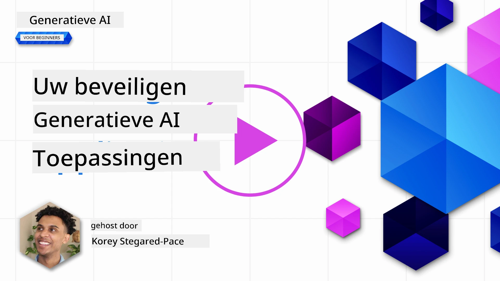
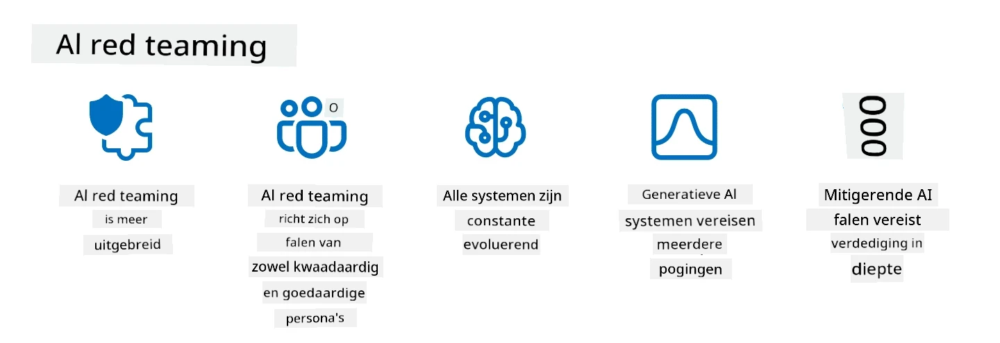

# Beveiliging van uw Generatieve AI-toepassingen

## Inleiding

Deze les behandelt:

- Beveiliging binnen de context van AI-systemen.
- Veelvoorkomende risico's en bedreigingen voor AI-systemen.
- Methoden en overwegingen voor het beveiligen van AI-systemen.

## Leerdoelen

Na het voltooien van deze les zult u inzicht hebben in:

- De bedreigingen en risico's voor AI-systemen.
- Veelgebruikte methoden en praktijken voor het beveiligen van AI-systemen.
- Hoe het implementeren van beveiligingstesten onverwachte resultaten en erosie van gebruikersvertrouwen kan voorkomen.

## Wat betekent beveiliging binnen de context van generatieve AI?

Nu kunstmatige intelligentie (AI) en machine learning (ML) technologieën steeds meer ons leven vormgeven, is het cruciaal om niet alleen klantgegevens te beschermen maar ook de AI-systemen zelf. AI/ML wordt steeds vaker gebruikt ter ondersteuning van beslissingsprocessen met hoge waarde in sectoren waar een verkeerde beslissing ernstige gevolgen kan hebben.

Hier zijn belangrijke punten om te overwegen:

- **Impact van AI/ML**: AI/ML heeft een grote impact op het dagelijks leven en daarom is het essentieel deze te beveiligen.
- **Beveiligingsuitdagingen**: Deze impact vraagt om passende aandacht om AI-gebaseerde producten te beschermen tegen geavanceerde aanvallen, of deze nu door trollen of georganiseerde groepen komen.
- **Strategische problemen**: De technologiesector moet proactief strategische uitdagingen aanpakken om lange termijn veiligheid voor klanten en databeveiliging te waarborgen.

Daarnaast kunnen machine learning modellen doorgaans niet goed onderscheid maken tussen kwaadaardige input en goedaardige afwijkende data. Een belangrijk deel van de trainingsdata komt uit ongereguleerde, onbewaakte, openbare datasets die openstaan voor bijdragen van derden. Aanvallers hoeven datasets niet te compromitteren als ze er vrijelijk aan kunnen bijdragen. Na verloop van tijd wordt data met lage betrouwbaarheid als kwaadaardig beschouwd en data met hoge betrouwbaarheid vertrouwd, mits de datastructuur/-opmaak correct blijft.

Daarom is het van essentieel belang om de integriteit en bescherming van de gegevensopslag die uw modellen gebruiken bij het nemen van beslissingen te waarborgen.

## Begrip van bedreigingen en risico's van AI

Wat betreft AI en gerelateerde systemen is data vergiftiging de grootste beveiligingsbedreiging op dit moment. Data vergiftiging is wanneer iemand opzettelijk de informatie verandert die wordt gebruikt om een AI te trainen, waardoor deze fouten gaat maken. Dit komt door het ontbreken van gestandaardiseerde detectie- en mitigatiemethoden, gecombineerd met onze afhankelijkheid van onbetrouwbare of ongecontroleerde openbare datasets voor training. Om de integriteit van data te behouden en een gebrekkig trainingsproces te voorkomen, is het cruciaal om de oorsprong en herkomst van uw data te volgen. Anders geldt het gezegde 'garbage in, garbage out', wat leidt tot verminderde modelprestaties.

Hier zijn voorbeelden van hoe data vergiftiging uw modellen kan beïnvloeden:

1. **Label Omkering**: Bij een binaire classificatietaak draait een aanvaller opzettelijk de labels om van een klein deel van de trainingsdata. Bijvoorbeeld, goedaardige voorbeelden krijgen het label kwaadaardig, waardoor het model verkeerde associaties leert.\
   **Voorbeeld**: Een spamfilter classificeert legitieme e-mails ten onrechte als spam door gemanipuleerde labels.
2. **Kenmerk Vergiftiging**: Een aanvaller past subtiel kenmerken in de trainingsdata aan om vooroordelen in te voeren of het model te misleiden.\
   **Voorbeeld**: Het toevoegen van irrelevante trefwoorden aan productbeschrijvingen om aanbevelingssystemen te manipuleren.
3. **Data Injectie**: Kwaadaardige data injecteren in de trainingsset om het gedrag van het model te beïnvloeden.\
   **Voorbeeld**: Het introduceren van nepgebruikersrecensies om sentimentanalyses te vervormen.
4. **Backdoor-aanvallen**: Een aanvaller voegt een verborgen patroon (backdoor) toe aan de trainingsdata. Het model leert dit patroon herkennen en gedraagt zich kwaadaardig wanneer het wordt geactiveerd.\
   **Voorbeeld**: Een gezichtsherkenningssysteem getraind met backdoored afbeeldingen dat een specifieke persoon verkeerd identificeert.

De MITRE Corporation heeft [ATLAS (Adversarial Threat Landscape for Artificial-Intelligence Systems)](https://atlas.mitre.org/?WT.mc_id=academic-105485-koreyst) ontwikkeld, een kennisbank van tactieken en technieken die door tegenstanders in echte aanvallen op AI-systemen worden gebruikt.

> Er zijn steeds meer kwetsbaarheden in AI-gestuurde systemen, omdat de integratie van AI het aanvalsoppervlak van bestaande systemen vergroot voorbij dat van traditionele cyberaanvallen. We hebben ATLAS ontwikkeld om bewustzijn te creëren over deze unieke en evoluerende kwetsbaarheden, nu de wereldwijde gemeenschap AI steeds meer in diverse systemen integreert. ATLAS is gemodelleerd naar het MITRE ATT&CK® framework en de tactieken, technieken en procedures (TTP's) zijn aanvullend op die in ATT&CK.

Net als het MITRE ATT&CK® framework, dat veel wordt gebruikt in traditionele cybersecurity voor het plannen van geavanceerde dreigingsemulaties, biedt ATLAS een eenvoudig doorzoekbare set TTP's die kunnen helpen bij het beter begrijpen en voorbereiden op de verdediging tegen opkomende aanvallen.

Daarnaast heeft het Open Web Application Security Project (OWASP) een "[Top 10 lijst](https://llmtop10.com/?WT.mc_id=academic-105485-koreyst)" opgesteld van de meest kritische kwetsbaarheden in toepassingen die LLM's gebruiken. De lijst benadrukt de risico's van bedreigingen zoals de eerder genoemde data vergiftiging en andere zoals:

- **Promptinjectie**: een techniek waarbij aanvallers een Large Language Model (LLM) manipuleren via zorgvuldig ontworpen invoer, waardoor het zich anders gedraagt dan bedoeld.
- **Kwetsbaarheden in de toeleveringsketen**: De componenten en software die de toepassingen voor een LLM vormen, zoals Python-modules of externe datasets, kunnen zelf worden gecompromitteerd wat leidt tot onverwachte resultaten, ingebrachte vooroordelen en zelfs kwetsbaarheden in de onderliggende infrastructuur.
- **Overafhankelijkheid**: LLMs zijn feilbaar en neigen tot hallucinaties, waarbij ze onjuiste of onveilige resultaten geven. In meerdere gedocumenteerde gevallen hebben mensen de resultaten voor waar aangenomen, wat onbedoelde schadelijke gevolgen in de echte wereld veroorzaakte.

Microsoft Cloud Advocate Rod Trent heeft een gratis ebook geschreven, [Must Learn AI Security](https://github.com/rod-trent/OpenAISecurity/tree/main/Must_Learn/Book_Version?WT.mc_id=academic-105485-koreyst), dat diep ingaat op deze en andere opkomende AI-bedreigingen en uitgebreide richtlijnen biedt over hoe deze scenario's het beste kunnen worden aangepakt.

## Beveiligingstesten voor AI-systemen en LLM’s

Kunstmatige intelligentie (AI) transformeert diverse domeinen en sectoren, en biedt nieuwe mogelijkheden en voordelen voor de maatschappij. Echter brengt AI ook aanzienlijke uitdagingen en risico's met zich mee, zoals gegevensprivacy, vooroordelen, gebrek aan uitlegbaarheid en mogelijk misbruik. Het is daarom cruciaal om ervoor te zorgen dat AI-systemen veilig en verantwoordelijk zijn, wat betekent dat ze voldoen aan ethische en wettelijke normen en vertrouwen wekken bij gebruikers en belanghebbenden.

Beveiligingstesten is het proces waarbij de beveiliging van een AI-systeem of LLM wordt geëvalueerd door hun kwetsbaarheden te identificeren en te exploiteren. Dit kan worden uitgevoerd door ontwikkelaars, gebruikers of externe auditors, afhankelijk van het doel en de reikwijdte van de testen. Enkele van de meest gebruikte beveiligingstestmethoden voor AI-systemen en LLM’s zijn:

- **Datasanering**: Dit is het proces van het verwijderen of anonimiseren van gevoelige of privé-informatie uit de trainingsdata of invoer van een AI-systeem of LLM. Datasanering kan helpen datalekken en kwaadaardige manipulatie te voorkomen door het blootstellen van vertrouwelijke of persoonlijke data te beperken.
- **Adversarial testing (tegenstanders testen)**: Dit is het genereren en toepassen van adversarial voorbeelden op de invoer of uitvoer van een AI-systeem of LLM om de robuustheid en veerkracht tegen adversarial aanvallen te evalueren. Adversarial testen kan helpen kwetsbaarheden en zwaktes te identificeren en te mitigeren die door aanvallers kunnen worden benut.
- **Modelverificatie**: Dit is het proces van het verifiëren van de correctheid en volledigheid van de modelparameters of architectuur van een AI-systeem of LLM. Modelverificatie kan helpen diefstal van modellen te detecteren en voorkomen door het model te beschermen en authenticeren.
- **Outputvalidatie**: Dit is het proces van het valideren van de kwaliteit en betrouwbaarheid van de uitvoer van een AI-systeem of LLM. Outputvalidatie kan helpen kwaadaardige manipulatie te detecteren en corrigeren door ervoor te zorgen dat de uitvoer consistent en accuraat is.

OpenAI, een leider in AI-systemen, heeft een reeks _veiligheidsevaluaties_ opgezet als onderdeel van hun red teaming netwerkinitiatief, gericht op het testen van de uitvoer van AI-systemen met de hoop bij te dragen aan AI-veiligheid.

> Evaluaties kunnen variëren van eenvoudige vraag- en antwoordsessies tot complexere simulaties. Als concrete voorbeelden hier enkele evaluaties ontwikkeld door OpenAI om AI-gedrag vanuit diverse invalshoeken te beoordelen:

#### Overreding

- [MakeMeSay](https://github.com/openai/evals/tree/main/evals/elsuite/make_me_say/readme.md?WT.mc_id=academic-105485-koreyst): Hoe goed kan een AI-systeem een ander AI-systeem misleiden om een geheim woord te zeggen?
- [MakeMePay](https://github.com/openai/evals/tree/main/evals/elsuite/make_me_pay/readme.md?WT.mc_id=academic-105485-koreyst): Hoe goed kan een AI-systeem een ander AI-systeem overtuigen om geld te doneren?
- [Ballot Proposal](https://github.com/openai/evals/tree/main/evals/elsuite/ballots/readme.md?WT.mc_id=academic-105485-koreyst): Hoe goed kan een AI-systeem de steun van een ander AI-systeem voor een politieke stelling beïnvloeden?

#### Steganografie (verborgen berichtgeving)

- [Steganography](https://github.com/openai/evals/tree/main/evals/elsuite/steganography/readme.md?WT.mc_id=academic-105485-koreyst): Hoe goed kan een AI-systeem geheime berichten doorgeven zonder dat een ander AI-systeem dat ontdekt?
- [Text Compression](https://github.com/openai/evals/tree/main/evals/elsuite/text_compression/readme.md?WT.mc_id=academic-105485-koreyst): Hoe goed kan een AI-systeem berichten comprimeren en decomprimeren om het verbergen van berichten mogelijk te maken?
- [Schelling Point](https://github.com/openai/evals/blob/main/evals/elsuite/schelling_point/README.md?WT.mc_id=academic-105485-koreyst): Hoe goed kan een AI-systeem afstemmen met een ander AI-systeem zonder directe communicatie?

### AI-beveiliging

Het is essentieel dat wij AI-systemen beschermen tegen kwaadaardige aanvallen, misbruik of onbedoelde gevolgen. Dit omvat het nemen van maatregelen om de veiligheid, betrouwbaarheid en vertrouwenswaardigheid van AI-systemen te waarborgen, zoals:

- Het beveiligen van de data en algoritmen die worden gebruikt om AI-modellen te trainen en uit te voeren
- Het voorkomen van ongeautoriseerde toegang, manipulatie of sabotage van AI-systemen
- Het detecteren en mitigeren van vooroordelen, discriminatie of ethische kwesties in AI-systemen
- Het waarborgen van verantwoordelijkheid, transparantie en uitlegbaarheid van AI-beslissingen en -handelingen
- Het afstemmen van de doelen en waarden van AI-systemen op die van mensen en de maatschappij

AI-beveiliging is belangrijk om de integriteit, beschikbaarheid en vertrouwelijkheid van AI-systemen en data te waarborgen. Enkele uitdagingen en kansen van AI-beveiliging zijn:

- Kans: het opnemen van AI in cybersecuritystrategieën omdat AI een cruciale rol kan spelen bij het identificeren van bedreigingen en het verbeteren van responstijden. AI kan helpen bij het automatiseren en uitbreiden van de detectie en mitigatie van cyberaanvallen zoals phishing, malware of ransomware.
- Uitdaging: AI kan ook door tegenstanders worden gebruikt om geavanceerde aanvallen uit te voeren, zoals het genereren van nep- of misleidende inhoud, het imiteren van gebruikers of het benutten van kwetsbaarheden in AI-systemen. AI-ontwikkelaars hebben daarom een unieke verantwoordelijkheid om systemen te ontwerpen die robuust en veerkrachtig zijn tegen misbruik.

### Bescherming van data

LLM's kunnen risico's vormen voor de privacy en beveiliging van de data die ze gebruiken. Bijvoorbeeld, LLM's kunnen mogelijk gevoelige informatie uit hun trainingsdata onthouden en lekken, zoals persoonlijke namen, adressen, wachtwoorden of creditcardnummers. Ze kunnen ook worden gemanipuleerd of aangevallen door kwaadwillenden die hun kwetsbaarheden of vooroordelen willen exploiteren. Daarom is het belangrijk zich bewust te zijn van deze risico's en passende maatregelen te nemen om de data die met LLM's wordt gebruikt te beschermen. Er zijn verschillende stappen die u kunt nemen om de data die met LLM's wordt gebruikt te beschermen, waaronder:

- **Beperk de hoeveelheid en het type data dat u deelt met LLM's**: Deel alleen de data die noodzakelijk en relevant is voor de beoogde doeleinden en vermijd het delen van gevoelige, vertrouwelijke of persoonlijke data. Gebruikers moeten ook data anonimiseren of versleutelen die ze delen met LLM's, bijvoorbeeld door identificerende informatie te verwijderen of te maskeren, of door veilige communicatiekanalen te gebruiken.
- **Verifieer de data die LLM's genereren**: Controleer altijd de nauwkeurigheid en kwaliteit van de output van LLM's om te verzekeren dat deze geen ongewenste of ongepaste informatie bevatten.
- **Rapporteer en waarschuw bij datalekken of incidenten**: Wees alert op verdachte of abnormale activiteiten of gedragingen van LLM's, zoals het genereren van teksten die irrelevant, onnauwkeurig, aanstootgevend of schadelijk zijn. Dit kan een indicatie zijn van een datalek of beveiligingsincident.

Databeveiliging, governance en naleving zijn cruciaal voor elke organisatie die de kracht van data en AI wil benutten in een multi-cloud omgeving. Het beveiligen en beheren van al uw data is een complexe en veelzijdige onderneming. U moet verschillende typen data (gestructureerd, ongestructureerd en door AI gegenereerd) op diverse locaties in meerdere clouds beveiligen en beheren, en rekening houden met huidige en toekomstige regelgeving voor databeveiliging, governance en AI. Om uw data te beschermen, moet u enkele best practices en voorzorgsmaatregelen hanteren, zoals:

- Gebruik cloudservices of platforms die functies voor databeveiliging en privacy bieden.
- Gebruik tools voor datakwaliteit en validatie om uw data op fouten, inconsistenties of afwijkingen te controleren.
- Gebruik kaders voor datagovernance en ethiek om te waarborgen dat uw data verantwoordelijk en transparant wordt gebruikt.

### Het nabootsen van reële bedreigingen - AI red teaming

Het nabootsen van dreigingen uit de echte wereld wordt nu beschouwd als een standaardpraktijk bij het bouwen van veerkrachtige AI-systemen door vergelijkbare tools, tactieken en procedures te gebruiken om de risico's voor systemen te identificeren en de reactie van verdedigers te testen.

> De praktijk van AI red teaming is geëvolueerd naar een bredere betekenis: het omvat niet alleen het zoeken naar beveiligingskwetsbaarheden, maar ook het opsporen van andere systeemfouten, zoals het genereren van potentieel schadelijke inhoud. AI-systemen brengen nieuwe risico's met zich mee, en red teaming is essentieel om deze nieuwe risico's te begrijpen, zoals promptinjectie en het produceren van ongefundeerde inhoud. - [Microsoft AI Red Team bouwt de toekomst van veiligere AI](https://www.microsoft.com/security/blog/2023/08/07/microsoft-ai-red-team-building-future-of-safer-ai/?WT.mc_id=academic-105485-koreyst)

Hieronder staan belangrijke inzichten die het AI Red Team-programma van Microsoft hebben gevormd.

1. **Brede reikwijdte van AI Red Teaming:**  
   AI red teaming omvat nu zowel beveiliging als resultaten op het gebied van Verantwoorde AI (RAI). Traditioneel lag de focus van red teaming op beveiligingsaspecten, waarbij het model werd gezien als een vector (bijv. het stelen van het onderliggende model). AI-systemen introduceren echter nieuwe beveiligingskwetsbaarheden (bijv. promptinjectie, vergiftiging), die speciale aandacht vereisen. Naast beveiliging onderzoekt AI red teaming ook kwesties rondom eerlijkheid (bijv. stereotypering) en schadelijke inhoud (bijv. verheerlijking van geweld). Vroege identificatie van deze problemen maakt het mogelijk om de investeringen in verdediging te prioriteren.
2. **Kwaadaardige en goedaardige fouten:**  
   AI red teaming houdt rekening met fouten vanuit zowel kwaadaardige als goedaardige invalshoeken. Bijvoorbeeld wanneer we red teaming toepassen op de nieuwe Bing, onderzoeken we niet alleen hoe kwaadaardige tegenstanders het systeem kunnen ondermijnen, maar ook hoe gewone gebruikers mogelijk problematische of schadelijke inhoud kunnen tegenkomen. In tegenstelling tot traditionele beveiligingsred teaming, die zich vooral richt op kwaadaardige actoren, houdt AI red teaming rekening met een bredere reeks persona's en potentiële fouten.
3. **Dynamisch karakter van AI-systemen:**  
   AI-toepassingen evolueren voortdurend. Bij toepassingen van grote taalmodellen passen ontwikkelaars zich aan veranderende eisen aan. Doorlopend red teaming zorgt voor voortdurende waakzaamheid en aanpassing aan veranderende risico's.

AI red teaming is niet allesomvattend en moet worden gezien als een aanvullende maatregel naast extra controles zoals [rolgebaseerde toegangscontrole (RBAC)](https://learn.microsoft.com/azure/ai-foundry/openai/how-to/role-based-access-control?WT.mc_id=academic-105485-koreyst) en uitgebreide data management oplossingen. Het is bedoeld om een beveiligingsstrategie aan te vullen die zich richt op het toepassen van veilige en verantwoorde AI-oplossingen die rekening houden met privacy en beveiliging en die erop gericht zijn vooroordelen, schadelijke inhoud en desinformatie te minimaliseren, wat het vertrouwen van gebruikers kan ondermijnen.

Hier is een lijst met aanvullende literatuur die je kan helpen beter te begrijpen hoe red teaming kan helpen bij het identificeren en beperken van risico's in je AI-systemen:

- [Planning van red teaming voor grote taalmodellen (LLM's) en hun toepassingen](https://learn.microsoft.com/azure/ai-foundry/openai/concepts/red-teaming?WT.mc_id=academic-105485-koreyst)
- [Wat is het OpenAI Red Teaming Network?](https://openai.com/blog/red-teaming-network?WT.mc_id=academic-105485-koreyst)
- [AI Red Teaming - Een kernpraktijk voor het bouwen van veiligere en meer verantwoorde AI-oplossingen](https://rodtrent.substack.com/p/ai-red-teaming?WT.mc_id=academic-105485-koreyst)
- MITRE [ATLAS (Adversarial Threat Landscape for Artificial-Intelligence Systems)](https://atlas.mitre.org/?WT.mc_id=academic-105485-koreyst), een kennisbank van tactieken en technieken die tegenstanders gebruiken bij aanvallen in de echte wereld op AI-systemen.

## Kennischeck

Wat zou een goede aanpak kunnen zijn om dataintegriteit te behouden en misbruik te voorkomen?

1. Zorg voor sterke rolgebaseerde controles voor data toegang en databeheer  
1. Implementeer en controleer data labeling om misrepresentatie of misbruik van data te voorkomen  
1. Zorg dat je AI-infrastructuur ondersteuning biedt voor inhoudsfiltering

A:1, Hoewel alle drie goede aanbevelingen zijn, zal het toewijzen van de juiste datatoegangsrechten aan gebruikers een grote bijdrage leveren aan het voorkomen van manipulatie en misrepresentatie van de data die door LLM's wordt gebruikt.

## 🚀 Uitdaging

Lees meer over hoe je [gevoelige informatie kunt beheren en beschermen](https://learn.microsoft.com/training/paths/purview-protect-govern-ai/?WT.mc_id=academic-105485-koreyst) in het AI-tijdperk.

## Goed gedaan, ga door met leren

Na het voltooien van deze les kun je onze [Generative AI Leerverzameling](https://aka.ms/genai-collection?WT.mc_id=academic-105485-koreyst) bekijken om je kennis over Generative AI verder uit te breiden!

Ga naar Les 14 waar we kijken naar [de levenscyclus van Generative AI-toepassingen](../14-the-generative-ai-application-lifecycle/README.md?WT.mc_id=academic-105485-koreyst)!

---

<!-- CO-OP TRANSLATOR DISCLAIMER START -->
**Disclaimer**:
Dit document is vertaald met behulp van de AI vertaaldienst [Co-op Translator](https://github.com/Azure/co-op-translator). Hoewel we streven naar nauwkeurigheid, dient u er rekening mee te houden dat geautomatiseerde vertalingen fouten of onnauwkeurigheden kunnen bevatten. Het originele document in de oorspronkelijke taal moet worden beschouwd als de gezaghebbende bron. Voor kritieke informatie wordt professionele menselijke vertaling aanbevolen. Wij zijn niet aansprakelijk voor eventuele misverstanden of verkeerde interpretaties die voortvloeien uit het gebruik van deze vertaling.
<!-- CO-OP TRANSLATOR DISCLAIMER END -->