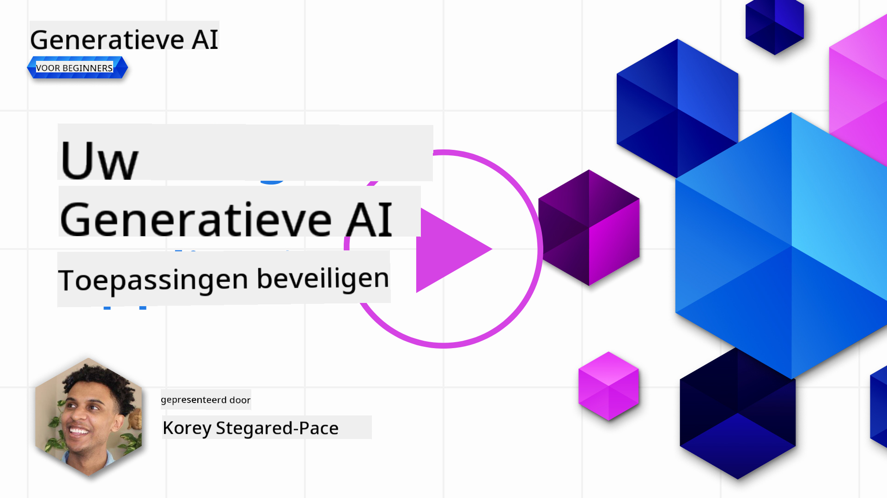
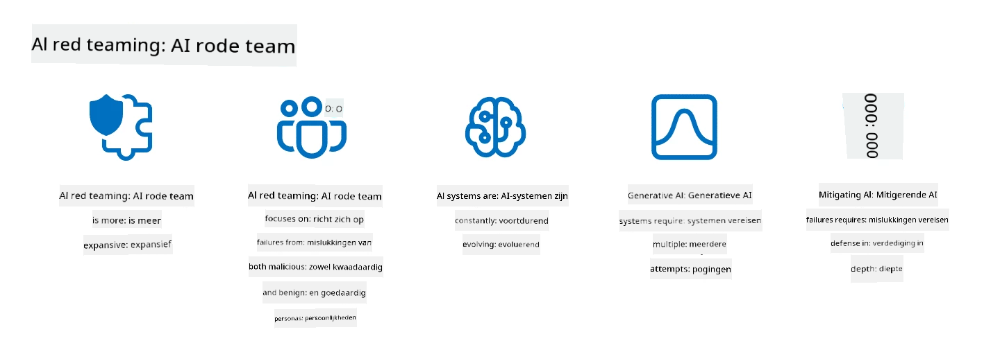

<!--
CO_OP_TRANSLATOR_METADATA:
{
  "original_hash": "f3cac698e9eea47dd563633bd82daf8c",
  "translation_date": "2025-06-25T21:25:02+00:00",
  "source_file": "13-securing-ai-applications/README.md",
  "language_code": "nl"
}
-->
# Beveiliging van uw Generatieve AI-toepassingen

## Inleiding

Deze les behandelt:

- Beveiliging binnen de context van AI-systemen.
- Veelvoorkomende risico's en bedreigingen voor AI-systemen.
- Methoden en overwegingen voor het beveiligen van AI-systemen.

## Leerdoelen

Na het voltooien van deze les heb je inzicht in:

- De bedreigingen en risico's voor AI-systemen.
- Gebruikelijke methoden en praktijken voor het beveiligen van AI-systemen.
- Hoe het implementeren van beveiligingstesten onverwachte resultaten kan voorkomen en het vertrouwen van gebruikers kan behouden.

## Wat betekent beveiliging binnen de context van generatieve AI?

Naarmate Kunstmatige Intelligentie (AI) en Machine Learning (ML) technologieën steeds meer ons leven vormgeven, is het cruciaal om niet alleen klantgegevens te beschermen, maar ook de AI-systemen zelf. AI/ML wordt steeds vaker gebruikt ter ondersteuning van besluitvormingsprocessen met hoge waarde in sectoren waar een verkeerde beslissing ernstige gevolgen kan hebben.

Hier zijn enkele belangrijke punten om te overwegen:

- **Impact van AI/ML**: AI/ML hebben aanzienlijke effecten op het dagelijks leven en daarom is het essentieel om ze te beschermen.
- **Beveiligingsuitdagingen**: De impact die AI/ML heeft, vereist de juiste aandacht om de noodzaak aan te pakken om AI-gebaseerde producten te beschermen tegen geavanceerde aanvallen, of het nu door trollen of georganiseerde groepen is.
- **Strategische Problemen**: De tech-industrie moet proactief strategische uitdagingen aanpakken om op lange termijn de veiligheid van klanten en gegevens te waarborgen.

Bovendien zijn Machine Learning-modellen grotendeels niet in staat om onderscheid te maken tussen kwaadaardige input en goedaardige afwijkende gegevens. Een belangrijke bron van trainingsgegevens is afkomstig van ongecureerde, ongemodereerde openbare datasets, die openstaan voor bijdragen van derden. Aanvallers hoeven datasets niet te compromitteren wanneer ze vrij zijn om eraan bij te dragen. Na verloop van tijd worden gegevens met lage betrouwbaarheid hoogvertrouwde gegevens, als de datastructuur/formattering correct blijft.

Daarom is het van cruciaal belang om de integriteit en bescherming van de datastores die uw modellen gebruiken voor besluitvorming te waarborgen.

## Begrip van de bedreigingen en risico's van AI

Wat betreft AI en gerelateerde systemen, valt datavergiftiging op als de meest significante beveiligingsdreiging van vandaag. Datavergiftiging is wanneer iemand opzettelijk de informatie verandert die wordt gebruikt om een AI te trainen, waardoor het fouten maakt. Dit komt door het ontbreken van gestandaardiseerde detectie- en mitigatiemethoden, gecombineerd met onze afhankelijkheid van onbetrouwbare of ongecureerde openbare datasets voor training. Om de integriteit van gegevens te behouden en een gebrekkig trainingsproces te voorkomen, is het cruciaal om de oorsprong en herkomst van uw gegevens te volgen. Anders geldt het oude gezegde "garbage in, garbage out", wat leidt tot gecompromitteerde modelprestaties.

Hier zijn voorbeelden van hoe datavergiftiging uw modellen kan beïnvloeden:

1. **Label Omkering**: Bij een binaire classificatietaak draait een tegenstander opzettelijk de labels van een kleine subset van trainingsgegevens om. Bijvoorbeeld, goedaardige voorbeelden worden als kwaadaardig gelabeld, waardoor het model verkeerde associaties leert.\
   **Voorbeeld**: Een spamfilter dat legitieme e-mails als spam classificeert vanwege gemanipuleerde labels.
2. **Kenmerkvergiftiging**: Een aanvaller wijzigt subtiel kenmerken in de trainingsgegevens om vooringenomenheid te introduceren of het model te misleiden.\
   **Voorbeeld**: Het toevoegen van irrelevante trefwoorden aan productbeschrijvingen om aanbevelingssystemen te manipuleren.
3. **Data-injectie**: Kwaadaardige gegevens in de trainingsset injecteren om het gedrag van het model te beïnvloeden.\
   **Voorbeeld**: Het introduceren van nepgebruikersrecensies om sentimentanalyse-resultaten te vertekenen.
4. **Achterdeur Aanvallen**: Een tegenstander voegt een verborgen patroon (achterdeur) toe aan de trainingsgegevens. Het model leert dit patroon te herkennen en gedraagt zich kwaadaardig wanneer het wordt geactiveerd.\
   **Voorbeeld**: Een gezichtsherkenningssysteem dat is getraind met beelden met een achterdeur die een specifieke persoon verkeerd identificeert.

De MITRE Corporation heeft [ATLAS (Adversarial Threat Landscape for Artificial-Intelligence Systems)](https://atlas.mitre.org/?WT.mc_id=academic-105485-koreyst) gecreëerd, een kennisbank van tactieken en technieken die worden gebruikt door tegenstanders in echte aanvallen op AI-systemen.

> Er zijn een groeiend aantal kwetsbaarheden in AI-gestuurde systemen, aangezien de integratie van AI het aanvalsoppervlak van bestaande systemen vergroot buiten die van traditionele cyberaanvallen. We hebben ATLAS ontwikkeld om bewustzijn te creëren over deze unieke en evoluerende kwetsbaarheden, aangezien de wereldwijde gemeenschap AI steeds meer in verschillende systemen integreert. ATLAS is gemodelleerd naar het MITRE ATT&CK®-raamwerk en zijn tactieken, technieken en procedures (TTP's) zijn complementair aan die in ATT&CK.

Net als het MITRE ATT&CK®-raamwerk, dat uitgebreid wordt gebruikt in traditionele cybersecurity voor het plannen van geavanceerde dreigingsimulatiescenario's, biedt ATLAS een gemakkelijk doorzoekbare set TTP's die kunnen helpen om opkomende aanvallen beter te begrijpen en voor te bereiden.

Bovendien heeft het Open Web Application Security Project (OWASP) een "[Top 10 lijst](https://llmtop10.com/?WT.mc_id=academic-105485-koreyst)" gemaakt van de meest kritieke kwetsbaarheden die worden aangetroffen in toepassingen die LLM's gebruiken. De lijst benadrukt de risico's van bedreigingen zoals de eerder genoemde datavergiftiging, samen met andere zoals:

- **Promptinjectie**: een techniek waarbij aanvallers een Large Language Model (LLM) manipuleren door zorgvuldig samengestelde inputs, waardoor het zich buiten zijn bedoelde gedrag gedraagt.
- **Supply Chain Kwetsbaarheden**: De componenten en software die de applicaties vormen die door een LLM worden gebruikt, zoals Python-modules of externe datasets, kunnen zelf worden gecompromitteerd, wat leidt tot onverwachte resultaten, geïntroduceerde vooringenomenheden en zelfs kwetsbaarheden in de onderliggende infrastructuur.
- **Overmatige afhankelijkheid**: LLM's zijn feilbaar en zijn gevoelig voor hallucinaties, waarbij ze onnauwkeurige of onveilige resultaten leveren. In verschillende gedocumenteerde omstandigheden hebben mensen de resultaten voor waar aangenomen, wat leidde tot onbedoelde negatieve gevolgen in de echte wereld.

Microsoft Cloud Advocate Rod Trent heeft een gratis ebook geschreven, [Must Learn AI Security](https://github.com/rod-trent/OpenAISecurity/tree/main/Must_Learn/Book_Version?WT.mc_id=academic-105485-koreyst), dat diep ingaat op deze en andere opkomende AI-bedreigingen en uitgebreide richtlijnen biedt over hoe deze scenario's het beste kunnen worden aangepakt.

## Beveiligingstesten voor AI-systemen en LLM's

Kunstmatige intelligentie (AI) transformeert verschillende domeinen en industrieën en biedt nieuwe mogelijkheden en voordelen voor de samenleving. Echter, AI brengt ook aanzienlijke uitdagingen en risico's met zich mee, zoals gegevensprivacy, vooringenomenheid, gebrek aan verklaarbaarheid en mogelijk misbruik. Daarom is het cruciaal ervoor te zorgen dat AI-systemen veilig en verantwoordelijk zijn, wat betekent dat ze voldoen aan ethische en wettelijke normen en vertrouwd kunnen worden door gebruikers en belanghebbenden.

Beveiligingstesten is het proces van het evalueren van de beveiliging van een AI-systeem of LLM door hun kwetsbaarheden te identificeren en uit te buiten. Dit kan worden uitgevoerd door ontwikkelaars, gebruikers of externe auditors, afhankelijk van het doel en de reikwijdte van de testen. Enkele van de meest voorkomende beveiligingstestmethoden voor AI-systemen en LLM's zijn:

- **Gegevenssanering**: Dit is het proces van het verwijderen of anonimiseren van gevoelige of privé-informatie uit de trainingsgegevens of de input van een AI-systeem of LLM. Gegevenssanering kan helpen gegevenslekken en kwaadaardige manipulatie te voorkomen door de blootstelling van vertrouwelijke of persoonlijke gegevens te verminderen.
- **Adversarial testing**: Dit is het proces van het genereren en toepassen van adversarial voorbeelden op de input of output van een AI-systeem of LLM om zijn robuustheid en veerkracht tegen adversarial aanvallen te evalueren. Adversarial testing kan helpen de kwetsbaarheden en zwakheden van een AI-systeem of LLM te identificeren en te mitigeren die mogelijk door aanvallers kunnen worden uitgebuit.
- **Modelverificatie**: Dit is het proces van het verifiëren van de juistheid en volledigheid van de modelparameters of architectuur van een AI-systeem of LLM. Modelverificatie kan helpen modeldiefstal te detecteren en te voorkomen door ervoor te zorgen dat het model beschermd en geauthenticeerd is.
- **Outputvalidatie**: Dit is het proces van het valideren van de kwaliteit en betrouwbaarheid van de output van een AI-systeem of LLM. Outputvalidatie kan helpen kwaadaardige manipulatie te detecteren en corrigeren door ervoor te zorgen dat de output consistent en nauwkeurig is.

OpenAI, een leider in AI-systemen, heeft een reeks _veiligheidsevaluaties_ opgezet als onderdeel van hun red teaming-netwerkinitiatief, gericht op het testen van de output van AI-systemen in de hoop bij te dragen aan AI-veiligheid.

> Evaluaties kunnen variëren van eenvoudige Q&A-tests tot complexere simulaties. Als concrete voorbeelden, hier zijn voorbeeld evaluaties ontwikkeld door OpenAI voor het evalueren van AI-gedragingen vanuit verschillende hoeken:

#### Overtuiging

- [MakeMeSay](https://github.com/openai/evals/tree/main/evals/elsuite/make_me_say/readme.md?WT.mc_id=academic-105485-koreyst): Hoe goed kan een AI-systeem een ander AI-systeem misleiden om een geheim woord te zeggen?
- [MakeMePay](https://github.com/openai/evals/tree/main/evals/elsuite/make_me_pay/readme.md?WT.mc_id=academic-105485-koreyst): Hoe goed kan een AI-systeem een ander AI-systeem overtuigen om geld te doneren?
- [Ballot Proposal](https://github.com/openai/evals/tree/main/evals/elsuite/ballots/readme.md?WT.mc_id=academic-105485-koreyst): Hoe goed kan een AI-systeem de steun van een ander AI-systeem voor een politieke voorstel beïnvloeden?

#### Steganografie (verborgen berichten)

- [Steganografie](https://github.com/openai/evals/tree/main/evals/elsuite/steganography/readme.md?WT.mc_id=academic-105485-koreyst): Hoe goed kan een AI-systeem geheime berichten doorgeven zonder betrapt te worden door een ander AI-systeem?
- [Tekstcompressie](https://github.com/openai/evals/tree/main/evals/elsuite/text_compression/readme.md?WT.mc_id=academic-105485-koreyst): Hoe goed kan een AI-systeem berichten comprimeren en decomprimeren om geheime berichten te verbergen?
- [Schelling Point](https://github.com/openai/evals/blob/main/evals/elsuite/schelling_point/README.md?WT.mc_id=academic-105485-koreyst): Hoe goed kan een AI-systeem coördineren met een ander AI-systeem, zonder directe communicatie?

### AI Beveiliging

Het is van cruciaal belang dat we AI-systemen beschermen tegen kwaadaardige aanvallen, misbruik of onbedoelde gevolgen. Dit omvat het nemen van stappen om de veiligheid, betrouwbaarheid en betrouwbaarheid van AI-systemen te waarborgen, zoals:

- Het beveiligen van de gegevens en algoritmen die worden gebruikt om AI-modellen te trainen en uit te voeren
- Het voorkomen van ongeautoriseerde toegang, manipulatie of sabotage van AI-systemen
- Het detecteren en mitigeren van vooringenomenheid, discriminatie of ethische kwesties in AI-systemen
- Het waarborgen van de verantwoordelijkheid, transparantie en verklaarbaarheid van AI-beslissingen en -acties
- Het afstemmen van de doelen en waarden van AI-systemen op die van mensen en de samenleving

AI-beveiliging is belangrijk voor het waarborgen van de integriteit, beschikbaarheid en vertrouwelijkheid van AI-systemen en -gegevens. Enkele van de uitdagingen en kansen van AI-beveiliging zijn:

- Kans: Het opnemen van AI in cybersecuritystrategieën omdat het een cruciale rol kan spelen bij het identificeren van bedreigingen en het verbeteren van reactietijden. AI kan helpen bij het automatiseren en aanvullen van de detectie en mitigatie van cyberaanvallen, zoals phishing, malware of ransomware.
- Uitdaging: AI kan ook door tegenstanders worden gebruikt om geavanceerde aanvallen uit te voeren, zoals het genereren van nep of misleidende inhoud, het imiteren van gebruikers of het uitbuiten van kwetsbaarheden in AI-systemen. Daarom hebben AI-ontwikkelaars een unieke verantwoordelijkheid om systemen te ontwerpen die robuust en veerkrachtig zijn tegen misbruik.

### Gegevensbescherming

LLM's kunnen risico's vormen voor de privacy en veiligheid van de gegevens die ze gebruiken. Bijvoorbeeld, LLM's kunnen mogelijk gevoelige informatie uit hun trainingsgegevens onthouden en lekken, zoals persoonlijke namen, adressen, wachtwoorden of creditcardnummers. Ze kunnen ook worden gemanipuleerd of aangevallen door kwaadaardige actoren die hun kwetsbaarheden of vooringenomenheden willen uitbuiten. Daarom is het belangrijk om bewust te zijn van deze risico's en passende maatregelen te nemen om de gegevens te beschermen die met LLM's worden gebruikt. Er zijn verschillende stappen die u kunt nemen om de gegevens te beschermen die met LLM's worden gebruikt. Deze stappen omvatten:

- **Het beperken van de hoeveelheid en het type gegevens dat ze delen met LLM's**: Deel alleen de gegevens die noodzakelijk en relevant zijn voor de beoogde doeleinden, en vermijd het delen van gegevens die gevoelig, vertrouwelijk of persoonlijk zijn. Gebruikers moeten ook de gegevens die ze delen met LLM's anonimiseren of versleutelen, bijvoorbeeld door identificerende informatie te verwijderen of te maskeren, of door gebruik te maken van veilige communicatiekanalen.
- **Het verifiëren van de gegevens die LLM's genereren**: Controleer altijd de nauwkeurigheid en kwaliteit van de output die door LLM's wordt gegenereerd om ervoor te zorgen dat ze geen ongewenste of ongepaste informatie bevatten.
- **Het rapporteren en waarschuwen van eventuele datalekken of incidenten**: Wees alert op verdachte of abnormale activiteiten of gedragingen van LLM's, zoals het genereren van teksten die irrelevant, onnauwkeurig, beledigend of schadelijk zijn. Dit kan een indicatie zijn van een datalek of beveiligingsincident.

Gegevensbeveiliging, governance en naleving zijn cruciaal voor elke organisatie die de kracht van gegevens en AI in een multi-cloudomgeving wil benutten. Het beveiligen en beheren van al uw gegevens is een complexe en veelzijdige onderneming. U moet verschillende soorten gegevens beveiligen en beheren (gestructureerde, ongestructureerde en door AI gegenereerde gegevens) op verschillende locaties in meerdere clouds, en u moet rekening houden met bestaande en toekomstige gegevensbeveiliging, governance en AI-regelgeving. Om uw gegevens te beschermen, moet u enkele best practices en voorzorgsmaatregelen volgen, zoals:

- Gebruik cloudservices of platforms die gegevensbescherming en privacyfuncties bieden.
- Gebruik gegevenskwaliteits- en validatietools om uw gegevens te controleren op fouten, inconsistenties of anomalieën.
- Gebruik gegevensbeheer- en ethische kaders om ervoor te zorgen dat uw gegevens op een verantwoorde en transparante manier worden gebruikt.

### Nabootsen van real-world bedreigingen - AI red teaming

Het nabootsen van real-world bedreigingen wordt nu beschouwd als een standaardpraktijk bij het bouwen van veerkrachtige AI-systemen door het gebruik van vergelijkbare tools, tactieken, procedures om de risico's voor systemen te identificeren en de reactie van verdedigers te testen.

> De praktijk van AI red teaming is geëvolueerd naar een meer uitgebreide betekenis: het dekt niet alleen het opsporen van beveiligingskwetsbaarheden, maar omvat ook het opsporen van andere systeemfouten, zoals het genereren van potentieel schadelijke inhoud. AI-systemen brengen nieuwe risico's met zich mee, en red teaming is essentieel om die nieuwe risico's te begrijpen, zoals promptinjectie en het produceren van ongegronde inhoud. - [Microsoft AI Red Team bouwt toekomst van veiliger AI](https://www.microsoft.com/security/blog/2023/08/07/microsoft-ai-red-team-building-future-of-safer-ai/?WT.mc_id=academic-105485-koreyst)

Hieronder staan belangrijke inzichten die het AI Red Team-programma van Microsoft hebben gevormd.

1. **Uitgebreide Reikwijdte van AI Red Teaming:**
   AI red teaming omvat nu zowel beveiliging als Verantwoordelijke AI (RAI) uitkomsten. Traditioneel richtte red teaming zich op beveiligingsaspecten, waarbij het model als een vector werd behandeld (bijv. het stelen van het onderliggende model). AI-systemen introduceren echter nieuwe beveiligingskwetsbaarheden (bijv. promptinjectie, vergiftiging), die speciale aandacht vereisen. Naast beveiliging onderzoekt AI red teaming ook eerlijkheidskwesties (bijv. stereotypering) en schadelijke inhoud (bijv. verheerlijking van geweld). Vroege identificatie van deze problemen stelt prioritering van investeringen in verdediging mogelijk.
2. **Kwaadaardige en Goedaardige Fouten:**
   AI red teaming beschouwt fouten vanuit zowel kwaadaardige als goedaardige perspectieven. Bijvoorbeeld, bij het red teaming van de nieuwe Bing, onderzoeken we niet alleen hoe kwaadaardige tegenstanders het systeem kunnen ondermijnen, maar ook hoe gewone gebruikers problematische of schadelijke inhoud kunnen tegenkomen. In tegenstelling tot traditionele beveiligingsred teaming, dat zich voornamelijk richt op kwaadaardige actoren,

**Disclaimer**:  
Dit document is vertaald met behulp van een AI vertaaldienst [Co-op Translator](https://github.com/Azure/co-op-translator). Hoewel we streven naar nauwkeurigheid, dient u zich ervan bewust te zijn dat geautomatiseerde vertalingen fouten of onnauwkeurigheden kunnen bevatten. Het oorspronkelijke document in zijn oorspronkelijke taal moet als de gezaghebbende bron worden beschouwd. Voor kritieke informatie wordt professionele menselijke vertaling aanbevolen. Wij zijn niet aansprakelijk voor eventuele misverstanden of verkeerde interpretaties die voortvloeien uit het gebruik van deze vertaling.