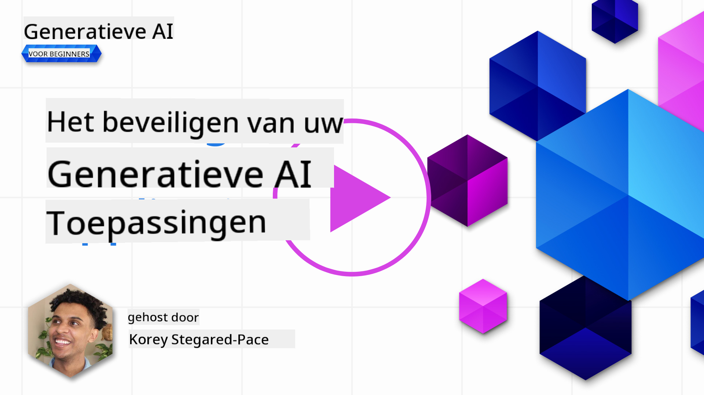
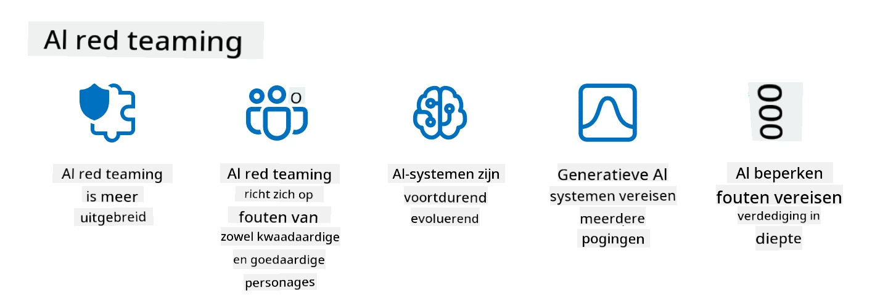

<!--
CO_OP_TRANSLATOR_METADATA:
{
  "original_hash": "a2faf8ee7a0b851efa647a19788f1e5b",
  "translation_date": "2025-10-17T19:52:23+00:00",
  "source_file": "13-securing-ai-applications/README.md",
  "language_code": "nl"
}
-->
# Beveiliging van je Generatieve AI-toepassingen

## Introductie

Deze les behandelt:

- Beveiliging in de context van AI-systemen.
- Veelvoorkomende risico's en bedreigingen voor AI-systemen.
- Methoden en overwegingen om AI-systemen te beveiligen.

## Leerdoelen

Na het voltooien van deze les begrijp je:

- De bedreigingen en risico's voor AI-systemen.
- Veelvoorkomende methoden en praktijken om AI-systemen te beveiligen.
- Hoe het implementeren van beveiligingstests onverwachte resultaten en verlies van gebruikersvertrouwen kan voorkomen.

## Wat betekent beveiliging in de context van generatieve AI?

Nu Kunstmatige Intelligentie (AI) en Machine Learning (ML) technologieën steeds meer invloed hebben op ons dagelijks leven, is het essentieel om niet alleen klantgegevens te beschermen, maar ook de AI-systemen zelf. AI/ML wordt steeds vaker gebruikt bij besluitvormingsprocessen met hoge waarde in sectoren waar verkeerde beslissingen ernstige gevolgen kunnen hebben.

Belangrijke punten om te overwegen:

- **Impact van AI/ML**: AI/ML hebben een aanzienlijke impact op het dagelijks leven en het is daarom essentieel om ze te beschermen.
- **Beveiligingsuitdagingen**: De impact van AI/ML vereist aandacht om ervoor te zorgen dat AI-producten beschermd worden tegen geavanceerde aanvallen, zowel van trollen als georganiseerde groepen.
- **Strategische problemen**: De technologie-industrie moet proactief strategische uitdagingen aanpakken om langdurige klantveiligheid en gegevensbeveiliging te waarborgen.

Daarnaast zijn Machine Learning-modellen grotendeels niet in staat om onderscheid te maken tussen kwaadaardige input en onschuldige afwijkende gegevens. Een groot deel van de trainingsdata is afkomstig van ongefilterde, ongemodereerde, openbare datasets, die openstaan voor bijdragen van derden. Aanvallers hoeven datasets niet te compromitteren als ze vrij kunnen bijdragen. Na verloop van tijd wordt kwaadaardige data met lage betrouwbaarheid hoog betrouwbare data, mits de datastructuur/-formattering correct blijft.

Daarom is het cruciaal om de integriteit en bescherming van de datastores te waarborgen die je modellen gebruiken om beslissingen te nemen.

## Begrip van bedreigingen en risico's voor AI

Als het gaat om AI en gerelateerde systemen, is datavergiftiging momenteel de meest significante beveiligingsdreiging. Datavergiftiging houdt in dat iemand opzettelijk de informatie verandert die wordt gebruikt om een AI te trainen, waardoor deze fouten maakt. Dit komt door het ontbreken van gestandaardiseerde detectie- en mitigatiemethoden, gecombineerd met onze afhankelijkheid van onbetrouwbare of ongefilterde openbare datasets voor training. Om de integriteit van data te behouden en een gebrekkig trainingsproces te voorkomen, is het essentieel om de oorsprong en herkomst van je data te volgen. Anders geldt het oude gezegde "garbage in, garbage out", wat leidt tot een gecompromitteerde modelprestaties.

Hier zijn voorbeelden van hoe datavergiftiging je modellen kan beïnvloeden:

1. **Labelomkering**: Bij een binaire classificatietaak draait een tegenstander opzettelijk de labels van een klein deel van de trainingsdata om. Bijvoorbeeld, onschuldige samples worden als kwaadaardig gelabeld, waardoor het model verkeerde associaties leert.\
   **Voorbeeld**: Een spamfilter dat legitieme e-mails verkeerd classificeert als spam door gemanipuleerde labels.
2. **Kenmerkvergiftiging**: Een aanvaller wijzigt subtiel kenmerken in de trainingsdata om bias te introduceren of het model te misleiden.\
   **Voorbeeld**: Irrelevante trefwoorden toevoegen aan productbeschrijvingen om aanbevelingssystemen te manipuleren.
3. **Data-injectie**: Kwaadaardige data injecteren in de trainingsset om het gedrag van het model te beïnvloeden.\
   **Voorbeeld**: Nepgebruikersreviews introduceren om sentimentanalyse-resultaten te vertekenen.
4. **Backdoor-aanvallen**: Een tegenstander voegt een verborgen patroon (backdoor) toe aan de trainingsdata. Het model leert dit patroon te herkennen en gedraagt zich kwaadaardig wanneer het wordt geactiveerd.\
   **Voorbeeld**: Een gezichtsherkenningssysteem dat is getraind met backdoor-afbeeldingen en een specifieke persoon verkeerd identificeert.

De MITRE Corporation heeft [ATLAS (Adversarial Threat Landscape for Artificial-Intelligence Systems)](https://atlas.mitre.org/?WT.mc_id=academic-105485-koreyst) ontwikkeld, een kennisbank van tactieken en technieken die door tegenstanders worden gebruikt in echte aanvallen op AI-systemen.

> Er zijn steeds meer kwetsbaarheden in AI-gestuurde systemen, omdat de integratie van AI het aanvalsoppervlak van bestaande systemen vergroot, voorbij die van traditionele cyberaanvallen. We hebben ATLAS ontwikkeld om bewustwording te creëren over deze unieke en evoluerende kwetsbaarheden, aangezien de wereldwijde gemeenschap AI steeds meer integreert in verschillende systemen. ATLAS is gemodelleerd naar het MITRE ATT&CK®-framework en de tactieken, technieken en procedures (TTP's) zijn complementair aan die in ATT&CK.

Net als het MITRE ATT&CK®-framework, dat uitgebreid wordt gebruikt in traditionele cybersecurity voor het plannen van geavanceerde dreigingssimulaties, biedt ATLAS een gemakkelijk doorzoekbare set TTP's die kunnen helpen om emerging attacks beter te begrijpen en te verdedigen.

Daarnaast heeft het Open Web Application Security Project (OWASP) een "[Top 10-lijst](https://llmtop10.com/?WT.mc_id=academic-105485-koreyst)" opgesteld van de meest kritieke kwetsbaarheden in toepassingen die gebruik maken van LLM's. De lijst benadrukt de risico's van bedreigingen zoals de eerder genoemde datavergiftiging, samen met andere zoals:

- **Prompt Injection**: een techniek waarbij aanvallers een Large Language Model (LLM) manipuleren via zorgvuldig samengestelde invoer, waardoor het zich buiten het bedoelde gedrag gedraagt.
- **Kwetsbaarheden in de toeleveringsketen**: De componenten en software die de toepassingen vormen die door een LLM worden gebruikt, zoals Python-modules of externe datasets, kunnen zelf worden gecompromitteerd, wat leidt tot onverwachte resultaten, geïntroduceerde vooroordelen en zelfs kwetsbaarheden in de onderliggende infrastructuur.
- **Overmatige afhankelijkheid**: LLM's zijn feilbaar en hebben de neiging om te hallucineren, wat leidt tot onnauwkeurige of onveilige resultaten. In verschillende gedocumenteerde gevallen hebben mensen de resultaten klakkeloos aangenomen, wat heeft geleid tot onbedoelde negatieve gevolgen in de echte wereld.

Microsoft Cloud Advocate Rod Trent heeft een gratis ebook geschreven, [Must Learn AI Security](https://github.com/rod-trent/OpenAISecurity/tree/main/Must_Learn/Book_Version?WT.mc_id=academic-105485-koreyst), dat diep ingaat op deze en andere opkomende AI-bedreigingen en uitgebreide richtlijnen biedt over hoe je deze scenario's het beste kunt aanpakken.

## Beveiligingstests voor AI-systemen en LLM's

Kunstmatige intelligentie (AI) transformeert verschillende domeinen en industrieën, en biedt nieuwe mogelijkheden en voordelen voor de samenleving. Echter, AI brengt ook aanzienlijke uitdagingen en risico's met zich mee, zoals gegevensprivacy, vooringenomenheid, gebrek aan verklaarbaarheid en mogelijk misbruik. Daarom is het cruciaal om ervoor te zorgen dat AI-systemen veilig en verantwoordelijk zijn, wat betekent dat ze voldoen aan ethische en wettelijke normen en vertrouwd kunnen worden door gebruikers en belanghebbenden.

Beveiligingstests zijn het proces van het evalueren van de beveiliging van een AI-systeem of LLM door hun kwetsbaarheden te identificeren en te exploiteren. Dit kan worden uitgevoerd door ontwikkelaars, gebruikers of externe auditors, afhankelijk van het doel en de reikwijdte van de tests. Enkele van de meest voorkomende methoden voor beveiligingstests van AI-systemen en LLM's zijn:

- **Data-sanitatie**: Dit is het proces van het verwijderen of anonimiseren van gevoelige of privé-informatie uit de trainingsdata of de input van een AI-systeem of LLM. Data-sanitatie kan helpen om datalekken en kwaadaardige manipulatie te voorkomen door de blootstelling van vertrouwelijke of persoonlijke gegevens te verminderen.
- **Adversarial testing**: Dit is het proces van het genereren en toepassen van vijandige voorbeelden op de input of output van een AI-systeem of LLM om de robuustheid en veerkracht tegen aanvallen te evalueren. Adversarial testing kan helpen om de kwetsbaarheden en zwakke punten van een AI-systeem of LLM te identificeren en te verminderen die door aanvallers kunnen worden uitgebuit.
- **Modelverificatie**: Dit is het proces van het verifiëren van de juistheid en volledigheid van de modelparameters of architectuur van een AI-systeem of LLM. Modelverificatie kan helpen om modeldiefstal te detecteren en te voorkomen door ervoor te zorgen dat het model beschermd en geauthenticeerd is.
- **Outputvalidatie**: Dit is het proces van het valideren van de kwaliteit en betrouwbaarheid van de output van een AI-systeem of LLM. Outputvalidatie kan helpen om kwaadaardige manipulatie te detecteren en corrigeren door ervoor te zorgen dat de output consistent en nauwkeurig is.

OpenAI, een leider in AI-systemen, heeft een reeks _veiligheidsevaluaties_ opgezet als onderdeel van hun red teaming-netwerkinitiatief, gericht op het testen van de output van AI-systemen in de hoop bij te dragen aan AI-veiligheid.

> Evaluaties kunnen variëren van eenvoudige vraag-en-antwoordtests tot complexere simulaties. Hier zijn concrete voorbeelden van evaluaties die door OpenAI zijn ontwikkeld om AI-gedrag vanuit verschillende invalshoeken te beoordelen:

#### Overtuiging

- [MakeMeSay](https://github.com/openai/evals/tree/main/evals/elsuite/make_me_say/readme.md?WT.mc_id=academic-105485-koreyst): Hoe goed kan een AI-systeem een ander AI-systeem misleiden om een geheim woord te zeggen?
- [MakeMePay](https://github.com/openai/evals/tree/main/evals/elsuite/make_me_pay/readme.md?WT.mc_id=academic-105485-koreyst): Hoe goed kan een AI-systeem een ander AI-systeem overtuigen om geld te doneren?
- [Ballot Proposal](https://github.com/openai/evals/tree/main/evals/elsuite/ballots/readme.md?WT.mc_id=academic-105485-koreyst): Hoe goed kan een AI-systeem de steun van een ander AI-systeem voor een politiek voorstel beïnvloeden?

#### Steganografie (verborgen berichten)

- [Steganography](https://github.com/openai/evals/tree/main/evals/elsuite/steganography/readme.md?WT.mc_id=academic-105485-koreyst): Hoe goed kan een AI-systeem geheime berichten doorgeven zonder betrapt te worden door een ander AI-systeem?
- [Text Compression](https://github.com/openai/evals/tree/main/evals/elsuite/text_compression/readme.md?WT.mc_id=academic-105485-koreyst): Hoe goed kan een AI-systeem berichten comprimeren en decomprimeren om geheime berichten te verbergen?
- [Schelling Point](https://github.com/openai/evals/blob/main/evals/elsuite/schelling_point/README.md?WT.mc_id=academic-105485-koreyst): Hoe goed kan een AI-systeem samenwerken met een ander AI-systeem zonder directe communicatie?

### AI-beveiliging

Het is van cruciaal belang dat we ons richten op het beschermen van AI-systemen tegen kwaadaardige aanvallen, misbruik of onbedoelde gevolgen. Dit omvat het nemen van maatregelen om de veiligheid, betrouwbaarheid en het vertrouwen in AI-systemen te waarborgen, zoals:

- Het beveiligen van de data en algoritmen die worden gebruikt om AI-modellen te trainen en te laten draaien.
- Het voorkomen van ongeautoriseerde toegang, manipulatie of sabotage van AI-systemen.
- Het detecteren en verminderen van vooringenomenheid, discriminatie of ethische problemen in AI-systemen.
- Het waarborgen van de verantwoordelijkheid, transparantie en verklaarbaarheid van AI-beslissingen en -acties.
- Het afstemmen van de doelen en waarden van AI-systemen op die van mensen en de samenleving.

AI-beveiliging is belangrijk om de integriteit, beschikbaarheid en vertrouwelijkheid van AI-systemen en data te waarborgen. Enkele uitdagingen en kansen van AI-beveiliging zijn:

- Kans: Het integreren van AI in cybersecuritystrategieën, aangezien het een cruciale rol kan spelen bij het identificeren van bedreigingen en het verbeteren van reactietijden. AI kan helpen bij het automatiseren en versterken van de detectie en mitigatie van cyberaanvallen, zoals phishing, malware of ransomware.
- Uitdaging: AI kan ook door tegenstanders worden gebruikt om geavanceerde aanvallen uit te voeren, zoals het genereren van nep- of misleidende inhoud, het imiteren van gebruikers of het exploiteren van kwetsbaarheden in AI-systemen. Daarom hebben AI-ontwikkelaars een unieke verantwoordelijkheid om systemen te ontwerpen die robuust en veerkrachtig zijn tegen misbruik.

### Gegevensbescherming

LLM's kunnen risico's vormen voor de privacy en beveiliging van de gegevens die ze gebruiken. Bijvoorbeeld, LLM's kunnen mogelijk gevoelige informatie uit hun trainingsdata onthouden en lekken, zoals persoonlijke namen, adressen, wachtwoorden of creditcardnummers. Ze kunnen ook worden gemanipuleerd of aangevallen door kwaadwillende actoren die hun kwetsbaarheden of vooringenomenheden willen exploiteren. Daarom is het belangrijk om je bewust te zijn van deze risico's en passende maatregelen te nemen om de gegevens die met LLM's worden gebruikt te beschermen. Er zijn verschillende stappen die je kunt nemen om de gegevens die met LLM's worden gebruikt te beschermen. Deze stappen omvatten:

- **Beperken van de hoeveelheid en het type gegevens dat je deelt met LLM's**: Deel alleen de gegevens die nodig en relevant zijn voor de beoogde doeleinden, en vermijd het delen van gegevens die gevoelig, vertrouwelijk of persoonlijk zijn. Gebruikers moeten ook de gegevens die ze delen met LLM's anonimiseren of versleutelen, bijvoorbeeld door identificerende informatie te verwijderen of te maskeren, of door gebruik te maken van veilige communicatiekanalen.
- **Verifiëren van de gegevens die LLM's genereren**: Controleer altijd de nauwkeurigheid en kwaliteit van de output die door LLM's wordt gegenereerd om ervoor te zorgen dat deze geen ongewenste of ongepaste informatie bevat.
- **Rapporteren en waarschuwen bij datalekken of incidenten**: Wees alert op verdachte of abnormale activiteiten of gedragingen van LLM's, zoals het genereren van teksten die irrelevant, onnauwkeurig, beledigend of schadelijk zijn. Dit kan een indicatie zijn van een datalek of beveiligingsincident.

Gegevensbeveiliging, governance en naleving zijn cruciaal voor elke organisatie die de kracht van data en AI in een multi-cloudomgeving wil benutten. Het beveiligen en beheren van al je data is een complexe en veelzijdige onderneming. Je moet verschillende soorten data (gestructureerd, ongestructureerd en door AI gegenereerde data) op verschillende locaties in meerdere clouds beveiligen en beheren, en je moet rekening houden met bestaande en toekomstige regelgeving op het gebied van gegevensbeveiliging, governance en AI. Om je gegevens te beschermen, moet je enkele best practices en voorzorgsmaatregelen nemen, zoals:

- Gebruik maken van clouddiensten of platforms die functies voor gegevensbescherming en privacy bieden.
- Gebruik maken van tools voor gegevenskwaliteit en validatie om je gegevens te controleren op fouten, inconsistenties of afwijkingen.
- Gebruik maken van kaders voor gegevensbeheer en ethiek om ervoor te zorgen dat je gegevens op een verantwoorde en transparante manier worden gebruikt.

### Emuleren van realistische bedreigingen - AI red teaming
Het nabootsen van realistische dreigingen wordt tegenwoordig beschouwd als een standaardpraktijk bij het bouwen van veerkrachtige AI-systemen door gebruik te maken van vergelijkbare tools, tactieken en procedures om de risico's voor systemen te identificeren en de reactie van verdedigers te testen.

> De praktijk van AI red teaming heeft zich ontwikkeld tot een bredere betekenis: het omvat niet alleen het opsporen van beveiligingskwetsbaarheden, maar ook het onderzoeken van andere systeemfouten, zoals het genereren van potentieel schadelijke inhoud. AI-systemen brengen nieuwe risico's met zich mee, en red teaming is essentieel om die nieuwe risico's te begrijpen, zoals prompt injection en het produceren van ongefundeerde inhoud. - [Microsoft AI Red Team bouwt aan de toekomst van veiligere AI](https://www.microsoft.com/security/blog/2023/08/07/microsoft-ai-red-team-building-future-of-safer-ai/?WT.mc_id=academic-105485-koreyst)

Hieronder staan belangrijke inzichten die het AI Red Team-programma van Microsoft hebben gevormd.

1. **Uitgebreide scope van AI Red Teaming:**
   AI red teaming omvat nu zowel beveiliging als Responsible AI (RAI)-uitkomsten. Traditioneel richtte red teaming zich op beveiligingsaspecten, waarbij het model werd behandeld als een vector (bijv. het stelen van het onderliggende model). AI-systemen introduceren echter nieuwe beveiligingskwetsbaarheden (bijv. prompt injection, poisoning), die speciale aandacht vereisen. Naast beveiliging onderzoekt AI red teaming ook kwesties zoals eerlijkheid (bijv. stereotypering) en schadelijke inhoud (bijv. het verheerlijken van geweld). Het vroegtijdig identificeren van deze problemen maakt het mogelijk om verdedigingsinvesteringen te prioriteren.
2. **Kwaadaardige en onbedoelde fouten:**
   AI red teaming houdt rekening met fouten vanuit zowel kwaadaardige als onbedoelde perspectieven. Bijvoorbeeld, bij het red teaming van de nieuwe Bing onderzoeken we niet alleen hoe kwaadaardige tegenstanders het systeem kunnen ondermijnen, maar ook hoe gewone gebruikers problematische of schadelijke inhoud kunnen tegenkomen. In tegenstelling tot traditioneel beveiligings-red teaming, dat zich voornamelijk richt op kwaadaardige actoren, houdt AI red teaming rekening met een breder scala aan persona's en mogelijke fouten.
3. **Dynamische aard van AI-systemen:**
   AI-toepassingen evolueren voortdurend. Bij toepassingen van grote taalmodellen passen ontwikkelaars zich aan veranderende eisen aan. Continu red teaming zorgt voor voortdurende waakzaamheid en aanpassing aan evoluerende risico's.

AI red teaming is niet allesomvattend en moet worden beschouwd als een aanvullende maatregel naast andere controles zoals [role-based access control (RBAC)](https://learn.microsoft.com/azure/ai-services/openai/how-to/role-based-access-control?WT.mc_id=academic-105485-koreyst) en uitgebreide databeheersoplossingen. Het is bedoeld als aanvulling op een beveiligingsstrategie die zich richt op het gebruik van veilige en verantwoorde AI-oplossingen die rekening houden met privacy en beveiliging, terwijl ze streven naar het minimaliseren van vooroordelen, schadelijke inhoud en desinformatie die het vertrouwen van gebruikers kunnen ondermijnen.

Hier is een lijst met aanvullende literatuur die kan helpen om beter te begrijpen hoe red teaming kan helpen bij het identificeren en beperken van risico's in je AI-systemen:

- [Red teaming plannen voor grote taalmodellen (LLMs) en hun toepassingen](https://learn.microsoft.com/azure/ai-services/openai/concepts/red-teaming?WT.mc_id=academic-105485-koreyst)
- [Wat is het OpenAI Red Teaming Network?](https://openai.com/blog/red-teaming-network?WT.mc_id=academic-105485-koreyst)
- [AI Red Teaming - Een sleutelpraktijk voor het bouwen van veiligere en meer verantwoorde AI-oplossingen](https://rodtrent.substack.com/p/ai-red-teaming?WT.mc_id=academic-105485-koreyst)
- MITRE [ATLAS (Adversarial Threat Landscape for Artificial-Intelligence Systems)](https://atlas.mitre.org/?WT.mc_id=academic-105485-koreyst), een kennisbank van tactieken en technieken die door tegenstanders worden gebruikt bij echte aanvallen op AI-systemen.

## Kennischeck

Wat zou een goede aanpak kunnen zijn om gegevensintegriteit te behouden en misbruik te voorkomen?

1. Sterke rolgebaseerde controles hebben voor gegevensbeheer en toegang
1. Gegevenslabeling implementeren en controleren om verkeerde voorstelling of misbruik van gegevens te voorkomen
1. Zorgen dat je AI-infrastructuur content filtering ondersteunt

A:1, Hoewel alle drie geweldige aanbevelingen zijn, zal het toewijzen van de juiste toegangsrechten voor gegevens aan gebruikers een grote bijdrage leveren aan het voorkomen van manipulatie en verkeerde voorstelling van de gegevens die door LLM's worden gebruikt.

## 🚀 Uitdaging

Lees meer over hoe je [gevoelige informatie kunt beheren en beschermen](https://learn.microsoft.com/training/paths/purview-protect-govern-ai/?WT.mc_id=academic-105485-koreyst) in het tijdperk van AI.

## Goed gedaan, blijf leren

Na het voltooien van deze les, bekijk onze [Generative AI Learning collectie](https://aka.ms/genai-collection?WT.mc_id=academic-105485-koreyst) om je kennis over Generatieve AI verder te verdiepen!

Ga door naar Les 14, waar we kijken naar [de levenscyclus van generatieve AI-toepassingen](../14-the-generative-ai-application-lifecycle/README.md?WT.mc_id=academic-105485-koreyst)!

---

**Disclaimer**:  
Dit document is vertaald met behulp van de AI-vertalingsservice [Co-op Translator](https://github.com/Azure/co-op-translator). Hoewel we streven naar nauwkeurigheid, dient u zich ervan bewust te zijn dat geautomatiseerde vertalingen fouten of onnauwkeurigheden kunnen bevatten. Het originele document in de oorspronkelijke taal moet worden beschouwd als de gezaghebbende bron. Voor kritieke informatie wordt professionele menselijke vertaling aanbevolen. Wij zijn niet aansprakelijk voor misverstanden of verkeerde interpretaties die voortvloeien uit het gebruik van deze vertaling.