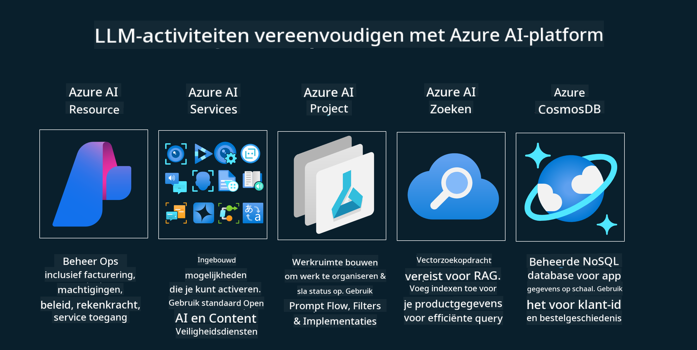

<!--
CO_OP_TRANSLATOR_METADATA:
{
  "original_hash": "df44972d5575ea8cef3c52ee31696d04",
  "translation_date": "2025-12-19T15:47:42+00:00",
  "source_file": "14-the-generative-ai-application-lifecycle/README.md",
  "language_code": "nl"
}
-->

# De levenscyclus van generatieve AI-toepassingen

Een belangrijke vraag voor alle AI-toepassingen is de relevantie van AI-functies, aangezien AI een snel evoluerend vakgebied is. Om ervoor te zorgen dat uw toepassing relevant, betrouwbaar en robuust blijft, moet u deze continu monitoren, evalueren en verbeteren. Hier komt de levenscyclus van generatieve AI om de hoek kijken.

De levenscyclus van generatieve AI is een raamwerk dat u begeleidt door de fasen van het ontwikkelen, implementeren en onderhouden van een generatieve AI-toepassing. Het helpt u uw doelen te definiëren, uw prestaties te meten, uw uitdagingen te identificeren en uw oplossingen te implementeren. Het helpt u ook om uw toepassing af te stemmen op de ethische en wettelijke normen van uw domein en uw belanghebbenden. Door de levenscyclus van generatieve AI te volgen, kunt u ervoor zorgen dat uw toepassing altijd waarde levert en uw gebruikers tevredenstelt.

## Inleiding

In dit hoofdstuk leert u:

- Het paradigma verschuiving van MLOps naar LLMOps begrijpen
- De levenscyclus van LLM
- Hulpmiddelen voor de levenscyclus
- Metrificatie en evaluatie van de levenscyclus

## Het paradigma verschuiving van MLOps naar LLMOps begrijpen

LLM's zijn een nieuw hulpmiddel in het arsenaal van Kunstmatige Intelligentie, ze zijn ongelooflijk krachtig in analyse- en generatie taken voor toepassingen, maar deze kracht heeft ook gevolgen voor hoe we AI en klassieke machine learning taken stroomlijnen.

Hiervoor hebben we een nieuw paradigma nodig om dit hulpmiddel dynamisch aan te passen, met de juiste prikkels. We kunnen oudere AI-apps categoriseren als "ML Apps" en nieuwere AI-apps als "GenAI Apps" of gewoon "AI Apps", wat de gangbare technologie en technieken weerspiegelt die op dat moment werden gebruikt. Dit verschuift ons verhaal op meerdere manieren, bekijk de volgende vergelijking.

Merk op dat we bij LLMOps meer gericht zijn op de app-ontwikkelaars, waarbij integraties een belangrijk punt zijn, gebruikmakend van "Models-as-a-Service" en denken aan de volgende punten voor metrics.

- Kwaliteit: Reactiekwaliteit
- Schade: Verantwoorde AI
- Eerlijkheid: Grondslag van de reactie (Maakt het zin? Is het correct?)
- Kosten: Oplossingsbudget
- Latentie: Gemiddelde tijd voor tokenrespons

## De levenscyclus van LLM

Om eerst de levenscyclus en de aanpassingen te begrijpen, laten we de volgende infographic bekijken.

Zoals u kunt zien, verschilt dit van de gebruikelijke levenscycli van MLOps. LLM's hebben veel nieuwe vereisten, zoals prompting, verschillende technieken om de kwaliteit te verbeteren (fine-tuning, RAG, meta-prompts), verschillende beoordeling en verantwoordelijkheid met verantwoorde AI, en tenslotte nieuwe evaluatiemetrics (kwaliteit, schade, eerlijkheid, kosten en latentie).

Neem bijvoorbeeld een kijkje hoe we ideeën genereren. We gebruiken prompt engineering om te experimenteren met verschillende LLM's om mogelijkheden te verkennen en te testen of hun hypothese correct kan zijn.

Merk op dat dit niet lineair is, maar geïntegreerde lussen, iteratief en met een overkoepelende cyclus.

Hoe kunnen we die stappen verkennen? Laten we in detail bekijken hoe we een levenscyclus kunnen opbouwen.

Dit kan er wat ingewikkeld uitzien, laten we ons eerst richten op de drie grote stappen.

1. Ideeën genereren/verkennen: Verkenning, hier kunnen we verkennen op basis van onze zakelijke behoeften. Prototyping, het maken van een [PromptFlow](https://microsoft.github.io/promptflow/index.html?WT.mc_id=academic-105485-koreyst) en testen of het efficiënt genoeg is voor onze hypothese.
1. Bouwen/Uitbreiden: Implementatie, nu beginnen we te evalueren voor grotere datasets en implementeren technieken zoals fine-tuning en RAG om de robuustheid van onze oplossing te controleren. Als het niet werkt, kan het herimplementeren, toevoegen van nieuwe stappen in onze flow of het herstructureren van de data helpen. Na het testen van onze flow en schaal, als het werkt en onze metrics controleert, is het klaar voor de volgende stap.
1. Operationeel maken: Integratie, nu voegen we monitoring- en waarschuwingssystemen toe aan ons systeem, implementatie en applicatie-integratie in onze toepassing.

Daarna hebben we de overkoepelende cyclus van beheer, gericht op beveiliging, naleving en governance.

Gefeliciteerd, nu is uw AI-app klaar voor gebruik en operationeel. Voor een praktische ervaring, bekijk de [Contoso Chat Demo.](https://nitya.github.io/contoso-chat/?WT.mc_id=academic-105485-koreys)

Welke tools kunnen we nu gebruiken?

## Hulpmiddelen voor de levenscyclus

Voor hulpmiddelen biedt Microsoft het [Azure AI Platform](https://azure.microsoft.com/solutions/ai/?WT.mc_id=academic-105485-koreys) en [PromptFlow](https://microsoft.github.io/promptflow/index.html?WT.mc_id=academic-105485-koreyst) die uw cyclus vergemakkelijken en eenvoudig te implementeren maken.

Het [Azure AI Platform](https://azure.microsoft.com/solutions/ai/?WT.mc_id=academic-105485-koreys) stelt u in staat om [AI Studio](https://ai.azure.com/?WT.mc_id=academic-105485-koreys) te gebruiken. AI Studio is een webportaal waarmee u modellen, voorbeelden en tools kunt verkennen. Het beheren van uw resources, UI-ontwikkelingsflows en SDK/CLI-opties voor code-first ontwikkeling.

Azure AI stelt u in staat meerdere resources te gebruiken om uw operaties, services, projecten, vectorzoekopdrachten en databasebehoeften te beheren.

Bouw, van Proof-of-Concept (POC) tot grootschalige toepassingen met PromptFlow:

- Ontwerp en bouw apps vanuit VS Code, met visuele en functionele tools
- Test en verfijn uw apps voor kwalitatieve AI, eenvoudig.
- Gebruik Azure AI Studio om te integreren en itereren met de cloud, pushen en implementeren voor snelle integratie.

## Geweldig! Ga door met leren!

Geweldig, leer nu meer over hoe we een toepassing structureren om de concepten te gebruiken met de [Contoso Chat App](https://nitya.github.io/contoso-chat/?WT.mc_id=academic-105485-koreyst), om te zien hoe Cloud Advocacy die concepten toevoegt in demonstraties. Voor meer inhoud, bekijk onze [Ignite breakout sessie!
](https://www.youtube.com/watch?v=DdOylyrTOWg)

Bekijk nu les 15, om te begrijpen hoe [Retrieval Augmented Generation en Vector Databases](../15-rag-and-vector-databases/README.md?WT.mc_id=academic-105485-koreyst) impact hebben op generatieve AI en om meer boeiende toepassingen te maken!

---

<!-- CO-OP TRANSLATOR DISCLAIMER START -->
**Disclaimer**:
Dit document is vertaald met behulp van de AI-vertalingsdienst [Co-op Translator](https://github.com/Azure/co-op-translator). Hoewel we streven naar nauwkeurigheid, dient u er rekening mee te houden dat geautomatiseerde vertalingen fouten of onnauwkeurigheden kunnen bevatten. Het originele document in de oorspronkelijke taal moet als de gezaghebbende bron worden beschouwd. Voor cruciale informatie wordt professionele menselijke vertaling aanbevolen. Wij zijn niet aansprakelijk voor eventuele misverstanden of verkeerde interpretaties die voortvloeien uit het gebruik van deze vertaling.
<!-- CO-OP TRANSLATOR DISCLAIMER END -->