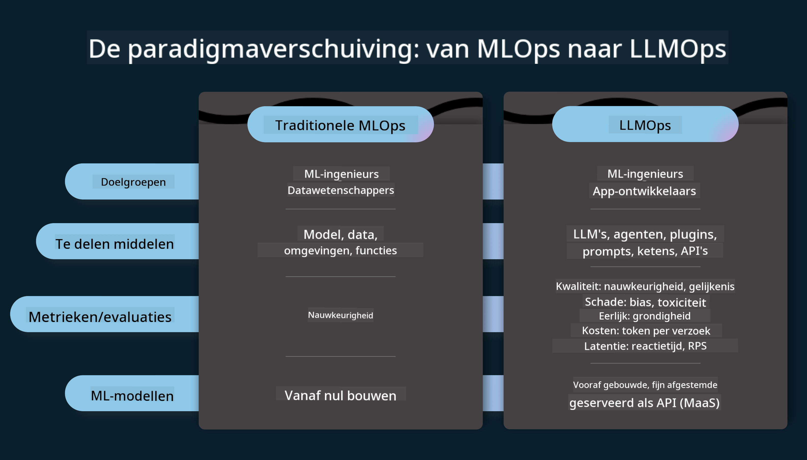
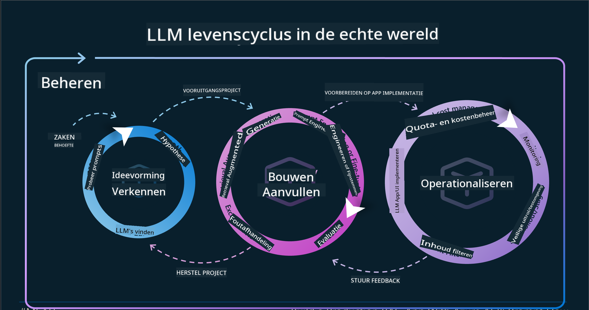
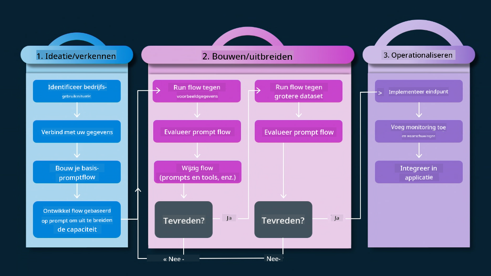
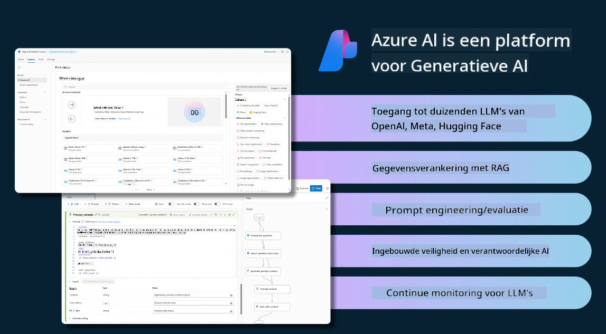
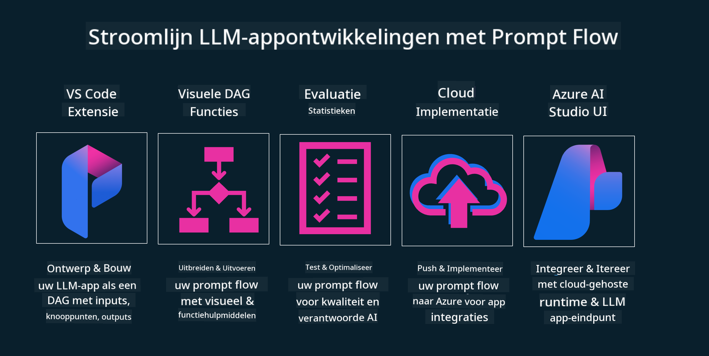

<!--
CO_OP_TRANSLATOR_METADATA:
{
  "original_hash": "27a5347a5022d5ef0a72ab029b03526a",
  "translation_date": "2025-05-19T23:30:30+00:00",
  "source_file": "14-the-generative-ai-application-lifecycle/README.md",
  "language_code": "nl"
}
-->

# De Generatieve AI Applicatie Levenscyclus

Een belangrijke vraag voor alle AI-toepassingen is de relevantie van AI-functies, aangezien AI een snel evoluerend veld is. Om ervoor te zorgen dat je applicatie relevant, betrouwbaar en robuust blijft, moet je deze continu monitoren, evalueren en verbeteren. Dit is waar de generatieve AI-levenscyclus om de hoek komt kijken.

De generatieve AI-levenscyclus is een raamwerk dat je begeleidt door de stadia van het ontwikkelen, implementeren en onderhouden van een generatieve AI-toepassing. Het helpt je om je doelen te definiëren, je prestaties te meten, je uitdagingen te identificeren en je oplossingen te implementeren. Het helpt je ook om je applicatie af te stemmen op de ethische en juridische normen van je domein en je belanghebbenden. Door de generatieve AI-levenscyclus te volgen, kun je ervoor zorgen dat je applicatie altijd waarde levert en je gebruikers tevreden stelt.

## Introductie

In dit hoofdstuk zul je:

- Begrijpen de Paradigmaverschuiving van MLOps naar LLMOps
- De LLM Levenscyclus
- Levenscyclus Tools
- Levenscyclus Metrificatie en Evaluatie

## Begrijp de Paradigmaverschuiving van MLOps naar LLMOps

LLM's zijn een nieuw hulpmiddel in het arsenaal van Kunstmatige Intelligentie. Ze zijn ongelooflijk krachtig in analyse- en generatietaken voor applicaties, maar deze kracht heeft enkele gevolgen voor hoe we AI- en klassieke machine learning-taken stroomlijnen.

Hierdoor hebben we een nieuw paradigma nodig om dit hulpmiddel dynamisch aan te passen, met de juiste prikkels. We kunnen oudere AI-apps categoriseren als "ML-apps" en nieuwere AI-apps als "GenAI-apps" of gewoon "AI-apps", wat de gangbare technologie en technieken weerspiegelt die destijds werden gebruikt. Dit verschuift ons verhaal op meerdere manieren, kijk naar de volgende vergelijking.

Merk op dat we in LLMOps meer gefocust zijn op de app-ontwikkelaars, waarbij integraties een belangrijk punt zijn, "Models-as-a-Service" gebruiken en denken aan de volgende punten voor metrics.

- Kwaliteit: Responskwaliteit
- Schade: Verantwoordelijke AI
- Eerlijkheid: Respons gegrondheid (Maakt het zin? Is het correct?)
- Kosten: Oplossingsbudget
- Latentie: Gem. tijd voor tokenrespons

## De LLM Levenscyclus

Ten eerste, om de levenscyclus en de wijzigingen te begrijpen, laten we de volgende infographic noteren.

Zoals je misschien opmerkt, is dit anders dan de gebruikelijke levenscycli van MLOps. LLM's hebben veel nieuwe vereisten, zoals prompting, verschillende technieken om de kwaliteit te verbeteren (Fine-Tuning, RAG, Meta-Prompts), verschillende beoordeling en verantwoordelijkheid met verantwoordelijke AI, en tot slot nieuwe evaluatiemetrics (Kwaliteit, Schade, Eerlijkheid, Kosten en Latentie).

Neem bijvoorbeeld een kijkje hoe we ideeën ontwikkelen. Door prompt engineering te gebruiken om te experimenteren met verschillende LLM's om mogelijkheden te verkennen en te testen of hun hypothese correct zou kunnen zijn.

Merk op dat dit niet lineair is, maar geïntegreerde loops, iteratief en met een overkoepelende cyclus.

Hoe kunnen we die stappen verkennen? Laten we in detail treden hoe we een levenscyclus kunnen bouwen.

Dit lijkt misschien een beetje ingewikkeld, laten we ons eerst concentreren op de drie grote stappen.

1. Ideeën ontwikkelen/Verkennen: Verkenning, hier kunnen we verkennen volgens onze zakelijke behoeften. Prototyping, het creëren van een [PromptFlow](https://microsoft.github.io/promptflow/index.html?WT.mc_id=academic-105485-koreyst) en testen of het efficiënt genoeg is voor onze hypothese.
2. Bouwen/Aanvullen: Implementatie, nu beginnen we te evalueren voor grotere datasets en implementeren technieken, zoals Fine-tuning en RAG, om de robuustheid van onze oplossing te controleren. Als het dat niet doet, kan het herimplementeren, het toevoegen van nieuwe stappen in onze flow of het herstructureren van de data helpen. Na het testen van onze flow en onze schaal, als het werkt en onze metrics controleert, is het klaar voor de volgende stap.
3. Operationaliseren: Integratie, nu monitoring- en waarschuwingssystemen toevoegen aan ons systeem, implementatie en applicatie-integratie naar onze applicatie.

Dan hebben we de overkoepelende cyclus van beheer, gericht op veiligheid, naleving en governance.

Gefeliciteerd, nu is je AI-app klaar om te gaan en operationeel. Voor een praktische ervaring, bekijk de [Contoso Chat Demo.](https://nitya.github.io/contoso-chat/?WT.mc_id=academic-105485-koreys)

Nu, welke tools kunnen we gebruiken?

## Levenscyclus Tools

Voor tools biedt Microsoft het [Azure AI Platform](https://azure.microsoft.com/solutions/ai/?WT.mc_id=academic-105485-koreys) en [PromptFlow](https://microsoft.github.io/promptflow/index.html?WT.mc_id=academic-105485-koreyst) om je cyclus gemakkelijk te implementeren en klaar te maken.

Het [Azure AI Platform](https://azure.microsoft.com/solutions/ai/?WT.mc_id=academic-105485-koreys) stelt je in staat om [AI Studio](https://ai.azure.com/?WT.mc_id=academic-105485-koreys) te gebruiken. AI Studio is een webportaal waarmee je modellen, voorbeelden en tools kunt verkennen. Beheer je resources, UI-ontwikkelingsstromen en SDK/CLI-opties voor Code-First ontwikkeling.

Azure AI stelt je in staat om meerdere resources te gebruiken om je operaties, diensten, projecten, vectorzoekopdrachten en databasebehoeften te beheren.

Bouw, van Proof-of-Concept (POC) tot grootschalige applicaties met PromptFlow:

- Ontwerp en bouw apps vanuit VS Code, met visuele en functionele tools
- Test en verfijn je apps voor kwaliteit AI, met gemak.
- Gebruik Azure AI Studio om te integreren en itereren met de cloud, push en implementeer voor snelle integratie.

## Geweldig! Ga door met leren!

Geweldig, leer nu meer over hoe we een applicatie structureren om de concepten te gebruiken met de [Contoso Chat App](https://nitya.github.io/contoso-chat/?WT.mc_id=academic-105485-koreyst), om te zien hoe Cloud Advocacy die concepten in demonstraties toevoegt. Voor meer inhoud, bekijk onze [Ignite breakout sessie!](https://www.youtube.com/watch?v=DdOylyrTOWg)

Bekijk nu Les 15, om te begrijpen hoe [Retrieval Augmented Generation en Vector Databases](../15-rag-and-vector-databases/README.md?WT.mc_id=academic-105485-koreyst) impact hebben op Generatieve AI en om meer boeiende applicaties te maken!

**Disclaimer**:  
Dit document is vertaald met behulp van de AI-vertalingsservice [Co-op Translator](https://github.com/Azure/co-op-translator). Hoewel we streven naar nauwkeurigheid, dient u zich ervan bewust te zijn dat geautomatiseerde vertalingen fouten of onnauwkeurigheden kunnen bevatten. Het originele document in zijn oorspronkelijke taal moet worden beschouwd als de gezaghebbende bron. Voor kritieke informatie wordt professionele menselijke vertaling aanbevolen. Wij zijn niet aansprakelijk voor misverstanden of misinterpretaties die voortvloeien uit het gebruik van deze vertaling.