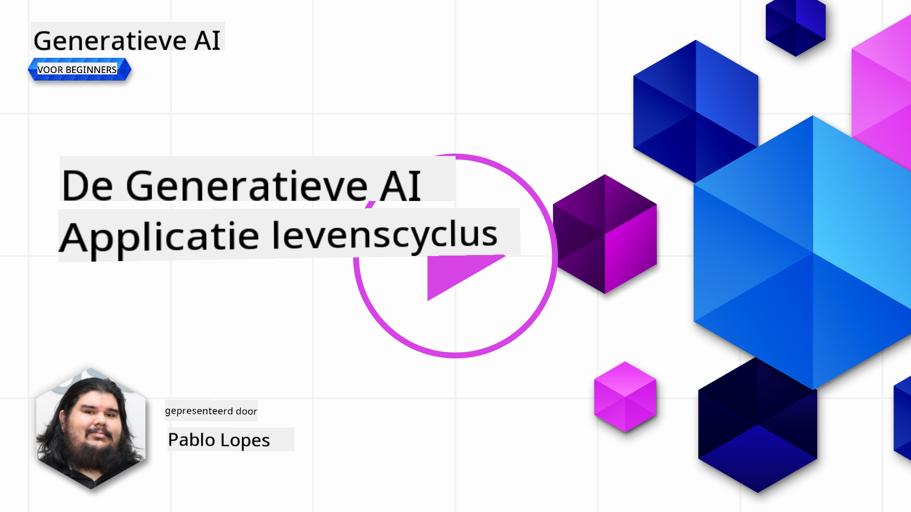
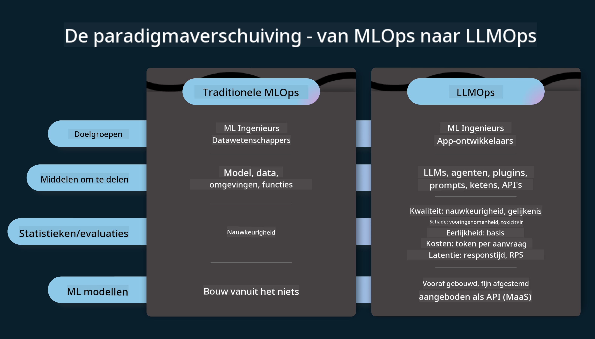
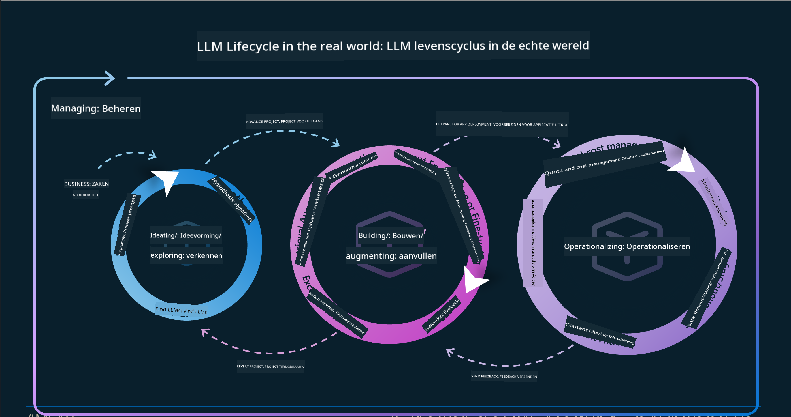
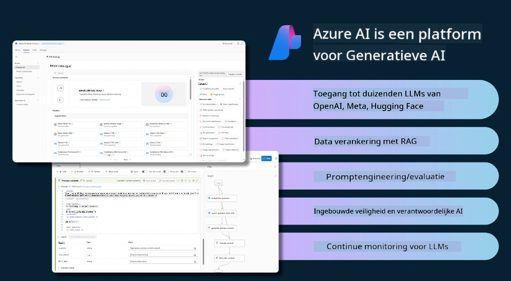
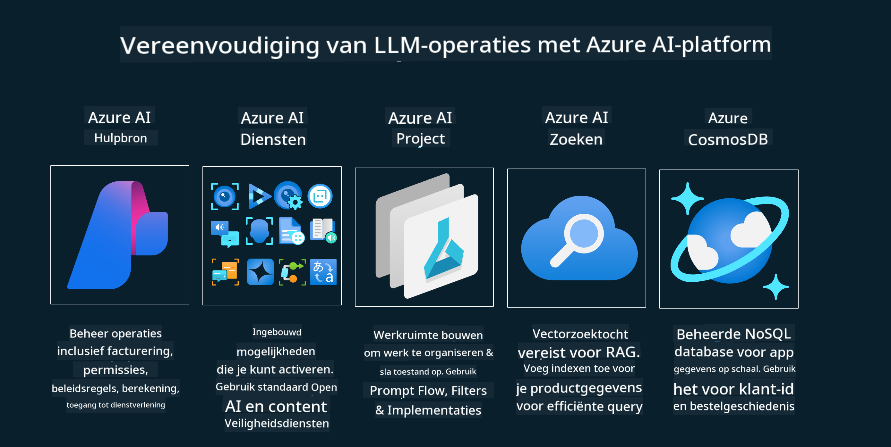
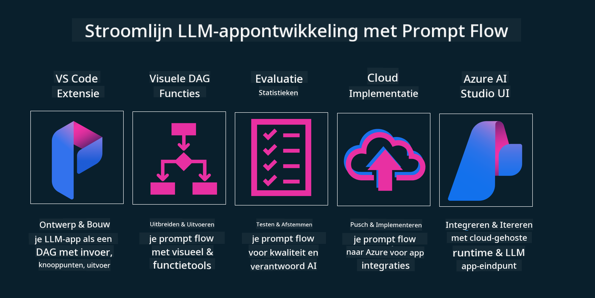

<!--
CO_OP_TRANSLATOR_METADATA:
{
  "original_hash": "27a5347a5022d5ef0a72ab029b03526a",
  "translation_date": "2025-06-25T22:06:11+00:00",
  "source_file": "14-the-generative-ai-application-lifecycle/README.md",
  "language_code": "nl"
}
-->

# De levenscyclus van generatieve AI-toepassingen

Een belangrijke vraag voor alle AI-toepassingen is de relevantie van AI-functies, aangezien AI een snel evoluerend veld is. Om ervoor te zorgen dat je toepassing relevant, betrouwbaar en robuust blijft, moet je deze continu monitoren, evalueren en verbeteren. Hier komt de levenscyclus van generatieve AI in beeld.

De levenscyclus van generatieve AI is een raamwerk dat je begeleidt door de stadia van ontwikkeling, implementatie en onderhoud van een generatieve AI-toepassing. Het helpt je om je doelen te definiëren, je prestaties te meten, je uitdagingen te identificeren en je oplossingen te implementeren. Het helpt je ook om je toepassing af te stemmen op de ethische en wettelijke normen van je domein en je belanghebbenden. Door de levenscyclus van generatieve AI te volgen, kun je ervoor zorgen dat je toepassing altijd waarde levert en je gebruikers tevreden stelt.

## Inleiding

In dit hoofdstuk zul je:

- De paradigmaverschuiving van MLOps naar LLMOps begrijpen
- De LLM-levenscyclus
- Levenscyclus-tooling
- Levenscyclusmetrificatie en evaluatie

## De paradigmaverschuiving van MLOps naar LLMOps begrijpen

LLM's zijn een nieuw hulpmiddel in het arsenaal van kunstmatige intelligentie. Ze zijn ongelooflijk krachtig in analyse- en generatietaken voor toepassingen, maar deze kracht heeft gevolgen voor hoe we AI- en klassieke machine learning-taken stroomlijnen.

Hiermee hebben we een nieuw paradigma nodig om dit hulpmiddel dynamisch aan te passen, met de juiste prikkels. We kunnen oudere AI-apps categoriseren als "ML Apps" en nieuwere AI-apps als "GenAI Apps" of gewoon "AI Apps", wat de gangbare technologie en technieken van die tijd weerspiegelt. Dit verschuift ons verhaal op meerdere manieren, bekijk de volgende vergelijking.

Let op dat we ons bij LLMOps meer richten op de app-ontwikkelaars, waarbij integraties als een belangrijk punt worden gebruikt, "Models-as-a-Service" worden gebruikt en gedacht wordt aan de volgende punten voor metrics.

- Kwaliteit: Responskwaliteit
- Schade: Verantwoordelijke AI
- Eerlijkheid: Gegrondheid van de respons (Maakt het zin? Is het correct?)
- Kosten: Oplossingsbudget
- Latentie: Gemiddelde tijd voor tokenrespons

## De LLM-levenscyclus

Om eerst de levenscyclus en de wijzigingen te begrijpen, laten we de volgende infographic bekijken.

Zoals je kunt zien, is dit anders dan de gebruikelijke levenscycli van MLOps. LLM's hebben veel nieuwe vereisten, zoals Prompting, verschillende technieken om de kwaliteit te verbeteren (Fine-Tuning, RAG, Meta-Prompts), verschillende beoordeling en verantwoordelijkheid met verantwoordelijke AI, en tot slot nieuwe evaluatiemetrics (Kwaliteit, Schade, Eerlijkheid, Kosten en Latentie).

Bekijk bijvoorbeeld hoe we ideeën ontwikkelen. Door prompt-engineering te gebruiken om te experimenteren met verschillende LLM's om mogelijkheden te verkennen en te testen of hun hypothese correct zou kunnen zijn.

Merk op dat dit niet lineair is, maar geïntegreerde loops, iteratief en met een overkoepelende cyclus.

Hoe zouden we die stappen kunnen verkennen? Laten we in detail treden hoe we een levenscyclus kunnen bouwen.

Dit lijkt misschien een beetje ingewikkeld, laten we ons eerst concentreren op de drie grote stappen.

1. Ideevorming/Verkenning: Verkenning, hier kunnen we verkennen volgens onze zakelijke behoeften. Prototyping, het creëren van een [PromptFlow](https://microsoft.github.io/promptflow/index.html?WT.mc_id=academic-105485-koreyst) en testen of het efficiënt genoeg is voor onze hypothese.
2. Bouwen/Aanvullen: Implementatie, nu beginnen we te evalueren voor grotere datasets en implementeren technieken zoals Fine-tuning en RAG om de robuustheid van onze oplossing te controleren. Als dat niet het geval is, kan het herimplementeren ervan, het toevoegen van nieuwe stappen in onze flow of het herstructureren van de gegevens helpen. Na het testen van onze flow en onze schaal, als het werkt en we onze metrics controleren, is het klaar voor de volgende stap.
3. Operationaliseren: Integratie, nu het toevoegen van monitoring- en waarschuwingssystemen aan ons systeem, implementatie en applicatie-integratie in onze toepassing.

Daarna hebben we de overkoepelende cyclus van beheer, gericht op beveiliging, naleving en governance.

Gefeliciteerd, nu is je AI-app klaar voor gebruik en operationeel. Voor een praktische ervaring, kijk naar de [Contoso Chat Demo.](https://nitya.github.io/contoso-chat/?WT.mc_id=academic-105485-koreys)

Nu, welke tools kunnen we gebruiken?

## Levenscyclus-tooling

Voor tooling biedt Microsoft het [Azure AI Platform](https://azure.microsoft.com/solutions/ai/?WT.mc_id=academic-105485-koreys) en [PromptFlow](https://microsoft.github.io/promptflow/index.html?WT.mc_id=academic-105485-koreyst) om je cyclus gemakkelijk te implementeren en klaar voor gebruik te maken.

Het [Azure AI Platform](https://azure.microsoft.com/solutions/ai/?WT.mc_id=academic-105485-koreys) stelt je in staat om [AI Studio](https://ai.azure.com/?WT.mc_id=academic-105485-koreys) te gebruiken. AI Studio is een webportaal waarmee je modellen, voorbeelden en tools kunt verkennen. Beheer je bronnen, UI-ontwikkelingsflows en SDK/CLI-opties voor Code-First-ontwikkeling.

Azure AI stelt je in staat om meerdere bronnen te gebruiken om je operaties, diensten, projecten, vectorzoekopdrachten en databasebehoeften te beheren.

Bouw, van Proof-of-Concept(POC) tot grootschalige toepassingen met PromptFlow:

- Ontwerp en bouw apps vanuit VS Code, met visuele en functionele tools
- Test en verfijn je apps voor kwalitatieve AI, met gemak.
- Gebruik Azure AI Studio om te integreren en itereren met de cloud, push en deploy voor snelle integratie.

## Geweldig! Ga door met leren!

Geweldig, leer nu meer over hoe we een toepassing structureren om de concepten te gebruiken met de [Contoso Chat App](https://nitya.github.io/contoso-chat/?WT.mc_id=academic-105485-koreyst), om te zien hoe Cloud Advocacy deze concepten in demonstraties toepast. Voor meer inhoud, bekijk onze [Ignite breakout sessie!
](https://www.youtube.com/watch?v=DdOylyrTOWg)

Bekijk nu Les 15, om te begrijpen hoe [Retrieval Augmented Generation en Vector Databases](../15-rag-and-vector-databases/README.md?WT.mc_id=academic-105485-koreyst) invloed hebben op Generatieve AI en om meer boeiende toepassingen te maken!

**Disclaimer**:  
Dit document is vertaald met behulp van de AI-vertalingsservice [Co-op Translator](https://github.com/Azure/co-op-translator). Hoewel we streven naar nauwkeurigheid, dient u zich ervan bewust te zijn dat geautomatiseerde vertalingen fouten of onnauwkeurigheden kunnen bevatten. Het originele document in zijn oorspronkelijke taal moet worden beschouwd als de gezaghebbende bron. Voor cruciale informatie wordt professionele menselijke vertaling aanbevolen. Wij zijn niet aansprakelijk voor misverstanden of misinterpretaties die voortvloeien uit het gebruik van deze vertaling.