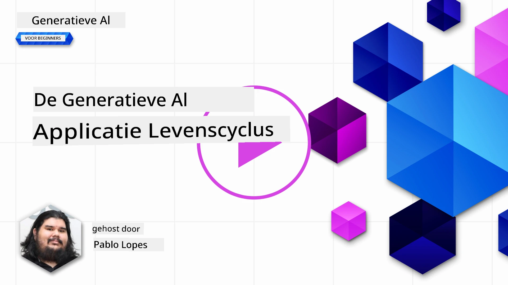
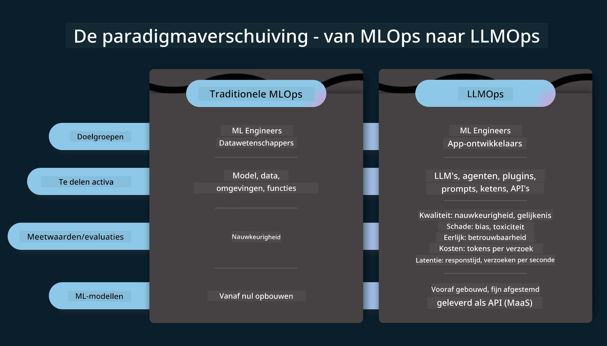
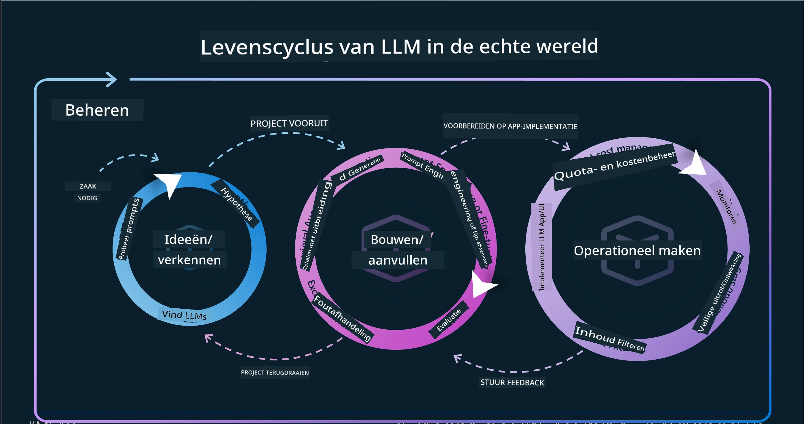
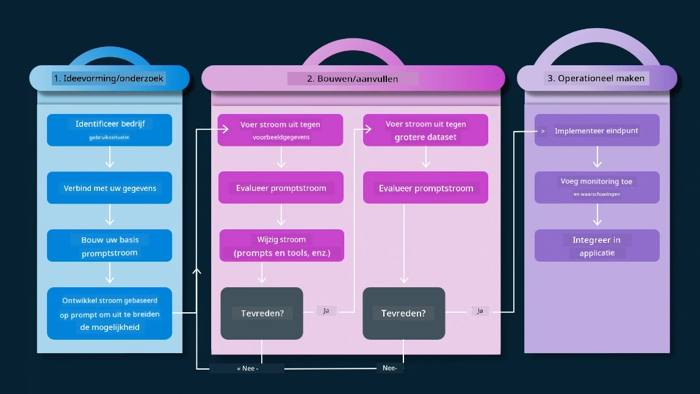
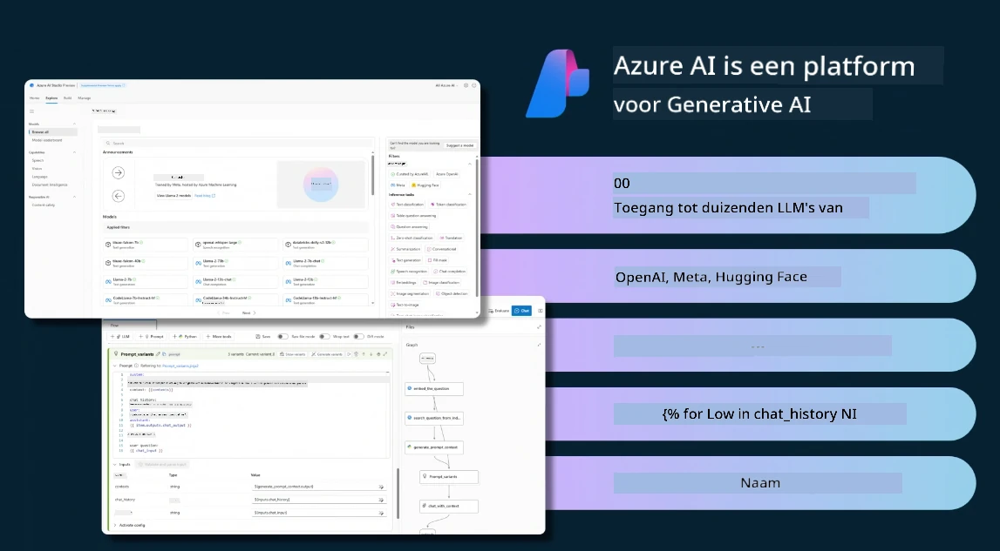
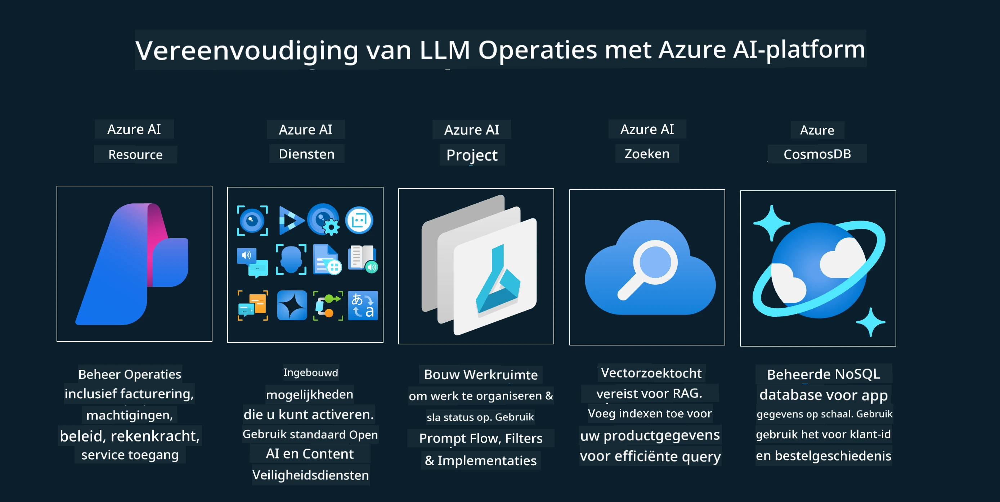
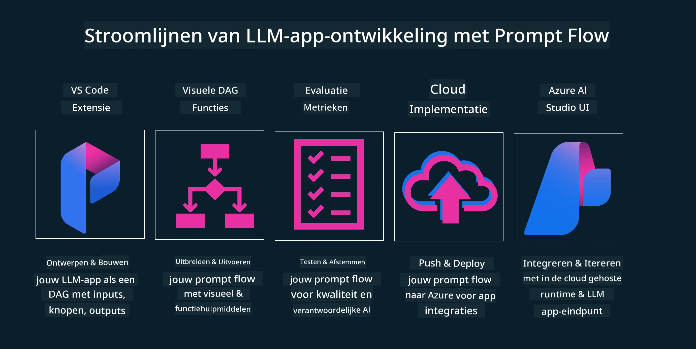

# De levenscyclus van een Generatieve AI-toepassing

Een belangrijke vraag voor alle AI-toepassingen is de relevantie van AI-functies, aangezien AI een snel evoluerend vakgebied is. Om ervoor te zorgen dat uw toepassing relevant, betrouwbaar en robuust blijft, moet u deze continu monitoren, evalueren en verbeteren. Dit is waar de generatieve AI-levenscyclus om de hoek komt kijken.

De generatieve AI-levenscyclus is een raamwerk dat u begeleidt door de fasen van het ontwikkelen, inzetten en onderhouden van een generatieve AI-toepassing. Het helpt u uw doelen te definiëren, uw prestaties te meten, uw uitdagingen te identificeren en uw oplossingen te implementeren. Het helpt u ook uw toepassing af te stemmen op de ethische en juridische normen van uw domein en uw belanghebbenden. Door de generatieve AI-levenscyclus te volgen, kunt u ervoor zorgen dat uw toepassing altijd waarde levert en uw gebruikers tevredenstelt.

## Inleiding

In dit hoofdstuk leert u:

- Het paradigmaverschuiving begrijpen van MLOps naar LLMOps
- De LLM-levenscyclus
- Levenscyclusgereedschappen
- Levenscyclusmetrieken en evaluatie

## Het paradigmaverschuiving van MLOps naar LLMOps begrijpen

LLM's zijn een nieuw hulpmiddel in het arsenaal van Kunstmatige Intelligentie; ze zijn ongelooflijk krachtig in analyse- en generatieopdrachten voor toepassingen, maar deze kracht heeft consequenties voor hoe we AI- en klassieke machine learning-taken stroomlijnen.

Hiervoor hebben we een nieuw paradigma nodig om dit hulpmiddel dynamisch en met de juiste prikkels aan te passen. We kunnen oudere AI-apps categoriseren als "ML-apps" en nieuwere AI-apps als "GenAI-apps" of gewoon "AI-apps", wat de gangbare technologie en technieken op dat moment weerspiegelt. Dit verschuift ons narratief op meerdere manieren, kijk naar de volgende vergelijking.

Merk op dat in LLMOps we meer gericht zijn op de app-ontwikkelaars, waarbij integraties een centraal punt zijn, gebruikmakend van "Models-as-a-Service" en denkend aan de volgende punten voor metrics.

- Kwaliteit: Reactiekwaliteit
- Schade: Verantwoorde AI
- Eerlijkheid: Onderbouwing van antwoord (Is het logisch? Is het correct?)
- Kosten: Oplossingsbudget
- Latentie: Gem. tijd voor tokenreactie

## De LLM-levenscyclus

Om eerst de levenscyclus en de aanpassingen te begrijpen, bekijken we de volgende infographic.

Zoals u kunt zien, verschilt dit van de gebruikelijke levenscycli van MLOps. LLM's hebben veel nieuwe vereisten, zoals Prompting, verschillende technieken om kwaliteit te verbeteren (Fine-Tuning, RAG, Meta-Prompts), andere beoordeling en verantwoordelijkheid met verantwoorde AI, en ten slotte nieuwe evaluatiemetrics (Kwaliteit, Schade, Eerlijkheid, Kosten en Latentie).

Neem bijvoorbeeld een kijkje bij hoe we ideeën genereren. We gebruiken prompt engineering om te experimenteren met verschillende LLM's en mogelijkheden te verkennen om te testen of hun hypothese juist kan zijn.

Merk op dat dit niet lineair is, maar geïntegreerde lussen, iteratief en met een overkoepelende cyclus.

Hoe kunnen we die stappen onderzoeken? Laten we in detail bekijken hoe we een levenscyclus kunnen opbouwen.

Dit ziet er misschien wat ingewikkeld uit, laten we eerst focussen op de drie grote stappen.

1. Ideeën vormen/verkennen: Verkenning, hier kunnen we volgens onze zakelijke behoeften verkennen. Prototyping, het maken van een [PromptFlow](https://microsoft.github.io/promptflow/index.html?WT.mc_id=academic-105485-koreyst) en testen of dit efficiënt genoeg is voor onze hypothese.
1. Bouwen/Uitbreiden: Implementatie, nu beginnen we te evalueren voor grotere datasets implementeren we technieken zoals Fine-tuning en RAG om de robuustheid van onze oplossing te controleren. Als het niet werkt, kan het herimplementeren, het toevoegen van nieuwe stappen in onze flow of het herstructureren van data helpen. Na het testen van onze flow en onze schaal, als het werkt en onze metrics controleert, is het klaar voor de volgende stap.
1. Operationaliseren: Integratie, nu voegen we monitoring- en alarmsystemen aan ons systeem toe, deployment en applicatie-integratie in onze toepassing.

Daarna hebben we de overkoepelende managementcyclus, met focus op beveiliging, compliance en governance.

Gefeliciteerd, uw AI-app is nu klaar voor gebruik en operationeel. Voor een praktische ervaring, bekijk de [Contoso Chat Demo.](https://nitya.github.io/contoso-chat/?WT.mc_id=academic-105485-koreyst)

Welke tools kunnen we nu gebruiken?

## Levenscyclusgereedschappen

Voor tooling biedt Microsoft het [Azure AI Platform](https://azure.microsoft.com/solutions/ai/?WT.mc_id=academic-105485-koreyst) en [PromptFlow](https://microsoft.github.io/promptflow/index.html?WT.mc_id=academic-105485-koreyst) die uw cyclus faciliteren en het implementeren eenvoudig en klaar voor gebruik maken.

Het [Azure AI Platform](https://azure.microsoft.com/solutions/ai/?WT.mc_id=academic-105485-koreyst) stelt u in staat [AI Studio](https://ai.azure.com/?WT.mc_id=academic-105485-koreyst) te gebruiken. AI Studio is een webportaal waarmee u modellen, voorbeelden en tools kunt verkennen. U beheert uw bronnen, UI-ontwikkelstromen en SDK/CLI-opties voor code-first ontwikkeling.

Azure AI stelt u in staat meerdere bronnen te gebruiken om uw operaties, diensten, projecten, vectorzoekopdrachten en databankbehoeften te beheren.

Bouw vanaf Proof-of-Concept (POC) tot grootschalige toepassingen met PromptFlow:

- Ontwerp en bouw apps vanuit VS Code, met visuele en functionele tools
- Test en verfijn uw apps voor kwalitatieve AI, gemakkelijk.
- Gebruik Azure AI Studio om te integreren en itereren met de cloud, push en deployment voor snelle integratie.

## Geweldig! Ga door met leren!

Geweldig, leer nu meer over hoe we een toepassing structureren om de concepten te gebruiken met de [Contoso Chat App](https://nitya.github.io/contoso-chat/?WT.mc_id=academic-105485-koreyst), om te zien hoe Cloud Advocacy die concepten toevoegt in demonstraties. Voor meer inhoud, bekijk onze [Ignite breakout sessie!
](https://www.youtube.com/watch?v=DdOylyrTOWg)

Bekijk nu Les 15 om te begrijpen hoe [Retrieval Augmented Generation en Vector Databases](../15-rag-and-vector-databases/README.md?WT.mc_id=academic-105485-koreyst) invloed hebben op Generatieve AI en om meer boeiende toepassingen te maken!

---

<!-- CO-OP TRANSLATOR DISCLAIMER START -->
**Vrijwaring**:
Dit document is vertaald met behulp van de AI-vertalingsdienst [Co-op Translator](https://github.com/Azure/co-op-translator). Hoewel we streven naar nauwkeurigheid, dient u er rekening mee te houden dat geautomatiseerde vertalingen fouten of onnauwkeurigheden kunnen bevatten. Het oorspronkelijke document in de oorspronkelijke taal moet worden beschouwd als de gezaghebbende bron. Voor kritieke informatie wordt een professionele menselijke vertaling aanbevolen. Wij zijn niet aansprakelijk voor eventuele misverstanden of verkeerde interpretaties die voortvloeien uit het gebruik van deze vertaling.
<!-- CO-OP TRANSLATOR DISCLAIMER END -->